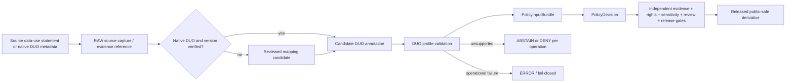

<!-- [KFM_META_BLOCK_V2]
doc_id: kfm://doc/standard/duo-profile
title: GA4GH Data Use Ontology (DUO) — KFM Profile Boundary and Graduation Plan
type: standard; external-ontology-profile; consent-and-data-use-boundary
version: v2.0-draft
status: "draft; repository-grounded; upstream-currentness-refreshed; no-adoption; no-policy-activation; no-conformance-proof; no-release; no-publication"
owners:
  - "@bartytime4life — verified GitHub review route through CODEOWNERS"
  - "NEEDS VERIFICATION — consent, privacy, genomics, ontology, policy, security, release, correction, and independent-review stewards"
created: 2026-05-24
updated: 2026-08-18
policy_label: repository-facing; standards-guidance; consent; privacy; genomics; no-credentials
owning_root: docs/
current_path: docs/standards/DUO_PROFILE.md
responsibility: >
  Explain the official GA4GH Data Use Ontology baseline, its narrow semantic role,
  the bounded KFM profile proposal, the current repository evidence and conflicts,
  and the gates required before KFM may claim DUO adoption, policy enforcement,
  conformance, release, or interoperability.
truth_posture: >
  CONFIRMED current path, standards-lane placement, review route, related DUO and
  consent documentation, consent-schema placeholder state, consent-policy parent
  state, and dated official DUO publication facts / PROPOSED KFM applicability,
  annotation object, mirror, mappings, policy binding, validators, fixtures,
  producers, consumers, and graduation sequence / UNKNOWN adopted KFM DUO
  profile, canonical DUO annotation contract or schema, local ontology mirror,
  executable matcher, active policy bundle, production consent records, runtime
  enforcement, released DUO-bearing artifact, or external interoperability.
evidence_snapshot:
  repository: bartytime4life/Kansas-Frontier-Matrix
  base_ref: main
  base_commit: 31503aaadcf430499c5e3181f759db6b582a84c0
  target_prior_blob: a4283dac33ec9f2c182a8be0cb0d23a3e1ba13e0
  standards_readme_blob: a8cbe5d183448d5f0de37f8a4eacd6fcaca0d71b
  consent_tokens_blob: 3b8ce6326f7d2a846116e00144cb065b82d43ffc
  consent_schema_readme_blob: f3df7888166287e4a86c3696204b64799b995eab
  consent_policy_readme_blob: 7dbae5ea1434ecf896176a891dadefea76913999
  restricted_consent_readme_blob: fa7ea7c95a473a7fd498053536ca0b72b17461f6
  prov_family_readme_blob: 18401c4e75cab2f8f4714536cda46a03f379381b
external_currentness_review:
  access_date: 2026-08-18
  issuer_scope: "GA4GH, OBO Foundry, and the official EBISPOT/DUO ontology repository"
  ga4gh_product_status: "Current; active engagement; last approved version DUO v1.0"
  approved_date: 2021-02-23
  ontology_document_iri: http://purl.obolibrary.org/obo/duo.owl
  ontology_version_iri: http://purl.obolibrary.org/obo/duo/releases/2021-02-23/duo.owl
related:
  - ./README.md
  - ./DUO_MAPPING.md
  - ./CONSENT_TOKENS.md
  - ./SENSITIVITY_RUBRIC.md
  - ./REDACTION_PROFILES.md
  - ./CANONICALIZATION.md
  - ../doctrine/directory-rules.md
  - ../doctrine/trust-membrane.md
  - ../../policy/consent/README.md
  - ../../policy/consent/people-dna-land/README.md
  - ../../contracts/policy/policy_input_bundle.md
  - ../../contracts/policy/policy_decision.md
  - ../../schemas/contracts/v1/consent/README.md
  - ../../schemas/contracts/v1/runtime/consent_grant.schema.json
  - ../../schemas/governance/consent_receipt.schema.json
tags: [kfm, standards, ga4gh, duo, data-use, consent, genomics, privacy, ontology, policy-boundary, cite-or-abstain]
notes:
  - "Same-path documentation modernization only; no contract, schema, policy, source, mirror, fixture, validator, code, workflow, lifecycle object, release, deployment, or public artifact changes."
  - "This revision does not adopt DUO for KFM or make DUO a legal, consent-validity, rights, sensitivity, review, release, or publication authority."
  - "The overlapping DUO_MAPPING.md remains a separate draft mapping guide and requires an independent role/convergence decision."
  - "Incorrect prior mappings for DUO:0000045, DUO:0000046, and geographical restriction are corrected against the official ontology."
  - "The prior ConsentSidecar example is replaced by a non-canonical illustrative annotation because current repository evidence does not establish ConsentSidecar as a canonical machine object family."
[/KFM_META_BLOCK_V2] -->

<a id="top"></a>
<a id="ga4gh-data-use-ontology-duo--kfm-standards-profile"></a>

# GA4GH Data Use Ontology (DUO) — KFM Profile Boundary and Graduation Plan

> **Purpose.** Explain how KFM may reference GA4GH DUO terms for bounded data-use annotations—without confusing an ontology term, consent statement, credential, crosswalk, policy result, or passing validator with consent validity, lawful authority, source rights, sensitivity clearance, evidence closure, release approval, or publication.


> [!IMPORTANT]
> **A standards page is not conformance or policy proof.** This document does not adopt DUO, validate a consent grant, define a KFM consent object, activate a policy bundle, authorize data use, approve a release, or prove that a producer, matcher, evaluator, or consumer interoperates.

> [!CAUTION]
> **DUO has a narrow role.** It supplies machine-readable terms for data-use permissions and conditions, principally for human genomics, health, clinical, and biomedical research data. It does not establish the legal validity of consent, authenticate a requester, grant a redistribution license, settle privacy law, classify sensitivity, or authorize publication.

> [!WARNING]
> **Current KFM DUO enforcement is not established.** Repository evidence confirms human-readable DUO guidance, a separate draft mapping page, consent-policy documentation, and consent-related scaffolds. It does not establish a canonical DUO annotation schema, local mirror, deterministic matcher, DUO-specific validator, active parent consent policy, production consent records, released DUO-bearing artifact, or deployed enforcement.

| Field | Current bounded result |
|---|---|
| **Directory result** | `PLACE` at the existing `docs/standards/DUO_PROFILE.md` path under the adopted standards-guidance lane |
| **Official upstream baseline** | GA4GH lists **DUO v1.0** as current/maintained and approved on **2021-02-23** |
| **Ontology baseline** | Latest ontology document PURL currently declares version IRI `.../releases/2021-02-23/duo.owl` |
| **KFM adoption state** | **UNKNOWN / NOT ESTABLISHED**; no accepted KFM DUO profile decision was established in this review |
| **Machine-shape state** | `schemas/contracts/v1/consent/` is a compatibility placeholder; no DUO annotation schema was established |
| **Policy state** | `policy/consent/` is documentation-led and evaluator-unbound at the parent lane; bounded domain consent/revocation profiles do not prove DUO enforcement |
| **Mapping state** | `DUO_MAPPING.md` exists as a separate draft proposal; no executable or authoritative mapping table was established |
| **Release/publication effect** | None |

**Quick navigation:** [Purpose](#1-purpose) · [Authority](#2-authority-and-standing) · [Scope](#3-scope-of-kfm-adoption) · [Conformance](#4-kfm-conformance-posture) · [Terms](#5-canonical-vocabulary-fragment) · [Identity](#6-identity-versioning-mirror) · [Trust membrane](#7-integration-with-kfm-trust-membrane) · [Crosswalks](#8-consent-input-crosswalks) · [Failures](#9-failure-modes-and-deny-by-default) · [Tensions](#10-tensions-and-known-limits) · [Questions](#11-open-questions) · [Evidence](#12-related-docs) · [Example](#appendix-a--consentsidecar-worked-example) · [Checklist](#appendix-b--verification-checklist)

---

<a id="1-purpose"></a>

## 1. Purpose, authority, and non-effects

### 1.1 What this page owns

This page owns human-readable guidance for:

- the official DUO product and ontology baseline;
- the distinction between a DUO term and a KFM policy decision;
- a bounded **candidate** KFM usage profile;
- selected term identity and versioning rules;
- the relationship among DUO, `DUO_MAPPING.md`, consent credentials, source evidence, policy, review, and release;
- known repository gaps and contradictory proposal-era claims; and
- the graduation evidence required before KFM may claim DUO adoption or conformance.

### 1.2 What this page does not own

| Question | Owning authority |
|---|---|
| Where this guidance belongs | Accepted Directory Rules, the parent `docs/` contract, and [`docs/standards/README.md`](./README.md) |
| What a KFM consent, grant, annotation, policy input, or decision means | Accepted semantic contracts under `contracts/` |
| What machine shape is valid | Accepted schemas under `schemas/` |
| Whether a proposed use is allowed, denied, restricted, or abstained | `policy/` plus governed review |
| Whether a source statement or consent record is authentic | Source authority, evidence, identity, custody, and qualified review |
| Whether a use is lawful | Applicable law and qualified legal/privacy review |
| Whether an artifact may release or publish | Evidence, rights, sensitivity, review, proof, release, correction, and rollback authorities |
| What DUO terms normatively mean | GA4GH / the official DUO ontology release |

### 1.3 Non-effects

This same-path documentation revision does **not**:

- adopt DUO as KFM policy;
- make DUO mandatory for every human-related record;
- define `ConsentSidecar`, `DUOMapping`, or another KFM object family;
- create or approve a mirror or vocabulary registry path;
- add a DUO field to an existing contract or schema;
- define a FamilySearch, DTC-vendor, GEDCOM, oral-history, or partner crosswalk;
- activate OAuth, Passport, VC, JWT, status-list, or introspection behavior;
- accept `DUO_MAPPING.md` as machine or policy authority;
- activate a source, policy evaluator, release, deployment, or public surface.

[Back to top](#top)

---

<a id="2-authority-and-standing"></a>

## 2. Authority and standing

### 2.1 Official upstream baseline

| Surface | Official status checked 2026-08-18 | KFM consequence |
|---|---|---|
| Product | GA4GH Data Use Ontology; lifecycle `Current`; active engagement | External standards reference only |
| Last approved version | `DUO v1.0`, approved 2021-02-23 | Reference baseline for this page |
| Maintaining work stream | GA4GH Data Use & Researcher Identities (DURI) | External issuer context |
| Ontology document IRI | `http://purl.obolibrary.org/obo/duo.owl` | Stable latest-document locator |
| Current ontology version IRI | `http://purl.obolibrary.org/obo/duo/releases/2021-02-23/duo.owl` | Exact semantic/version baseline |
| Term IRI pattern | `http://purl.obolibrary.org/obo/DUO_NNNNNNN` | Stable term identity |
| Source repository | `https://github.com/EBISPOT/DUO` | Official source and issue history |
| OBO Foundry registration | Registered DUO ontology | External ontology-governance context |
| License | Creative Commons Attribution 4.0 | Applies to ontology material; does not license KFM source data |

Official references:

- GA4GH product page: <https://www.ga4gh.org/product/data-use-ontology-duo/>
- Official ontology repository: <https://github.com/EBISPOT/DUO>
- OBO Foundry registration: <https://obofoundry.org/ontology/duo.html>
- Latest ontology document: <http://purl.obolibrary.org/obo/duo.owl>

### 2.2 What upstream publication proves

DUO provides terms that describe data-use permissions and optional modifiers, and it supports matching a dataset's restrictions to a research purpose. Disease-specific use is modeled with an associated disease term; the official materials recommend MONDO for automated evaluation.

Upstream publication does **not** prove that KFM:

- has adopted the standard;
- has a conforming annotation object;
- mirrors or validates the ontology;
- maps any partner's consent or access language correctly;
- has a compatible research-purpose matcher;
- has a lawful basis to process a dataset;
- enforces DUO in policy or runtime;
- has released a DUO-bearing artifact.

### 2.3 Stable term identity versus ontology-version identity

Keep these identities separate:

```text
term IRI:              http://purl.obolibrary.org/obo/DUO_0000042
latest document IRI:   http://purl.obolibrary.org/obo/duo.owl
version document IRI:  http://purl.obolibrary.org/obo/duo/releases/2021-02-23/duo.owl
CURIE/display form:    DUO:0000042
shorthand/display:     GRU
```

A term remains identified by its stable term IRI. The dated ontology version IRI records which release supplied the label, definition, hierarchy, and deprecation state used for an evaluation. Do not replace a stable term IRI with the ontology document IRI.

[Back to top](#top)

---

<a id="3-scope-of-kfm-adoption"></a>

## 3. Scope of KFM adoption

### 3.1 Upstream scope

DUO is designed primarily for tagging data-use conditions on human genomics, health, clinical, and biomedical research datasets and for comparing those conditions with a proposed research purpose.

### 3.2 Candidate KFM applicability

No KFM adoption decision is established by this page. The table below is a bounded proposal for review—not an active requirement.

| Material or operation | Candidate DUO role | Current KFM state |
|---|---|---|
| Controlled human genomic or health-research dataset | Represent reviewed secondary-use permissions and modifiers | **PROPOSED; strongest fit** |
| Research-purpose request against a DUO-tagged dataset | Supply terms to an approved compatibility matcher | **PROPOSED; matcher absent/unverified** |
| Disease-specific research restriction | Pair `DUO:0000007` with a governed disease-ontology term | **PROPOSED; MONDO profile/binding unresolved** |
| DTC genomic export or vendor-specific consent | Preserve vendor terms, then use a reviewed versioned crosswalk only where support is adequate | **PROPOSED / high-risk / no crosswalk established** |
| Genealogy or GEDCOM material involving living people | DUO may describe a bounded research-use condition, but privacy, consent, source terms, relation sensitivity, and living-person policy remain independent | **CONDITIONAL / NEEDS VERIFICATION** |
| Oral-history release | A qualified reviewer may map a bounded secondary-use clause where DUO fits; unmatched obligations remain explicit | **CONDITIONAL / no mapping authority established** |
| FamilySearch or another OAuth scope | Do not assume a direct DUO mapping; scope semantics, terms, audience, and version require evidence and review | **UNKNOWN / HOLD** |
| Deceased-only historical record with no human-subject research restriction | DUO may be unnecessary | **Applicability decision required** |
| Biodiversity, archaeology, cultural material, infrastructure, or exact-location sensitivity | DUO is not the governing vocabulary unless a distinct human research-use condition actually applies | **Out of scope for DUO itself** |

### 3.3 What DUO does not govern in KFM

DUO must not substitute for:

- consent validity, withdrawal, suspension, dispute, or holder authority;
- authentication, authorization credentials, requester identity, or organizational trust;
- source admission, source role, authenticity, custody, or evidence quality;
- copyright, contract terms, redistribution rights, or license compatibility;
- privacy law, data-subject rights, Indigenous data sovereignty, CARE, or cultural authority;
- sensitivity classification, geoprivacy, redaction, differential privacy, or harmful-precision controls;
- retention, embargo, deletion, correction, or cache invalidation;
- review, promotion, release, publication, or rollback.

> [!IMPORTANT]
> A DUO term can be a necessary policy input for a particular use. It is never sufficient evidence that the use is lawful, ethical, consented, rights-cleared, sensitive-safe, reviewed, or released.

[Back to top](#top)

---

<a id="4-kfm-conformance-posture"></a>

## 4. KFM conformance posture

### 4.1 Current maturity

| Capability | Current repository result |
|---|---|
| Human-readable DUO profile | **CONFIRMED present** at this path |
| Separate mapping guidance | **CONFIRMED present** at `DUO_MAPPING.md`; role and authority remain unresolved |
| Consent-token boundary guidance | **CONFIRMED present** at `CONSENT_TOKENS.md` |
| Consent schema family | **CONFIRMED placeholder**; `schemas/contracts/v1/consent/` contains an index/placement README, not DUO machine shape |
| Canonical DUO annotation contract | **Not established in this review** |
| Canonical DUO annotation schema | **Not established in this review** |
| Local DUO mirror and manifest | **Not established in bounded search** |
| Versioned partner crosswalks | **Not established in bounded search** |
| DUO-specific positive/negative fixtures | **Not established in bounded search** |
| DUO validator or research-purpose matcher | **Not established in bounded search** |
| Parent consent-policy evaluator binding | **Not established** |
| Producer and consumer implementation | **Not established in bounded search** |
| Released/public DUO-bearing artifact | **Not established** |

### 4.2 Candidate profile levels

| Level | Meaning | KFM state |
|---|---|---|
| **Reference** | Cite official terms and versions in human guidance | **Current documentation capability** |
| **Consume** | Accept stable DUO term IRIs and preserve the source ontology version | **PROPOSED** |
| **Annotate** | Emit a versioned KFM object that binds one or more DUO terms to a dataset/use claim | **PROPOSED; object family unresolved** |
| **Mirror** | Maintain integrity-checked local ontology bytes for deterministic, no-network validation | **PROPOSED; no mirror established** |
| **Crosswalk** | Map non-DUO source language to DUO through evidence-backed, reviewed mappings | **PROPOSED; `DUO_MAPPING.md` is guidance only** |
| **Match** | Evaluate research purpose against data-use conditions with declared reasoning semantics | **PROPOSED; no matcher established** |
| **Enforce** | Feed a validated annotation and match result into adopted policy rules | **UNKNOWN / not established** |
| **Interoperate** | Exchange tested artifacts with an independent implementation | **UNKNOWN / not established** |

### 4.3 Minimum graduation sequence

KFM should not claim DUO conformance until these close in dependency order:

1. approve the applicability boundary and exact upstream version;
2. define the semantic meaning of a KFM DUO annotation or binding;
3. choose and version the machine shape under the adopted schema route;
4. decide whether a local mirror is required and define its authority and retention;
5. define mapping governance and reconcile the role of `DUO_MAPPING.md`;
6. add valid, invalid, deprecated-term, version-mismatch, ambiguity, and sensitive-input fixtures;
7. implement a deterministic no-network validator with stable finite outcomes;
8. implement and test any research-purpose matcher separately from policy;
9. bind policy inputs and decisions without collapsing rights, sensitivity, evidence, or release;
10. prove at least one producer and one consumer at exact revisions;
11. add correction, supersession, withdrawal, and rollback behavior;
12. demonstrate independent interoperability before making external-conformance claims.

[Back to top](#top)

---

<a id="5-canonical-vocabulary-fragment"></a>

## 5. Canonical vocabulary fragment

The table is a **checked reference fragment**, not a KFM allowlist, policy bundle, mapping table, or substitute for the official ontology. Labels and hierarchy are pinned to the version IRI in §2.

### 5.1 Root categories and selected permissions

| CURIE | Official English label | Shorthand | Role |
|---|---|---:|---|
| `DUO:0000001` | data use permission | — | Root class for permission terms |
| `DUO:0000004` | no restriction | `NRES` | Permission |
| `DUO:0000042` | general research use | `GRU` | Permission |
| `DUO:0000006` | health or medical or biomedical research | `HMB` | Permission |
| `DUO:0000007` | disease specific research | `DS` | Permission; pair with a disease term |
| `DUO:0000011` | population origins or ancestry research only | `POA` | Permission |

### 5.2 Selected modifiers

| CURIE | Official English label | Shorthand | Role |
|---|---|---:|---|
| `DUO:0000017` | data use modifier | — | Root class for modifier terms |
| `DUO:0000015` | no general methods research | `NMDS` | Modifier |
| `DUO:0000018` | not for profit, non commercial use only | `NPUNCU` | Modifier |
| `DUO:0000019` | publication required | `PUB` | Modifier |
| `DUO:0000020` | collaboration required | `COL` | Modifier |
| `DUO:0000021` | ethics approval required | `IRB` | Modifier |
| `DUO:0000022` | geographical restriction | `GS` | Modifier; pair with a location term |
| `DUO:0000028` | institution specific restriction | `IS` | Modifier |
| `DUO:0000045` | not for profit organisation use only | `NPU` | Modifier |
| `DUO:0000046` | non-commercial use only | `NCU` | Modifier |

### 5.3 Corrections from the prior edition

The prior profile incorrectly described:

- `DUO:0000045` as a combined not-for-profit/non-commercial restriction;
- `DUO:0000046` as a geographic or ethnic restriction.

For the pinned ontology:

- `DUO:0000018` is the combined not-for-profit and non-commercial modifier (`NPUNCU`);
- `DUO:0000045` is not-for-profit-organisation use only (`NPU`);
- `DUO:0000046` is non-commercial use only (`NCU`); and
- `DUO:0000022` is geographical restriction (`GS`).

> [!CAUTION]
> Do not infer combination semantics from labels alone. An approved matcher and policy profile must define how multiple permission and modifier terms interact for a particular request. This page does not define that algorithm.

[Back to top](#top)

---

<a id="6-identity-versioning-mirror"></a>

## 6. Identity, versioning, and mirror boundary

### 6.1 Version recording

A future KFM DUO-bearing artifact should record, at minimum:

- each stable DUO term IRI used;
- the ontology document IRI;
- the exact ontology version IRI;
- the local profile version;
- whether the term came from native DUO metadata or a KFM-reviewed crosswalk;
- a reference to the mapping record where a crosswalk was used; and
- the digest profile for any locally held ontology bytes or derived index.

The stable term IRI remains the term identity. The ontology version IRI records the semantic snapshot used for validation or matching.

### 6.2 Local mirror posture

No KFM-local DUO mirror was established in bounded repository search. A mirror is therefore **PROPOSED**, not required current behavior.

If adopted, a mirror must keep distinct artifacts distinct:

| Artifact | Candidate integrity rule | Boundary |
|---|---|---|
| Raw official OWL bytes | SHA-256 over exact retrieved bytes | Reproducible source capture; no JSON canonicalization |
| Retrieval/source record | Existing source/receipt contract and digest rules | Records URL, version IRI, time, agent, and result |
| Derived JSON term index | Object-family projection followed by current JSON canonicalization and SHA-256 | Convenience derivative; never replaces OWL semantic authority |
| Validation report | Versioned finite result with input digests | Does not adopt or release the ontology |

> [!IMPORTANT]
> RFC 8785 JCS applies only to an admitted JSON value. It is not an RDF or OWL canonicalization algorithm. Do not compute a JCS digest over an undefined “normalized term table” and present it as the ontology's canonical identity.

### 6.3 No hidden network dependency

A production validator or policy evaluator must not silently fetch a mutable latest PURL during a consequential decision. It should operate against pinned, integrity-checked inputs or fail closed. Any retrieval job remains a source/update process, not a runtime policy shortcut.

### 6.4 Deprecation and replay

The DUO project states that identifiers are not deleted; meaning-changing updates use deprecation and a new identifier. A KFM adoption would still need:

- historical ontology bytes or an immutable source reference;
- replay fixtures for records carrying deprecated terms;
- an explicit migration result rather than silent rewriting;
- consumer compatibility checks;
- a migration receipt and rollback target; and
- correction propagation where public artifacts depend on the changed interpretation.

### 6.5 Version transition gate

Changing the pinned DUO version should be treated as a governed dependency migration. At minimum, review:

1. ontology byte digest and version IRI;
2. added, changed, and deprecated terms;
3. affected annotations and crosswalk rows;
4. matcher and policy behavior;
5. fixtures and negative cases;
6. producer and consumer compatibility;
7. release/correction impact; and
8. rollback to the prior version.

[Back to top](#top)

---

<a id="7-integration-with-kfm-trust-membrane"></a>

## 7. Integration with KFM trust membrane

### 7.1 Candidate governed flow

The flow below is **PROPOSED**. It preserves KFM's lifecycle and keeps ontology semantics separate from evidence, consent, rights, policy, and release.


```mermaid
flowchart LR
    S["Source data-use statement or native DUO metadata"] --> R["RAW source capture / evidence reference"]
    R --> Q{"Native DUO and version verified?"}
    Q -- yes --> A["Candidate DUO annotation"]
    Q -- no --> M["Reviewed mapping candidate"]
    M --> A
    A --> V["DUO profile validation"]
    V --> P["PolicyInputBundle"]
    P --> D["PolicyDecision"]
    D --> G["Independent evidence + rights + sensitivity + review + release gates"]
    G --> X["Released public-safe derivative"]

    V -- unsupported --> B["ABSTAIN or DENY per operation"]
    V -- operational failure --> E["ERROR / fail closed"]
```

There is no direct path from a DUO term, crosswalk, consent credential, validator pass, or policy result to `PUBLISHED`.

### 7.2 Current authority map

| Surface | Current role | What it cannot prove |
|---|---|---|
| [`DUO_PROFILE.md`](./DUO_PROFILE.md) | External standards guidance | Adoption or enforcement |
| [`DUO_MAPPING.md`](./DUO_MAPPING.md) | Draft mapping proposal | Canonical mapping object, schema, table, or executable mapper |
| [`CONSENT_TOKENS.md`](./CONSENT_TOKENS.md) | Credential/token interoperability boundary | Consent validity, issuer trust, or production verification |
| [`policy/consent/README.md`](../../policy/consent/README.md) | Parent consent-policy boundary and current-state disclosure | Accepted parent rule, evaluator binding, or production decision |
| `PolicyInputBundle` / `PolicyDecision` contracts | Existing policy semantics | DUO-specific fields or active rules unless separately proven |
| `schemas/contracts/v1/consent/README.md` | Compatibility placeholder/index | DUO or ConsentSidecar machine shape |
| Evidence and release families | Support and publication accountability | Consent or policy by themselves |

### 7.3 Decision separation

A future DUO-aware evaluation should keep at least these independent determinations visible:

1. **Source/evidence result** — is the asserted restriction or permission supported and attributable?
2. **DUO profile result** — are term identity, version, hierarchy, and mapping valid under the adopted profile?
3. **Research-purpose compatibility result** — does an approved matcher find the request compatible with the annotated conditions?
4. **Consent/authorization result** — does the governing consent or authorization permit the operation now?
5. **Rights result** — may KFM retrieve, process, redistribute, or expose the material?
6. **Sensitivity result** — is the requested precision and audience safe?
7. **Review/release result** — has the derivative been reviewed and released with correction and rollback support?

A positive result in one determination never silently supplies another.

[Back to top](#top)

---

<a id="8-consent-input-crosswalks"></a>

## 8. Consent input crosswalks

### 8.1 Relationship to `DUO_MAPPING.md`

`DUO_MAPPING.md` is a tracked sibling standards document. It proposes translation artifacts and mappings for non-GA4GH inputs. This profile does not accept those object names, paths, hash grammar, signature profile, or mapping tables as current authority.

A future convergence decision should distinguish:

- **this page:** official DUO baseline, KFM applicability boundary, term/version rules, and graduation requirements;
- **mapping guidance:** how a particular source statement is reviewed and mapped to DUO terms;
- **contracts/schemas:** what a mapping or annotation means and how it is shaped;
- **policy:** how validated terms and match results influence an admissibility decision;
- **fixtures/tests:** what positive and negative behavior is proven.

### 8.2 Minimum mapping record

A reviewed mapping should preserve enough evidence to reconstruct the decision without storing credentials or unnecessary sensitive text in public surfaces.

| Field or relation | Minimum purpose |
|---|---|
| Source statement reference and digest | Identifies the exact consent/data-use language evaluated |
| Source authority and version/date | Preserves issuer context and terms version |
| Input family | Distinguishes native DUO, consent form, data-use letter, partner scope, or other source |
| Mapping profile/version | Makes the mapping rules replayable |
| DUO term IRIs and ontology version IRI | Preserves output identity and semantics |
| Coupled disease/location/organization term where required | Completes restrictions such as DS, GS, or IS |
| Reviewer and review state | Records accountable human interpretation where needed |
| Unmapped or ambiguous clauses | Prevents unsupported broadening |
| EvidenceRef / support reference | Makes the mapping inspectable |
| Correction/supersession reference | Allows the mapping to be changed without erasing history |

### 8.3 Mapping rules

1. **No inferred consent.** Context, possession, public accessibility, OAuth success, or a vendor export does not by itself establish a DUO permission.
2. **No silent broadening.** Unmapped or ambiguous language stays explicit and yields a restrictive, held, or abstaining result—not a broader term.
3. **No automatic FamilySearch mapping.** A documented, versioned source-scope analysis is required before any FamilySearch OAuth scope is mapped to DUO.
4. **No universal DTC mapping.** Each vendor's terms, consent version, export route, purpose, and downstream-use constraints require separate evidence and review.
5. **Native versus mapped stays visible.** Consumers must be able to distinguish an upstream-native DUO annotation from a KFM-created crosswalk.
6. **No reverse consent generation.** KFM must not generate legally operative consent language from a set of DUO terms.
7. **No credential disclosure.** Tokens, visas, subject identifiers, raw consent records, and private status responses do not belong in public docs, fixtures, issues, PR text, tiles, or logs.
8. **Mapping is not policy.** A valid mapping can feed policy; it cannot approve use or release.

### 8.4 Machine-Readable Consent Guidance

GA4GH's Machine-Readable Consent Guidance is relevant to translating consent information into DUO-compatible structured data. KFM has not established an adopted MRCG profile, mapping schema, or validator. Any use remains **PROPOSED** until the exact guidance version, object boundary, mapping procedure, and review requirements are approved.

[Back to top](#top)

---

<a id="9-failure-modes-and-deny-by-default"></a>

## 9. Failure modes and deny-by-default

The exact validator and policy reason-code registries remain unresolved. The following are required **behavioral postures**, not claims of current implementation.

| Condition | Required bounded posture |
|---|---|
| Unknown or malformed DUO term IRI | Reject profile conformance; do not guess |
| Term absent from the pinned ontology version | `DENY` for profile validation or explicit unsupported-version result |
| Deprecated term | Preserve legacy identity and require an explicit migration/replay result; never silently replace |
| Missing ontology version IRI | Hold or deny consequential evaluation until semantic baseline is known |
| Term label disagrees with pinned ontology | Ontology wins; reject stale local label/index |
| Required coupled disease/location/institution context is missing | `ABSTAIN` or `DENY` according to the requested operation |
| Mapping lacks source support or accountable review | `ABSTAIN`; `DENY` where policy requires a valid mapping |
| Mapping broadens ambiguous language | `DENY` and open correction/review work |
| Mirror or index digest mismatch | `ERROR` and fail closed |
| Matcher is unavailable or returns an unrecognized result | `ERROR`; never fallback to allow |
| DUO permits the research purpose but rights or consent are unresolved | `DENY` or hold; DUO cannot supply the missing authority |
| Sensitivity, living-person, DNA, cultural, or precision posture is unresolved | `DENY`, redact, generalize, quarantine, or stage access |
| Release, correction, or rollback support is absent | Hold publication |
| Active credential or private consent material appears in a public artifact | `DENY`, remove exposure, and follow the applicable security/correction process |

### 9.1 Separation of duties

For policy-significant mappings, the actor who interprets source consent/data-use language should not be the sole actor who approves the downstream release. Where team size prevents full separation, the compensating review, scope, and exception must be explicit and auditable.

### 9.2 Corrections and withdrawals

A later consent event, corrected data-use letter, ontology migration, or mapping correction must supersede prior state without deleting the earlier decision. Public derivatives, caches, indexes, search, map views, exports, and AI surfaces must follow governed correction and withdrawal propagation before any claim of effective revocation or correction.

[Back to top](#top)

---

<a id="10-tensions-and-known-limits"></a>

## 10. Tensions and known limits

| ID | Tension or conflict | Current disposition |
|---|---|---|
| `DUO-001` | Prior prose treated KFM DUO adoption as confirmed doctrine and implementation requirement | **NARROWED:** adoption is not established by current repo evidence |
| `DUO-002` | `DUO_PROFILE.md` and `DUO_MAPPING.md` overlap in scope and both make implementation-bearing proposals | **CONFLICTED / HOLD:** define reference-profile versus mapping-guide roles before convergence |
| `DUO-003` | Current consent schema lane is a compatibility placeholder, while older docs name canonical `ConsentSidecar` and `DUOMapping` schemas | **CONFLICTED / HOLD:** no machine object authority inferred |
| `DUO-004` | Parent `policy/consent/` is evaluator-unbound; domain consent placement and vocabulary remain partially conflicted | **NEEDS VERIFICATION / HOLD** |
| `DUO-005` | DUO's genomics/health-research scope is narrower than KFM's genealogy, oral-history, and living-person corpus | **CONDITIONAL:** apply only with explicit fit and independent controls |
| `DUO-006` | DUO can support access/use matching but is not a legal-compliance or consent-validity ontology | **BOUNDARY:** qualified legal/privacy and consent review remain independent |
| `DUO-007` | Official DUO v1.0 remains current while its version IRI is dated 2021-02-23 | **CONFIRMED external state:** age alone does not authorize KFM to invent a successor |
| `DUO-008` | The prior term table conflated NPU, NCU, NPUNCU, and GS | **CORRECTED in this revision** |
| `DUO-009` | The prior page required stable term IRIs to resolve to the dated ontology-document PURL | **CORRECTED:** term and ontology-version identities remain separate |
| `DUO-010` | The former `PROV/README.md` body was byte-identical to this DUO profile | **CORRECTED elsewhere:** the PROV family README now has its own repository-grounded body; no action here |
| `DUO-011` | The current filename is tracked and indexed; old proposal-era prose suggested a rename to `DUO.md` | **NO STRUCTURAL CHANGE:** same-path update; any rename requires separate consumer/link/identity review |

[Back to top](#top)

---

<a id="11-open-questions"></a>

## 11. Open questions

| ID | Question | Resolution evidence required |
|---|---|---|
| `DUO-Q01` | Will KFM adopt DUO, and for which exact domains, object families, and operations? | Accepted profile/architecture decision with scope and non-goals |
| `DUO-Q02` | What KFM object carries a DUO annotation or match result? | Semantic contract and accepted object-family relationship |
| `DUO-Q03` | What machine schema and validator own the profile? | Placement-confirmed schema, fixtures, validator, and tests |
| `DUO-Q04` | Is a local ontology mirror required, and where does logical registry authority live? | Directory decision, source/mirror contract, manifest, retention, updater, and rollback |
| `DUO-Q05` | What is the authoritative relationship between `DUO_PROFILE.md` and `DUO_MAPPING.md`? | Reviewed document-role and supersession/convergence decision |
| `DUO-Q06` | Which source families may be crosswalked, by whom, and under what evidence threshold? | Mapping governance, reviewer roles, source-specific profiles, and negative fixtures |
| `DUO-Q07` | What algorithm and semantics govern permission/modifier combination and research-purpose matching? | Matcher contract, ontology reasoning profile, fixtures, and independent review |
| `DUO-Q08` | How are disease-specific terms bound to MONDO or another disease ontology? | Versioned disease-term profile and compatibility/migration rules |
| `DUO-Q09` | How do consent credentials, status, revocation, and DUO annotations relate without collapsing into one object? | Accepted contracts, security model, policy inputs, and revocation/correction tests |
| `DUO-Q10` | How do rights, privacy law, sensitivity, CARE, living-person, and DNA controls combine with DUO? | Independent policy-family contracts and composition tests |
| `DUO-Q11` | Who owns ontology currentness, mapping review, policy interpretation, security, and release approval? | Verified role assignments and separation-of-duties record |
| `DUO-Q12` | What evidence is sufficient to claim external interoperability? | Exact-version producer/consumer exchange and independently observed result |

[Back to top](#top)

---

<a id="12-related-docs"></a>

## 12. Related docs and evidence ledger

### 12.1 Repository evidence

| Surface | Role in this revision | Limitation |
|---|---|---|
| [`docs/standards/README.md`](./README.md) | Standards-lane boundary, inventory, and mixed-maturity disclosure | Does not adopt DUO |
| [`DUO_MAPPING.md`](./DUO_MAPPING.md) | Existing mapping guidance | Proposal-era object/path/hash claims; not machine or policy authority |
| [`CONSENT_TOKENS.md`](./CONSENT_TOKENS.md) | Repository-grounded credential/token boundary | Does not establish a DUO binding or consent validity |
| [`SENSITIVITY_RUBRIC.md`](./SENSITIVITY_RUBRIC.md) | Existing sensitivity guidance | Draft and independent from DUO permissions |
| [`REDACTION_PROFILES.md`](./REDACTION_PROFILES.md) | Existing redaction guidance | Redaction cannot be inferred from DUO alone |
| [`CANONICALIZATION.md`](./CANONICALIZATION.md) | Current JSON hashing boundary | Does not provide RDF/OWL canonicalization |
| [`policy/consent/README.md`](../../policy/consent/README.md) | Parent consent-policy status and boundary | No accepted parent evaluator binding or production enforcement established |
| [`policy/consent/people-dna-land/README.md`](../../policy/consent/people-dna-land/README.md) | Restricted-domain consent boundary | Placement and execution remain conflicted or unproved |
| [`contracts/policy/policy_input_bundle.md`](../../contracts/policy/policy_input_bundle.md) | Policy-input semantics | DUO-specific binding not established by this page |
| [`contracts/policy/policy_decision.md`](../../contracts/policy/policy_decision.md) | Canonical policy-decision semantics | Positive decision is still not release authority |
| [`schemas/contracts/v1/consent/README.md`](../../schemas/contracts/v1/consent/README.md) | Consent-family placement placeholder | No DUO annotation schema |
| [`schemas/contracts/v1/runtime/consent_grant.schema.json`](../../schemas/contracts/v1/runtime/consent_grant.schema.json) | Existing consent-related scaffold | Does not prove an adopted credential/profile |
| [`schemas/governance/consent_receipt.schema.json`](../../schemas/governance/consent_receipt.schema.json) | Existing governance scaffold | Does not define DUO mapping or enforcement |

### 12.2 Official external evidence

- GA4GH Data Use Ontology product page: <https://www.ga4gh.org/product/data-use-ontology-duo/>
- DUO official repository and documentation: <https://github.com/EBISPOT/DUO>
- OBO Foundry DUO registration: <https://obofoundry.org/ontology/duo.html>
- Latest ontology document PURL: <http://purl.obolibrary.org/obo/duo.owl>
- GA4GH Machine-Readable Consent Guidance: <https://www.ga4gh.org/product/machine-readable-consent-guidance/>

Official publication establishes upstream meaning and version state. It does not establish KFM adoption, implementation, lawful use, policy activation, release, or publication.

[Back to top](#top)

---

<a id="appendix-a--consentsidecar-worked-example"></a>

## Appendix A — Illustrative DUO annotation record

The old anchor is retained for inbound-link compatibility. Current repository evidence does not establish `ConsentSidecar` as a canonical KFM machine object, so the example uses a deliberately non-canonical name and `example.invalid` identities.

```json
{
  "object_type": "IllustrativeDUOAnnotation",
  "profile_status": "PROPOSED",
  "subject_ref": "https://example.invalid/kfm/dataset/synthetic-001",
  "ontology": {
    "document_iri": "http://purl.obolibrary.org/obo/duo.owl",
    "version_iri": "http://purl.obolibrary.org/obo/duo/releases/2021-02-23/duo.owl",
    "source_digest": "sha256:<64-lowercase-hex>"
  },
  "terms": [
    {
      "iri": "http://purl.obolibrary.org/obo/DUO_0000042",
      "curie": "DUO:0000042",
      "role": "permission"
    },
    {
      "iri": "http://purl.obolibrary.org/obo/DUO_0000046",
      "curie": "DUO:0000046",
      "role": "modifier"
    }
  ],
  "mapping": {
    "native_duo": false,
    "mapping_record_ref": "https://example.invalid/kfm/evidence-ref/synthetic-mapping-001",
    "review_state": "NEEDS_VERIFICATION"
  },
  "non_authority": [
    "not_consent",
    "not_legal_basis",
    "not_rights_clearance",
    "not_sensitivity_clearance",
    "not_policy_decision",
    "not_release_approval"
  ]
}
```

This example demonstrates identity separation only. It is not a fixture, schema, consent grant, policy input, matching result, release object, or permission to use real data.

[Back to top](#top)

---

<a id="appendix-b--verification-checklist"></a>

## Appendix B — Verification checklist

### Current documentation checks

- [x] Target path and parent standards lane verified.
- [x] Official GA4GH product status and approved version checked on 2026-08-18.
- [x] Current ontology document and version IRI checked.
- [x] Selected term IDs, labels, and shorthands checked against the official ontology.
- [x] Existing DUO mapping, consent-token, consent-policy, and consent-schema-index surfaces inspected.
- [x] Prior NPU/NCU/NPUNCU/geographical-restriction errors corrected.

### Adoption and implementation checks still open

- [ ] KFM applicability and adoption decision accepted.
- [ ] Canonical semantic contract approved.
- [ ] Canonical machine schema and profile version approved.
- [ ] Local mirror decision, updater, manifest, retention, and rollback approved.
- [ ] Native-versus-mapped annotation distinction machine-enforced.
- [ ] Source-specific mappings evidence-reviewed and versioned.
- [ ] Deprecated, unknown, malformed, and version-mismatch fixtures present.
- [ ] Deterministic no-network validator implemented.
- [ ] Research-purpose matcher semantics and negative cases approved.
- [ ] Policy composition with consent, rights, sensitivity, evidence, review, and release proven.
- [ ] Producer and consumer interoperability tested at exact revisions.
- [ ] Correction, withdrawal, cache invalidation, and rollback rehearsed.
- [ ] Qualified stewards and independent review route assigned.

[Back to top](#top)

---

## Change protocol and rollback

A future material update should:

1. recheck the GA4GH product page, official repository, ontology PURL, version IRI, and release/deprecation notes;
2. inspect current KFM contracts, schemas, mapping tables, fixtures, validators, policy rules, producers, consumers, releases, and runtime evidence;
3. separate ontology currentness from KFM adoption and enforcement;
4. reconcile `DUO_MAPPING.md` only through an explicit document-role decision;
5. run documentation, link, metadata, schema/contract, policy, security, and bounded implementation checks appropriate to the delta; and
6. record migration, correction, and rollback when a profile, term set, matcher, or policy binding changes.

**Rollback for this revision:** revert the documentation commits or restore prior blob `a4283dac33ec9f2c182a8be0cb0d23a3e1ba13e0`. No runtime, consent, policy, lifecycle, release, deployment, or publication state depends on this page update.

---

<sub>**KFM standards guidance** · doc-id: `kfm://doc/standard/duo-profile` · version: `v2.0-draft` · status: **draft / no adoption / no policy activation / no conformance proof** · updated: 2026-08-18 · [Back to top](#top)</sub>
