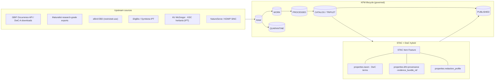
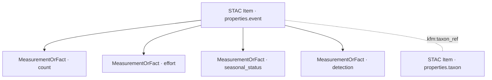

<!-- [KFM_META_BLOCK_V2]
doc_id: kfm://doc/standards/darwin-core
title: Darwin Core (DwC) — KFM Conformance and Profile
type: standard
version: v0.1
status: draft
owners: Biodiversity domain steward · Catalog standards steward · Docs steward
created: 2026-05-14
updated: 2026-05-14
policy_label: public
related:
  - docs/standards/STAC.md
  - docs/standards/DCAT.md
  - docs/standards/PROV.md
  - docs/standards/SENSITIVITY_RUBRIC.md
  - docs/doctrine/directory-rules.md
  - docs/architecture/contract-schema-policy-split.md
  - docs/adr/ADR-0001-schema-home.md
tags: [kfm, standards, biodiversity, darwin-core, stac, catalog]
notes:
  - All repo paths in this document are PROPOSED until verified against mounted-repo evidence.
  - External Darwin Core facts are sourced from TDWG and labeled EXTERNAL inline.
[/KFM_META_BLOCK_V2] -->

# Darwin Core (DwC) — KFM Conformance and Profile

> How the Kansas Frontier Matrix encodes biodiversity occurrence, event, and taxon evidence using the TDWG Darwin Core vocabulary inside the governed STAC × DwC hybrid pattern.

<p>
  
  
  
  
  
  
</p>

| Status | Owners | Last reviewed |
|---|---|---|
| Draft — first issue | Biodiversity domain steward · Catalog standards steward · Docs steward | 2026-05-14 |

---

## Quick navigation

- [1. Scope and role at KFM](#1-scope-and-role-at-kfm)
- [2. Source standard reference (TDWG)](#2-source-standard-reference-tdwg)
- [3. KFM canonical encoding: the STAC × DwC hybrid](#3-kfm-canonical-encoding-the-stac--dwc-hybrid)
- [4. Term map — DwC ↔ KFM `properties.taxon`](#4-term-map--dwc--kfm-propertiestaxon)
- [5. Event records and `MeasurementOrFact`](#5-event-records-and-measurementorfact)
- [6. Taxonomic authority anchoring](#6-taxonomic-authority-anchoring)
- [7. Sensitivity, redaction, and public-safety gates](#7-sensitivity-redaction-and-public-safety-gates)
- [8. Source intake — DwC-A archives and live APIs](#8-source-intake--dwc-a-archives-and-live-apis)
- [9. Schema home, validators, and fixtures](#9-schema-home-validators-and-fixtures)
- [10. Worked example (illustrative)](#10-worked-example-illustrative)
- [11. Open questions and verification backlog](#11-open-questions-and-verification-backlog)
- [12. Related docs](#12-related-docs)
- [Appendix A — DwC term cheat sheet](#appendix-a--dwc-term-cheat-sheet)
- [Appendix B — Conformance checklist](#appendix-b--conformance-checklist)

---

## 1. Scope and role at KFM

**Status:** CONFIRMED doctrine · PROPOSED repo paths.

Darwin Core (DwC) is the TDWG-maintained vocabulary KFM uses to express the **biological semantics** of biodiversity records — taxa, occurrences, sampling events, identifications, and measurements. KFM does **not** publish DwC as a sovereign top-level format. Instead, KFM follows the corpus-confirmed pattern of placing DwC terms inside `properties.taxon` of a STAC Item, with DwC Event records and `MeasurementOrFact` rows linked to the same catalog envelope.

This document is the human-facing standards doc for that conformance. It does **not** define field shape (that lives in `schemas/`), object meaning (that lives in `contracts/`), or admissibility (that lives in `policy/`). It explains how KFM reads, writes, and gates DwC content within the lifecycle invariant:

> **RAW → WORK / QUARANTINE → PROCESSED → CATALOG / TRIPLET → PUBLISHED.**

Where this doc references repo paths (`docs/`, `schemas/contracts/v1/...`, `tools/validators/...`, etc.), those references are **PROPOSED** until verified against a mounted repository. The Directory Rules §6.1 places external-standards conformance docs under `docs/standards/` and is the basis for this file's location.

> [!IMPORTANT]
> Darwin Core is **interpretive vocabulary**, not evidence. A DwC field value does not become a KFM claim until it has resolved through `EvidenceRef → EvidenceBundle`, passed the policy gates appropriate to its sensitivity rank, and acquired a signed `RunReceipt`. AI-derived enrichment of DwC content is bounded by the same rule.

---

## 2. Source standard reference (TDWG)

The authoritative definitions live with TDWG and **must not** be paraphrased into KFM-local copies. KFM consumes the standard as-is and namespaces its extensions under `kfm:` rather than altering DwC terms.

| Aspect | Reference | Label |
|---|---|---|
| TDWG standard URI | `http://www.tdwg.org/standards/450` | EXTERNAL |
| Term namespace IRI | `http://rs.tdwg.org/dwc/terms/` | EXTERNAL |
| Preferred namespace prefix | `dwc:` | EXTERNAL |
| Maintaining body | Darwin Core Maintenance Group, under TDWG (Biodiversity Information Standards) | EXTERNAL |
| Companion text-archive format | Darwin Core Archive (DwC-A) — CSV files + `meta.xml` + `eml.xml` | EXTERNAL |
| List of Terms (recent snapshot referenced for this draft) | `http://rs.tdwg.org/dwc/doc/list/2025-07-10` | EXTERNAL — NEEDS VERIFICATION before pinning |

> [!NOTE]
> The List of Terms version referenced above is the latest snapshot retrieved while drafting this doc. KFM **must** pin a specific List-of-Terms version inside its policy bundle and capture it in every `RunReceipt` that emits DwC content. Snapshot version selection and rotation cadence are tracked under [§11](#11-open-questions-and-verification-backlog).

---

## 3. KFM canonical encoding: the STAC × DwC hybrid

**Status:** CONFIRMED pattern (corpus C4-03) · PROPOSED schema and fixture paths.

KFM encodes a biodiversity occurrence as a **STAC Item** (GeoJSON `Feature` with `geometry` and `datetime`) whose `properties` block contains:

1. A `taxon` object carrying DwC-derived terms plus KFM-specific biology fields.
2. The standard KFM `kfm:provenance` block (`spec_hash`, `evidence_bundle_ref`, `run_record_ref`, `audit_ref`, `policy_digest`).
3. A `redaction_profile` reference when the record's `sensitivity_rank` is non-zero.
4. An `evidence` block (or `kfm:evidence_ref`) pointing at the content-addressed `EvidenceBundle`.

STAC provides spatial-temporal addressing and KFM provenance. DwC provides biology. The hybrid keeps the STAC envelope clean (no DwC terms at the top level), and lets biodiversity-aware consumers (GBIF, iDigBio, Symbiota) recognize the `properties.taxon` payload while STAC-only consumers ignore it without breaking.



**Diagram status note:** The lifecycle, hybrid shape, and source families are CONFIRMED in the corpus. Source-specific routing (e.g., whether eBird EBD flows through `RAW` or a quarantine sub-zone under restricted-use review) is **NEEDS VERIFICATION** against the live source registry.

---

## 4. Term map — DwC ↔ KFM `properties.taxon`

KFM uses **snake_case property names inside `properties.taxon`**, derived from DwC's `camelCase` term names. The DwC term is the semantic anchor; the KFM property name is the on-disk JSON key in catalog records. KFM-specific keys (those not derived from DwC) carry no DwC mapping and are marked as such.

| KFM key (inside `properties.taxon`) | DwC term | Status | Notes |
|---|---|---|---|
| `scientific_name` | `dwc:scientificName` | CONFIRMED (C4-03) | Full Linnaean name with authorship where present. |
| `common_name` | `dwc:vernacularName` | CONFIRMED (C4-03) | Optional; language tag captured in evidence bundle. |
| `taxon_rank` | `dwc:taxonRank` | PROPOSED | Recommended for join consistency with ITIS/GBIF backbones. |
| `taxon_authority_id` | `dwc:taxonID` | PROPOSED | Authority IRI (see [§6](#6-taxonomic-authority-anchoring)). |
| `kingdom` / `phylum` / `class` / `order` / `family` / `genus` | `dwc:kingdom` etc. | PROPOSED | Higher classification carried for filter convenience. |
| `kbs_id` | — (KFM-local) | CONFIRMED (C4-03) | Kansas Biological Survey identifier when present. |
| `kdwp_status` | — (KFM-local) | CONFIRMED (C4-03) | KDWP SINC status; drives sensitivity-rank lookup. |
| `sensitivity_rank` | — (KFM-local; cross-cuts C6 rubric) | CONFIRMED (C6-01) | Integer 0–5; see [§7](#7-sensitivity-redaction-and-public-safety-gates). |
| `occurrence_id` | `dwc:occurrenceID` | PROPOSED | Stable per-occurrence GUID; required for federation. |
| `basis_of_record` | `dwc:basisOfRecord` | PROPOSED | E.g., `PreservedSpecimen`, `HumanObservation`, `MachineObservation`. |
| `recorded_by` | `dwc:recordedBy` | PROPOSED | Subject to living-person review when applicable (see C9). |
| `coordinate_uncertainty_in_meters` | `dwc:coordinateUncertaintyInMeters` | PROPOSED | Pre-redaction figure; redaction profile may widen it. |
| `event_date` (at top level `properties.datetime`) | `dwc:eventDate` | CONFIRMED (C4-03) | Promoted to STAC `datetime` for temporal indexing. |

> [!NOTE]
> KFM-specific keys (`kbs_id`, `kdwp_status`, `sensitivity_rank`) are **not** Darwin Core terms. They live under `properties.taxon` for ergonomic colocation only. Their semantics are governed by the KFM source registry and the Sensitivity Rubric, not by TDWG.

---

## 5. Event records and `MeasurementOrFact`

**Status:** CONFIRMED pattern (corpus C4-03 detailed explanation) · PROPOSED on schema and fixture paths.

For survey-driven records, the hybrid extends to **Darwin Core Event** semantics. A survey becomes a STAC Item whose `properties.event` block carries:

- `event_id` ← `dwc:eventID`
- `event_date` ← `dwc:eventDate` (also lifted to `properties.datetime`)
- `sampling_protocol` ← `dwc:samplingProtocol`
- `sample_size_value` ← `dwc:sampleSizeValue`
- `sample_size_unit` ← `dwc:sampleSizeUnit`

Linked **`MeasurementOrFact`** rows capture counts, effort, seasonal status, and **detection / non-detection** for analyses that require zeros (eBird-style complete checklists, presence/absence modeling). KFM stores `MeasurementOrFact` either as siblings inside the STAC Item's `properties.measurements` array (compact case) or as separate records in the catalog with a `kfm:event_ref` back-link (high-cardinality case). The boundary between inline and split storage is **NEEDS VERIFICATION** pending fixture work.



**Diagram status note:** The conceptual link structure (Event ↔ MeasurementOrFact ↔ Taxon) is CONFIRMED. Reference field names (`kfm:taxon_ref`, `kfm:event_ref`) are PROPOSED.

---

## 6. Taxonomic authority anchoring

**Status:** CONFIRMED doctrine (corpus C7-07, C7-08).

Every species-level record in KFM **must** anchor to one or both of:

| Authority | Identifier | Role | Source-of-truth posture |
|---|---|---|---|
| **ITIS** (Integrated Taxonomic Information System) | `tsn:<n>` (Taxonomic Serial Number) | U.S.-canonical taxonomic anchor | Required when ITIS has coverage; primary join key for federal partners (USFWS, USDA, NRCS) |
| **GBIF Backbone Taxonomy** | `gbif:<key>`, versioned via DOI `10.15468/39omei` | International crosswalk | Required when ITIS lacks coverage (many invertebrates, fungi, currency lag); always recorded for international comparability |

The GBIF Backbone DOI version **must** be captured in the `RunReceipt` of any record that uses GBIF anchoring, so that downstream queries can replay against the same backbone snapshot. ITIS pulls follow the standard receipt envelope (`run_id`, `fetch_time`, endpoint, response checksum).

> [!WARNING]
> ITIS and GBIF can disagree on accepted name or higher classification, especially in invertebrates, fungi, and many plants. The default tie-breaker — ITIS for federal-data reconciliation, GBIF for international biodiversity queries — is **NOT yet codified in the policy bundle.** Records whose two anchors disagree should be flagged by validator output and reviewed by the biodiversity steward before promotion past `CATALOG`. See [§11](#11-open-questions-and-verification-backlog).

---

## 7. Sensitivity, redaction, and public-safety gates

**Status:** CONFIRMED rubric and named profiles (corpus C6-01, C6-02). PROPOSED on policy paths.

DwC fields by themselves carry **no public-safety semantics**. KFM gates publication of DwC-bearing records through the **Sensitivity Rubric 0–5** and named redaction profiles. The rank is required on every catalog node and is persisted in evidence bundles.

| Rank | Class | Default redaction profile | Publication posture |
|---|---|---|---|
| 0 | Public / open | `kfm:redact:none` | Direct release allowed if rights and review state pass. |
| 1 | Common non-sensitive | `kfm:redact:none` | Release allowed; coordinate uncertainty retained as reported. |
| 2 | Watchlist | Named profile, typically a low-grid generalization | Release after review. |
| 3 | SINC / locally sensitive | `profile:sinc-obscure-10km` (default) | Grid generalization required before publication. |
| 4 | Threatened / rare | Strict mask or embargo (e.g., `centroid_1km_v1` or temporal embargo) | Release narrow; restricted geometry only under documented authority. |
| 5 | Sacred / critical | Fail-closed — no map or timeline exposure | Default-deny on publication; explicit allow-rule required. |

Canonical profile names captured in the corpus include `point_10km_hex_seeded_v1`, `point_3km_jitter_v1`, `centroid_1km_v1`, and the do-nothing `kfm:redact:none`. Each profile ships method documentation, a Rego fixture stating which ranks it satisfies, and a verifier that re-runs the transform from the receipt's parameters and checks determinism. Profile catalog and verifier paths are **PROPOSED** (typically `policy/redaction/profiles.yaml` and `tools/validators/redaction/`) until verified.

> [!CAUTION]
> Any KFM-released occurrence record for a taxon that NatureServe **or** KDWP SINC ranks at **S1/S2** must carry a non-`none` redaction profile and a documented review state. A record at rank ≥ 3 with `kfm:redact:none` is a **policy failure** and must be quarantined.

### 7.1 Two-tier object families for occurrence

The Domains Culmination Atlas separates occurrence into three KFM object families that map onto the same DwC vocabulary but follow different publication paths:

| KFM object family | Purpose | Publication path |
|---|---|---|
| `Occurrence Evidence` | Source-grade occurrence as received, never published as-is | Stays inside `data/processed/` and evidence bundles |
| `Occurrence Restricted` | Steward-controlled record with precise geometry | Routed to gated/authenticated surfaces only |
| `Occurrence Public` | Public-safe derivative produced by a named redaction profile | Eligible for `data/published/` and STAC × DwC hybrid release |

Identity rules and temporal handling for these families are PROPOSED (deterministic basis: source id + object role + temporal scope + normalized digest) per the Atlas; source / observed / valid / retrieval / release / correction times are kept distinct where material.

[Back to top](#quick-navigation)

---

## 8. Source intake — DwC-A archives and live APIs

**Status:** CONFIRMED source families (corpus C10-06) · PROPOSED watcher and connector paths.

KFM's biodiversity intake supports two complementary entry points:

### 8.1 Darwin Core Archive (DwC-A) — preferred batch path

DwC-A bundles are ZIP archives containing:

- A descriptor file `meta.xml` (defines structure and field mapping). _EXTERNAL: per TDWG Text Guide._
- A metadata file `eml.xml` (Ecological Metadata Language dataset description). _EXTERNAL: per GBIF IPT guide._
- One or more delimited text files (CSV / TSV) — one **core** file plus zero or more **extension** files in a star-schema relation.

KFM ingestion of a DwC-A follows the standard watcher → canonicalizer → evidence bundle flow:

1. Conditional GET against the upstream URL (ETag / `If-None-Match`, `Last-Modified`).
2. Spec-hash the raw payload; record source headers in the run receipt.
3. Unpack core + extensions; parse `meta.xml` to discover field-to-DwC-term mapping.
4. Map fields into the KFM canonical record shape (`properties.taxon`, `properties.event`, `properties.measurements` as appropriate).
5. Apply C6 sensitivity lookup; assign redaction profile.
6. Emit `EvidenceBundle` with sources, run receipt, and computed `spec_hash`.
7. Pass through promotion gates (identity, anchors, integrity, sensitivity, lineage, signing, release).

Connector and watcher paths are **PROPOSED**, likely under `connectors/biodiversity/` and `tools/ingest/watchers/`. Verify against repo before referencing.

### 8.2 Live APIs — keyed retrieval

Source families confirmed in the corpus, with the rights posture KFM must respect:

| Source | Access | Rights posture |
|---|---|---|
| **GBIF** Occurrence API | Open, JSON predicate downloads return DOI-stamped zips | Open with attribution; honor licence per occurrence |
| **iNaturalist** | Open API | License varies per observation; respect per-record license |
| **eBird EBD** | Application + agreement | **Restricted-use**; redistribution limited. Any KFM release derived from EBD must be checked against EBD terms and may require approval |
| **NatureServe** Explorer / Explorer PRO | Free account required for precise records | Status data is anchor input; precise occurrence locations restricted |
| **USFWS** Critical Habitat / listed species | Open | Federal data; attribution and currency tracked |
| **iDigBio / Symbiota** | Open portals | Per-collection license; many CC-BY |
| **KU McGregor Herbarium (IPT)** | Open (DwC-A) | CC licensing per collection |
| **KSC Herbarium** | Open (DwC-A) | CC BY 4.0 (per source survey) |

> [!IMPORTANT]
> eBird EBD restricted-use terms are operationally significant. The KFM convention is to **not** publish raw EBD occurrence rows as-is; only modelled, aggregated, or generalized derivatives — and only after a documented EBD-derivative-release review. Building the biodiversity restricted-use registry as a small machine-readable asset under the policy bundle is on the verification backlog.

[Back to top](#quick-navigation)

---

## 9. Schema home, validators, and fixtures

**Status:** Schema-home rule CONFIRMED (Directory Rules §0 and §7.4; ADR-0001 default `schemas/contracts/v1/<…>`). All specific paths below are **PROPOSED** until verified against mounted-repo evidence and the schema-home ADR.

### 9.1 Proposed schema layout

```text
schemas/contracts/v1/
└── biodiversity/
    ├── stac_dwc_profile.schema.json       # PROPOSED — STAC Item × DwC taxon hybrid
    ├── dwc_event_profile.schema.json      # PROPOSED — Event variant of the hybrid
    ├── dwc_measurement_or_fact.schema.json # PROPOSED — MeasurementOrFact row shape
    └── occurrence_object_family/
        ├── occurrence_evidence.schema.json    # PROPOSED
        ├── occurrence_restricted.schema.json  # PROPOSED
        └── occurrence_public.schema.json      # PROPOSED
```

### 9.2 Proposed validator and fixture layout

| Concern | Proposed path | Purpose |
|---|---|---|
| Profile validator | `tools/validators/biodiversity/validate_stac_dwc.py` | Validate a record against the hybrid schema |
| DwC-A round-trip check | `tools/validators/biodiversity/dwca_roundtrip.py` | If DwC-A is treated as ground truth, verify byte-equality after canonicalization |
| Authority-anchor check | `tools/validators/biodiversity/anchor_check.py` | Fails if a species-level record lacks both ITIS and GBIF anchors |
| Sensitivity-rank check | `tools/validators/biodiversity/sensitivity_gate.py` | Fails if `sensitivity_rank ≥ 3` and `redaction_profile == kfm:redact:none` |
| Golden fixtures (valid) | `fixtures/biodiversity/valid/` | Minimal + complete examples for occurrence, event, MoF |
| Golden fixtures (invalid) | `fixtures/biodiversity/invalid/` | Missing-anchor, missing-redaction, broken-meta.xml, etc. — for negative-state tests |
| CI workflow | `.github/workflows/biodiversity-validate.yml` | Runs the above on PRs that touch biodiversity content |

All paths above are **PROPOSED.** Promotion is a governed state transition; until validators, fixtures, and policy gates exist, biodiversity datasets stay at or before `WORK / QUARANTINE` and **do not** reach `PUBLISHED`.

[Back to top](#quick-navigation)

---

## 10. Worked example (illustrative)

**Status:** ILLUSTRATIVE — the shape follows the CONFIRMED C4-03 pattern but the literal values are fabricated for demonstration. Do not treat field-by-field details as authoritative until validator and schema work confirms them.

```json
{
  "type": "Feature",
  "stac_version": "1.0.0",
  "id": "kfm-bio-occ-2024-symphyotrichum-novae-angliae-douglas-co-0001",
  "collection": "kfm-bio-occurrences-public",
  "geometry": {
    "type": "Point",
    "coordinates": [-95.234, 38.971]
  },
  "bbox": [-95.234, 38.971, -95.234, 38.971],
  "properties": {
    "datetime": "2024-09-12T14:30:00Z",
    "taxon": {
      "scientific_name": "Symphyotrichum novae-angliae (L.) G.L.Nesom",
      "common_name": "New England aster",
      "taxon_rank": "species",
      "taxon_authority_id": "itis:tsn:529936",
      "kingdom": "Plantae",
      "kbs_id": null,
      "kdwp_status": null,
      "sensitivity_rank": 0,
      "occurrence_id": "urn:catalog:KU:McGregor:1234567",
      "basis_of_record": "PreservedSpecimen",
      "coordinate_uncertainty_in_meters": 30
    },
    "redaction_profile": "kfm:redact:none",
    "kfm:provenance": {
      "spec_hash": "sha256:<computed-at-build>",
      "evidence_bundle_ref": "kfm://entity-bundle/<sha256>",
      "run_record_ref": "kfm://run/<uuid>",
      "audit_ref": "kfm://audit/<uuid>",
      "policy_digest": "sha256:<policy-bundle-digest>"
    }
  },
  "assets": {
    "evidence": {
      "href": "kfm://entity-bundle/<sha256>",
      "type": "application/ld+json",
      "roles": ["metadata", "evidence"]
    }
  },
  "links": [
    { "rel": "collection", "href": "../collection.json" },
    { "rel": "derived_from", "href": "https://example-ipt.example/dwca/mcgregor-2024-q3.zip" }
  ],
  "stac_extensions": [
    "https://kfm.example/extensions/provenance/v1/schema.json"
  ]
}
```

Notes on this example:

- The record is rank 0 because the species is not on KDWP SINC; a rank-3 record would carry `redaction_profile: profile:sinc-obscure-10km` and a generalized `coordinates` array.
- `taxon_authority_id` uses an `itis:` prefix; the actual prefix convention is **NEEDS VERIFICATION** against the source authority register.
- `stac_extensions` MUST list the KFM provenance extension URL when the `kfm:provenance` block is present. The specific URL is **PROPOSED**.

[Back to top](#quick-navigation)

---

## 11. Open questions and verification backlog

These items are explicitly **not resolved** by this document. They are tracked here and SHOULD also appear in `docs/registers/VERIFICATION_BACKLOG.md`.

| # | Item | Status |
|---|---|---|
| 1 | Is the KFM-canonical occurrence record the STAC × DwC hybrid or the DwC-A archive? They SHOULD agree byte-for-byte after canonicalization. | **OPEN** (corpus C4-03 open question) |
| 2 | Tie-breaker policy when ITIS and GBIF disagree on accepted name or higher classification. | **OPEN** (corpus C7-07) |
| 3 | Which GBIF Backbone DOI version is pinned in the policy bundle; cadence for rotation. | **NEEDS VERIFICATION** |
| 4 | Whether KFM should adopt the TDWG Humboldt Extension for ecological inventory contexts. | **OPEN — EXTERNAL trigger** |
| 5 | Compact-vs-split storage threshold for `MeasurementOrFact` rows. | **NEEDS VERIFICATION** |
| 6 | Stable prefix convention for taxonomic authority IRIs (`itis:`, `gbif:`, etc.) inside KFM JSON. | **NEEDS VERIFICATION** |
| 7 | EBD-derivative-release policy: what KFM may publish from eBird EBD-derived datasets. | **OPEN** (corpus C10-06) |
| 8 | DwC List-of-Terms snapshot version pinned in the policy bundle. | **NEEDS VERIFICATION** |
| 9 | Whether sensitive-taxa records should round-trip through DwC-A at all, or only through the STAC × DwC hybrid. | **OPEN** |
| 10 | Filename for this document: corpus expansion direction in C4-03 suggests `docs/standards/STAC_DWC_PROFILE.md`; this file is named `docs/standards/Darwin_Core.md`. Resolution: either keep both (this as the standard, the profile as the hybrid spec) or consolidate via an ADR/migration note. | **OPEN** |

[Back to top](#quick-navigation)

---

## 12. Related docs

- `docs/standards/STAC.md` — STAC core profile and `kfm:provenance` extension. _(PROPOSED placeholder link.)_
- `docs/standards/DCAT.md` — DCAT dataset and distribution profile for non-spatial catalog mirrors. _(PROPOSED placeholder link.)_
- `docs/standards/PROV.md` — PROV-O usage and `prov:wasGeneratedBy` conventions. _(PROPOSED placeholder link.)_
- `docs/standards/SENSITIVITY_RUBRIC.md` — Sensitivity rubric 0–5 and named redaction profiles. _(PROPOSED placeholder link; corpus expansion direction.)_
- `docs/doctrine/directory-rules.md` — Authority for the placement of this document under `docs/standards/`.
- `docs/architecture/contract-schema-policy-split.md` — Why DwC vocabulary lives here while shape lives in `schemas/` and meaning in `contracts/`.
- `docs/adr/ADR-0001-schema-home.md` — Default schema home `schemas/contracts/v1/<…>`.
- `docs/domains/fauna/README.md` and `docs/domains/flora/README.md` — Domain-specific application of this profile. _(PROPOSED placeholder links.)_
- `docs/runbooks/revocation.md` — Tombstone and revocation handling for retracted occurrences. _(PROPOSED placeholder link.)_

[Back to top](#quick-navigation)

---

## Appendix A — DwC term cheat sheet

<details>
<summary><strong>DwC terms KFM is likely to touch first (illustrative, EXTERNAL-sourced)</strong></summary>

The selection below reflects the terms most commonly used in occurrence and event records ingested from GBIF and IPT installations. It is **not** a normative subset of Darwin Core — the normative list is published by TDWG at `http://rs.tdwg.org/dwc/terms/`.

| DwC class | Term | Typical role |
|---|---|---|
| Record-level | `dwc:type`, `dwc:basisOfRecord`, `dwc:institutionCode`, `dwc:collectionCode`, `dwc:datasetID`, `dwc:license`, `dwc:rightsHolder`, `dwc:bibliographicCitation` | Source attribution and rights |
| Occurrence | `dwc:occurrenceID`, `dwc:recordedBy`, `dwc:individualCount`, `dwc:organismQuantity`, `dwc:organismQuantityType`, `dwc:occurrenceStatus`, `dwc:lifeStage`, `dwc:sex` | Per-record observation |
| Event | `dwc:eventID`, `dwc:eventDate`, `dwc:samplingProtocol`, `dwc:sampleSizeValue`, `dwc:sampleSizeUnit`, `dwc:samplingEffort`, `dwc:habitat` | Survey context |
| Location | `dwc:decimalLatitude`, `dwc:decimalLongitude`, `dwc:geodeticDatum`, `dwc:coordinateUncertaintyInMeters`, `dwc:country`, `dwc:stateProvince`, `dwc:county`, `dwc:locality` | Spatial grounding |
| Identification | `dwc:identifiedBy`, `dwc:dateIdentified`, `dwc:identificationRemarks`, `dwc:identificationVerificationStatus` | Determination provenance |
| Taxon | `dwc:scientificName`, `dwc:vernacularName`, `dwc:taxonID`, `dwc:taxonRank`, `dwc:kingdom`, `dwc:phylum`, `dwc:class`, `dwc:order`, `dwc:family`, `dwc:genus`, `dwc:specificEpithet`, `dwc:scientificNameAuthorship` | Biological identity |
| Extensions in scope | `dwc:MeasurementOrFact` (`dwc:measurementID`, `dwc:measurementType`, `dwc:measurementValue`, `dwc:measurementUnit`, `dwc:measurementAccuracy`) | Counts, effort, abiotic measures linked to events |

</details>

<details>
<summary><strong>DwC-A archive shape (illustrative, EXTERNAL-sourced)</strong></summary>

A typical DwC-A bundle has the following structure:

```text
my-archive.zip
├── meta.xml          # field-to-DwC mapping; star-schema description
├── eml.xml           # Ecological Metadata Language dataset description
├── occurrence.txt    # core file (CSV/TSV)
├── measurementorfact.txt  # optional extension
└── multimedia.txt    # optional extension
```

KFM does **not** treat the inner CSV layout as authoritative until `meta.xml` has been parsed; column order is informative, not normative. Round-trip equality between a KFM STAC × DwC record and a regenerated DwC-A row depends on canonicalization rules that are still **OPEN** (see [§11](#11-open-questions-and-verification-backlog) item 1).

</details>

---

## Appendix B — Conformance checklist

<details>
<summary><strong>Per-record conformance checklist (PROPOSED)</strong></summary>

Use this checklist when a biodiversity record is being prepared for promotion past `CATALOG`. Items marked **MUST** are blocking; **SHOULD** is strong default; **MAY** is permitted within the lane.

- [ ] **MUST** — Record is a STAC Item (`type: "Feature"`) with `geometry`, `bbox`, `properties.datetime`.
- [ ] **MUST** — `properties.taxon` is present with at least `scientific_name`.
- [ ] **MUST** — `properties.taxon.taxon_authority_id` resolves to ITIS or GBIF Backbone (or both).
- [ ] **MUST** — `properties.taxon.sensitivity_rank` is set (integer 0–5).
- [ ] **MUST** — `properties.redaction_profile` is set; non-`none` when `sensitivity_rank ≥ 3`.
- [ ] **MUST** — `properties.kfm:provenance` block is present with `spec_hash`, `evidence_bundle_ref`, `run_record_ref`.
- [ ] **MUST** — `assets.evidence` points at a content-addressed `EvidenceBundle`.
- [ ] **MUST** — `stac_extensions` lists the KFM provenance extension URL.
- [ ] **SHOULD** — `properties.taxon.occurrence_id` is present and globally unique.
- [ ] **SHOULD** — `properties.taxon.basis_of_record` is set to a DwC controlled-vocabulary value.
- [ ] **SHOULD** — `properties.taxon.coordinate_uncertainty_in_meters` is set when applicable.
- [ ] **SHOULD** — Records derived from eBird EBD have passed an EBD-derivative-release review.
- [ ] **SHOULD** — `links[rel="derived_from"]` points at the upstream DwC-A or API call.
- [ ] **MAY** — Inline `MeasurementOrFact` rows under `properties.measurements` when cardinality is small.

</details>

---

> [!NOTE]
> This document is a **standards conformance description**, not implementation. It explains how KFM expresses DwC content under its lifecycle and trust membrane. The authoritative definitions of DwC terms remain with TDWG. The authoritative shape of KFM records lives under `schemas/contracts/v1/...`; the authoritative meaning lives under `contracts/`; the authoritative admissibility lives under `policy/`. This file MUST NOT be treated as the place where any of those decisions are made.

---

**Related docs:** [§12](#12-related-docs) · **Last reviewed:** 2026-05-14 · [Back to top](#quick-navigation)
