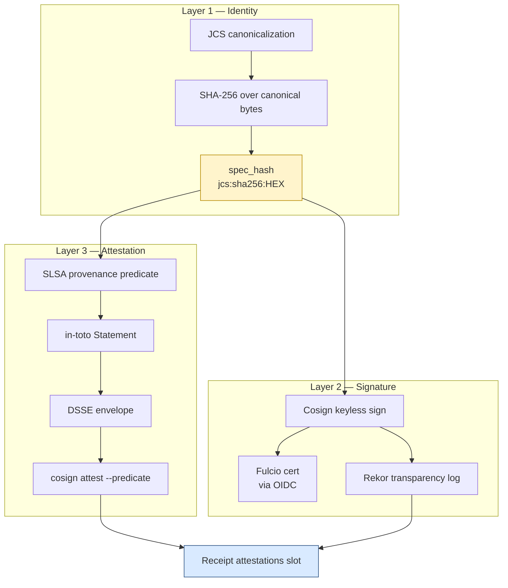

<!-- [KFM_META_BLOCK_V2]
doc_id: kfm://doc/standard/evidence-bundle-conformance
title: EvidenceBundle — External Standards Conformance Dossier
type: standard
version: v1
status: draft
owners: <TBD: docs steward + evidence/governance lead>
created: 2026-05-24
updated: 2026-05-24
policy_label: public
related: [
  contracts/v1/evidence/,
  schemas/contracts/v1/evidence/,
  policy/evidence/,
  docs/standards/PROV.md,
  docs/standards/PROV/README.md,
  docs/standards/DUO_PROFILE.md,
  docs/standards/ISO-19115.md,
  docs/standards/SIGNING.md,
  docs/standards/CANONICALIZATION.md,
  docs/standards/PMTILES.md,
  docs/architecture/contract-schema-policy-split.md,
  docs/doctrine/trust-membrane.md,
  docs/doctrine/lifecycle-law.md
]
tags: [kfm, standard, evidence-bundle, conformance, jcs, prov-o, slsa, stac, dcat, cosign, dsse, governance]
notes: [
  "Topical standards document (UPPERCASE_WITH_UNDERSCORES) per Directory Rules §6.1.a — names a KFM-coined object's external-standards conformance posture, not the object's meaning.",
  "Object meaning is owned by contracts/v1/evidence/; machine shape by schemas/contracts/v1/evidence/; admissibility by policy/. This file does NOT redefine those.",
  "Placement is intentionally narrow; see §2 Scope Guardrail and Appendix B Placement Rationale."
]
[/KFM_META_BLOCK_V2] -->

# EvidenceBundle — External Standards Conformance Dossier

> A single place to answer the question *"which external standards does a KFM EvidenceBundle conform to, and how does an external consumer verify one?"* — without redefining the EvidenceBundle itself.

[](#)
[](#)
[](#)
[](#)
[](#)
[](#)
[](#)

| Status | Owners | Last reviewed |
|---|---|---|
| **draft** | _TBD — docs steward + evidence/governance lead_ | 2026-05-24 |

---

> [!CAUTION]
> **Scope guardrail.** This document is **not** the EvidenceBundle reference. It does **not** define the object's meaning, fields, validation rules, or admissibility. Those live in `contracts/v1/evidence/` (meaning), `schemas/contracts/v1/evidence/` (shape), and `policy/` (admissibility). This document only describes how a KFM EvidenceBundle aligns with the external standards an interoperability partner or external auditor would check it against. See §2 and Appendix B before adding any content here.

---

## Quick jump

- [1. Purpose](#1-purpose)
- [2. Scope guardrail — what this doc is NOT](#2-scope-guardrail--what-this-doc-is-not)
- [3. Authority and standing](#3-authority-and-standing)
- [4. External-standards conformance matrix](#4-external-standards-conformance-matrix)
- [5. Identity and canonicalization](#5-identity-and-canonicalization)
- [6. Content addressing](#6-content-addressing)
- [7. Provenance — PROV-O & PAV alignment](#7-provenance--prov-o--pav-alignment)
- [8. Signing and attestation](#8-signing-and-attestation)
- [9. Catalog interoperability — STAC, DCAT, ISO 19115](#9-catalog-interoperability--stac-dcat-iso-19115)
- [10. Trust topologies](#10-trust-topologies)
- [11. External verification flow](#11-external-verification-flow)
- [12. Tensions and known limits](#12-tensions-and-known-limits)
- [13. Open questions](#13-open-questions)
- [14. Related docs](#14-related-docs)
- [Appendix A — Worked external verification](#appendix-a--worked-external-verification)
- [Appendix B — Placement rationale](#appendix-b--placement-rationale)

---

## 1. Purpose

A KFM **EvidenceBundle** is a content-addressed JSON-LD artifact that travels with every consequential claim KFM publishes. CONFIRMED doctrine — Pass-10 C4-04, C8-04, KFM-P26-IDEA-0003 — states that an EvidenceBundle "should carry identity, inputs, parameters, artifacts, checks, integrity, and signatures as the canonical evidence artifact for consequential claims." The KFM Encyclopedia ranks it explicitly: *"EvidenceBundle outranks generated language, renderer state, graph projections, search indexes, tiles, PMTiles, COGs, dashboards, and synthetic scenes."*

That puts EvidenceBundle at the center of KFM's trust membrane — and it puts it directly in the path of multiple external standards: JSON-LD canonicalization (RFC 8785 JCS / W3C URDNA2015), graph-layer provenance (W3C PROV-O + PAV), content-addressed identity (`spec_hash`), supply-chain attestation (Cosign / Sigstore / SLSA / in-toto / DSSE), and catalog interoperability (STAC, DCAT, ISO 19115 via DCAT).

This dossier collects the external-standards posture in one place so that:

1. An interoperability partner can read **one document** to understand what they need to implement on their side.
2. An external auditor can read **one document** to know what they need to verify.
3. KFM contributors can read **one document** to understand which external standard each EvidenceBundle field is bound to.
4. Version-pin and conformance-level decisions for each external standard live in **one document** rather than scattered across the codebase.

> [!NOTE]
> This file is a **topical standards document** in the Directory Rules §6.1.a sense — UPPERCASE_WITH_UNDERSCORES, KFM-coined, sibling to `SENSITIVITY_RUBRIC.md` and `REDACTION_DETERMINISM.md`. It is **not** an external-standard short-name profile (those use UPPERCASE-WITH-HYPHENS — `ISO-19115.md`, `OAI-PMH.md`). See §3 and Appendix B for the placement rationale.

[Back to top](#quick-jump)

---

## 2. Scope guardrail — what this doc is NOT

> [!IMPORTANT]
> If you find yourself adding content that defines fields, validates fields, or admits/denies EvidenceBundles, **stop**. That content belongs in `contracts/`, `schemas/`, or `policy/`, not here. The boundaries below are not negotiable; they are Directory Rules §6.1.a.

| If the content is about… | …it lives at | …not here |
|---|---|---|
| What an EvidenceBundle field **means** | `contracts/v1/evidence/evidence_bundle.md` (PROPOSED home) | this doc |
| The **machine shape** of an EvidenceBundle (JSON Schema) | `schemas/contracts/v1/evidence/evidence_bundle.schema.json` (PROPOSED home; corpus card KFM-P26-PROG-0004) | this doc |
| The OPA rules that **admit, deny, or restrict** an EvidenceBundle | `policy/evidence/` (PROPOSED home) | this doc |
| The **JSON-LD context** an EvidenceBundle ships with | `schemas/contracts/v1/contexts/` (PROPOSED home) | this doc |
| Per-domain EvidenceBundle **extension fields** (e.g., flora, fauna, hydrology) | `contracts/v1/evidence/` + `schemas/contracts/v1/evidence/<domain>/` | this doc |
| The **OpenLineage event emitter** that produces lineage facets | `pipelines/` / `runtime/` | this doc |
| The **CI workflow** that verifies bundles in PRs | `.github/workflows/` (PROPOSED home) | this doc |
| **Tests** and **fixtures** | `tests/standards/evidence/` + `fixtures/standards/evidence/` | this doc |
| Tutorials, recipes, and how-tos for authors | `docs/runbooks/` or `docs/guides/` | this doc |

What this document **does** own:

- The list of external standards an EvidenceBundle conforms to or crosswalks against.
- The version pin per external standard.
- The conformance level KFM targets per external standard.
- The integration touchpoint (which external term maps to which EvidenceBundle concept — without redefining the concept).
- The external-verification recipe — what an outside consumer does to verify one of these bundles.

[Back to top](#quick-jump)

---

## 3. Authority and standing

| Aspect | Value | Label |
|---|---|---|
| Document class | KFM-coined **topical standards document** | CONFIRMED per Directory Rules §6.1.a |
| Canonical path | `docs/standards/EVIDENCE_BUNDLE.md` | PROPOSED — placement rationale in Appendix B |
| Doctrine anchors | C1-01 (Run Receipt), C1-02 (spec_hash via JCS), C1-03 (Cosign), C1-04 (SLSA / in-toto), C4-04 (EvidenceBundle JSON-LD), C8-03 (PROV-O & PAV), C8-04 (EvidenceBundle JSON-LD graph), C8-05 (JCS vs URDNA2015) | CONFIRMED |
| Pass-32 corroboration | KFM-P26-IDEA-0002 (EvidenceRef resolution triad), KFM-P26-IDEA-0003 (EvidenceBundle as canonical artifact contract), KFM-P26-PROG-0004 (`evidence_bundle.schema.json`), KFM-P8-IDEA-0001 (three trust topologies), KFM-P13-PROG-0011 (SLSA in-toto predicate), KFM-P10-PROG-0006 (DSSE/SLSA attestations) | CONFIRMED |
| Authority **NOT** held by this doc | Object meaning, machine shape, admissibility, JSON-LD context, runtime emitter, tests, CI | CONFIRMED (Directory Rules §6.1.a) |

> [!NOTE]
> The corpus instruction *"never for KFM's own object meaning"* in Directory Rules §6.1.a is the reason §2 above is the longest required section in this document. The file is permissible at this path because it scopes itself to **external-standards conformance posture for** EvidenceBundle, not to the bundle's definition. Appendix B walks the placement argument in full.

[Back to top](#quick-jump)

---

## 4. External-standards conformance matrix

The matrix below is the **principal payload** of this document. Each row names an external standard, the KFM EvidenceBundle concept that touches it, the conformance level KFM targets, and where to look in the corpus for the doctrine anchor. PROPOSED — every implementation-level claim (Pinned version, Conformance level) NEEDS VERIFICATION against mounted-repo evidence (no mounted repo this session).

| External standard | KFM touchpoint | Conformance level | Pinned version | Doctrine anchor |
|---|---|---|---|---|
| **RFC 8785 — JSON Canonicalization Scheme (JCS)** | Canonical byte-form of the bundle prior to `spec_hash` computation. | **CONFORMS** (default canonicalization) | NEEDS VERIFICATION per policy-bundle release | C1-02, C8-05 |
| **W3C URDNA2015 — RDF Dataset Normalization** | Alternate canonicalization where RDF-semantic equivalence is the relevant invariant. | **CONFORMS, opt-in only** | NEEDS VERIFICATION | C8-05 |
| **SHA-256 (FIPS 180-4)** | Digest function over canonical bytes; result recorded as `jcs:sha256:<hex>`. | **CONFORMS** | n/a (algorithm) | C1-02 |
| **BLAKE3** | Permitted alternate digest for mirror manifests and intermediate artifacts (not the primary `spec_hash`). | **CONFORMS, alternate** | n/a | KFM-P32-PROG-0014 (PMTiles sidecar precedent) |
| **W3C JSON-LD 1.1** | The bundle is a JSON-LD document; entities, sources, provenance, and run-receipt references serialize under JSON-LD semantics. | **CONFORMS** | JSON-LD 1.1 | C4-04, C8-04 |
| **W3C PROV-O** | `prov:wasGeneratedBy`, `prov:Activity`, `prov:Entity`, `prov:Agent` on every claim node; round-trip to a fetchable `RunReceipt`. | **CONFORMS, REQUIRED** | NEEDS VERIFICATION; profile in `docs/standards/PROV/` | C8-03, C8-04 |
| **PAV (Provenance, Authoring, Versioning)** | `pav:createdOn`, `pav:createdBy`, `pav:version` on entity nodes; complements PROV-O's authoring gap. | **CONFORMS** | PAV 2.3 family — NEEDS VERIFICATION | C8-03 |
| **Sigstore / Cosign** | Keyless signing of the bundle's content-addressed digest; transparency-log entry in Rekor. | **CONFORMS, default** | Cosign current; OIDC issuer allowlist NEEDS VERIFICATION | C1-03 |
| **DSSE (Dead Simple Signing Envelope)** | Envelope format for Cosign signatures over bundle attestation predicates. | **CONFORMS** | DSSE v1 | C1-03, KFM-P10-PROG-0006 |
| **SLSA (Supply-chain Levels for Software Artifacts)** | Provenance predicate (`slsaprovenance`) attesting builder, materials, invocation. | **CONFORMS, target level NEEDS VERIFICATION** | SLSA target NEEDS VERIFICATION (corpus open question: level 1 / 2 / 3) | C1-04, KFM-P13-PROG-0011 |
| **in-toto** | Predicate format underneath SLSA provenance; same DSSE envelope. | **CONFORMS** | in-toto attestation framework v1 | C1-04, KFM-P10-PROG-0006 |
| **OGC STAC 1.x** | Catalog items reference EvidenceBundles via `kfm:evidence_ref` and (PROPOSED) a `rel:attestation` link. | **CONFORMS, with KFM extension** | STAC 1.x — NEEDS VERIFICATION pin | C4-04, KFM-P7-PROG-0001 |
| **W3C DCAT v3** | Catalog distributions mirror STAC asset hrefs; `dcat:Distribution` may carry the bundle digest. | **CONFORMS** | DCAT v3 | KFM-P10-PROG-0006 Pass-32 addendum |
| **ISO 19115** | Geographic-metadata crosswalk reached via DCAT, not directly bound to EvidenceBundle. | **CONFORMS, indirect** (via `docs/standards/ISO-19115.md`) | ISO 19115-1:2014 + Amd 2:2020 — NEEDS VERIFICATION pin | C4 family |
| **OpenLineage** | Lineage events emitted alongside the bundle; `RunReceipt` carries the OpenLineage `run_id` (by reference per C1-01 open question). | **CONFORMS** | OpenLineage 1.x — NEEDS VERIFICATION pin | C1-05 |
| **CIDOC-CRM E13 (Attribute Assignment)** | Scholarly-attribution overlap with PROV-O; the dividing line is unsettled. | **CROSSWALK, unsettled** | CIDOC-CRM 7.x | C8-01, C8-03 |

> [!IMPORTANT]
> "Conformance level" in this table is a KFM target, not a third-party assessment. None of these claims have been independently audited; the column is a contract KFM commits to honor, not a certificate.

[Back to top](#quick-jump)

---

## 5. Identity and canonicalization

CONFIRMED doctrine — Pass-10 C1-02:

> *"The `spec_hash` for a dataset entry, model spec, contract, or evidence bundle is computed by canonicalizing the JSON via RFC 8785 JCS (JSON Canonicalization Scheme) and then taking SHA-256 over the canonical bytes; it is recorded as `jcs:sha256:<hex>`."*

The canonicalization choice is **the** load-bearing decision of EvidenceBundle identity. Two consumers using different JSON serializers must compute the same `spec_hash` for the same logical bundle, or the entire chain — content-addressing, signing, verification, audit — comes apart.

### 5.1 Canonicalization decision matrix

PROPOSED — the rule below codifies Pass-10 C8-05 and the corpus default.

| Bundle content shape | Canonicalization | `spec_hash` prefix | Rationale |
|---|---|---|---|
| Pure JSON (no embedded RDF semantics consumers rely on) | **RFC 8785 JCS** | `jcs:sha256:` | Default. Faster, more universally implemented; matches every other `spec_hash` in KFM. |
| JSON-LD document where consumers depend on **RDF-semantic equivalence** (e.g., federated SPARQL merging KFM bundles with non-KFM RDF) | **W3C URDNA2015** | `urdna2015:sha256:` (PROPOSED prefix) | Opt-in only; receipt records the choice. Reproducibility across implementations NEEDS VERIFICATION via a test-vector suite (C8-05 expansion direction). |

> [!WARNING]
> Hashing developer-formatted JSON (no canonicalization step) is **prohibited**. The corpus is explicit (C1-02): *"trivial reformatting would produce different hashes and break re-runs and audits."* Any tool that emits a `spec_hash` without going through a documented canonicalization is a trust-membrane bypass.

### 5.2 Implementation pinning posture

PROPOSED — implementation NEEDS VERIFICATION.

- One JCS implementation **MUST** be pinned per language ecosystem (Python, TypeScript, Go) and the pin **MUST** appear in `infra/tool-versions.yaml` (PROPOSED home).
- A `kfm-hash` CLI is the SHOULD-be-canonical entry point per Pass-10 C1-02 expansion direction; until it exists, language-specific helpers in `tools/spec_hash/` are acceptable.
- The full JCS-vs-URDNA2015 decision matrix and language-pin table lives at `docs/standards/CANONICALIZATION.md` (PROPOSED, not yet authored — Pass-10 C1-02 expansion direction).

[Back to top](#quick-jump)

---

## 6. Content addressing

CONFIRMED doctrine — Pass-10 C4-04:

> *"Each catalog entry references an evidence bundle … stored at a content-addressed URI (`kfm://entity-bundle/<sha256>`, `oci://...`, or `ipfs://...`) and surfaced in STAC properties as `kfm:evidence_ref`."*

### 6.1 Content-addressed URI families

| Scheme | Use | Notes |
|---|---|---|
| `kfm://entity-bundle/<sha256>` | KFM-internal canonical URI | Resolved by KFM bundle resolver; same digest, same bundle, every time. |
| `oci://<registry>/<repo>@sha256:<hex>` | When the bundle is published as an OCI artifact (alongside or instead of the JSON-LD file) | Lets KFM bundles reuse OCI tooling — registries, mirrors, garbage collection. |
| `ipfs://<cid>` | When the bundle is mirrored to IPFS for offline / federated access | Optional; only used when the deployment topology calls for it. |

All three schemes resolve the **same bundle bytes** when the underlying content is the same. The choice of scheme is a transport decision, not an identity decision; the identity is the digest.

### 6.2 Append-only by construction

Content-addressing means a published bundle **cannot be mutated without changing its identity**. Revocation is therefore not deletion — it is the publication of a **tombstone receipt** (C5-09) that supersedes the bundle and triggers cache invalidation (C6-08 — see `docs/standards/DUO_PROFILE.md` §7.2 for the consent-side equivalent). The bundle bytes remain reachable for audit; only their authority changes.

[Back to top](#quick-jump)

---

## 7. Provenance — PROV-O & PAV alignment

CONFIRMED doctrine — Pass-10 C8-03, C8-04:

> *"Every claim node in the graph carries a `prov:wasGeneratedBy` edge to a PROV-O Activity that links back to its run receipt … The graph publishes PROV-O fragments as part of every evidence bundle, and the policy gate checks that every claim node has at least one `prov:wasGeneratedBy` link."*

EvidenceBundle's PROV-O alignment is governed by the dedicated profile at [`docs/standards/PROV/`](./PROV/README.md). This dossier records only the **conformance commitment**, not the profile detail:

- Every EvidenceBundle **MUST** carry a PROV-O fragment.
- Every claim node within the fragment **MUST** carry at least one `prov:wasGeneratedBy` edge.
- That edge **MUST** resolve to a fetchable `RunReceipt` whose `spec_hash` matches what the bundle references.
- PAV terms (`pav:createdOn`, `pav:createdBy`, `pav:version`) layer onto entity nodes for authoring metadata.
- The PROV-O vs CIDOC-CRM E13 dividing line is an unresolved doctrine question (C8-03); it is tracked under the PROV profile, not here.

> [!NOTE]
> A `RunReceipt` whose `prov:wasGeneratedBy` edge points at an Activity that cannot be fetched is a **publication blocker**, not a warning (C5-08). The graph-layer gate enforces this. See `docs/standards/PROV/README.md` for the policy hookup and `policy/graph/` for the rule code (PROPOSED home).

[Back to top](#quick-jump)

---

## 8. Signing and attestation

CONFIRMED doctrine — Pass-10 C1-03, C1-04; Pass-32 KFM-P10-PROG-0006, KFM-P13-PROG-0011.

### 8.1 The three-layer signing stack



PROPOSED — diagram reflects C1-02 / C1-03 / C1-04 / KFM-P10-PROG-0006 / KFM-P13-PROG-0011 in combination. Object names align with attached doctrine; tooling pins NEED VERIFICATION.

### 8.2 What each layer answers

| Layer | Answers the question | Standard |
|---|---|---|
| **Identity** | *"Is this the same bundle as before?"* | RFC 8785 JCS + SHA-256 |
| **Signature** | *"Who signed this, and is the signature recorded in a public log?"* | Sigstore / Cosign / Fulcio / Rekor |
| **Attestation** | *"With what inputs, on what platform, at what commit was this built?"* | SLSA + in-toto + DSSE |

The three layers compose, not substitute. A bundle with identity but no signature is unverifiable; a bundle with signature but no attestation tells you who but not how; a bundle with attestation but no canonical identity has nothing stable to attest about.

### 8.3 Keyless-vs-keyed posture

CONFIRMED (C1-03): keyless via Sigstore is the **default**; a pinned key pair is the **air-gapped fallback**. PROPOSED — the dual-mode policy and the OIDC-issuer allowlist live at `docs/standards/SIGNING.md` (PROPOSED, not yet authored). Sovereignty-driven preference for pinned keys is a recognized variance (C1-03 tension).

[Back to top](#quick-jump)

---

## 9. Catalog interoperability — STAC, DCAT, ISO 19115

EvidenceBundles do not live alone — they are reached **through** catalog records. Three external standards govern that reach.

### 9.1 STAC integration

CONFIRMED (C4-04): STAC items carry `kfm:evidence_ref` in their properties, pointing at the bundle's content-addressed URI.

PROPOSED (Pass-32 KFM-P7-PROG-0001 — *STAC attestation hook*): STAC items SHOULD also expose a `rel:attestation` link directly to the bundle, so any STAC client can resolve from a catalog hit to the evidence without bespoke API knowledge. The `rel:attestation` is not currently a standard STAC link relation; KFM uses it under a controlled namespace until it is registered through the STAC extension process.

### 9.2 DCAT integration

PROPOSED (Pass-32 SRC-P32 atlas addendum): `dcat:Distribution` records mirror the STAC asset href; the bundle digest is carried as the distribution identity. The full crosswalk lives in `docs/standards/PROV/crosswalk-dcat.md` (PROPOSED, not yet authored).

### 9.3 ISO 19115 — reached via DCAT

ISO 19115 conformance is **indirect** — the bundle does not embed ISO 19115 records directly; the DCAT catalog layer carries the ISO 19115 crosswalk for downstream geographic-metadata consumers. The profile lives at `docs/standards/ISO-19115.md` (prior-session-authored; presence NEEDS VERIFICATION).

[Back to top](#quick-jump)

---

## 10. Trust topologies

CONFIRMED (Pass-32 KFM-P8-IDEA-0001): the same EvidenceBundle resolves into **three distinct trust topologies** depending on the deployment context. External standards apply differently in each.

| Topology | Verification path | External standards in play |
|---|---|---|
| **CI-centric** | CI watcher → ONNX validator → OPA decision → Cosign + DSSE signature | Cosign, DSSE, OPA (Rego), Sigstore |
| **Manifest-level** | STAC watcher → `spec_hash` diff → WASM validator → in-toto / SLSA attestation | JCS, SHA-256, STAC, in-toto, SLSA |
| **Edge / mobile** | Delta PMTiles → device-attested verify → ephemeral capability tokens | PMTiles, device-attestation profiles (PROPOSED), capability-token format (PROPOSED) |

> [!NOTE]
> No topology is canonical. The CI path optimizes for fast iteration and developer ergonomics; the manifest path optimizes for offline, content-addressed reproducibility; the edge path optimizes for partial, capability-bounded verification on devices that cannot run the full pipeline. An EvidenceBundle published once **MUST** be verifiable from all three vantage points — that is the load-bearing property KFM commits to.

[Back to top](#quick-jump)

---

## 11. External verification flow

The recipe below is the **principal external-consumer payload** of this document. It describes what an outside auditor or interoperability partner does to verify a KFM EvidenceBundle they have received by reference.

PROPOSED. Tool names and step ordering NEED VERIFICATION when the `kfm-hash` CLI and the reference verifier ship (C1-02 / C8-04 expansion directions).

```text
Given:
  - An EvidenceBundle URI (kfm://, oci://, or ipfs://)
  - The expected spec_hash (jcs:sha256:<hex>)

Steps:
  1. Fetch the bundle bytes from the URI.
  2. Verify content-address: SHA-256(bundle bytes) MUST equal the URI digest.
  3. Canonicalize the bundle: RFC 8785 JCS over the JSON (or URDNA2015 if the
     bundle's receipt records that choice).
  4. Compute the spec_hash: SHA-256(canonical bytes).
  5. Verify the spec_hash matches the expected value.
  6. Fetch the Cosign signature bundle from the receipt's attestations[] entry.
  7. Verify the signature against the Sigstore root and the OIDC-issuer allowlist;
     check the Rekor transparency-log entry.
  8. Fetch the SLSA provenance predicate from the same attestations[] slot.
  9. Verify the predicate's subject digest matches the spec_hash from step 4.
 10. Verify the predicate's builder identity is on the documented allowlist.
 11. For each PROV-O Activity referenced by the bundle, fetch the corresponding
     RunReceipt and verify its spec_hash matches what the bundle references.
 12. For consent-bearing claims (per docs/standards/DUO_PROFILE.md), additionally
     verify the ConsentSidecar and Passport visa — out of scope of this verifier.
```

A verifier that completes steps 1–11 has independently established: the bundle is byte-identical to what was signed; the signer is who they claim to be; the build environment was the one attested; and every claim is round-trip-resolvable to a `RunReceipt`. **That is the full external verification surface** of an EvidenceBundle.

[Back to top](#quick-jump)

---

## 12. Tensions and known limits

| Tension | Source | KFM posture |
|---|---|---|
| JCS and URDNA2015 can produce different hashes for the same logical JSON-LD content. | C8-05 | JCS is the default; URDNA2015 is opt-in. The receipt records the choice. A public test-vector suite is the (PROPOSED) reconciliation surface. |
| Cosign keyless mode depends on Sigstore availability at sign time. | C1-03 | A KMS-managed key fallback is documented. Air-gapped operation uses the keyed mode. |
| SLSA level target is not committed. | C1-04 open question | NEEDS DECISION — level 1 / 2 / 3. Level 3 requires hardened build platforms and is meaningfully more expensive. |
| STAC's `rel:attestation` link relation is not yet standard. | KFM-P7-PROG-0001 | KFM uses it under a controlled namespace pending submission through the STAC extension process. |
| PROV-O and CIDOC-CRM E13 overlap is unsettled. | C8-03 | PROV-O is preferred for graph-layer claim provenance; CRM E13 for scholarly attribution. The dividing line is a `docs/standards/PROV/crosswalk-crm-e13.md` open item. |
| KFM has multiple slightly divergent run-receipt field-name conventions (`fetch_time` vs `fetched_at`, `http_validators` vs `source_validators`). | C1-01 tension | A canonical `run_receipt.v1` schema (PROPOSED) freezes the names; until then, EvidenceBundles MUST emit the version they validated against. |
| OpenLineage `run_id` is carried by reference vs embedded — open. | C1-01 open question | NEEDS DECISION; impacts how EvidenceBundle links lineage events. |
| Naming clash between this doc's title and the EvidenceBundle reference at `contracts/v1/evidence/evidence_bundle.md` (PROPOSED). | this doc | The scope guardrail in §2 is the protection; if drift accumulates, retitle this file (e.g., `EVIDENCE_BUNDLE_CONFORMANCE.md`) per §13 item 6. |

[Back to top](#quick-jump)

---

## 13. Open questions

UNKNOWN / NEEDS VERIFICATION items, tracked here until resolved by ADR or mounted-repo evidence.

1. **SLSA target level for KFM data runs** — corpus C1-04 open question; affects which build-platform hardening is required.
2. **OIDC-issuer allowlist** for Cosign verification — corpus C1-03 open question; affects which builder identities pass the §11 verifier.
3. **Canonical `run_receipt.v1` JSON Schema location and content** — corpus C1-01 expansion direction; once authored, EvidenceBundle's `runReceiptRef` field is bound to it.
4. **URDNA2015 use-case enumeration** — corpus C1-02 / C8-05 open question: which KFM bundles, if any, actually require URDNA2015 today?
5. **OpenLineage `run_id` carriage** — embedded or by reference — corpus C1-01 open question.
6. **This document's title clash** with the future `contracts/v1/evidence/evidence_bundle.md` — if confusion arises, retitle this file to `EVIDENCE_BUNDLE_CONFORMANCE.md` and leave a redirect. Resolution by README rule, not ADR.
7. **STAC `rel:attestation` registration** — submit through the STAC extension process (KFM-P7-PROG-0001 expansion direction).
8. **DSSE bundle storage layout** — `release/attest/` vs `tools/attest/` per `Master_MapLibre_Components-Functions-Features` ATLAS-04 OPEN-DR-07.
9. **Bundle reference verifier languages** — corpus C8-04 expansion direction calls for Python and Go; whether TypeScript joins is open.
10. **Partial-fetch support** for very large bundles — corpus C8-04 open question.

[Back to top](#quick-jump)

---

## 14. Related docs

PROPOSED links — verify all paths against mounted repo before publishing.

- [`contracts/v1/evidence/`](../../contracts/v1/evidence/) — _PROPOSED contract home._ Object meaning for `EvidenceBundle`, `EvidenceRef`, `RunReceipt`. **The canonical place for the bundle's definition; this dossier defers to it.**
- [`schemas/contracts/v1/evidence/`](../../schemas/contracts/v1/evidence/) — _PROPOSED schema home._ Machine shape (Pass-32 KFM-P26-PROG-0004).
- [`policy/evidence/`](../../policy/evidence/) — _PROPOSED policy home._ Admissibility, lineage-required gate, tombstone propagation.
- [`docs/standards/PROV.md`](./PROV.md) — provenance profile (W3C PROV-O / PAV) — migration pending; see [`docs/standards/PROV/README.md`](./PROV/README.md).
- [`docs/standards/PROV/README.md`](./PROV/README.md) — provenance profile folder index.
- [`docs/standards/DUO_PROFILE.md`](./DUO_PROFILE.md) — consent-vocabulary profile (GA4GH DUO); EvidenceBundle carries `ConsentSidecar` by reference.
- [`docs/standards/SIGNING.md`](./SIGNING.md) — _PROPOSED, not yet authored._ Cosign / Sigstore / SLSA / DSSE signing posture.
- [`docs/standards/CANONICALIZATION.md`](./CANONICALIZATION.md) — _PROPOSED, not yet authored._ Full JCS-vs-URDNA2015 decision matrix.
- [`docs/standards/ISO-19115.md`](./ISO-19115.md) — geographic-metadata profile.
- [`docs/standards/OAI-PMH.md`](./OAI-PMH.md) — harvest protocol profile.
- [`docs/standards/OGC-API-TILES.md`](./OGC-API-TILES.md) — tiles API profile.
- [`docs/standards/PMTILES.md`](./PMTILES.md) — published-tile profile.
- [`docs/standards/SENSITIVITY_RUBRIC.md`](./SENSITIVITY_RUBRIC.md) — _PROPOSED, not yet authored._ Sister topical standards document.
- [`docs/standards/REDACTION_DETERMINISM.md`](./REDACTION_DETERMINISM.md) — _PROPOSED, not yet authored._ Sister topical standards document.
- [`docs/architecture/contract-schema-policy-split.md`](../architecture/contract-schema-policy-split.md) — the rule that keeps this dossier out of `contracts/`, `schemas/`, and `policy/`.
- [`docs/doctrine/trust-membrane.md`](../doctrine/trust-membrane.md) — _PROPOSED placement._ Trust-membrane invariants EvidenceBundle is the load-bearing artifact of.
- [`docs/doctrine/lifecycle-law.md`](../doctrine/lifecycle-law.md) — _PROPOSED placement._ Lifecycle the bundle accompanies.

[Back to top](#quick-jump)

---

<details>
<summary><strong>Appendix A — Worked external verification</strong></summary>

A worked example for a hypothetical EvidenceBundle published to OCI. **All values are illustrative**; do not copy as a contract.

```bash
# 1. Fetch the bundle by digest
oras pull <registry>/<repo>@sha256:<HEX> --output ./bundle.jsonld

# 2. Verify content-address
sha256sum ./bundle.jsonld
# expected: <HEX>

# 3-5. Canonicalize and compute spec_hash
kfm-hash --canonicalize=jcs ./bundle.jsonld
# expected output: jcs:sha256:<HEX-matching-bundle-record>

# 6. Fetch the cosign signature bundle (separately stored next to the receipt)
cosign download attestation <registry>/<repo>@sha256:<HEX> > ./att.dsse

# 7. Verify the signature against Sigstore + Rekor
cosign verify-attestation \
  --type slsaprovenance \
  --certificate-identity-regexp '^https://github.com/<ALLOWED-ORG>/.+' \
  --certificate-oidc-issuer 'https://token.actions.githubusercontent.com' \
  <registry>/<repo>@sha256:<HEX>

# 8-10. Inspect the SLSA predicate
cosign verify-attestation ... | jq '.payload | @base64d | fromjson'
# inspect subject digest, builder identity, materials, invocation

# 11. Walk the PROV-O fragment and resolve each Activity
jq '.. | select(."prov:wasGeneratedBy"? != null)' ./bundle.jsonld \
  | xargs -n1 kfm-evidence-resolve --verify-receipt-hash
```

The exact commands depend on the tooling pin (`kfm-hash`, `kfm-evidence-resolve`) — those CLIs are PROPOSED and NEEDS VERIFICATION against mounted-repo evidence. The shape of the steps is doctrine-grounded.

</details>

<details>
<summary><strong>Appendix B — Placement rationale</strong></summary>

This document lives at `docs/standards/EVIDENCE_BUNDLE.md` despite Directory Rules §6.1.a stating that `docs/standards/` "is the canonical home for **external** standards profiles … never for KFM's own object meaning (which lives in `contracts/`)." The placement is legitimate, but only because of a narrow scoping commitment.

**What §6.1.a forbids:** placing the EvidenceBundle's **object meaning** here. That is owned by `contracts/v1/evidence/`. This document does not do that.

**What §6.1.a permits:** placing a "Multi-word topical standards document … not external standards" using UPPERCASE_WITH_UNDERSCORES. The examples §6.1.a names are `SENSITIVITY_RUBRIC.md`, `REDACTION_DETERMINISM.md`, `SMART_SYNC.md` — all KFM-coined topics that document **standardized practices** about KFM-internal objects without redefining those objects. This file matches that pattern: it documents the **standardized external-conformance posture** of EvidenceBundle.

**Why this scoping is non-trivial.** If left undefended, this file would drift toward becoming "the EvidenceBundle reference" — which is precisely what §6.1.a forbids. The scope guardrail in §2 is therefore not boilerplate; it is the structural defense that keeps the placement legitimate. Every reviewer who adds content here is asked to confirm the content is **about EvidenceBundle's external-standards posture**, not about EvidenceBundle itself.

**Alternative paths considered:**

| Alternative | Verdict |
|---|---|
| Move to `contracts/v1/evidence/evidence_bundle.md` | Wrong — `contracts/` is object meaning, not external-conformance dossiers. |
| Split into per-standard files (`docs/standards/EVIDENCE_BUNDLE_JCS.md`, `..._SLSA.md`, etc.) | Wrong — fragments the cross-cutting view this dossier is meant to provide. |
| Rename to `EVIDENCE_BUNDLE_CONFORMANCE.md` for unambiguous scope | **Reasonable.** Recorded as §13 open question 6; resolution by README rule, not ADR. |
| Embed the content into `contracts/v1/evidence/evidence_bundle.md` as a section | Wrong — couples object meaning to external-version churn; external pins should move independently of the contract. |
| Place under `docs/standards/PROV/` as a subsidiary | Wrong — EvidenceBundle's external conformance includes far more than PROV-O (signing, content-addressing, STAC, DCAT). The PROV folder owns only the PROV-O / PAV slice. |

The current path is the least-bad choice given the constraints. If §13 item 6 resolves to a rename, the migration is a one-line redirect.

</details>

---

### Footer

> **Document class:** Topical standards document · **Scope:** External-standards conformance posture for EvidenceBundle · **Authority NOT held:** object meaning, machine shape, admissibility, runtime, tests.

| | |
|---|---|
| **Canonical homes** | Meaning → [`contracts/v1/evidence/`](../../contracts/v1/evidence/) · Shape → [`schemas/contracts/v1/evidence/`](../../schemas/contracts/v1/evidence/) · Admissibility → [`policy/evidence/`](../../policy/evidence/) |
| **Related** | [PROV/](./PROV/README.md) · [DUO_PROFILE.md](./DUO_PROFILE.md) · [ISO-19115.md](./ISO-19115.md) · [OAI-PMH.md](./OAI-PMH.md) · [PMTILES.md](./PMTILES.md) · _SIGNING.md (PROPOSED)_ · _CANONICALIZATION.md (PROPOSED)_ |
| **Sister topical docs** | _SENSITIVITY_RUBRIC.md (PROPOSED)_ · _REDACTION_DETERMINISM.md (PROPOSED)_ |
| **Last updated** | 2026-05-24 |
| **Doc owner** | _TBD_ |

[Back to top](#quick-jump)
