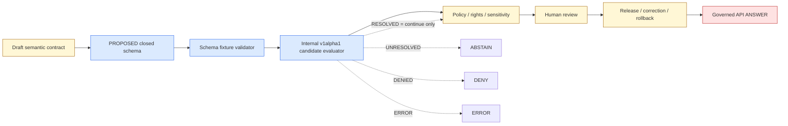
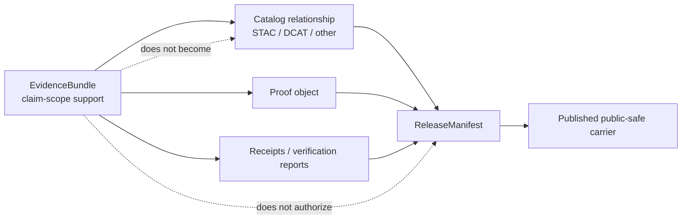

<!-- [KFM_META_BLOCK_V2]
doc_id: kfm://doc/standards/evidence-bundle
title: EvidenceBundle — Repository Profile and Interoperability Boundary
type: standard; evidence-profile-guidance; interoperability-boundary
version: v2.0
status: "draft; repository-grounded; mixed-maturity; non-authoritative"
owners: ["@bartytime4life"]
created: 2026-05-24
updated: 2026-08-18
policy_label: repository-facing; evidence; standards-guidance; cite-or-abstain; non-release; non-publication
owning_root: docs/
current_path: docs/standards/EVIDENCE_BUNDLE.md
responsibility: "Describe the current repository EvidenceBundle profile, its validation and resolver boundaries, and its relationship to external standards without redefining semantic, machine-shape, policy, evidence, release, or publication authority."
truth_posture: "CONFIRMED current path, accepted placement, draft contract, proposed closed schema, minimal schema fixtures, validator wrapper, domain projections, internal v1alpha1 resolver, read-only CI, inactive evidence-policy stub, and fail-closed governed-api scaffold / PROPOSED graduation path and standards mappings / UNKNOWN authoritative registry, active policy, released bundle instances, production consumers, and external interoperability / NEEDS VERIFICATION specialist ownership, independent review, current hosted checks, and release integration"
evidence_snapshot:
  repository: bartytime4life/Kansas-Frontier-Matrix
  base_ref: main
  base_commit: f9a515a1124f9f5397996f6bc7cb3fd1a3534c40
  prior_target_blob: a8d4c2a569790635cda0dc96744e43fe9af56b8d
  contract_blob: 731c348832add23cddd14e796aa56ce2b9268259
  schema_blob: cf5256831b63dca46a5f68b168441adcf68b8751
  schema_validator_blob: c1760c5e92eae6390f5adcde4593e8e9bab26535
  schema_fixture_readme_blob: 89ace659414a757c14a4d3e516fd31d44c6a9969
  resolver_readme_blob: d64f112e9fe6538178c74dd31cc751235781c7f3
  resolver_workflow_blob: 39f9ba31bf6d88987e3f7281d3a92a62546a08da
  evidence_policy_stub_blob: d60a9ea030ca57f5d577dabd760343e9d73a725c
  canonicalization_blob: dc1a945417e0abf6761ccb4980f03433d8e2ba64
  codeowners_blob: dd2a84aa514d8ecd9208bc347f90f9a2ed37dd61
related:
  - docs/standards/README.md
  - docs/doctrine/directory-rules.md
  - docs/adr/ADR-0029-adopt-directory-governance-standard-v2.md
  - docs/architecture/contract-schema-policy-split.md
  - docs/architecture/evidence-identity.md
  - docs/architecture/governed-api.md
  - docs/standards/CANONICALIZATION.md
  - docs/standards/SIGNING.md
  - docs/standards/PROV.md
  - docs/standards/PROVENANCE.md
  - contracts/evidence/evidence_bundle.md
  - contracts/evidence/evidence_ref.md
  - contracts/evidence/verification_state_history.md
  - schemas/contracts/v1/evidence/evidence_bundle.schema.json
  - schemas/contracts/v1/evidence/evidence_ref.schema.json
  - schemas/contracts/v1/common/spec_hash.schema.json
  - policy/evidence/README.md
  - packages/evidence-resolver/README.md
  - .github/workflows/evidence-resolver.yml
tags: [kfm, standards, EvidenceBundle, EvidenceRef, evidence, schema, resolver, provenance, signing, catalog, interoperability, cite-or-abstain]
notes:
  - "v2.0 replaces the May 2026 proposal-only conformance dossier with a current-repository profile and explicit authority boundary."
  - "The current EvidenceBundle schema is a closed JSON object with ten required fields; it does not declare JSON-LD, PROV-O, signatures, attestations, STAC/DCAT records, content-addressed URIs, or an external conformance certificate."
  - "The internal resolver is non-authoritative. RESOLVED means CONTINUE_GOVERNED_CHECKS, never public ANSWER, release, or publication."
  - "Legacy major-section anchors are retained through explicit HTML aliases."
  - "This update changes no contract, schema, policy, fixture, validator, test, workflow, package, data object, release state, deployment, or publication surface."
[/KFM_META_BLOCK_V2] -->

<a id="top"></a>
<a id="quick-jump"></a>
<a id="evidencebundle--external-standards-conformance-dossier"></a>

# EvidenceBundle — Repository Profile and Interoperability Boundary

> **One-line rule.** A current KFM `EvidenceBundle` is a proposed, closed claim-scope support shape plus bounded validation and candidate-resolution surfaces; it is not evidence truth, policy permission, review approval, release authority, publication, or an externally certified interoperability package.

[](#status-at-a-glance)
[](#5-conformance-baseline)
[](#12-validation-pipeline)
[](#11-policy-sensitivity-and-redaction)
[](#10-trust-topologies)
[](#3-operating-boundary)

> [!IMPORTANT]
> **Human-readable standards guidance only.** [`contracts/evidence/evidence_bundle.md`](../../contracts/evidence/evidence_bundle.md) owns semantic meaning; [`schemas/contracts/v1/evidence/evidence_bundle.schema.json`](../../schemas/contracts/v1/evidence/evidence_bundle.schema.json) owns the current machine shape; [`policy/evidence/`](../../policy/evidence/README.md) is the policy-source lane; implementation, fixtures, tests, workflows, governed data, and `release/` own their separate responsibilities. This page may explain those surfaces but cannot make them adopted, authoritative, released, or public.

> [!CAUTION]
> **The May 2026 dossier overclaimed current conformance.** The repository does not support treating every bundle as JSON-LD, PROV-O/PAV-complete, content-addressed, Cosign/DSSE/SLSA-attested, STAC/DCAT/ISO-mapped, OpenLineage-bound, or independently externally verifiable. Those ideas remain design lineage or graduation candidates unless an owning contract, schema, policy, implementation, fixture suite, consumer, and release record establish them.

> [!WARNING]
> **`RESOLVED` is not `ANSWER`.** The implemented package evaluates caller-supplied candidate state without registry, network, source, or policy lookup. A `RESOLVED` result remains `authoritative: false`, projects only to `CONTINUE_GOVERNED_CHECKS`, and is not renderable.

**Quick navigation:** [Status](#status-at-a-glance) · [Purpose](#1-purpose) · [Scope](#2-scope-guardrail--what-this-doc-is-not) · [Boundary](#3-operating-boundary) · [Standards](#4-external-standards-conformance-matrix) · [Profile](#5-conformance-baseline) · [Identity](#6-content-addressing) · [Provenance](#7-provenance--prov-o--pav-alignment) · [Signing](#8-signing-and-attestation) · [Catalog](#9-catalog-interoperability--stac-dcat-iso-19115) · [Trust](#10-trust-topologies) · [Verification](#11-external-verification-flow) · [Validation](#12-validation-pipeline) · [Open work](#13-open-questions) · [Related](#14-related-docs) · [Example](#appendix-a--worked-external-verification) · [Placement](#appendix-b--placement-rationale)

---

<a id="status-at-a-glance"></a>

## Status at a glance

Evidence snapshot: `main@f9a515a1124f9f5397996f6bc7cb3fd1a3534c40`; prior document blob `a8d4c2a569790635cda0dc96744e43fe9af56b8d`.

| Surface | Current repository evidence | Safe conclusion |
|---|---|---|
| Placement | Accepted [`ADR-0029`](../adr/ADR-0029-adopt-directory-governance-standard-v2.md) adopts Directory Rules v2, and [`docs/standards/README.md`](./README.md) classifies this path as an evidence-bundle documentation profile. | **CONFIRMED `PLACE` at the existing path** for human-readable guidance only. |
| Review routing | Repository-default CODEOWNERS routes this path to `@bartytime4life`. | **CONFIRMED GitHub route;** accountable evidence, policy, release, security, and independent-review stewardship remain **NEEDS VERIFICATION**. |
| Semantic contract | [`contracts/evidence/evidence_bundle.md`](../../contracts/evidence/evidence_bundle.md) is draft v0.2 and describes a claim-scope closure artifact. | **CONFIRMED present / PROPOSED meaning.** It is not an accepted release or policy decision. |
| Machine shape | The shared schema is JSON Schema Draft 2020-12, closed at the root, requires ten fields, and declares `x-kfm.status: PROPOSED`. | **CONFIRMED shape / PROPOSED profile.** Shape validity is not semantic or policy closure. |
| Generic fixtures | The contract fixture family contains one valid fixture, one missing-`bundle_id` negative fixture, and one expected-error matcher. | **CONFIRMED minimal polarity coverage.** Broad semantic and negative coverage is not established. |
| Generic validator | `tools/validators/validate_evidence_bundle.py` delegates to the shared JSON Schema runner. | **CONFIRMED shape validator.** It does not resolve references, recompute meaning-bearing digests, evaluate rights, or authorize release. |
| Domain projections | Domain schemas can reference the shared shape; the soil projection, for example, denies independent fields and declares no public-release authority. | **CONFIRMED projection pattern.** Domain projection does not establish domain evidence truth. |
| Candidate resolver | `packages/evidence-resolver/` implements only `kfm/evidence-ref-bundle-candidate/v1alpha1`, using explicit caller-supplied objects and snapshots. | **CONFIRMED bounded internal alpha.** No authoritative registry lookup, evidence creation, policy evaluation, review, release, or public outcome. |
| Resolver validation | `make evidence-resolver` runs 21 synthetic fixtures and 19 standard-library tests; `make evidence-resolver-deny` keeps all negatives non-`RESOLVED`. | **CONFIRMED declared local test surface.** Current exact-head execution remains a separate check. |
| Policy | `policy/evidence/bundle_closure_required.rego` is a proposed stub whose only operative rule is `default deny := false`; its sample rule is commented out. | **CONFIRMED inactive policy stub.** `deny = false` must not be interpreted as allow, closure, or release permission. |
| Governed API | The current `/evidence` route is part of a fail-closed `ABSTAIN / NOT_IMPLEMENTED` scaffold. | **CONFIRMED negative scaffold.** No public EvidenceBundle-backed `ANSWER` path is established. |
| Release and publication | No released EvidenceBundle instance, authoritative public resolver, production consumer, or external conformance certificate was established by the inspected surfaces. | **UNKNOWN / NOT ESTABLISHED.** Do not infer absence beyond the bounded search, and do not claim maturity. |

### State separation

The following states are independent:

```text
path present
  != semantic contract accepted
  != schema valid
  != cross-record closure
  != candidate RESOLVED
  != policy allowed
  != review approved
  != release authorized
  != public ANSWER
  != publication
  != external interoperability certification
```

A green check proves only its declared boundary at a specific revision.

[Back to quick navigation](#quick-jump)

---

<a id="1-purpose"></a>
<a id="1-why-this-dossier-exists"></a>

## 1. Purpose

This page has three responsibilities:

1. record the **current repository profile** that external and internal readers can actually inspect;
2. distinguish current bindings from **proposed standards relationships**; and
3. define the evidence required before stronger conformance language may be used.

The prior edition treated a large future architecture as current behavior. It described bundles as content-addressed JSON-LD objects carrying PROV-O, PAV, signatures, attestations, STAC/DCAT relationships, and cross-topology verification. The current schema carries none of those fields. The current validator checks shape, while the current resolver checks one non-authoritative candidate profile over supplied snapshots.

This revision therefore uses the following vocabulary:

| Term | Meaning in this page |
|---|---|
| **Current profile** | Repository-present contract/schema/validator/resolver behavior at the pinned revision. |
| **Relationship** | An adjacent standard or object family that may be referenced without being embedded or adopted. |
| **Graduation candidate** | A proposed binding that requires owning artifacts, validation, consumers, review, and compatibility evidence. |
| **Conformance** | A bounded claim tied to a named profile, version, validator, fixtures, and observed producer/consumer behavior. |
| **Publication** | A separate governed state requiring release, correction, and rollback authority. |

> [!NOTE]
> `EvidenceBundle outranks generated language` is a KFM trust principle. It does not make every object named `EvidenceBundle` truthful, admissible, released, or public. The bundle itself must still be applicable to the claim scope and pass the remaining governed checks.

[Back to quick navigation](#quick-jump)

---

<a id="2-scope-guardrail--what-this-doc-is-not"></a>
<a id="2-scope-guardrail"></a>

## 2. Scope guardrail — what this document is not

### In scope

- current contract and schema posture;
- exact required fields and closed-shape constraints;
- current fixture, validator, resolver, workflow, policy, and governed-API boundaries;
- identity, canonicalization, provenance, signing, catalog, and standards relationships;
- finite outcomes and non-equivalences;
- graduation evidence and rollback requirements;
- compatibility with legacy anchors and readers.

### Out of scope

- changing the semantic contract or machine schema;
- deciding source authority, evidence truth, claim-scope applicability, rights, sensitivity, or policy;
- selecting an authoritative evidence registry;
- activating a source or network connector;
- creating a release, correction, withdrawal, rollback, deployment, or publication;
- certifying external interoperability;
- accepting an ADR or changing repository governance;
- turning examples into evidence or production records.

### Authority map

| Question | Owning surface | This page may do |
|---|---|---|
| What does `EvidenceBundle` mean? | [`contracts/evidence/evidence_bundle.md`](../../contracts/evidence/evidence_bundle.md) | Report the current draft meaning and conflicts. |
| What machine representation is valid? | [`schemas/contracts/v1/evidence/evidence_bundle.schema.json`](../../schemas/contracts/v1/evidence/evidence_bundle.schema.json) | Summarize exact constraints and status. |
| What does `EvidenceRef` mean? | [`contracts/evidence/evidence_ref.md`](../../contracts/evidence/evidence_ref.md) | Explain pointer-versus-closure separation. |
| What candidate checks exist? | [`packages/evidence-resolver/`](../../packages/evidence-resolver/README.md) | Document the implemented alpha boundary. |
| What is admissible or disclosable? | [`policy/evidence/`](../../policy/evidence/README.md), source rights, sensitivity, review, and release authorities | Expose the current policy gap; never infer allow. |
| What validates a bounded requirement? | Fixtures, validators, tests, and invoking workflows | Name the checked surface and proof limit. |
| Which materialized instance is governed evidence or proof? | Governed `data/` families | Avoid treating docs, examples, and fixtures as evidence. |
| Which release/correction/rollback applies? | `release/` | State prerequisites; never approve. |
| Where human standards guidance lives | Adopted Directory Rules and [`docs/standards/README.md`](./README.md) | Maintain this same-path profile. |

[Back to quick navigation](#quick-jump)

---

<a id="3-authority-and-standing"></a>
<a id="3-operating-boundary"></a>

## 3. Operating boundary

The current bounded flow is:


```mermaid
flowchart LR
    C["Draft semantic contract"] --> S["PROPOSED closed schema"]
    S --> V["Schema fixture validator"]
    V --> R["Internal v1alpha1 candidate evaluator"]
    R --> P["Policy / rights / sensitivity"]
    P --> H["Human review"]
    H --> L["Release / correction / rollback"]
    L --> A["Governed API ANSWER"]

    R -. "RESOLVED = continue only" .-> P
    R -. "UNRESOLVED" .-> B["ABSTAIN"]
    R -. "DENIED" .-> D["DENY"]
    R -. "ERROR" .-> E["ERROR"]

    classDef current fill:#dbeafe,stroke:#2563eb;
    classDef proposed fill:#fff7d6,stroke:#a16207;
    classDef held fill:#fee2e2,stroke:#b91c1c;
    class S,V,R current;
    class C,P,H,L proposed;
    class A held;
```

The diagram shows responsibility order, not implementation closure. The current package does not call the policy, review, release, or API surfaces.

### Lifecycle and trust membrane

```text
RAW -> WORK / QUARANTINE -> PROCESSED -> CATALOG / TRIPLETS -> PUBLISHED
```

- A contract or schema is not lifecycle data.
- A fixture is synthetic test material, not evidence.
- A validator result is not a proof or release.
- A candidate resolver result creates no lifecycle transition.
- Public clients must consume governed interfaces and released public-safe artifacts, not proof stores or candidate inputs.
- Corrections and withdrawals must preserve lineage instead of silently replacing prior support.

### Object-family non-collapse

| Object or status | It is | It is not |
|---|---|---|
| `EvidenceRef` | A pointer with `ref`, `kind`, and optional `bundle_ref`. | Proof that a bundle exists or applies. |
| `EvidenceBundle` | A proposed claim-scope support package. | PolicyDecision, ReviewRecord, ReleaseManifest, receipt, catalog record, API response, or AI answer. |
| Schema-valid bundle | A value accepted by the current JSON Schema. | Cross-record closure, citation accuracy, rights clearance, or release readiness. |
| Resolver `RESOLVED` | A local candidate passed the named v1alpha1 checks over supplied state. | Evidence truth, public `ANSWER`, review, release, or publication. |
| `spec_hash` | Integrity identity for an admitted specification projection. | Bundle ID, source-native ID, release ID, citation, or truth. |
| Receipt | Process memory and audit support. | Evidence or release authority by itself. |
| ReleaseManifest | A release-governance object. | EvidenceBundle semantics or source truth. |

[Back to quick navigation](#quick-jump)

---

<a id="4-external-standards-conformance-matrix"></a>
<a id="4-authority-and-placement"></a>

## 4. External-standards relationship matrix

This table replaces blanket `CONFORMS` claims with the strongest result supported by the current repository.

| Standard or practice | Current EvidenceBundle binding | Status and limit | Graduation evidence required |
|---|---|---|---|
| JSON Schema Draft 2020-12 | The shared schema declares this dialect. | **CONFIRMED direct machine-shape binding.** It proves only schema behavior. | Stable schema version, compatibility policy, representative fixtures, observed producers/consumers. |
| RFC 8785 JCS | KFM has a generic JCS + SHA-256 hashing implementation, and `spec_hash` uses the current common wrapper. | **CONFIRMED adjacent implementation / PARTIAL bundle binding.** The EvidenceBundle schema does not define its meaning-bearing projection or require recomputation. | Accepted EvidenceBundle hash domain, field projection, vectors, recomputation validator, producer/consumer parity. |
| SHA-256 | `checksums` values and the common `spec_hash.value` use `sha256:<64-lowercase-hex>`. | **CONFIRMED syntax.** Digest presence is not proof of correct coverage, provenance, or truth. | Coverage rules, recomputation, failure codes, correction behavior, migration policy. |
| JSON-LD 1.1 | No `@context`, `@id`, graph, or JSON-LD profile field exists in the current schema. | **NOT ESTABLISHED.** The prior “bundle is JSON-LD” claim is withdrawn. | Accepted semantic profile, context authority, schema/shape strategy, canonicalization profile, vectors, consumers. |
| RDF dataset canonicalization | No RDF canonicalizer or EvidenceBundle RDF identity is verified. | **UNKNOWN / NOT IMPLEMENTED.** | Accepted RDF wire grammar, bounded implementation, vectors, dual-identity migration, consumer need. |
| W3C PROV-O / PAV | No PROV or PAV field is present. `transforms` and `source_records` are strings only. | **ADJACENT GUIDANCE / NOT DIRECT CONFORMANCE.** | Accepted provenance projection, resolver rules, fixtures, validation, correction and release bindings. |
| STAC / DCAT | Catalog profiles are separate object families; the bundle schema contains no STAC Item, DCAT Distribution, or catalog-link contract. | **SEPARATE RELATIONSHIP / NOT DIRECT CONFORMANCE.** | Accepted link relation, identity rules, synthetic and real closure fixtures, producer/consumer parity. |
| ISO 19115 / Dublin Core | No direct field mapping or application profile is declared by the bundle schema. | **NO DIRECT BINDING.** | Object-family-specific mapping, loss rules, identifiers, rights/sensitivity handling, tests. |
| SPDX identifiers | `rights.license` is an unconstrained string. | **NO SPDX VALIDATION.** `NOASSERTION` may be data, but the schema does not interpret it. | Accepted rights contract, SPDX grammar/version policy, exceptions, negative fixtures, evaluator binding. |
| Sigstore / Cosign | No signature, certificate, transparency-log, or signer field exists. | **ADJACENT SIGNING GUIDANCE / NOT BUNDLE CONFORMANCE.** | Signature carrier and subject binding, key/identity policy, verifier, negative tests, release integration. |
| DSSE / in-toto / SLSA | No attestation envelope or predicate reference exists in the profile. | **NOT ESTABLISHED.** | Accepted attestation object family, digest binding, storage, verifier, builder policy, rollback behavior. |
| OpenLineage | No run/event identity or facet binding exists in the profile. | **NOT ESTABLISHED.** | Accepted event relationship, ID rules, producer, consumer, replay and correction tests. |
| CIDOC-CRM E13 | No scholarly-attribution crosswalk is bound to the profile. | **REFERENCE ONLY.** | A scoped mapping decision and demonstrated use case. |
| Content-addressed URI schemes | `bundle_id` is a pattern-constrained identifier, not a required digest URI. | **NOT REQUIRED.** `kfm://`, OCI, IPFS, or similar transport forms are not current profile rules. | Accepted identity/transport separation, resolver registry, immutable storage behavior, migration and correction policy. |

> [!IMPORTANT]
> A future document may say “conforms” only when it names the exact KFM profile, upstream version or immutable identifier, mandatory requirement set, validator, positive and negative fixtures, producer, consumer, review state, and release evidence. Standards prose alone cannot grant that status.

[Back to quick navigation](#quick-jump)

---

<a id="5-identity-and-canonicalization"></a>
<a id="5-conformance-baseline"></a>
<a id="7-evidencebundle-canonical-form"></a>

## 5. Current machine profile

The shared schema currently defines a single closed JSON object.

### Required fields

| Field | Current shape | What it can establish | What it cannot establish |
|---|---|---|---|
| `bundle_id` | String matching `^[a-z][a-z0-9_:.-]*$`. | Syntactic bundle identifier. | Content address, global uniqueness, registry presence, or release identity. |
| `claim_scope` | String. | A supplied scope statement. | Formal claim logic, semantic equivalence, geography/time support, or applicability. |
| `evidence_refs` | Non-empty array of current `EvidenceRef` objects. | Structural membership list. | Reference resolution, source authority, freshness, correction state, or closure. |
| `source_records` | Non-empty array of strings. | Supplied record handles. | SourceDescriptor binding, native-ID semantics, provenance graph, or fetchability. |
| `citations` | Non-empty array of strings. | Supplied citation text. | Citation accuracy, quote support, locator validity, or publication suitability. |
| `rights` | Closed object requiring string `license`. | Presence of one supplied license value. | Rights ownership, jurisdiction, obligations, SPDX validity, compatibility, or permission. |
| `sensitivity` | Current `sensitivity_label` object. | Presence of level, reason, and applied time in the proposed shape. | Policy correctness, reviewer authority, transform adequacy, or disclosure permission. |
| `transforms` | Array of strings; empty is allowed. | Supplied transform labels. | Ordering semantics, executable identity, provenance closure, or deterministic replay. |
| `checksums` | Non-empty map whose values match `sha256:<hex>`. | Presence of syntactically valid digest strings. | Coverage, recomputation, canonicalization, or subject binding. |
| `spec_hash` | Current common object `{ "value": "sha256:<hex>" }`. | Supplied spec identity in the executable grammar. | Bundle identity, release identity, evidence truth, or accepted migration to another grammar. |

All ten fields are required, and undeclared root fields are rejected. The schema metadata remains `PROPOSED`.

### Fields the current profile does not contain

The current profile has no top-level field for:

- version, creation time, valid time, retrieval time, review time, or release time;
- JSON-LD `@context` or RDF graph;
- structured SourceDescriptor, source role, or source authority;
- structured citation locator, excerpt, quotation, or support relationship;
- structured provenance activity, agent, entity, or derivation edge;
- signature, signer, certificate, key, transparency log, or attestation;
- STAC, DCAT, ISO, Dublin Core, OpenLineage, or CIDOC record;
- PolicyDecision, ReviewRecord, ReleaseManifest, CorrectionNotice, or RollbackCard;
- canonical registry, supersession, correction, or withdrawal snapshot;
- public-renderability or publication authority.

Adding any of these is a contract/schema evolution task, not a documentation shortcut.

### Illustrative schema-valid shape

The record below is synthetic documentation data. It is not evidence, a proof, a source record, policy permission, review, release, or publication.

```json
{
  "bundle_id": "kfm:evidence-bundle:synthetic-001",
  "claim_scope": "Synthetic documentation example only.",
  "evidence_refs": [
    {
      "ref": "kfm:evidence:synthetic-record-001",
      "kind": "record",
      "bundle_ref": "kfm:evidence-bundle:synthetic-001"
    }
  ],
  "source_records": [
    "kfm:source-record:synthetic-001"
  ],
  "citations": [
    "Synthetic citation for documentation validation only."
  ],
  "rights": {
    "license": "NOASSERTION"
  },
  "sensitivity": {
    "level": "public",
    "reason": "Synthetic non-sensitive documentation example.",
    "applied_at": "2026-08-18T00:00:00Z"
  },
  "transforms": [],
  "checksums": {
    "synthetic_record": "sha256:0000000000000000000000000000000000000000000000000000000000000000"
  },
  "spec_hash": {
    "value": "sha256:1111111111111111111111111111111111111111111111111111111111111111"
  }
}
```

Passing the schema with this record would prove only that the declared shape is accepted.

[Back to quick navigation](#quick-jump)

---

<a id="6-content-addressing"></a>
<a id="6-source-record-metadata"></a>
<a id="8-bundle-id-and-content-addressing"></a>

## 6. Identity, canonicalization, and content addressing

### Identity domains remain distinct

| Value | Current role | Non-equivalence rule |
|---|---|---|
| `bundle_id` | Stable-looking object identifier supplied by the record. | Must not be assumed to equal a digest, URI, release ID, source ID, or `spec_hash`. |
| `EvidenceRef.ref` | Pointer identity for a measurement, record, dataset, or artifact. | Must not be assumed to identify the bundle or prove membership. |
| `checksums.*` | Named SHA-256 digest strings for unspecified covered subjects. | Must not be treated as `bundle_id`, `spec_hash`, or release identity. |
| `spec_hash.value` | SHA-256 identity of an admitted specification projection under current common tooling. | Must not be treated as the bundle's content digest unless an accepted object-family rule says so. |
| Source-native ID | Identity assigned by the source system. | Must remain distinguishable from KFM object identity. |
| Release ID | Identity of a governed release decision or manifest. | Must remain owned by release authority. |

### Current canonicalization posture

[`CANONICALIZATION.md`](./CANONICALIZATION.md) records a generic RFC 8785 JCS plus SHA-256 implementation with current wire grammar `sha256:<64-lowercase-hex>`. It also records that the proposed `jcs:sha256:<hex>` migration is not adopted.

For EvidenceBundle specifically, current repository evidence does **not** establish:

- the exact meaning-bearing field projection used to compute its `spec_hash`;
- whether `bundle_id`, citations, sensitivity time, checksums, or other values are included or normalized;
- a bundle-specific digest recomputation validator;
- cross-language bundle vectors;
- equivalence between whole-object bytes and `spec_hash`;
- a required content-addressed URI or storage layout.

Therefore:

1. use only the current `sha256:<hex>` grammar where the schema requires it;
2. do not emit `jcs:sha256:`, `urdna2015:sha256:`, `rdfc:sha256:`, or another prefix as current EvidenceBundle data;
3. do not infer that the same `bundle_id` implies the same bytes;
4. do not infer that matching digests imply evidence truth or release authority; and
5. treat OCI, IPFS, `kfm://entity-bundle/`, and similar locations as proposed transport or registry designs until adopted and implemented.

### Required graduation work

A content-addressed EvidenceBundle profile needs, at minimum:

- one accepted identity contract separating object ID, content digest, spec hash, source-native IDs, and release IDs;
- an object-family canonicalization projection;
- deterministic vectors and mutation tests;
- a recomputation validator with stable reason codes;
- storage and resolver semantics;
- correction, supersession, withdrawal, retention, and garbage-collection rules;
- producer and consumer parity; and
- migration and rollback evidence.

[Back to quick navigation](#quick-jump)

---

<a id="7-provenance--prov-o--pav-alignment"></a>
<a id="9-provenance-and-derivation"></a>

## 7. Provenance and derivation

The current schema carries three coarse provenance-adjacent surfaces:

- `source_records`: strings;
- `transforms`: strings; and
- `checksums`: named digest strings.

Those fields can help a later resolver or reviewer, but they do not form a provenance graph and do not satisfy an external provenance profile by themselves.

### Current limits

| Concern | Current state | Required stronger surface |
|---|---|---|
| Source role and authority | Not represented in the bundle schema. | Bound SourceDescriptor/source-role records and policy rules. |
| Source record identity | Unstructured strings. | Accepted identifier grammar and resolvable record snapshots. |
| Transform order and parameters | Unstructured strings; no execution identity. | Structured transform records or receipt references with deterministic ordering. |
| Activity, agent, entity relationships | Absent. | Accepted provenance projection, such as a scoped PROV profile, if the use case requires it. |
| Citation support relationship | Citation strings only. | Structured locator, claim-support edge, quotation/excerpt rules, and citation validation. |
| Correction and supersession | Not represented in the bundle schema. | Authoritative history/correction objects and release propagation. |
| Replay | Not guaranteed by the bundle alone. | Inputs, executable/spec identity, time, environment where material, and deterministic validation. |

The current resolver consumes a separate `VerificationStateHistory` snapshot supplied by the caller. That preserves an important boundary: history replay is not silently invented from `source_records` or `transforms`.

### PROV-O and PAV relationship

[`PROV.md`](./PROV.md), [`PROVENANCE.md`](./PROVENANCE.md), and the nested [`PROV/`](./PROV/README.md) lane describe provenance ideas with mixed maturity. None of those documents makes PROV-O or PAV mandatory for the current EvidenceBundle schema. A future binding must identify whether provenance is:

- embedded in a bundle;
- referenced by immutable ID;
- emitted as a separate catalog/proof projection; or
- reconstructed from receipts and governed history.

The choice affects identity, canonicalization, privacy, correction, payload size, and interoperability. It requires a reviewed profile rather than a sentence in this page.

[Back to quick navigation](#quick-jump)

---

<a id="8-signing-and-attestation"></a>
<a id="10-signing-attestation-and-key-binding"></a>

## 8. Signing, attestation, and key binding

The current EvidenceBundle profile contains no signing or attestation fields. A schema-valid bundle cannot, by itself, tell a verifier:

- who created or signed it;
- which identity provider or key was used;
- which bytes or digest were signed;
- whether a signature was logged or revoked;
- which builder, inputs, invocation, or environment produced it;
- which attestation predicate or envelope applies; or
- whether a release authority accepted the result.

[`SIGNING.md`](./SIGNING.md) is the adjacent human-readable signing guidance. It does not automatically bind Sigstore, Cosign, DSSE, in-toto, SLSA, a transparency log, a KMS, or an OIDC issuer to EvidenceBundle.

### Safe current posture

| Claim | Current result |
|---|---|
| “Every EvidenceBundle is signed.” | **NOT ESTABLISHED** |
| “Keyless Sigstore is the default.” | **NOT ESTABLISHED for EvidenceBundle** |
| “A bundle has SLSA provenance.” | **NOT ESTABLISHED** |
| “An external verifier can discover the signature from the bundle.” | **NOT ESTABLISHED** |
| “Signature verification authorizes release.” | **DENY as an inference** — signature and release are separate. |

### Graduation requirements

A signing or attestation binding must define:

1. the signed subject and canonical bytes;
2. the signature or attestation object family and location;
3. digest, bundle ID, spec hash, and release-manifest bindings;
4. accepted algorithms, keys or identities, trust roots, expiry, and revocation;
5. offline and degraded verification behavior;
6. stable finite outcomes and safe diagnostics;
7. positive, tampered, wrong-subject, expired, revoked, and untrusted-identity fixtures;
8. policy and review obligations;
9. release, correction, withdrawal, and rollback behavior; and
10. independent interoperability evidence.

A signature can support integrity and origin. It cannot replace source authority, claim support, rights, sensitivity, review, or release.

[Back to quick navigation](#quick-jump)

---

<a id="9-catalog-interoperability--stac-dcat-iso-19115"></a>

## 9. Catalog interoperability — STAC, DCAT, and metadata profiles

`EvidenceBundle`, catalog record, proof object, receipt, release manifest, and published carrier remain separate families.


```mermaid
flowchart LR
    EB["EvidenceBundle\nclaim-scope support"] --> CR["Catalog relationship\nSTAC / DCAT / other"]
    EB --> PR["Proof object"]
    EB --> RR["Receipts / verification reports"]
    CR --> RM["ReleaseManifest"]
    PR --> RM
    RR --> RM
    RM --> PA["Published public-safe carrier"]

    EB -. "does not become" .-> CR
    EB -. "does not authorize" .-> RM
```

### Current result

- The shared EvidenceBundle schema has no STAC Item, asset, link, collection, or extension field.
- It has no DCAT Dataset or Distribution field.
- It has no ISO 19115 or Dublin Core application-profile field.
- It has no standard link relation for signature, attestation, proof, release, correction, or rollback.
- Synthetic STAC/DCAT/PROV catalog-closure work elsewhere in the repository is bounded to its declared release-candidate profile. It does not create a general EvidenceBundle application profile.
- Domain projection schemas reference the shared EvidenceBundle shape rather than adding independent catalog fields.

### Safe relationship pattern

A future catalog may reference a released bundle by governed identifier, and a bundle may be discoverable through catalog closure, provided that:

- each object keeps its own identity and authority;
- references are resolvable at the authorized exposure level;
- public catalogs do not leak proof-store paths, restricted sources, or sensitive reasons;
- corrections and withdrawals propagate through catalog, cache, API, map, export, and AI surfaces; and
- catalog discoverability is never treated as proof, release, or publication authority.

Profile-specific mapping belongs in the corresponding standards page and machine profile, not in the base EvidenceBundle schema by implication.

[Back to quick navigation](#quick-jump)

---

<a id="10-trust-topologies"></a>

## 10. Trust topologies and current implementation depth

The previous dossier required every bundle to be verifiable through CI-centric, manifest-level, and edge/mobile topologies. Current repository evidence does not establish that requirement.

| Topology or stage | Current evidence | Status |
|---|---|---|
| Generic schema validation | One positive and one negative contract fixture plus shared JSON Schema runner. | **IMPLEMENTED, narrow** |
| Local/CI candidate resolution | Internal v1alpha1 package, synthetic fixtures, standard-library tests, validator wrapper, and read-only workflow. | **IMPLEMENTED, non-authoritative** |
| Authoritative registry resolution | No repository/store/network lookup in the package; caller supplies the lookup snapshot. | **NOT IMPLEMENTED in this slice** |
| Evidence admissibility | Caller supplies a policy outcome; package does not evaluate policy. Evidence-policy Rego is an inactive stub. | **NOT IMPLEMENTED** |
| Human review and separation of duties | No accepted EvidenceBundle review flow established by this profile. | **NEEDS VERIFICATION** |
| Release/correction/rollback integration | No base-profile binding established. | **NOT ESTABLISHED** |
| Governed public `ANSWER` | Governed API remains an `ABSTAIN / NOT_IMPLEMENTED` scaffold. | **NOT IMPLEMENTED** |
| External manifest verification | No complete bundle signature/catalog/release verifier established. | **NOT ESTABLISHED** |
| Edge/mobile/offline partial verification | No EvidenceBundle-specific implementation or profile established. | **UNKNOWN / FUTURE** |

### Current runtime projection

```text
resolver RESOLVED   -> CONTINUE_GOVERNED_CHECKS
resolver UNRESOLVED -> ABSTAIN
resolver DENIED     -> DENY
resolver ERROR      -> ERROR
```

Every projection remains non-authoritative and non-renderable. No resolver outcome maps directly to `ANSWER`.

### Remaining governed checks after `RESOLVED`

The checked-in resolver documentation names at least:

- evidence authority;
- rights;
- sensitivity;
- policy;
- review;
- release;
- citation; and
- correction.

A consumer may require additional checks according to domain, source, scope, precision, time, or consequence. This page does not define that policy.

[Back to quick navigation](#quick-jump)

---

<a id="11-external-verification-flow"></a>
<a id="11-policy-sensitivity-and-redaction"></a>

## 11. Current verification flow, policy, sensitivity, and redaction

### What an external or internal verifier can do today

Given a candidate JSON file and the current repository tooling, a verifier can:

1. parse the file as JSON;
2. validate it against the proposed closed schema;
3. inspect whether required fields are present and syntactically valid;
4. run the internal candidate resolver only when the verifier also supplies the exact EvidenceRef, bundle candidate, lookup snapshot, validated VerificationStateHistory, bitemporal as-of instants, and caller policy projection required by the v1alpha1 profile; and
5. interpret a local `RESOLVED` result only as permission to continue the remaining governed checks.

A verifier cannot establish from the bundle alone:

- that source records are authoritative, retrievable, current, or rights-cleared;
- that citations accurately support the requested claim;
- that `claim_scope` is semantically equivalent to the requested scope;
- that digests cover the correct subjects or were recomputed;
- that sensitivity classification or redaction is correct;
- that policy, review, release, correction, or rollback has closed;
- that the bundle is signed or attested;
- that a public `ANSWER` is allowed; or
- that KFM or an external party has published a conforming artifact.

### Evidence-policy status

The only direct Rego file in `policy/evidence/` is a proposed greenfield stub:

```rego
package kfm.bundle_closure_required

default deny := false
```

Its illustrative deny rule is commented out. No caller may normalize this to `ALLOW`. The safe state is **evaluator unbound / evidence admissibility not established**.

### Sensitivity and redaction

The schema requires the current proposed `sensitivity_label` object, but presence is not policy correctness. Before disclosure, a governed evaluator and authorized review must consider, as applicable:

- source terms and rights;
- living-person, genomic, cultural, archaeological, ecological, infrastructure, land/title, and precise-location sensitivity;
- requested role, purpose, geography, time, and precision;
- whether generalization, redaction, staged access, delay, quarantine, abstention, or denial is required;
- transform receipts and non-leakage checks; and
- correction and rollback implications.

Sensitive reasons must not be exposed merely because the bundle carries a `reason` string.

[Back to quick navigation](#quick-jump)

---

<a id="12-tensions-and-known-limits"></a>
<a id="12-validation-pipeline"></a>

## 12. Validation pipeline and proof limits

### Repository-native commands

```bash
python tools/validators/validate_evidence_bundle.py --fixtures
make evidence-resolver
make evidence-resolver-deny
```

| Command or workflow | Current declared coverage | Does not prove |
|---|---|---|
| `validate_evidence_bundle.py --fixtures` | One valid and one invalid generic schema fixture. | Cross-record closure, digest recomputation, citations, rights, sensitivity, policy, release, or production behavior. |
| `make evidence-resolver` | 21 synthetic candidate-profile fixtures and 19 standard-library tests; deterministic, bounded, no-network checks. | Authoritative lookup, evidence truth, policy evaluation, review, release, public response, or publication. |
| `make evidence-resolver-deny` | Every negative fixture remains non-`RESOLVED`. | Completeness of all real-world denial cases. |
| `.github/workflows/evidence-resolver.yml` | Read-only CI definition for the bounded candidate and negative profiles, plus fixture-to-runtime projection checks. | Exact-head pass state, required-check significance, production deployment, or external conformance. |
| Governed API tests | Fail-closed scaffold behavior. | A substantive EvidenceBundle-backed `ANSWER`. |

### Minimum validation layers

| Layer | Question | Current state |
|---|---|---|
| Syntax | Is the input bounded valid JSON? | Resolver and schema tooling provide bounded checks in their declared lanes. |
| Schema | Does it match the proposed machine shape? | **Implemented, minimal fixture coverage.** |
| Cross-reference | Do refs, membership, lookup, subject, and verification history agree for supplied state? | **Implemented only in internal v1alpha1 candidate profile.** |
| Semantic scope | Does the bundle support the requested claim, geography, time, and precision? | **Not established.** |
| Source authority | Are source roles, records, and authority admissible? | **Not established by base profile.** |
| Citation | Do citations accurately support the claim? | **Not established by base profile.** |
| Integrity | Were meaning-bearing values canonically hashed and recomputed? | **Partial generic tooling; bundle-specific profile not established.** |
| Rights/sensitivity | May the content be used and disclosed at the requested precision? | **Policy/evaluator unbound.** |
| Review | Has authorized review closed with required separation? | **Needs verification.** |
| Release | Is there a valid release, correction, and rollback target? | **Not established.** |
| Runtime | May the governed interface return `ANSWER`? | **No current substantive path.** |
| Interoperability | Can an independent implementation reproduce the same result? | **Not established.** |

### Failure posture

- malformed or unsupported input -> `ERROR`;
- absent, stale, inconsistent, corrected, revoked, superseded, withdrawn, or incomplete supplied closure state -> `UNRESOLVED` and runtime `ABSTAIN`;
- bound caller policy denial -> `DENIED` and runtime `DENY`;
- bounded candidate success -> `RESOLVED`, then continue governed checks;
- infrastructure or validator uncertainty must never silently become allow or answer.

[Back to quick navigation](#quick-jump)

---

<a id="13-open-questions"></a>
<a id="13-open-questions-and-verification-backlog"></a>

## 13. Open questions and verification backlog

The backlog is dependency ordered. Later interoperability work must not bypass the earlier authority and closure decisions.

### P0 — authority and safe closure

1. **Ownership and independent review** — verify accountable evidence, contract, schema, policy, security, release, and correction owners without inventing identities.
2. **Contract and schema status** — accept, revise, version, or explicitly retain the current draft/proposed profile; define compatibility and deprecation rules.
3. **Canonical claim scope** — replace or govern the unconstrained string if machine-checkable geography, time, precision, claim family, or applicability is required.
4. **Authoritative lookup inputs** — define the registry, lookup snapshot, verification history, correction state, and bitemporal as-of authorities consumed by a real resolver.
5. **Evidence admissibility policy** — define fail-closed input shape, gate order, reason codes, obligations, evaluator bundle, fixtures, tests, and governed consumer binding.
6. **Rights and sensitivity semantics** — define license/source-term evaluation, sensitivity authority, transform requirements, reason exposure, and reviewer thresholds.
7. **Release, correction, withdrawal, and rollback binding** — define how bundle identity and applicability propagate through release and public surfaces.

### P1 — semantic and executable completeness

8. **Structured source records and citations** — define resolvable source-native identity, SourceDescriptor binding, locators, excerpts/quotations, support relationships, and citation validation.
9. **Transform and provenance model** — choose embedded, referenced, or derived provenance; define transform order, parameters, executable identity, receipts, and replay.
10. **EvidenceBundle hash domain** — define object-family canonicalization, field inclusion/exclusion, normalization, digest coverage, recomputation, reason codes, and migration.
11. **Cross-record validator** — add fixtures for empty/invalid members, ID mismatch, missing rights, invalid sensitivity, unknown source, stale history, correction, checksum mismatch, and unsupported scope.
12. **Governed resolver interface** — define a stable package/API contract and consumer that preserves candidate non-authority and finite outcomes.
13. **Public answer path** — connect evidence, policy, review, release, citation, freshness, correction, and precision checks before any `ANSWER` is renderable.
14. **Domain projection rules** — keep shared fields canonical; require accepted extension policy before adding domain-specific fields.

### P2 — interoperability and operational maturity

15. **Standards application profiles** — adopt only needed JSON-LD, PROV, STAC/DCAT, metadata, signing, attestation, and lineage bindings with exact profiles and tests.
16. **External reference verifier** — implement bounded, no-network-capable verification with trusted-input configuration and safe diagnostics.
17. **Cross-language vectors** — prove equivalent behavior in every admitted implementation language.
18. **Large-bundle and partial-fetch behavior** — define chunking, manifests, range integrity, denial semantics, retention, and correction.
19. **Observed producer/consumer closure** — prove at least one realistic governed producer and one consumer over a released public-safe synthetic or authorized fixture.
20. **Operational evidence** — establish hosted checks, required-check policy, telemetry, SLOs, incident/correction runbooks, and rollback rehearsals without exposing sensitive details.

### Graduation rule

A proposal graduates only when its authority owner, contract, machine shape, policy, representative fixtures, validator, tests, producer, consumer, review state, release state, correction path, and rollback path are appropriate to the claim being made.

[Back to quick navigation](#quick-jump)

---

<a id="14-related-docs"></a>

## 14. Related documents and implementation surfaces

### Governing boundaries

- [`docs/standards/README.md`](./README.md) — standards-lane responsibility and current inventory.
- [`docs/doctrine/directory-rules.md`](../doctrine/directory-rules.md) — adopted placement bytes through ADR-0029.
- [`ADR-0029`](../adr/ADR-0029-adopt-directory-governance-standard-v2.md) — accepted placement decision.
- [`contract-schema-policy-split.md`](../architecture/contract-schema-policy-split.md) — meaning, shape, and admissibility separation.
- [`evidence-identity.md`](../architecture/evidence-identity.md) — cross-root composition and current resolver boundary.
- [`governed-api.md`](../architecture/governed-api.md) — current fail-closed public interface posture.

### Meaning and shape

- [`EvidenceBundle` semantic contract](../../contracts/evidence/evidence_bundle.md).
- [`EvidenceRef` semantic contract](../../contracts/evidence/evidence_ref.md).
- [`VerificationStateHistory` semantic contract](../../contracts/evidence/verification_state_history.md).
- [`EvidenceBundle` schema](../../schemas/contracts/v1/evidence/evidence_bundle.schema.json).
- [`EvidenceRef` schema](../../schemas/contracts/v1/evidence/evidence_ref.schema.json).
- [`spec_hash` schema](../../schemas/contracts/v1/common/spec_hash.schema.json).
- [Soil domain projection example](../../schemas/contracts/v1/domains/soil/evidence_bundle.schema.json).

### Validation and implementation

- [Generic EvidenceBundle fixtures](../../fixtures/contracts/v1/evidence/evidence_bundle/README.md).
- [Generic schema validator](../../tools/validators/validate_evidence_bundle.py).
- [Evidence resolver package](../../packages/evidence-resolver/README.md).
- [Resolver implementation boundary](../../packages/evidence-resolver/src/evidence_resolver/README.md).
- [Resolver fixtures](../../fixtures/packages/evidence_resolver/README.md).
- [Resolver tests](../../tests/packages/evidence_resolver/README.md).
- [Resolver validator](../../tools/validators/evidence_resolver/README.md).
- [Resolver workflow](../../.github/workflows/evidence-resolver.yml).
- [Evidence policy boundary](../../policy/evidence/README.md).
- [Evidence policy stub](../../policy/evidence/bundle_closure_required.rego).

### Adjacent standards guidance

- [`CANONICALIZATION.md`](./CANONICALIZATION.md).
- [`SIGNING.md`](./SIGNING.md).
- [`PROV.md`](./PROV.md), [`PROVENANCE.md`](./PROVENANCE.md), and [`PROV/`](./PROV/README.md).
- [`STAC.md`](./STAC.md), [`DCAT.md`](./DCAT.md), [`ISO-19115.md`](./ISO-19115.md), and [`DUBLIN-CORE.md`](./DUBLIN-CORE.md).
- [`RELEASE_MANIFEST.md`](./RELEASE_MANIFEST.md) and [`RUN_RECEIPT.md`](./RUN_RECEIPT.md).

> [!CAUTION]
> These adjacent files have mixed maturity. Their presence does not make every discussed standard adopted or every described binding implemented.

[Back to quick navigation](#quick-jump)

---

<a id="appendix-a--worked-external-verification"></a>

## Appendix A — Worked bounded verification

This appendix demonstrates the current repository boundary. It is not an external conformance certificate.

### 1. Validate the generic schema fixtures

```bash
python tools/validators/validate_evidence_bundle.py --fixtures
```

Expected meaning of a green result:

- the checked valid fixture passes the current schema;
- the checked invalid fixture is rejected;
- the local schema registry resolves the referenced EvidenceRef, sensitivity, and spec-hash schemas.

It does not prove semantic closure, source authority, citation accuracy, policy, review, release, or publication.

### 2. Run the internal candidate profile

```bash
make evidence-resolver
make evidence-resolver-deny
```

Expected meaning of green results:

- the 21 synthetic fixture expectations match;
- the 19 standard-library tests pass;
- negative fixtures remain non-`RESOLVED`;
- bounded no-network and safe-diagnostic assertions hold for the tested revision.

### 3. Interpret candidate output safely

```text
RESOLVED   -> continue evidence authority, rights, sensitivity, policy,
              review, release, citation, and correction checks
UNRESOLVED -> ABSTAIN
DENIED     -> DENY
ERROR      -> ERROR
```

Do not transform `RESOLVED` into `ANSWER`, do not expose the candidate payload directly to a public client, and do not treat the fixture suite as real evidence.

### 4. Current external-verification limit

A third party cannot yet derive a complete current verification recipe from a bundle alone because signature discovery, attestation, authoritative registry/history lookup, policy evaluation, release binding, correction state, and public profile versioning are not established by the base object.

[Back to quick navigation](#quick-jump)

---

<a id="appendix-b--placement-rationale"></a>

## Appendix B — Placement rationale, compatibility, and rollback

### Placement result

`docs/standards/EVIDENCE_BUNDLE.md` is the existing tracked human-readable standards-guidance path.

- Accepted ADR-0029 adopts Directory Rules v2.
- `docs/standards/README.md` explicitly lists this file as an evidence-bundle documentation profile.
- The document explains a cross-root profile and standards boundary.
- It does not own semantic meaning, machine shape, policy, implementation, data, or release authority.
- No new root, sibling authority, rename, or compatibility mirror is created.

The finite placement outcome is **`PLACE` at the current path**.

### Legacy-anchor compatibility

This revision preserves explicit aliases for the prior major headings, including Purpose, Scope, Authority, external standards, identity, content addressing, provenance, signing, catalog interoperability, trust topologies, external verification, tensions, open questions, related documents, and both appendices. Inbound fragment links therefore remain addressable even though the document's conclusions changed materially.

### Correction and rollback

This change is documentation-only. Rollback is to revert the feature-branch commit or restore prior blob:

```text
a8d4c2a569790635cda0dc96744e43fe9af56b8d
```

Rollback must not revive the prior unsupported claims as implementation fact. If the older bytes are restored for historical analysis, they should be labeled as proposal-era lineage and current repository evidence should still control operational claims.

### Non-effects

This document does not:

- change a contract or schema;
- create policy or an evaluator;
- modify fixtures, validators, tests, workflows, or package code;
- activate a registry, source, connector, or network path;
- create or move evidence, proofs, receipts, catalog records, or published data;
- authorize review, release, correction, rollback execution, deployment, or publication; or
- change repository settings.

[Back to quick navigation](#quick-jump)

---

### Footer

| Field | Value |
|---|---|
| Document class | Human-readable EvidenceBundle profile and interoperability-boundary guidance |
| Current path | `docs/standards/EVIDENCE_BUNDLE.md` |
| Placement | **CONFIRMED existing path; accepted standards-guidance lane** |
| Meaning authority | [`contracts/evidence/evidence_bundle.md`](../../contracts/evidence/evidence_bundle.md) |
| Shape authority | [`schemas/contracts/v1/evidence/evidence_bundle.schema.json`](../../schemas/contracts/v1/evidence/evidence_bundle.schema.json) |
| Policy boundary | [`policy/evidence/`](../../policy/evidence/README.md) — evaluator unbound |
| Implemented resolver | Internal `kfm/evidence-ref-bundle-candidate/v1alpha1`; non-authoritative |
| Public answer | Not implemented by the inspected surfaces |
| Release/publication effect | None |
| Default GitHub review route | `@bartytime4life`; specialist and independent review **NEEDS VERIFICATION** |
| Last updated | 2026-08-18 |

[Back to top](#top)
