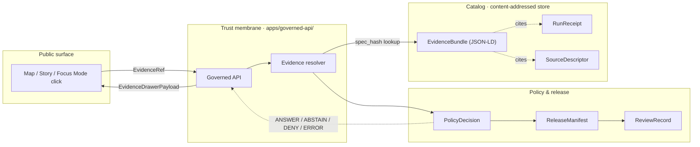
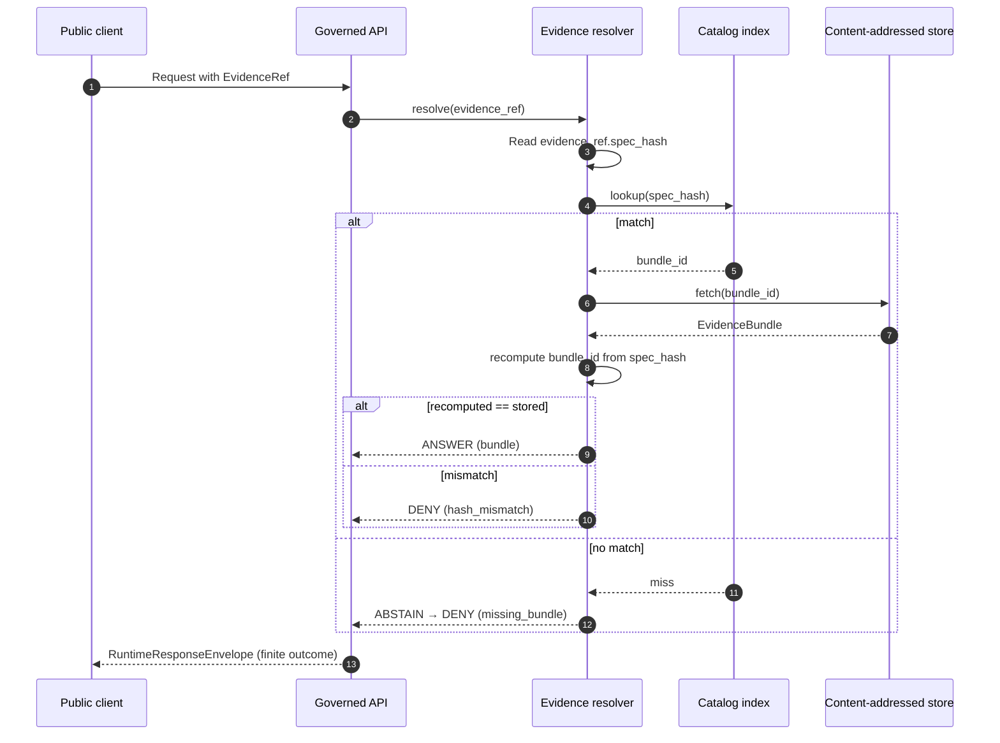

<!-- [KFM_META_BLOCK_V2]
doc_id: kfm://doc/standards/evidence-bundle
title: EvidenceBundle — KFM Standard
type: standard
version: v1.0-draft
status: draft
owners: TODO — governance / evidence stewards (placeholder, not verified)
created: 2026-05-14
updated: 2026-05-14
policy_label: public
related:
  - docs/doctrine/truth-posture.md
  - docs/doctrine/trust-membrane.md
  - docs/doctrine/lifecycle-law.md
  - docs/doctrine/directory-rules.md
  - docs/standards/CANONICALIZATION.md
  - docs/standards/STAC_DWC_PROFILE.md
  - contracts/evidence/evidence_bundle.md
  - contracts/evidence/evidence_ref.md
  - schemas/contracts/v1/evidence/evidence_bundle.schema.json
tags: [kfm, evidence, standards, jsonld, provenance, content-addressing]
notes:
  - All schema/route/package paths are PROPOSED pending mounted-repo verification.
  - Identity scheme details (bundle_id/evidence_ref_id derivation) trace to a proposal doc and are PROPOSED.
[/KFM_META_BLOCK_V2] -->

# EvidenceBundle — KFM Standard

*The admissible, content-addressed evidence package that every consequential KFM claim must resolve to before public release.*


**Status:** draft · **Authority class:** canonical (standards profile) · **Owners:** _TODO — governance / evidence stewards_ · **Last reviewed:** 2026-05-14

> [!NOTE]
> This document defines the **KFM EvidenceBundle profile** — what a bundle is, what it contains, how it is identified, how clients resolve `EvidenceRef → EvidenceBundle`, and where it sits in the trust membrane. Doctrinal claims are CONFIRMED from project sources. Specific paths, schemas, routes, and identity-scheme mechanics are PROPOSED until verified against the mounted repository and any governing ADRs.

---

## 📑 Contents

1. [Scope and audience](#1-scope-and-audience)
2. [Authority and truth posture](#2-authority-and-truth-posture)
3. [Definition](#3-definition)
4. [Place in the trust membrane](#4-place-in-the-trust-membrane)
5. [Bundle anatomy](#5-bundle-anatomy)
6. [Identity and content addressing](#6-identity-and-content-addressing)
7. [Canonicalization (JCS vs URDNA2015)](#7-canonicalization-jcs-vs-urdna2015)
8. [`EvidenceRef` ↔ `EvidenceBundle` resolution](#8-evidenceref--evidencebundle-resolution)
9. [Finite outcomes](#9-finite-outcomes)
10. [Catalog integration (STAC, DCAT, PROV)](#10-catalog-integration-stac-dcat-prov)
11. [Lifecycle placement](#11-lifecycle-placement)
12. [Validation, gates, and negative fixtures](#12-validation-gates-and-negative-fixtures)
13. [Anti-patterns](#13-anti-patterns)
14. [Open questions and verification backlog](#14-open-questions-and-verification-backlog)
15. [Related docs](#15-related-docs)
16. [Appendix · Illustrative skeleton](#16-appendix--illustrative-skeleton)

---

## 1. Scope and audience

This document is the **canonical KFM standard** for the `EvidenceBundle` object family. It is read by:

| Reader | What they take away |
|---|---|
| Schema authors | The required and recommended shape of an EvidenceBundle, plus where the machine schema lives. |
| Pipeline authors | When a bundle is minted, what it carries, and how it is content-addressed. |
| Governed API authors | The resolution contract, finite outcomes, and failure semantics. |
| Reviewers and stewards | What a bundle must prove before a claim is publishable. |
| Downstream consumers | How to fetch and verify a bundle offline, and how it surfaces through STAC and DCAT. |

**Out of scope:** the user-facing projection of a bundle (see `EvidenceDrawerPayload`), the run-history of the pipeline that produced it (see `RunReceipt`), and the catalog-level metadata that references it (see STAC and DCAT profile docs).

[⬆ back to top](#evidencebundle--kfm-standard)

---

## 2. Authority and truth posture

> [!IMPORTANT]
> **EvidenceBundle outranks generated language, maps, tiles, popups, screenshots, graph projections, and AI answers.** A valid signature, a fluent paragraph, a rendered layer, or a content-addressed digest does **not** override missing evidence, unclear rights, unresolved provenance, sensitivity restrictions, or pending cultural review.

| Layer | Authority over an EvidenceBundle | Truth label |
|---|---|---|
| Source authority (`SourceDescriptor`) | Defines rights, sensitivity, source role, and cadence the bundle inherits. | CONFIRMED doctrine |
| Policy (`PolicyDecision`) | Can DENY publication regardless of bundle integrity. | CONFIRMED doctrine |
| Review state (`ReviewRecord`) | Can HOLD a bundle pending steward, rights-holder, or cultural review. | CONFIRMED doctrine |
| Release state (`ReleaseManifest`) | Promotion is a governed state transition; a minted bundle is not yet published. | CONFIRMED doctrine |
| Correction lineage (`CorrectionNotice`) | A later notice can supersede a published bundle without rewriting it. | CONFIRMED doctrine |

The bundle is **the unit of evidence**, not the unit of permission. Permission to surface a bundle in any public client is decided downstream by policy, release, review, and correction state.

[⬆ back to top](#evidencebundle--kfm-standard)

---

## 3. Definition

**EvidenceBundle (CONFIRMED doctrine):** a resolved, admissible evidence package supporting a claim, packaging the entity graph fragment (persons, places, events, claims), the source citations and authority crosswalks, the provenance activity, the run-receipt pointer, the rights and sensitivity posture, and a deterministic content-addressed identity. It is the object an `EvidenceRef` must resolve to before any consequential public claim is allowed to stand.

**EvidenceRef (CONFIRMED doctrine):** a pointer from a claim, feature, answer, layer, or proof item to an EvidenceBundle that **must resolve** before consequential release.

The relationship is one-to-many in the direction of references and exactly-one in the direction of identity: many refs can target the same bundle, but each ref resolves to a single bundle whose `spec_hash` matches.

```text
        many                                one
claim ──────►  EvidenceRef  ───────resolves───────►  EvidenceBundle
                                                         │
                                              content-addressed
                                                         │
                                                  spec_hash (jcs:sha256)
```

[⬆ back to top](#evidencebundle--kfm-standard)

---

## 4. Place in the trust membrane

The bundle is the **pivot point** of the governed flow: clients never see canonical or internal stores; they see a released artifact whose interactive surfaces resolve back through the governed API to a bundle.



> [!CAUTION]
> *Diagram fidelity:* the **flow** (released → click → governed API → EvidenceBundle → Evidence Drawer → finite outcome) is **CONFIRMED doctrine**. The **route names** and **package paths** depicted are **PROPOSED** until verified against the mounted repository per Directory Rules §0.

[⬆ back to top](#evidencebundle--kfm-standard)

---

## 5. Bundle anatomy

A KFM EvidenceBundle is a **JSON-LD document** (CONFIRMED doctrine). The corpus identifies the following constituent parts; field names below follow the namespaced shape used in attached project sources.

| Field / block | Purpose | Truth label |
|---|---|---|
| `kfm:id` | Content-addressed bundle identity; equals (or is derived from) `spec_hash`. | CONFIRMED |
| `kfm:spec_hash` | `jcs:sha256:<hex>` digest over the canonicalized bundle spec. | CONFIRMED |
| `kfm:entities` | Graph fragment: persons, places, events, claims (CIDOC-CRM-aligned). | CONFIRMED |
| `kfm:sources` | Source citations with URLs, licenses, and source-role context. | CONFIRMED |
| `kfm:authority_crosswalks` | Authority IDs used by entities in the fragment (Wikidata, LCNAF, GNIS, ITIS, etc.). | CONFIRMED |
| `kfm:run_receipt_ref` | Pointer to the immutable `RunReceipt` that justifies the bundle. | CONFIRMED |
| `prov:wasGeneratedBy` | PROV-O activity that produced the bundle. | CONFIRMED |
| `kfm:rights_status` | Rights posture inherited from the bundle's sources. | CONFIRMED |
| `kfm:sensitivity` | Sensitivity tier (per the KFM sensitivity rubric). | CONFIRMED |
| `kfm:policy_label` | Policy label that gates release of this bundle. | CONFIRMED |
| `@context` | JSON-LD context registry pointer for the KFM vocabulary. | CONFIRMED |

> [!NOTE]
> **The exact JSON-LD shape — including field cardinalities, required vs optional flags, and the canonical `@context` URI — is governed by the machine schema** at `schemas/contracts/v1/evidence/evidence_bundle.schema.json` **(PROPOSED home per ADR-0001)**. This document defines **meaning**; the schema defines **shape**; the policy bundle defines **admissibility**; the tests and fixtures prove enforceability.

The bundle is also the answer to *"how do you ship a claim with its evidence?"* — claims travel through KFM **not** as bare strings or rows, but as objects that carry their evidence, their identifiers, and their verifiability in a single content-addressed package that survives republication.

[⬆ back to top](#evidencebundle--kfm-standard)

---

## 6. Identity and content addressing

EvidenceBundles are **content-addressed**: the hash of the canonicalized bundle is both the identity and the path. Storage is append-only by construction; revocation is explicit (a tombstone receipt is appended, not a mutation).

### 6.1 `spec_hash` (CONFIRMED doctrine)

`spec_hash` is computed as **`jcs:sha256:<hex>`**:

1. Canonicalize the bundle spec via **RFC 8785 JSON Canonicalization Scheme (JCS)** — deterministic key ordering, normalized number/string forms, no whitespace variance.
2. Take **SHA-256** of the canonical UTF-8 bytes.
3. Record as `jcs:sha256:<hex>`.

> [!IMPORTANT]
> Hashing developer-formatted JSON is **not acceptable**. Trivial reformatting would produce different hashes and break re-runs, receipts, and gates.

For RDF-semantic equivalence, the alternative path (W3C URDNA2015 → N-Quads → SHA-256) is permitted; the chosen canonicalization MUST be recorded in the producing receipt. See §7.

### 6.2 Content-addressed URIs (CONFIRMED doctrine)

The bundle is stored at a content-addressed URI, with three accepted backends:

- `kfm://entity-bundle/<sha256>`
- `oci://<registry>/<repo>@sha256:<digest>`
- `ipfs://<cid>`

STAC and DCAT records reference the bundle by content address (see §10), which makes deduplication trivial and tampering detectable.

### 6.3 Deterministic IDs (PROPOSED)

A proposal in project sources defines deterministic, derived IDs for bundles and refs:

| ID | Derivation | Truth label |
|---|---|---|
| `bundle_id` | `"eb-" + base32(lowercase(SHA-256(spec_hash)))[:26]` | PROPOSED |
| `evidence_ref_id` | `"er-" + base32(lowercase(SHA-256(target_bundle_spec_hash)))[:26]` | PROPOSED |

These IDs derive only from the normalized spec; no environment entropy enters them. Stability rule: **SHA-256 is fixed for v1**; a future migration requires an ADR and a dual-hash compatibility window.

> [!WARNING]
> The `bundle_id` / `evidence_ref_id` derivation above is sourced from a project proposal document, not from finalized doctrine. Treat it as PROPOSED until an ADR ratifies the scheme.

[⬆ back to top](#evidencebundle--kfm-standard)

---

## 7. Canonicalization (JCS vs URDNA2015)

The KFM corpus is explicit that **JCS is the default** for bundle `spec_hash`, and **URDNA2015 is reserved** for cases where RDF-semantic equivalence is the relevant invariant.

| Aspect | JCS (RFC 8785) | URDNA2015 (W3C) |
|---|---|---|
| Operates on | JSON tree | RDF dataset |
| Output | Canonical UTF-8 bytes | Canonical N-Quads |
| KFM default | ✅ Default for `spec_hash` and receipts | Reserved for explicit RDF-equivalence cases |
| Cost | Lower, broadly implemented | Higher, library maturity varies |
| Risk | None when applied consistently | Blank-node and datatype-literal edge cases |

> [!CAUTION]
> The two canonicalizations **can produce different hashes for the same logical bundle** — JSON-LD round-tripping is not an identity transformation. A consumer that hashes a JCS-canonicalized bundle with URDNA2015 (or vice versa) will fail verification, and the failure is silent unless test vectors are in place.

**Operational rule (PROPOSED for codification):** the producing receipt MUST record the canonicalization used. Mixing canonicalizations across a single bundle's lifetime is not permitted.

> See [`docs/standards/CANONICALIZATION.md`](../standards/CANONICALIZATION.md) (NEEDS VERIFICATION — proposed companion doc) for the full decision matrix and test vectors.

[⬆ back to top](#evidencebundle--kfm-standard)

---

## 8. `EvidenceRef` ↔ `EvidenceBundle` resolution

Resolution is **deterministic, content-addressed, and fail-closed**.

### 8.1 Resolution path (PROPOSED, derived from project proposal)



### 8.2 Resolution rules

1. Read `evidence_ref.spec_hash`.
2. Look up the bundle whose `spec_hash` equals the ref's hash in the governed catalog index.
3. Verify that `bundle.bundle_id` recomputes from the same `spec_hash`. If not, **DENY**.
4. **Publication** requires matching `spec_hash` at promotion time. Any mismatch triggers **ABSTAIN** (validator stage) or **DENY** (policy stage), depending on posture.
5. Catalog indexes MUST key by `spec_hash` first and `bundle_id` second. **Never** key by mutable paths.

### 8.3 Failure modes

| Failure | Outcome | Error code (PROPOSED) |
|---|---|---|
| Bundle not found | ABSTAIN (validator) → DENY (policy) | `ResolutionError.missing_bundle` |
| `ref.spec_hash ≠ bundle.spec_hash` | DENY | `ResolutionError.hash_mismatch` |
| Non-deterministic serialization | ERROR | `NormalizationError.nondeterministic_serialization` |
| Meaning-bearing field excluded from hash | DENY | `NormalizationError.field_exclusion_violation` |
| Unsupported hash algorithm | DENY | `HashAlgoUnsupported` |

[⬆ back to top](#evidencebundle--kfm-standard)

---

## 9. Finite outcomes

Every governed API surface that resolves an EvidenceBundle MUST return a **finite outcome** from the KFM master decision envelope. There are no implicit, partial, or silent states.

| Outcome | When | Effect |
|---|---|---|
| **ANSWER** | Bundle resolves, policy permits, release applies, review (if required) recorded. | Substantive answer with Evidence Drawer payload and citations. |
| **ABSTAIN** | Evidence insufficient, ref unresolved, or stale source with no released alternative. | Non-substantive note with reason; never invents. |
| **DENY** | Policy, rights, sensitivity, or release state forbids the answer. | Denial reason; alternative non-restricted surface where possible. |
| **ERROR** | Governed API cannot evaluate (malformed input, schema violation, infra failure). | Finite, actionable error envelope; no claim leakage. |
| **HOLD** | Promotion / correction paused pending steward, rights-holder, or policy review. | Surface remains in prior state; no silent rollback. |

> [!NOTE]
> Validator-class outcomes (**PASS** / **FAIL**) operate at admission and promotion gates and do not directly emit public answers. They feed `ValidationReport` and gate `PromotionDecision`.

[⬆ back to top](#evidencebundle--kfm-standard)

---

## 10. Catalog integration (STAC, DCAT, PROV)

### 10.1 STAC (CONFIRMED doctrine)

STAC Items carry a `kfm:provenance` block under `item.properties`:

```json
{
  "type": "Feature",
  "stac_version": "1.0.0",
  "id": "example-item",
  "properties": {
    "datetime": "2026-05-14T00:00:00Z",
    "kfm:provenance": {
      "spec_hash": "jcs:sha256:…",
      "evidence_bundle_ref": "kfm://entity-bundle/…",
      "run_record_ref": "kfm://run-receipt/…",
      "audit_ref": "…",
      "policy_digest": "…"
    }
  },
  "assets": { "...": "..." }
}
```

Per-asset integrity uses STAC's `file:checksum`. Additional KFM provenance lives under the `kfm:` namespace. Consumers that do not understand the namespace ignore the fields safely.

### 10.2 DCAT (CONFIRMED doctrine)

For non-spatiotemporal datasets, the bundle is exposed as a `dcat:Distribution`:

| Field | Value |
|---|---|
| `dcat:mediaType` | `application/ld+json` |
| `dcat:conformsTo` | The KFM evidence-bundle profile URI |
| `dcat:accessURL` | The content-addressed bundle URI |
| `kfm:id`, `kfm:spec_hash` | Set at the `dcat:Dataset` level |

### 10.3 PROV-O (CONFIRMED doctrine)

The bundle's `prov:wasGeneratedBy` connects to the producing activity. **PROV-O is preferred for graph-layer claim provenance; CIDOC-CRM E13 is preferred for scholarly attribution.** The dividing line between the two is doctrinally noted as not fully settled — see §14.

> [!TIP]
> Downstream catalog consumers see CARE-relevant fields (steward, authority-to-control, consent, obligations) through the `kfm:care` extension namespace, which surfaces MetaBlock-v2 CARE fields in DCAT distributions and STAC properties without requiring consumers to fetch the full bundle.

[⬆ back to top](#evidencebundle--kfm-standard)

---

## 11. Lifecycle placement

EvidenceBundles are **emitted at CATALOG/TRIPLET** and **served at PUBLISHED**. They are never minted directly from RAW.

| Stage | Bundle relationship | Status |
|---|---|---|
| **RAW** | Source payload captured; no bundle yet. `SourceDescriptor` exists. | PROPOSED |
| **WORK / QUARANTINE** | Normalization, validation, and policy checks; failures held. | PROPOSED |
| **PROCESSED** | `EvidenceRef`s minted; `ValidationReport` and digest closure exist. | PROPOSED |
| **CATALOG / TRIPLET** | **EvidenceBundle minted** with graph fragment, sources, run-receipt ref, and `spec_hash`. | PROPOSED |
| **PUBLISHED** | Bundle served via governed APIs only; gated by `ReleaseManifest`, correction path, rollback target, review/policy state. | PROPOSED |

> [!IMPORTANT]
> **Promotion is a governed state transition, not a file move.** A bundle in CATALOG is not yet public. Public clients see bundles only through `apps/governed-api/` (PROPOSED path) after `PromotionDecision` and `ReleaseManifest` apply.

[⬆ back to top](#evidencebundle--kfm-standard)

---

## 12. Validation, gates, and negative fixtures

### 12.1 Required gates (PROPOSED)

| Gate | Required |
|---|---|
| Schema validation | ✅ |
| Source authority check | ✅ |
| Rights check | ✅ |
| Sensitivity check | ✅ |
| Deterministic `spec_hash` | ✅ |
| Steward approval (where applicable) | ✅ |
| DSSE signature (for receipts referenced by the bundle) | ✅ |
| Receipt emission | ✅ |
| Rollback linkage | ✅ |

### 12.2 Required negative fixtures (PROPOSED)

A bundle's enforceability is proven by negative cases that must **fail closed**:

| Fixture | Expected outcome |
|---|---|
| `missing_signature.json` | FAIL |
| `invalid_spec_hash.json` | FAIL |
| `unresolved_evidence.json` | FAIL |
| `unknown_spdx.json` | QUARANTINE |
| `invalid_dsse.json` | FAIL |
| `stale_source_head.json` | FAIL |
| `policy_deny.json` | FAIL |
| `sensitive_geometry_exact.json` | DENY |
| `rights_unknown.json` | DENY |

### 12.3 Determinism tests (PROPOSED)

| Test | What it proves |
|---|---|
| Round-trip determinism | Same canonical spec → same `spec_hash` in TS, Python, Go. |
| Whitespace / ordering irrelevance | Variants that differ only by whitespace or key order normalize to the same `spec_hash`. |
| Semantic change rotates hash | Changing any meaning-bearing field (e.g., `rights_status`) yields a different `spec_hash`. |
| Resolution happy path | `EvidenceRef.spec_hash` → catalog lookup → match → ANSWER. |
| Missing bundle | Lookup miss → ABSTAIN / DENY. |
| Hash mismatch | Forced mismatch → DENY. |
| Cross-run stability | Recompute on different machines / containers → identical IDs. |
| Algorithm tag enforcement | Non-SHA-256 input → DENY with explicit reason. |

<details>
<summary><strong>📁 Proposed test and fixture homes</strong></summary>

```text
tests/
├── contracts/evidence/
├── schemas/evidence/
├── policy/evidence/
├── validators/evidence/
└── runtime_proof/evidence/

fixtures/
├── valid/evidence/
├── invalid/evidence/
└── golden/evidence/
```

> [!NOTE]
> Paths above are **PROPOSED** per Directory Rules §6.6. The mounted repository convention may keep fixtures under `tests/fixtures/` rather than root `fixtures/`; you MUST NOT maintain two competing fixture homes unless each README declares the distinction.

</details>

[⬆ back to top](#evidencebundle--kfm-standard)

---

## 13. Anti-patterns

> [!WARNING]
> The following are **doctrinally forbidden**. Each treats a downstream carrier or projection as sovereign truth.

| Anti-pattern | Why it is dangerous |
|---|---|
| Treating a tile (PMTiles / MVT / COG / MLT / raster) as proof | Tiles are downstream carriers; they MUST resolve back to an EvidenceBundle. |
| Treating a popup as an Evidence Drawer substitute | Popups can preview; consequential claims require `EvidenceDrawerPayload` + bundle resolution. |
| Treating an AI answer as the evidence | AI may summarize and compare; it never establishes truth. |
| Treating a graph projection or vector index as canonical | Derived layers do not replace canonical bundles. |
| Treating a STAC record as proof | A STAC Item references the bundle; it does not replace it. |
| Hiding sensitive geometry only with style filters | Sensitive geometry must be transformed **before** publication; redaction must be recorded. |
| Publishing a bundle whose rights are unknown | Unknown rights = DENY / HOLD; no published artifact. |
| Mutating a bundle at its content-addressed path | Mutability breaks every receipt that points at it. Use a tombstone receipt instead. |
| Mixing JCS and URDNA2015 hashes for the same logical bundle without recording the choice | Silent verification failures downstream. |
| Skipping the resolver and reading the catalog/internal store directly from a public client | Bypasses the trust membrane; no finite outcome is emitted. |

[⬆ back to top](#evidencebundle--kfm-standard)

---

## 14. Open questions and verification backlog

The corpus surfaces several **explicit tensions** that this standard does not resolve unilaterally. They are tracked here for ADR-class resolution.

| # | Question | Status |
|---|---|---|
| 1 | **JCS vs URDNA2015 demarcation.** Which graph documents (if any) actually require URDNA2015, given that most KFM artifacts are JSON not RDF? | OPEN, ADR candidate |
| 2 | **Bundle schema versioning policy.** How does `kfm-bundle/1.0` evolve? Compatibility class (BACKWARD / FORWARD / FULL / NONE) per change? | OPEN |
| 3 | **Content-addressed store hosting.** Which backend is canonical: S3 by-digest, OCI with referrers, or IPFS? What is the retention policy? | UNKNOWN |
| 4 | **PROV-O vs CIDOC-CRM E13 boundary.** Where does graph-layer provenance end and scholarly attribution begin? | OPEN |
| 5 | **`kfm:` namespace IRI base and versioning.** Stable IRI? Per-extension version pinning? | OPEN |
| 6 | **Partial-fetch support.** Should bundles support partial fetches, or only whole-bundle retrieval? | OPEN |
| 7 | **Identity-scheme ratification.** `bundle_id` / `evidence_ref_id` derivation is PROPOSED; needs ADR before treated as fact. | NEEDS VERIFICATION |
| 8 | **Schema home.** Default per ADR-0001 is `schemas/contracts/v1/evidence/`. Repo-state confirmation required. | NEEDS VERIFICATION |
| 9 | **Receipts referenced by bundles.** Detailed contract for DSSE-wrapped `RunReceipt` linkage. | PROPOSED |

> [!NOTE]
> Items above SHOULD be tracked in `docs/registers/VERIFICATION_BACKLOG.md` and resolved via ADR or per-root README. Per Directory Rules §0, **all path claims in this document are PROPOSED until verified against current mounted-repo evidence.**

[⬆ back to top](#evidencebundle--kfm-standard)

---

## 15. Related docs

> _Some entries below are TODO placeholders pending repo verification. They are listed to signal the expected neighborhood; an empty target is not a claim that the file exists today._

- [`docs/doctrine/truth-posture.md`](../doctrine/truth-posture.md) — truth labels, cite-or-abstain default.
- [`docs/doctrine/trust-membrane.md`](../doctrine/trust-membrane.md) — governed-API posture; no public RAW path.
- [`docs/doctrine/lifecycle-law.md`](../doctrine/lifecycle-law.md) — RAW → WORK/QUARANTINE → PROCESSED → CATALOG/TRIPLET → PUBLISHED.
- [`docs/doctrine/directory-rules.md`](../doctrine/directory-rules.md) — placement law; this doc's home is governed here.
- [`docs/standards/CANONICALIZATION.md`](./CANONICALIZATION.md) — JCS vs URDNA2015 decision matrix (NEEDS VERIFICATION — proposed companion).
- [`docs/standards/STAC_DWC_PROFILE.md`](./STAC_DWC_PROFILE.md) — STAC × Darwin Core hybrid profile (NEEDS VERIFICATION — proposed companion).
- [`contracts/evidence/evidence_bundle.md`](../../contracts/evidence/evidence_bundle.md) — object meaning (TODO).
- [`contracts/evidence/evidence_ref.md`](../../contracts/evidence/evidence_ref.md) — object meaning (TODO).
- [`schemas/contracts/v1/evidence/evidence_bundle.schema.json`](../../schemas/contracts/v1/evidence/evidence_bundle.schema.json) — machine shape (PROPOSED home per ADR-0001).
- [`policy/evidence/`](../../policy/evidence/) — admissibility and release gates (PROPOSED).
- [`docs/adr/ADR-0001-schema-home.md`](../adr/ADR-0001-schema-home.md) — schema-home rule.

[⬆ back to top](#evidencebundle--kfm-standard)

---

## 16. Appendix · Illustrative skeleton

<details>
<summary><strong>📄 Minimal EvidenceBundle (illustrative, not normative)</strong></summary>

> [!CAUTION]
> The skeleton below is **illustrative**. Field names, ordering, and structure are aligned to the corpus but are **not** a substitute for the machine schema at `schemas/contracts/v1/evidence/evidence_bundle.schema.json` (PROPOSED home). Do not key tooling off this example.

```json
{
  "@context": "https://kfm.example/contexts/evidence-bundle/v1.jsonld",
  "@type": "kfm:EvidenceBundle",
  "kfm:id": "kfm://entity-bundle/<sha256>",
  "kfm:spec_hash": "jcs:sha256:<hex>",
  "kfm:bundle_id": "eb-<base32-26>",
  "kfm:schema_version": "kfm-bundle/1.0",
  "kfm:policy_label": "public",
  "kfm:rights_status": "permitted",
  "kfm:sensitivity": "T0",
  "kfm:entities": [
    {
      "@id": "kfm:entity/example-event",
      "@type": "crm:E5_Event",
      "rdfs:label": "Example event",
      "crm:P4_has_time-span": { "@id": "kfm:timespan/1872-04" }
    }
  ],
  "kfm:sources": [
    {
      "kfm:source_id": "SRC-EXAMPLE-001",
      "kfm:source_role": "primary",
      "kfm:license": "CC-BY-4.0",
      "kfm:access_url": "https://example.org/source"
    }
  ],
  "kfm:authority_crosswalks": {
    "wikidata": "Q123456",
    "gnis": "0467890",
    "lcnaf": "n79000000"
  },
  "kfm:run_receipt_ref": "kfm://run-receipt/<sha256>",
  "prov:wasGeneratedBy": {
    "@id": "kfm:activity/build-2026-05-14",
    "@type": "prov:Activity",
    "prov:startedAtTime": "2026-05-14T00:00:00Z",
    "prov:endedAtTime": "2026-05-14T00:00:30Z"
  }
}
```

</details>

<details>
<summary><strong>🔍 Resolution failure shapes (illustrative)</strong></summary>

```json
{
  "outcome": "ABSTAIN",
  "reason_code": "ResolutionError.missing_bundle",
  "evidence_ref": { "spec_hash": "jcs:sha256:<hex>" },
  "audit_ref": "kfm://ai-receipt/<sha256>"
}
```

```json
{
  "outcome": "DENY",
  "reason_code": "ResolutionError.hash_mismatch",
  "evidence_ref": { "spec_hash": "jcs:sha256:<hex-a>" },
  "bundle_observed": { "spec_hash": "jcs:sha256:<hex-b>" },
  "policy_decision": "deny"
}
```

</details>

---

### Footer

**Related:** [`docs/doctrine/`](../doctrine/) · [`docs/standards/`](./) · [`contracts/evidence/`](../../contracts/evidence/) · [`schemas/contracts/v1/evidence/`](../../schemas/contracts/v1/evidence/)

**Last updated:** 2026-05-14 · **Doctrine:** CONFIRMED · **Implementation:** PROPOSED (repo not mounted; verify per Directory Rules §0)

[⬆ back to top](#evidencebundle--kfm-standard)
