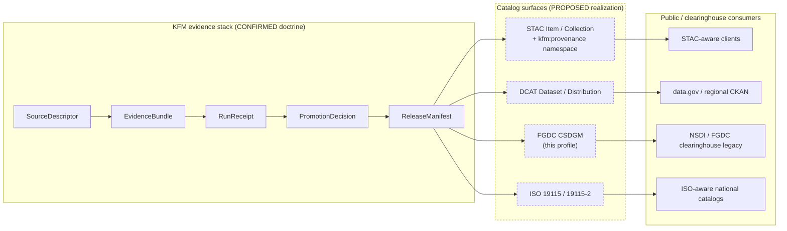

<!-- [KFM_META_BLOCK_V2]
doc_id: kfm://doc/standards/fgdc-csdgm
title: FGDC CSDGM — KFM Conformance Profile
type: standard
version: v0.1
status: draft
owners: <TODO: docs steward + spatial-foundation domain steward>
created: 2026-05-14
updated: 2026-05-14
policy_label: public
related:
  - docs/standards/STAC_KFM_PROFILE.md   # PROPOSED, not verified
  - docs/standards/ISO-19115.md          # PROPOSED, not verified
  - docs/standards/DCAT.md               # PROPOSED, not verified
  - docs/standards/PROV-O.md             # PROPOSED, not verified
  - docs/doctrine/directory-rules.md
tags: [kfm, standards, metadata, geospatial, fgdc, csdgm, catalog]
notes:
  - "PROPOSED conformance profile; not a release gate."
  - "Mandatory-status of FGDC per artifact family is NEEDS VERIFICATION (KFM-P18-INV-242)."
[/KFM_META_BLOCK_V2] -->

# FGDC CSDGM — KFM Conformance Profile

> How the Kansas Frontier Matrix relates to the **FGDC Content Standard for Digital Geospatial Metadata (CSDGM)**: scope, crosswalk to the KFM evidence stack, conformance gate, and posture toward the FGDC → ISO transition.


| Field | Value |
|---|---|
| **Status** | `draft` — **PROPOSED** profile, not a release gate |
| **Authority class** | Standards reference (external standard KFM may conform to) |
| **Owners** | `<TODO: docs steward + spatial-foundation domain steward>` |
| **Last reviewed** | 2026-05-14 |
| **External standard** | `FGDC-STD-001-1998` (CSDGM v2.0, June 1998) — EXTERNAL |
| **KFM doctrinal basis** | `KFM-P18-INV-242` (metadata-standard conformance as a catalog gate) — CONFIRMED |
| **Mandatory for KFM?** | **NEEDS VERIFICATION** — per-artifact-family applicability unresolved |

---

## Quick jump

- [1. Purpose](#1-purpose)
- [2. Scope and authority](#2-scope-and-authority)
- [3. What FGDC CSDGM is](#3-what-fgdc-csdgm-is)
- [4. KFM posture and rationale](#4-kfm-posture-and-rationale)
- [5. Where this fits in the KFM stack](#5-where-this-fits-in-the-kfm-stack)
- [6. CSDGM ↔ KFM crosswalk](#6-csdgm--kfm-crosswalk)
- [7. Catalog conformance gate (PROPOSED)](#7-catalog-conformance-gate-proposed)
- [8. Validators and validation outputs (PROPOSED)](#8-validators-and-validation-outputs-proposed)
- [9. FGDC → ISO 19115 transition posture](#9-fgdc--iso-19115-transition-posture)
- [10. Profiles and extensions relevant to KFM](#10-profiles-and-extensions-relevant-to-kfm)
- [11. Tensions and open questions](#11-tensions-and-open-questions)
- [12. Validation checklist](#12-validation-checklist)
- [13. Related docs](#13-related-docs)
- [Appendix A — CSDGM section reference](#appendix-a--csdgm-section-reference)
- [Appendix B — KFM crosswalk worked example (illustrative)](#appendix-b--kfm-crosswalk-worked-example-illustrative)

---

## 1. Purpose

> [!NOTE]
> This document **describes** an external standard and **proposes** how KFM relates to it. It does not declare FGDC CSDGM mandatory for any KFM artifact family. That decision is **NEEDS VERIFICATION** and tracked as `KFM-P18-INV-242` until resolved by ADR.

This standards profile exists to:

1. State plainly what FGDC CSDGM is and how it is currently positioned by its issuing body (EXTERNAL).
2. Place CSDGM in relation to the rest of the KFM catalog stack — STAC (with the KFM provenance namespace), DCAT, PROV-O, and the EvidenceBundle (CONFIRMED doctrine; PROPOSED realization).
3. Define a **crosswalk** from CSDGM compound elements to KFM's governance fields so that records destined for clearinghouses expecting CSDGM can be emitted without losing KFM provenance, rights, sensitivity, review, or release semantics.
4. Define a **catalog conformance report** shape that lets KFM's validators record CSDGM conformance per record without coupling the standard to publication (publication remains governed by policy, not by CSDGM presence).

What this document does **not** decide:

- Whether CSDGM is mandatory for any specific KFM artifact family. That requires an ADR.
- The schema home or validator path. That follows `directory-rules.md §0` schema-home convention and remains **PROPOSED** until verified.
- Whether KFM publishes CSDGM-encoded records, ISO 19115-encoded records, both, or neither.

---

## 2. Scope and authority

| Aspect | Value | Label |
|---|---|---|
| Document class | External-standards profile under `docs/standards/` | CONFIRMED by `directory-rules.md §6.1` (`docs/standards/` is the home for "external standards KFM conforms to (STAC, DCAT, PROV, etc.)") |
| Path | `docs/standards/FGDC-CSDGM.md` | PROPOSED — placement consistent with `directory-rules.md §6.1`; filename and casing not yet verified against any existing convention in the mounted repo |
| Authority order | Doctrine and ADRs > Directory Rules > this profile > worked examples | CONFIRMED per `directory-rules.md §2.1` |
| Change discipline | Edits follow normal docs PR; adopting CSDGM as a **release gate** for any artifact family requires an ADR per `directory-rules.md §2.4` | CONFIRMED |
| Conformance language | RFC 2119-style (MUST / SHOULD / MAY) per `directory-rules.md §2.2` | CONFIRMED |

> [!IMPORTANT]
> Per `directory-rules.md §2.5`, if anything in this profile conflicts with the mounted repo's actual catalog or validator behavior, the repo wins and a `DRIFT_REGISTER.md` entry is opened. Nothing in this profile can short-circuit policy, evidence, or release gates.

---

## 3. What FGDC CSDGM is

The Federal Geographic Data Committee's **Content Standard for Digital Geospatial Metadata** is the long-standing US federal metadata standard for digital geospatial data sets.

| Field | Value | Source |
|---|---|---|
| Identifier | `FGDC-STD-001-1998` | FGDC, "Content Standard for Digital Geospatial Metadata (CSDGM)"  |
| Version | 2.0 (revised June 1998) | FGDC standard page  |
| Originally mandated by | Executive Order 12906 (directed Federal agencies to document geospatial resources using this standard) | FGDC, CSDGM standard page  |
| Section count | 10 (7 main + 3 supporting), loaded as separate XML schema modules in the official XSD | IOOS `fgdc-std-001-1998.xsd` — "the primary XML Schema and loads the definitions for sections 1-10"  |
| Current status (federal) | Legacy / still in use; FGDC encourages transition to the ISO 19100 series under OMB Circular A-119 | FGDC base-metadata page and Geospatial Metadata Standards page  |

**Section list (CSDGM v2.0):** Identification Information; Data Quality Information; Spatial Data Organization Information; Spatial Reference Information; Entity and Attribute Information; Distribution Information; Metadata Reference Information; plus supporting sections Citation Information, Time Period Information, and Contact Information. FGDC CSDGM table of contents 

Detailed section roles and obligations are in [Appendix A](#appendix-a--csdgm-section-reference).

> [!NOTE]
> The CSDGM was designed before STAC, DCAT, JSON-LD, and content addressing existed. Its element model is XML-first, eight-character short names, and order-significant. IOOS XSD schema documentation: "Element names are a maximum of 8-characters long … Generally the order of elements is now significant."  Treating it as **one** of KFM's metadata surfaces — not the only one — is intentional.

---

## 4. KFM posture and rationale

KFM's working position on FGDC CSDGM, drawn from project doctrine:

| Position | Status | Basis |
|---|---|---|
| CSDGM is **one of several** candidate metadata standards KFM may need to satisfy per artifact family. STAC, DCAT, FGDC, ISO 19115, and the KFM profile are all on the table. | PROPOSED | `KFM-P18-INV-242`: "Which metadata standards are mandatory for each artifact family: STAC, DCAT, FGDC, ISO, or KFM profile?" is **NEEDS VERIFICATION** |
| Catalog records SHOULD run **metadata-standard conformance checks** and record missing requirements before public release. Conformance is a **validation result**, not an editorial afterthought. | CONFIRMED doctrine / PROPOSED implementation | `KFM-P18-INV-242` Normalized statement |
| CSDGM conformance is a **catalog completeness signal**, not by itself a release gate. Release gates remain `policy/`-governed and evidence-bound. | PROPOSED | Pass 10 C4 / C5 split: catalogs publish; policy decides |
| KFM SHOULD NOT fork CSDGM. Where additional governance fields are required, KFM extends through its own namespace and crosswalks (STAC pattern). | PROPOSED | Consistent with the STAC-KFM Profile approach in `New Ideas 5-8-26`: "KFM should NOT fork STAC. Instead: remain STAC 1.0 compliant, extend via namespaced properties" |
| Mandatory-vs-optional CSDGM conformance MUST NOT be inferred from convenience or topic; it requires an ADR per `directory-rules.md §2.4(5)` if it creates a parallel publication path. | CONFIRMED | `directory-rules.md §2.4` |

> [!WARNING]
> Do **not** treat CSDGM presence as a substitute for an EvidenceBundle, a RunReceipt, a PromotionDecision, or a ReleaseManifest. A CSDGM record is **metadata**; KFM's truth posture is **evidence-first**. A complete CSDGM record with unresolved `EvidenceRef` MUST still fail closed at the publication gate.

---

## 5. Where this fits in the KFM stack



> [!NOTE]
> **Diagram is doctrinal**, not a claim of implementation. None of the catalog-surface nodes is asserted to exist in the current mounted repo. Per `directory-rules.md §0`, all path-level claims remain **PROPOSED** until verified against repo evidence.

Key relationships:

- **STAC** is the primary spatial catalog surface for KFM and carries the `kfm:provenance` block (CONFIRMED in Pass 10 C4-01; PROPOSED namespace pin per `New Ideas 5-8-26`).
- **DCAT** covers what STAC does not — non-spatial datasets, entity bundles, policy bundles (CONFIRMED in Pass 10 C4-05).
- **ISO 19115 / 19115-2** is the international successor that FGDC itself now encourages. FGDC: "federal agencies and NSDI Stakeholders are encouraged to make the transition to ISO metadata." 
- **FGDC CSDGM** remains a real consumer expectation for legacy NSDI workflows and some state clearinghouses. Vermont Center for Geographic Information: "FGDC CSDGM is a U.S. federal government-unique standard that remains in use … still a viable option to meet the Vermont Level 2 - Full metadata standard." 

---

## 6. CSDGM ↔ KFM crosswalk

The following crosswalk binds CSDGM compound elements to the KFM governance fields they should reflect when KFM emits a CSDGM record. Field shapes (JSON Schema) are governed by `schemas/contracts/v1/…` per `directory-rules.md §0` ADR-0001 — paths below are **PROPOSED**.

| CSDGM compound element | CSDGM short name | KFM-side source | Truth label |
|---|---|---|---|
| Identification Information → Citation | `idinfo / citation` | `SourceDescriptor.citation`, EvidenceBundle `kfm:sources[*]` | PROPOSED |
| Identification Information → Description (Abstract, Purpose, Supplemental) | `idinfo / descript` | `LayerManifest.description`, governance posture string from Collection summary | PROPOSED |
| Identification Information → Status (Progress, Maintenance) | `idinfo / status` | `kfm:review_state`, `kfm:release_state` (KFM STAC profile) | PROPOSED |
| Identification Information → Spatial Domain (Bounding Coordinates, G-Polygon) | `idinfo / spdom` | STAC `bbox` / `geometry`, KFM-canonical geometry hash | PROPOSED |
| Identification Information → Use Constraints | `idinfo / useconst` | `kfm:rights_status`, `kfm:sensitivity`, CARE block | PROPOSED |
| Data Quality Information → Lineage | `dataqual / lineage` | PROV-O `prov:wasGeneratedBy` chain, `RunReceipt`, `OpenLineage` events | CONFIRMED doctrinal mapping (Pass 10 C8-03) / PROPOSED field realization |
| Data Quality Information → Positional/Attribute Accuracy | `dataqual / posacc`, `attracc` | Validator outputs (geometry sanity, schema validation), `UncertaintySurface` | PROPOSED |
| Spatial Data Organization Information | `spdoinfo` | TileArtifactManifest, vector format declarations | PROPOSED |
| Spatial Reference Information | `spref` | Coordinate Reference Profile, Projection Transform Receipt | PROPOSED |
| Entity and Attribute Information | `eainfo` | Schema for the layer's feature shape (`schemas/contracts/v1/…`) | PROPOSED |
| Distribution Information | `distinfo` | `ReleaseManifest`, asset hrefs, checksums, `kfm:spec_hash` | PROPOSED |
| Metadata Reference Information | `metainfo` | Metadata authoring receipt, KFM Meta Block v2 fields | PROPOSED |

> [!IMPORTANT]
> The CSDGM crosswalk **must not erase source-specific caveats**. Per `KFM-P18-INV-242` neighbor doctrine on adapter mapping receipts: over-translation can erase source-specific caveats needed for evidence review. The crosswalk MUST be paired with an `adapter_mapping_receipt` recording dropped fields, caveats, and unmapped values.

---

## 7. Catalog conformance gate (PROPOSED)

```mermaid
flowchart TB
    A[Catalog record<br/>STAC + KFM profile] --> B{Run CSDGM conformance?}
    B -- "policy says yes" --> C[CSDGMConformanceCheck]
    B -- "policy says no" --> Z[Skip; record skipped]
    C --> D{Required CSDGM<br/>elements present?}
    D -- yes --> E[catalog_metadata_conformance_report:<br/>profile=CSDGM<br/>missing_required_fields=[]<br/>warnings=[…]<br/>decision=ALLOW]
    D -- no --> F[catalog_metadata_conformance_report:<br/>profile=CSDGM<br/>missing_required_fields=[…]<br/>decision=ABSTAIN or DENY<br/>per policy]
    E --> G[Release gate reads report<br/>+ EvidenceBundle + policy]
    F --> G
    G --> H{Promotion allowed?}
    H -- ALLOW --> I[PromotionDecision → PUBLISHED]
    H -- DENY/ABSTAIN --> J[Quarantine path<br/>+ correction notice if released]
```

The proposed `catalog_metadata_conformance_report` shape is informed by `KFM-P18-INV-242` expansion fields:

- `profile` — `CSDGM` | `ISO-19115` | `STAC-KFM-v1` | `DCAT` | other
- `profile_version` — `"FGDC-STD-001-1998"` for CSDGM
- `missing_required_fields[]` — CSDGM short names, e.g. `idinfo/citation/title`
- `warnings[]` — CSDGM-permitted but KFM-preferred fields
- `decision` — `ALLOW` | `ABSTAIN` | `DENY`
- `decision_reason` — machine-readable reason code
- `spec_hash` — JCS-canonicalized SHA-256 of the report (per Pass 10 C1-02 doctrine)

> [!CAUTION]
> The conformance **report** is not the **decision**. The publication decision is owned by `policy/` and consumes this report. A CSDGM-clean record may still fail the release gate on rights, sensitivity, evidence, or review-state grounds.

---

## 8. Validators and validation outputs (PROPOSED)

> [!NOTE]
> Validator paths and CI workflow names below are **PROPOSED**. None has been verified against a mounted repo in this session. They follow the validator surface pattern in `New Ideas 5-8-26` (CLI contract, JSON-mode output, exit-code grammar).

**CLI contract (illustrative):**

```bash
python tools/validators/standards/csdgm/check_conformance.py \
  --input data/catalog/stac/<item>.json \
  --crosswalk schemas/contracts/v1/standards/csdgm_crosswalk.schema.json \
  --emit catalog_metadata_conformance_report \
  --fail-on-missing-required
```

**Exit codes** (consistent with the validator exit-code grammar elsewhere in KFM):

| Code | Meaning |
|---|---|
| `0` | PASS — required CSDGM elements present |
| `1` | FAIL — required CSDGM elements missing |
| `2` | ERROR — validator runtime error |
| `3` | ABSTAIN — element presence cannot be determined (insufficient inputs) |

**Output shape (JSON, illustrative):**

```json
{
  "object_type": "catalog_metadata_conformance_report",
  "profile": "CSDGM",
  "profile_version": "FGDC-STD-001-1998",
  "subject_ref": "kfm://catalog/stac/<id>",
  "missing_required_fields": [],
  "warnings": [
    {
      "field": "idinfo/keywords/theme",
      "note": "No ISO 19115 topic category equivalent recorded; recommended for cross-profile parity."
    }
  ],
  "decision": "ALLOW",
  "decision_reason": "all_required_csdgm_elements_present",
  "spec_hash": "sha256:<TODO>"
}
```

**Negative-path fixtures** that any future validator MUST exercise (per the negative-state rule for KFM validators):

- A STAC item with no `idinfo/citation/title` mapping → `DENY` or `ABSTAIN` per policy
- A record claiming CSDGM conformance with `Distribution Information` missing for a released asset → `DENY`
- A record where `Use Constraints` conflicts with the KFM `kfm:rights_status` value → `DENY` with conflict reason
- A record where `Time Period Information` cannot be derived from KFM temporal fields → `ABSTAIN`

---

## 9. FGDC → ISO 19115 transition posture

> [!IMPORTANT]
> The issuing body itself encourages transition away from CSDGM toward the ISO 19100 series.

| Fact | Source |
|---|---|
| FGDC has endorsed several ISO metadata standards; federal agencies and NSDI stakeholders are encouraged to make the transition to ISO metadata. | FGDC, "Geospatial Metadata Standards and Guidelines"  |
| OMB Circular A-119 (revised) directs agencies to use voluntary consensus standards in lieu of government-unique standards such as the CSDGM. | FGDC, base-metadata project page  |
| CSDGM "will continue to have a legacy for many years" and is still in active use in state and federal workflows. | FGDC base-metadata page; Vermont Center for Geographic Information  |

**KFM posture (PROPOSED):**

1. KFM SHOULD treat **ISO 19115 (with ISO 19115-2 extension)** as the strategic clearinghouse metadata surface where a non-STAC catalog surface is required.
2. KFM SHOULD treat **CSDGM** as a **bridge / legacy compatibility profile**, emitted only when a downstream clearinghouse explicitly requires it.
3. Where both surfaces are needed, the **same KFM-side fields** (EvidenceBundle, rights, sensitivity, lineage, spec_hash) MUST drive both crosswalks. A divergent CSDGM record and ISO record from the same source is a drift symptom.

> [!WARNING]
> Treating CSDGM as the **sole** metadata surface for new KFM artifacts would couple KFM to a deprecating government-unique standard. Do not do this without an ADR documenting the tradeoff and a sunset plan.

---

## 10. Profiles and extensions relevant to KFM

CSDGM has several FGDC-endorsed profiles and extensions; the ones with the clearest KFM relevance are:

| Profile / extension | Identifier | KFM domain | Status |
|---|---|---|---|
| Biological Data Profile | `FGDC-STD-001.1-1999` | Fauna, Flora, Habitat domains | EXTERNAL FGDC standards publications;  KFM applicability **PROPOSED** |
| Metadata Profile for Shoreline Data | `FGDC-STD-001.2-2001` | Hydrology, hazards (coastal change) — limited Kansas relevance | EXTERNAL FGDC standards publications;  KFM applicability **UNKNOWN** |
| Remote Sensing Metadata Extensions | `FGDC-STD-012-2002` | Imagery / DEM / COG layers; spatial foundation | EXTERNAL FGDC standards publications;  KFM applicability **PROPOSED** for remote-sensing imagery families |
| Classification of Wetlands and Deepwater Habitats | `FGDC-STD-004` | Habitat | EXTERNAL FGDC standards publications;  classification rather than metadata standard — not a CSDGM profile in the strict sense |
| National Vegetation Classification Standard v2.0 | `FGDC-STD-005-2008` | Flora, habitat | EXTERNAL FGDC standards publications;  classification standard |

> [!NOTE]
> KFM has not, in this session, pinned any of these profiles as in-scope for a release gate. Per `directory-rules.md §2.4(5)`, adopting any of them as a parallel publication or proof home requires an ADR.

---

## 11. Tensions and open questions

| # | Tension / question | Status | Where it goes |
|---|---|---|---|
| 1 | Which metadata standards are mandatory for each KFM artifact family: STAC, DCAT, FGDC, ISO, or the KFM profile? | NEEDS VERIFICATION | `docs/registers/VERIFICATION_BACKLOG.md`; resolve via ADR |
| 2 | If both ISO 19115 and CSDGM are emitted, which is canonical and which is a derived mirror? | OPEN | ADR candidate |
| 3 | Does KFM emit CSDGM XML directly, or only crosswalk-on-demand from STAC+KFM profile? | OPEN | ADR candidate |
| 4 | How are version-sensitive CSDGM elements (e.g., short names with 8-char limits) reconciled with KFM's longer, namespaced field names without loss? | OPEN | Captured by `adapter_mapping_receipt` |
| 5 | For sensitive lanes (archaeology, people-DNA-land, rare-species locations), can CSDGM `Use Constraints` carry KFM `kfm:sensitivity` semantics faithfully, or does it require redaction before emission? | OPEN | Conservative default: redact and quarantine until proven |
| 6 | Should CSDGM conformance results live in `data/proofs/` (proof object) or `data/receipts/` (receipt) — or both? | OPEN | Trust-content placement question; `directory-rules.md §16` checklist applies |

---

## 12. Validation checklist

When proposing CSDGM emission for any KFM artifact family, work through this list:

- [ ] **Doctrine alignment** — Does an accepted ADR pin CSDGM as in-scope for this artifact family? If no, stop and open one.
- [ ] **Crosswalk completeness** — Every CSDGM mandatory element in §6 has a defined KFM-side source.
- [ ] **No source-caveat loss** — `adapter_mapping_receipt` records dropped fields, caveats, and unmapped values.
- [ ] **Evidence path intact** — The CSDGM record's lineage (`dataqual/lineage`) resolves to a PROV-O / RunReceipt / EvidenceBundle chain.
- [ ] **Rights / sensitivity consistent** — CSDGM `Use Constraints` does not contradict `kfm:rights_status` or `kfm:sensitivity`.
- [ ] **Release-gate separation** — CSDGM conformance is consumed by `policy/`, not enforced by the validator itself.
- [ ] **Negative-path tests** — Validator exercises DENY / ABSTAIN / ERROR paths on at least the fixtures named in §8.
- [ ] **Bridge to ISO 19115** — If both surfaces are emitted, the same KFM-side fields drive both.
- [ ] **Catalog conformance report emitted** — `catalog_metadata_conformance_report` written with `profile=CSDGM`, `decision`, and `spec_hash`.
- [ ] **Rollback target named** — Per KFM publication doctrine, every released CSDGM record carries a rollback target.

> [!TIP]
> A clean checklist does **not** publish the record. Publication still flows through `policy/` and the release gates.

---

## 13. Related docs

| Path | Purpose | Status |
|---|---|---|
| `docs/standards/STAC_KFM_PROFILE.md` | KFM STAC profile (`kfm-stac-profile-v1`) — primary spatial catalog surface | PROPOSED (referenced in Pass 10 C4-01) |
| `docs/standards/ISO-19115.md` | ISO 19115 / 19115-2 — strategic clearinghouse surface | PROPOSED |
| `docs/standards/DCAT.md` | DCAT v3 — non-spatial dataset catalog surface | PROPOSED (referenced in Pass 10 C4-05) |
| `docs/standards/PROV-O.md` | W3C PROV-O — claim-level provenance vocabulary | PROPOSED (referenced in Pass 10 C8-03) |
| `docs/standards/STAC_DWC_PROFILE.md` | STAC × Darwin Core hybrid — biodiversity | PROPOSED (referenced in Pass 10 C4-03) |
| `docs/doctrine/directory-rules.md` | Placement law; governs `docs/standards/` | CONFIRMED |
| `docs/adr/ADR-0001-schema-home.md` | Schema-home convention (`schemas/contracts/v1/…`) | CONFIRMED reference |
| `docs/registers/VERIFICATION_BACKLOG.md` | Where `KFM-P18-INV-242` open question lives | CONFIRMED reference |

---

## Appendix A — CSDGM section reference

<details>
<summary>CSDGM v2.0 — 10 sections and obligation classes (EXTERNAL)</summary>

The CSDGM defines 7 main sections plus 3 supporting sections. The production rule from the standard is:

```text
Metadata =
    Identification_Information
  + 0{Data_Quality_Information}1
  + 0{Spatial_Data_Organization_Information}1
  + 0{Spatial_Reference_Information}1
  + 0{Entity_and_Attribute_Information}1
  + 0{Distribution_Information}n
  + Metadata_Reference_Information
```

FGDC CSDGM v2.0 production rule (excerpt) 

| # | Section | Short name | Obligation | One-line role |
|---|---|---|---|---|
| 1 | Identification Information | `idinfo` | **Mandatory** | Basic information about the data set |
| 2 | Data Quality Information | `dataqual` | Mandatory if applicable | Accuracy, completeness, lineage |
| 3 | Spatial Data Organization Information | `spdoinfo` | Mandatory if applicable | Vector / raster organization |
| 4 | Spatial Reference Information | `spref` | Mandatory if applicable | Horizontal / vertical reference systems |
| 5 | Entity and Attribute Information | `eainfo` | Mandatory if applicable | Feature attribute definitions |
| 6 | Distribution Information | `distinfo` | Mandatory if applicable | How the data set is obtained |
| 7 | Metadata Reference Information | `metainfo` | **Mandatory** | Currency, contact, standard used |
| 8 | Citation Information | `citation` | Supporting (used by §1, §2, etc.) | Standardized citation block |
| 9 | Time Period Information | `timeinfo` | Supporting | Single date, range, or multiple dates |
| 10 | Contact Information | `cntinfo` | Supporting | Person / organization contact |

FGDC CSDGM section list and obligation classes; image map and v2.0 text 

**Encoding note.** The official XSD loads sections 1–10 as separate schema modules; element names are limited to 8 characters and element order is significant. IOOS metadataTransformations XSD documentation 

[Back to top ↑](#fgdc-csdgm--kfm-conformance-profile)

</details>

<details>
<summary>CSDGM extensibility (EXTERNAL)</summary>

CSDGM explicitly supports **extensibility and profiles**: producers may define additional elements under documented guidelines (Appendix D of the standard). FGDC CSDGM Workbook: "Extensibility and Profiles"  KFM-namespaced elements emitted into a CSDGM record MUST follow this extension discipline rather than redefining base elements.

[Back to top ↑](#fgdc-csdgm--kfm-conformance-profile)

</details>

---

## Appendix B — KFM crosswalk worked example (illustrative)

> [!NOTE]
> The example below is **illustrative**, not extracted from any mounted KFM repo. It demonstrates the crosswalk shape; concrete values are placeholders. Per `directory-rules.md §0`, every path implied here is PROPOSED.

<details>
<summary>STAC + KFM profile → CSDGM crosswalk (illustrative)</summary>

**Input — STAC Item with KFM provenance (illustrative):**

```json
{
  "type": "Feature",
  "stac_version": "1.0.0",
  "id": "kfm-example-<id>",
  "properties": {
    "datetime": "2025-07-01T16:22:09Z",
    "kfm:evidence_bundle": "kfm://bundle/<sha256>",
    "kfm:run_receipt": "kfm://run/<sha256>",
    "kfm:source_role": "observation",
    "kfm:rights_status": "controlled",
    "kfm:sensitivity": "review_required",
    "kfm:review_state": "approved",
    "kfm:release_state": "released",
    "kfm:spec_hash": "sha256:<TODO>"
  }
}
```

**Output — CSDGM excerpt (illustrative, abbreviated):**

```xml
<metadata>
  <idinfo>
    <citation>
      <citeinfo>
        <title><!-- from SourceDescriptor.citation.title --></title>
      </citeinfo>
    </citation>
    <status>
      <progress><!-- from kfm:review_state mapping --></progress>
    </status>
    <useconst>
      <!-- from kfm:rights_status + CARE block; sensitive content redacted -->
    </useconst>
  </idinfo>
  <dataqual>
    <lineage>
      <!-- from PROV-O wasGeneratedBy chain rooted at kfm:run_receipt -->
    </lineage>
  </dataqual>
  <distinfo>
    <!-- from ReleaseManifest assets + kfm:spec_hash -->
  </distinfo>
  <metainfo>
    <metstdn>FGDC Content Standard for Digital Geospatial Metadata</metstdn>
    <metstdv>FGDC-STD-001-1998</metstdv>
  </metainfo>
</metadata>
```

**Adapter mapping receipt (illustrative):**

```json
{
  "object_type": "adapter_mapping_receipt",
  "source": "kfm://catalog/stac/<id>",
  "target_profile": "CSDGM",
  "source_fields": ["kfm:evidence_bundle", "kfm:run_receipt", "kfm:spec_hash"],
  "canonical_fields": ["dataqual/lineage", "metainfo"],
  "dropped_fields": [],
  "caveats": ["kfm:evidence_bundle has no native CSDGM home; surfaced via lineage description and link"],
  "unmapped_values": []
}
```

[Back to top ↑](#fgdc-csdgm--kfm-conformance-profile)

</details>

---

> [!TIP]
> When in doubt, narrow the claim, mark the status, preserve reversibility, and let evidence carry the answer. CSDGM is one of several catalog surfaces KFM **may** speak. It is never the truth source.

---

**Related**: [STAC KFM Profile (PROPOSED)](STAC_KFM_PROFILE.md) · [ISO 19115 (PROPOSED)](ISO-19115.md) · [DCAT (PROPOSED)](DCAT.md) · [PROV-O (PROPOSED)](PROV-O.md) · [Directory Rules](../doctrine/directory-rules.md)

**Last reviewed**: 2026-05-14 · **Profile version**: v0.1 · [Back to top ↑](#fgdc-csdgm--kfm-conformance-profile)
