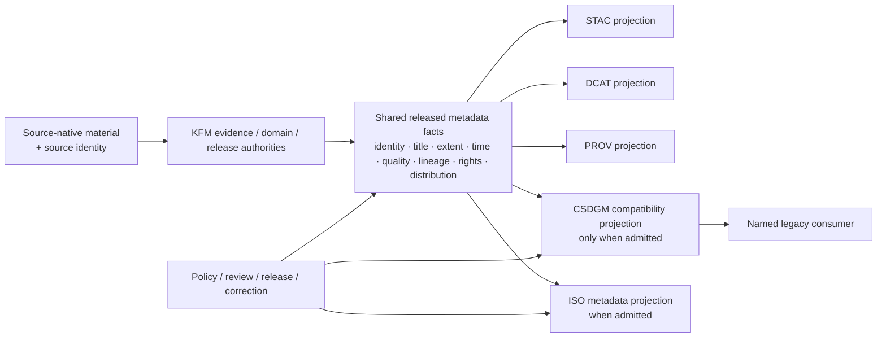
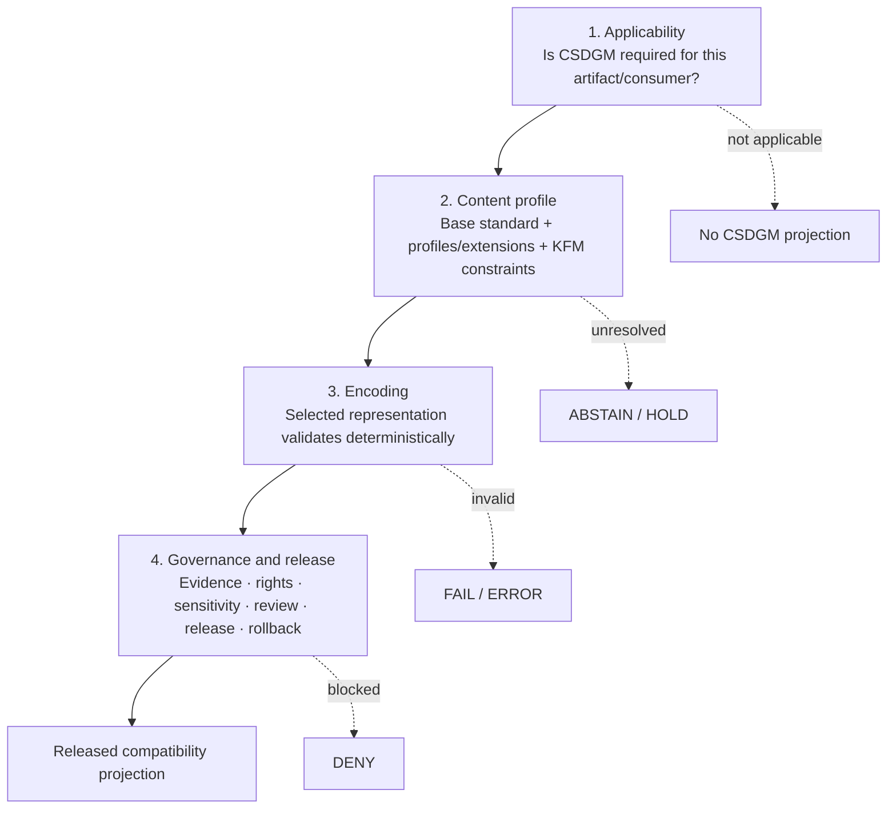

<!-- [KFM_META_BLOCK_V2]
doc_id: kfm://doc/standards/fgdc-csdgm
title: FGDC CSDGM — KFM Legacy-Compatibility and Conformance Boundary
type: standard; metadata-guidance; legacy-compatibility-boundary
version: v2.0-draft
status: "draft; repository-grounded; upstream-currentness-refreshed; no-adoption; no-conformance-proof; no-release; no-publication"
owners:
  - "@bartytime4life — verified default GitHub review route through the standards-lane boundary"
  - "NEEDS VERIFICATION — metadata/catalog, geospatial, interoperability, evidence, policy, release, correction, and independent-review stewards"
created: 2026-05-14
updated: 2026-08-18
policy_label: "repository-facing; standards-guidance; metadata; geospatial; legacy-compatibility; public"
owning_root: docs/
current_path: docs/standards/FGDC-CSDGM.md
responsibility: >
  Explain the official FGDC Content Standard for Digital Geospatial Metadata,
  its current legacy-and-transition posture, the bounded circumstances in which
  KFM may need a CSDGM-compatible projection, and the evidence required before
  KFM may claim profile conformance or expose a CSDGM record.
truth_posture: >
  CONFIRMED current path, standards-lane placement, default review route,
  official CSDGM identifier/version/section model, official transition guidance,
  current repository absence of a dedicated CSDGM contract-schema-validator
  family in bounded search, canonical PolicyDecision outward vocabulary, and
  bounded synthetic STAC-DCAT-PROV closure surfaces / PROPOSED CSDGM
  applicability rules, shared-metadata crosswalk, candidate conformance record,
  fixture matrix, validator behavior, migration sequence, and consumer binding /
  UNKNOWN KFM adoption, accepted CSDGM profile, production emitter, XML
  encoding, downstream clearinghouse requirement, runtime consumer,
  release integration, operational conformance, and accountable specialist
  stewardship.
evidence_snapshot:
  repository: bartytime4life/Kansas-Frontier-Matrix
  base_ref: main
  base_commit: f9a515a1124f9f5397996f6bc7cb3fd1a3534c40
  target_prior_blob: 298b05433138435ae2ce785489131bf3a0bbd591
  standards_readme_blob: a8cbe5d183448d5f0de37f8a4eacd6fcaca0d71b
  policy_decision_contract_blob: ebfe97f98263e6309db6d2772cb2c5e548819650
  synthetic_catalog_closure_contract_blob: f14fa7f1a173e62cae253c76fcd75ae2fbea0dcf
  bounded_search: "CSDGM, FGDC-STD-001-1998, and catalog_metadata_conformance_report across the current repository"
external_currentness_review:
  access_date: 2026-08-18
  issuer: Federal Geographic Data Committee
  official_baseline: "FGDC-STD-001-1998, CSDGM Version 2, revised June 1998"
  transition_posture: "CSDGM remains the current FGDC-authored version and a legacy standard; FGDC encourages transition to ISO geospatial metadata standards"
related:
  - ./README.md
  - ./ISO-19115.md
  - ./DCAT.md
  - ./PROV-O.md
  - ./STAC_KFM_PROFILE.md
  - ../doctrine/directory-rules.md
  - ../adr/ADR-0029-adopt-directory-governance-standard-v2.md
  - ../adr/ADR-0022-catalog-matrix--stac-+-dcat-+-prov-must-agree.md
  - ../registers/VERIFICATION_BACKLOG.md
  - ../../contracts/data/synthetic_release_catalog_closure_profile.md
  - ../../contracts/policy/policy_decision.md
  - ../../schemas/contracts/v1/policy/policy_decision.schema.json
  - ../../tools/validators/catalog_closure/validate_synthetic_release_catalog_closure.py
  - ../../tests/validators/catalog_closure/test_synthetic_release_catalog_closure.py
  - ../../.github/CODEOWNERS
tags: [kfm, standards, fgdc, csdgm, metadata, geospatial, catalog, interoperability, iso-19115, legacy-compatibility]
notes:
  - "Same-path documentation modernization only; no contract, schema, policy, profile, emitter, fixture, validator, workflow, source, catalog record, release object, runtime, deployment, or public artifact changes."
  - "The prior XML-first characterization is corrected: CSDGM is a content standard and does not prescribe a computer implementation or transfer encoding; XML DTD/XSD files are implementation representations."
  - "The prior deprecation language is narrowed: official FGDC pages call Version 2 the current FGDC-authored version and encourage migration to ISO; this page does not claim formal withdrawal or retirement."
  - "The current synthetic catalog-closure slice proves bounded STAC/DCAT/PROV agreement only; it does not implement or validate CSDGM."
  - "Legacy title and numbered section anchors are retained for inbound-link compatibility."
[/KFM_META_BLOCK_V2] -->

<a id="top"></a>
<a id="fgdc-csdgm--kfm-conformance-profile"></a>

# FGDC CSDGM — KFM Legacy-Compatibility and Conformance Boundary

> **Purpose.** Explain when KFM may need a projection compatible with the Federal Geographic Data Committee's Content Standard for Digital Geospatial Metadata—without turning a legacy metadata record, XML validation, crosswalk, badge, or clearinghouse export into evidence, policy approval, release authority, or publication proof.


> [!IMPORTANT]
> **CSDGM metadata is descriptive support, not sovereign truth.** A complete record does not establish source authority, factual correctness, rights clearance, sensitivity clearance, evidence closure, review completion, release approval, or public safety.

> [!CAUTION]
> **Current KFM CSDGM implementation is not established.** Bounded repository search found this standards page, the companion ISO page, and the standards index, but did not surface a dedicated CSDGM semantic contract, machine schema, fixture family, validator, producer, consumer, workflow, emitted record, or release binding.

> [!WARNING]
> **Do not describe CSDGM as XML-first or formally deprecated.** The FGDC standard defines metadata content and explicitly leaves implementation and transfer form to implementers. FGDC supplies XML DTD/XSD representations, but those are encodings of the content standard. FGDC calls Version 2 the current FGDC-authored version while encouraging transition to ISO metadata.

| Field | Current bounded result |
|---|---|
| **Evidence snapshot** | `main@f9a515a1124f9f5397996f6bc7cb3fd1a3534c40` |
| **Directory result** | `PLACE` at the existing `docs/standards/FGDC-CSDGM.md` path; accepted Directory Rules assign human-readable standards guidance to `docs/standards/` |
| **Official baseline** | `FGDC-STD-001-1998`, CSDGM Version 2, revised June 1998 |
| **Official standing** | Current FGDC-authored CSDGM version and continuing legacy standard; FGDC encourages transition to ISO geospatial metadata |
| **KFM adoption** | **UNKNOWN / NOT ESTABLISHED**; no accepted decision was established that makes CSDGM mandatory for a KFM artifact family |
| **Machine implementation** | **NOT ESTABLISHED in bounded search**; no dedicated CSDGM contract-schema-validator-producer-consumer chain surfaced |
| **Adjacent proof** | A bounded synthetic STAC/DCAT/PROV closure profile exists; it does not include FGDC CSDGM and creates no CSDGM authority |
| **Public effect** | None; this page cannot authorize a source, catalog record, release, endpoint, export, deployment, or publication |

**Quick navigation:** [Status](#0-status-authority-and-evidence-boundary) · [Purpose](#1-purpose) · [Scope](#2-scope-and-authority) · [Standard](#3-what-fgdc-csdgm-is) · [KFM posture](#4-kfm-posture-and-rationale) · [Stack](#5-where-this-fits-in-the-kfm-stack) · [Crosswalk](#6-csdgm--kfm-crosswalk) · [Conformance](#7-catalog-conformance-gate-proposed) · [Validation](#8-validators-and-validation-outputs-proposed) · [ISO transition](#9-fgdc--iso-19115-transition-posture) · [Profiles](#10-profiles-and-extensions-relevant-to-kfm) · [Open work](#11-tensions-and-open-questions) · [Checklist](#12-validation-checklist) · [Related](#13-related-docs) · [Sections](#appendix-a--csdgm-section-reference) · [Example](#appendix-b--kfm-crosswalk-worked-example-illustrative) · [Evidence ledger](#appendix-c--evidence-ledger)

---

<a id="0-status-authority-and-evidence-boundary"></a>

## 0. Status, authority, and evidence boundary

### 0.1 Authority by question

| Question | Owning authority | Role of this page |
|---|---|---|
| What CSDGM means | The official FGDC standard and its endorsed profiles/extensions | Record the checked baseline; do not redefine upstream semantics |
| Whether KFM must emit CSDGM | An accepted KFM architecture/catalog decision with identified consumers and migration obligations | State that the decision remains open |
| What a KFM mapping or conformance record means | A reviewed semantic contract under `contracts/` | Describe candidate responsibilities without creating object authority |
| What machine shape is valid | A reviewed schema under `schemas/` | State graduation needs; do not host schema authority |
| What is allowed, withheld, generalized, or denied | `policy/`, qualified review, and a governed `PolicyDecision` | Supply metadata facts as inputs only |
| Whether evidence supports a claim | `EvidenceRef` resolution to `EvidenceBundle` | Require traceability; do not replace evidence |
| Whether an artifact may release | Policy, review, proof, release, correction, and rollback authorities | Explain prerequisites; never approve release |
| Whether KFM conforms | Exact-revision profile decision, contract, schema/encoding rule, fixtures, validator, producer, consumer, tests, and emitted artifact | State only the checked boundary |

### 0.2 Truth labels

- **CONFIRMED** — verified from current repository bytes or authoritative FGDC material at the named snapshot.
- **PROPOSED** — a KFM applicability rule, mapping, object, profile, path, validator, fixture, workflow, or migration step not established as current behavior.
- **UNKNOWN** — evidence is insufficient for a stronger current claim.
- **NEEDS VERIFICATION** — a concrete repository, standards, consumer, rights, policy, implementation, or operational check can resolve the question.
- **CONFLICTED** — current repository or source surfaces overlap or disagree in identity, role, vocabulary, profile, or authority.
- **HOLD** — an implementation or release posture; do not activate the profile until closure evidence exists. It is not a public runtime outcome.

### 0.3 Current repository evidence

| Surface | CONFIRMED observation | Safe conclusion |
|---|---|---|
| [`FGDC-CSDGM.md`](./FGDC-CSDGM.md) | Existing May 2026 draft contained proposal-era paths, invented object families, and unmounted-repository language | Same-path modernization is warranted |
| [`docs/standards/README.md`](./README.md) | Identifies this lane as human-readable standards guidance and explicitly separates path presence, adoption, implementation, validation, release, and publication states | This page may explain but cannot adopt or prove conformance |
| [`ISO-19115.md`](./ISO-19115.md) | Separate draft companion for ISO metadata | CSDGM-to-ISO relationship must be explicit; neither page silently supersedes the other |
| [`PolicyDecision`](../../contracts/policy/policy_decision.md) | Canonical outward outcomes are `ANSWER`, `ABSTAIN`, `DENY`, and `ERROR` | A CSDGM validator must not invent a competing public decision vocabulary |
| [`Synthetic Release Catalog Closure Profile`](../../contracts/data/synthetic_release_catalog_closure_profile.md) | Deterministic, no-network synthetic agreement across STAC, DCAT, and PROV projections | Useful adjacent proof only; it does not implement CSDGM |
| [`ADR-0022`](../adr/ADR-0022-catalog-matrix--stac-+-dcat-+-prov-must-agree.md) | Remains `proposed` while bounded closure slices exist | Catalog-profile experiments do not establish accepted CSDGM authority |
| Bounded CSDGM search | `CSDGM` and `FGDC-STD-001-1998` surfaced this page, the ISO companion, and the standards index; no dedicated executable family surfaced | Implementation remains **UNKNOWN / not established by this review** |

Absence statements are bounded to indexed repository search and inspected paths. They are not claims that private systems, historical branches, unindexed files, or external institutional workflows never existed.

### 0.4 Official upstream checkpoint

The official FGDC material checked on 2026-08-18 establishes the following bounded facts:

- [CSDGM Version 2](https://www.fgdc.gov/metadata/csdgm-standard) is the current version of the FGDC-authored and endorsed standard.
- The recommended citation identifies `FGDC-STD-001-1998` and the June 1998 revision.
- The standard defines metadata content needed to discover a geospatial dataset, assess fitness for use, understand access, and support transfer.
- The standard does **not** prescribe a computer implementation, transfer encoding, or presentation.
- FGDC provides HTML/PDF publications, a workbook, a graphical representation, a DTD, and XSD representations for XML-encoded records.
- FGDC describes CSDGM as a long-lived legacy and encourages transition to endorsed ISO geospatial metadata standards under federal standards policy.
- No official source inspected here declared CSDGM Version 2 withdrawn or formally retired.

### 0.5 Non-effects

This revision does **not**:

- adopt CSDGM or make it mandatory for a KFM artifact family;
- accept a base profile, Biological Data Profile, Shoreline Profile, or Remote Sensing extension for KFM;
- create a CSDGM contract, schema, XML DTD/XSD copy, mapping table, profile lock, fixture, validator, producer, consumer, workflow, endpoint, or catalog record;
- validate or migrate a real metadata collection;
- activate a source or inspect restricted source content;
- approve evidence, rights, sensitivity, review, release, export, deployment, or publication;
- accept ADR-0022 or alter current catalog authority.

[Back to top](#top)

---

<a id="1-purpose"></a>

## 1. Purpose

This page owns human-readable guidance for answering four questions:

1. What does the official CSDGM require at the content-model level?
2. When is CSDGM a legitimate KFM interoperability target rather than unnecessary legacy coupling?
3. Which KFM authorities would supply each metadata concept without collapsing evidence, policy, release, and catalog roles?
4. What must be proven before KFM may claim that a specific record conforms to a named CSDGM baseline or profile?

### 1.1 In scope

- official standard identity, history, section model, and implementation-neutral posture;
- current FGDC transition guidance toward ISO geospatial metadata;
- base CSDGM versus profile/extension distinction;
- KFM applicability and legacy-compatibility decision criteria;
- conceptual crosswalk from CSDGM sections to KFM authority families;
- conformance, encoding, governance, and release state separation;
- positive and negative verification expectations;
- correction, supersession, withdrawal, migration, and rollback implications.

### 1.2 Out of scope

- legal advice or a federal-compliance determination;
- automatic conversion of a real CSDGM collection;
- copying the FGDC standard into KFM schemas;
- selecting an XML library or metadata editor;
- adopting an ISO profile;
- deciding a downstream clearinghouse's current submission rules without direct consumer evidence;
- source activation, release approval, endpoint serving, or publication.

### 1.3 Four distinct objects that must not collapse

| Object | Job | What it does not prove |
|---|---|---|
| **CSDGM content profile** | Names the base standard plus any endorsed profile/extension and KFM constraints | That a record exists or validates |
| **Encoded metadata record** | Carries metadata in a selected serialization, commonly XML | That content is complete, accurate, current, or safe |
| **Conformance result** | Records which content and encoding assertions were checked at a specific revision | Evidence support, policy approval, release approval, or publication |
| **Released compatibility projection** | Delivers an approved record to an identified consumer with correction/rollback lineage | Canonical KFM truth or authority over source data |

[Back to top](#top)

---

<a id="2-scope-and-authority"></a>

## 2. Scope and authority

### 2.1 Directory Rules basis

Accepted [`ADR-0029`](../adr/ADR-0029-adopt-directory-governance-standard-v2.md) adopts [`directory-rules.md`](../doctrine/directory-rules.md). The target already exists under the standards-guidance lane, so the owning root is `docs/` and the same-path update receives the existing-file placement presumption.

This page does not move or name a machine home. A future implementation must route responsibilities independently:

| Responsibility | Owning root |
|---|---|
| Human-readable CSDGM guidance | `docs/standards/` |
| KFM mapping/conformance semantics | `contracts/` after an accepted object-family decision |
| Machine-valid profile and record shape | `schemas/` after profile and encoding decisions |
| Allow/deny/restrict/abstain rules | `policy/` |
| Synthetic inputs and expected results | `fixtures/` |
| Executable checks | `tools/` |
| Regression proof | `tests/` |
| Catalog records | `data/catalog/` or the accepted logical catalog home |
| Receipts/proofs | Their distinct accepted accountability homes |
| Release decision and rollback | `release/` and accepted rollback/correction homes |

### 2.2 State separation

Do not collapse these independent states:

| State | Meaning |
|---|---|
| Upstream publication state | FGDC has published CSDGM Version 2 and supporting representations |
| KFM applicability state | KFM has decided that a named artifact family or consumer requires CSDGM |
| KFM profile state | KFM has selected base CSDGM and any profile/extension constraints |
| Encoding state | KFM has selected and pinned an encoding representation and validation rule |
| Mapping state | Every target element has a governed source or an explicit unmapped disposition |
| Implementation state | A producer and consumer operate against the profile |
| Validation state | Positive and negative fixtures are evaluated deterministically |
| Review state | Accountable metadata/domain/security reviewers approved the bounded use |
| Release state | A governed release contains the compatibility projection and rollback target |
| Publication state | A consumer can retrieve the approved public-safe record |
| Correction state | Supersession, withdrawal, cache invalidation, and rollback are traceable |

A green XML schema check proves only the assertions represented by that encoding schema. It does not prove metadata accuracy, source authority, KFM policy approval, or release readiness.

[Back to top](#top)

---

<a id="3-what-fgdc-csdgm-is"></a>

## 3. What FGDC CSDGM is

CSDGM is the FGDC content standard for documenting digital geospatial data. It establishes compound elements, data elements, definitions, value domains, and obligation/conditionality rules so prospective users can discover data, assess fitness for use, understand access, and transfer the data successfully.

### 3.1 Official baseline

| Field | Official result |
|---|---|
| Standard | Content Standard for Digital Geospatial Metadata |
| Identifier | `FGDC-STD-001-1998` |
| Version | Version 2, revised June 1998 |
| Prior version | Version 1, approved June 1994; Version 2 supersedes it and is described by FGDC as backward compatible |
| Maintenance authority | FGDC Secretariat |
| Historical federal context | Executive Order 12906 directed federal agencies to document new geospatial data using the FGDC standard under development |
| Current program posture | Continuing CSDGM legacy plus encouraged migration to ISO metadata |
| Copyright/access | FGDC publications are publicly available; downstream reuse still must preserve attribution and any applicable organizational obligations |

### 3.2 Section model

The standard has one metadata root, seven principal numbered sections, and three supporting reusable sections:

1. Identification Information;
2. Data Quality Information;
3. Spatial Data Organization Information;
4. Spatial Reference Information;
5. Entity and Attribute Information;
6. Distribution Information;
7. Metadata Reference Information;
8. Citation Information;
9. Time Period Information; and
10. Contact Information.

Identification Information and Metadata Reference Information are mandatory. Other principal sections are mandatory when applicable. Citation, time-period, and contact structures are supporting compound sections used from multiple locations.

### 3.3 Content standard, not one encoding

The official specification states that CSDGM is not an implementation design and does not prescribe how metadata is organized in a computer system, transferred, transmitted, communicated, or presented.

Consequences for KFM:

- base-standard conformance is a **content** question;
- XML is one possible implementation representation, not the standard's sole identity;
- DTD or XSD validation is an **encoding** check and must name the exact representation used;
- short names and element order in an XML representation must not be mistaken for KFM canonical field names;
- a KFM mapping must preserve the upstream content semantics even when the internal model uses longer identifiers, JSON, RDF, or typed contracts.

### 3.4 Profiles and extensions

CSDGM Appendix D describes user-defined extensions, and Appendix E describes profiles. An extension adds elements; a profile constrains or specializes the base standard and may add elements under the documented rules.

A KFM-specific mapping is not automatically a CSDGM profile. KFM may only claim profile conformance when the target profile is identified, its constraints are represented, and validation evidence covers those constraints.

[Back to top](#top)

---

<a id="4-kfm-posture-and-rationale"></a>

## 4. KFM posture and rationale

### 4.1 Bounded recommendation

**PROPOSED:** Treat CSDGM as an **on-demand legacy-compatibility target**, not KFM's default metadata authority and not the sole metadata representation for new KFM products.

This recommendation is appropriate because:

- FGDC still publishes Version 2 as the current FGDC-authored version;
- inherited federal, state, local, university, and partner collections may still carry CSDGM records;
- some consumers or archival workflows may explicitly require CSDGM-compatible content;
- FGDC encourages migration to ISO metadata for modern systems;
- KFM already has distinct evidence, policy, release, catalog, and provenance responsibilities that CSDGM does not replace.

### 4.2 Applicability decision matrix

| Situation | Candidate disposition | Reason |
|---|---|---|
| Downstream consumer contract explicitly requires CSDGM Version 2 | **PROPOSED ADMIT**, after consumer/version/profile verification | Compatibility requirement is concrete and testable |
| Existing source collection supplies CSDGM records that must be preserved | **PROPOSED PRESERVE**, with source-native bytes and migration lineage | Avoid destructive normalization and loss of source caveats |
| KFM is migrating an inherited CSDGM collection to ISO | **PROPOSED BRIDGE**, with dual validation and correction plan | Supports staged migration without silent reinterpretation |
| New KFM spatiotemporal asset has no CSDGM consumer | **DEFAULT HOLD / NOT APPLICABLE** | Do not create legacy coupling without a use case |
| Record concerns a service, sensor system, complex acquisition chain, or modern resource relationship better modeled by ISO | **PREFER ISO REVIEW** | FGDC guidance identifies broader ISO resource coverage |
| CSDGM would expose restricted contact, exact geometry, infrastructure, archaeology, living-person, or other sensitive material | **DENY public projection until transformed and reviewed** | Interoperability never overrides KFM sensitivity policy |
| Profile, encoding, or consumer requirement is unknown | **ABSTAIN from conformance claim** | Cite-or-abstain; do not guess |

### 4.3 Anti-collapse rules

CSDGM must not be treated as:

- an `EvidenceBundle`;
- a `SourceDescriptor` or source-admission decision;
- a rights or sensitivity policy result;
- a review record;
- a release manifest;
- a proof pack or receipt;
- a STAC, DCAT, or PROV replacement;
- a complete modern metadata model for services, sensors, APIs, or all KFM object families;
- a public-data authorization merely because the record contains access or use constraints.

[Back to top](#top)

---

<a id="5-where-this-fits-in-the-kfm-stack"></a>

## 5. Where this fits in the KFM stack


```mermaid
flowchart LR
    A["Source-native material\n+ source identity"] --> B["KFM evidence / domain / release authorities"]
    B --> C["Shared released metadata facts\nidentity · title · extent · time · quality · lineage · rights · distribution"]
    C --> D["STAC projection"]
    C --> E["DCAT projection"]
    C --> F["PROV projection"]
    C --> G["CSDGM compatibility projection\nonly when admitted"]
    C --> H["ISO metadata projection\nwhen admitted"]
    G --> I["Named legacy consumer"]

    J["Policy / review / release / correction"] --> C
    J --> G
    J --> H
```

The diagram is a **PROPOSED responsibility model**, not current runtime proof.

### 5.1 Non-collapse responsibility table

| Surface | Primary responsibility | Boundary relative to CSDGM |
|---|---|---|
| EvidenceBundle | Claim-support evidence and limitations | CSDGM may cite or summarize lineage; it cannot replace evidence closure |
| STAC | Asset- and collection-oriented spatiotemporal discovery | CSDGM is not derived from STAC by assumption; both should draw from governed shared facts |
| DCAT | Dataset, distribution, data-service, series, record, and catalog discovery | Distribution and dataset concepts overlap, but neither vocabulary is sovereign over the other |
| PROV | Entity/activity/agent provenance | CSDGM lineage may summarize provenance; detailed derivation remains in provenance authorities |
| ISO 19115 family | Broader international geospatial metadata model and modern transition target | Strategic companion or successor target; exact profile/encoding still requires decision |
| CSDGM | Legacy geospatial dataset metadata content and compatibility | On-demand projection only after applicability, profile, encoding, and consumer decisions |
| PolicyDecision | Finite admissibility result | Determines whether and how a projection may be exposed; conformance cannot override policy |
| ReleaseManifest | Released artifact binding | Identifies the approved compatibility record and rollback/correction lineage |

### 5.2 Current repository boundary

The repository's synthetic catalog-closure profile derives mutually consistent STAC, DCAT, and PROV projections from one synthetic release candidate. Its contract explicitly limits the proof to deterministic local projection agreement and denies publication authority.

**CONFIRMED:** FGDC CSDGM is not part of that checked projection set. Extending the set would require a separate reviewed contract/schema/fixture/validator decision rather than documentation-only implication.

[Back to top](#top)

---

<a id="6-csdgm--kfm-crosswalk"></a>

## 6. CSDGM ↔ KFM crosswalk

The table below is a **PROPOSED conceptual crosswalk**. It deliberately names KFM authority families rather than inventing unverified field paths.

| CSDGM section or concept | KFM authority that would supply it | Required guardrail |
|---|---|---|
| Identification — citation, title, originator, publication date | Source identity, catalog descriptor, released metadata facts | Preserve source-native citation and issuing authority |
| Identification — abstract, purpose, supplemental information | Reviewed catalog/domain documentation | Distinguish source description from KFM interpretation |
| Identification — time period, status, maintenance | Temporal authority, source/release state, correction lineage | Keep observation, validity, publication, retrieval, and correction times distinct |
| Identification — spatial domain | Released public-safe geometry and spatial extent | Never use a guessed centroid or style-only hiding for sensitive geometry |
| Identification — keywords | Controlled vocabulary assignments plus source keywords | Record vocabulary/version; do not silently normalize away source terms |
| Identification — access/use constraints | Rights and sensitivity policy plus public-safe obligations | Do not expose internal denial reasons or sensitive facts in public metadata |
| Data Quality — attribute/positional accuracy, completeness, consistency | Validation reports, uncertainty/quality records, source caveats | A passing schema check is not a quality claim |
| Data Quality — lineage and process steps | Evidence, provenance, receipts, and transformation lineage | Preserve derivation and caveats; do not flatten all provenance into one sentence |
| Spatial Data Organization | Released artifact organization and geometry/raster representation | Describe the actual released carrier, not an internal or superseded one |
| Spatial Reference | CRS/datum/vertical reference and transformation evidence | Pin identifiers and preserve axis/unit/vertical semantics |
| Entity and Attribute | Accepted semantic contract, schema, or feature catalog | Do not publish restricted field definitions or unsupported semantics |
| Distribution | Released distribution carrier, locator, media type, checksum/digest, access method | Bind to a released artifact; catalog presence is not release authorization |
| Metadata Reference | Metadata record identity, date, responsible party, standard/profile/version, language/charset | Separate metadata authoring identity from data-source identity |
| Citation / Time / Contact supporting structures | Source, temporal, and contact authorities | Minimize personal data; use role/organization contacts where appropriate |

### 6.1 Mapping invariants

A future crosswalk must:

1. name the source record and target CSDGM baseline/profile;
2. use only released or explicitly authorized metadata facts for a public projection;
3. preserve source-native values alongside normalized values where meaning could drift;
4. record each lossy, derived, defaulted, redacted, generalized, omitted, or unmapped element;
5. never convert silence into permission, accuracy, completeness, or public availability;
6. keep source time, observation time, valid time, publication time, retrieval time, metadata date, and correction time distinct where material;
7. keep exact internal geometry separate from public-safe extent;
8. bind the projection to the release and correction lineage that produced it;
9. be deterministic for the same admitted inputs and profile version; and
10. support rollback to the prior projection without rewriting historical records.

### 6.2 Crosswalk loss register

**PROPOSED minimum information for any mapping receipt or report:**

- input object/reference and digest;
- target standard identifier and profile/extension identifiers;
- encoding representation identifier;
- mapping-table version and digest;
- mapped source-to-target element ledger;
- defaults and generated values;
- omissions and unmapped values;
- redactions/generalizations and governing reason references;
- source caveats preserved;
- warnings/conflicts;
- output digest;
- predecessor/correction/rollback references.

This list is guidance, not a canonical object contract.

[Back to top](#top)

---

<a id="7-catalog-conformance-gate-proposed"></a>

## 7. Catalog conformance gate (PROPOSED)

A future CSDGM path needs four separate decisions. Passing one must not imply passing the others.


```mermaid
flowchart TB
    A["1. Applicability\nIs CSDGM required for this artifact/consumer?"] --> B["2. Content profile\nBase standard + profiles/extensions + KFM constraints"]
    B --> C["3. Encoding\nSelected representation validates deterministically"]
    C --> D["4. Governance and release\nEvidence · rights · sensitivity · review · release · rollback"]
    D --> E["Released compatibility projection"]

    A -. not applicable .-> F["No CSDGM projection"]
    B -. unresolved .-> G["ABSTAIN / HOLD"]
    C -. invalid .-> H["FAIL / ERROR"]
    D -. blocked .-> I["DENY"]
```

### 7.1 Gate semantics

| Gate | Question | Safe failure posture |
|---|---|---|
| Applicability | Is there a named artifact family, consumer, agreement, or migration need? | No projection; do not manufacture one |
| Content profile | Which base version, profile, extension, and KFM constraints apply? | Abstain from conformance claim |
| Mapping completeness | Does every required/applicable element have a governed source or explicit disposition? | Fail/abstain with bounded findings |
| Encoding | Does the selected record conform to the pinned DTD/XSD or other accepted representation? | Fail or error; do not continue silently |
| Semantic integrity | Are time, extent, quality, lineage, rights, distribution, and metadata identity internally coherent? | Deny or abstain according to owning policy/validator contract |
| Cross-profile parity | Do shared identity, digest, extent, rights, release, and correction facts agree across admitted projections? | Deny promotion until conflict is resolved |
| Governance | Are evidence, policy, review, release, correction, and rollback prerequisites satisfied? | `DENY`, `ABSTAIN`, or `ERROR` through the governed envelope |

### 7.2 Result vocabularies remain separate

- A **content/encoding validator** may eventually use internal states such as `PASS`, `FAIL`, `NOT_APPLICABLE`, and `ERROR`, but that vocabulary requires an accepted contract.
- The repository's canonical outward `PolicyDecision` vocabulary remains `ANSWER`, `ABSTAIN`, `DENY`, and `ERROR`.
- A validator `PASS` is never equivalent to policy `ANSWER`, review approval, release, or publication.
- `HOLD` is a review/workflow posture, not a currently schema-confirmed outward `PolicyDecision` outcome.

[Back to top](#top)

---

<a id="8-validators-and-validation-outputs-proposed"></a>

## 8. Validators and validation outputs (PROPOSED)

### 8.1 Current implementation boundary

| Surface | Current evidence |
|---|---|
| CSDGM contract/schema | Not surfaced in bounded repository search |
| CSDGM fixture corpus | Not surfaced |
| CSDGM validator or workflow | Not surfaced |
| CSDGM producer/consumer | Not surfaced |
| CSDGM release artifact | Not surfaced |
| Adjacent catalog closure | Synthetic STAC/DCAT/PROV contract, schema, fixtures, validator, tests, and workflow exist for a bounded no-network proof |

This page therefore names **acceptance properties**, not executable commands or settled file paths.

### 8.2 Minimum future validator properties

A future validator should be:

- deterministic for fixed inputs and profile/encoding versions;
- no-network by default, with official standards representations pinned through a governed dependency process;
- explicit about base standard, profile, extension, and encoding;
- capable of distinguishing missing, not-applicable, invalid, conflicting, and unevaluable conditions;
- bounded in findings so sensitive source values, contacts, paths, geometry, or internal policy reasons are not leaked;
- able to emit machine-readable results with stable reason codes;
- able to replay the same fixture to the same bytes/digest where identity rules require it;
- subordinate to policy, review, release, correction, and rollback;
- accompanied by a producer/consumer test, not only a schema test; and
- registered in the accepted validator inventory and aggregate validation path before enforcement claims are made.

### 8.3 Required fixture classes

| Fixture class | Expected bounded behavior |
|---|---|
| Base CSDGM record with all mandatory/applicable content | Content check passes for the named baseline only |
| Valid XML against the selected representation | Encoding check passes; no quality/release claim follows |
| Missing Identification Information | Fail with stable reason code |
| Missing Metadata Reference Information | Fail with stable reason code |
| Data-quality section omitted when clearly applicable | Fail or abstain according to accepted applicability rule |
| Unknown or unpinned profile/extension | Abstain from conformance claim |
| Unknown encoding representation | Error or abstain; never assume XML profile |
| Rights/use-constraint conflict | Deny downstream exposure through policy; validator records conflict only |
| Exact sensitive geometry in public extent | Deny public projection before encoding |
| Metadata date/source date/release date collapsed | Fail temporal-integrity check |
| Distribution points to unreleased/internal artifact | Deny release binding |
| CSDGM and ISO/STAC/DCAT shared facts disagree | Deny cross-profile closure until resolved |
| Corrected record with missing predecessor/correction reference | Fail correction-lineage check |
| Byte-stable replay | Same admitted inputs produce the same accepted projection identity/digest |

### 8.4 What validation cannot prove

A validator cannot establish:

- truth of the described data;
- completeness of the source collection;
- legal sufficiency or federal compliance;
- rights to redistribute data or metadata;
- public safety of exact geometry or contacts;
- correctness of a human-authored abstract;
- fitness for every downstream use;
- acceptance by a clearinghouse not represented in tests;
- release approval or publication.

[Back to top](#top)

---

<a id="9-fgdc--iso-19115-transition-posture"></a>

## 9. FGDC → ISO 19115 transition posture

### 9.1 Official guidance

FGDC's current guidance says:

- CSDGM will retain a legacy for many years;
- federal standards policy favors voluntary consensus standards over government-unique standards;
- federal agencies and NSDI stakeholders are encouraged to transition to endorsed ISO geospatial metadata;
- a largely static CSDGM collection may remain in CSDGM until software and fiscal conditions support migration;
- a geospatial software lifecycle refresh is an appropriate time to include CSDGM-to-ISO conversion; and
- standard selection depends on the resource and publication process.

See [Selecting a Geospatial Metadata Standard](https://www.fgdc.gov/metadata/selecting-a-geospatial-metadata-standard), [Geospatial Metadata Standards and Guidelines](https://www.fgdc.gov/metadata/geospatial-metadata-standards), and [Benefits of ISO Metadata](https://www.fgdc.gov/metadata/benefits-of-iso).

### 9.2 KFM disposition

**PROPOSED:**

1. Preserve source-native CSDGM records and their hashes when ingested as evidence or migration inputs.
2. Prefer an accepted modern ISO profile for new non-STAC geospatial metadata interoperability when the consumer supports it.
3. Emit CSDGM only for a verified legacy consumer, inherited collection, contractual obligation, or staged migration.
4. Generate CSDGM and ISO projections from the same governed released metadata facts rather than converting one lossy projection into another when avoidable.
5. When conversion is necessary, preserve both source and target records, mapping version, losses, warnings, and correction lineage.
6. Do not silently reinterpret historical records under a new profile or metadata date.
7. Remove a CSDGM compatibility surface only through a reviewed consumer inventory, migration proof, deprecation window, and rollback plan.

### 9.3 Migration states

| State | Meaning |
|---|---|
| `PRESERVED_NATIVE` | Original CSDGM bytes retained with provenance and no semantic rewrite |
| `MAPPED_CANDIDATE` | Proposed normalized mapping exists but is not approved |
| `DUAL_VALIDATED` | Source CSDGM and target ISO/shared facts pass their bounded checks |
| `MIGRATION_APPROVED` | Qualified review accepts losses, obligations, and consumer plan |
| `SUPERSEDED_FOR_NEW_AUTHORING` | New metadata is authored under the accepted successor profile while legacy records remain resolvable |
| `WITHDRAWN` | A previously released projection is withdrawn with correction and rollback lineage |

These names are explanatory guidance, not canonical machine enums.

[Back to top](#top)

---

<a id="10-profiles-and-extensions-relevant-to-kfm"></a>

## 10. Profiles and extensions relevant to KFM

Official FGDC materials identify these CSDGM-specific surfaces:

| Surface | Identifier | Official role | KFM posture |
|---|---|---|---|
| Base CSDGM Version 2 | `FGDC-STD-001-1998` | General metadata content for digital geospatial datasets | Legacy compatibility candidate; not adopted |
| Biological Data Profile | `FGDC-STD-001.1-1999` | Profile for biological resources data and information | Potentially relevant to biodiversity lanes, but applicability and sensitivity review remain open |
| Metadata Profile for Shoreline Data | `FGDC-STD-001.2-2001` | Profile for shoreline and related coastal datasets | Limited direct Kansas relevance; admit only for a concrete dataset/consumer |
| Remote Sensing Metadata Extensions | `FGDC-STD-012-2002` | Additional metadata for remotely sensed data, sensors, platforms, processing, and geolocation | Potential migration/legacy relevance for imagery; compare against ISO 19115-2 before adoption |

Official sources:

- [CSDGM publications and tools](https://www.fgdc.gov/metadata/csdgm-standard)
- [Biological Data Profile](https://www.fgdc.gov/standards/projects/metadata/biometadata)
- [Shoreline Metadata Profile](https://www.fgdc.gov/standards/projects/FGDC-standards-projects/metadata/shoreline-metadata/)
- [Remote Sensing Metadata Extensions](https://www.fgdc.gov/standards/projects/csdgm_rs_ex/remote-sensing-metadata)

### 10.1 Boundary correction

Wetlands classification, vegetation classification, cadastral content, positional accuracy, and other FGDC standards may be relevant to KFM domains, but they are not CSDGM profiles merely because they are FGDC standards. They require their own standards guidance and adoption decisions.

### 10.2 Profile admission questions

Before admitting a profile or extension, verify:

- official identifier, version, maintenance authority, and current status;
- target resource family and downstream consumer;
- relationship to modern ISO profiles;
- additional mandatory/conditional elements;
- source authority for every added element;
- public-safety and privacy implications;
- encoding representation and validator support;
- migration, correction, and rollback behavior; and
- accountable reviewer roles.

[Back to top](#top)

---

<a id="11-tensions-and-open-questions"></a>

## 11. Tensions and open questions

| ID | Question | Status | Closure evidence |
|---|---|---|---|
| FGDC-01 | Which KFM artifact families or consumers, if any, require CSDGM? | NEEDS VERIFICATION | Consumer inventory plus accepted applicability decision |
| FGDC-02 | Is base CSDGM sufficient, or is a named profile/extension required? | NEEDS VERIFICATION | Dataset/consumer analysis and profile review |
| FGDC-03 | Which encoding representation and version would KFM validate? | UNKNOWN | Accepted encoding decision plus pinned dependency/digest |
| FGDC-04 | Does KFM produce CSDGM from shared released metadata facts, migrate source-native CSDGM, or support both? | PROPOSED decision | ADR/contract with fixture-backed flows |
| FGDC-05 | What semantic object records applicability, mapping losses, and conformance? | UNKNOWN | Object-family decision; no parallel receipt/proof authority |
| FGDC-06 | How does CSDGM parity join the existing synthetic STAC/DCAT/PROV closure without accepting ADR-0022 by implication? | NEEDS VERIFICATION | Bounded design review and separate additive profile if justified |
| FGDC-07 | How are contacts minimized and protected in public records? | NEEDS VERIFICATION | Privacy/security policy and public-safe fixtures |
| FGDC-08 | How are sensitive exact extents represented without leaking withheld facts? | NEEDS VERIFICATION | Domain policy, transform receipt, and negative tests |
| FGDC-09 | Which ISO profile is the intended migration target? | UNKNOWN | Current official/consumer requirements and accepted ISO profile decision |
| FGDC-10 | What downstream system proves interoperability? | UNKNOWN | Named consumer test and accepted sample exchange |
| FGDC-11 | What is the deprecation window for any future CSDGM output? | PROPOSED | Consumer inventory, migration plan, correction and rollback drill |
| FGDC-12 | Who owns metadata/catalog stewardship and independent review? | NEEDS VERIFICATION | Named accountable roles; do not invent people |

Open items belong in the appropriate verification or decision register. This page does not create an ADR or issue automatically.

[Back to top](#top)

---

<a id="12-validation-checklist"></a>

## 12. Validation checklist

### Applicability and authority

- [ ] A named artifact family, source collection, consumer, agreement, or migration requires CSDGM.
- [ ] An accepted decision authorizes the bounded use without creating a parallel catalog/release authority.
- [ ] Accountable metadata, domain, privacy/security, policy, release, and independent-review roles are identified.

### Upstream profile

- [ ] `FGDC-STD-001-1998` and every admitted profile/extension are identified exactly.
- [ ] Official source, version/date, access date, maintenance authority, and currentness risk are recorded.
- [ ] The selected encoding representation and its digest/version are pinned separately from the content standard.

### Mapping

- [ ] Every mandatory/applicable target element has a governed source or explicit disposition.
- [ ] Source-native values and caveats are preserved where normalization could alter meaning.
- [ ] Defaults, omissions, losses, redactions, generalizations, and unmapped values are recorded.
- [ ] Temporal, spatial-reference, quality, rights, lineage, distribution, and metadata-identity semantics remain distinct.

### Validation and safety

- [ ] Positive, negative, not-applicable, conflict, correction, and error fixtures exist.
- [ ] Validation is deterministic and no-network by default.
- [ ] Findings do not leak sensitive values, contacts, paths, geometry, or internal denial reasons.
- [ ] Producer and consumer tests prove the admitted interchange boundary.
- [ ] Shared facts agree with other admitted catalog/provenance projections.

### Release and correction

- [ ] Evidence, rights, sensitivity, policy, review, release, and rollback prerequisites pass independently.
- [ ] Public records contain only released public-safe locators and extents.
- [ ] The release binds record digest, profile/encoding version, consumer, and predecessor/correction lineage.
- [ ] Withdrawal, cache invalidation, supersession, and rollback are tested.

A complete checklist is review evidence, not publication authority.

[Back to top](#top)

---

<a id="13-related-docs"></a>

## 13. Related docs

| Path | Relationship | Current bounded status |
|---|---|---|
| [`README.md`](./README.md) | Standards-lane boundary and state-separation rules | Repository-grounded lane authority |
| [`ISO-19115.md`](./ISO-19115.md) | Strategic ISO metadata companion | Present draft; needs its own currentness reconciliation |
| [`DCAT.md`](./DCAT.md) | Dataset/distribution/service/catalog discovery boundary | Repository-grounded guidance; no CSDGM adoption effect |
| [`PROV-O.md`](./PROV-O.md) | Provenance vocabulary guidance | Present; no CSDGM implementation proof |
| [`STAC_KFM_PROFILE.md`](./STAC_KFM_PROFILE.md) | KFM STAC profile guidance | Present draft; adoption and machine parity must be checked separately |
| [`directory-rules.md`](../doctrine/directory-rules.md) | Placement authority | Adopted through ADR-0029 |
| [`ADR-0029`](../adr/ADR-0029-adopt-directory-governance-standard-v2.md) | Directory Rules adoption | Accepted placement decision |
| [`ADR-0022`](../adr/ADR-0022-catalog-matrix--stac-+-dcat-+-prov-must-agree.md) | Proposed STAC/DCAT/PROV closure decision | Proposed; not extended by this page |
| [`Synthetic Release Catalog Closure Profile`](../../contracts/data/synthetic_release_catalog_closure_profile.md) | Bounded no-network STAC/DCAT/PROV agreement proof | Implemented proposed synthetic slice; excludes CSDGM |
| [`PolicyDecision`](../../contracts/policy/policy_decision.md) | Canonical policy-result semantics | Present draft/schema-paired contract |
| [`VERIFICATION_BACKLOG.md`](../registers/VERIFICATION_BACKLOG.md) | Home for unresolved checkable questions | Present register; entry creation is outside this change |

[Back to top](#top)

---

<a id="appendix-a--csdgm-section-reference"></a>

## Appendix A — CSDGM section reference

The table is a compact reading aid, not a replacement for the official standard.

| # | Section | Short name | Base obligation | Role |
|---:|---|---|---|---|
| 1 | Identification Information | `idinfo` | Mandatory | Identity, citation, description, time, status, domain, keywords, constraints, contacts, browse/security/context information |
| 2 | Data Quality Information | `dataqual` | Mandatory if applicable | Attribute/positional accuracy, logical consistency, completeness, lineage, cloud cover |
| 3 | Spatial Data Organization Information | `spdoinfo` | Mandatory if applicable | Indirect/direct spatial reference method, vector/raster organization |
| 4 | Spatial Reference Information | `spref` | Mandatory if applicable | Horizontal/vertical coordinate-reference details |
| 5 | Entity and Attribute Information | `eainfo` | Mandatory if applicable | Detailed or overview feature/entity/attribute definitions |
| 6 | Distribution Information | `distinfo` | Mandatory if applicable; repeatable | Distributor, liability, format, transfer, ordering, availability |
| 7 | Metadata Reference Information | `metainfo` | Mandatory | Metadata date, reviewer/contact, standard name/version, access/use/security, extensions |
| 8 | Citation Information | `citation` | Supporting compound section | Originator, publication date, title, edition, presentation form, identifiers, online links |
| 9 | Time Period Information | `timeinfo` | Supporting compound section | Single date/time, multiple dates/times, or range |
| 10 | Contact Information | `cntinfo` | Supporting compound section | Person/organization, address, phone, email, hours/instructions |

Official references:

- [CSDGM HTML specification](https://www.fgdc.gov/metadata/csdgm)
- [CSDGM graphical representation](https://www.fgdc.gov/csdgmgraphical/index.html)
- [CSDGM publications, DTD, XSD, workbook, and tools](https://www.fgdc.gov/metadata/csdgm-standard)

### Appendix A.1 Obligation caution

“Mandatory if applicable” requires an applicability decision grounded in the resource being documented. A mapper must not omit a section merely because source fields are inconvenient, and must not fabricate values merely to make the section appear applicable and complete.

[Back to top](#top)

---

<a id="appendix-b--kfm-crosswalk-worked-example-illustrative"></a>

## Appendix B — KFM crosswalk worked example (illustrative)

> [!NOTE]
> This is a conceptual example only. It is not a repository contract, schema, emitted record, or claim of CSDGM conformance.

### Scenario

A governed release contains one public-safe vector dataset and an identified legacy consumer requires base CSDGM Version 2 XML.

### Shared released facts

| Fact | Governed source |
|---|---|
| Dataset identity/title/issuing authority | Source and catalog authorities |
| Public-safe extent and CRS | Released artifact/layer metadata plus transformation evidence |
| Observation/validity/publication/retrieval dates | Temporal authority |
| Quality and lineage | Validation, evidence, provenance, and receipts |
| Rights/use constraints | Rights and sensitivity policy decision |
| Distribution locator/media type/digest | Release manifest and released distribution carrier |
| Metadata contact/date/profile | Metadata authoring/review record |

### Conceptual CSDGM projection

```xml
<metadata>
  <idinfo>
    <citation>
      <citeinfo>
        <title>Released public-safe dataset title</title>
      </citeinfo>
    </citation>
    <descript>
      <abstract>Reviewed description; source facts and KFM interpretation remain distinguishable.</abstract>
      <purpose>Purpose of the released compatibility projection.</purpose>
    </descript>
    <spdom>
      <!-- public-safe released extent only -->
    </spdom>
    <useconst>Public-safe rights and use constraints.</useconst>
  </idinfo>
  <dataqual>
    <lineage>
      <!-- bounded lineage summary with resolvable external evidence/provenance references where the encoding permits -->
    </lineage>
  </dataqual>
  <spref>
    <!-- released CRS/datum/units -->
  </spref>
  <eainfo>
    <!-- public feature/entity/attribute definitions -->
  </eainfo>
  <distinfo>
    <!-- released locator, format, access, ordering, and liability facts -->
  </distinfo>
  <metainfo>
    <metstdn>Content Standard for Digital Geospatial Metadata</metstdn>
    <metstdv>FGDC-STD-001-1998</metstdv>
  </metainfo>
</metadata>
```

### Required companion evidence before release

- applicability/consumer decision;
- selected profile and encoding representation;
- mapping-loss ledger;
- content and encoding validation results;
- cross-profile parity result where other projections exist;
- policy and review decisions;
- release-manifest binding;
- correction/predecessor reference; and
- rollback target.

The XML excerpt is never sufficient by itself.

[Back to top](#top)

---

<a id="appendix-c--evidence-ledger"></a>

## Appendix C — Evidence ledger

### C.1 Official upstream sources checked on 2026-08-18

| Source | Supports | Does not prove |
|---|---|---|
| [CSDGM standard](https://www.fgdc.gov/metadata/csdgm) | Content-model purpose, section structure, implementation-neutral posture, citation | KFM adoption or implementation |
| [CSDGM publications and tools](https://www.fgdc.gov/metadata/csdgm-standard) | Current Version 2 statement, profiles/extensions, DTD/XSD/workbook/tool references | That a particular KFM encoding or tool is accepted |
| [Base metadata project](https://www.fgdc.gov/standards/projects/metadata/base-metadata/index_html) | Identifier, maintenance authority, history, EO 12906 context, legacy/ISO transition posture | Current downstream consumer requirements |
| [Selecting a metadata standard](https://www.fgdc.gov/metadata/selecting-a-geospatial-metadata-standard) | FGDC migration guidance and resource-type distinctions | A KFM ISO profile decision |
| [Geospatial metadata standards](https://www.fgdc.gov/metadata/geospatial-metadata-standards) | CSDGM and ISO coexistence plus transition encouragement | Formal CSDGM retirement |
| [Benefits of ISO metadata](https://www.fgdc.gov/metadata/benefits-of-iso) | Rationale for broader ISO resource coverage | KFM conformance or migration completion |
| [Biological Data Profile](https://www.fgdc.gov/standards/projects/metadata/biometadata) | Profile identity, scope, maintenance/history | KFM biodiversity suitability or release safety |
| [Shoreline Metadata Profile](https://www.fgdc.gov/standards/projects/FGDC-standards-projects/metadata/shoreline-metadata/) | Profile identity and shoreline scope | Kansas applicability |
| [Remote Sensing Extensions](https://www.fgdc.gov/standards/projects/csdgm_rs_ex/remote-sensing-metadata) | Extension identity and remote-sensing scope | Preference over ISO 19115-2 |

### C.2 Repository evidence

| Evidence | Bounded conclusion |
|---|---|
| Current target and standards index | Human-readable path and lane exist |
| Companion ISO page | Overlapping metadata guidance exists and needs explicit relationship |
| Current PolicyDecision contract/schema | Outward finite vocabulary is `ANSWER`, `ABSTAIN`, `DENY`, `ERROR` |
| Synthetic STAC/DCAT/PROV closure profile | Adjacent deterministic no-network catalog proof exists; CSDGM is excluded |
| CSDGM-specific bounded search | Dedicated executable CSDGM family was not established |

### C.3 Rollback

Restore prior blob `298b05433138435ae2ce785489131bf3a0bbd591` through normal reviewed history. No contract, schema, policy, catalog, source, release, runtime, deployment, or public-artifact migration is required.

[Back to top](#top)
