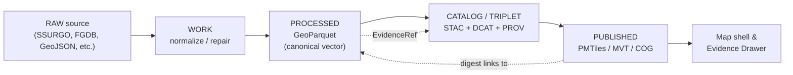
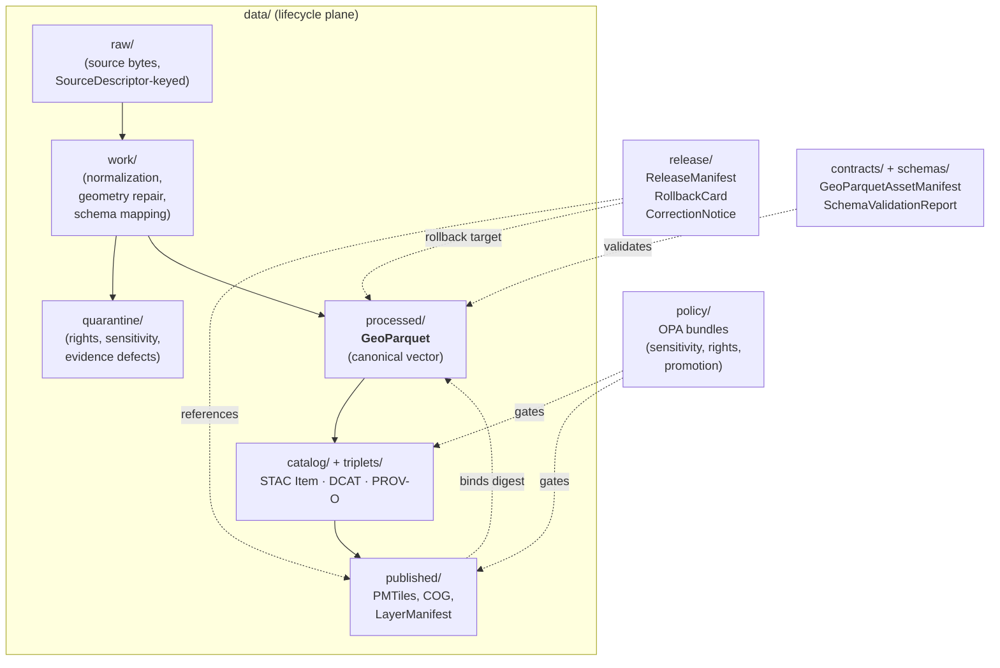

# GeoParquet — KFM Standards Reference

> Conformance posture, profile requirements, and governance shape for **GeoParquet 1.1.0** as the canonical vector artifact format inside the Kansas Frontier Matrix.

<!-- [KFM_META_BLOCK_V2]
doc_id: kfm://doc/standards-geoparquet
title: GeoParquet — KFM Standards Reference
type: standard
version: v1
status: draft
owners: docs-steward, data-platform-steward, geospatial-steward   <!-- PLACEHOLDER -->
created: 2026-05-14
updated: 2026-05-14
policy_label: public
related:
  - docs/standards/STAC.md            # PROPOSED neighbor
  - docs/standards/DCAT.md            # PROPOSED neighbor
  - docs/standards/PROV.md            # PROPOSED neighbor
  - docs/standards/COG.md             # PROPOSED neighbor
  - docs/standards/PMTILES.md         # PROPOSED neighbor
  - docs/standards/CANONICALIZATION.md  # PROPOSED neighbor (spec_hash)
  - docs/standards/RUN_RECEIPT.md     # PROPOSED neighbor
  - docs/doctrine/directory-rules.md
  - contracts/data/                   # PROPOSED home for GeoParquetAssetManifest meaning
  - schemas/contracts/v1/data/        # PROPOSED home for GeoParquetAssetManifest schema
tags: [kfm, standards, geoparquet, vector, processed-tier, catalog]
notes:
  - All KFM-internal paths in this doc are PROPOSED until verified against mounted-repo evidence.
  - This document is doctrine and external-standard reference; it is not a directory README.
[/KFM_META_BLOCK_V2] -->


<!-- Badge endpoints are illustrative; replace with real CI / release shields once wired. -->

| Field | Value |
|---|---|
| **Document type** | External-standard conformance reference (KFM doctrine layer) |
| **Authority of these rules** | CONFIRMED for KFM doctrine bound here; external claims cite GeoParquet 1.1.0 |
| **Authority of specific paths quoted** | **PROPOSED** until verified against mounted-repo evidence |
| **Proposed canonical home** | `docs/standards/GEOPARQUET.md` |
| **External spec tracked** | GeoParquet **1.1.0** (stable; OGC candidate Standard, incubating) |
| **External dev track (informational)** | GeoParquet **2.0-dev** (Parquet Geospatial Logical Types) — **NOT** adopted by KFM |
| **KFM role** | **Canonical vector artifact** — processed vector source of truth for derived tiles |
| **Lifecycle phase** | `PROCESSED` (admitted as the deterministic vector surface from which PMTiles/COG/derivatives are built) |
| **Schema-home convention** | `schemas/contracts/v1/data/` per ADR-0001 (PROPOSED for `GeoParquetAssetManifest`) |
| **Owner** | Docs steward + Geospatial/Data Platform stewards <!-- PLACEHOLDER --> |
| **Reviewers required for change** | Docs steward + Geospatial steward; ADR required for any change to the **canonical-vector role** of GeoParquet |
| **Related doctrine** | [`docs/doctrine/directory-rules.md`](../doctrine/directory-rules.md), [`docs/doctrine/lifecycle-law.md`](../doctrine/lifecycle-law.md), [`docs/doctrine/trust-membrane.md`](../doctrine/trust-membrane.md), [`docs/architecture/contract-schema-policy-split.md`](../architecture/contract-schema-policy-split.md) |
| **Lifecycle invariant** | `RAW → WORK / QUARANTINE → PROCESSED → CATALOG / TRIPLET → PUBLISHED` |

---

## 🧭 Quick jump

- [1. Purpose & scope](#1-purpose--scope)
- [2. Why GeoParquet in KFM](#2-why-geoparquet-in-kfm)
- [3. External standard alignment](#3-external-standard-alignment-geoparquet-110)
- [4. KFM profile requirements](#4-kfm-profile-requirements)
- [5. Object families & contracts](#5-object-families--contracts)
- [6. Pipeline placement](#6-pipeline-placement)
- [7. Lifecycle & promotion gates](#7-lifecycle--promotion-gates)
- [8. Validation matrix](#8-validation-matrix)
- [9. Policy, rights & sensitivity](#9-policy-rights--sensitivity)
- [10. Anti-patterns](#10-anti-patterns)
- [11. Illustrative profile snippet](#11-illustrative-profile-snippet)
- [12. Tooling](#12-tooling)
- [13. Note on GeoParquet 2.0](#13-note-on-geoparquet-20)
- [14. Open questions](#14-open-questions)
- [15. Related docs & sources](#15-related-docs--sources)

---

## 1. Purpose & scope

This document is KFM's **canonical reference for GeoParquet conformance**. It binds the external spec to KFM's lifecycle, governance, and validation posture, and it states the rules a contributor or reviewer applies when a vector dataset enters or moves inside the repository.

It covers:

- The external GeoParquet 1.1.0 spec surface that KFM relies on. **EXTERNAL.**
- KFM's **profile** on top of that spec (additional required metadata, naming, units, null policy, row-group discipline, CRS handling). **CONFIRMED doctrine / PROPOSED implementation.**
- The lifecycle position of GeoParquet artifacts and the gates they pass through. **CONFIRMED doctrine / PROPOSED implementation.**
- The object families and contracts that wrap GeoParquet bytes (`GeoParquetAssetManifest`, `SourceDescriptor`, `LayerManifest`, `RunReceipt`, `ReleaseManifest`, etc.). **CONFIRMED doctrine; objects PROPOSED in implementation.**

It does **not** cover:

- The shape of `GeoParquetAssetManifest` at field level — that belongs in `contracts/data/` (meaning) and `schemas/contracts/v1/data/` (JSON Schema). PROPOSED homes per ADR-0001.
- COG raster, PMTiles, or 3D tiles. Those are separate standards docs (`docs/standards/COG.md`, `docs/standards/PMTILES.md`, etc.). **PROPOSED neighbors.**
- Generic Parquet performance tuning. Tuning belongs in runbooks / pipelines, not standards doctrine.

> [!IMPORTANT]
> Repository state for *paths*, *schemas*, *validators*, *workflows*, and *contracts* named here is **PROPOSED** until verified against the mounted repo. Doctrine in this document is CONFIRMED; placement and existence are NEEDS VERIFICATION.

[Back to top](#-quick-jump)

---

## 2. Why GeoParquet in KFM

GeoParquet is the **canonical vector artifact** in KFM. It is the processed, deterministic, columnar form from which all derived vector tiles, indexes, and previews are built. PMTiles, MVT/MLT, FlatGeoBuf handoffs, and centroid quickmaps are **downstream** of GeoParquet — never alternatives to it.

This role is grounded in the corpus:

- A processed GeoParquet sits as a **single source of truth for derived tiles**; PMTiles MUST be derivable from canonical GeoParquet, and tile-artifact digests MUST be linked to the upstream GeoParquet digest. **CONFIRMED doctrine.**
- The published delivery chain is `pgSTAC → GeoParquet → PMTiles → OCI` for tile publication; exact byte identity is required at each step. **CONFIRMED doctrine.**
- SSURGO / gNATSGO and similar vector sources **MUST** be normalized into GeoParquet (vectors) plus COG (rasters) with consistent CRS, units, and provenance sidecars before any tile or map exposure. **CONFIRMED doctrine.**
- GeoParquet is treated as a Dagster-style **asset** with explicit post-materialization checks (row counts, schema, geometry validity, CRS) — not as an incidental file. **CONFIRMED doctrine.**

> [!NOTE]
> A GeoParquet is **not** itself authoritative KFM truth. It is a *processed vector artifact* — admissible to the catalog only when wrapped by `SourceDescriptor`, `RunReceipt`, manifests, and (where applicable) `ReleaseManifest`. EvidenceBundle resolution still routes through `EvidenceRef`, not directly to bytes.



[Back to top](#-quick-jump)

---

## 3. External standard alignment (GeoParquet 1.1.0)

KFM tracks **GeoParquet 1.1.0** as its conformance baseline. The following are the spec-level facts KFM relies on; they are external and may change with future minor or major releases.

| Aspect | Spec position (GeoParquet 1.1.0) | KFM posture |
|---|---|---|
| Underlying container | Apache Parquet (columnar). "The Apache Parquet provides a standardized open-source columnar storage format. The GeoParquet specification defines how geospatial data should be stored in parquet format, including the representation of geometries and the required additional metadata."  **EXTERNAL.** | Adopted. **CONFIRMED.** |
| RFC 2119 keywords | The key words MUST, MUST NOT, REQUIRED, SHALL, SHALL NOT, SHOULD, SHOULD NOT, RECOMMENDED, MAY, and OPTIONAL are interpreted as in RFC 2119.  **EXTERNAL.** | Same convention applies to this profile. **CONFIRMED.** |
| Geometry encoding | Geometry columns MUST be encoded as WKB or using the single-geometry type encodings based on the GeoArrow specification.  **EXTERNAL.** | KFM **REQUIRES WKB** by default for portability. GeoArrow native encoding **MAY** be used per dataset only with an ADR note and validator-fixture coverage. **PROPOSED.** |
| Geometry column placement | Geometry columns MUST be at the root of the schema.  **EXTERNAL.** | Enforced. **CONFIRMED.** |
| CRS encoding | The CRS MUST be provided in PROJJSON format, which is a JSON encoding of WKT2:2019 / ISO-19162:2019.  **EXTERNAL.** | KFM **REQUIRES** an explicit CRS for every geometry column (no implicit defaulting). See §4 on the corpus phrasing "CRS WKT2." **CONFIRMED doctrine.** |
| Default CRS if omitted | If the crs key does not exist, all coordinates in the geometries MUST use longitude, latitude based on the WGS84 datum, and the default value is OGC:CRS84 for CRS-aware implementations.  **EXTERNAL.** | KFM treats missing-CRS as **DENY** at promotion. Implicit `OGC:CRS84` is **not** acceptable for KFM-released products. **CONFIRMED doctrine.** |
| File extension | It is RECOMMENDED to use .parquet as the file extension... The file extension .geoparquet SHOULD NOT be used.  **EXTERNAL.** | KFM **REQUIRES** `.parquet`. **CONFIRMED.** |
| 1.1.0 bbox covering | #191 introduces the bbox covering encoding which defines a way to add an extra column that represents the bounding box of each geometry as a 'struct' in Parquet. This can accelerate spatial queries by allowing consumers to inspect row group and page index bounding box summary statistics.  **EXTERNAL.** | KFM **RECOMMENDS** bbox covering on canonical released GeoParquet to support row-group-level pruning and KFM's stable-row-grouping doctrine. **PROPOSED.** |
| Forward-compatibility rule | implementations of this specification: SHOULD NOT reject metadata with unknown fields. SHOULD explicitly validate all field values they rely on.  **EXTERNAL.** | KFM validators follow this rule: warn on unknown metadata, hard-fail on misvalued required fields. **PROPOSED.** |

> [!NOTE]
> **Corpus phrasing vs spec wire format.** KFM doctrine (ML-061-048) phrases the requirement as "GeoParquet should carry CRS **WKT2** and stable row grouping." The spec wire format for CRS is **PROJJSON**, which is a JSON encoding of the **WKT2:2019** model. The semantics match; the wire format does not. Validators MUST accept and emit PROJJSON.

[Back to top](#-quick-jump)

---

## 4. KFM profile requirements

The KFM profile is the **additive** set of rules KFM applies on top of GeoParquet 1.1.0. Conformance to the external spec alone is necessary but not sufficient for promotion.

### 4.1 Required at file level

| Requirement | Conformance | Source basis |
|---|---|---|
| Valid GeoParquet 1.1.0 metadata block | MUST | External spec |
| Single primary geometry column, WKB encoding (GeoArrow only with ADR) | MUST | KFM profile / external spec |
| Explicit per-column CRS (PROJJSON; matches doctrine "CRS WKT2") | MUST | KFM corpus (ML-061-048); external spec |
| Field names that **encode units as suffixes** (e.g. `aws_mm`, `slope_pct`, `pm25_ugm3`) | MUST | KFM corpus (ML-061-045) |
| **Null** for missing/invalid values; **never NaN, never sentinel** like `-9999` | MUST | KFM corpus (ML-061-045) |
| Stable, deterministic row grouping (documented strategy, deterministic ordering) | MUST | KFM corpus (ML-061-048) |
| 1.1.0 bbox covering column when row-group pruning matters | SHOULD | External spec; KFM profile |
| `.parquet` file extension | MUST | External spec recommendation, raised to MUST in KFM |
| Companion `SourceDescriptor` resolvable from catalog | MUST | KFM core invariants |
| Companion `RunReceipt` with `spec_hash` (`jcs:sha256:<hex>`) | MUST | KFM corpus (C1-01, C1-02) |
| OCI digest pin in any release manifest referencing this artifact | SHOULD (MUST at PUBLISHED) | KFM corpus (ML-064-003, ML-064-004) |

### 4.2 Required at column level

| Requirement | Conformance | Notes |
|---|---|---|
| Each geometry column has explicit `crs`, `geometry_types`, `encoding` | MUST | External spec |
| Each non-geometry numeric column has a unit-bearing name **or** documented unit in sidecar | MUST | KFM profile |
| Each categorical column has a documented enumeration in the contract or schema | SHOULD | KFM profile |
| Each time-bearing column is split into `*_source_time`, `*_observed_time`, `*_valid_time`, `*_retrieval_time` where material | SHOULD | KFM corpus (time-aware invariants) |
| Aggregations (e.g. H3) record the **strategy** and a `weights_checksum` field | MUST when aggregated | KFM corpus (ML-061-043, ML-061-046) |

### 4.3 Required around the file

Every released GeoParquet artifact MUST be reachable through, and consistent with:

- A `SourceDescriptor` declaring authority, rights, sensitivity, cadence.
- A `RunReceipt` that pins `spec_hash`, inputs, tool versions, and output digests.
- A `GeoParquetAssetManifest` (PROPOSED object family) binding bytes → catalog identity → policy posture.
- A STAC Item with the asset role `data`, a DCAT Distribution with mediaType `application/vnd.apache.parquet`, and a PROV-O activity recording the producing run.
- A `ReleaseManifest` referencing the artifact by OCI digest, with rollback target and correction path.

> [!IMPORTANT]
> **Cite-or-abstain applies.** A GeoParquet that cannot resolve its full evidence chain (SourceDescriptor + RunReceipt + STAC/DCAT/PROV + policy posture) MUST be held at `PROCESSED` and MUST NOT cross the CATALOG closure gate. Silent promotion of orphan artifacts is a doctrinal violation.

[Back to top](#-quick-jump)

---

## 5. Object families & contracts

The corpus names the following object families that wrap or accompany every released GeoParquet. None is claimed to exist in the current repo; all paths are **PROPOSED** placements per Directory Rules.

| Object family | Role for GeoParquet | Proposed home (meaning) | Proposed home (shape) |
|---|---|---|---|
| `SourceDescriptor` | Authority, rights, sensitivity, cadence for upstream sources | `contracts/source/` | `schemas/contracts/v1/source/` |
| `RunReceipt` | Inputs/outputs/tool versions, `spec_hash`, attestations | `contracts/runtime/` | `schemas/contracts/v1/runtime/` |
| `GeoParquetAssetManifest` | Byte-level binding: digest, schema, CRS, bbox, row-group strategy, source refs | `contracts/data/` | `schemas/contracts/v1/data/` |
| `ProcessedArtifact` | Generic PROCESSED-tier artifact descriptor | `contracts/data/` | `schemas/contracts/v1/data/` |
| `SchemaValidationReport` | Field-level validation outcome | `contracts/data/` | `schemas/contracts/v1/data/` |
| `LayerManifest` | Public-safe layer descriptor binding tiles/data to evidence | `contracts/release/` | `schemas/contracts/v1/release/` |
| `EvidenceBundle` / `EvidenceRef` | Resolved evidence; click-through identity | `contracts/evidence/` | `schemas/contracts/v1/evidence/` |
| `PolicyDecision` | Allow/deny/abstain/error before exposure | `contracts/runtime/` | `schemas/contracts/v1/runtime/` |
| `PromotionDecision` | Governed state-transition (Gates A–G) | `contracts/release/` | `schemas/contracts/v1/release/` |
| `ReleaseManifest` | Publication binding with digests, rollback, correction | `contracts/release/` | `schemas/contracts/v1/release/` |
| `RollbackCard` | Reversal target and instructions | `contracts/release/` | `schemas/contracts/v1/release/` |
| `CorrectionNotice` | Public correction of a released claim | `contracts/correction/` | `schemas/contracts/v1/correction/` |

> [!NOTE]
> `GeoParquetAssetManifest` is named in the corpus as a required object/contract for the GeoJSON-and-Runtime-Data category. Whether it is implemented in the current repo is **NEEDS VERIFICATION**. The schema-home rule (ADR-0001) places the JSON Schema under `schemas/contracts/v1/data/`. Do **not** create a parallel home in `contracts/<domain>/` without an ADR.

[Back to top](#-quick-jump)

---

## 6. Pipeline placement

GeoParquet sits squarely in **PROCESSED**. Inputs flow from `RAW` through `WORK`/`QUARANTINE`; outputs flow into `CATALOG/TRIPLET` (manifests, STAC/DCAT/PROV) and, if released, into tile artifacts under `PUBLISHED`.



Key placement rules (per Directory Rules):

- GeoParquet bytes live in `data/processed/<domain>/...` — never in `artifacts/`, never at repo root, never in a topic-named root folder. **CONFIRMED doctrine.**
- Manifests and validation reports for GeoParquet are object families in `contracts/data/` (meaning) and `schemas/contracts/v1/data/` (shape). **PROPOSED placement.**
- Tile artifacts derived from a GeoParquet (PMTiles, MVT) live in `data/published/<domain>/` and are referenced by `LayerManifest` and `TileArtifactManifest`. Their digests **MUST** link back to the upstream GeoParquet digest. **CONFIRMED doctrine.**
- Releases that publish a GeoParquet (or anything derived from it) are gated through `release/manifests/` and `release/rollback_cards/`. **CONFIRMED doctrine.**

[Back to top](#-quick-jump)

---

## 7. Lifecycle & promotion gates

A GeoParquet artifact passes the same lifecycle gates as any other PROCESSED artifact. The following table maps each gate to the GeoParquet-specific evidence it requires.

| Transition | Pre-condition | Required GeoParquet-specific artifacts (PROPOSED minimum) | Failure-closed outcome |
|---|---|---|---|
| Admission (— → RAW) | Source identity, rights, cadence established | `SourceDescriptor` for upstream source; payload hash | Not admitted; logged as candidate |
| Normalization (RAW → WORK) | Schema, geometry, time, identity, evidence, rights rules runnable | `TransformReceipt`; `ValidationReport` (working set); routing to `QUARANTINE` on rule failure | Quarantine with reason |
| Validation (WORK → PROCESSED) | Validators deterministic and fixture-bound | Passing `SchemaValidationReport`; geometry-validity pass; CRS present; unit-suffix policy honored; null policy honored | Stay in WORK; structured FAIL |
| Catalog closure (PROCESSED → CATALOG) | EvidenceRefs resolve; STAC/DCAT/PROV close | `GeoParquetAssetManifest`; STAC Item (asset role `data`, mediaType `application/vnd.apache.parquet`); DCAT Distribution; PROV-O activity; `weights_checksum` if aggregated | HOLD at PROCESSED; no public edge |
| Release (CATALOG → PUBLISHED) | Review where required; release authority distinct from author at materiality | `ReleaseManifest` referencing OCI digest; `rollback target`; `correction path`; `ReviewRecord` if required | HOLD at CATALOG; no public surface change |
| Correction (PUBLISHED → PUBLISHED′) | Detected error or new evidence | `CorrectionNotice`; new `ReleaseManifest`; tombstone for any superseded derivative tiles | Defer correction; do not silently mutate |

> [!CAUTION]
> **Tile artifacts are not promotion shortcuts.** A PMTiles or COG derived from a GeoParquet does not "promote" the GeoParquet by existing. Promotion is a governed state transition, not a file move. Publishing tiles whose upstream GeoParquet has not closed the CATALOG gate is a doctrinal violation and MUST be denied at release.

[Back to top](#-quick-jump)

---

## 8. Validation matrix

KFM validators for GeoParquet operate at three layers. None is asserted to exist in the current repo; this is the **PROPOSED** validator-set shape.

| Layer | What it checks | Pass / Fail behavior |
|---|---|---|
| **Layer 1 — GeoParquet 1.1.0 conformance** | Metadata block present and valid; geometry encoding; CRS present and parseable as PROJJSON; geometry column at root; geometry types declared; bbox covering well-formed if used | Hard-fail at WORK→PROCESSED gate |
| **Layer 2 — KFM profile** | Unit-suffix policy; null (not NaN, not sentinel) policy; stable row grouping; deterministic ordering; `spec_hash` matches; unit/enum sidecar coverage | Hard-fail at WORK→PROCESSED gate |
| **Layer 3 — Catalog closure** | STAC Item + DCAT Distribution + PROV-O present; mediaType correct; asset role `data`; `EvidenceRef` resolves to `EvidenceBundle`; `SourceDescriptor` reachable; `GeoParquetAssetManifest` consistent with bytes | Hard-fail at PROCESSED→CATALOG gate |
| **Layer 4 — Release policy** | OPA/Rego rules: rights known, sensitivity classified, signed attestations present, OCI digest pinned, rollback target set | Hard-fail at CATALOG→PUBLISHED gate |

### Negative-state requirement

Per Directory Rules and validator doctrine, every validator MUST exercise DENY / ABSTAIN / ERROR paths against fixed fixtures. For GeoParquet the minimum negative-fixture set SHOULD include:

- Missing CRS metadata → DENY (Layer 1).
- CRS not parseable as PROJJSON → DENY (Layer 1).
- Geometry column nested in a struct → DENY (Layer 1).
- NaN values in numeric columns → DENY (Layer 2).
- Sentinel `-9999` in a numeric column → DENY (Layer 2).
- Unit-less field name where unit is required → DENY (Layer 2).
- Row grouping that varies across rebuilds for the same input → DENY (Layer 2).
- Released artifact referenced by tag rather than digest → DENY (Layer 4).
- Released artifact without rollback target → DENY (Layer 4).

[Back to top](#-quick-jump)

---

## 9. Policy, rights & sensitivity

GeoParquet bytes inherit the rights and sensitivity posture of their `SourceDescriptor`s and any transforms applied. The trust-membrane rule is **non-negotiable**: a normal public client does not read PROCESSED GeoParquet directly; it consumes governed artifacts (released tiles, drawer payloads, governed-API responses).

Fail-closed conditions specifically for GeoParquet publication:

- **Unknown or unresolved rights** on any upstream source → DENY.
- **Sensitive geometry** exposed at full precision when generalization or redaction is required by the sensitivity rubric → DENY.
- **Missing or stale `SourceDescriptor`** for any contributing source → DENY or ABSTAIN per posture.
- **Missing `spec_hash`** or `spec_hash` mismatch between manifest and recomputed canonicalization → DENY.
- **Unsigned attestations** for released GeoParquet referenced in `ReleaseManifest` → DENY.
- **CARE-bound metadata** (consent, locality restriction, review expiry) absent for sensitive domains → DENY.

> [!WARNING]
> Aggregated GeoParquet (e.g. H3-cell summaries derived from sensitive point data) MAY still leak identity through join attacks, low-cell counts, or temporal narrowing. Aggregation alone does not satisfy sensitivity policy. Aggregation strategy and `weights_checksum` must be auditable; aggregation parameters must be reviewable; small-count cells MUST be subject to the redaction profiles documented in `docs/standards/SENSITIVITY_RUBRIC.md` (PROPOSED neighbor).

[Back to top](#-quick-jump)

---

## 10. Anti-patterns

The following patterns are **explicit doctrinal violations**. Reviewers SHOULD block PRs that introduce them.

- Treating a PMTiles, MVT, or quickmap centroid layer as the **canonical vector source**. Tiles are derivatives; GeoParquet is canonical. **CONFIRMED doctrine.**
- Publishing GeoParquet **without an upstream `SourceDescriptor`** or without a `RunReceipt` recording inputs and tool versions.
- Using **`.geoparquet`** as the file extension. External spec says SHOULD NOT; KFM raises to MUST NOT.
- Using **NaN, `-9999`, or empty strings** to mean "missing." Null only.
- Encoding **units in column descriptions or sidecars only**, without unit suffixes in field names.
- Letting **row grouping drift** between rebuilds of the same logical input. Determinism is required for stable tile diffs and stable `spec_hash`.
- Releasing tiles whose **upstream GeoParquet has not closed the CATALOG gate**.
- Referencing released artifacts by **tag** instead of **OCI digest**. Tags are mutable; digests are not.
- **Centroid-only** GeoParquet products published as if they were the area-canonical product. If both strategies are run, the area-intersection product is canonical; centroid is `role=preview`. **CONFIRMED doctrine (ML-061-044).**
- Creating **parallel schema or contract homes** for `GeoParquetAssetManifest` outside the ADR-0001 default of `schemas/contracts/v1/data/` without an ADR.

[Back to top](#-quick-jump)

---

## 11. Illustrative profile snippet

> [!NOTE]
> The block below is **illustrative**, not normative. It shows the *shape* of a KFM-conformant GeoParquet metadata block plus the companion catalog/manifest references. Field names follow KFM corpus conventions and the GeoParquet 1.1.0 spec; exact field validation will be defined by the JSON Schema once `schemas/contracts/v1/data/geoparquet_asset_manifest.schema.json` is authored under ADR-0001.

```json
{
  "geo_metadata_v1_1_0": {
    "version": "1.1.0",
    "primary_column": "geometry",
    "columns": {
      "geometry": {
        "encoding": "WKB",
        "geometry_types": ["MultiPolygon"],
        "crs": "<PROJJSON object encoding WKT2:2019, e.g., EPSG:5070 CONUS Albers>",
        "bbox": [-102.05, 36.99, -94.59, 40.00],
        "covering": {
          "bbox": {
            "xmin": ["bbox", "xmin"],
            "ymin": ["bbox", "ymin"],
            "xmax": ["bbox", "xmax"],
            "ymax": ["bbox", "ymax"]
          }
        }
      }
    }
  },
  "kfm_profile_sidecar": {
    "object_type": "GeoParquetAssetManifest",
    "schema_version": "v1",
    "spec_hash": "jcs:sha256:<hex>",
    "source_refs": ["kfm://source/ssurgo/ks/<...>"],
    "evidence_refs": ["kfm://evidence/<...>"],
    "run_receipt": "kfm://run/<...>",
    "row_group_strategy": "deterministic-by-fips-then-mukey",
    "aggregation": null,
    "weights_checksum": null,
    "rights_status": "public",
    "sensitivity": "public",
    "review_state": "approved",
    "release_state": "candidate",
    "media_type": "application/vnd.apache.parquet"
  }
}
```

[Back to top](#-quick-jump)

---

## 12. Tooling

KFM does not mandate a specific reader/writer library, but validation MUST run against tools whose conformance is independently checkable. Two reference validators are commonly cited.

<details>
<summary><b>Reference validators (illustrative — pin a version per ADR)</b></summary>

| Tool | Role | Notes |
|---|---|---|
| **GPQ** (`gpq validate`) | First-line GeoParquet 1.1.0 metadata + data conformance check | Independent implementation; produces a report. **EXTERNAL.** |
| **GDAL/OGR Parquet driver + validation script** | Cross-checks GeoParquet via GDAL's reader and a Python validator | Useful when KFM pipelines already pin GDAL/PROJ for COG and geometry repair. **EXTERNAL.** |
| KFM **profile validator** (PROPOSED) | Layer 2 unit-suffix / null / row-group / spec_hash checks | Lives in `tools/validators/geoparquet/` (PROPOSED). **NEEDS VERIFICATION.** |
| KFM **catalog-closure validator** (PROPOSED) | Layer 3 STAC + DCAT + PROV + EvidenceBundle resolution | Reuses STAC and DCAT validators with KFM extension hooks. **NEEDS VERIFICATION.** |

Per the dependency-governance rule, **GEOS / GDAL / PROJ / PostGIS versions MUST be pinned** for deterministic geometry behavior; conservative fallback heuristics MUST be documented. **CONFIRMED doctrine.**

</details>

[Back to top](#-quick-jump)

---

## 13. Note on GeoParquet 2.0

A development version of GeoParquet is in progress, targeting **Parquet Geospatial Logical Types** for native geometry / geography at the Parquet core level. The current dev version is 2.0, which is based on Parquet Geospatial Logical Types. The Parquet format now includes core geometry and geography types and the GeoParquet 2.0 spec provides guidance for geospatial tools to the types, along with some optional metadata not covered in the core Parquet specification.  **EXTERNAL.**

KFM posture on 2.0:

- **NOT adopted.** GeoParquet 2.0 is dev-track; KFM tracks the **stable 1.1.0** baseline.
- Adoption of 2.0 will require:
  - An accepted ADR amending this document and pinning a 2.0 minor release.
  - A dual-validate window in which both 1.1.0 and 2.0 must pass before any 2.0-only artifact is released.
  - A migration receipt for any existing released artifact reissued under 2.0, plus a correction notice if behavior changes.
- Until then, **any 2.0-encoded file is QUARANTINE on admission.**

[Back to top](#-quick-jump)

---

## 14. Open questions

- **NEEDS VERIFICATION:** Whether `docs/standards/GEOPARQUET.md` is the agreed path. Directory Rules §6.1 names `docs/standards/` as the home for external-standard conformance docs; the specific filename is **PROPOSED**.
- **NEEDS VERIFICATION:** Whether `GeoParquetAssetManifest` is currently implemented in `schemas/contracts/v1/data/` or elsewhere in the mounted repo.
- **OPEN:** Whether the KFM CRS rule should require a specific authority/code form (e.g. always `id.authority = "EPSG"` plus `id.code`), or accept any PROJJSON that round-trips losslessly to WKT2:2019.
- **OPEN:** Whether bbox covering is **SHOULD** or **MUST** for canonical KFM-released GeoParquet. Currently SHOULD; an ADR could promote to MUST if row-group pruning becomes load-bearing.
- **OPEN:** Whether GeoArrow native encoding is permitted as an alternative to WKB. Currently allowed by ADR only.
- **OPEN:** Whether **`weights_checksum`** is a top-level KFM profile field or lives inside `GeoParquetAssetManifest`. Both placements appear in the corpus; an ADR should fix one.
- **NEEDS VERIFICATION:** Whether existing KFM workflows already emit STAC + DCAT + PROV for GeoParquet outputs end-to-end, or only emit STAC.

These belong in `docs/registers/VERIFICATION_BACKLOG.md` and `docs/adr/` once tracked.

[Back to top](#-quick-jump)

---

## 15. Related docs & sources

### KFM doctrine and architecture (in-repo)

- [`docs/doctrine/directory-rules.md`](../doctrine/directory-rules.md) — §6.1 names `docs/standards/` as the home for external-standard docs; §6.3, §6.4, §6.5 define the contract/schema/policy split.
- [`docs/doctrine/lifecycle-law.md`](../doctrine/lifecycle-law.md) <!-- PROPOSED --> — `RAW → WORK / QUARANTINE → PROCESSED → CATALOG / TRIPLET → PUBLISHED`.
- [`docs/doctrine/trust-membrane.md`](../doctrine/trust-membrane.md) <!-- PROPOSED --> — public path is `apps/governed-api/`, never canonical stores.
- [`docs/architecture/contract-schema-policy-split.md`](../architecture/contract-schema-policy-split.md) <!-- PROPOSED -->.
- [`docs/adr/ADR-0001-schema-home.md`](../adr/ADR-0001-schema-home.md) — schema-home default of `schemas/contracts/v1/...`.

### Adjacent KFM standards docs (PROPOSED neighbors)

- `docs/standards/STAC.md` — KFM STAC profile (`kfm-stac-profile-v1`).
- `docs/standards/DCAT.md` — DCAT Dataset / Distribution conformance.
- `docs/standards/PROV.md` — PROV-O activity binding.
- `docs/standards/COG.md` — Cloud Optimized GeoTIFF role and gates.
- `docs/standards/PMTILES.md` — PMTiles derivative tile artifacts.
- `docs/standards/CANONICALIZATION.md` — RFC 8785 JCS + SHA-256 → `jcs:sha256:<hex>`.
- `docs/standards/RUN_RECEIPT.md` — `RunReceipt` field intent.
- `docs/standards/SENSITIVITY_RUBRIC.md` — sensitivity ranks and redaction profiles.

### External sources

- GeoParquet 1.1.0 stable release notes — `https://github.com/opengeospatial/geoparquet/releases/tag/v1.1.0`. **EXTERNAL.**
- GeoParquet 1.1.0 specification — `https://geoparquet.org/releases/v1.1.0/`. **EXTERNAL.**
- GeoParquet 1.1.0 metadata JSON Schema — `https://geoparquet.org/releases/v1.1.0/schema.json`. **EXTERNAL.**
- GeoParquet project home — `https://geoparquet.org/`. **EXTERNAL.**
- OGC candidate Standard draft — `https://docs.ogc.org/DRAFTS/24-013.html`. **EXTERNAL.**
- GPQ validator — `https://github.com/planetlabs/gpq`. **EXTERNAL.**
- GDAL Parquet driver and validation script — `https://gdal.org/drivers/vector/parquet.html`. **EXTERNAL.**
- RFC 2119 — keyword interpretation. **EXTERNAL.**
- RFC 8785 (JSON Canonicalization Scheme) — basis for `spec_hash`. **EXTERNAL.**

[Back to top](#-quick-jump)

---

<sub>
<b>Last reviewed:</b> 2026-05-14 &nbsp;·&nbsp;
<b>Owners:</b> docs-steward, data-platform-steward, geospatial-steward (PLACEHOLDER) &nbsp;·&nbsp;
<b>External baseline:</b> GeoParquet 1.1.0 &nbsp;·&nbsp;
<b>Status:</b> draft — implementation maturity for paths and contracts is PROPOSED / NEEDS VERIFICATION.
</sub>

<sub>[Back to top](#-quick-jump)</sub>
