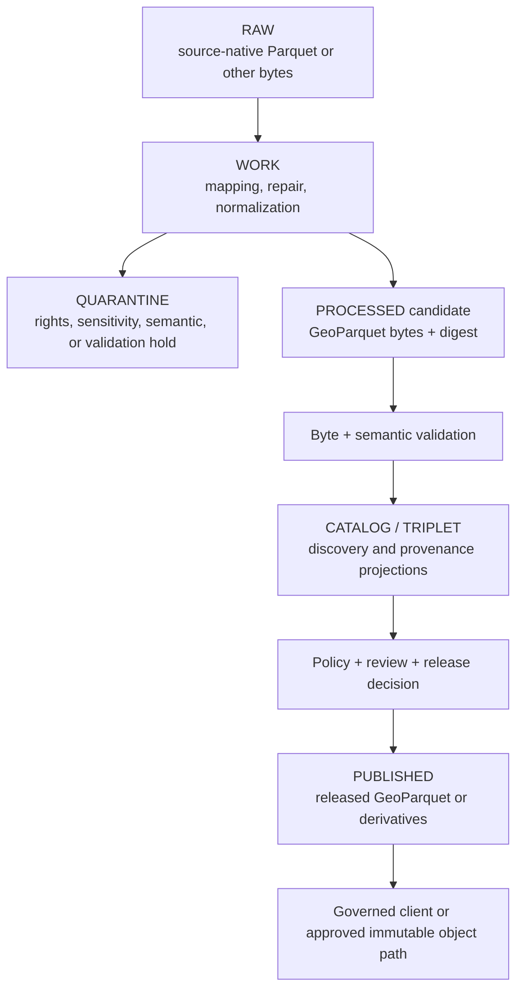

<!-- [KFM_META_BLOCK_V2]
doc_id: kfm://doc/standards-geoparquet
title: GeoParquet — KFM Standards Guidance and Readiness Boundary
type: standard
version: v1.1
status: "draft; repository-grounded; non-authoritative; adoption-held"
owners:
  - "@bartytime4life"
created: 2026-05-14
updated: 2026-08-18
policy_label: repository-facing
owning_root: docs/
current_path: docs/standards/GEOPARQUET.md
responsibility: "Explain GeoParquet upstream requirements, current KFM candidate profiles, evidence limits, and graduation gates without creating format, policy, release, or publication authority."
truth_posture: "CONFIRMED path, current repository candidate surfaces, default review route, and declared 1.1/2.0-RC boundaries / PROPOSED KFM profile and version-readiness decision / UNKNOWN real carrier bytes, production consumers, release state, and public distribution / NEEDS VERIFICATION byte-level conformance, semantic parity, accountable stewardship, and upstream currentness at each material change"
evidence_snapshot: "main@f9a515a1124f9f5397996f6bc7cb3fd1a3534c40; prior target blob 7320145300e2ab6f414078e8479735ec374711c4; GeoParquet readiness contract blob 17055a680b83a4f83834735e88aeb0569322845b; readiness schema blob b6ebec77a6e09c50b89594c4032bd40ec238f6be; STAC mirror contract blob e5b3aabbee5a697d8e72e84f7df769882fdf76d5; GeoParquet 2 RC assessment contract blob 98345edd9f5262a63064b01cac57145eed2fe0e9; published-lane README blob d5aced3d0e8200fba1be2a236a561e3fd2918224; CODEOWNERS blob dd2a84aa514d8ecd9208bc347f90f9a2ed37dd61"
related:
  - docs/standards/README.md
  - docs/doctrine/directory-rules.md
  - docs/adr/ADR-0029-adopt-directory-governance-standard-v2.md
  - docs/adr/ADR-0033-geoparquet-version-readiness.md
  - contracts/release/geospatial_carrier_readiness.md
  - schemas/contracts/v1/release/geospatial_carrier_readiness.schema.json
  - contracts/data/stac_geoparquet_mirror_assessment.md
  - contracts/release/geoparquet_2_rc_compatibility_assessment.md
  - data/published/geoparquet/README.md
  - docs/standards/CANONICALIZATION.md
  - docs/registers/VERIFICATION_BACKLOG.md
  - .github/CODEOWNERS
tags: [kfm, standards, geoparquet, parquet, geospatial, carrier, interoperability, validation, lifecycle, release, correction, rollback]
notes:
  - "v1.1 replaces proposal-era canonicality and implementation claims with a repository-grounded, evidence-bounded standards reference."
  - "The current GeoParquet 1.1 candidate profile is metadata-only and PROPOSED_INACTIVE; it does not open Parquet bytes."
  - "ADR-0033 remains proposed. The GeoParquet 2.0 RC assessment is readiness to run byte probes, not adoption or compatibility proof."
  - "Current executable digest grammar is sha256:<64-lowercase-hex>; jcs:sha256:<hex> remains a proposed migration target."
  - "No contract, schema, policy, source, data artifact, validator, workflow, release, deployment, or publication state changes through this document."
[/KFM_META_BLOCK_V2] -->

<a id="top"></a>
<a id="geoparquet--kfm-standards-reference"></a>

# GeoParquet — KFM Standards Guidance and Readiness Boundary

> **Operating rule.** Treat GeoParquet as a geospatial table carrier. Do not treat a file extension, metadata block, profile name, validator result, catalog row, or standards document as source authority, evidence closure, policy approval, release authorization, or publication proof.

> [!IMPORTANT]
> **Human-readable guidance only.** [`docs/standards/`](./README.md) owns standards guidance and navigation. Contracts own KFM meaning, schemas own machine-valid shape, policy and governed review own admissibility, code and tests own bounded behavior, and `release/` plus supporting evidence owns release state.

> [!CAUTION]
> **The declared `1.1.0` baseline is not accepted production policy.** The repository contains a draft standards page, a proposed ADR, and inactive synthetic readiness profiles. Those surfaces do not prove that a real KFM GeoParquet writer, reader, query engine, catalog, download route, or public client is operational.

> [!WARNING]
> **Current GeoParquet checks do not open Parquet bytes.** The checked-in readiness and STAC-mirror profiles evaluate declared metadata or declared projections. They cannot establish physical encoding, footer correctness, geometry validity, CRS round trip, spatial statistics, row-group behavior, semantic parity, or cross-engine interoperability.

> [!NOTE]
> The upstream-currentness checkpoint reviewed for this edition distinguishes the stable `1.1.0` wire profile and its upstream correction tag `v1.1.0+p1` from the separate `v2.0.0-rc.1` release-candidate track. A correction tag, release candidate, or upstream publication does not silently change KFM adoption state.

## Current status

| Surface | Current repository evidence | Bounded conclusion |
|---|---|---|
| This standards path | `docs/standards/GEOPARQUET.md` exists and is indexed by the standards README | **CONFIRMED guidance path** |
| Review routing | Repository-default CODEOWNERS routes this path to `@bartytime4life` | **CONFIRMED GitHub route; stewardship still NEEDS VERIFICATION** |
| KFM version decision | [`ADR-0033`](../adr/ADR-0033-geoparquet-version-readiness.md) remains `proposed` | **No accepted GeoParquet version policy** |
| GeoParquet 1.1 readiness | `GeospatialCarrierReadinessCheck` is `PROPOSED_INACTIVE` and metadata-only | **Synthetic declaration proof only** |
| STAC collection mirror | `StacGeoParquetMirrorAssessment` is proposed, experimental, fixture-only, and does not read Parquet | **Declared parity proof only** |
| GeoParquet 2.0 RC | `GeoParquet2RCCompatibilityAssessment` is `PROPOSED_INACTIVE` and classifies readiness to run byte probes | **No byte compatibility or adoption proof** |
| Published carrier lane | `data/published/geoparquet/` has a draft boundary README and domain child READMEs | **Placement documentation; emitted carrier bytes UNKNOWN** |
| Byte-level conformance | No real GeoParquet artifact was verified in this review | **UNKNOWN / HOLD** |
| Production consumers | No complete writer, reader, query-engine, API, map-build, or external-consumer inventory was verified | **UNKNOWN / HOLD** |
| Release/publication | No release manifest, correction drill, rollback drill, deployment, or public download was verified for a GeoParquet artifact | **UNKNOWN / no effect** |

**Quick navigation:** [Purpose](#1-purpose--scope) · [Role](#2-why-geoparquet-in-kfm) · [Upstream](#3-external-standard-alignment-geoparquet-110) · [KFM profile](#4-kfm-profile-requirements) · [Objects](#5-object-families--contracts) · [Pipeline](#6-pipeline-placement) · [Gates](#7-lifecycle--promotion-gates) · [Validation](#8-validation-matrix) · [Policy](#9-policy-rights--sensitivity) · [Anti-patterns](#10-anti-patterns) · [Example](#11-illustrative-profile-snippet) · [Tooling](#12-tooling) · [2.0](#13-note-on-geoparquet-20) · [Backlog](#14-open-questions) · [References](#15-related-docs--sources)

---

<a id="1-purpose--scope"></a>

## 1. Purpose & scope

This document explains how GeoParquet relates to KFM's governed lifecycle and how to distinguish upstream format conformance from KFM-specific readiness, semantic fitness, policy, release, and publication.

It covers:

- the external GeoParquet `1.1.0` metadata and geometry-carrier model;
- the upstream `v1.1.0+p1` correction checkpoint and the `v2.0.0-rc.1` review track;
- current KFM candidate contracts, schemas, fixtures, validators, tests, workflows, and their explicit limits;
- the evidence required before a GeoParquet artifact can support catalog, release, or public use;
- version-transition, correction, withdrawal, and rollback discipline; and
- a dependency-ordered verification backlog.

It does not:

- define domain object meaning or column semantics;
- create a KFM GeoParquet production profile;
- accept ADR-0033 or any other ADR;
- create `GeoParquetAssetManifest` or another object family;
- activate a source or normalize source data;
- certify a Parquet file or a geospatial query engine;
- evaluate rights, sensitivity, policy, or review;
- promote lifecycle state;
- authorize release, deployment, download, or publication; or
- require every vector dataset or public product to use GeoParquet.

### 1.1 Authority separation

| Question | Owning authority | Role of this page |
|---|---|---|
| Where standards guidance belongs | Accepted ADR-0029 and Directory Rules | Explain the existing lane |
| What a KFM record means | `contracts/` | Cite, do not redefine |
| What machine shape is valid | `schemas/` | Cite, do not replace |
| What a validator checks | Validator code, fixtures, tests, workflow | Describe the checked boundary |
| Which source is admissible | Source admission, rights review, source registry | No authority |
| What is allowed, denied, redacted, or held | `policy/` and governed review | No authority |
| Whether an artifact is evidence-supported | EvidenceRefs, EvidenceBundles, proof and review state | No authority |
| Whether an artifact is released | `release/` and authorized review | No authority |
| Whether an upstream version is current | Official upstream issuer at a dated checkpoint | Record the snapshot and recheck trigger |

### 1.2 Normative words

`MUST`, `SHOULD`, and similar words in an upstream-summary row report the cited upstream specification. KFM-specific normative words are binding only when an accepted decision, semantic contract, schema, active policy, or other authorized control makes them binding. Unattributed normative language in a draft standards page is a proposal, not policy.

[Back to top](#top)

---

<a id="2-why-geoparquet-in-kfm"></a>

## 2. Why GeoParquet in KFM

GeoParquet is a strong **candidate carrier** for geospatial tables because it combines Apache Parquet's columnar storage with standardized geometry metadata. It may support analytical scans, portable interchange, reproducible transformations, spatial pruning, and downstream derivatives without collapsing KFM's evidence and governance layers.

That suitability does not establish universal canonicality.

### 2.1 Candidate responsibilities

Where an accepted domain or release profile selects GeoParquet, the carrier can serve as:

- a deterministic output of a documented normalization step;
- a portable geospatial table for analytical consumers;
- an upstream input to derived tile or export products;
- a released download artifact when rights and sensitivity permit;
- a catalog distribution linked to source, transform, evidence, and release records; and
- a correction or rollback target identified by immutable digest.

### 2.2 Responsibilities it cannot own

A GeoParquet file does not, by itself, establish:

- source authority or source role;
- observation truth, regulatory meaning, modeled-versus-observed status, or uncertainty;
- identity permanence;
- rights, license, consent, sovereignty, or sensitivity;
- EvidenceBundle closure;
- policy or review state;
- lifecycle promotion;
- release or publication authority;
- public-map fitness; or
- AI answer authority.

### 2.3 Target governed flow


```mermaid
flowchart LR
  S["Admitted source bytes<br/>and source identity"]
  W["WORK / QUARANTINE<br/>normalize, repair, review"]
  G["GeoParquet candidate<br/>exact bytes + digest"]
  M["Metadata readiness<br/>PROPOSED_INACTIVE"]
  B["Byte-level conformance<br/>and safety"]
  P["Semantic parity<br/>and domain validation"]
  C["Catalog + evidence +<br/>policy + review closure"]
  R["Release decision<br/>correction + rollback"]
  D["Approved delivery<br/>download / API / derivative"]
  U["Public or internal client"]

  S --> W --> G --> M --> B --> P --> C --> R --> D --> U
```

**Current repository maturity stops before the byte-level step.** The metadata-ready, STAC-mirror, and 2.0-RC readiness profiles are synthetic and non-authorizing.

### 2.4 Derivative relationship

A PMTiles archive, MVT layer, API payload, statistical summary, or other derivative may be linked to a GeoParquet input when the owning build specification says so. That relationship must be explicit and digest-bound. This page does not decree that every derivative has one GeoParquet parent or that GeoParquet is always the sovereign representation.

[Back to top](#top)

---

<a id="3-external-standard-alignment-geoparquet-110"></a>

## 3. External standard alignment (GeoParquet 1.1.0)

The external specification defines how geospatial columns and metadata are represented in Apache Parquet. The table below separates upstream requirements from KFM's current candidate posture.

| Topic | Upstream GeoParquet 1.1 position | Current KFM posture |
|---|---|---|
| Container | Apache Parquet carries the table and file metadata | External fact; no KFM adoption implied |
| Metadata key | The Parquet file metadata contains a `geo` JSON object with version, primary column, and geometry-column metadata | Byte-level presence is **not currently verified** |
| Geometry-column location | Geometry columns are root-level columns | Current inactive readiness declaration records `root_geometry_column` |
| Geometry encoding | 1.1 supports WKB and specified single-geometry GeoArrow encodings | Current readiness contract describes WKB as the declared baseline; exact schema/validator treatment of alternatives remains bounded by current fixtures |
| Primary geometry | `primary_column` identifies the primary geometry column; other geometry columns may exist | The current KFM readiness candidate declares one primary root geometry, but this is not an accepted universal policy |
| CRS | Geometry-column metadata may carry CRS as PROJJSON; omission has upstream default semantics and explicit `null` has distinct meaning | Current inactive KFM readiness candidate requires explicit PROJJSON rather than relying on omission |
| Geometry types | Geometry types are declared per geometry column | Current readiness declaration records a nonempty list |
| Bounding box | Column bbox is optional metadata | Presence and correctness require byte-level verification |
| Covering | 1.1 defines an optional bbox covering that can support pruning | Current candidate treats absence as advisory, not a universal failure |
| Unknown fields | Consumers should preserve forward compatibility and explicitly validate fields they depend on | Current candidate records `unknown_metadata_preserved`; no real round trip was exercised |
| Extension | `.parquet` is the recommended extension; `.geoparquet` is discouraged upstream | Current inactive KFM candidate expects `.parquet` |
| Wire version | A corrected upstream release tag does not necessarily change the `geo.version` value | `v1.1.0+p1` is a source/release checkpoint; the declared wire profile remains `1.1.0` |
| Media type | Upstream and ecosystem usage must be checked for the intended exchange context | Current KFM metadata candidate declares `application/vnd.apache.parquet`; release interoperability remains unverified |

> [!IMPORTANT]
> **CRS omission must not be silently reinterpreted.** Upstream omission semantics, explicit `null`, and a complete PROJJSON object are different states. KFM's current inactive declaration profile chooses explicit PROJJSON, but only an accepted profile can make that choice binding across production artifacts.

### 3.1 Conformance layers are independent

A file may satisfy the upstream GeoParquet metadata schema and still be unsuitable for KFM because:

- geometry or attribute semantics changed during transformation;
- source role, time, units, null meaning, or uncertainty were lost;
- rights or sensitivity prohibit the intended distribution;
- evidence or catalog bindings are incomplete;
- a consumer does not correctly interpret the file;
- release and correction support are absent; or
- the file is unsafe or too costly for the intended reader.

Conversely, a schema-valid KFM declaration cannot prove that the underlying bytes satisfy GeoParquet.

### 3.2 Upstream-currentness rule

Recheck official upstream sources when any of the following changes:

- a GeoParquet release or correction tag;
- the GeoParquet metadata schema;
- the Apache Parquet logical-type specification;
- OGC publication status or errata;
- a pinned writer, reader, or query engine;
- the KFM version-readiness ADR; or
- a material KFM consumer or release profile.

[Back to top](#top)

---

<a id="4-kfm-profile-requirements"></a>

## 4. KFM profile requirements

KFM does **not currently have an accepted production GeoParquet profile**. It has a bounded inactive metadata-readiness candidate and related fixture-only assessments. This section records those surfaces without promoting them.

### 4.1 Current inactive 1.1 readiness candidate

`GeospatialCarrierReadinessCheck` currently declares the following GeoParquet expectations:

| Declared property | Candidate expectation | Proof limit |
|---|---|---|
| Format version | `1.1.0` | Version declaration only |
| File identity | Immutable ref, `sha256:<64-lowercase-hex>`, `.parquet`, declared media type | Digest shape only; bytes unresolved |
| Geometry | Root primary geometry and declared geometry types | No geometry bytes opened |
| Encoding | Current contract describes WKB baseline | No physical encoding inspected |
| CRS | Explicit PROJJSON declaration | No CRS parse or round trip |
| Ordering | Stable row grouping and deterministic ordering | No footer or rebuild comparison |
| Missing values | `NULL_ONLY` declaration | No column values scanned |
| Unknown metadata | Preservation declared | No writer-reader round trip |
| Numeric units | Coverage declared | No field dictionary or semantic check |
| Bbox covering | Optional/advisory | No covering column or statistics inspected |
| Layout profile | Compression, ordering, row-group targets, partitioning, writer, parameters, and benchmark refs | Declared plan only |
| Network | Forbidden | Synthetic validation boundary |
| Governance | Every authority and publication flag fixed false; `release_ref` fixed null | Explicit non-effect |

Finite outcomes are `READY`, `HOLD`, or `ERROR`. `READY` means the declaration satisfies this inactive candidate profile. It does **not** mean the file is valid, safe, interoperable, reviewed, released, or public.

### 4.2 Candidate layout profile

The current schema records a benchmark-bound layout decision rather than one universal physical layout:

- compression codec;
- ordering strategy, version, and parameter digest;
- target rows and target bytes per row group;
- partition strategy, version, and parameter digest;
- writer implementation, version, and parameter digest; and
- benchmark reference and result digest.

The current candidate permits multiple strategies and treats ZSTD as a recommendation rather than a universal hard requirement. This is a sound evidence boundary: row width, geometry complexity, predicate mix, writer behavior, object-store access, analytics, and delivery needs can produce different valid choices.

### 4.3 Requirements not established as universal KFM law

The following statements from the prior edition are **not established as accepted, repository-wide rules**:

- GeoParquet is the canonical vector source for every domain and derivative.
- Every dataset has exactly one geometry column.
- WKB is the only permissible encoding forever.
- Units must always be encoded in column-name suffixes.
- Every time concept must use one fixed column-name pattern.
- Every numeric absence must use one universal representation independent of object-family meaning.
- Every aggregation must use a top-level `weights_checksum`.
- Every file must use one compression codec, ordering algorithm, partition grid, or row-group size.
- Every GeoParquet must be mirrored into STAC, DCAT, and PROV in one fixed shape.
- Every release must use OCI packaging.
- Every public delivery must proxy bytes through one application server.

Any such rule needs an accountable owner, accepted semantic or architecture authority, executable shape where applicable, positive and negative fixtures, consumer evidence, migration plan, correction plan, and rollback.

### 4.4 Graduation properties for an accepted profile

A future accepted KFM GeoParquet profile should define, at minimum:

1. exact supported upstream version and correction level;
2. geometry encodings, dimensionality, empty-geometry, mixed-geometry, and multiple-column rules;
3. CRS omission, `null`, explicit PROJJSON, axis order, epoch, and transform behavior;
4. domain field meaning, units, nulls, enums, precision, uncertainty, and time semantics;
5. identity, deterministic ordering, row-group, partition, compression, and statistics rules;
6. resource limits and hostile-file handling;
7. immutable byte identity and object-family hash domain;
8. source, transform, evidence, catalog, rights, sensitivity, policy, review, and release bindings;
9. required writers, readers, query engines, and public consumers;
10. correction, withdrawal, supersession, cache invalidation, and rollback behavior; and
11. version negotiation and migration between 1.1 and later profiles.

[Back to top](#top)

---

<a id="5-object-families--contracts"></a>

## 5. Object families & contracts

Current GeoParquet-adjacent repository surfaces are deliberately separate.

| Surface | Current state | What it proves | What it does not prove |
|---|---|---|---|
| `GeospatialCarrierReadinessCheck` | `PROPOSED_INACTIVE`; contract, schema, fixtures, validator, tests, workflow | Deterministic metadata-declaration classification | Parquet bytes, semantics, evidence, policy, release |
| `StacGeoParquetMirrorAssessment` | Proposed, experimental, fixture-only | Declared full/sample projection parity with finite outcomes | STAC source validity, Parquet existence, byte conformance, catalog closure |
| `GeoParquet2RCCompatibilityAssessment` | `PROPOSED_INACTIVE` | Whether a synthetic pinned-toolchain packet is ready for later byte probes | Tool installation, package authenticity, byte compatibility, adoption |
| ADR-0033 | Proposed | Decision options and evidence ladder | Accepted policy or implementation |
| `data/published/geoparquet/README.md` | Draft lane boundary | Intended placement and release prerequisites | Presence of released GeoParquet bytes or download routes |
| Generated authoring receipts | Historical process evidence for named files | Declared document/artifact bindings at their recorded revision | Current conformance, review, release, or publication |

### 5.1 `GeoParquetAssetManifest` status

A bounded repository search found `GeoParquetAssetManifest` only in the prior standards prose. No corresponding semantic contract, JSON Schema, fixture family, validator, test, workflow, or emitted instance was verified.

**Status: `PROPOSED / NOT IMPLEMENTED AS A VERIFIED OBJECT FAMILY`.**

Do not create a parallel manifest home from this page. A future object must follow accepted Directory Rules and current contract/schema authority, with placement checked against existing generic artifact, release, catalog, and evidence families.

### 5.2 Broader bindings remain separate

GeoParquet artifacts may need references to existing KFM families such as source descriptors, run receipts, evidence, catalog records, policy decisions, review records, release manifests, correction notices, and rollback records. Those families retain their own semantics and validation. A GeoParquet profile may reference them; it must not duplicate or redefine them.

### 5.3 Identity domains

Keep these identities distinct:

| Identity | Subject |
|---|---|
| Artifact ref | One logical artifact record |
| Byte digest | Exact file bytes |
| Build/spec digest | Exact admitted build specification or canonical JSON value |
| Source ref | Upstream source identity |
| Run ref | Transformation execution |
| Evidence ref / bundle ref | Claim support |
| Catalog ID | Discovery projection |
| Release ID | Governed release transition |
| Correction / withdrawal ID | Post-release change |
| External dataset or feature ID | Source-native identity |

Current executable digest grammar is `sha256:<64-lowercase-hex>`. The `jcs:sha256:<hex>` form remains a proposed migration target and must not be emitted as current solely because older prose used it.

[Back to top](#top)

---

<a id="6-pipeline-placement"></a>

## 6. Pipeline placement

A file format does not determine lifecycle state. A `.parquet` file can be a raw source capture, a working candidate, a quarantined artifact, a processed candidate, or a released public artifact depending on its governed state and responsibility lane.


```mermaid
flowchart TB
  RAW["RAW<br/>source-native Parquet or other bytes"]
  WORK["WORK<br/>mapping, repair, normalization"]
  HOLD["QUARANTINE<br/>rights, sensitivity, semantic, or validation hold"]
  PROC["PROCESSED candidate<br/>GeoParquet bytes + digest"]
  VAL["Byte + semantic validation"]
  CAT["CATALOG / TRIPLET<br/>discovery and provenance projections"]
  REV["Policy + review + release decision"]
  PUB["PUBLISHED<br/>released GeoParquet or derivatives"]
  CLIENT["Governed client or approved immutable object path"]

  RAW --> WORK
  WORK --> HOLD
  WORK --> PROC
  PROC --> VAL
  VAL --> CAT
  CAT --> REV
  REV --> PUB
  PUB --> CLIENT
```

### 6.1 Responsibility-root rules

| Material | Owning responsibility |
|---|---|
| Human-readable GeoParquet guidance | `docs/standards/` |
| Semantic meaning | `contracts/` |
| Machine-valid candidate shape | `schemas/` |
| Validation implementation | `tools/validators/`, fixtures, tests, workflows |
| Source bytes and candidates | Appropriate `data/raw`, `data/work`, `data/quarantine`, or `data/processed` lane |
| Released public-safe GeoParquet | Approved `data/published/geoparquet/` lane, only after release |
| Catalog projection | Catalog responsibility |
| Receipts and proofs | Their established separate homes |
| Release, correction, withdrawal, rollback | `release/` and established supporting roots |
| Public access | Governed API or another explicitly approved released-artifact path |

### 6.2 No path-by-prose

The prior edition proposed exact homes such as `contracts/data/GeoParquetAssetManifest` and universal `data/processed/<domain>` paths. Those proposals are not repository facts. Any new file or move must be checked against Directory Rules, current owning-surface evidence, overlaps, writers, consumers, and rollback before a path is selected.

### 6.3 Direct object delivery

The trust membrane does not require every released byte to be proxied through one application process. A governed interface may return a time-bounded or immutable reference to a released public-safe GeoParquet object when release identity, rights, sensitivity, integrity, serving behavior, correction, withdrawal, and rollback are closed. Direct access to an ungoverned processed store remains prohibited.

[Back to top](#top)

---

<a id="7-lifecycle--promotion-gates"></a>

## 7. Lifecycle & promotion gates

Promotion is a governed state transition, not a rename, copy, upload, metadata edit, or successful format check.

| Gate | Required evidence | Current GeoParquet maturity | Failure posture |
|---|---|---|---|
| Source admission | Identity, authority, rights, terms, sensitivity, retrieval context | Outside current GeoParquet profiles | HOLD / DENY by owning process |
| Transform definition | Field mapping, geometry handling, CRS, time, units, nulls, precision, ordering, layout, toolchain | Candidate metadata fields exist; no accepted production profile | WORK or QUARANTINE |
| Byte identity | Immutable exact-byte digest and safe local file handling | Digest declaration exists; byte recomputation not proven by readiness profile | ERROR / HOLD |
| Upstream conformance | Parquet footer, `geo` metadata, geometry encodings, CRS, covering/statistics, schema | No byte-level validator verified in this review | HOLD |
| Semantic parity | Source-to-output record counts, identities, geometries, attributes, time, units, nulls, uncertainty | No production parity profile verified | HOLD / DENY |
| Cross-engine interoperability | Pinned writers/readers/query engines preserve agreed semantics and reject malformed files | 2.0-RC toolchain packet only; probes absent | HOLD |
| Catalog and evidence closure | Discovery, provenance, evidence, source, transform, correction lineage agree | Synthetic STAC mirror only; broader closure unproved | HOLD |
| Rights, sensitivity, policy, review | Intended audience and delivery are allowed; reviewers authenticated | Not performed by GeoParquet validators | DENY / ABSTAIN |
| Release | Immutable release ID, artifact digest, correction and rollback targets | No GeoParquet release verified | HOLD |
| Serving and client | Range/download behavior, resource limits, cache, consumer support, failure states | UNKNOWN | ABSTAIN / ERROR / DENY |
| Correction or withdrawal | Supersession, notices, indexes, caches, derivatives, rollback updated | No end-to-end drill verified | Keep prior state; do not silently mutate |

> [!CAUTION]
> A downstream tile, API payload, or mirror does not promote its GeoParquet input. A `READY` metadata declaration does not promote it. A merged PR does not promote it. Only the governed lifecycle authority can change state.

### 7.1 Minimum public-release packet

Before a public GeoParquet release can be represented as supported, verify:

- exact artifact bytes and digest;
- accepted profile/version;
- safe parser and format-conformance report;
- source-to-output semantic parity;
- complete source and transform lineage;
- evidence and catalog closure appropriate to the claims;
- rights, sensitivity, policy, and review;
- release identity and immutable locator;
- correction, withdrawal, and rollback targets;
- consumer compatibility and resource limits;
- public-safe field and geometry review; and
- deterministic replay or a documented bounded nondeterminism reason.

[Back to top](#top)

---

<a id="8-validation-matrix"></a>

## 8. Validation matrix

### 8.1 Current executable candidate surfaces

| Validator family | Input | Finite outcomes | Confirmed boundary |
|---|---|---|---|
| Geospatial carrier readiness | Declared carrier metadata | `READY`, `HOLD`, `ERROR` | No network; no carrier bytes; all governance effects false |
| STAC GeoParquet mirror assessment | Declared STAC and mirror projections | `PASS`, `ABSTAIN`, `DENY`, `ERROR` | No STAC fetch; no Parquet read; no catalog mutation |
| GeoParquet 2.0 RC compatibility assessment | Declared exact-toolchain and probe-status packet | `READY`, `HOLD`, `ERROR` | `READY` means ready to execute byte probes, not compatible |
| Generic documentation checks | Markdown, metadata, links, graph | Workflow-specific | Documentation quality only |

### 8.2 Validation layers required for production

| Layer | Example checks | Required negative cases |
|---|---|---|
| Safe file intake | regular file, bounded size, footer bounds, metadata size, decompression/resource limits | truncated footer, oversized metadata, malformed pages, resource exhaustion |
| Parquet conformance | schema, physical/logical types, encodings, compression, statistics | invalid logical type, contradictory metadata, unsupported codec |
| GeoParquet conformance | `geo` metadata, primary column, root geometry columns, CRS, geometry types, bbox/covering | missing/invalid metadata, nested geometry, bad CRS, invalid covering |
| Geometry correctness | WKB/GeoArrow parse, dimensionality, empties, validity, bounds | malformed WKB, mixed unsupported dimensions, invalid geometry |
| Semantic parity | IDs, counts, values, units, nulls, time, uncertainty, geometry comparison | dropped records, silent coercion, precision loss, unit drift |
| Layout determinism | ordering, row groups, partitioning, compression, writer parameters | nondeterministic rebuild, unbound benchmark, placeholder digest |
| Cross-engine behavior | read, write, filter, spatial predicate, statistics pruning, metadata preservation | unsupported reader, incorrect predicate, unknown-metadata loss |
| Governance closure | source, evidence, catalog, rights, sensitivity, policy, review, release | orphan artifact, unsafe fields, missing review, stale release |
| Correction and rollback | supersession, withdrawal, derivative propagation, cache invalidation | stale index, orphan derivative, rollback mismatch |

### 8.3 Determinism and no-network proof

A future production validator should separate:

- deterministic local byte checks;
- optional external source or package retrieval;
- evidence resolution;
- policy and review;
- release effects; and
- public serving tests.

No-network validation should use checked-in synthetic bytes and pinned local dependencies. A live network call must be separately authorized, auditable, bounded, and unable to mutate canonical or release state by default.

### 8.4 Result vocabulary

Do not collapse the finite vocabularies of different object families.

- `READY` in metadata readiness is not `PASS` in byte conformance.
- `PASS` in projection parity is not `ANSWER`.
- `HOLD` is not `DENY`.
- `ERROR` is not evidence that the artifact is semantically false.
- `ABSTAIN` is not permission to publish.
- A release decision must use the release authority's own contract and outcomes.

[Back to top](#top)

---

<a id="9-policy-rights--sensitivity"></a>

## 9. Policy, rights & sensitivity

GeoParquet is highly portable and may expose complete geometry and attributes outside the UI. That portability increases the importance of release-time field and geometry review.

### 9.1 Fail-safe concerns

Hold, redact, generalize, stage, restrict, or deny distribution when any of these remain unresolved:

- source rights, license, attribution, or redistribution terms;
- culturally restricted, sovereign, consent-bound, or community-controlled information;
- living-person, genealogy, DNA, health, or other sensitive personal data;
- rare-species, archaeology, critical infrastructure, or precise-location exposure;
- join risk from seemingly harmless identifiers or quasi-identifiers;
- low-count aggregates or temporally narrow records;
- source-role collapse between observed, modeled, regulatory, administrative, synthetic, or inferred data;
- stale review, correction, withdrawal, or consent state;
- unsupported downstream consumer behavior; or
- public fields not covered by an allowlist or equivalent reviewed contract.

### 9.2 Transform evidence

Generalization, suppression, aggregation, coordinate perturbation, field removal, and temporal coarsening must record:

- input and output identity;
- exact transform parameters;
- affected fields and geometry;
- reason and policy/review reference;
- quality and information-loss assessment;
- deterministic replay properties;
- evidence and release lineage; and
- correction and rollback behavior.

### 9.3 Public-client boundary

Normal public UI and AI surfaces consume governed responses and released public-safe artifacts. They do not browse raw, working, quarantined, or unreleased processed GeoParquet stores. A public download must preserve citations, rights, caveats, release identity, correction status, and a route to current state.

### 9.4 AI boundary

AI may summarize or help navigate a released GeoParquet artifact only after evidence, policy, sensitivity, review, and release checks. Generated language cannot substitute for the artifact's source lineage, EvidenceBundle, schema, conformance report, correction state, or release record.

[Back to top](#top)

---

<a id="10-anti-patterns"></a>

## 10. Anti-patterns

Block or revise changes that:

- call GeoParquet the universal canonical vector truth because this page says so;
- treat `.parquet`, `geo.version`, or a metadata schema pass as byte conformance;
- treat `READY` from the inactive metadata profile as release readiness;
- treat STAC-mirror projection parity as proof that a Parquet asset exists;
- treat the 2.0-RC readiness packet as cross-engine compatibility;
- rely on implicit CRS without an accepted profile and consumer test;
- use one universal row-group count, partition grid, ordering algorithm, or compression codec without dataset evidence;
- copy proposal-era `jcs:sha256:<hex>` values into current objects instead of the implemented `sha256:<hex>` grammar;
- claim `GeoParquetAssetManifest` is implemented because the old standards page named it;
- expose processed or quarantined files through a public path;
- omit source role, units, time semantics, uncertainty, rights, sensitivity, or correction state;
- allow a style or UI to hide attributes that are already present in downloadable bytes;
- overwrite a released object in place without a new release/correction lineage;
- assume a derived tile or summary is equivalent to the source table;
- silently upgrade 1.1 artifacts to a 2.x encoding; or
- create a parallel contract, schema, profile, catalog, policy, release, proof, or receipt home without an accepted decision or migration note.

[Back to top](#top)

---

<a id="11-illustrative-profile-snippet"></a>

## 11. Illustrative profile snippet

The following JSON is a **shape illustration for the current inactive metadata-readiness candidate**. It is not a validated fixture, byte binding, release record, or recommended production profile. Synthetic digest values do not identify a real artifact.

```json
{
  "object_type": "GeospatialCarrierReadinessCheck",
  "schema_version": "1.1.0",
  "profile": "kfm.geospatial-carrier-readiness.v1.1",
  "network_access": "forbidden",
  "carrier_kind": "GEOPARQUET",
  "artifact": {
    "artifact_ref": "kfm://artifact/synthetic/geoparquet/example",
    "digest": "sha256:4eac4b65f1a4f8f11363bc42cf6f12ac927398da4a3f8f2f5ce6a57e655b4a10",
    "media_type": "application/vnd.apache.parquet",
    "file_name": "synthetic-example.parquet",
    "immutable": true
  },
  "bindings": {
    "source_descriptor_ref": "kfm://source/synthetic/geoparquet/example",
    "run_receipt_ref": "kfm://run/synthetic/geoparquet/example",
    "stac_item_ref": "kfm://catalog/stac/synthetic/geoparquet/example"
  },
  "carrier": {
    "format_version": "1.1.0",
    "geometry_column": "geometry",
    "root_geometry_column": true,
    "encoding": "WKB",
    "crs_format": "PROJJSON",
    "explicit_crs": true,
    "geometry_types": [
      "MultiPolygon"
    ],
    "stable_row_grouping": true,
    "deterministic_ordering": true,
    "layout_profile": {
      "profile_id": "kfm.geoparquet-layout.synthetic-example",
      "compression": "ZSTD",
      "ordering_strategy": "PRIMARY_KEY",
      "ordering_version": "synthetic-v1",
      "ordering_parameters_digest": "sha256:2f14738a30c735d884529c49f44a0dd2fc3f02ef6c67a54e147f24bf8d7f1572",
      "row_group_target_rows": 50000,
      "row_group_target_bytes": 67108864,
      "partition_strategy": "NONE",
      "partition_version": null,
      "partition_parameters_digest": "sha256:0c636f095f31b144865dd70d32d22d2f91d7cfaa98f206762767813931516db2",
      "writer_implementation": "synthetic-writer",
      "writer_version": "0.0.0",
      "writer_parameters_digest": "sha256:a23d262ab2de2d15c187710d41d79eb65a1bad78fb2dd453b5a60bba7079845f",
      "benchmark_ref": "kfm://benchmark/synthetic/geoparquet/example",
      "benchmark_digest": "sha256:ea45ed05d8c4d14b3789309ba879e85f0a5c3c16d59bb39b2d20e8385905d122"
    },
    "null_policy": "NULL_ONLY",
    "bbox_covering": true,
    "unknown_metadata_preserved": true,
    "numeric_unit_coverage": true
  },
  "governance": {
    "authority_created": false,
    "evidence_closure_claimed": false,
    "policy_evaluated": false,
    "promotion_authorized": false,
    "release_authorized": false,
    "publication_authorized": false,
    "public_use_allowed": false,
    "release_ref": null
  }
}
```

### 11.1 What the example deliberately omits

It does not include:

- Parquet bytes or a footer;
- the actual `geo` metadata object;
- complete PROJJSON;
- source records or evidence;
- a real benchmark;
- policy or review;
- catalog closure;
- a release ID;
- a correction or rollback target; or
- public-use authorization.

A future byte-level fixture should store exact `.parquet` bytes and expected inspection results separately from its KFM governance envelope.

[Back to top](#top)

---

<a id="12-tooling"></a>

## 12. Tooling

No tool name, version string, badge, or successful invocation proves KFM conformance. Tooling must be pinned, integrity-bound, exercised against positive and negative bytes, and interpreted through a bounded result contract.

### 12.1 Current candidate tooling surfaces

| Surface | Current role | Boundary |
|---|---|---|
| KFM geospatial-carrier validator | Metadata declaration classifier | Does not open Parquet |
| KFM STAC mirror validator | Declared projection comparison | Does not read STAC or Parquet |
| KFM 2.0-RC assessment validator | Pinned-toolchain readiness classifier | Does not install or run tools |
| GPQ | Potential independent GeoParquet validator | External tool; KFM version/profile not selected here |
| GDAL/OGR Parquet driver | Potential writer/reader and metadata inspection lane | Exact build, PROJ/GEOS/Arrow dependencies, options, and behavior require pinning |
| DuckDB spatial | Potential analytical reader/query lane | Extension artifact and semantics require pinning |
| SedonaSpark / SedonaDB | Potential distributed and single-node interoperability lanes | Separate products; support cannot be inferred across them |
| PyArrow | Potential footer/schema/statistics inspector | Inspector evidence is not application-consumer evidence |

### 12.2 Current 2.0-RC candidate matrix

The checked-in inactive 2.0-RC assessment names an exact synthetic matrix:

- GDAL `3.13.2`;
- DuckDB `1.5.5` with `spatial@1.5.5`;
- SedonaSpark `1.9.0` with its declared Spark, Java, Scala, and parquet-java dependencies;
- SedonaDB `0.4.0`; and
- PyArrow `25.0.0` as a footer inspector.

These are candidate declarations, not verified package installations or support claims. A later execution packet must bind source refs, package/container digests, extensions, transitive dependencies, commands, logs, output files, and probe results.

### 12.3 Safe parser requirements

Byte-level validation should:

- operate on untrusted input by default;
- bound file, metadata, page, row-group, geometry, and decompression sizes;
- disable network and external process execution unless explicitly authorized;
- avoid implicit credential use;
- use read-only temporary storage;
- record parser and dependency versions;
- distinguish malformed input from unsupported features and operational errors; and
- preserve the original bytes for correction and independent replay where rights permit.

### 12.4 Benchmark discipline

Performance guidance must identify:

- data shape and geometry complexity;
- predicate and scan workload;
- cold/warm cache state;
- local/object-store delivery;
- writer and reader versions;
- row-group and partition layout;
- compression and statistics;
- hardware and resource limits;
- correctness checks; and
- benchmark digest and review date.

A faster file that changes meaning, omits records, leaks sensitive fields, or cannot be corrected is not a successful optimization.

[Back to top](#top)

---

<a id="13-note-on-geoparquet-20"></a>

## 13. Note on GeoParquet 2.0

The current repository and upstream checkpoint treat `v2.0.0-rc.1` as a release candidate, not a final default. Its storage model uses native Apache Parquet geospatial logical types and spatial statistics, which changes assumptions inherited from the 1.1 metadata profile.

### 13.1 Current KFM status

| Question | Current answer |
|---|---|
| Is 2.0 final and accepted by KFM? | **No accepted KFM decision verified** |
| Is ADR-0033 accepted? | **No; proposed** |
| Does KFM have a dual-evaluation contract? | **Yes, proposed and inactive** |
| Does it open or generate Parquet bytes? | **No** |
| Does `READY` mean compatible? | **No; ready to execute later byte probes** |
| Have real consumers been inventoried? | **No complete inventory verified** |
| May a 2.x declaration silently pass the 1.1 readiness profile? | **No; current profile holds it** |
| Does this page route files to QUARANTINE? | **No; lifecycle routing belongs to the owning pipeline and policy** |

### 13.2 Proposed finite version routes

ADR-0033 describes a bounded decision space:

- `KEEP_1_1` — retain the declared 1.1 baseline;
- `DUAL_EVALUATE` — run separately reviewed 1.1 and 2.0-RC byte probes;
- `ADOPT_LATER` — consider a later stable 2.x only after evidence closes; and
- fail closed on unknown or unsupported versions.

Those routes remain proposed until the ADR is accepted and implementation evidence exists.

### 13.3 Evidence required before any default change

A default change should require:

1. a final upstream release and errata review;
2. accepted KFM version and migration decision;
3. deterministic 1.1 and 2.x byte fixtures;
4. exact writer, reader, query-engine, and inspector artifacts;
5. native logical-type, CRS, geometry, statistics, metadata, and pruning tests;
6. 1.1 backward-read and downgrade/hold behavior;
7. source-to-output and cross-version semantic parity;
8. production-consumer inventory and migration order;
9. rights, sensitivity, policy, review, and release integration;
10. correction, withdrawal, and rollback drills;
11. observed public/internal delivery behavior; and
12. a reversible dual-support window with explicit end conditions.

### 13.4 No automatic migration

Do not rewrite historical 1.1 artifacts in place. A reissued 2.x artifact needs new byte identity, version/profile identity, transform or migration receipt, parity evidence, release record, correction/supersession treatment, and rollback target.

[Back to top](#top)

---

<a id="14-open-questions"></a>

## 14. Open questions

### P0 — authority and byte truth

- Decide whether ADR-0033 should be accepted, revised, or held.
- Assign accountable geospatial format, data-platform, validation, catalog, release, and independent-review roles.
- Define the smallest accepted 1.1 profile or explicitly keep all use case-specific.
- Add deterministic, no-network real GeoParquet 1.1 byte fixtures.
- Select and pin at least two independent byte-level readers plus a footer inspector.
- Prove malformed, hostile, unsupported, and resource-exhaustion cases fail closed.
- Inventory every confirmed writer, reader, query engine, map build, API, notebook, and external consumer.

### P1 — semantic and governance closure

- Define source-to-output identity, geometry, attribute, time, unit, null, precision, and uncertainty parity.
- Decide how multiple geometry columns, mixed geometry types, empty geometries, Z/M dimensions, and unknown CRS are handled.
- Define the object-family hash domain and byte-versus-logical identity relationship.
- Bind source, transform, evidence, catalog, rights, sensitivity, policy, review, release, correction, and rollback without creating a parallel manifest authority.
- Verify whether STAC/DCAT/PROV projections are required for each release class or only selected catalog profiles.
- Define public-download field and geometry review.

### P2 — layout, delivery, and operations

- Benchmark row groups, ordering, partitioning, compression, statistics, and object-store access by dataset and workload.
- Define deterministic build tolerances and acceptable byte drift.
- Validate range/download behavior, cache headers, content disposition, resource limits, and partial reads.
- Prove derivative propagation and cache invalidation after correction, withdrawal, or rollback.
- Establish observability without logging sensitive geometry or payload data.

### P3 — 2.x decision

- Recheck final upstream 2.x status and errata.
- Execute the pinned dual-version toolchain against exact bytes.
- Record unsupported consumers honestly.
- Exercise migration, correction, downgrade/hold, and rollback.
- Update ADR-0033 or adopt a successor decision only after evidence closes.

### Open design questions

1. Is GeoParquet one preferred processed carrier, a release carrier, both, or use-case-specific?
2. Which geometry encoding set is supported for 1.1?
3. Is explicit CRS always required, and how are `null` and dynamic CRS handled?
4. Are numeric-unit coverage and `NULL_ONLY` universal or object-family-specific?
5. What is the minimum cross-engine matrix?
6. Is bbox covering required by workload, advisory, or release class?
7. How are logical equality and byte equality represented without collapsing them?
8. Which public release classes may provide direct immutable object access?
9. What is the support and retirement window for 1.1 after a stable 2.x adoption?
10. Which evidence is required to call a released artifact “GeoParquet conformant”?

Track actionable items in [`docs/registers/VERIFICATION_BACKLOG.md`](../registers/VERIFICATION_BACKLOG.md) rather than leaving decisions only in prose.

[Back to top](#top)

---

<a id="15-related-docs--sources"></a>

## 15. Related docs & sources

### 15.1 KFM repository evidence

- [`docs/standards/README.md`](./README.md) — standards-lane authority and evidence limits.
- [`docs/doctrine/directory-rules.md`](../doctrine/directory-rules.md) — adopted placement law.
- [`ADR-0029`](../adr/ADR-0029-adopt-directory-governance-standard-v2.md) — acceptance record for Directory Rules.
- [`ADR-0033`](../adr/ADR-0033-geoparquet-version-readiness.md) — proposed GeoParquet version-readiness decision.
- [`contracts/release/geospatial_carrier_readiness.md`](../../contracts/release/geospatial_carrier_readiness.md) — inactive metadata-readiness meaning.
- [`schemas/contracts/v1/release/geospatial_carrier_readiness.schema.json`](../../schemas/contracts/v1/release/geospatial_carrier_readiness.schema.json) — candidate machine shape.
- [`contracts/data/stac_geoparquet_mirror_assessment.md`](../../contracts/data/stac_geoparquet_mirror_assessment.md) — fixture-only STAC mirror parity.
- [`contracts/release/geoparquet_2_rc_compatibility_assessment.md`](../../contracts/release/geoparquet_2_rc_compatibility_assessment.md) — inactive 2.0-RC readiness packet.
- [`data/published/geoparquet/README.md`](../../data/published/geoparquet/README.md) — draft published-carrier lane.
- [`CANONICALIZATION.md`](./CANONICALIZATION.md) — current `sha256:` grammar and JCS boundary.
- [`STAC.md`](./STAC.md), [`DCAT.md`](./DCAT.md), [`PROV.md`](./PROV.md), [`COG.md`](./COG.md), and [`PMTILES.md`](./PMTILES.md) — adjacent, independently governed guidance.
- [`.github/CODEOWNERS`](../../.github/CODEOWNERS) — GitHub review routing only.

### 15.2 Official upstream sources reviewed for this edition

- [GeoParquet project](https://geoparquet.org/)
- [GeoParquet 1.1.0 specification](https://geoparquet.org/releases/v1.1.0/)
- [GeoParquet 1.1.0 metadata schema](https://geoparquet.org/releases/v1.1.0/schema.json)
- [GeoParquet `v1.1.0+p1` correction release](https://github.com/opengeospatial/geoparquet/releases/tag/v1.1.0%2Bp1)
- [GeoParquet `v2.0.0-rc.1` release candidate](https://github.com/opengeospatial/geoparquet/releases/tag/v2.0.0-rc.1)
- [GeoParquet 2.0.0-RC.1 specification](https://geoparquet.org/releases/v2.0.0-rc.1/)
- [OGC GeoParquet publication draft](https://docs.ogc.org/DRAFTS/24-013.html)
- [GDAL Parquet / GeoParquet driver](https://gdal.org/en/stable/drivers/vector/parquet.html)
- [GPQ validator project](https://github.com/planetlabs/gpq)

External links establish upstream publication and tooling facts only. They do not adopt a KFM profile, authenticate a package, certify an artifact, or authorize release.

### 15.3 Review triggers

Review this page when:

- upstream GeoParquet or Apache Parquet geospatial specifications change;
- ADR-0033 changes status;
- the readiness contracts/schemas change;
- a real byte fixture or validator lands;
- a production writer or consumer is admitted;
- a GeoParquet artifact enters a release candidate;
- rights or sensitivity rules change;
- a correction or rollback exposes a gap; or
- the published-carrier lane becomes operational.

### 15.4 Rollback

Before merge, close the draft pull request and remove only its task branch. After an authorized merge, revert the documentation commit or restore prior blob `7320145300e2ab6f414078e8479735ec374711c4` through normal reviewed history.

No data, contract, schema, policy, source, validator, workflow, release, cache, deployment, or public artifact requires rollback because this edition changes documentation only.

### 15.5 Revision ledger

| Prior statement | v1.1 disposition |
|---|---|
| GeoParquet is KFM's universal canonical vector artifact | Narrowed to candidate/use-case-specific carrier pending accepted authority |
| All named paths and objects are proposed because no repo was mounted | Replaced with current repository evidence |
| `GeoParquetAssetManifest` exists or is required | Marked proposed and unverified; no object family found |
| `jcs:sha256:<hex>` is current | Corrected to implemented `sha256:<hex>` grammar |
| GeoParquet always belongs in PROCESSED | Corrected: lifecycle state depends on governed record and lane |
| One fixed layout, unit naming, null policy, catalog stack, and OCI release applies universally | Replaced with candidate profile and acceptance questions |
| 2.0 files automatically enter QUARANTINE | Corrected: current metadata profile holds 2.x; lifecycle routing belongs elsewhere |
| Metadata/profile validation proves conformance | Replaced with a layered evidence model |
| Published GeoParquet operation exists | Narrowed to draft lane documentation; carrier bytes and routes remain unverified |

---

<sub>
<b>Last reviewed:</b> 2026-08-18 ·
<b>Repository snapshot:</b> <code>main@f9a515a1124f9f5397996f6bc7cb3fd1a3534c40</code> ·
<b>Review route:</b> <code>@bartytime4life</code> via CODEOWNERS ·
<b>Status:</b> draft, repository-grounded, non-authoritative, adoption held.
</sub>

<sub>[Back to top](#top)</sub>
