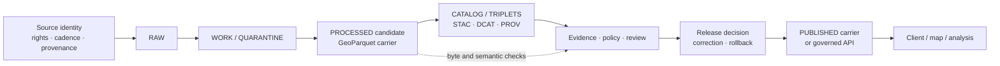

<!-- [KFM_META_BLOCK_V2]
doc_id: kfm://doc/standards-geoparquet
title: GeoParquet — KFM Repository and Conformance Boundary
type: standard
version: v2.1-draft
status: "draft; repository-grounded; upstream-currentness-refreshed; mixed-maturity; bounded-fixture-byte-proof; pyarrow-patch-successor-held; no-adoption; no-release; no-publication"
owners:
  - "@bartytime4life — verified GitHub review route through CODEOWNERS"
  - "NEEDS VERIFICATION — accountable GeoParquet, data-platform, catalog, evidence, policy, release, runtime, performance, and independent-review stewards"
created: 2026-05-14
updated: 2026-08-26
policy_label: "repository-facing; standards-guidance; geoparquet; vector-carrier; version-gated; release-gated"
owning_root: docs/
current_path: docs/standards/GEOPARQUET.md
responsibility: "Explain the upstream GeoParquet 1.1 and 2.0-release-candidate boundaries; disclose KFM's current declaration, mirror-parity, exact-toolchain, and bounded PyArrow-to-GDAL fixture-proof surfaces; preserve exact PyArrow 25.0.0 lineage; record the held 25.0.1 successor proposal; and identify the evidence required before KFM may claim version adoption, broader byte conformance, production interoperability, release, or publication."
truth_posture: "CONFIRMED current path, standards-lane placement, default CODEOWNERS route, GeoParquet 1.1.0 stable line, corrected v1.1.0+p1 package, upstream v2.0.0-rc.1 status, inactive metadata-readiness and exact-toolchain profiles, fixture-only STAC mirror assessment, exact PyArrow 25.0.0 synthetic carrier profile, bounded PyArrow-to-GDAL consumer profile, proposed ADR-0033, and published-lane scaffolding / PROPOSED PyArrow 25.0.1 only as a separately versioned successor replay, plus any accepted production profile, migration, release integration, correction, or rollback / UNKNOWN production GeoParquet payloads, readers, writers, deployed consumers, released carriers, and public publication."
evidence_repository: bartytime4life/Kansas-Frontier-Matrix
evidence_base_ref: main
evidence_base_commit: 7115f5c046d0660c65befef65f20964de79c5f2b
evidence_target_prior_blob: 467c4b5810e052de872f6368a89ee0f225591078
evidence_standards_readme_blob: a8cbe5d183448d5f0de37f8a4eacd6fcaca0d71b
evidence_directory_rules_blob: fd49a0b83e55cef52c1124281f093e263526898d
evidence_codeowners_blob: dd2a84aa514d8ecd9208bc347f90f9a2ed37dd61
evidence_adr_0029_blob: a4de0d7a96b78da59cfc499d1025e1508afd8dd9
evidence_geospatial_carrier_contract_blob: 17055a680b83a4f83834735e88aeb0569322845b
evidence_geospatial_carrier_schema_blob: b6ebec77a6e09c50b89594c4032bd40ec238f6be
evidence_geospatial_carrier_workflow_blob: f5791e0988166dbcdd5d781c690073e8d3b10389
evidence_stac_mirror_contract_blob: e5b3aabbee5a697d8e72e84f7df769882fdf76d5
evidence_stac_mirror_workflow_blob: 28bbbf731a1ffb6ba489e9dc0e0b44acb9d6e660
evidence_geoparquet_2_rc_contract_blob: 98345edd9f5262a63064b01cac57145eed2fe0e9
evidence_geoparquet_2_rc_schema_blob: 5855e1a0d9eea37520329612b595cb64befa7ea2
evidence_geoparquet_2_rc_validator_blob: 0bff4e868f0a49a4de40d020cf7e21c10bb8042f
evidence_geoparquet_2_rc_tests_blob: b2923fafb91bdf35dc1f80b60fecc73c0395f540
evidence_geoparquet_2_rc_workflow_blob: 45e25050a199cd12e777a120f6208ba50318e5fd
evidence_pyarrow_carrier_contract_blob: 5a7a009faeba903284736637edf5be5c2bbf1072
evidence_pyarrow_carrier_schema_blob: 2f9a0f57b0a2fbd9389da291fa08867edb62afe7
evidence_pyarrow_carrier_generator_blob: f79e4205f47f1b6ca68825d5a8d51ae9827e2cf3
evidence_pyarrow_carrier_validator_blob: e54762123b5b52d0e8813617bf34b8d0e620f479
evidence_pyarrow_carrier_workflow_blob: b9ffd1d1326f91b2ed7a224545b3ba1d973ec531
evidence_gdal_consumer_contract_blob: 759546ddbc1fd6e72a2adb1c1801b3b3550cec8c
evidence_gdal_consumer_workflow_blob: d0c132d7bbc45c46688c7d844ba2ad1f29aa4a0e
evidence_published_lane_readme_blob: d5aced3d0e8200fba1be2a236a561e3fd2918224
external_access_date: 2026-08-26
external_stable_line: "GeoParquet 1.1.0; corrected release package v1.1.0+p1 retains the 1.1.0 version identifier"
external_candidate_line: "GeoParquet v2.0.0-rc.1; release candidate, not final 2.0.0"
external_pyarrow_patch_line: "Apache Arrow 25.0.1; bug-fix patch proposed only as a held, separately versioned replay of the retained PyArrow 25.0.0 lane"
related:
  - ./README.md
  - ./STAC.md
  - ./COG.md
  - ./PMTILES.md
  - ../doctrine/directory-rules.md
  - ../doctrine/lifecycle-law.md
  - ../doctrine/trust-membrane.md
  - ../architecture/contract-schema-policy-split.md
  - ../adr/ADR-0029-adopt-directory-governance-standard-v2.md
  - ../adr/ADR-0033-geoparquet-version-readiness.md
  - ../../contracts/release/geospatial_carrier_readiness.md
  - ../../schemas/contracts/v1/release/geospatial_carrier_readiness.schema.json
  - ../../contracts/data/stac_geoparquet_mirror_assessment.md
  - ../../schemas/contracts/v1/data/stac_geoparquet_mirror_assessment.schema.json
  - ../../contracts/release/geoparquet_2_rc_compatibility_assessment.md
  - ../../schemas/contracts/v1/release/geoparquet_2_rc_compatibility_assessment.schema.json
  - ../../contracts/release/geoparquet_2_rc_pyarrow_carrier_probe.md
  - ../../schemas/contracts/v1/release/geoparquet_2_rc_pyarrow_carrier_probe.schema.json
  - ../../contracts/release/geoparquet_2_rc_gdal_consumer_probe.md
  - ../../data/published/geoparquet/README.md
tags: [kfm, standards, geoparquet, parquet, vector, interoperability, catalog, evidence, release]
notes:
  - "Same-path documentation reconciliation only; no contract, schema, policy, validator, fixture, workflow, data, dependency, runtime, release, deployment, or publication changes."
  - "The exact PyArrow 25.0.0 profiles, lock, workflow, receipts, carrier identities, and GDAL edge remain unchanged historical proof; 25.0.1 is not substituted into those identities."
  - "The prior page overstated KFM-wide canonical adoption while understating the current inactive synthetic implementation."
  - "The legacy document identity, created date, H1 anchor, numbered-section anchors, lifecycle boundary, and cite-or-abstain posture are retained."
  - "The unsupported GeoParquetAssetManifest name is not represented as a current repository object."
[/KFM_META_BLOCK_V2] -->

<a id="top"></a>
<a id="geoparquet--kfm-standards-reference"></a>

# GeoParquet — KFM Repository and Conformance Boundary

> **Operating rule.** GeoParquet is a geospatial table carrier. Its file structure does not create source authority, semantic meaning, evidence closure, policy approval, release authority, or public truth.


> [!IMPORTANT]
> **Human-readable standards guidance only.** Contracts define KFM object meaning, schemas define machine shape, policy decides admissibility, validators establish only their declared checks, and governed release records decide release. This page does not replace any of those authorities.

> [!CAUTION]
> **Current byte evidence is narrow and version-bound.** The repository has exact PyArrow `25.0.0` synthetic carrier generation/inspection and one PyArrow-to-GDAL `3.13.2` consumer-read edge. That fixture proof is not a full cross-engine matrix, a production dependency, source admission, migration, or release authority. Declaration-only profiles remain separate from those byte-reading profiles.

> [!WARNING]
> **Do not collapse 1.1 and 2.0.** GeoParquet 1.1 centers on the `geo` metadata layer and optional 1.1 accelerators. The 2.0 release candidate moves the storage foundation to native Parquet geospatial logical types and native spatial statistics. A version string or metadata-only `READY` result is not interoperability evidence.

| Field | Current bounded result |
|---|---|
| **Evidence snapshot** | `main@7115f5c046d0660c65befef65f20964de79c5f2b` |
| **Directory result** | **PLACE** at existing `docs/standards/GEOPARQUET.md`; accepted Directory Rules assign human-readable standards guidance to `docs/standards/` |
| **Review route** | `@bartytime4life` through current CODEOWNERS; accountable specialist stewardship and independent review remain **NEEDS VERIFICATION** |
| **Stable upstream line** | GeoParquet `1.1.0`; the corrected `v1.1.0+p1` release still uses the `1.1.0` version identifier |
| **Latest upstream candidate checked** | `v2.0.0-rc.1`; a release candidate, not final `2.0.0` |
| **KFM adoption state** | **NOT ESTABLISHED** as an accepted production format, migration, or release policy |
| **Current executable proof** | `PARTIAL / FIXTURE_ONLY`: exact PyArrow `25.0.0` generates and inspects a retained synthetic 1.1/2.0-RC pair; exact GDAL `3.13.2` reads that bounded pair. Wider engines, producer routes, CRS breadth, and pruning remain open |
| **Current version decision** | GeoParquet `1.1.0` remains the declared default; ADR-0033 remains **proposed**. PyArrow `25.0.1` is `PROPOSED SUCCESSOR / HOLD` for a separate replay, not an in-place replacement |
| **Published-data surface** | Directory scaffolding and child READMEs exist; no released GeoParquet carrier was verified |
| **Release/public effect** | None |

<a id="-quick-jump"></a>

**Quick navigation:** [Status](#0-current-repository-status-and-authority) · [Scope](#1-purpose--scope) · [Role](#2-why-geoparquet-in-kfm) · [Upstream](#3-external-standard-alignment-geoparquet-110) · [Implementation](#4-current-repository-implementation) · [1.1 profile](#4-kfm-profile-requirements) · [Mirror](#6-stac-geoparquet-mirror-assessment) · [2.0 RC](#7-geoparquet-20-rc-readiness-packet) · [Lifecycle](#7-lifecycle--promotion-gates) · [Validation](#8-validation-matrix) · [Policy](#9-policy-rights--sensitivity) · [Anti-patterns](#10-anti-patterns) · [Example](#11-illustrative-profile-snippet) · [Tooling](#12-tooling) · [Transition](#13-note-on-geoparquet-20) · [Open work](#14-open-questions) · [References](#15-related-docs--sources)

---

<a id="0-current-repository-status-and-authority"></a>

## 0. Current repository status and authority

### 0.1 Evidence boundary

This revision reconciles the target against repository bytes at the evidence snapshot in the metadata block and official upstream release material checked on 2026-08-26. Repository presence proves tracked bytes and bounded executable behavior at that revision. Exact hosted results cited in issue #2907 remain result-specific evidence; neither tracked bytes nor those runs prove production data, current consumers, deployed services, accepted stewardship, required-check status, release, or publication.

| Surface | CONFIRMED current state | What it does **not** establish |
|---|---|---|
| [`docs/standards/GEOPARQUET.md`](./GEOPARQUET.md) | Existing standards-lane page, modernized in place | KFM adoption, byte conformance, or release |
| [`docs/standards/README.md`](./README.md) | Defines this lane as human-readable standards and interoperability guidance | Contract, schema, policy, or release authority |
| [`GeospatialCarrierReadinessCheck`](../../contracts/release/geospatial_carrier_readiness.md) and companions | `PROPOSED_INACTIVE` metadata preflight with `READY`, `HOLD`, and `ERROR` outcomes | Reading Parquet bytes, source resolution, policy, promotion, or release |
| [`StacGeoParquetMirrorAssessment`](../../contracts/data/stac_geoparquet_mirror_assessment.md) and companions | Proposed, fixture-only parity over declared STAC and mirror projections | Existence or validity of STAC objects or GeoParquet bytes |
| [`GeoParquet 2.0 RC Compatibility Assessment`](../../contracts/release/geoparquet_2_rc_compatibility_assessment.md) and companions | `PROPOSED_INACTIVE` exact-toolchain declaration packet for later 2.0-RC byte probes | Installed tools, carrier generation, cross-engine compatibility, or migration |
| [`GeoParquet 2.0 RC PyArrow Carrier Probe`](../../contracts/release/geoparquet_2_rc_pyarrow_carrier_probe.md) and companions | `PROPOSED_INACTIVE / PARTIAL / FIXTURE_ONLY` exact PyArrow `25.0.0` producer/inspector over two synthetic carriers | Another PyArrow version, broad engine support, production dependency, source admission, or migration |
| [`GeoParquet 2.0 RC GDAL Consumer Probe`](../../contracts/release/geoparquet_2_rc_gdal_consumer_probe.md) and companions | `PROPOSED_INACTIVE / PARTIAL_OR_HOLD / FIXTURE_ONLY` PyArrow `25.0.0` producer to GDAL `3.13.2` consumer-read edge | GDAL production, the remaining engine matrix, pruning, adoption, or release |
| [`ADR-0033`](../adr/ADR-0033-geoparquet-version-readiness.md) | Proposed version-readiness decision | Accepted default, approved dual evaluation, or release authority |
| [`data/published/geoparquet/`](../../data/published/geoparquet/README.md) | Draft published-carrier lane with domain child READMEs | Released files, valid manifests, governed downloads, or publication |
| `GeoParquetAssetManifest` | No separate repository object with this exact name was found in the bounded search | Permission to invent a contract, schema, or parallel authority |

### 0.2 Authority map

| Question | Owning authority | Role of this page |
|---|---|---|
| What GeoParquet requires | The pinned upstream specification and release | Record the checked version boundary; do not redefine it |
| Whether KFM adopts a GeoParquet version | Accepted ADRs and accountable format-governance decisions | Distinguish declared, proposed, and accepted state |
| What a KFM assessment object means | The applicable contract under `contracts/` | Summarize and link; do not redefine semantics |
| What object shape is valid | The applicable schema under `schemas/contracts/v1/` | Cite the machine shape; do not duplicate it |
| What a validator checks | Validator code, fixtures, tests, workflow, and exact run evidence | State the bounded proof and non-effects |
| Whether source records support a carrier | Source identity, catalog, provenance, EvidenceBundle, and review authorities | Require resolution; do not infer it from bytes |
| What is admissible or public-safe | `policy/` plus accountable review | Explain fail-closed obligations; do not execute policy |
| Whether a carrier may be released | Governed release, correction, and rollback records | Explain closure; never approve release |
| Whether a client may read a carrier | Release-approved distribution and governed delivery configuration | Do not infer public access from a repository path |

No row substitutes for another.

<p align="right"><a href="#top">Back to top</a></p>

---

<a id="1-purpose--scope"></a>

## 1. Purpose & scope

### 1.1 Purpose

This page:

1. records the checked GeoParquet `1.1.0` stable line and `2.0.0-rc.1` candidate boundary;
2. explains KFM's intended use of GeoParquet as a processed or released vector carrier without claiming accepted adoption;
3. reconciles the current metadata-readiness, STAC-mirror, and 2.0-RC assessment packets;
4. separates declaration validation from bounded fixture-byte proof, broader interoperability, evidence, policy, release, and publication;
5. preserves exact PyArrow `25.0.0` proof lineage while recording `25.0.1` only as a held, separately versioned successor replay;
6. defines a finite evidence ladder for future implementation; and
7. preserves KFM lifecycle, correction, rollback, and public-path boundaries.

### 1.2 In scope

- GeoParquet format-version facts material to KFM.
- The current inactive KFM 1.1 metadata-readiness profile.
- The current fixture-only STAC GeoParquet mirror assessment.
- The current inactive 2.0-RC exact-toolchain readiness packet.
- The current exact PyArrow `25.0.0` synthetic carrier and bounded GDAL consumer probes.
- The non-adopting PyArrow `25.0.1` patch-delta decision.
- Required evidence for real carrier validation, cross-engine testing, catalog closure, policy, review, release, and rollback.
- Fail-closed version and public-exposure behavior.

### 1.3 Out of scope

- Accepting ADR-0033 or adopting a GeoParquet production version.
- Defining domain data semantics, field dictionaries, units, or enumerations.
- Creating `GeoParquetAssetManifest` or any other contract/schema family.
- Generating, migrating, publishing, or deleting GeoParquet files.
- Installing or admitting GDAL, DuckDB, Sedona, PyArrow, GeoArrow, or another dependency.
- Rewriting the exact PyArrow `25.0.0` profile, schema, lock, workflow, receipts, or prior carrier identities in place.
- Activating a source, catalog mirror, download endpoint, map layer, API route, release, or publication.
- Treating generic Parquet tuning guidance as a universal KFM requirement.

### 1.4 Normative language

`MUST`, `SHOULD`, and similar terms in an upstream-summary row report the cited upstream specification. KFM-specific normative language is binding only when an accepted decision, contract, schema, active policy, or another authorized control makes it binding. Unattributed normative wording in a draft standards page is guidance or proposal, not policy.

<p align="right"><a href="#top">Back to top</a></p>

---

<a id="2-why-geoparquet-in-kfm"></a>

## 2. Why GeoParquet in KFM

GeoParquet combines Parquet's columnar table model with geospatial column metadata or native geospatial logical types, depending on the format version. It can support analytics, exchange, catalog distributions, reproducible derivatives, and released downloads without making the carrier itself authoritative.

KFM's current **inactive** carrier-readiness contract describes GeoParquet `1.1.0` as the candidate canonical vector carrier. That is a declared design posture, not an accepted KFM-wide production decision. Until version governance, byte conformance, consumer compatibility, source/evidence closure, and release proof exist, a GeoParquet file remains only a candidate carrier.

### 2.1 Carrier, meaning, and authority separation

| Layer | Owns | Does not own |
|---|---|---|
| GeoParquet bytes | Physical geospatial table representation | Source authority, policy, review, or release |
| Semantic contract | Field meaning, invariants, time, source role, and relationships | Parquet encoding or release approval |
| Machine schema/profile | Declared KFM assessment shape | Real byte correctness unless a byte validator reads the file |
| Catalog/provenance | Identity, discovery, lineage, and distribution references | Policy approval or release |
| EvidenceBundle | Support for consequential claims | File-format conformance by itself |
| Policy/review | Allowed, denied, held, redacted, restricted, or abstained outcomes | Byte identity or source provenance |
| Release/correction/rollback | Governed exposure and reversible public state | Upstream source truth |
| UI, map, notebook, or AI | Interpretation and presentation | Sovereign truth or publication authority |

### 2.2 Intended flow


```mermaid
flowchart LR
  SRC["Source identity<br/>rights · cadence · provenance"]
  RAW["RAW"]
  WORK["WORK / QUARANTINE"]
  GP["PROCESSED candidate<br/>GeoParquet carrier"]
  CAT["CATALOG / TRIPLETS<br/>STAC · DCAT · PROV"]
  GOV["Evidence · policy · review"]
  REL["Release decision<br/>correction · rollback"]
  PUB["PUBLISHED carrier<br/>or governed API"]
  UI["Client / map / analysis"]

  SRC --> RAW --> WORK --> GP --> CAT
  CAT --> GOV --> REL --> PUB --> UI
  GP -. byte and semantic checks .-> GOV
```

The diagram is a responsibility flow, not proof that every stage is implemented for GeoParquet today.

<p align="right"><a href="#top">Back to top</a></p>

---

<a id="3-external-standard-alignment-geoparquet-110"></a>

## 3. External standard alignment and version boundary

### 3.1 Stable 1.1 line

The checked stable line is GeoParquet `1.1.0`. Upstream also publishes a corrected package tagged `v1.1.0+p1`; producers and consumers still identify files as version `1.1.0`.

| 1.1 property | Upstream boundary | KFM current posture |
|---|---|---|
| Foundation | Parquet plus file-level `geo` metadata | Declared baseline in an inactive metadata profile |
| Geometry encoding | WKB and optional 1.1 native encodings based on GeoArrow | The retained exact PyArrow `25.0.0` fixture proves one WKB carrier; optional GeoArrow encodings and production bytes remain unverified |
| Bbox covering | Optional covering-column mechanism for spatial pruning | Advisory in the current KFM metadata preflight, not a universal hard gate |
| CRS | GeoParquet metadata carries the declared CRS semantics | The retained synthetic WKB carrier and bounded GDAL read preserve one OGC:CRS84 case; projected, conflicting, missing, and production CRS cases remain unproved |
| File naming | `.parquet` is the upstream recommendation | Current inactive KFM profile requires a declared `.parquet` filename |
| Media type | Upstream publishes a Parquet media-type recommendation | Current inactive KFM profile declares `application/vnd.apache.parquet` |
| Compatibility correction | `v1.1.0+p1` removes a conflicting group-field requirement without changing the `1.1.0` identifier | KFM must pin the corrected specification package when byte tests are added |

### 3.2 2.0 release-candidate line

The latest checked upstream release is `v2.0.0-rc.1`. It is explicitly a release candidate and may still change before final `2.0.0`.

| 2.0-RC property | Candidate boundary | KFM current posture |
|---|---|---|
| Foundation | Native Parquet `GEOMETRY` or `GEOGRAPHY` logical types | Exact PyArrow `25.0.0` fixture proof covers one `GEOMETRY` case; `GEOGRAPHY` and broader producers/consumers remain unproved |
| Physical representation | Native logical type over Parquet binary storage with WKB encoding | Verified for the retained synthetic `GEOMETRY` / `BYTE_ARRAY` / WKB carrier only |
| Spatial statistics | Native row-group geospatial statistics | Required by the declaration packet; no pruning benchmark executed |
| `geo` metadata | Optional explicit layer that must agree with Parquet-level metadata | Equivalence is recorded for the retained OGC:CRS84 fixture only |
| CRS authority | Native Parquet CRS property is the source of truth; inline GeoParquet CRS remains explicit when present | The PyArrow-to-GDAL edge exercises one same-CRS consumer read; conflict and projected round trips remain open |
| 1.1 covering column | Removed from the 2.0 model in favor of native statistics | The packet rejects carrying a universal 1.1 covering requirement into 2.0 |
| Release maturity | Candidate, not final | Production use and default change remain **HOLD** |

### 3.3 KFM version-state separation

| State | Current result |
|---|---|
| Upstream stable version known | **CONFIRMED** — `1.1.0`, corrected package `v1.1.0+p1` |
| Upstream candidate known | **CONFIRMED** — `v2.0.0-rc.1` |
| KFM declared metadata baseline | **CONFIRMED** — `1.1.0` inside a `PROPOSED_INACTIVE` profile |
| Accepted KFM production default | **NOT ESTABLISHED** |
| 1.1 carrier-byte conformance | **PARTIAL / FIXTURE_ONLY** — one exact PyArrow `25.0.0` synthetic WKB carrier plus bounded GDAL consumer read |
| 2.0-RC carrier-byte compatibility | **PARTIAL / FIXTURE_ONLY** — one exact PyArrow `25.0.0` `GEOMETRY` carrier plus bounded GDAL consumer read |
| Production migration or dual-read window | **NOT ESTABLISHED** |
| Release/publication authority | **NONE** |

### 3.4 PyArrow patch lineage and successor decision

The current carrier evidence is bound to an exact producer version and artifact. A patch release does not retroactively change that evidence.

| Line | Immutable identity inspected | Current KFM disposition |
|---|---|---|
| Retained proof | PyArrow `25.0.0`; `pyarrow-25.0.0-cp312-cp312-manylinux_2_28_x86_64.whl`; SHA-256 `5d1dbf24e151042f2fa3c129563f65d66674128868496fb008c4272b16bdf778` | **CONFIRMED historical exact proof.** Keep the existing profile `v1`, schema constants, lock, generator, validator, workflows, receipts, and carrier bindings unchanged. |
| Patch candidate | Apache Arrow `25.0.1`; source commit `beccec0d0c451b7aa3e4530416ac431b3c035c69`; `pyarrow-25.0.1-cp312-cp312-manylinux_2_28_x86_64.whl`; SHA-256 `5389cdf79447ed1515c9e31620e6e1e2302249564d603f2ad727d4f6d313e4c3` | **PROPOSED SUCCESSOR / HOLD.** The patch is a candidate for a separate versioned replay, not selected, admitted, supported, or substituted into the retained proof. |

Apache Arrow describes `25.0.1` as a bug-fix patch. Its release notes include aarch64 SVE Parquet decoding and memory-allocation crash fixes plus unrelated Python changes; they make no GeoParquet-conformance claim. KFM's retained wheel and hosted evidence are for manylinux x86-64, so that evidence cannot prove the aarch64 fixes.

A later successor replay must use a new profile/version and separate lock, regenerate fresh manifests and carrier digests from the same public-safe synthetic input, compare bounded semantics with the retained `25.0.0` result, rerun the exact GDAL edge, and emit its own receipt and review handoff. Any aarch64 claim requires a separately authenticated aarch64 artifact and execution lane. Until then, `25.0.1` remains `HOLD`.

This patch decision does not admit PyArrow or a data source, change the GeoParquet `1.1.0` default, accept ADR-0033, migrate data, or authorize release, deployment, publication, or public use.

<p align="right"><a href="#top">Back to top</a></p>

---

<a id="4-current-repository-implementation"></a>

## 4. Current repository implementation

KFM currently implements three declaration or metadata-assessment surfaces and two bounded fixture-byte probe surfaces. Each remains narrower than production interoperability.

| Surface | Profile/status | Inputs actually inspected | Finite outcomes | Boundary |
|---|---|---|---|---|
| [`GeospatialCarrierReadinessCheck`](../../contracts/release/geospatial_carrier_readiness.md) | `kfm.geospatial-carrier-readiness.v1.1` / `PROPOSED_INACTIVE` | Declared carrier metadata and bindings | `READY`, `HOLD`, `ERROR` | No TIFF, Parquet, or Protobuf bytes; no source, policy, release, or publication |
| [`StacGeoParquetMirrorAssessment`](../../contracts/data/stac_geoparquet_mirror_assessment.md) | `v0.1.0` / proposed, experimental, fixture-only | Declared STAC Item projections and declared mirror rows | `PASS`, `ABSTAIN`, `DENY`, `ERROR` | No STAC fetch, Parquet access, catalog mutation, or evidence resolution |
| [`GeoParquet 2.0 RC Compatibility Assessment`](../../contracts/release/geoparquet_2_rc_compatibility_assessment.md) | `kfm.geoparquet-2-rc-compatibility-assessment.v2` / `PROPOSED_INACTIVE` | Exact declared tools, artifacts, evidence refs, and probe statuses | `READY`, `HOLD`, `ERROR` | `READY` means ready to run byte probes; it is not a compatibility result |
| [`GeoParquet 2.0 RC PyArrow Carrier Probe`](../../contracts/release/geoparquet_2_rc_pyarrow_carrier_probe.md) | `kfm.geoparquet-2-rc-pyarrow-carrier-probe.v1` / `PROPOSED_INACTIVE / PARTIAL / FIXTURE_ONLY` | Two generated synthetic carriers plus exact PyArrow `25.0.0` footer, metadata, row-group, identity, WKB, and digest observations | `PARTIAL`, `ERROR` | One producer/inspector version and platform only; no production dependency or broad engine support |
| [`GeoParquet 2.0 RC GDAL Consumer Probe`](../../contracts/release/geoparquet_2_rc_gdal_consumer_probe.md) | `kfm.geoparquet-2-rc-gdal-consumer-probe.v1` / `PROPOSED_INACTIVE / PARTIAL_OR_HOLD / FIXTURE_ONLY` | The retained carrier pair consumed by exact GDAL `3.13.2` | `PARTIAL`, `HOLD`, `FAIL`, `ERROR` | One consumer-read edge only; no GDAL producer route, wider engine matrix, adoption, or release |

### 4.1 Companion implementation

The five surfaces have the repository-local companions required by their bounded scopes. Their existence establishes deterministic synthetic implementation at the pinned revision. It does not convert a proposed profile into adopted policy, admit a dependency, or authenticate every prior hosted result as exact-current-`main` proof.

### 4.2 What is not currently proved

The inspected repository evidence does not establish:

- a reviewed, durable canonical carrier corpus beyond the reproducible synthetic workflow artifacts;
- a producer or reader/query-engine matrix beyond the exact PyArrow `25.0.0` producer/inspector and GDAL `3.13.2` consumer edge;
- projected or conflicting CRS behavior, `GEOGRAPHY`, unknown-metadata rewrite preservation, or native geospatial row-group pruning;
- source-to-carrier semantic parity;
- a complete production-consumer inventory;
- an accepted version-readiness decision;
- a release manifest binding a real GeoParquet carrier;
- a correction, withdrawal, or rollback drill; or
- a governed public download or runtime consumer.

<p align="right"><a href="#top">Back to top</a></p>

---

<a id="4-kfm-profile-requirements"></a>
<a id="5-object-families--contracts"></a>

## 5. Current KFM 1.1 metadata-readiness profile

The current GeoParquet lane in `GeospatialCarrierReadinessCheck` is an **inactive declaration preflight**. It is the closest executable representation of the old page's KFM profile, but it does not read the candidate artifact.

### 5.1 Declared carrier fields

| Field group | Current declared requirement | Evidence limit |
|---|---|---|
| Version and identity | `format_version`, immutable artifact ref, digest shape, `.parquet` filename, Parquet media type | Does not resolve bytes or recompute digest |
| Geometry | One named geometry column, root-column declaration, encoding, and non-empty geometry-type list | Does not inspect the Parquet schema or geometry payloads |
| CRS | `crs_format=PROJJSON` and `explicit_crs=true` | Does not parse or round-trip the CRS |
| Missing values | `null_policy=NULL_ONLY` | Does not scan values for NaN or sentinels |
| Metadata compatibility | Unknown metadata declared preserved | Does not execute a read/write round trip |
| Numeric units | Numeric-unit coverage declared | Does not inspect field names, unit metadata, or domain contracts |
| Determinism | Stable row grouping and deterministic ordering declared | Does not compare two generated files |
| Spatial pruning | Bbox covering declared; absence is advisory in 1.1 | Does not inspect statistics or measure pruning |
| Bindings | SourceDescriptor, RunReceipt, and STAC Item refs are present | Does not resolve or authenticate those objects |
| Governance | Every authority/release/public-use effect is fixed `false`; release ref is `null` | Cannot promote, release, or publish |

### 5.2 Dataset-specific layout profile

The inactive schema requires an inspectable layout declaration rather than one universal tuning constant:

- compression codec;
- ordering strategy, version, and parameter digest;
- row-group target rows and target bytes;
- partition strategy, version, and parameter digest;
- writer implementation, version, and parameter digest; and
- benchmark reference and result digest.

The current contract deliberately does **not** mandate one row-group size, Hilbert ordering, partition grid, writer, or compression codec for every dataset. Those choices require dataset-specific evidence.

### 5.3 Outcome semantics

| Outcome | Meaning | Non-effect |
|---|---|---|
| `READY` | Declared metadata satisfies the inactive preflight | Not byte-conformant, adopted, releasable, or public-safe |
| `HOLD` | Declaration is well formed but misses one or more readiness requirements | No lifecycle transition |
| `ERROR` | Declaration is malformed, internally unsafe, or violates a fail-closed integrity boundary | No automatic repair or authority |

### 5.4 Object-family boundary

The current repository uses specific assessment objects named above. The earlier page's `GeoParquetAssetManifest` name is not backed by a separate contract or schema in the bounded search. Any future canonical carrier-manifest family requires placement, semantics, schema, compatibility, fixtures, validation, ownership, and release integration; this page cannot create it by naming it.

### 5.5 Identity domains

Keep these identities distinct:

| Identity | Subject |
|---|---|
| Artifact reference | One logical candidate or released artifact record |
| Byte digest | Exact GeoParquet file bytes |
| Specification or parameter digest | Exact admitted build/profile value |
| Source reference | Upstream source identity |
| Run reference | One transformation execution |
| Evidence reference or bundle reference | Claim support |
| Catalog identity | Discovery projection |
| Release identity | Governed release transition |
| Correction or withdrawal identity | Post-release change |

The current executable GeoParquet-adjacent schemas use `sha256:<64-lowercase-hex>` for artifact and parameter digests. The prior page's `jcs:sha256:<hex>` examples must not be treated as implemented GeoParquet digest grammar without a separately accepted migration.

<p align="right"><a href="#top">Back to top</a></p>

---

<a id="6-stac-geoparquet-mirror-assessment"></a>

## 6. STAC GeoParquet mirror assessment

`StacGeoParquetMirrorAssessment` evaluates parity between two **declared projections**:

1. a declared set of STAC Item comparison fields; and
2. a declared set of rows representing a STAC GeoParquet collection mirror.

It compares collection/item identity, ordered extension identifiers, geometry and bbox digests, links, assets, non-temporal properties, property names, and temporal shape.

| Outcome | Meaning | Explicit non-claim |
|---|---|---|
| `PASS` / `PARITY_CONFIRMED` | Complete declared projections match with no extras | Does not prove source STAC objects or mirror bytes |
| `ABSTAIN` / `PARTIAL_SAMPLE` | Supplied sample matches but is not collection-complete | Does not claim collection-wide parity |
| `DENY` / conflict | Missing, extra, divergent, duplicated, noncanonical, or malformed declarations | Does not mutate the catalog |
| `ERROR` | Input is unsafe, malformed, or explicitly failed | Does not create a policy or release decision |

The assessment does not open Parquet or Arrow, decode WKB or GeoArrow, fetch STAC, resolve a catalog identity, establish rights, or approve a mirror. Operational use needs a separate byte reader, authoritative source resolution, catalog closure, evidence, policy, review, release, correction, and rollback.

<p align="right"><a href="#top">Back to top</a></p>

---

<a id="7-geoparquet-20-rc-readiness-packet"></a>

## 7. GeoParquet 2.0-RC readiness packet

The inactive `GeoParquet 2.0 RC Compatibility Assessment` records whether an exact synthetic toolchain packet is structurally ready for carrier-byte probes against `2.0.0-rc.1`. The later PyArrow and GDAL profiles execute only two bounded lanes from that wider matrix; they do not rewrite the original declaration packet.

### 7.1 Current declared matrix

| Lane | Declared version | Intended later probe role | Current proof |
|---|---|---|---|
| GDAL | `3.13.2` | Producer, consumer, native type, CRS, statistics, metadata, and legacy 1.1 checks | **PARTIAL / FIXTURE_ONLY** for one PyArrow-produced consumer-read edge; producer and wider checks remain open |
| DuckDB | `1.5.5` with `spatial@1.5.5` | Read, query, pruning, CRS, metadata, and legacy 1.1 checks | Declaration only |
| SedonaSpark | `1.9.0` with pinned Spark/Java/Scala/parquet-java context | Distributed read/write and compatibility probes | Declaration only |
| SedonaDB | `0.4.0` | Separate single-node read/write probes | Declaration only |
| PyArrow producer/inspector | `25.0.0` | Synthetic carrier generation plus footer logical-type, metadata, identity, WKB, null, digest, and row-group-shape inspection | **PARTIAL / FIXTURE_ONLY** for the retained two-carrier pair |

Version recognition is not support evidence. A source tag is not package-integrity proof. The declared packet keeps tool artifacts, transitive dependencies, probe results, and evidence identities distinct.

### 7.2 Finite outcomes

- `READY` — the declaration packet is complete and synthetic statuses pass; **byte probes may begin**.
- `HOLD` — required probes are pending or failed, a tool remains intentionally unpinned, or an unsupported assumption does not close.
- `ERROR` — shape, version, source pin, transitive dependency, digest, evidence identity, format expectation, governance boundary, or declared result is invalid.

No outcome changes KFM's declared 1.1 baseline, accepts ADR-0033, admits a production tool or source, migrates data, or authorizes release. The byte-probe workflows create only bounded synthetic carrier artifacts for their declared evidence lanes.

<p align="right"><a href="#top">Back to top</a></p>

---

<a id="6-pipeline-placement"></a>
<a id="7-lifecycle--promotion-gates"></a>

## 8. Lifecycle and release boundary

A file format does not determine lifecycle state. A `.parquet` file may be source-native RAW input, a WORK candidate, a quarantined artifact, a PROCESSED GeoParquet candidate, or a released PUBLISHED carrier depending on its governed state and owning lane.

KFM's lifecycle shorthand remains:

```text
RAW -> WORK / QUARANTINE -> PROCESSED -> CATALOG / TRIPLETS -> PUBLISHED
```

A file path, extension, valid footer, metadata block, assessment result, digest, workflow, pull request, or merge does not move an artifact through that lifecycle by itself.

| Transition | GeoParquet-specific evidence needed | Fail-closed result |
|---|---|---|
| Candidate admission | Source identity, rights, cadence, retrieval record, payload identity | Reject or quarantine the candidate |
| RAW to WORK | Reproducible transform plan, pinned inputs and tools, domain mapping, sensitivity controls | Keep in RAW or route to QUARANTINE |
| WORK to PROCESSED | Real byte validation, geometry/CRS/value checks, semantic parity, deterministic output identity | Keep in WORK; emit finite failure |
| PROCESSED to CATALOG/TRIPLETS | Catalog identity, STAC/DCAT/PROV closure, source/evidence refs, correction lineage | Hold at PROCESSED |
| CATALOG/TRIPLETS to PUBLISHED | Policy, rights, sensitivity, accountable review, immutable release binding, correction and rollback | Hold at catalog; no public edge |
| Published correction | New evidence, corrected carrier, supersession/withdrawal, cache and consumer handling | Preserve prior history; never mutate silently |

### 8.1 Published-lane caution

`data/published/geoparquet/` is a draft placement boundary for release-linked carriers. Directory presence or a child README is not a release record. A real artifact may enter that lane only after the governing release process authorizes the exact bytes and audience.

### 8.2 Public-path boundary

Ordinary public clients should consume governed API responses or explicitly released public-safe artifacts. Direct access to processed candidates, catalog internals, source stores, proof stores, or unrestricted carrier bytes is not the normal public path.

<p align="right"><a href="#top">Back to top</a></p>

---

<a id="8-validation-matrix"></a>

## 9. Validation and evidence maturity

### 9.1 Maturity ladder

| Level | Capability | Current posture |
|---:|---|---|
| 0 | Repository-grounded human standards boundary | **CONFIRMED — this page** |
| 1 | Synthetic 1.1 metadata readiness | **CONFIRMED checked in / PROPOSED_INACTIVE** |
| 2 | Synthetic declared STAC-mirror parity | **CONFIRMED checked in / proposed fixture-only** |
| 3 | Synthetic 2.0-RC exact-toolchain readiness | **CONFIRMED checked in / PROPOSED_INACTIVE** |
| 4 | Synthetic 1.1 and 2.0-RC carrier-byte generation, footer inspection, and focused negatives | **PARTIAL / FIXTURE_ONLY** at exact PyArrow `25.0.0` |
| 5 | Cross-engine 1.1 and 2.0-RC round trip, query, CRS, metadata, and pruning evidence | **PARTIAL / FIXTURE_ONLY** for one PyArrow `25.0.0` producer to GDAL `3.13.2` consumer-read edge; the matrix remains incomplete |
| 6 | Source-to-carrier semantic parity, catalog, evidence, rights, sensitivity, policy, and review closure | **NOT ESTABLISHED end to end** |
| 7 | Governed release, serving, correction, withdrawal, rollback, and observed consumers | **NOT ESTABLISHED** |

### 9.2 Validation matrix

| Validation layer | Checks | Current state | What passing would not prove |
|---|---|---|---|
| Markdown/documentation | Structure, anchors, links, truth labels, repository references | This revision's changed area | Format conformance or adoption |
| Metadata readiness | Declared 1.1 profile and layout fields | Implemented synthetically | Actual bytes |
| STAC mirror parity | Declared source/mirror projections | Implemented synthetically | STAC or mirror existence |
| 2.0-RC toolchain packet | Exact declared tools, artifacts, statuses, and non-effects | Implemented synthetically | Installed or functioning tools |
| 1.1 and 2.0-RC byte conformance | Footer, `geo` metadata, native logical type, WKB, bounded CRS, row-group shape, values, and digests | Partial for the exact two-carrier PyArrow `25.0.0` fixture pair | Production semantics, broader versions/platforms, source authority, or release |
| Cross-engine interoperability | Write/read/round trip/query/statistics/pruning/unknown metadata | Partial for one exact GDAL `3.13.2` consumer-read edge | Wider engine support, source authority, or policy |
| Semantic and source parity | Contracts, field meaning, time, units, source roles, evidence | Missing end to end | Public safety without policy/review |
| Release and serving | Immutable bytes, review, policy, Range/download behavior, correction, rollback | Missing | Future correctness without monitoring |

### 9.3 Checked-in deterministic commands

The repository workflows currently run these focused commands for the synthetic profiles:

```bash
python -m pytest -q tests/release/test_geospatial_carrier_readiness.py
python tools/validators/release/validate_geospatial_carrier_readiness.py --cases

python -m unittest -v tests.validators.test_validate_stac_geoparquet_mirror_assessment
python tools/validators/catalog/validate_stac_geoparquet_mirror_assessment.py --fixtures

python -m pytest -q tests/release/test_geoparquet_2_rc_compatibility_assessment.py
python tools/validators/release/validate_geoparquet_2_rc_compatibility_assessment.py --cases
```

The exact PyArrow and GDAL probe workflows add locked package installation, carrier generation, byte validation, focused negative tests, and the bounded GDAL consumer run. Those hosted lanes are version-, artifact-, platform-, and exact-head-specific; they do not replace the missing wider engine, producer, CRS, pruning, source, policy, or release layers.

### 9.4 Minimum future byte corpus

A dependency-closed byte-validation slice should include deterministic, rights-safe positive and negative carriers covering:

- corrected GeoParquet 1.1 WKB;
- any accepted 1.1 GeoArrow encoding;
- optional bbox covering present and absent;
- explicit CRS, unknown CRS, malformed CRS, and round-trip equivalence;
- geometry-type declarations that agree and disagree with payloads;
- nulls, NaN, sentinels, and domain-invalid values;
- unknown metadata preservation;
- stable ordering and row-group layout;
- malformed footer, truncated file, duplicate/conflicting metadata, and hostile nesting;
- 2.0-RC native `GEOMETRY` and `GEOGRAPHY` cases if dual evaluation is authorized; and
- legacy 1.1 readability after any 2.x tooling is introduced.

Every fixture must state what it proves and what it does not prove.

<p align="right"><a href="#top">Back to top</a></p>

---

<a id="9-policy-rights--sensitivity"></a>

## 10. Policy, rights, and sensitivity

GeoParquet is portable and can expose many records efficiently. That makes rights, precision, joins, and downstream reuse material release concerns.

Fail closed when:

- upstream rights or allowed redistribution are unresolved;
- a source, transform, or evidence reference cannot be resolved;
- precise locations would expose rare species, archaeology, infrastructure, living people, land/title detail, or another protected subject;
- aggregation can be reversed through low counts, temporal narrowing, auxiliary joins, or repeated releases;
- domain meaning, units, time semantics, uncertainty, or source role are missing;
- a declared digest cannot be reconciled with the candidate bytes;
- a required review or policy outcome is absent, stale, or contradictory;
- a release lacks correction, withdrawal, and rollback handling; or
- the proposed public path bypasses governed delivery.

Generalization, redaction, aggregation, or partitioning is not automatically sufficient. The released carrier and its indexes, statistics, metadata, filenames, bounds, partitions, and auxiliary artifacts must all satisfy the same audience and sensitivity posture.

<p align="right"><a href="#top">Back to top</a></p>

---

<a id="10-anti-patterns"></a>

## 11. Anti-patterns

Reviewers should reject changes that:

- cite this page as proof that KFM has adopted GeoParquet `1.1.0` or `2.x`;
- call metadata-only `READY` a carrier-conformance result;
- call mirror `PASS` proof that STAC objects or GeoParquet bytes exist;
- call 2.0-RC `READY` cross-engine compatibility or migration approval;
- treat `data/published/geoparquet/` placement as release authority;
- invent `GeoParquetAssetManifest` semantics or schema from the old page's prose;
- copy proposal-era `jcs:sha256:<hex>` examples into current GeoParquet assessment objects instead of their implemented `sha256:<hex>` grammar;
- require one row-group size, spatial order, partition grid, writer, or codec for every dataset without benchmark evidence;
- carry the 1.1 bbox-covering assumption into 2.0 as a universal requirement;
- silently accept an unknown or unsupported format version;
- use a version tag without immutable tool and artifact identity;
- infer source truth, rights, sensitivity clearance, or review from a valid Parquet footer;
- expose processed or internal GeoParquet directly to ordinary public clients;
- replace nulls with undocumented sentinels or conceal domain-invalid values;
- mutate a released carrier in place instead of issuing a traceable correction; or
- treat maps, notebooks, tiles, AI summaries, or query results as evidence beyond their resolved support.

<p align="right"><a href="#top">Back to top</a></p>

---

<a id="11-illustrative-profile-snippet"></a>

## 12. Illustrative declaration fragment

The fragment below illustrates the current **metadata-readiness declaration**, not a complete schema-valid object and not GeoParquet file metadata.

```jsonc
{
  "carrier_kind": "GEOPARQUET",
  "carrier": {
    "format_version": "1.1.0",
    "geometry_column": "geometry",
    "root_geometry_column": true,
    "encoding": "WKB",
    "crs_format": "PROJJSON",
    "explicit_crs": true,
    "geometry_types": ["MultiPolygon"],
    "stable_row_grouping": true,
    "deterministic_ordering": true,
    "null_policy": "NULL_ONLY",
    "bbox_covering": true,
    "unknown_metadata_preserved": true,
    "numeric_unit_coverage": true,
    "layout_profile": {
      "profile_id": "kfm.geoparquet-layout.example-v1",
      "compression": "ZSTD",
      "ordering_strategy": "PRIMARY_KEY",
      "ordering_version": "example-v1",
      "row_group_target_rows": 50000,
      "row_group_target_bytes": 134217728,
      "partition_strategy": "NONE",
      "writer_implementation": "example-only",
      "writer_version": "0.0.0",
      "benchmark_ref": "kfm://benchmark/example"
    }
  }
}
```

The omitted digests, artifact bindings, source/run/STAC references, and governance fields are required by the actual schema. The values above are illustrative and must not be copied into a production profile without dataset-specific evidence.

<p align="right"><a href="#top">Back to top</a></p>

---

<a id="12-tooling"></a>

## 13. Tooling boundary

### 13.1 Current repository tooling

KFM currently has Python validators for the three declaration/metadata assessment surfaces and the two bounded byte-probe surfaces. Their checked-in workflows, according to each profile:

- run with `KFM_NO_NETWORK=1`;
- use read-only `contents` permission;
- install the repository's declared test dependencies or the profile's exact locked artifacts;
- execute focused fixtures, carrier generation/inspection, consumer reads, and tests;
- verify a generated authoring receipt; and
- record explicit non-effects.

Only the exact PyArrow `25.0.0` and GDAL `3.13.2` lanes read the generated carrier bytes. They do not install or execute the remaining proposed interoperability matrix.

### 13.2 External tools

Potential byte-level tools include GeoParquet-specific validators, GDAL/OGR, PyArrow, DuckDB Spatial, SedonaSpark, SedonaDB, and independent Parquet footer inspection. Tool names and documentation are discovery evidence only. Before a tool enters a trust-bearing KFM path, pin its source and package artifact, inspect transitive dependencies and licenses, use a rights-safe fixture corpus, run without ambient credentials, and preserve exact commands and output digests.

### 13.3 Required tool-result separation

| Result | Permitted claim |
|---|---|
| File opens | The selected tool parsed the selected bytes |
| Metadata schema passes | The metadata matches the checked schema version |
| Geometry decodes | The selected geometry payload decoded under the selected tool |
| Cross-engine round trip passes | The tested engines preserved the tested semantics |
| Spatial pruning is observed | The tested query used the tested statistics/layout |
| Policy allows | The named policy bundle allowed the named audience and artifact |
| Release is approved | The named release authority approved the exact immutable bytes |

A stronger claim requires stronger evidence.

<p align="right"><a href="#top">Back to top</a></p>

---

<a id="13-note-on-geoparquet-20"></a>

## 14. Version transition and rollback

ADR-0033 proposes retaining `1.1.0` as the declared default while allowing a bounded 2.0-RC evaluation. Because the ADR is proposed, this page records the route without treating it as adopted.

### 14.1 Entry conditions for dual byte evaluation

Before a 2.x byte-evaluation slice begins:

1. confirm the candidate or final upstream specification and immutable commit;
2. approve the exact toolchain and artifact digests;
3. preserve a corrected 1.1 positive and negative corpus;
4. define semantic equivalence for geometry, CRS, time, nulls, units, metadata, ordering, and statistics;
5. inventory production and release consumers;
6. define finite `PASS`, `ABSTAIN`, `DENY`, and `ERROR` outcomes for each probe;
7. keep all governance effects false;
8. prohibit network and production data in deterministic tests; and
9. define abandonment, revert, correction, and migration rollback before execution.

### 14.2 Conditions before any default change

A later accepted decision would need at least:

- final stable upstream 2.x identity;
- successful byte generation and inspection;
- independent cross-engine read/write/query evidence;
- preserved 1.1 compatibility or a bounded migration plan;
- complete consumer and persisted-record inventory;
- source-to-carrier semantic parity;
- catalog, evidence, rights, sensitivity, policy, and review integration;
- release, correction, withdrawal, cache, and rollback drills; and
- accountable owner and independent-review acceptance.

### 14.3 Rollback

- **This documentation change:** close or abandon the unmerged PR; after merge, revert the single documentation commit.
- **Synthetic profile change:** revert the profile, schema, fixtures, validator, tests, workflow, and successor receipt as one dependency-closed packet.
- **Carrier migration:** issue a reviewed forward fix or revert through versioned migration records; never rewrite released history.
- **Published reliance:** preserve correction, withdrawal, supersession, cache invalidation, and downstream notification. A Git revert alone may be insufficient.

<p align="right"><a href="#top">Back to top</a></p>

---

<a id="14-open-questions"></a>

## 15. Open questions and verification backlog

| Question | Current state | Evidence needed |
|---|---|---|
| Who owns GeoParquet format decisions and independent review? | **NEEDS VERIFICATION** | Accepted stewardship assignments and review route |
| Should ADR-0033 be accepted, revised, or replaced after upstream final 2.0? | **OPEN** | Current upstream, consumer, migration, and rollback evidence |
| Which corrected 1.1 bytes form the canonical fixture corpus? | **OPEN** | Rights-safe deterministic fixtures and immutable digests |
| Does KFM permit 1.1 GeoArrow encodings or require WKB in production? | **OPEN** | Consumer support matrix and accepted profile |
| What is the canonical carrier-manifest object family? | **OPEN** | Contract/schema placement decision; do not infer `GeoParquetAssetManifest` |
| Which producers, readers, query engines, notebooks, pipelines, and services consume GeoParquet? | **UNKNOWN** | Repository and operational consumer inventory |
| Does a separately versioned PyArrow `25.0.1` replay preserve the exact bounded semantics observed under `25.0.0`? | **PROPOSED / HOLD** | New profile/version, separate lock and artifact identity, fresh carrier/manifests/digests, bounded comparison, GDAL rerun, receipt, and accountable review |
| Which layout strategies are justified by real KFM workloads? | **UNKNOWN** | Dataset-specific benchmarks and reproducibility receipts |
| Are real released GeoParquet carriers present outside the inspected repository paths? | **UNKNOWN** | Release inventory and immutable artifact evidence |
| How will 1.1 corrections and 2.x migrations preserve downstream identity? | **OPEN** | Migration, correction, supersession, and rollback design |
| What governed API or approved download surface will expose released carriers? | **UNKNOWN** | Runtime, deployment, policy, and release evidence |

Do not convert these questions into implementation facts merely to complete the document.

<p align="right"><a href="#top">Back to top</a></p>

---

<a id="15-related-docs--sources"></a>

## 16. Related docs and sources

### 16.1 Repository authority and guidance

- [`docs/standards/README.md`](./README.md) — standards-lane boundary and mixed-maturity inventory.
- [`docs/doctrine/directory-rules.md`](../doctrine/directory-rules.md) — adopted placement bytes through ADR-0029.
- [`ADR-0029`](../adr/ADR-0029-adopt-directory-governance-standard-v2.md) — accepted Directory Rules adoption.
- [`ADR-0033`](../adr/ADR-0033-geoparquet-version-readiness.md) — proposed version-readiness decision.
- [`contract-schema-policy split`](../architecture/contract-schema-policy-split.md) — meaning, shape, and admissibility separation.
- [`STAC`](./STAC.md), [`COG`](./COG.md), and [`PMTiles`](./PMTILES.md) — adjacent carrier and catalog guidance.

### 16.2 Current GeoParquet-related implementation

- [`GeospatialCarrierReadinessCheck` contract](../../contracts/release/geospatial_carrier_readiness.md)
- [`GeospatialCarrierReadinessCheck` schema](../../schemas/contracts/v1/release/geospatial_carrier_readiness.schema.json)
- [`GeospatialCarrierReadinessCheck` validator](../../tools/validators/release/validate_geospatial_carrier_readiness.py)
- [`GeospatialCarrierReadinessCheck` tests](../../tests/release/test_geospatial_carrier_readiness.py)
- [`GeospatialCarrierReadinessCheck` workflow](../../.github/workflows/geospatial-carrier-readiness.yml)
- [`StacGeoParquetMirrorAssessment` contract](../../contracts/data/stac_geoparquet_mirror_assessment.md)
- [`StacGeoParquetMirrorAssessment` schema](../../schemas/contracts/v1/data/stac_geoparquet_mirror_assessment.schema.json)
- [`StacGeoParquetMirrorAssessment` validator](../../tools/validators/catalog/validate_stac_geoparquet_mirror_assessment.py)
- [`StacGeoParquetMirrorAssessment` tests](../../tests/validators/test_validate_stac_geoparquet_mirror_assessment.py)
- [`StacGeoParquetMirrorAssessment` workflow](../../.github/workflows/stac-geoparquet-mirror-assessment.yml)
- [`GeoParquet 2.0 RC Compatibility Assessment` contract](../../contracts/release/geoparquet_2_rc_compatibility_assessment.md)
- [`GeoParquet 2.0 RC Compatibility Assessment` schema](../../schemas/contracts/v1/release/geoparquet_2_rc_compatibility_assessment.schema.json)
- [`GeoParquet 2.0 RC Compatibility Assessment` validator](../../tools/validators/release/validate_geoparquet_2_rc_compatibility_assessment.py)
- [`GeoParquet 2.0 RC Compatibility Assessment` tests](../../tests/release/test_geoparquet_2_rc_compatibility_assessment.py)
- [`GeoParquet 2.0 RC Compatibility Assessment` workflow](../../.github/workflows/geoparquet-2-rc-compatibility-assessment.yml)
- [`GeoParquet 2.0 RC PyArrow Carrier Probe` contract](../../contracts/release/geoparquet_2_rc_pyarrow_carrier_probe.md)
- [`GeoParquet 2.0 RC PyArrow Carrier Probe` schema](../../schemas/contracts/v1/release/geoparquet_2_rc_pyarrow_carrier_probe.schema.json)
- [`GeoParquet 2.0 RC PyArrow Carrier Probe` generator](../../tools/experiments/geoparquet/generate_pyarrow_25_carriers.py)
- [`GeoParquet 2.0 RC PyArrow Carrier Probe` validator](../../tools/validators/release/validate_geoparquet_2_rc_pyarrow_carriers.py)
- [`GeoParquet 2.0 RC PyArrow Carrier Probe` tests](../../tests/release/test_geoparquet_2_rc_pyarrow_carriers.py)
- [`GeoParquet 2.0 RC PyArrow Carrier Probe` workflow](../../.github/workflows/geoparquet-2-rc-pyarrow-carrier-probe.yml)
- [`GeoParquet 2.0 RC GDAL Consumer Probe` contract](../../contracts/release/geoparquet_2_rc_gdal_consumer_probe.md)
- [`GeoParquet 2.0 RC GDAL Consumer Probe` schema](../../schemas/contracts/v1/release/geoparquet_2_rc_gdal_consumer_probe.schema.json)
- [`GeoParquet 2.0 RC GDAL Consumer Probe` tests](../../tests/release/test_geoparquet_2_rc_gdal_consumer_probe.py)
- [`GeoParquet 2.0 RC GDAL Consumer Probe` workflow](../../.github/workflows/geoparquet-2-rc-gdal-consumer-probe.yml)
- [`data/published/geoparquet/` boundary](../../data/published/geoparquet/README.md)

### 16.3 Official upstream sources

- GeoParquet `1.1.0` specification — <https://geoparquet.org/releases/v1.1.0/>
- GeoParquet `1.1.0` metadata schema — <https://geoparquet.org/releases/v1.1.0/schema.json>
- GeoParquet official releases — <https://github.com/opengeospatial/geoparquet/releases>
- GeoParquet `v2.0.0-rc.1` release — <https://github.com/opengeospatial/geoparquet/releases/tag/v2.0.0-rc.1>
- GeoParquet project — <https://geoparquet.org/>
- Apache Parquet geospatial logical types — <https://github.com/apache/parquet-format/blob/master/Geospatial.md>
- Apache Arrow `25.0.1` release notes — <https://arrow.apache.org/release/25.0.1.html>
- Apache Arrow `25.0.1` source commit — <https://github.com/apache/arrow/commit/beccec0d0c451b7aa3e4530416ac431b3c035c69>
- PyArrow `25.0.1` package files and hashes — <https://pypi.org/project/pyarrow/25.0.1/>

External URLs were checked for currentness on 2026-08-26. They are upstream authority for format and package-release facts, not KFM dependency admission, source admission, support, adoption, or release authority.

<p align="right"><a href="#top">Back to top</a></p>

---

## Appendix A — v1 preservation and correction ledger

| Prior material | v2 disposition |
|---|---|
| Document ID, path, created date, GeoParquet topic, lifecycle boundary, cite-or-abstain rule | **KEEP** |
| Original H1 and numbered-section anchors | **KEEP through compatibility anchors** |
| Placeholder steward names | **REPAIR** to verified CODEOWNERS route plus explicit specialist `NEEDS VERIFICATION` |
| “Proposed canonical home” | **REPAIR** to confirmed same-path `PLACE` |
| Neighbor paths marked proposed despite existing | **REPAIR** with current repository links |
| KFM-wide “canonical vector artifact” assertion | **NARROW** to intended role inside an inactive profile; adoption not established |
| Claim that no GeoParquet contracts, schemas, validators, fixtures, or workflows exist | **REPAIR** with the three current synthetic packets |
| `GeoParquetAssetManifest` as a current required object | **REMOVE WITH EVIDENCE**; no separate repository object found |
| GeoParquet 2.0 described only as an unspecified dev track | **REPAIR** to `v2.0.0-rc.1`, still not final |
| Universal WKB, row-group, ordering, partition, and codec assertions | **NARROW** to current declared fields and dataset-specific benchmark requirements |
| STAC/DCAT/PROV, evidence, policy, release, correction, and rollback distinctions | **KEEP AND CLARIFY** |
| Illustrative metadata block that mixed external `geo` metadata with a speculative KFM sidecar | **REPLACE** with a clearly partial inactive-readiness declaration fragment |
| Publication implications of a path, file, validator, or workflow | **REPAIR** to explicit non-effects |

No implementation, adoption, release, or publication state changes with this ledger.

### Appendix B — v2.1 bounded-proof and patch-decision ledger

| Prior v2.0 statement | v2.1 disposition |
|---|---|
| All GeoParquet checks are declaration-only | **REPAIR** — retain the declaration-only surfaces and add the exact PyArrow `25.0.0` carrier plus GDAL `3.13.2` consumer proof already present on current `main` |
| No carrier bytes are generated or opened | **REPAIR** — narrow to the reproducible synthetic two-carrier pair and one consumer edge; do not imply a canonical corpus or production interoperability |
| PyArrow `25.0.0` is only a proposed inspector | **REPAIR** — preserve it as exact historical producer/inspector proof with immutable wheel, profile, workflow, receipt, and carrier identities |
| New PyArrow patch version | **ADD AS PROPOSAL** — `25.0.1` is a separately versioned successor replay on `HOLD`, not an in-place replacement or admitted dependency |
| GeoParquet `1.1.0` default and all adoption/release holds | **KEEP** |

This appendix is a documentation reconciliation and proposal record. It changes no profile identity, executable byte, source, dependency, lifecycle state, policy decision, release, deployment, or publication.

---

<sub>
<b>Last evidence review:</b> 2026-08-26 &nbsp;·&nbsp;
<b>Review route:</b> @bartytime4life; specialist stewardship needs verification &nbsp;·&nbsp;
<b>Stable upstream line:</b> GeoParquet 1.1.0 / corrected package v1.1.0+p1 &nbsp;·&nbsp;
<b>Latest candidate checked:</b> v2.0.0-rc.1 &nbsp;·&nbsp;
<b>Release/publication effect:</b> none
</sub>
