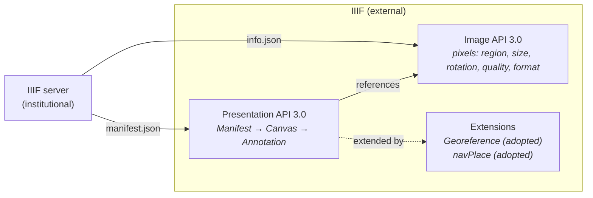
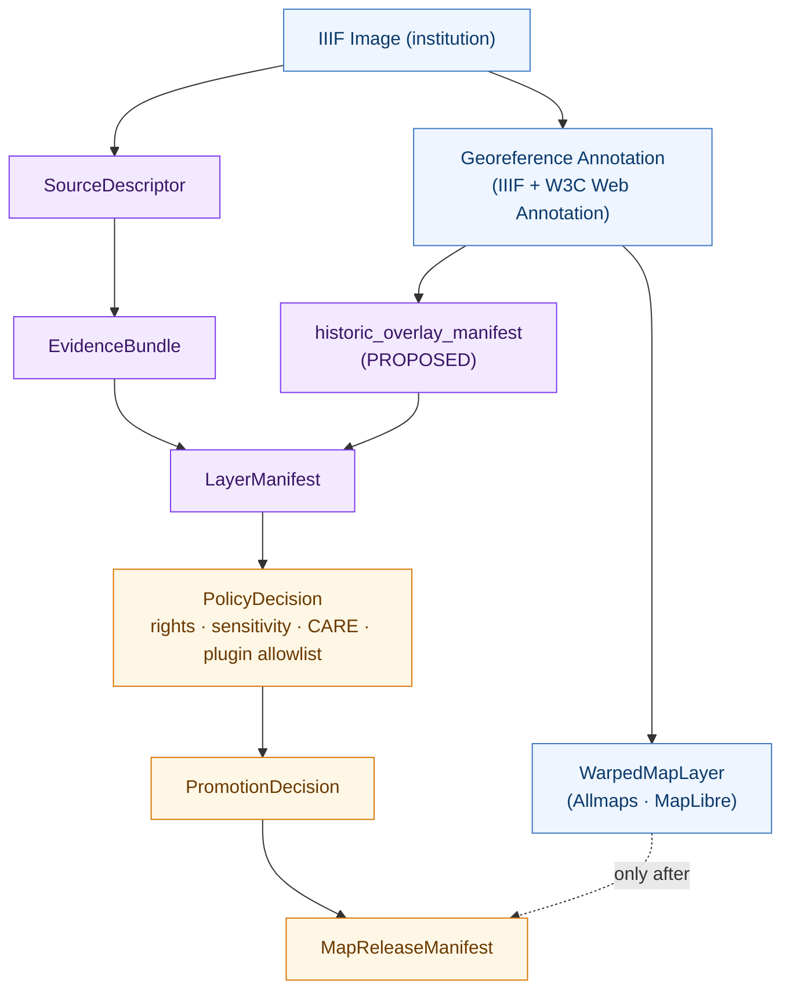
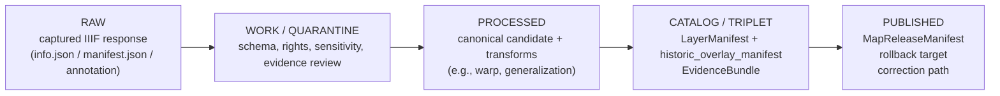

<!-- [KFM_META_BLOCK_V2]
doc_id: kfm://doc/standards/iiif
title: IIIF — International Image Interoperability Framework (KFM conformance profile)
type: standard
version: v1-draft
status: draft
owners: <TODO — Docs steward + Map / Story Node owner>
created: 2026-05-14
updated: 2026-05-14
policy_label: public
related:
  - docs/doctrine/directory-rules.md
  - docs/doctrine/authority-ladder.md
  - docs/doctrine/truth-posture.md
  - docs/doctrine/trust-membrane.md
  - docs/doctrine/lifecycle-law.md
  - docs/architecture/map-shell.md
  - docs/standards/STAC.md             # TODO confirm exists
  - docs/standards/DCAT.md             # TODO confirm exists
  - docs/standards/PROV.md             # TODO confirm exists
  - policy/rights/                     # rights enforcement
  - policy/sensitivity/                # CARE / sovereignty
tags: [kfm, standards, iiif, allmaps, historic-maps, map-shell, story-nodes]
notes:
  - Implementation maturity in the mounted repo is UNKNOWN this session.
  - All KFM-side governance shown here is PROPOSED doctrine derived from
    Master MapLibre Components-Functions-Features (SRC-064 / SRC-P18-039)
    and the KFM Components Pass 18 idea cards (KFM-P18-INV-074 / -425 / -449).
[/KFM_META_BLOCK_V2] -->

# IIIF — International Image Interoperability Framework

> KFM's conformance posture for IIIF-served images and IIIF-anchored historic-map overlays, and the governance any IIIF-sourced asset must clear before it touches a public surface.

[](#)
[](#)
[](#)
[](https://iiif.io/api/image/3.0/)
[](https://iiif.io/api/presentation/3.0/)
[](https://iiif.io/api/extension/georef/)
[](#)
[](#)

| Field | Value |
|---|---|
| **Document type** | Standard (external standard — KFM conformance profile) |
| **Authority of this doc** | Tertiary: documents an external standard. **Does not** override KFM doctrine. |
| **Authority of IIIF specs themselves** | External — versioned and maintained by the IIIF Consortium. |
| **Status of KFM conformance claims** | **PROPOSED** — see §11 and §13. |
| **Owners** | _TODO — Docs steward + Map / Story Node owner_ |
| **Last reviewed** | 2026-05-14 (draft creation) |
| **Lifecycle anchor** | RAW → WORK / QUARANTINE → PROCESSED → CATALOG / TRIPLET → PUBLISHED |

---

## Quick jump

- [1. Scope](#1-scope)
- [2. Why IIIF matters to KFM](#2-why-iiif-matters-to-kfm)
- [3. IIIF in one minute](#3-iiif-in-one-minute)
- [4. Specifications KFM tracks](#4-specifications-kfm-tracks)
- [5. The Georeference Extension and Allmaps](#5-the-georeference-extension-and-allmaps)
- [6. How IIIF fits the KFM trust spine](#6-how-iiif-fits-the-kfm-trust-spine)
- [7. KFM doctrine for IIIF-sourced content](#7-kfm-doctrine-for-iiif-sourced-content)
- [8. Object families and manifest fields](#8-object-families-and-manifest-fields)
- [9. Rights, sensitivity, and CARE](#9-rights-sensitivity-and-care)
- [10. Validation checklist](#10-validation-checklist)
- [11. Anti-patterns and failure modes](#11-anti-patterns-and-failure-modes)
- [12. Conformance levels (KFM-defined)](#12-conformance-levels-kfm-defined)
- [13. Open questions and verification backlog](#13-open-questions-and-verification-backlog)
- [14. Related docs](#14-related-docs)
- [15. Appendices](#15-appendices)

---

## 1. Scope

This document defines **how the Kansas Frontier Matrix uses IIIF as an external standard**, and the governance every IIIF-sourced asset MUST satisfy before it appears on a public KFM surface — the Map Shell, Story Nodes, the Evidence Drawer, Focus Mode, or any published export.

In scope:

- The IIIF specifications KFM tracks and the versions KFM targets.
- The IIIF Georeference Extension and Allmaps as the path for **historic-map overlays**.
- How IIIF-sourced artifacts attach to KFM object families (`SourceDescriptor`, `EvidenceBundle`, `LayerManifest`, `MapReleaseManifest`, `RunReceipt`, `PromotionDecision`, `RollbackCard`).
- Rights, sensitivity, and CARE handling for IIIF-served cultural materials.
- The validation any IIIF-anchored layer or overlay MUST pass to be **released**.

Out of scope:

- The IIIF specs themselves — KFM does not fork or redefine IIIF. We link to the upstream and conform.
- Internal IIIF *hosting* by KFM. KFM is principally an **IIIF consumer**, not a publisher. Any future IIIF hosting decision is deferred to an ADR.
- General STAC, DCAT, or W3C PROV conformance — see the sibling docs under `docs/standards/`.

> [!NOTE]
> Every KFM-side claim in this document is **PROPOSED** unless explicitly labeled CONFIRMED. The doctrinal anchor is the Master MapLibre Components-Functions-Features cumulative master (SRC-064) and the KFM Components Pass 18 idea cards keyed `MAP — Map Artifacts, Tiles, Raster/Vector Delivery, and Renderer Boundaries`. The current-session repository was **not mounted**; nothing about live implementation, schema files, or CI gates is verified here.

[Back to top ↑](#iiif--international-image-interoperability-framework)

---

## 2. Why IIIF matters to KFM

**CONFIRMED (KFM doctrine).** The Kansas archives stack named in the KFM Encyclopedia includes **LOC IIIF presentations** alongside KSHS Kansas Memory, KHRI, KU Spencer, KSU Special Collections, WSU, and county societies. IIIF is the federal-level discovery surface for that corpus and the interchange format for many institutional partners.

**CONFIRMED (KFM doctrine).** Pass 18 idea cards `KFM-P18-INV-074`, `KFM-P18-INV-425`, and `KFM-P18-INV-449`, and the Master MapLibre entries `ML-064-036` / `ML-064-037`, jointly establish KFM's posture: historic-map overlays from IIIF / Allmaps (or analogous systems) are **interpretive georeferenced artifacts requiring source rights, control points, and uncertainty metadata** — never rights-free or lineage-free GIS layers.

What IIIF buys KFM in practice:

- **One interchange format** for historic maps, archival photographs, scanned manuscripts, and digitized atlases — across institutions that otherwise expose very different APIs.
- **A standard way to reference the same image at deep zoom** without rehosting the pixels (`Image API`).
- **A standard way to describe a compound object** — book, atlas, scrapbook, photo series — for narrative use in Story Nodes (`Presentation API`).
- **A standardized georeferencing surface** via the IIIF Georeference Extension (Allmaps), so historic maps can warp onto MapLibre / Leaflet without forking GeoTIFFs from every archive.

> [!IMPORTANT]
> IIIF is a **discovery and access** standard. It is **not** an evidence standard. A IIIF manifest, by itself, never satisfies KFM's truth posture. Every IIIF-anchored claim still resolves through `EvidenceRef → EvidenceBundle`, `PolicyDecision`, and `PromotionDecision`. The trust path is the trust path.

[Back to top ↑](#iiif--international-image-interoperability-framework)

---

## 3. IIIF in one minute

IIIF is a family of open standards for delivering high-quality digital images and compound objects on the web, maintained by the IIIF Consortium. The two core APIs are the **Image API** (how to request an image, region, size, rotation, and quality) and the **Presentation API** (how to describe a compound object — its Manifests, Canvases, and Annotations). Specifications and extensions are listed at `https://iiif.io/api/`. Current IIIF specifications should be used for all new work; older versions are retained for reference but are not guaranteed to be maintained across new major versions. 



The shape readers should hold in their head: **a Manifest describes the object, a Canvas is a virtual page, an Annotation places content on a Canvas, and the Image API serves the pixels behind any Canvas at any tile / region / scale.**

[Back to top ↑](#iiif--international-image-interoperability-framework)

---

## 4. Specifications KFM tracks

The table lists the IIIF specifications and adopted extensions in scope for KFM, the versions KFM targets, and the KFM doctrine each interacts with. Versions and links are **EXTERNAL** (consulted from `iiif.io`).

| Specification | Current stable version | KFM target | Used for | KFM doctrine touchpoint |
|---|---|---|---|---|
| [Image API](https://iiif.io/api/image/3.0/) | **3.0** | **3.0** (accept 2.1.1 from legacy hosts) | Delivering image pixels at scale | `LayerManifest`, `EvidenceBundle` |
| [Presentation API](https://iiif.io/api/presentation/3.0/) | **3.0** | **3.0** (accept 2.1.1 from legacy hosts) | Describing compound objects, Manifests, Canvases, Annotations | `SourceDescriptor`, Story Node references |
| [Presentation API 4.0](https://preview.iiif.io/api/prezi-4/presentation/4.0/) | **preview / draft** | **monitor only** | Future model refinements | _Re-evaluate after stable release._ The Presentation API 4.0 document is published under `preview.iiif.io` as the introductory and data-model spec for that version  |
| [Georeference Extension](https://iiif.io/api/extension/georef/) | **adopted (2023)** | **adopted** | Warping historic maps onto modern web maps | `historic_overlay_manifest` (PROPOSED), Story Node map panels |
| [navPlace Extension](https://iiif.io/community/groups/maps-tsg/) | **adopted** | **adopted (optional)** | Locating a Manifest / Canvas on a web map | Story Node spatial anchoring |
| [Authentication API](https://iiif.io/api/) | n/a today | **not in scope (v1)** | Gated content from partners | Defer to an ADR if needed |
| [Search API](https://iiif.io/api/) | n/a today | **not in scope (v1)** | In-Manifest text search | Defer to an ADR if needed |

> [!NOTE]
> IIIF technical resources and reference implementations of older versions are not guaranteed to be maintained across new major versions.  KFM SHOULD treat IIIF Image / Presentation 2.x responses from upstream partners as **legacy-compatibility input**, normalized into KFM object families against the 3.0 model where feasible.

### 4.1 Version drift and graceful intake

Many partner archives still serve Image API 2.1 / Presentation 2.1 alongside 3.0. The KFM intake posture is:

- **MUST** record the *served* IIIF version in the `SourceDescriptor` (PROPOSED field: `iiif_api_versions`).
- **MUST NOT** silently coerce 2.x to 3.0 in catalog records — keep the as-delivered shape in `data/raw/` and normalize downstream.
- **SHOULD** prefer the 3.0 representation when both are offered.
- **SHOULD** record an explicit `iiif_profile_url` for Image API responses so renderers can negotiate.

[Back to top ↑](#iiif--international-image-interoperability-framework)

---

## 5. The Georeference Extension and Allmaps

**PROPOSED.** The Georeference Extension is KFM's preferred path for historic-map overlays — both because it is the IIIF-native answer and because Allmaps gives a working open-source implementation across MapLibre, OpenLayers, and Leaflet.

What the Georeference Extension is, in one paragraph: A way to store the metadata needed to georeference a IIIF resource in a Georeference Annotation, so that images such as digitized maps and aerial photographs can be converted into geospatial assets. It extends the IIIF Presentation API with vocabulary and a JSON-LD 1.1 context, building on the W3C Web Annotation Data Model.  It builds on Presentation API 3.0 and unlocks browser-based warping of map images from a IIIF item URL plus a few control points. 

What Allmaps adds: All components of Allmaps use Georeference Annotations that hold each map's georeference data; Georeference Annotations are based on W3C's Web Annotation standard and are an approved extension to the IIIF Presentation API. Allmaps can warp maps on-the-fly in the browser, using the IIIF Image API to download only the portion of the image needed, in the right scale.  The annotation itself carries the IIIF Image URI and dimensions, a polygonal mask defining the cartographic part of the image, and a list of ground control points mapping pixel coordinates to spatial coordinates. A Georeference Annotation contains the URI of an IIIF Image with its pixel dimensions, a polygonal resource mask for the cartographic part of the image, and a list of ground control points mapping resource coordinates to geospatial coordinates. 



> [!IMPORTANT]
> **The render plugin is a downstream consumer, not an authority.** Allmaps' `WarpedMapLayer` is a conditional overlay plugin — see `ML-064-037` — and rides under the same **plugin allowlist** that governs every other third-party MapLibre extension. A Georeference Annotation that has not cleared rights, GCP provenance, and annotation-digest validation MUST NOT reach the public Map Shell, even if it renders cleanly in development.

[Back to top ↑](#iiif--international-image-interoperability-framework)

---

## 6. How IIIF fits the KFM trust spine

IIIF-served images are **observations** the same way any other upstream raster is an observation: they enter under a `SourceDescriptor`, settle into `RAW`, get characterized in `WORK` or `QUARANTINE`, accumulate `EvidenceBundle` and policy decisions, and only then become `CATALOG`-listed and `PUBLISHED`. The IIIF-ness adds three concerns layered on top of the normal flow:

1. **Identity persistence** — IIIF resource URIs are the upstream identity; KFM `SourceDescriptor` records MUST preserve them verbatim and record `iiif_api_versions`, `info_json_url`, and (for Presentation) `manifest_url`.
2. **Georeferencing provenance** — when a Georeference Annotation is involved, the GCP set, polygonal mask, and resulting transform parameters MUST travel with the artifact as evidence, not as render hints.
3. **Rights propagation** — IIIF Presentation 3.0 `rights` and `requiredStatement` MUST flow through to the KFM rights record; they are evidence of the upstream rights position, not a substitute for KFM review.



> [!CAUTION]
> Promotion is a **governed state transition, not a file move.** A IIIF asset that lands in `data/raw/` is not "available." A IIIF asset that renders in a dev environment is not "released." Until `PromotionDecision` is recorded and `MapReleaseManifest` lists the layer, the Map Shell MUST NOT fetch it.

[Back to top ↑](#iiif--international-image-interoperability-framework)

---

## 7. KFM doctrine for IIIF-sourced content

These rules are **PROPOSED** doctrine derived from Pass 18 cards and the Master MapLibre cumulative master. They are doctrine that the schema, policy, and validator implementations SHOULD enforce; they are not (yet) verified as enforced in the live repo.

### 7.1 Identity and provenance

- **MUST** capture the IIIF `id` (Presentation) or service `id` (Image API) verbatim in the `SourceDescriptor`.
- **MUST** preserve the unmodified `manifest.json` and/or `info.json` in `data/raw/` with capture metadata (fetch time, `ETag`, `Last-Modified`, response status).
- **MUST** record the *served* IIIF API version(s). If both 2.x and 3.0 are served, record both.
- **SHOULD** record the IIIF profile URL declared in the Image API response so renderers can negotiate level features.
- **MUST NOT** rewrite or re-serialize the upstream JSON in the canonical record. Normalize into KFM shapes downstream and keep as-delivered evidence intact.

### 7.2 Georeferencing

- **MUST** treat a Georeference Annotation as **evidence**, not as a render asset. It is stored, hashed, and referenced from the `EvidenceBundle`.
- **MUST** record GCP count, the polygonal resource mask, the original CRS (or `UNKNOWN`), and the chosen transformation method, on the PROPOSED `historic_overlay_manifest` (and/or extended `LayerManifest`).
- **SHOULD** record an `overlay_uncertainty` field — qualitative and, where possible, quantitative (e.g., RMS error of the chosen transform).
- **MUST** require explicit rights review before the warped overlay is exposed in any public Story Node.

### 7.3 Rights, sensitivity, and CARE

- **MUST** carry forward IIIF Presentation `rights` and `requiredStatement` into the KFM rights record. Where the upstream rights are `UNKNOWN`, the asset stays at **default-deny** for public exposure.
- **MUST** route any IIIF-anchored asset that touches sensitive cultural, archaeological, tribal, or sovereignty-implicating material through the CARE-bound policy lane before promotion. See §9.

### 7.4 Plugins and renderers

- **MUST** restrict in-browser warping plugins (e.g., Allmaps `WarpedMapLayer`) to the project plugin allowlist.
- **MUST** validate the annotation digest (sha256 of the canonical-serialized Georeference Annotation) at promotion and at runtime fetch.
- **MUST NOT** rely on a CDN copy or browser-cache of the annotation as authoritative — the catalog-referenced copy is the truth.

### 7.5 Lifecycle

- IIIF-sourced rasters and overlays follow the same `RAW → WORK / QUARANTINE → PROCESSED → CATALOG / TRIPLET → PUBLISHED` lifecycle as every other observation.
- Promotion is a **governed state transition**, recorded in `PromotionDecision` with a citation back to the `EvidenceBundle` and rights / sensitivity decisions.
- Every published IIIF-anchored layer **MUST** have a named rollback target — the prior `MapReleaseManifest` entry, or a documented "no prior" rollback that returns the layer to `unreleased`.

[Back to top ↑](#iiif--international-image-interoperability-framework)

---

## 8. Object families and manifest fields

These are the KFM object families IIIF-sourced material attaches to, and the PROPOSED fields each MUST carry. None of the field paths below is verified against the live repo this session — see §13.

| KFM object family | Role for IIIF content | PROPOSED fields (selected) |
|---|---|---|
| `SourceDescriptor` | Upstream identity, rights, capture metadata | `iiif_manifest_url`, `iiif_info_json_url`, `iiif_api_versions[]`, `iiif_profile_url`, `served_etag`, `fetched_at`, `rights_statement`, `required_statement` |
| `EvidenceBundle` | Resolves `EvidenceRef` to the actual evidence | references to: raw `manifest.json`, raw `info.json`, georeference annotation JSON, all under content-addressed digests |
| `historic_overlay_manifest` *(PROPOSED — new)* | Per-overlay record for IIIF + Georeference Extension assets | `iiif_image_uri`, `image_width_px`, `image_height_px`, `resource_mask` (polygon), `gcps[]`, `gcp_count`, `original_crs` *or* `UNKNOWN`, `transform_method`, `transform_rms`, `annotation_sha256`, `overlay_uncertainty` |
| `LayerManifest` | The shape of a renderable map layer | inherit IIIF identity from `SourceDescriptor`; reference `historic_overlay_manifest`; declare allowed tile attributes; declare `tileProtocol` family |
| `MapReleaseManifest` | What is actually allowed in the public Map Shell | enumerate every released IIIF-anchored layer with `release_state`, `policy_decision_id`, `rollback_target` |
| `PolicyDecision` | rights / sensitivity / CARE / plugin allowlist outcome | `decision ∈ {ALLOW, DENY, ABSTAIN, ERROR}`, reason codes, evidence references |
| `PromotionDecision` | Governed state transition record | inputs: validators passed, policy decision, evidence closure, reviewer state |
| `RollbackCard` | The reversible-change posture | named rollback target, replay plan, correction-notice linkage |
| `RunReceipt` | Reproducible run identity for ingestion / warping | `spec_hash`, tool versions, IIIF source response hashes |

[Back to top ↑](#iiif--international-image-interoperability-framework)

---

## 9. Rights, sensitivity, and CARE

**PROPOSED.** IIIF makes the *form* of rights metadata standardizable; it does not make the *substance* of rights judgments standardizable. KFM's CARE-aware policy lane runs independently of, and after, the IIIF-declared rights.

| Upstream signal | KFM treatment |
|---|---|
| `rights` URI is a Creative Commons or RightsStatements.org URI | Record verbatim; **does not** automatically license public exposure. CARE review still applies. |
| `rights` URI is custom / institutional | Record verbatim; treat as **rights = controlled** by default; promote only after review. |
| `rights` absent | Treat as **rights = UNKNOWN**; default-deny public exposure. |
| `requiredStatement` present | Propagate to attribution chrome, layer manifest, Evidence Drawer payload, and any Story Node citing the asset. |
| Content references tribal, sacred, sensitive archaeological, or sovereignty-implicating material | Route through the CARE-bound policy lane; require steward sign-off; default to generalized or denied public exposure regardless of upstream rights. |

> [!WARNING]
> **A permissive upstream IIIF `rights` URI does not authorize KFM publication.** The Master MapLibre doctrine is explicit on this point: rendered tiles, popups, manifests, and AI answers are **not sovereign truth**. Every release runs through the trust spine. IIIF rights metadata is *evidence* of the institutional position; it is *not* a substitute for a `PolicyDecision`.

[Back to top ↑](#iiif--international-image-interoperability-framework)

---

## 10. Validation checklist

The validation suite for any IIIF-anchored layer or overlay before it is `released`. Items below are PROPOSED; specific validator names and CI workflow files are **NEEDS VERIFICATION**.

- [ ] **Source identity.** `SourceDescriptor` records `iiif_manifest_url` and/or `iiif_info_json_url` verbatim from the upstream.
- [ ] **As-delivered preservation.** `manifest.json` / `info.json` / Georeference Annotation are present in `data/raw/` with capture metadata and content-addressed digests.
- [ ] **API version recorded.** `iiif_api_versions` is populated; mixed 2.x / 3.0 partner responses are recorded as-served.
- [ ] **Schema validation.** Raw IIIF JSON validates against the relevant IIIF JSON-LD context (`iiif_profile_url` resolves; required `type` properties present per the spec major version).
- [ ] **Georeference (if applicable).** Annotation digest matches the catalog-referenced copy; GCP count is non-zero; resource mask is a closed polygon; transform method is recorded.
- [ ] **Rights closure.** `rights` and `requiredStatement` are propagated, or rights are explicitly `UNKNOWN` with default-deny.
- [ ] **Sensitivity / CARE closure.** CARE classification is recorded; if `authority_to_control` is non-empty, a valid consent grant is on file.
- [ ] **Plugin allowlist.** Any browser-side warping plugin (Allmaps `WarpedMapLayer` or analog) is on the allowlist; version is pinned.
- [ ] **No public raw path.** No public route exposes `data/raw/` or `data/work/` IIIF copies.
- [ ] **No unreleased tile load.** Map Shell only fetches IIIF-anchored layers listed in `MapReleaseManifest`.
- [ ] **Click-to-EvidenceBundle.** Clicking the overlay in the Map Shell resolves to the `EvidenceBundle` and, where relevant, to the Georeference Annotation evidence.
- [ ] **Citation validation.** Story Nodes citing the overlay resolve to released `MapReleaseManifest` entries.
- [ ] **Rollback rehearsed.** Rollback target replays cleanly to a prior released state (or `unreleased`).
- [ ] **Negative-state coverage.** Fixtures exercise the DENY / ABSTAIN / ERROR paths for missing rights, missing GCPs, unknown CARE state, stale upstream.

[Back to top ↑](#iiif--international-image-interoperability-framework)

---

## 11. Anti-patterns and failure modes

The Master MapLibre doctrine flags a set of recurring traps. The IIIF-specific shape of each:

| Anti-pattern | IIIF-specific shape |
|---|---|
| Treating a render as truth | Treating an Allmaps `WarpedMapLayer` overlay as a surveyed alignment. |
| Treating a popup as evidence | Treating Manifest `label` / `summary` text as a citable claim. The popup is a launch point, not an answer. |
| Skipping the trust membrane | Letting the public Map Shell fetch a partner's IIIF tile endpoint directly, bypassing `MapReleaseManifest`. |
| Style filters as policy | "Hiding" a sensitive historic overlay with a `display: none` instead of withholding it from the release manifest. |
| Convenience caching as authority | Treating a CDN'd copy of a Georeference Annotation as authoritative. |
| Lineage erasure | Stripping `provider`, `rights`, or `requiredStatement` during downstream normalization. |
| Permissive-license shortcut | Inferring CARE-acceptable publication from a CC-BY URI on the IIIF manifest. |
| Source-snippet-as-proof | Treating "this archive publishes IIIF" as proof that KFM has ingested or released anything from it. |

> [!CAUTION]
> The Allmaps in-browser warp is fast and looks beautiful. That is exactly what makes it a governance hazard: a visually persuasive overlay is the kind of thing the public reads as truth. Georeference uncertainty, rights bounds, and interpretive uncertainty MUST be inspectable in the Map Shell — see PROPOSED `overlay_uncertainty`.

[Back to top ↑](#iiif--international-image-interoperability-framework)

---

## 12. Conformance levels (KFM-defined)

KFM does not declare conformance levels on the IIIF spec — IIIF defines its own compliance profiles. These are **KFM-internal** maturity levels for our handling of IIIF-sourced material.

| Level | What it requires | Status |
|---|---|---|
| **L0 — Source captured** | `SourceDescriptor` exists, raw IIIF JSON preserved, rights propagated, no public exposure. | PROPOSED |
| **L1 — Evidence-resolved** | `EvidenceBundle` resolves; click-to-evidence works in non-public surfaces. | PROPOSED |
| **L2 — Cataloged** | `LayerManifest` present; CARE / rights / sensitivity decisions on file; not yet in `MapReleaseManifest`. | PROPOSED |
| **L3 — Released** | Listed in `MapReleaseManifest`; rollback rehearsed; correction path in place; Story Nodes may cite. | PROPOSED |
| **L4 — Released + georeferenced overlay** | L3 plus `historic_overlay_manifest` with GCPs, mask, transform, RMS, and `overlay_uncertainty`; Allmaps plugin on allowlist. | PROPOSED |

[Back to top ↑](#iiif--international-image-interoperability-framework)

---

## 13. Open questions and verification backlog

These items are **NEEDS VERIFICATION** or **OPEN**; track in `docs/registers/VERIFICATION_BACKLOG.md` (path PROPOSED per Directory Rules §18).

- **NEEDS VERIFICATION** — Does a `schemas/contracts/v1/.../historic_overlay_manifest.schema.json` exist in the mounted repo today, or is this a wholly PROPOSED contract?
- **NEEDS VERIFICATION** — Do `policy/rights/` and `policy/sensitivity/` (or `policies/` mirrors) currently include IIIF-aware rules, or are the rules generic?
- **NEEDS VERIFICATION** — Is Allmaps on a documented plugin allowlist anywhere in the repo today? If so, which version is pinned?
- **NEEDS VERIFICATION** — Are any IIIF-anchored sources already in `data/raw/` or `data/registry/`? KSHS Kansas Memory, KHRI, KU Spencer, LOC are named in the KFM Encyclopedia C10-07 stack as in-scope source families; ingestion status is not visible this session.
- **NEEDS VERIFICATION** — What is the policy posture toward IIIF Authentication API gated content from partner archives? Is anything gated today?
- **OPEN** — Should KFM ever *host* IIIF (versus only consume)? If so, under which `apps/` or `runtime/` lane, and behind which governed API surface? This is an ADR-level decision.
- **OPEN** — How should georeference uncertainty be **visually disclosed** in the Map Shell without making the overlay unreadable? `KFM-P18-INV-425` flags this as unresolved.
- **OPEN** — When the upstream IIIF version changes (e.g., a partner moves from 2.1 to 3.0), what is the re-ingestion trigger? Does `ETag` / `Last-Modified` cover the case, or does KFM need a profile-aware watcher?
- **OPEN** — IIIF Presentation API 4.0 is in preview today (per upstream). When and how does KFM cut over? Presentation API 4.0 is published under preview.iiif.io as the introductory and data-model spec for that version. 

[Back to top ↑](#iiif--international-image-interoperability-framework)

---

## 14. Related docs

- `docs/doctrine/directory-rules.md` — §6.1 places `docs/standards/` and confirms this file's home.
- `docs/doctrine/authority-ladder.md` — IIIF is tertiary external; KFM doctrine outranks it for KFM-specific claims.
- `docs/doctrine/truth-posture.md` — `cite-or-abstain`; an IIIF render is never a sovereign claim.
- `docs/doctrine/trust-membrane.md` — release rules; IIIF-anchored layers cross the membrane only via `MapReleaseManifest`.
- `docs/doctrine/lifecycle-law.md` — `RAW → WORK / QUARANTINE → PROCESSED → CATALOG / TRIPLET → PUBLISHED`.
- `docs/architecture/map-shell.md` — where IIIF-anchored layers actually surface.
- `docs/standards/STAC.md` — _TODO confirm exists_ — IIIF asset roles and PMTiles / COG asset roles in STAC.
- `docs/standards/DCAT.md` — _TODO confirm exists_ — DCAT distribution mapping.
- `docs/standards/PROV.md` — _TODO confirm exists_ — generation lineage for warped overlays.
- `contracts/source/`, `contracts/evidence/`, `contracts/release/` — object meaning.
- `schemas/contracts/v1/...` — machine-checkable shape (per ADR-0001).
- `policy/rights/`, `policy/sensitivity/`, `policy/release/` — admissibility rules.

[Back to top ↑](#iiif--international-image-interoperability-framework)

---

## 15. Appendices

<details>
<summary><strong>A. Illustrative Georeference Annotation skeleton</strong> (illustrative — not from KFM repo)</summary>

The example below is an **illustrative skeleton** based on the IIIF Georeference Extension's published structure. It is **not** drawn from KFM repository content. Field shapes follow the upstream spec.

```json
{
  "@context": [
    "http://www.w3.org/ns/anno.jsonld",
    "http://iiif.io/api/extension/georef/1/context.json"
  ],
  "type": "Annotation",
  "id": "https://example.org/georef/annotation-001",
  "motivation": "georeferencing",
  "target": {
    "type": "SpecificResource",
    "source": {
      "id": "https://iiif.example.org/iiif/3/historic-map-001",
      "type": "ImageService3",
      "height": 9000,
      "width": 12000
    },
    "selector": {
      "type": "SvgSelector",
      "value": "<svg ...polygonal resource mask...></svg>"
    }
  },
  "body": {
    "type": "FeatureCollection",
    "transformation": {
      "type": "polynomial",
      "options": { "order": 2 }
    },
    "features": [
      {
        "type": "Feature",
        "properties": {
          "resourceCoords": [3421, 5678]
        },
        "geometry": {
          "type": "Point",
          "coordinates": [-98.4842, 38.8403]
        }
      }
    ]
  }
}
```

</details>

<details>
<summary><strong>B. IIIF terminology cheatsheet</strong></summary>

| Term | Short definition |
|---|---|
| **Manifest** | The compound-object description (Presentation API). One Manifest typically = one digital object. |
| **Canvas** | A virtual page or surface inside a Manifest. |
| **Annotation** | A statement attached to a Canvas (image, text, georeference, etc.), per W3C Web Annotation. |
| **Annotation Page / List** | A collection of Annotations. |
| **info.json** | The Image API descriptor for a single image: dimensions, supported features, profile. |
| **profile** | A named feature-set conformance level on the Image API. |
| **Range** | A logical grouping of Canvases (e.g., a chapter). |
| **navPlace** | Presentation extension placing a Manifest / Canvas on a web map. |
| **Georeference Annotation** | Annotation per the IIIF Georeference Extension carrying GCPs, mask, and transform metadata. |
| **GCP** | Ground Control Point — pixel-to-spatial coordinate pair used to warp the image. |
| **WarpedMapLayer** | Allmaps' MapLibre plugin that consumes a Georeference Annotation and warps the IIIF image client-side. |

</details>

<details>
<summary><strong>C. Why this file lives at <code>docs/standards/IIIF.md</code></strong> (Directory Rules basis)</summary>

Directory Rules §6.1 lists `docs/standards/` as the home for "external standards KFM conforms to (STAC, DCAT, PROV, etc.)" — exactly the responsibility this document carries.

Per §3 (the Deeper Rule), a folder appears at repo root only if it carries one or more repo-wide responsibilities; `docs/` carries the "governs truth, evidence, release, or policy" responsibility for the human-facing control plane. `docs/standards/` is therefore the right responsibility root for a conformance document like this one.

This file is **not**:

- A README-like landing doc (no directory tree, no inputs / exclusions section); it is a standard doc with the KFM Meta Block v2.
- A doctrine doc — it does not define a KFM invariant. It documents an external standard and how KFM conforms.
- A schema or policy file — those live under `schemas/contracts/v1/` and `policy/` respectively, with this doc as their human-facing reference.

The filename uses the uppercase acronym (`IIIF.md`) as requested in the task. Whether the surrounding `docs/standards/` folder uses uppercase or lowercase filenames is **NEEDS VERIFICATION** against the live repo; rename if local convention says otherwise (an alternate is `iiif.md`).

</details>

<details>
<summary><strong>D. External sources consulted</strong></summary>

External sources consulted are listed inline in Section 2 of the change notes that accompany this draft (and in `` tags throughout the body). The triggers were:

- IIIF spec versions and adopted extensions (**version-sensitive external standards**).
- The Georeference Extension and Allmaps technical surface (**current syntax / behavior of external tools the doc must describe accurately**).

No external sources were consulted for any KFM-specific claim (repo state, paths, schemas, policy enforcement). Those remain governed by project knowledge and labeled PROPOSED / UNKNOWN / NEEDS VERIFICATION as appropriate.

</details>

---

**Related docs:** [Directory Rules](../doctrine/directory-rules.md) · [Authority Ladder](../doctrine/authority-ladder.md) · [Truth Posture](../doctrine/truth-posture.md) · [Trust Membrane](../doctrine/trust-membrane.md) · [Lifecycle Law](../doctrine/lifecycle-law.md) · [Map Shell](../architecture/map-shell.md) · STAC _(TODO)_ · DCAT _(TODO)_ · PROV _(TODO)_

**Last updated:** 2026-05-14 · [Back to top ↑](#iiif--international-image-interoperability-framework)
