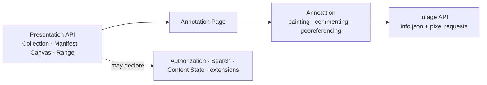
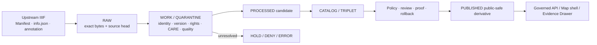

<!-- [KFM_META_BLOCK_V2]
doc_id: kfm://doc/standards-iiif
title: IIIF — KFM Consumption and Historic-Overlay Boundary
type: standard; interoperability-guidance
version: v2.0-draft
status: "draft; repository-grounded; upstream-currentness-refreshed; bounded-fixture-profile; canonical-path-integrated; independent-review-pending"
owners:
  - "@bartytime4life — verified CODEOWNERS review route"
  - "NEEDS VERIFICATION — IIIF/archives, map, evidence, rights/CARE, accessibility, security, and release reviewers"
created: 2026-05-14
updated: 2026-08-18
policy_label: repository-facing
owning_root: docs/
current_path: docs/standards/IIIF.md
responsibility: >
  Explain current IIIF specifications, KFM's bounded fixture-only historic-overlay
  readiness implementation, georeference quality boundaries, and the evidence
  required before source admission, runtime use, release, publication, or
  interoperability may be claimed.
truth_posture: >
  CONFIRMED repository paths and bytes, case-colliding lowercase sibling,
  fixture-only readiness profile, adjacent georeference profiles, focused tests
  and workflow, and LOC connector scaffold state / CONFIRMED official IIIF
  current-specification snapshot dated 2026-08-18 / PROPOSED live source,
  canonical overlay object, policy integration, Allmaps runtime, Evidence Drawer,
  release, and publication / UNKNOWN external interoperability and any deployed
  IIIF-backed layer.
evidence_snapshot:
  repository: bartytime4life/Kansas-Frontier-Matrix
  base_ref: main
  base_commit: f9a515a1124f9f5397996f6bc7cb3fd1a3534c40
  target_prior_blob: 699555ea1b37c28dceb932aab247cb90bbeaadc2
  standards_readme_blob: a8cbe5d183448d5f0de37f8a4eacd6fcaca0d71b
  readiness_contract_blob: 4b3f92879186d73c449282a4f0e9c8e05f758f15
  readiness_schema_blob: 0b3108eebd257a804cbf5116a4f8c3f3f8bd2a8f
  readiness_validator_blob: cce4fedffb73b5e3ae454758eae132affb574ccd
  readiness_test_blob: 0a6ac3077f615500735739af73d001fd1ff6759f
  readiness_fixture_blob: a7182f9286d4f7d43385ebc8361c3b080fc32caf
  readiness_workflow_blob: b3e24709488cd8b096760945970d1e0e1c150859
  readiness_receipt_blob: 3a5b460600c5805cac4a483a174f1359a3cda929
  transform_quality_contract_blob: 4fbab9697ef4f838747d9c9d18eaa5f6922bd36f
  spatial_distribution_contract_blob: 1577902afa7420c3b05874d17661f02a52b64647
  loc_connector_readme_blob: a7678979965e9e6bc5389870f425bdced3a77fa9
external_currentness_review:
  access_date: 2026-08-18
  issuer: IIIF Consortium
  current_stable:
    - "Image API 3.0.0"
    - "Presentation API 3.0.0"
    - "Authorization Flow API 2.0.0"
    - "Change Discovery API 1.0.0"
    - "Content Search API 2.0.0"
    - "Content State API 1.0.0"
  draft:
    - "Presentation API 4.0.0 — release candidate"
  approved_extensions:
    - "navPlace"
    - "Text Granularity"
    - "Georeference"
related:
  - ./README.md
  - ./iiif.md
  - ./STAC.md
  - ./DCAT.md
  - ./PROV.md
  - ./DUBLIN-CORE.md
  - ./ARCHIVAL-STANDARDS.md
  - ../doctrine/directory-rules.md
  - ../adr/ADR-0029-adopt-directory-governance-standard-v2.md
  - ../architecture/map-shell.md
  - ../sources/catalog/loc/loc-iiif-presentations.md
  - ../../contracts/map/iiif_historic_overlay_readiness.md
  - ../../schemas/contracts/v1/map/iiif_historic_overlay_readiness.schema.json
  - ../../fixtures/contracts/v1/map/iiif_historic_overlay_readiness/cases.json
  - ../../tools/validators/map/validate_iiif_historic_overlay_readiness.py
  - ../../tests/map/test_iiif_historic_overlay_readiness.py
  - ../../.github/workflows/map-iiif-historic-overlay-readiness.yml
  - ../../contracts/map/georeference_transform_quality.md
  - ../../contracts/map/georeference_spatial_distribution.md
  - ../../connectors/loc/README.md
tags: [kfm, standards, iiif, image-api, presentation-api, georeference, allmaps, historic-maps, rights, care, maplibre, evidence]
notes:
  - "Same-path documentation-only update; no contract, schema, policy, source, fixture, validator, workflow, dependency, runtime, release, or publication change."
  - "The merged readiness profile remains PROPOSED_INACTIVE and fixture-only."
  - "Owner authority selected docs/standards/IIIF.md as canonical; the lowercase sibling is retired on current main, while independent review and milestone closure remain pending."
  - "Presentation API 4.0 is now an upstream release candidate while the current readiness schema still names 4.0-preview."
[/KFM_META_BLOCK_V2] -->

<a id="top"></a>
<a id="iiif--international-image-interoperability-framework"></a>
<a id="iiif--kfm-conformance-profile"></a>

# IIIF — KFM Consumption and Historic-Overlay Boundary

> **Operating rule.** IIIF can make attributed digital objects and georeferenced historic maps interoperable. It cannot make a source authoritative, a georeference accurate, rights resolved, evidence complete, policy satisfied, or a layer released.

[](#3-official-iiif-snapshot)
[](#2-current-repository-state)
[](#5-current-iiif-readiness-profile)
[](#2-current-repository-state)
[](#9-validation-and-maturity)
[](#10-canonical-path-authority)

> [!IMPORTANT]
> **This page is guidance, not conformance proof.** It does not adopt IIIF, activate an archive source, validate a live Manifest or Image Service, authenticate rights or CARE state, enable Allmaps, authorize a release, or prove interoperability.

> [!CAUTION]
> KFM's present executable IIIF proof is a no-network, fixture-only `IIIFHistoricOverlayReadinessAssessment` plus separate synthetic georeference-quality profiles. Those checks do not fetch IIIF, warp imagery, authenticate evidence, run policy, or publish a layer.

> [!NOTE]
> Current `main` tracks only `docs/standards/IIIF.md`. The owner-selected path migration is integrated, but integration is not independent review, IIIF adoption, conformance proof, release, or publication authority. Historical receipts remain bound to their recorded paths and bytes.

| Field | Current bounded result |
|---|---|
| **Repository-state snapshot** | `main@c1bc952aa6cddca4f4910cdcffd85a419a412ade` |
| **Placement** | `PLACE` at the existing path under the accepted ADR-0029 standards lane |
| **Upstream stable baseline** | Image `3.0.0`; Presentation `3.0.0`; Authorization Flow `2.0.0`; Change Discovery `1.0.0`; Content Search `2.0.0`; Content State `1.0.0` |
| **Upstream draft** | Presentation `4.0.0` release candidate; stable remains `3.0.0` |
| **KFM executable profile** | `kfm.iiif.historic-overlay-readiness.v1`, `PROPOSED_INACTIVE`, fixture-only, no-network |
| **Readiness outcomes** | `READY`, `HOLD`, `DENY`, `ERROR`; precedence `ERROR > DENY > HOLD > READY` |
| **Live source** | Not established; LOC remains a deferred greenfield connector family |
| **Map runtime** | No supported deployed or released Allmaps/MapLibre IIIF overlay established |
| **Conformance claim** | Not established |
| **Review route** | `@bartytime4life`; specialist and independent review need verification |
| **Release/publication effect** | None |

**Quick navigation:** [Authority](#1-authority-and-non-effects) · [Repository](#2-current-repository-state) · [Upstream](#3-official-iiif-snapshot) · [Trust model](#4-core-model-and-trust-path) · [Readiness](#5-current-iiif-readiness-profile) · [Georeference](#6-georeference-and-quality-separation) · [Rights/runtime](#7-rights-care-and-renderer-boundary) · [Objects](#8-object-and-authority-map) · [Validation](#9-validation-and-maturity) · [Path authority](#10-canonical-path-authority) · [Backlog](#11-backlog-and-next-slice) · [References](#12-references-terms-and-rollback)

---

<a id="1-authority-and-non-effects"></a>

## 1. Authority and non-effects

### 1.1 This page owns

- the current IIIF API/extension snapshot relevant to KFM;
- KFM's repository relationship to IIIF;
- the boundary between upstream IIIF resources and KFM source, evidence, policy, review, release, and correction objects;
- the current fixture-only historic-overlay readiness profile;
- the separate transform-quality and GCP-distribution profiles;
- rights, attribution, Authorization Flow, CARE, and plugin concerns;
- validation evidence and its limits; and
- explicit drift and graduation requirements.

### 1.2 Other authorities remain separate

| Question | Authority |
|---|---|
| Where this page belongs | [`ADR-0029`](../adr/ADR-0029-adopt-directory-governance-standard-v2.md), [`directory-rules.md`](../doctrine/directory-rules.md), and [`docs/standards/README.md`](./README.md) |
| What a KFM object means | `contracts/`; the current readiness contract is `PROPOSED_INACTIVE` |
| What machine shape is valid | `schemas/`, including the closed readiness schema |
| Whether a source may be fetched | Source registry/admission, connector controls, terms, rights, sensitivity, and accountable review |
| Whether evidence supports a claim | `EvidenceRef -> EvidenceBundle` resolution |
| What may be exposed | `policy/`, rights/CARE controls, review, and release state |
| Whether a georeference is fit | GCP evidence, quality assessments, declared fitness criteria, and qualified review |
| Whether KFM conforms to IIIF | A dated profile, producer/consumer fixtures, validators, observed interoperability, and authorized adoption |
| Whether publication is allowed | Proof closure, policy, authorized review, release, correction, withdrawal, and rollback |
| What IIIF normatively means | Official IIIF specifications |

### 1.3 This update does not

- choose between `IIIF.md` and `iiif.md`;
- create, rename, delete, redirect, or supersede a path;
- adopt IIIF, Allmaps, or a KFM IIIF profile;
- amend contract, schema, fixtures, validator, tests, workflow, or receipt;
- change the `4.0-preview` enum or rights-URI constraint;
- add a source descriptor, connector, network request, cache, or captured source bytes;
- create a canonical historic-overlay manifest;
- calculate a georeference or execute a warp;
- authenticate rights, consent, CARE, evidence, review, or release;
- add a MapLibre plugin or route;
- promote lifecycle state; or
- release, deploy, publish, or change repository settings.

---

<a id="2-current-repository-state"></a>

## 2. Current repository state

The May 2026 page described implementation as unknown. Current repository evidence supports a narrow fixture implementation, but not a live source or public overlay.

### 2.1 Proof matrix

| Surface | CONFIRMED evidence | Safe conclusion |
|---|---|---|
| Standards page | [`IIIF.md`](./IIIF.md) | Owner-selected canonical guidance is integrated; this is not IIIF adoption or conformance proof |
| Readiness meaning | [`iiif_historic_overlay_readiness.md`](../../contracts/map/iiif_historic_overlay_readiness.md) | Fixture preflight only; no source/evidence/policy/release authority |
| Readiness shape | [`iiif_historic_overlay_readiness.schema.json`](../../schemas/contracts/v1/map/iiif_historic_overlay_readiness.schema.json) | Closed Draft 2020-12 shape with fixed no-network/no-authority fields |
| Cases | [`cases.json`](../../fixtures/contracts/v1/map/iiif_historic_overlay_readiness/cases.json) | Eleven mutation-derived cases cover all readiness outcomes |
| Validator | [`validate_iiif_historic_overlay_readiness.py`](../../tools/validators/map/validate_iiif_historic_overlay_readiness.py) | Deterministic declaration/integrity checks without network |
| Tests | [`test_iiif_historic_overlay_readiness.py`](../../tests/map/test_iiif_historic_overlay_readiness.py) | Focused regression coverage |
| Workflow | [`map-iiif-historic-overlay-readiness.yml`](../../.github/workflows/map-iiif-historic-overlay-readiness.yml) | Read-only focused CI; no live IIIF access |
| Receipt | [`genrec-iiif-historic-overlay-readiness-20260806.json`](../../data/receipts/generated/genrec-iiif-historic-overlay-readiness-20260806.json) | Authored hashes/local validation recorded; not review, proof, or release |
| Transform quality | [`georeference_transform_quality.md`](../../contracts/map/georeference_transform_quality.md) | Separate inactive synthetic affine-fit profile |
| GCP distribution | [`georeference_spatial_distribution.md`](../../contracts/map/georeference_spatial_distribution.md) | Separate inactive synthetic control-coverage profile |
| LOC source family | [`connectors/loc/README.md`](../../connectors/loc/README.md) | `0.0.0` greenfield scaffold; fetch/admit placeholders; access denied by default |
| LOC product page | [`loc-iiif-presentations.md`](../sources/catalog/loc/loc-iiif-presentations.md) | Documentation scaffold only |
| Live capture/parser | No admitted run established | Not supported as a proven path |
| Allmaps runtime | No released/deployed integration established | Not supported as a proven path |
| Evidence/release closure | No IIIF-specific end-to-end released flow established | Deferred |

Merged PR [`#2077`](https://github.com/bartytime4life/Kansas-Frontier-Matrix/pull/2077) added the readiness slice. Its focused exact-head workflow succeeded with eleven tests and eleven fixture-polarity cases. That proves the tested fixture boundary only—not a live server, source rights, georeference execution, policy, runtime, release, or external interoperability.

### 2.2 Confirmed mismatches

| Mismatch | Evidence | Disposition |
|---|---|---|
| Presentation 4 vocabulary | Upstream lists `4.0.0` as release candidate; KFM schema still uses `4.0-preview` | Update executable profile separately or keep unsupported |
| Minimum warp GCPs | Official Georeference Extension requires at least three GCPs to enable warping; current readiness validator holds only at zero | Correct or explicitly model “valid annotation” vs “warp ready” |
| Rights URI scheme | Presentation 3 notes machine-actionable CC/RightsStatements values use `http`; current readiness schema accepts `https://` only | Decide lossless acceptance/canonicalization and test it |
| Image API profile | Old page required a profile URL; Image API 3 commonly uses compact profile values | Preserve exact as-served profile representation |
| Overlay object | Old page proposed `historic_overlay_manifest`; merged PR intentionally did not create it | Remains a decision, not a repo fact |
| Release binding | Release ref is nullable; all authority booleans are false | Correct for inactive preflight; no release claim |

---

<a id="3-official-iiif-snapshot"></a>

## 3. Official IIIF snapshot

Official currentness review accessed **2026-08-18**:

| Surface | Official state | Current KFM relationship |
|---|---|---|
| [Image API](https://iiif.io/api/image/3.0/) | Stable `3.0.0`; previous `2.1.1` | Fixture declarations only; no live consumer proven |
| [Presentation API](https://iiif.io/api/presentation/3.0/) | Stable `3.0.0` | Fixture declarations only; no live parser proven |
| [Authorization Flow API](https://iiif.io/api/auth/2.0/) | Stable `2.0.0` | No KFM implementation established |
| [Change Discovery API](https://iiif.io/api/discovery/1.0/) | Stable `1.0.0` | No admitted IIIF watcher established |
| [Content Search API](https://iiif.io/api/search/2.0/) | Stable `2.0.0` | No IIIF search consumer established |
| [Content State API](https://iiif.io/api/content-state/1.0/) | Stable `1.0.0` | No governed deep-link integration established |
| [Presentation API 4.0](https://iiif.io/api/presentation/4.0/) | `4.0.0` release candidate; stable remains `3.0.0` | Monitor only; current KFM enum is stale/inexact |
| [Extension registry](https://iiif.io/api/extension/) | navPlace, Text Granularity, and Georeference formally published | No complete KFM extension profile adopted |
| [Georeference Extension](https://iiif.io/api/extension/georef/) | Published; document not semantically versioned | Primary historic-overlay reference |

> [!NOTE]
> Stable upstream does not equal KFM support. A new API or extension enters KFM only through a bounded contract/schema/fixture/validator/consumer decision with rights, policy, correction, and rollback implications visible.

### 3.1 Version intake

A future consumer should:

- preserve exact upstream bytes, contexts, service types, and profile values;
- record Image and Presentation versions independently;
- prefer stable `3.0.0` for new integration;
- accept `2.1.1` only through explicit, tested normalization;
- keep Authorization, Search, Change Discovery, and Content State as separate capabilities;
- hold unsupported/mixed versions rather than silently coerce; and
- avoid claiming Presentation 4 support until schema, fixtures, parser, and consumers move together.

---

<a id="4-core-model-and-trust-path"></a>

## 4. Core model and trust path

### 4.1 IIIF model


```mermaid
flowchart LR
    P["Presentation API<br/>Collection · Manifest · Canvas · Range"] --> A["Annotation Page"]
    A --> N["Annotation<br/>painting · commenting · georeferencing"]
    N --> I["Image API<br/>info.json + pixel requests"]
    P -. may declare .-> S["Authorization · Search · Content State · extensions"]
```

| IIIF term | Upstream role | KFM interpretation |
|---|---|---|
| `Collection` | Groups resources | Discovery/context carrier; not a release |
| `Manifest` | Describes one compound object | Captured source and descriptive context |
| `Canvas` | Virtual presentation surface | Not canonical geography |
| `Range` | Logical navigation grouping | Human navigation context |
| `AnnotationPage` | Groups annotations | Preserve as delivered |
| `Annotation` | Places content or a statement on a target | Source evidence candidate |
| `ImageService` / `info.json` | Pixel-service identity/capabilities | Upstream source capability |
| `rights` | Rights-statement URI | Input to KFM rights review |
| `requiredStatement` | Required attribution/use text | Obligation to preserve in released projection |
| `provider` | Structured provider contribution | Provenance context, not KFM authority |
| `navPlace` | Geographic navigation metadata | Context candidate, not surveyed geometry |
| Georeference Annotation | Maps resource coordinates to geographic coordinates | Georeference evidence candidate plus uncertainty |

Presentation labels, summaries, metadata entries, and thumbnails do not become KFM claims merely because they are JSON-LD.

### 4.2 KFM lifecycle


```mermaid
flowchart LR
    U["Upstream IIIF<br/>Manifest · info.json · annotation"] --> R["RAW<br/>exact bytes + source head"]
    R --> W["WORK / QUARANTINE<br/>identity · version · rights · CARE · quality"]
    W --> P["PROCESSED candidate"]
    P --> C["CATALOG / TRIPLET"]
    C --> G["Policy · review · proof · rollback"]
    G --> B["PUBLISHED public-safe derivative"]
    B --> D["Governed API / Map shell / Evidence Drawer"]
    W -- unresolved --> H["HOLD / DENY / ERROR"]
```

Required separations:

- upstream identity from deterministic KFM identity;
- raw bytes from normalization;
- GCP evidence from transform residuals and GCP distribution;
- technical validity from rights/CARE;
- renderer behavior from evidence/policy/release;
- EvidenceRef from rendered pixels;
- release from a successful fetch or green test.

A future public client may contact an approved Image Service only when a released public-safe manifest and policy permit it. The browser does not admit the source.

---

<a id="5-current-iiif-readiness-profile"></a>

## 5. Current IIIF readiness profile

```text
IIIFHistoricOverlayReadinessAssessment
profile: kfm.iiif.historic-overlay-readiness.v1
status: PROPOSED_INACTIVE
fixture_only: true
network_access: forbidden
```

This is a preflight assessment, not a source record, canonical overlay, policy decision, or release.

### 5.1 Outcomes

| Outcome | Current meaning | Not equivalent to |
|---|---|---|
| `READY` | Committed declarations satisfy the inactive fixture profile | Source admission, policy allow, review approval, release, or public use |
| `HOLD` | A prerequisite remains unresolved | Runtime `ABSTAIN` |
| `DENY` | Explicit public-boundary, rights/CARE, or plugin-trust violation | Full policy evaluation |
| `ERROR` | Shape, integrity, geometry declaration, or claimed decision is inconsistent | Source-quality judgment |

Precedence:

```text
ERROR > DENY > HOLD > READY
```

### 5.2 Checked groups

| Group | Current checks |
|---|---|
| Source | Descriptor ref, Manifest/info URLs, versions, legacy normalization, freshness |
| Capture | Digests, embedded annotation UTF-8, annotation SHA-256, capture declarations |
| Overlay | GCP parity, closed mask, transform, CRS posture, RMS declaration, uncertainty |
| Rights/CARE | URI/state declarations, propagation, authority-to-control, consent ref |
| Renderer | Plugin-required/name/version/allowlist declarations |
| Public boundary | RAW exposure, unreleased fetch, EvidenceBundle ref, release ref, rollback |
| Governance | Authority booleans fixed false; `release_ref` null |

Current cases include legacy/stale/unknown-rights `HOLD`, RAW/CARE/plugin `DENY`, and digest/GCP/mask/decision `ERROR`.

### 5.3 What it does not do

- parse a real Manifest or `info.json`;
- validate remote or vendored JSON-LD;
- enforce all Georeference Extension rules;
- require three GCPs for warp readiness;
- authenticate source, rights, attribution, CARE, consent, evidence, or rollback;
- compute RMS or inspect GCP spatial distribution;
- activate a plugin; or
- bind to a released layer.

---

<a id="6-georeference-and-quality-separation"></a>

## 6. Georeference and quality separation

The official Georeference Extension uses Web Annotation plus GeoJSON to relate a Canvas or Image Service—and optionally a selected region—to geographic coordinates.

It carries or references:

- one target resource;
- optional mask/selector;
- a GeoJSON `FeatureCollection`;
- point features pairing WGS84 coordinates with `resourceCoords`;
- `motivation: georeferencing`; and
- an optional preferred transformation.

Important upstream limits:

- at least three GCPs are needed to enable warping;
- fewer than three can still form a structurally valid but incomplete annotation;
- original projection/CRS is outside the extension vocabulary;
- altitude/elevation and extraterrestrial locations are out of scope;
- target projection is not declared; and
- a Manifest or Range may require multiple annotations.

The KFM readiness field `original_crs` is therefore a KFM declaration, not an IIIF field. Its provenance must be explicit.

### 6.1 Three separate questions

| Question | Current surface | Cannot prove |
|---|---|---|
| Are declarations coherent enough for later review? | `IIIFHistoricOverlayReadinessAssessment` | Source authenticity, fit quality, rights, release |
| Does a synthetic affine transform fit supplied GCPs? | `GeoreferenceTransformQualityAssessment` | GCP truth, historical accuracy, rights, release |
| Are GCPs distributed across the resource mask? | `GeoreferenceSpatialDistributionAssessment` | GCP truth, transform correctness, rights, release |

A future integration may require all three, but no current integration is release authority. Low RMS is not historical or geodetic truth.

Public uncertainty should distinguish source/date uncertainty, GCP provenance, residuals, extrapolation risk, cartographic limits, rights/CARE, and correction state.

---

<a id="7-rights-care-and-renderer-boundary"></a>

## 7. Rights, CARE, and renderer boundary

### 7.1 Presentation rights

Presentation API 3 provides `rights`, `requiredStatement`, and `provider`.

| Signal | KFM treatment |
|---|---|
| Recognized rights URI | Preserve raw value; map through reviewed vocabulary; do not auto-release |
| Custom/unknown URI | Preserve; hold until reviewed |
| Missing rights | Hold or deny public exposure |
| `requiredStatement` | Preserve language map and carry the display obligation |
| `provider` | Preserve as context; do not infer KFM authority |
| Upstream change | New source version/correction event |

> [!CAUTION]
> IIIF notes that machine-actionable Creative Commons and RightsStatements values use `http` URIs. The current KFM readiness schema accepts `https://` only. Resolve that deliberately with fixtures rather than silently rewriting values.

### 7.2 Authorization Flow

Authorization Flow API `2.0.0` is stable upstream, but KFM support is not established. Any future implementation must keep access-control state out of public artifacts and logs, use secure transport, prevent restricted originals from leaking through substitutes/caches, and require a separate source/security decision.

### 7.3 CARE and cultural authority

A permissive license does not resolve Indigenous data sovereignty, authority to control, sacred/cultural sensitivity, archaeology location exposure, living-person privacy, donor restrictions, or derivative georeference harms. Unknowns fail closed through quarantine, generalization, staged/delayed access, abstention, or denial.

### 7.4 Allmaps/MapLibre

Allmaps can parse Georeference Annotations and its MapLibre `WarpedMapLayer` can use WebGL to render IIIF images. Upstream capability is not KFM admission.

| Capability | KFM gate |
|---|---|
| Annotation parser | Pinned dependency, accepted shape, deterministic fixtures |
| Warped layer | Plugin admission, version/license/SBOM/security/accessibility review |
| Image requests | Released source allowlist, rights/public-use decision, cache controls |
| Browser warp | Visible uncertainty and no authority upgrade |
| Map interaction | Governed context and EvidenceBundle resolution |
| Export | Attribution, release ID, uncertainty, correction state |

Current Allmaps docs state MapLibre pitch is not supported. Test the admitted version and provide a flat/2D fallback.

No current evidence reviewed here establishes an installed Allmaps dependency, plugin allowlist, runtime adapter, IIIF Evidence Drawer flow, released overlay, or deployment.

---

<a id="8-object-and-authority-map"></a>

## 8. Object and authority map

| Surface | Authority | Current state |
|---|---|---|
| `IIIFHistoricOverlayReadinessAssessment` | Fixture metadata/integrity preflight | `PROPOSED_INACTIVE` |
| `GeoreferenceTransformQualityAssessment` | Synthetic affine-fit calculation | `PROPOSED_INACTIVE` |
| `GeoreferenceSpatialDistributionAssessment` | Synthetic GCP coverage calculation | Inactive fixture-first |
| `SourceDescriptor` | Source identity/admission | General family exists; no admitted IIIF product established |
| `EvidenceBundle` | Evidence resolution | Readiness carries only an unauthenticated reference |
| `PolicyDecision` / rights/CARE review | Admissibility | No authenticated IIIF-specific path established |
| `ReleaseManifest` / map release | Release authority | No IIIF-backed release established |

The old page proposed `historic_overlay_manifest`. PR #2077 intentionally did not create it. Before adding a family, prove that existing layer/map/release/representation objects are insufficient, identify its lifecycle plane and owner, define correction/rollback, and avoid parallel authority.

Candidate ownership:

| Information | Likely owner | Status |
|---|---|---|
| Upstream IDs | Source capture/descriptor | IIIF binding proposed |
| Exact bytes/digests | RAW capture/receipt | Live capture absent |
| GCPs/mask | Georeference evidence | Canonical home needs verification |
| Residuals | Transform-quality assessment | Inactive implementation exists |
| GCP coverage | Spatial-distribution assessment | Inactive implementation exists |
| Rights/attribution | Source/rights + policy obligations | Integration absent |
| CARE/consent | Policy/review authorities | Authentication absent |
| Render config | Layer/runtime manifest | Runtime absent |
| Public membership | Release manifest | No release |
| Citations/limits | EvidenceBundle/UI projection | End-to-end flow absent |

---

<a id="9-validation-and-maturity"></a>

## 9. Validation and maturity

### 9.1 Current truth table

| Check | Pass proves | Does not prove |
|---|---|---|
| Schema meta-validation | Valid Draft 2020-12 schema | IIIF conformance |
| Fixture polarity | Declared cases resolve correctly | Live behavior |
| Annotation SHA-256 | Embedded fixture text matches digest | Remote identity/JSON-LD equivalence |
| GCP parity | Declared count matches list | Warp fitness/GCP truth |
| Closed mask | Basic closure/nondegeneracy | Full selector conformance |
| Rights/CARE declarations | Expected HOLD/DENY | Authentic rights/consent |
| Plugin declarations | Coherent fields | Supply-chain/runtime admission |
| Public-boundary declarations | Candidate says no RAW/unreleased fetch | Deployment isolation |
| No-network source scan | Validator lacks listed imports | Runtime/repo-wide isolation |
| Focused workflow | Tests/fixtures/receipt ran at PR #2077 exact head | Current-main aggregate health/release |

Current focused commands:

```bash
python -m pytest -q tests/map/test_iiif_historic_overlay_readiness.py
python tools/validators/map/validate_iiif_historic_overlay_readiness.py --fixtures
python tools/validators/validate_generated_receipt.py \
  data/receipts/generated/genrec-iiif-historic-overlay-readiness-20260806.json \
  --repo-root .
```

They must not be marketed as a general IIIF validator or publication gate.

### 9.2 Independent maturity axes

| Axis | Current result |
|---|---|
| Path present | Yes—two case-colliding pages |
| Upstream reviewed | Yes—2026-08-18 snapshot |
| KFM profile adopted | No/unknown |
| Fixture contract/schema | Yes |
| Focused fixture validation | Yes at merged PR #2077 exact head |
| Live source admitted | No evidence |
| Live capture/parser | No supported implementation established |
| Rights/CARE evaluation | No authenticated IIIF path |
| Georeference execution | No |
| Allmaps runtime | No supported implementation established |
| Evidence Drawer/release flow | No |
| External interoperability | No |
| Correction/rollback rehearsal | No IIIF release exists |

Graduation should proceed: documentation -> profile correction -> captured-byte parser fixtures -> source-family decision -> no-network adapter -> evidence/quality binding -> policy/review -> renderer adapter -> released synthetic proof -> live pilot -> interoperability evidence.

---

<a id="10-case-collision"></a>
<a id="10-canonical-path-authority"></a>

## 10. Canonical path authority

The former case-only collision is resolved in the current tracked tree:

- issue #3361 records the owner decision that `docs/standards/IIIF.md` is the canonical human-readable IIIF guidance;
- current `main@c1bc952aa6cddca4f4910cdcffd85a419a412ade` tracks the uppercase path and not the lowercase sibling;
- PR #3429 integrated the deletion, strict baseline shrink, focused test updates, and the `0 new / 132 baselined / 0 stale` topology checkpoint;
- PR #3428 merged afterward but added no tree delta relative to #3429; and
- historical generated receipts and source-map records remain bound to the paths and bytes they originally recorded.

Exact-head checks for #3429 proved the direct topology ratchet and governance-parity profile at the candidate head. They do not substitute for exact-final-main hosted evidence or accountable independent review. No IIIF adoption, source activation, runtime support, release, deployment, or publication follows from the path decision.

---

<a id="11-backlog-and-next-slice"></a>

## 11. Backlog and next slice

| Item | Status | Closure evidence |
|---|---|---|
| Canonical path authority | INTEGRATED / NEEDS REVIEW | Current-main tree evidence + accountable independent review + milestone closure record |
| Presentation 4 vocabulary | NEEDS VERIFICATION | Contract/schema/fixtures/tests or explicit unsupported behavior |
| Canonical rights URIs | NEEDS VERIFICATION | Reviewed acceptance/canonicalization rule and fixtures |
| Three-GCP warp readiness | NEEDS VERIFICATION | Explicit valid-vs-warp-ready model and tests |
| JSON-LD strategy | OPEN | Vendored/pinned contexts or another deterministic design |
| Overlay object family | OPEN | ADR/contract decision showing need |
| Source family/product | DEFERRED | Accepted archive product, terms, owner, SourceDescriptor, fixtures |
| Authorization Flow | OPEN | Security/identity decision and threat model |
| Allmaps dependency | OPEN | Exact version, license/SBOM/security/accessibility admission |
| Evidence binding | OPEN | Synthetic EvidenceRef-to-EvidenceBundle closure |
| Runtime/release | OPEN | Governed adapter, synthetic release, correction/rollback rehearsal |

### Smallest coherent implementation follow-up

A bounded correction packet should:

1. decide/test canonical rights URI handling;
2. enforce or explicitly model the three-GCP warp-readiness threshold;
3. update Presentation 4 release-candidate vocabulary while remaining fail-closed;
4. preserve compatible fixtures;
5. update contract, schema, validator, tests, workflow paths if needed, and generated receipt together; and
6. keep authority/public-use booleans false.

It should not activate a source, plugin, or public route.

---

<a id="12-references-terms-and-rollback"></a>

## 12. References, terms, and rollback

### 12.1 KFM references

- [`docs/standards/README.md`](./README.md)
- Canonical IIIF guidance is this uppercase-path document; historical lowercase references remain audit-bound rather than live authority.
- [`STAC.md`](./STAC.md), [`DCAT.md`](./DCAT.md), [`PROV.md`](./PROV.md), [`DUBLIN-CORE.md`](./DUBLIN-CORE.md), [`ARCHIVAL-STANDARDS.md`](./ARCHIVAL-STANDARDS.md)
- [`directory-rules.md`](../doctrine/directory-rules.md)
- [`map-shell.md`](../architecture/map-shell.md)
- [`loc-iiif-presentations.md`](../sources/catalog/loc/loc-iiif-presentations.md)
- [`iiif_historic_overlay_readiness.md`](../../contracts/map/iiif_historic_overlay_readiness.md)
- [`iiif_historic_overlay_readiness.schema.json`](../../schemas/contracts/v1/map/iiif_historic_overlay_readiness.schema.json)
- [`georeference_transform_quality.md`](../../contracts/map/georeference_transform_quality.md)
- [`georeference_spatial_distribution.md`](../../contracts/map/georeference_spatial_distribution.md)
- [`connectors/loc/README.md`](../../connectors/loc/README.md)

### 12.2 Official sources

Accessed 2026-08-18:

- [IIIF APIs](https://iiif.io/api/)
- [Image API 3.0](https://iiif.io/api/image/3.0/)
- [Presentation API 3.0](https://iiif.io/api/presentation/3.0/)
- [Presentation API 4.0](https://iiif.io/api/presentation/4.0/)
- [Authorization Flow 2.0](https://iiif.io/api/auth/2.0/)
- [Change Discovery 1.0](https://iiif.io/api/discovery/1.0/)
- [Content Search 2.0](https://iiif.io/api/search/2.0/)
- [Content State 1.0](https://iiif.io/api/content-state/1.0/)
- [Extension registry](https://iiif.io/api/extension/)
- [Georeference Extension](https://iiif.io/api/extension/georef/)
- [Allmaps annotation](https://allmaps.org/docs/packages/annotation/)
- [Allmaps MapLibre](https://allmaps.org/docs/packages/maplibre/)
- [Allmaps WarpedMapLayer](https://allmaps.org/docs/packages/warpedmaplayer/)

### 12.3 Terms

| Term | Bounded meaning |
|---|---|
| Manifest | Presentation resource describing one compound object |
| Canvas | Virtual presentation surface/page |
| Annotation | Web Annotation associating content/meaning with a target |
| Image Service | Parameterized pixel-delivery endpoint family |
| Georeference Annotation | Pattern connecting resource coordinates to WGS84 coordinates |
| GCP | Ground control point pairing resource and geographic coordinates |
| Resource mask | Polygon/rectangle selecting cartographic image area |
| `navPlace` | Earthbound geographic navigation extension |
| WarpedMapLayer | Allmaps MapLibre custom layer for georeferenced IIIF images |
| Readiness assessment | KFM fixture declaration check; not conformance/policy/release |
| Transform-quality assessment | Synthetic affine fit/residual calculation |
| Spatial-distribution assessment | Synthetic GCP coverage/extrapolation calculation |

### 12.4 Illustrative annotation

Illustrative only; validate against the official extension:

```json
{
  "@context": [
    "http://iiif.io/api/extension/georef/1/context.json",
    "http://iiif.io/api/presentation/3/context.json"
  ],
  "id": "https://example.invalid/annotation/georef-001",
  "type": "Annotation",
  "motivation": "georeferencing",
  "target": {
    "type": "SpecificResource",
    "source": {
      "id": "https://example.invalid/iiif/3/map-001",
      "type": "ImageService3",
      "height": 9000,
      "width": 12000
    },
    "selector": {
      "type": "SvgSelector",
      "value": "<svg><polygon points=\"0,0 12000,0 12000,9000 0,9000\" /></svg>"
    }
  },
  "body": {
    "type": "FeatureCollection",
    "transformation": {"type": "polynomial", "options": {"order": 1}},
    "features": [
      {
        "type": "Feature",
        "properties": {"resourceCoords": [1000, 1000]},
        "geometry": {"type": "Point", "coordinates": [-98.4, 38.8]}
      },
      {
        "type": "Feature",
        "properties": {"resourceCoords": [11000, 1000]},
        "geometry": {"type": "Point", "coordinates": [-97.4, 38.8]}
      },
      {
        "type": "Feature",
        "properties": {"resourceCoords": [1000, 8000]},
        "geometry": {"type": "Point", "coordinates": [-98.4, 37.8]}
      }
    ]
  }
}
```

KFM source identity, exact-byte digests, rights/CARE, quality, evidence, policy, review, release, correction, and rollback remain separate objects.

### 12.5 Modernization and rollback

The prior purpose, IIIF model, georeference/Allmaps discussion, lifecycle, provenance, rights, validation, anti-patterns, open questions, terminology, example, and placement guidance are retained or reconciled. Stale API status, proposal-only repo posture, placeholder owners/build badge, missing links, and false single-axis “conformance” framing are replaced.

This reconciliation changes current documentation only. Before merge, close the draft PR and abandon the branch. After merge, revert the content commit or restore prior blob `cca12f40263ef27201c6e9fe118cdcde2b93bc0b`. Do not restore the retired lowercase sibling or rewrite historical receipts. No source, data, schema, dependency, runtime, cache, release, or publication cleanup is required.

---

**Repository-state reconciliation:** 2026-08-22 against `main@c1bc952aa6cddca4f4910cdcffd85a419a412ade`; upstream evidence review remains 2026-08-18 · [Back to top](#top)
