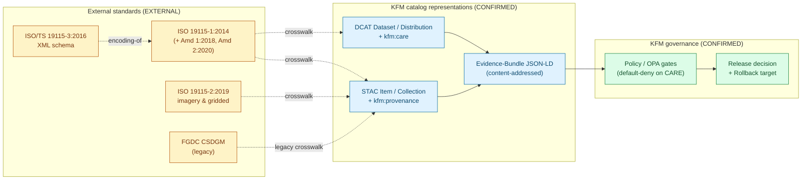

# ISO 19115 — Geographic Information Metadata (KFM Conformance Profile)

> **How the Kansas Frontier Matrix relates to the international standard for geospatial metadata: where KFM aligns, where KFM diverges, and how ISO 19115 conformance is *decided* rather than assumed.**

<!-- [KFM_META_BLOCK_V2]
doc_id: kfm://doc/standards/iso-19115
title: ISO 19115 — Geographic Information Metadata (KFM Conformance Profile)
type: standard
version: v0.1
status: draft
owners: TODO — Docs steward + Catalog steward (NEEDS VERIFICATION)
created: 2026-05-14
updated: 2026-05-14
policy_label: public
related:
  - docs/doctrine/directory-rules.md
  - docs/doctrine/truth-posture.md
  - docs/standards/STAC_KFM_PROFILE.md  # PROPOSED home
  - docs/standards/STAC_DWC_PROFILE.md  # PROPOSED home
  - docs/architecture/contract-schema-policy-split.md
  - docs/registers/VERIFICATION_BACKLOG.md
tags: [kfm, standards, metadata, geospatial, iso, fgdc, stac, dcat, care]
notes:
  - "Conformance posture is PROPOSED pending ADR (see §9 Q1)."
  - "Cite-or-abstain applies to all ISO conformance claims."
[/KFM_META_BLOCK_V2] -->


**Status:** draft &nbsp;·&nbsp; **Owners:** TODO — Docs steward + Catalog steward *(NEEDS VERIFICATION)* &nbsp;·&nbsp; **Last updated:** 2026-05-14

---

## Quick jump

- [§0 Status & Authority](#0-status--authority)
- [§1 Purpose & scope](#1-purpose--scope)
- [§2 ISO 19115 at a glance (EXTERNAL)](#2-iso-19115-at-a-glance-external)
- [§3 KFM's posture on ISO 19115](#3-kfms-posture-on-iso-19115)
- [§4 How ISO 19115 sits in the KFM catalog stack](#4-how-iso-19115-sits-in-the-kfm-catalog-stack)
- [§5 Field crosswalk: ISO 19115 → STAC + DCAT + KFM](#5-field-crosswalk-iso-19115--stac--dcat--kfm)
- [§6 CARE, rights, and constraints alignment](#6-care-rights-and-constraints-alignment)
- [§7 Conformance check protocol (PROPOSED)](#7-conformance-check-protocol-proposed)
- [§8 Anti-patterns](#8-anti-patterns)
- [§9 Open questions](#9-open-questions)
- [§10 Related docs](#10-related-docs)
- [Appendix A — ISO 19115 family reference](#appendix-a--iso-19115-family-reference-external)
- [Appendix B — Truth labels used here](#appendix-b--truth-labels-used-here)

---

## 0. Status & Authority

| Field | Value |
|---|---|
| **Document type** | Standards conformance profile (`docs/standards/…`). |
| **Authority of this profile** | **PROPOSED** — the conformance posture has not been ratified by ADR. |
| **Authority of ISO 19115 facts cited here** | **EXTERNAL** — sourced from ISO/TC 211, FGDC, and NASA ESDIS authoritative pages. |
| **Authority of KFM doctrine cited here** | **CONFIRMED** where it appears in the attached KFM corpus; **PROPOSED** where it is a design candidate. |
| **Canonical home** | `docs/standards/ISO-19115.md` — supported by Directory Rules §6.1 (`docs/standards/` is "external standards KFM conforms to"). Filename casing differs from the pattern `STAC_KFM_PROFILE.md` and is **NEEDS VERIFICATION** against a final naming convention. |
| **Owner** | **TODO** — Docs steward + Catalog steward *(NEEDS VERIFICATION)*. |
| **Reviewers required for change** | Docs steward + Catalog steward; **ADR required** if this profile would make ISO 19115 mandatory for any artifact family (see §9 Q1). |
| **Schema-home convention** | Any machine-checkable conformance shape goes under `schemas/contracts/v1/…` per **ADR-0001** (Directory Rules §0). |
| **Lifecycle invariant** | RAW → WORK / QUARANTINE → PROCESSED → CATALOG / TRIPLET → PUBLISHED. ISO conformance is a **CATALOG / PUBLISHED** concern; it never gates RAW ingestion. |
| **Supersedes** | None. First-time profile authored for `docs/standards/`. |

> [!IMPORTANT]
> This document does **not** declare KFM "ISO 19115 compliant." It declares **how KFM decides** the question, and what it would take to answer "yes" with evidence. Compliance claims without an `EvidenceBundle`, a `PolicyDecision`, and a `PromotionDecision` are prohibited by the KFM truth posture.

---

## 1. Purpose & scope

This profile establishes how the Kansas Frontier Matrix relates to **ISO 19115** — the international family of standards for geographic information metadata, maintained by **ISO/TC 211**. It exists to keep three things separate: (1) the *external standard*, (2) the *KFM catalog representations* that may carry ISO-shaped projections, and (3) the *governance machinery* that decides what is published, to whom, and on what terms.

### What this doc decides

- Where ISO 19115 sits relative to KFM's primary catalog representations (STAC + DCAT). **CONFIRMED** in KFM doctrine: STAC is the primary representation for spatiotemporal assets and DCAT for non-spatial assets (KFM category **C4 — Catalogs and Metadata Profiles**).
- How ISO 19115 field semantics are **crosswalked** to KFM's `kfm:provenance` and `kfm:care` namespaces. **PROPOSED.**
- What a "KFM ISO 19115 conformance check" should report and how it should behave at the promotion gate. **PROPOSED.**
- Anti-patterns that *look* like ISO conformance but are not. **CONFIRMED** by the broader KFM truth posture.

### What this doc does **not** decide

- Whether ISO 19115 is **mandatory** for any KFM artifact family. That is an **OPEN** verification question carried in the KFM backlog as: *"Which metadata standards are mandatory for each artifact family: STAC, DCAT, FGDC, ISO, or KFM profile?"* See §9 Q1.
- The XML encoding choice (ISO 19139 vs ISO/TS 19115-3:2016). **NEEDS VERIFICATION.** KFM currently publishes JSON catalog records via STAC and DCAT.
- The exact ISO **profile** (North American Profile, INSPIRE, ANZLIC, UK GEMINI, …) KFM would target if conformance is adopted. **NEEDS VERIFICATION.**
- Any claim about implementation in the mounted repository. No repository was inspected in this session; all repo-state claims here are **UNKNOWN**.

> [!NOTE]
> Directory Rules §3 reminds reviewers that responsibility root wins over topic. This file lives in `docs/standards/` not because the topic is "metadata," but because its **responsibility** is to explain how an external standard relates to KFM. Object meaning lives in `contracts/`, machine shape lives in `schemas/`, and policy decisions live in `policy/`.

---

## 2. ISO 19115 at a glance (EXTERNAL)

> [!NOTE]
> This section is **EXTERNAL**, sourced from ISO/TC 211, the U.S. FGDC, and NASA ESDIS. It is not KFM doctrine, does not override KFM terminology, and is included here only to ground the rest of the profile. See Appendix A for the full family reference.

**ISO 19115** is the international family of standards for describing geographic information through structured metadata. It is maintained by **ISO Technical Committee 211 (ISO/TC 211)** and used worldwide as the schema layer for catalog discovery, fitness-for-use assessment, data access, and transfer.

| Part | Title | Status (EXTERNAL) |
|---|---|---|
| **ISO 19115-1:2014** | Geographic information — Metadata — Part 1: Fundamentals | Published; ISO stage 90.92 ("to be revised"). |
| ISO 19115-1:2014/Amd 1:2018 | Amendment 1 | Published 2018-02. |
| ISO 19115-1:2014/Amd 2:2020 | Amendment 2 | Published 2020-11. |
| **ISO 19115-2:2019** | Part 2: Extensions for acquisition and processing (imagery & gridded data) | Published; supersedes ISO 19115-2:2009. |
| **ISO/TS 19115-3:2016** | XML schema implementation for Part 1 | Published technical specification. |

Per ISO/TC 211 and FGDC, ISO 19115-1:2014 defines a schema for metadata about *identification, extent, quality, spatial and temporal aspects, content, spatial reference, portrayal, distribution,* and *other properties* of digital geographic data and services. The U.S. FGDC formally endorsed **INCITS/ISO 19115-1:2014** alongside **INCITS/ISO 19157:2013[2014]** (data quality) in December 2016, positioning them as the modern successors to the FGDC **Content Standard for Digital Geospatial Metadata (CSDGM)**.

ISO 19115 is typically used together with related ISO/TC 211 standards:

- **ISO 19110** — methodology for feature cataloguing.
- **ISO 19111** — spatial referencing by coordinates.
- **ISO 19139** — older XML encoding (GMD); largely replaced for Part 1 by ISO/TS 19115-3:2016.
- **ISO 19157** — data quality.

Numerous national and regional **profiles** of ISO 19115 exist — the North American Profile (NAP), INSPIRE (EU), ANZLIC (AU/NZ), UK GEMINI, Marine Community Profile, and NASA ESDIS implementation guidance, among others. "ISO 19115 conformant" is only meaningful when paired with a named profile.

---

## 3. KFM's posture on ISO 19115

Three claims, with truth labels:

1. **CONFIRMED.** KFM's primary catalog representations are **STAC** for spatiotemporal assets and **DCAT** for non-spatial assets, each extended with KFM-specific namespaces — most prominently **`kfm:provenance`** (Item / Collection provenance) and **`kfm:care`** (CARE-aligned constraints). The doctrine slogan is *"remain STAC 1.0 compliant; extend via namespaced properties; enforce governance via profile schema + CI gates."*
2. **PROPOSED.** ISO 19115 is treated as a **conformance reference and crosswalk target**, not a primary catalog representation. It sits alongside FGDC CSDGM, DCAT, and the KFM profile as a standard whose conformance can be **checked**, **reported**, and **referenced** — but not (as of attached doctrine) **mandated**.
3. **OPEN.** Whether ISO 19115 (or a specific profile of it) is **mandatory** for any KFM artifact family is an unresolved verification item carried in the KFM backlog. See §9 Q1.

> [!IMPORTANT]
> The KFM truth posture is **cite-or-abstain**. Any KFM artifact that claims ISO 19115 conformance MUST resolve to an `EvidenceBundle` containing the conformance report, the named profile identifier, and a `PolicyDecision`. A "FAIR + CARE ✓" or "ISO 19115 ✓" badge without those three artifacts is **not** release authority — KFM doctrine is explicit that FAIR + CARE badges are not release authority.

---

## 4. How ISO 19115 sits in the KFM catalog stack



> [!NOTE]
> The dotted arrows are **crosswalks**, not pipelines. KFM does not ingest ISO 19115 XML and convert it into STAC; KFM produces STAC + DCAT first and computes ISO field equivalents *on demand* at the conformance-check boundary. **PROPOSED.** The diagram reflects doctrinal intent, not verified runtime behavior.

---

## 5. Field crosswalk: ISO 19115 → STAC + DCAT + KFM

> [!CAUTION]
> The crosswalk below is **PROPOSED** at the level of detail shown. Field mappings between ISO 19115 (a UML / XML metadata model) and STAC (flat JSON properties) are partial by nature, lossy in both directions, and sensitive to which ISO **profile** is targeted. Treat each row as a starting hypothesis for ADR — not as a settled binding.

| ISO 19115 concept (EXTERNAL) | Typical ISO element | KFM representation | Truth label |
|---|---|---|---|
| Identification | `MD_Identification` / `CI_Citation.title` | STAC `id` + `title`; DCAT `dct:identifier` + `dct:title` | PROPOSED |
| Spatial extent | `EX_GeographicBoundingBox` | STAC `bbox` + `geometry`; DCAT `dct:spatial` | PROPOSED |
| Temporal extent | `EX_TemporalExtent` | STAC `properties.datetime` / `start_datetime` / `end_datetime` | PROPOSED |
| Lineage | `LI_Lineage` (statement, sources, process steps) | `kfm:provenance.evidence_bundle_ref` + `links[rel=derived_from]` + PROV-O inside the EvidenceBundle | PROPOSED |
| Distribution | `MD_Distribution` (format, transfer options) | STAC `assets[*]`; DCAT `dcat:distribution`, `dcat:accessURL`, `dcat:mediaType` | PROPOSED |
| Constraints | `MD_Constraints` / `MD_LegalConstraints` / `MD_SecurityConstraints` | `kfm:care.steward_org`, `kfm:care.authority_to_control`, `kfm:rights_status`, `kfm:sensitivity` (see §6) | PROPOSED |
| Data quality | `DQ_DataQuality` (ISO 19157) | EvidenceBundle quality records + `kfm:provenance.run_record_ref` | PROPOSED |
| Reference system | `MD_ReferenceSystem` (ISO 19111) | STAC `proj:` extension; KFM **Coordinate Reference Profile** (Spatial Foundation domain) | PROPOSED |
| Responsible party | `CI_ResponsibleParty` | DCAT `dct:publisher`, `dcat:contactPoint`; `kfm:care.steward_org` | PROPOSED |
| Maintenance | `MD_MaintenanceInformation` | `kfm:release_state` + source descriptor cadence | PROPOSED |
| Per-file integrity | (not in ISO 19115; addressed by separate standards) | STAC `file:checksum`; KFM `kfm:provenance.spec_hash` | PROPOSED |

> [!TIP]
> The crosswalk is **bidirectional in principle, one-directional in practice**: KFM emits STAC + DCAT canonically and exposes ISO-shaped *views* via crosswalk for downstream catalogs that require them. Consuming ISO 19115 XML **from upstream sources** is a `SourceDescriptor` concern (under `connectors/` and `data/registry/sources/…`), not a catalog concern.

---

## 6. CARE, rights, and constraints alignment

ISO 19115 carries access and use constraints in `MD_LegalConstraints`, `MD_SecurityConstraints`, and `MD_Constraints`. KFM expresses the **same surface area** through a stricter, governance-bearing set of fields that does not collapse cleanly into ISO's flat constraint model.

| Concern | ISO 19115 (EXTERNAL) | KFM (CONFIRMED in doctrine) |
|---|---|---|
| Use rights | `MD_LegalConstraints.useConstraints` | `kfm:rights_status` (`public` / `open` / `controlled` / `restricted` / `unknown`); SPDX license or `NOASSERTION` |
| Access constraints | `MD_LegalConstraints.accessConstraints` | KFM **Sensitivity Rubric 0–5** (six-level); `kfm:sensitivity` (`public` / `generalize` / `restricted` / `review_required`) |
| Security | `MD_SecurityConstraints` | **Default-deny** via OPA on CARE-tagged assets (KFM C15-03) |
| Steward / authority | `CI_ResponsibleParty` (limited) | `kfm:care.steward_org`, `kfm:care.authority_to_control`, `kfm:care.consent`, `kfm:care.obligations`, `kfm:care.benefit_commitments` (**MetaBlock v2**) |

> [!WARNING]
> ISO 19115 has **no native model** for Indigenous data sovereignty, **CARE** principles, or community authority-to-control. Mapping the KFM `kfm:care.*` fields into `MD_LegalConstraints` flattens semantically distinct concepts into a single ISO field. KFM treats this as a **lossy down-projection**: the ISO-shaped view exists for catalog discoverability; the **authoritative** rights / sensitivity decision lives in the KFM EvidenceBundle and the OPA `PolicyDecision`, not in the ISO view. Any agent reading the ISO projection MUST resolve back to the EvidenceBundle before acting on it.

KFM doctrine treats this as the **engineering-side / ethics-side** pairing: *"FAIR by design, CARE in practice."* ISO 19115 fits naturally on the FAIR-by-design side. CARE-in-practice belongs to the policy layer.

---

## 7. Conformance check protocol (PROPOSED)

> [!NOTE]
> This protocol is **PROPOSED**, based on the KFM design candidate *"KFM catalog records should run metadata-standard conformance checks and record missing requirements before public release"* (Pass-18 inventory). No mounted-repo evidence has been verified for any implementation. Implementation maturity is **UNKNOWN**.

### Inputs

- A STAC Item or DCAT Dataset record from `data/catalog/…`.
- The KFM `kfm:provenance` and `kfm:care` blocks resolved through the linked EvidenceBundle.
- A **target ISO profile identifier** (e.g., `iso-19115-1:2014`, `iso-19115-nap-2`, `iso-19115-inspire-1.3`). **NEEDS VERIFICATION** for the canonical identifier shape.

### Output — `catalog_metadata_conformance_report`

PROPOSED report shape:

```json
{
  "profile": "iso-19115-1:2014",
  "subject_ref": "kfm://stac/item/<sha256>",
  "checked_at": "2026-05-14T00:00:00Z",
  "missing_required_fields": [],
  "warnings": [],
  "release_decision": "allow | abstain | deny",
  "evidence_ref": "kfm://bundle/<sha256>"
}
```

### Gate behavior (PROPOSED)

- **Default-deny** on publication when `missing_required_fields` is non-empty (consistent with **C5-02 Default-Deny Promotion**).
- **Abstain** when the target profile is unspecified or unresolvable (consistent with cite-or-abstain).
- **Allow** only when the report is signed, the EvidenceBundle resolves, and the `PolicyDecision` and `PromotionDecision` are captured.

### What this protocol is **not**

- Not a **re-publication path.** ISO conformance reports attach to the existing STAC / DCAT record; they do not create a parallel ISO catalog.
- Not a **rights decision.** CARE / sensitivity decisions remain with the KFM policy layer (C5, C6, C15).
- Not an **upstream admission gate.** Ingesting ISO 19115 XML from external sources goes through `connectors/` and `data/registry/sources/…` per Directory Rules, not through this protocol.

---

## 8. Anti-patterns

> [!CAUTION]
> The following patterns *look* like ISO 19115 conformance, but are not — and they violate KFM core invariants when used as release authority.

- **Badge-as-authority.** Rendering an "ISO 19115 ✓" badge in a README, layer panel, or report without a resolvable `EvidenceBundle`, a `PolicyDecision`, and a `PromotionDecision` is decorative, not authoritative. (KFM doctrine: *FAIR + CARE badges are not release authority.*)
- **One-shot field stuffing.** Populating ISO-shaped fields once at publication and never re-checking, instead of computing the conformance report at promotion time — makes catalog completeness an editorial afterthought rather than a validation result.
- **Crosswalk-as-truth.** Treating an ISO-shaped *view* of a STAC record as the canonical record. KFM's authoritative form is the STAC / DCAT record plus EvidenceBundle; the ISO view is a derived projection.
- **Constraint flattening.** Mapping `kfm:care.authority_to_control` to a generic `MD_LegalConstraints.useConstraints` string and concluding CARE is satisfied. CARE enforcement lives in OPA, not in metadata strings.
- **XML detour.** Adopting ISO 19139 / ISO/TS 19115-3 XML as a primary publication format. KFM publishes JSON; XML is an export concern at most. **NEEDS VERIFICATION** before any adoption.
- **Profile silence.** Reporting "ISO 19115 conformant" without naming the **specific profile** (NAP, INSPIRE, ANZLIC, UK GEMINI, NASA ESDIS, …) and its version. Conformance is undefined without a profile.
- **Parallel schema home.** Creating a new schema folder for ISO conformance shapes outside `schemas/contracts/v1/…` without an ADR. Directory Rules §2.4 requires an ADR before any parallel schema home.

---

## 9. Open questions

| # | Question | Disposition |
|---|---|---|
| **Q1** | Which metadata standards are **mandatory** for each KFM artifact family (STAC, DCAT, FGDC, ISO, KFM profile)? | **OPEN** — carried in the KFM verification backlog. **ADR required** to resolve. |
| Q2 | If ISO 19115 is adopted as mandatory, is the target ISO 19115-1:2014 directly, the **North American Profile (NAP)**, **INSPIRE**, or a **KFM-specific profile**? | NEEDS VERIFICATION. |
| Q3 | Does KFM ever emit native **ISO 19139** / **ISO/TS 19115-3** XML, or only JSON STAC / DCAT records with ISO-shaped crosswalk fields? | NEEDS VERIFICATION. |
| Q4 | How are **ISO 19115-2:2019** (imagery & gridded data) fields surfaced for KFM raster artifacts (COG, terrain tilesets) where the STAC `raster` and `eo` extensions already cover much of the same ground? | OPEN. |
| Q5 | Does **CARE** (`kfm:care`) map cleanly to any existing ISO 19115 extension mechanism, or does KFM need an explicit "CARE constraint" profile? | OPEN; tracked alongside the **C15-02** namespace-versioning policy. |
| Q6 | Is the conformance report (§7) a **per-Item** artifact, a **per-Collection** artifact, or both? | NEEDS VERIFICATION. |
| Q7 | What is the canonical **identifier shape** for the target profile (e.g., `iso-19115-1:2014` vs an IRI)? | NEEDS VERIFICATION. |

> [!IMPORTANT]
> Until **Q1** is resolved by ADR, no KFM artifact MAY claim "ISO 19115 mandatory conformance." Voluntary conformance reports are permitted and encouraged, provided they resolve to a real `EvidenceBundle` and name a specific profile.

[⬆ Back to top](#iso-19115--geographic-information-metadata-kfm-conformance-profile)

---

## 10. Related docs

| Path | Status | Why it matters |
|---|---|---|
| `docs/doctrine/directory-rules.md` | CONFIRMED authority | Decides where this file lives and where schemas / contracts / policy for ISO conformance go. |
| `docs/doctrine/truth-posture.md` | CONFIRMED authority | The cite-or-abstain rule that governs every conformance claim here. |
| `docs/standards/STAC_KFM_PROFILE.md` | PROPOSED home | The canonical STAC profile; ISO crosswalks ride on it. Existence in repo: NEEDS VERIFICATION. |
| `docs/standards/STAC_DWC_PROFILE.md` | PROPOSED home | STAC × Darwin Core hybrid for biodiversity. NEEDS VERIFICATION. |
| `docs/standards/DCAT.md` *(TODO)* | NOT VERIFIED | The companion non-spatial catalog profile, if/when authored. |
| `docs/standards/FGDC-CSDGM.md` *(TODO)* | NOT VERIFIED | Legacy FGDC CSDGM crosswalk; sits next to this profile. |
| `docs/standards/PROV-O.md` *(TODO)* | NOT VERIFIED | Provenance ontology profile referenced by the lineage row in §5. |
| `docs/architecture/contract-schema-policy-split.md` | CONFIRMED authority | Tells you where the conformance-report shape (§7) belongs. |
| `docs/adr/` | CONFIRMED authority | Where the Q1 ruling will land. |
| `docs/registers/VERIFICATION_BACKLOG.md` | CONFIRMED authority | Where Q1–Q7 are tracked. |

---

<details>
<summary><strong>Appendix A — ISO 19115 family reference (EXTERNAL)</strong></summary>

**Family map** (EXTERNAL, sourced from ISO/TC 211 and FGDC):

| Standard | Scope | Status (EXTERNAL) |
|---|---|---|
| ISO 19115-1:2014 | Fundamentals of geographic metadata | Published; stage 90.92 ("to be revised"). Amendments 1 (2018) and 2 (2020) apply. |
| ISO 19115-2:2019 | Extensions for imagery and gridded data | Published; supersedes ISO 19115-2:2009. |
| ISO/TS 19115-3:2016 | XML schema implementation for Part 1 | Published technical specification. |
| ISO 19139:2007 | Older XML encoding (GMD) | Largely superseded by 19115-3 for Part 1 records. |
| ISO 19110 | Feature cataloguing methodology | Companion standard. |
| ISO 19111 | Spatial referencing by coordinates | Companion standard. |
| ISO 19157:2013 | Data quality | Companion standard; FGDC-endorsed alongside 19115-1. |

**Relevant profiles** (EXTERNAL, non-exhaustive):

- **North American Profile (NAP)** — joint U.S. / Canada profile of ISO 19115.
- **INSPIRE Metadata Regulation** — European Union profile under the INSPIRE directive.
- **ANZLIC** — Australia / New Zealand profile.
- **UK GEMINI 2.1** — UK national profile.
- **NASA ESDIS implementation** — Earth Science Data Systems profile (approved July 2018).
- **UK AGMAP**, **Marine Community Profile**, **EDMED** — domain or jurisdictional profiles.

**Why this matters for KFM:** *"ISO 19115 conformant"* is meaningless without naming a profile. KFM doctrine on the `kfm:` namespace (short, stable, globally unique) suggests that if KFM ever publishes its own ISO 19115 profile, the profile identifier should follow the same convention.

</details>

<details>
<summary><strong>Appendix B — Truth labels used here</strong></summary>

| Label | Meaning in this document |
|---|---|
| **CONFIRMED** | Verified in this session from the attached KFM corpus. |
| **PROPOSED** | A design candidate that has not been ratified by ADR or verified in implementation. |
| **EXTERNAL** | Sourced from authoritative external research (ISO/TC 211, FGDC, NASA ESDIS, DCC). Does not override KFM doctrine. |
| **NEEDS VERIFICATION** | Checkable in principle; not checked strongly enough in this session to act as fact. |
| **OPEN** | An unresolved question carried in the KFM verification backlog. |
| **UNKNOWN** | Not resolvable without more evidence; typically a repository-state claim. |

Memory is not evidence. Recollection, guessed paths, and generic best practice are not facts in this document.

</details>

<details>
<summary><strong>Appendix C — Reviewer's quick checklist</strong></summary>

Before approving a KFM artifact that asserts ISO 19115 conformance:

- [ ] Does it name a **specific ISO profile** and version?
- [ ] Does it produce a `catalog_metadata_conformance_report` per §7?
- [ ] Does the report resolve to an `EvidenceBundle`?
- [ ] Is there a captured `PolicyDecision` and `PromotionDecision`?
- [ ] Are `kfm:care.*` fields populated where CARE applies — and **not** flattened into a generic ISO constraint string?
- [ ] Does the `release_state` align with the `release_decision` in the report?
- [ ] Is a **rollback target** named?

If any box is unchecked, abstain rather than approve.

</details>

---

### Footer

**Related docs:** [`directory-rules`](../doctrine/directory-rules.md) · [`STAC_KFM_PROFILE`](./STAC_KFM_PROFILE.md) *(PROPOSED home)* · [`STAC_DWC_PROFILE`](./STAC_DWC_PROFILE.md) *(PROPOSED home)* · [`contract-schema-policy-split`](../architecture/contract-schema-policy-split.md) · [`VERIFICATION_BACKLOG`](../registers/VERIFICATION_BACKLOG.md)

**Last updated:** 2026-05-14 &nbsp;·&nbsp; **Version:** v0.1 (draft) &nbsp;·&nbsp; [⬆ Back to top](#iso-19115--geographic-information-metadata-kfm-conformance-profile)
