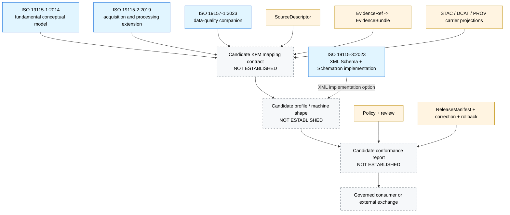

<!-- [KFM_META_BLOCK_V2]
doc_id: kfm://doc/standards/iso-19115
title: ISO 19115 Geographic Metadata — KFM Mapping Boundary and Conformance Plan
type: standard; metadata-guidance; interoperability-boundary
version: v2.0-draft
status: "draft; repository-grounded; upstream-currentness-refreshed; no-adoption; no-machine-profile; no-release; no-publication"
owners:
  - "@bartytime4life — verified GitHub review route through CODEOWNERS"
  - "NEEDS VERIFICATION — catalog-metadata, geospatial-interoperability, source, rights/sensitivity, schema/validation, and release stewards"
created: 2026-05-14
updated: 2026-08-18
policy_label: repository-facing
owning_root: docs/
responsibility: >
  Explain the current ISO 19115 family baseline, the bounded KFM repository
  relationship, candidate mappings, and the evidence required before KFM may
  claim an ISO profile, machine conformance, external interoperability, release,
  or publication.
truth_posture: >
  CONFIRMED current path, accepted standards-lane placement, CODEOWNERS route,
  selected repository contracts and fixture-only catalog-closure surfaces, and
  official ISO currentness / PROPOSED KFM mapping contract, application profile,
  encoding, fixtures, validators, producers, consumers, and graduation sequence /
  UNKNOWN adopted KFM ISO 19115 profile, ISO-specific machine implementation,
  complete producer-consumer coverage, released conformant record, public
  endpoint, and external interoperability.
related:
  - ./README.md
  - ./FGDC-CSDGM.md
  - ./STAC.md
  - ./STAC_KFM_PROFILE.md
  - ./DCAT.md
  - ./PROV-O.md
  - ./PROV.md
  - ./EVIDENCE_BUNDLE.md
  - ./RELEASE_MANIFEST.md
  - ../sources/catalog/CROSSWALKS.md
  - ../doctrine/directory-rules.md
  - ../adr/ADR-0029-adopt-directory-governance-standard-v2.md
  - ../../contracts/source/source_descriptor.md
  - ../../schemas/contracts/v1/source/source_descriptor.schema.json
  - ../../schemas/contracts/v1/evidence/evidence_bundle.schema.json
  - ../../schemas/contracts/v1/runtime/run_receipt.schema.json
  - ../../schemas/contracts/v1/release/release_manifest.schema.json
  - ../../schemas/contracts/v1/data/catalog_distribution_mapping_profile.schema.json
  - ../../schemas/contracts/v1/data/synthetic_release_catalog_closure_profile.schema.json
  - ../../.github/CODEOWNERS
tags: [kfm, standards, metadata, geospatial, iso-19115, iso-tc-211, stac, dcat, prov, fgdc, conformance, evidence]
notes:
  - "Same-path documentation modernization only; no contract, schema, policy, source, fixture, validator, workflow, runtime, catalog, release, or publication surface changes."
  - "The prior document-only and unmounted-repository posture is replaced with commit-pinned repository evidence and a separate official-source currentness review."
  - "ISO 19115-3:2023 replaces withdrawn ISO/TS 19115-3:2016; ISO 19115-2:2019/Amd 1:2022 and ISO 19157-1:2023 are now represented."
  - "No ISO-specific parser, emitter, XSD/Schematron bundle, KFM application profile, fixture family, validator, public endpoint, or released conformant record was established by this bounded review."
  - "The prior catalog_metadata_conformance_report example remains design lineage only and is not represented as a current repository contract."
[/KFM_META_BLOCK_V2] -->

<a id="top"></a>
<a id="iso-19115--geographic-information-metadata-kfm-conformance-profile"></a>
<a id="0-status--authority"></a>

# ISO 19115 Geographic Metadata — KFM Mapping Boundary and Conformance Plan

> **Operating rule.** ISO 19115 can describe geographic resources and support exchange. It cannot make a source authoritative, evidence sufficient, rights clear, sensitivity safe, review complete, or an artifact released or public.

[](https://www.iso.org/standard/53798.html)
[](https://www.iso.org/standard/67039.html)
[](https://www.iso.org/standard/80874.html)
[](#1--scope-responsibility-and-non-effects)
[](#4--current-kfm-repository-evidence)
[](#11--adoption-and-conformance-claim-ladder)
[](#1--scope-responsibility-and-non-effects)

> [!IMPORTANT]
> **A standards page is not a conformance profile or conformance proof.** This document does not adopt ISO 19115, select a KFM application profile, create an XML encoding path, define a machine-valid shape, activate a source, approve a release, or prove interoperability with an external catalog.

> [!CAUTION]
> **Current repository evidence is bounded.** KFM has human-readable ISO guidance, a proposed STAC × ISO crosswalk entry, current source/evidence/receipt/release object surfaces, and fixture-only STAC/DCAT/PROV alignment packets. No ISO-specific parser, emitter, XSD/Schematron bundle, mapping contract, fixture family, validator, producer, consumer, public endpoint, or released ISO-conformant record was established by this review.

> [!WARNING]
> **Metadata projection must not collapse KFM authority.** ISO identification, lineage, quality, distribution, and constraint elements may describe a resource. They do not replace `SourceDescriptor`, `EvidenceRef`, `EvidenceBundle`, policy, review, receipts, proofs, `ReleaseManifest`, correction, withdrawal, or rollback.

| Field | Current bounded result |
|---|---|
| **Evidence snapshot** | `main@c9cdafedec9e29fa8e9a28834601c1d426dd0e83` |
| **Prior target blob** | `54e5b5930484e91eb625a31ba979a8deffbd2ff0` |
| **Directory result** | `PLACE` at the existing `docs/standards/ISO-19115.md` path. Accepted ADR-0029 assigns human-readable standards guidance to `docs/standards/`. |
| **Official baseline checked** | 2026-08-18 against official ISO and FGDC pages |
| **Published fundamentals** | ISO 19115-1:2014 with Amendments 1:2018 and 2:2020 remains the published edition; a replacement edition is under development and is not yet the normative published baseline. |
| **Acquisition extension** | ISO 19115-2:2019 remains current and has Amendment 1:2022. |
| **Current XML implementation** | ISO 19115-3:2023; it replaces withdrawn ISO/TS 19115-3:2016. |
| **Current data-quality companion** | ISO 19157-1:2023. |
| **KFM adoption state** | **UNKNOWN / not established:** no accepted KFM ISO 19115 application-profile decision was identified. |
| **ISO-specific machine implementation** | **NOT ESTABLISHED** by bounded repository search. |
| **Bounded implementation evidence** | Fixture-only STAC/DCAT/PROV distribution alignment and synthetic release-catalog closure; both explicitly deny release/publication authority. |
| **Review route** | `@bartytime4life` through repository-default CODEOWNERS; specialist stewardship and independent review remain **NEEDS VERIFICATION**. |
| **Release/publication effect** | None. |

**Quick navigation:** [Scope](#1--scope-responsibility-and-non-effects) · [Upstream](#2--official-iso-family-baseline) · [Stack](#3--position-in-the-kfm-standards-stack) · [Repository](#4--current-kfm-repository-evidence) · [Mapping](#5--candidate-iso-to-kfm-concept-mapping) · [Conformance target](#6--model-profile-encoding-record-and-conformance) · [Rights](#7--rights-sensitivity-sovereignty-and-care-boundary) · [Paths](#8--candidate-interoperability-paths) · [Validation](#9--proposed-conformance-and-validation-plan) · [Example](#10--worked-example-illustrative) · [Claims](#11--adoption-and-conformance-claim-ladder) · [Anti-patterns](#12--anti-patterns) · [Backlog](#13--open-verification-backlog) · [Related](#14--related-repository-documents) · [References](#15--official-external-references) · [Checklist](#appendix-a--reviewer-checklist) · [Truth labels](#appendix-b--truth-labels)

---

<a id="1-purpose--scope"></a>
<a id="1--scope-responsibility-and-non-effects"></a>

## 1 · Scope, Responsibility, and Non-Effects

### 1.1 What this page owns

This page owns human-readable guidance for:

- the current published ISO 19115 family baseline relevant to KFM;
- the distinction between the ISO conceptual model, an application profile, an encoding, a metadata record, a mapping, and a conformance result;
- current KFM repository evidence involving source, evidence, catalog-carrier, receipt, and release surfaces;
- candidate mappings between ISO metadata concepts and current KFM object families;
- boundaries among ISO 19115, FGDC CSDGM, STAC, DCAT, PROV-O, source admission, evidence, policy, review, release, and public delivery;
- the evidence required before KFM may claim a profile, machine conformance, or external interoperability; and
- upstream-currentness and repository-verification backlog.

### 1.2 What this page does not own

| Question | Owning authority |
|---|---|
| Where this guidance belongs | Accepted [`ADR-0029`](../adr/ADR-0029-adopt-directory-governance-standard-v2.md), adopted [`directory-rules.md`](../doctrine/directory-rules.md), and [`docs/standards/README.md`](./README.md) |
| What a KFM source, evidence, receipt, release, or catalog object means | Accepted semantic contracts under `contracts/` |
| What machine shape is valid | Current schemas and accepted profile decisions under `schemas/` |
| What is allowed, denied, restricted, generalized, held, or abstained | `policy/`, source terms, sensitivity controls, and governed review |
| Whether a source may be activated or harvested | Source admission, rights review, `SourceDescriptor`, source registry, and connector controls |
| Whether evidence supports a claim | `EvidenceRef` resolution to `EvidenceBundle` and applicable evidence authorities |
| Whether code implements an ISO profile | Exact-revision code, mappings, encodings, fixtures, validators, tests, and observed producers/consumers |
| Whether an artifact may release or publish | Evidence/proof closure, policy, authorized review, release, correction, withdrawal, and rollback records |
| What ISO terms normatively mean | The purchased ISO standards, official ISO records, and any selected profile authority |

### 1.3 Non-effects

This same-path revision does **not**:

- adopt ISO 19115 or a KFM ISO application profile;
- make ISO metadata mandatory for any KFM artifact family;
- select ISO 19115-3 XML as a KFM publication format;
- copy or vendor ISO schemas, Schematron rules, or protected standard text;
- create a mapping contract, schema, context, fixture, validator, emitter, parser, service, endpoint, or catalog;
- modify `SourceDescriptor`, `EvidenceBundle`, `RunReceipt`, `ReleaseManifest`, STAC/DCAT/PROV closure packets, or another object family;
- assign source role, rights status, sensitivity, review state, or release state;
- activate a source, ingest live records, promote lifecycle state, approve policy, or authorize release;
- assert external interoperability; or
- merge, deploy, publish, or change repository settings.

[Back to top](#top)

---

<a id="2-iso-19115-at-a-glance-external"></a>
<a id="appendix-a--iso-19115-family-reference-external"></a>
<a id="2--official-iso-family-baseline"></a>

## 2 · Official ISO Family Baseline

The following currentness statements were checked against official ISO pages on 2026-08-18. They establish upstream publication state only; they do not establish KFM adoption or implementation.

| Standard | Current upstream state | KFM relevance |
|---|---|---|
| [ISO 19115-1:2014](https://www.iso.org/standard/53798.html) | Published Edition 1; remains current; two published amendments; stage 90.92, “to be revised” | Fundamental conceptual model for metadata about geographic information and services |
| ISO 19115-1:2014/Amd 1:2018 | Published amendment | Part of the exact current fundamentals baseline when a conformance target includes it |
| ISO 19115-1:2014/Amd 2:2020 | Published amendment | Part of the exact current fundamentals baseline when a conformance target includes it |
| [ISO/AWI 19115-1, Edition 2](https://www.iso.org/standard/91591.html) | Approved work item under development; intended to replace the 2014 edition | Watch item only; it is not a published replacement and must not silently govern current validation |
| [ISO 19115-2:2019](https://www.iso.org/standard/67039.html) | Published Edition 2; confirmed in 2024; one amendment | Acquisition and processing metadata, including imagery and gridded-data concerns |
| [ISO 19115-2:2019/Amd 1:2022](https://www.iso.org/standard/78888.html) | Published amendment | Must be named when included in an acquisition/processing conformance target |
| [ISO 19115-3:2023](https://www.iso.org/standard/80874.html) | Published current XML implementation | Defines integrated XML Schema and Schematron artifacts for the 19115-1 and 19115-2 conceptual models |
| [ISO/TS 19115-3:2016](https://www.iso.org/standard/32579.html) | Withdrawn on publication of the 2023 edition | Legacy migration reference only; not the current XML baseline |
| [ISO 19157-1:2023](https://www.iso.org/standard/78900.html) | Published current data-quality standard | Companion authority for quality concepts; does not itself define acceptable KFM quality thresholds |

### 2.1 Currentness rules for KFM documentation

1. A future conformance claim must name the exact **part**, **edition**, applicable **amendments**, and—when machine encoding is claimed—the **encoding edition**.
2. A draft or approved work item does not supersede the current published edition until ISO publishes the replacement.
3. A reference to `ISO/TS 19115-3:2016` must be labeled **withdrawn / legacy** unless it is documenting migration from that edition.
4. `ISO 19115` by itself is an imprecise family reference, not a complete machine-conformance target.
5. A national, regional, agency, or KFM profile must be named and versioned when the claim depends on that profile. A profile is not required merely to discuss the base standard, but profile-specific conformance cannot be implied from base-standard validation.
6. ISO publication state and KFM adoption state remain separate axes.

### 2.2 Copyright and implementation boundary

ISO standards are protected works. This page paraphrases public official descriptions and records identifiers, editions, and lifecycle state. A future implementation must obtain and use ISO materials under applicable terms; this repository update does not vendor schemas or reproduce normative clauses.

[Back to top](#top)

---

<a id="3-kfms-posture-on-iso-19115"></a>
<a id="4-how-iso-19115-sits-in-the-kfm-catalog-stack"></a>
<a id="3--position-in-the-kfm-standards-stack"></a>

## 3 · Position in the KFM Standards Stack

ISO 19115 is an external metadata conceptual-model family. KFM's current bounded catalog work uses STAC/DCAT/PROV carrier shapes in synthetic, non-public closure packets. An ISO relationship therefore needs an explicit mapping and conformance boundary; it must not be inferred from the presence of STAC, DCAT, PROV, or similar fields.


```mermaid
flowchart TD
    ISO1["ISO 19115-1:2014<br/>fundamental conceptual model"]
    ISO2["ISO 19115-2:2019<br/>acquisition and processing extension"]
    ISO3["ISO 19115-3:2023<br/>XML Schema + Schematron implementation"]
    QUAL["ISO 19157-1:2023<br/>data-quality companion"]

    MAP["Candidate KFM mapping contract<br/>NOT ESTABLISHED"]
    SHAPE["Candidate profile / machine shape<br/>NOT ESTABLISHED"]
    REPORT["Candidate conformance report<br/>NOT ESTABLISHED"]

    SRC["SourceDescriptor"]
    EVD["EvidenceRef -> EvidenceBundle"]
    CAT["STAC / DCAT / PROV carrier projections"]
    POL["Policy + review"]
    REL["ReleaseManifest + correction + rollback"]
    USE["Governed consumer or external exchange"]

    ISO1 --> MAP
    ISO2 --> MAP
    QUAL --> MAP
    MAP --> SHAPE
    ISO3 -. XML implementation option .-> SHAPE

    SRC --> MAP
    EVD --> MAP
    CAT --> MAP
    SHAPE --> REPORT
    POL --> REPORT
    REL --> REPORT
    REPORT --> USE

    classDef upstream fill:#e1f5ff,stroke:#0969da,color:#000;
    classDef authority fill:#fff4e1,stroke:#bf8b00,color:#000;
    classDef candidate fill:#f6f8fa,stroke:#6e7781,color:#000,stroke-dasharray:5 5;
    class ISO1,ISO2,ISO3,QUAL upstream;
    class SRC,EVD,CAT,POL,REL authority;
    class MAP,SHAPE,REPORT,USE candidate;
```

The dashed candidate surfaces in the diagram are not current runtime claims. They show the dependency order required to avoid turning a crosswalk into authority.

### 3.1 Standards do different jobs

| Surface | Primary job | Must not substitute for |
|---|---|---|
| ISO 19115-1 / -2 | Conceptual geographic-metadata model | KFM source, evidence, policy, review, or release authority |
| ISO 19115-3 | XML implementation and validation artifacts | A KFM decision to emit or ingest XML |
| ISO 19157-1 | Quality-description and evaluation framework | KFM product-specific quality thresholds or a release decision |
| STAC | Spatiotemporal asset discovery carrier | Evidence or release authority |
| DCAT | Dataset/distribution catalog carrier | Evidence or release authority |
| PROV-O | Provenance representation | Proof, policy, review, or release authority |
| FGDC CSDGM | Legacy U.S. metadata representation | Current ISO conformance or automatic migration correctness |
| KFM trust objects | Source, evidence, policy, review, receipt, proof, release, correction, and rollback state | Upstream standard definitions |

[Back to top](#top)

---

<a id="4--current-kfm-repository-evidence"></a>

## 4 · Current KFM Repository Evidence

The observations below are pinned to the evidence snapshot. They establish tracked bytes and bounded fixture behavior, not a complete ISO implementation or public interoperability.

| Surface | CONFIRMED observation | Safe conclusion |
|---|---|---|
| [`docs/standards/README.md`](./README.md) | The standards lane is repository-grounded and explicitly says a standards document is not conformance proof | Same-path modernization belongs here; the lane does not adopt ISO |
| Accepted [`ADR-0029`](../adr/ADR-0029-adopt-directory-governance-standard-v2.md) | Directory Rules v2 is accepted and `docs/standards/` owns human-readable standards guidance | `PLACE` at the current path; no structural migration is needed |
| [`CODEOWNERS`](../../.github/CODEOWNERS) | Repository-default review route is `@bartytime4life`; no dedicated standards specialist rule is present | One GitHub review route is verified; specialist and independent review are not |
| Prior `ISO-19115.md` | v0.1 draft dated 2026-05-14; contains an unmounted-repository posture and stale ISO 19115-3 baseline | Same-path semantic correction is warranted |
| [`CROSSWALKS.md`](../sources/catalog/CROSSWALKS.md) | STAC × ISO 19115 is registered as **PROPOSED — not yet authored** | A crosswalk backlog exists; an authored mapping contract does not |
| [`STAC_KFM_PROFILE.md`](./STAC_KFM_PROFILE.md) | Tracked v1 draft with proposal-era paths and profile claims | Document presence does not establish current profile adoption or machine parity |
| [`SourceDescriptor` contract](../../contracts/source/source_descriptor.md) and [schema](../../schemas/contracts/v1/source/source_descriptor.schema.json) | Current source-governance surfaces record identity, role, authority, rights, sensitivity, cadence, access, citation, and lifecycle posture; schema status remains `PROPOSED` | A future ISO import/export mapping has a governed source boundary; ISO does not become source authority |
| [`EvidenceBundle` schema](../../schemas/contracts/v1/evidence/evidence_bundle.schema.json) | Current evidence shape includes evidence references, source records, citations, and rights; schema status remains `PROPOSED` | A future conformance claim can bind evidence, but schema presence is not proof of ISO conformance |
| [`RunReceipt` schema](../../schemas/contracts/v1/runtime/run_receipt.schema.json) | Current receipt shape includes inputs, outputs, code reference, `spec_hash`, and source-descriptor references; schema status remains `PROPOSED` | A future transformation can be receipted; no ISO transform is established |
| [`ReleaseManifest` schema](../../schemas/contracts/v1/release/release_manifest.schema.json) | Current release shape carries artifacts and explicit negative authority defaults | A future ISO export would remain downstream of release authority |
| [`catalog_distribution_mapping_profile.schema.json`](../../schemas/contracts/v1/data/catalog_distribution_mapping_profile.schema.json) | Fixture-only STAC/DCAT/PROV distribution-carrier candidate; explicitly grants no catalog, evidence, policy, review, release, registry, or publication authority | Bounded carrier-alignment evidence exists; ISO is absent |
| [`synthetic_release_catalog_closure_profile.schema.json`](../../schemas/contracts/v1/data/synthetic_release_catalog_closure_profile.schema.json) | Fixture-only deterministic STAC/DCAT/PROV closure packet; `public_serving` is false and authority flags deny release/publication effects | Synthetic cross-profile closure exists; no public ISO catalog or release is proven |

### 4.1 Bounded search result

Repository searches for `MD_Metadata`, `iso19115`, `19115-3`, `catalog_metadata_conformance_report`, and related ISO identifiers did not establish an ISO-specific contract, schema/shape, parser, emitter, XSD/Schematron bundle, fixture family, validator, workflow, producer, consumer, public endpoint, or released record. The only `catalog_metadata_conformance_report` references found were documentation examples.

This is a bounded repository-search conclusion, not proof that no external branch, deployment, private consumer, or unindexed artifact exists.

### 4.2 Current maturity matrix

| Capability | Current bounded state |
|---|---|
| Human-readable ISO guidance | **CONFIRMED**, modernized by this change |
| Official-family currentness | **CONFIRMED** at the dated review |
| STAC × ISO mapping backlog | **CONFIRMED proposal entry** |
| Accepted KFM ISO application profile | **UNKNOWN / not established** |
| ISO-specific semantic mapping contract | **NOT ESTABLISHED** |
| ISO-specific machine shape or XML schema binding | **NOT ESTABLISHED** |
| Positive/negative ISO fixture family | **NOT ESTABLISHED** |
| ISO-specific validator | **NOT ESTABLISHED** |
| ISO parser or emitter | **NOT ESTABLISHED** |
| Observed producer-consumer interoperability | **NOT ESTABLISHED** |
| Released ISO-conformant record | **NONE established** |
| Public ISO endpoint or clearinghouse publication | **NONE established** |

[Back to top](#top)

---

<a id="5-field-crosswalk-iso-19115--stac--dcat--kfm"></a>
<a id="5--candidate-iso-to-kfm-concept-mapping"></a>

## 5 · Candidate ISO-to-KFM Concept Mapping

> [!CAUTION]
> The table below is a **PROPOSED semantic mapping aid**, not a field-level contract. ISO 19115 is a conceptual model with conditionality, associations, code lists, multiplicity, and profile rules. STAC/DCAT/KFM projections are not lossless substitutes. Exact bindings require a selected normative target, consumer, mapping contract, fixtures, and tests.

| ISO concept family | Candidate KFM source | Candidate exchange projection | Boundary |
|---|---|---|---|
| Resource identification and citation | `SourceDescriptor`, governed catalog record, release metadata | STAC Item/Collection identifiers and titles; DCAT identifiers and titles | Identifier equivalence must be decided per object family; `spec_hash` is not automatically a citation identifier |
| Resource scope and hierarchy | Source/dataset/version contracts | STAC Collection/Item relations; DCAT Dataset/Distribution relations | Dataset, series, service, feature, and file scopes must not be collapsed |
| Responsible party | Publisher/steward fields in `SourceDescriptor` and governed review records | DCAT publisher/contact projection or ISO responsibility role | A contact or publisher is not automatically the KFM release authority |
| Spatial extent | Governed geometry/extent fields on domain and catalog records | STAC geometry/bbox; DCAT spatial coverage; ISO geographic extent | Geometry precision, CRS, and sensitivity transforms must remain explicit |
| Temporal extent and dates | Domain temporal authority plus source/retrieval/release/correction times | STAC datetime/interval; DCAT temporal; ISO extent/citation dates | Observation, valid, publication, retrieval, revision, and correction time are distinct |
| Distribution and transfer | Released artifact and `ReleaseManifest` | STAC assets; DCAT distributions; ISO distribution/transfer options | Access URL is not release authority; byte digest, rights, and release state remain required |
| Lineage and process history | `EvidenceBundle`, `RunReceipt`, correction lineage | PROV projection; ISO lineage/process-step view | A lineage string is a lossy summary; evidence and receipts remain authoritative |
| Data quality | Validation reports, method records, domain quality objects | ISO 19157-aligned quality view; bounded STAC/DCAT quality summaries | ISO quality description does not set acceptable thresholds or approve release |
| Reference system | Governed CRS/datum metadata | STAC projection extension or ISO reference-system view | CRS identifiers and axis/order semantics require exact validation |
| Maintenance and revision | Source cadence, release state, correction/supersession records | ISO maintenance view; catalog update metadata | Cadence is not freshness proof; stale and withdrawn states must propagate |
| Legal and security constraints | Rights/sensitivity policy, source terms, review obligations | ISO legal/security constraint view | Projection is descriptive and potentially lossy; KFM policy remains authoritative |
| Acquisition and processing | Source/instrument/acquisition metadata plus `RunReceipt` | ISO 19115-2 view; STAC EO/raster or domain extensions where applicable | A source-native acquisition record must not be invented from a derived artifact |

### 5.1 Required mapping properties

Any future field-level crosswalk should record, for every mapping:

- source object and exact field/path;
- target ISO part, edition, class/property, code list, and multiplicity;
- direction (`KFM -> ISO`, `ISO -> KFM`, or both);
- transform function and normalization rules;
- required source role and lifecycle state;
- lossiness (`lossless`, `partial`, `summary`, or `not representable`);
- rights/sensitivity and precision effect;
- null/unknown/conflict behavior;
- identifier and digest semantics;
- correction and supersession behavior;
- fixture IDs and validator assertion; and
- accountable owner and review evidence.

[Back to top](#top)

---

<a id="6--model-profile-encoding-record-and-conformance"></a>

## 6 · Model, Profile, Encoding, Record, and Conformance

Conformance language is unsafe when these layers are collapsed.

| Layer | Meaning | Example | KFM requirement before claiming it |
|---|---|---|---|
| Conceptual model | Abstract classes, associations, properties, code lists, and constraints | ISO 19115-1 and ISO 19115-2 | Exact edition/amendments identified; semantic mapping reviewed |
| Application profile | A community-specific subset, obligation set, extension set, and guidance | A national, agency, domain, or future KFM profile | Profile authority, identifier, version, cardinality, code lists, and governance accepted |
| Encoding | Machine representation of the model/profile | ISO 19115-3:2023 XML Schema and Schematron | Encoding edition, namespace set, schema provenance, and validation toolchain pinned |
| Metadata record | One concrete metadata instance | One XML record or governed JSON projection | Subject identity, scope, source, rights, evidence, and release binding established |
| Mapping/crosswalk | Transformation between models or carriers | KFM/STAC/DCAT/PROV to ISO view | Direction, lossiness, transforms, fixtures, and correction behavior explicit |
| Validation result | Evidence that a specific record passed a bounded rule set | XSD + Schematron + profile checks | Validator version, normative target, inputs, outputs, digest, and negative tests recorded |
| Interoperability result | Evidence that a named producer and consumer exchanged records successfully | KFM exporter to a named catalog | Exact revisions, transport, acceptance criteria, observed run, and limitations recorded |
| Release/publication | Governed exposure of an approved artifact | Released metadata distribution | Evidence, policy, review, manifest, correction, withdrawal, and rollback closure complete |

### 6.1 Minimum claim grammar

Prefer precise statements:

- “This record validated against ISO 19115-3:2023 XSD and Schematron artifacts, plus profile X version Y, using validator Z at revision R.”
- “This mapping covers the listed identification, extent, distribution, and lineage concepts; rights/CARE content remains a KFM extension and is not fully represented in the ISO view.”
- “Interoperability was observed with consumer C for fixture set F; broader consumer compatibility remains unknown.”

Avoid unbounded statements:

- “KFM is ISO compliant.”
- “This dataset is ISO certified.”
- “STAC is equivalent to ISO 19115.”
- “The XML validates, therefore publication is allowed.”

[Back to top](#top)

---

<a id="6-care-rights-and-constraints-alignment"></a>
<a id="7--rights-sensitivity-sovereignty-and-care-boundary"></a>

## 7 · Rights, Sensitivity, Sovereignty, and CARE Boundary

ISO 19115 includes metadata concepts for legal, security, and other constraints. Those concepts can carry descriptive information, but they do not replace KFM's source terms, rights decision, sensitivity classification, sovereignty/authority-to-control review, or release policy.

| Concern | Candidate ISO-facing representation | KFM authority that must remain resolvable |
|---|---|---|
| License and use conditions | Legal/use-constraint metadata and citation to authoritative terms | `SourceDescriptor`, rights evidence, exact license/terms version, policy obligations |
| Access restrictions | Access/security constraint metadata | Sensitivity policy, access role, review decision, release scope |
| Precise or harmful location | Generalized extent plus a statement that transformation occurred | Original protected geometry, transform receipt, public-safe geometry, reason and reviewer |
| Indigenous/community authority | Profile extension or external reference where the selected profile permits it | Steward/authority-to-control evidence, consent/obligations, sovereignty review |
| Living-person, genomic, archaeology, rare-species, or infrastructure data | Restricted/generalized public metadata or no public record | Domain policy, qualified review, redaction/generalization, staged access or denial |
| Correction and withdrawal | Maintenance/revision metadata and replacement links | KFM correction notice, withdrawal state, release supersession, cache/search/map/AI propagation |

> [!WARNING]
> A down-projected ISO constraint string is not evidence that CARE, sovereignty, consent, privacy, geoprivacy, or KFM sensitivity obligations were satisfied. Any consequential consumer must resolve the governed KFM evidence and policy state rather than act on the projection alone.

### 7.1 Fail-closed rules

A future ISO export or import must hold, abstain, restrict, generalize, quarantine, or deny when:

- rights or source terms are unknown;
- the responsible authority or source role is unresolved;
- the profile cannot represent a material obligation without loss;
- exact geometry would expose sensitive or harmful precision;
- a source record conflicts with KFM evidence or correction state;
- the target consumer would strip mandatory KFM obligations; or
- release, correction, withdrawal, or rollback binding is missing.

[Back to top](#top)

---

<a id="8--candidate-interoperability-paths"></a>

## 8 · Candidate Interoperability Paths

The existence of an ISO standard does not choose a runtime path. Each path needs a named use case, owner, consumer, and acceptance boundary.

### 8.1 KFM-to-ISO export view — PROPOSED

```text
released KFM object
  -> resolve source + EvidenceBundle + rights/sensitivity + correction state
  -> apply reviewed KFM-to-ISO mapping
  -> emit profile-specific record
  -> validate encoding + profile + KFM obligations
  -> bind receipt and conformance evidence
  -> deliver to named governed consumer
```

This is the safest first interoperability direction because KFM remains the authority for its own source, evidence, policy, and release state. The ISO record is a derived exchange view, not a new canonical store.

### 8.2 ISO-to-KFM source intake — PROPOSED

```text
external ISO record
  -> SourceDescriptor and source-admission checks
  -> immutable capture / digest
  -> encoding + profile identification
  -> parse to WORK candidate
  -> preserve unmapped content and loss report
  -> validate source role, identity, rights, sensitivity, time, and geometry
  -> evidence review / quarantine as needed
```

An ISO-valid record can still be stale, incorrect, unauthorized, over-precise, or unsuitable for KFM. Validation therefore cannot bypass source admission or evidence review.

### 8.3 Federated catalog exchange — NEEDS VERIFICATION

A federation target should be named before KFM chooses a profile, XML serialization, endpoint, or compatibility commitment. Consumer-driven evidence should answer:

- Which catalog, clearinghouse, agency, archive, or tool consumes the record?
- Which exact profile and version does it require?
- Does it require XML, an API, file delivery, or another transport?
- Which fields are mandatory, conditional, ignored, or extended?
- How does it represent corrections, withdrawals, restricted records, and non-public resources?
- Can it preserve KFM rights, sensitivity, and evidence links?

[Back to top](#top)

---

<a id="7-conformance-check-protocol-proposed"></a>
<a id="9--proposed-conformance-and-validation-plan"></a>

## 9 · Proposed Conformance and Validation Plan

> [!IMPORTANT]
> The prior `catalog_metadata_conformance_report` JSON example is **design lineage only**. Repository search did not establish it as a current contract, schema, fixture, validator, or emitted artifact. A future implementation must reuse existing outcome and authority conventions rather than creating a parallel trust object in documentation.

### 9.1 Dependency-ordered graduation

| Phase | Required evidence | Explicit non-effect |
|---|---|---|
| 1. Consumer and target decision | Named producer, consumer, resource scope, ISO parts/editions/amendments, profile, encoding, transport, rights constraints | Does not create a profile or implementation |
| 2. Semantic mapping contract | Reviewed concept/field mapping, direction, lossiness, identifier semantics, null/conflict behavior, correction rules | Does not make machine records valid |
| 3. Machine profile/shape | Versioned XSD/Schematron/profile binding or other approved machine projection in the canonical schema authority | Does not prove producer or consumer behavior |
| 4. Fixture family | Supported, missing-required, invalid-code-list, wrong-scope, rights-unknown, sensitivity, stale, corrected, withdrawn, digest-mismatch, and unsupported-profile fixtures | Synthetic success does not grant release |
| 5. Deterministic validator | No-network where practical; pinned normative artifacts; stable reason codes; exact input/output digests; no mutation | Validator success does not decide policy or release |
| 6. Producer and consumer proof | Export/import implementation, replay, round-trip/loss report, observed named-consumer result | One consumer does not prove universal interoperability |
| 7. Governed release | Evidence/proof closure, policy, authorized review, `ReleaseManifest`, correction, withdrawal, rollback, and public-safe delivery | Merge or deployment alone is not publication authority |

### 9.2 Minimum conformance evidence

A future conformance result should identify at least:

- subject record and governed resource identity;
- ISO part(s), edition(s), amendment(s), encoding, and profile identifier;
- normative artifact provenance and digest where licensing permits local validation;
- validator name, version, code revision, configuration, and execution time;
- XSD, Schematron, profile, mapping, and KFM-obligation results kept distinct;
- stable findings with severity and machine-readable reason codes;
- source/evidence/release references and subject digest;
- rights/sensitivity and lossiness summary;
- correction/supersession relationship;
- producer and intended consumer; and
- explicit statement of what the result does **not** authorize.

### 9.3 Required negative tests

At minimum, fail or hold safely for:

- unspecified part/edition/profile;
- use of withdrawn ISO/TS 19115-3:2016 as the current encoding;
- missing mandatory or conditional content under the selected profile;
- invalid code-list or namespace value;
- incorrect resource scope or hierarchy;
- contradictory spatial or temporal extent;
- source/evidence/release identity mismatch;
- digest or receipt mismatch;
- unknown rights or sensitivity;
- over-precise protected geometry;
- stale, corrected, withdrawn, or superseded subject state;
- lossy mapping presented as lossless;
- external consumer rejection; and
- network or parser failure without an unsafe fallback.

### 9.4 Validation outcome boundary

No new ISO-specific outcome vocabulary is established here. A future contract must align with accepted KFM finite outcomes and distinguish:

- machine validity;
- mapping completeness/lossiness;
- source/evidence status;
- policy/review status;
- interoperability observation; and
- release/publication status.

These axes must not be collapsed into one `compliant: true` flag.

[Back to top](#top)

---

<a id="10--worked-example-illustrative"></a>

## 10 · Worked Example — Illustrative

The example below is synthetic. It demonstrates the mapping boundary; it is not a Kansas fact, repository fixture, conformance record, or released artifact.

| Concern | Governed KFM input | Candidate ISO-facing view | What remains outside the view |
|---|---|---|---|
| Subject | Released public-safe raster dataset with stable artifact and release IDs | Dataset identification and citation | Internal candidate IDs and unpublished source captures |
| Extent | Reviewed generalized Kansas-wide bbox and validity interval | Geographic and temporal extent | Protected source geometry and transformation rationale |
| Distribution | Released COG with media type, byte digest, and governed access URL | Distribution format and transfer option | Release authorization, storage credentials, cache policy |
| Lineage | EvidenceBundle plus RunReceipt and correction lineage | Lineage statement, sources, and process-step summary | Full evidence excerpts, policy reasoning, protected details |
| Quality | Domain validation report with method and limitations | ISO 19157-aligned quality summary | Product-specific acceptance decision and reviewer judgment |
| Constraints | Known license plus public sensitivity decision | Legal/access constraint summary | CARE/authority-to-control evidence and policy decision details |
| Responsible party | Verified source publisher and KFM steward roles | Appropriate responsibility roles | GitHub CODEOWNER is not automatically the data steward or release authority |

A validator could prove that the candidate exchange record satisfies a selected encoding/profile for this synthetic case. It could not prove that the source is true, the evidence is sufficient, the policy decision is correct, or release is authorized.

[Back to top](#top)

---

<a id="11--adoption-and-conformance-claim-ladder"></a>

## 11 · Adoption and Conformance Claim Ladder

Use the narrowest claim supported by evidence.

| State | Evidence needed | Permitted statement |
|---|---|---|
| Reference only | Current official standard identifier and bounded guidance | “KFM documents the ISO 19115 relationship.” |
| Mapping draft | Reviewed candidate mapping with explicit gaps and lossiness | “A candidate KFM-to-ISO mapping exists for the listed concepts.” |
| Profile decided | Accepted authority names exact parts, amendments, profile, encoding, scope, and obligations | “KFM has adopted profile X version Y for scope S.” |
| Machine profile implemented | Shape/binding, fixtures, validator, deterministic tests, and negative cases | “Records in fixture family F pass the bounded profile validator.” |
| Producer implemented | Export/import code and replay evidence at an exact revision | “Producer P emits records for scope S under profile X.” |
| Consumer interoperability observed | Named consumer accepts representative records under stated conditions | “Interoperability was observed with consumer C for test set F.” |
| Released | Governed release, evidence/proof closure, policy/review, correction, withdrawal, and rollback | “Release R includes records validated to profile X.” |
| Published | Public-safe delivery and observed public endpoint state | “Endpoint E serves release R under the stated public scope.” |

At the evidence snapshot, KFM is at **reference only**, with **mapping backlog** and bounded non-ISO catalog-closure fixtures. Higher claims remain unestablished.

[Back to top](#top)

---

<a id="8-anti-patterns"></a>
<a id="12--anti-patterns"></a>

## 12 · Anti-Patterns

- **Badge as authority.** An “ISO 19115 ✓” badge without a resolvable conformance result, evidence, policy/review, and release binding is decoration.
- **Family-name ambiguity.** Claiming “ISO 19115 compliant” without the exact part, edition, amendments, encoding, scope, and profile where applicable.
- **Stale encoding baseline.** Treating withdrawn ISO/TS 19115-3:2016 as the current XML implementation.
- **Draft as current law.** Applying ISO/AWI 19115-1 Edition 2 as though it already replaced the published 2014 edition.
- **Crosswalk as truth.** Treating an ISO-shaped view as the canonical KFM source, evidence, policy, or release record.
- **Constraint flattening.** Converting rights, sovereignty, consent, sensitivity, or CARE obligations into one free-text constraint and declaring them satisfied.
- **XML detour.** Adding XML because an encoding exists, without a named producer/consumer requirement and lifecycle cost model.
- **Validation collapse.** Treating XSD/Schematron success as evidence sufficiency, policy allow, review approval, release authorization, or publication.
- **Synthetic overreach.** Treating fixture-only STAC/DCAT/PROV closure as ISO implementation or public catalog proof.
- **Ingest/release collapse.** Letting a valid external ISO record bypass `SourceDescriptor`, evidence review, rights/sensitivity checks, or quarantine.
- **Lossless-by-assumption.** Failing to record unmapped content, multiplicity changes, code-list translations, precision loss, or unsupported extensions.
- **Parallel authority.** Creating ISO-specific contracts, schemas, policy, fixtures, reports, or release records in a convenience directory instead of their owning responsibility roots.
- **Silent correction.** Regenerating exchange records without preserving supersession, withdrawal, correction, and prior-release lineage.
- **Search overclaim.** Treating absence from bounded repository search as proof that no external or unindexed implementation exists.

[Back to top](#top)

---

<a id="9-open-questions"></a>
<a id="13--open-verification-backlog"></a>

## 13 · Open Verification Backlog

| ID | Question | Resolution mode | Current disposition |
|---|---|---|---|
| ISO-KFM-01 | Which concrete producer, consumer, or federation requires ISO metadata from KFM? | Governance + external consumer evidence | **UNKNOWN**; blocks profile selection |
| ISO-KFM-02 | Which exact ISO 19115 parts, editions, amendments, resource scopes, and profile should govern the first slice? | Architecture decision + official-source review | **NEEDS VERIFICATION** |
| ISO-KFM-03 | Does KFM need native ISO 19115-3:2023 XML, another encoding, or only a documented semantic mapping? | Consumer-driven decision | **NEEDS VERIFICATION** |
| ISO-KFM-04 | Should the first direction be KFM-to-ISO export, ISO-to-KFM intake, or both? | Architecture/source decision | **PROPOSED:** export-first is safer |
| ISO-KFM-05 | How should ISO 19115-2 acquisition/processing concepts map to STAC EO/raster and domain acquisition metadata without duplication? | Contract/schema research | **OPEN** |
| ISO-KFM-06 | How should ISO 19157-1 quality concepts map to KFM validation, methods, uncertainty, and product-specific thresholds? | Domain + validation decision | **OPEN** |
| ISO-KFM-07 | Which rights, sovereignty, consent, CARE, privacy, and sensitivity concepts are not representable in the selected profile? | Policy/steward review | **OPEN; fail closed** |
| ISO-KFM-08 | What is the stable profile identifier and versioning/deprecation policy? | ADR or profile authority | **NEEDS VERIFICATION** |
| ISO-KFM-09 | Is conformance evaluated per record, dataset, collection, service, release, or multiple scopes? | Contract decision | **NEEDS VERIFICATION** |
| ISO-KFM-10 | What normative ISO artifacts may be vendored, cached, or referenced under applicable copyright and license terms? | Legal/rights + tooling review | **NEEDS VERIFICATION** |
| ISO-KFM-11 | Which parser/emitter and validation toolchain can provide deterministic, no-network replay for the chosen scope? | Technical spike + measured tests | **NEEDS VERIFICATION** |
| ISO-KFM-12 | Which correction, withdrawal, and tombstone behavior does the target consumer support? | Consumer test | **UNKNOWN** |
| ISO-KFM-13 | Who owns the mapping, machine profile, validator, source intake, policy review, release review, and external interoperability result? | Stewardship decision | **NEEDS VERIFICATION** |
| ISO-KFM-14 | How will upstream currentness be watched without letting a watcher change validation or publication authority? | Documentation/tooling decision | **PROPOSED:** watcher opens review work only |

### Recommended next bounded slice

Before implementing XML or a validator, prepare a maintainer decision packet that names one real consumer, one resource family, one direction, one exact normative target, one rights/sensitivity posture, and one fixture-only acceptance boundary. If those choices close, the smallest implementation slice is a no-network semantic mapping contract plus synthetic positive/negative fixtures—without source activation, public serving, release, or publication.

[Back to top](#top)

---

<a id="10-related-docs"></a>
<a id="14--related-repository-documents"></a>

## 14 · Related Repository Documents

| Path | Current role | Boundary |
|---|---|---|
| [`docs/standards/README.md`](./README.md) | Standards-lane boundary and inventory | Navigation and evidence limits only |
| [`FGDC-CSDGM.md`](./FGDC-CSDGM.md) | Legacy U.S. geospatial-metadata guidance | Does not establish ISO migration correctness |
| [`STAC.md`](./STAC.md) | STAC guidance | Does not establish KFM profile adoption or ISO equivalence |
| [`STAC_KFM_PROFILE.md`](./STAC_KFM_PROFILE.md) | Tracked KFM STAC draft | Proposal-era document; machine/adoption state requires separate verification |
| [`DCAT.md`](./DCAT.md) | DCAT guidance | Catalog vocabulary guidance, not evidence or release authority |
| [`PROV-O.md`](./PROV-O.md) and [`PROV.md`](./PROV.md) | Provenance guidance | Representation does not replace proof or evidence |
| [`EVIDENCE_BUNDLE.md`](./EVIDENCE_BUNDLE.md) | Human-readable evidence-bundle profile | Underlying contract/schema and runtime evidence remain authoritative |
| [`RELEASE_MANIFEST.md`](./RELEASE_MANIFEST.md) | Human-readable release-manifest profile | Does not authorize release by itself |
| [`CROSSWALKS.md`](../sources/catalog/CROSSWALKS.md) | Crosswalk register | Records STAC × ISO as proposed/not authored |
| [`directory-rules.md`](../doctrine/directory-rules.md) | Accepted placement law through ADR-0029 | Placement authority, not standards adoption |
| [`source_descriptor.md`](../../contracts/source/source_descriptor.md) | SourceDescriptor semantic contract | Source role/rights/sensitivity boundary for imports and exports |
| [`source_descriptor.schema.json`](../../schemas/contracts/v1/source/source_descriptor.schema.json) | Current machine source-descriptor surface | Status is `PROPOSED`; canonical/legacy path note remains visible |
| [`evidence_bundle.schema.json`](../../schemas/contracts/v1/evidence/evidence_bundle.schema.json) | Current machine evidence-bundle surface | Status is `PROPOSED` |
| [`run_receipt.schema.json`](../../schemas/contracts/v1/runtime/run_receipt.schema.json) | Current machine run-receipt surface | Status is `PROPOSED` |
| [`release_manifest.schema.json`](../../schemas/contracts/v1/release/release_manifest.schema.json) | Current machine release-manifest surface | Negative authority defaults are explicit |
| [`catalog_distribution_mapping_profile.schema.json`](../../schemas/contracts/v1/data/catalog_distribution_mapping_profile.schema.json) | Fixture-only STAC/DCAT/PROV carrier candidate | No ISO carrier and no release/publication authority |
| [`synthetic_release_catalog_closure_profile.schema.json`](../../schemas/contracts/v1/data/synthetic_release_catalog_closure_profile.schema.json) | Fixture-only STAC/DCAT/PROV closure packet | Public serving and publication remain false |

[Back to top](#top)

---

<a id="15--official-external-references"></a>

## 15 · Official External References

Accessed 2026-08-18. Official records should be rechecked before a version pin, profile decision, implementation, or conformance claim.

- [ISO 19115-1:2014 — Geographic information — Metadata — Part 1: Fundamentals](https://www.iso.org/standard/53798.html)
- [ISO/AWI 19115-1 — Edition 2 work item](https://www.iso.org/standard/91591.html)
- [ISO 19115-2:2019 — Extensions for acquisition and processing](https://www.iso.org/standard/67039.html)
- [ISO 19115-2:2019/Amd 1:2022](https://www.iso.org/standard/78888.html)
- [ISO 19115-3:2023 — XML schema implementation for fundamental concepts](https://www.iso.org/standard/80874.html)
- [ISO/TS 19115-3:2016 — withdrawn legacy edition](https://www.iso.org/standard/32579.html)
- [ISO 19157-1:2023 — Data quality — Part 1: General requirements](https://www.iso.org/standard/78900.html)
- [FGDC — ISO Geospatial Metadata Standards](https://www.fgdc.gov/metadata/iso-standards)
- [FGDC — Selecting a Geospatial Metadata Standard](https://www.fgdc.gov/metadata/selecting-a-geospatial-metadata-standard)

> [!NOTE]
> FGDC guidance provides U.S. federal context and transition advice. It does not decide KFM's application profile, consumer, encoding, source rights, or release posture.

[Back to top](#top)

---

<a id="appendix-a--reviewer-checklist"></a>

## Appendix A · Reviewer's Checklist

Before approving any KFM statement that asserts ISO 19115 profile adoption, machine conformance, or interoperability:

- [ ] Is the exact ISO part, edition, amendment set, encoding, profile, resource scope, and claim scope named?
- [ ] Is the upstream status current at a dated official-source review?
- [ ] Is withdrawn ISO/TS 19115-3:2016 excluded from current-baseline claims?
- [ ] Is a reviewed semantic mapping contract present with direction and lossiness?
- [ ] Is the subject identity bound to source, evidence, receipt, and release identities?
- [ ] Are rights, sensitivity, sovereignty, consent, CARE, and harmful-precision obligations preserved outside any lossy ISO projection?
- [ ] Are normative validation artifacts and the validator/toolchain pinned and legally usable?
- [ ] Do positive and fail-closed negative fixtures cover the selected profile and KFM obligations?
- [ ] Is the result bounded separately for syntax, profile, mapping, source/evidence, policy/review, interoperability, and release?
- [ ] Is producer-consumer behavior observed at exact revisions rather than inferred from docs?
- [ ] Are correction, withdrawal, supersession, and rollback paths tested?
- [ ] Does the claim avoid turning a badge, document, commit, PR, fixture, or validator pass into publication authority?

If the evidence does not support the requested claim, narrow it or abstain.

[Back to top](#top)

---

<a id="appendix-b--truth-labels-used-here"></a>
<a id="appendix-b--truth-labels"></a>

## Appendix B · Truth Labels

| Label | Meaning in this document |
|---|---|
| **CONFIRMED** | Verified from exact-revision repository evidence or a dated official upstream source. |
| **PROPOSED** | A design, mapping, profile, path, implementation, or next step not established as adopted/current. |
| **UNKNOWN** | Evidence is insufficient or inaccessible. |
| **NEEDS VERIFICATION** | A concrete check can resolve the question but has not yet done so. |
| **NOT ESTABLISHED** | Bounded repository review did not prove the capability; this is not a universal non-existence claim. |
| **EXTERNAL** | Upstream standard or agency information; it does not override KFM authority. |

Memory, plausible mappings, document polish, badges, and generic best practice are not implementation evidence.

[Back to top](#top)

---

### Footer

**Related:** [`standards lane`](./README.md) · [`FGDC CSDGM`](./FGDC-CSDGM.md) · [`STAC`](./STAC.md) · [`DCAT`](./DCAT.md) · [`PROV-O`](./PROV-O.md) · [`crosswalk register`](../sources/catalog/CROSSWALKS.md) · [`Directory Rules`](../doctrine/directory-rules.md) · [`ADR-0029`](../adr/ADR-0029-adopt-directory-governance-standard-v2.md)

**Last reviewed:** 2026-08-18 · **Version:** v2.0-draft · **Release/publication effect:** none · [Back to top](#top)
