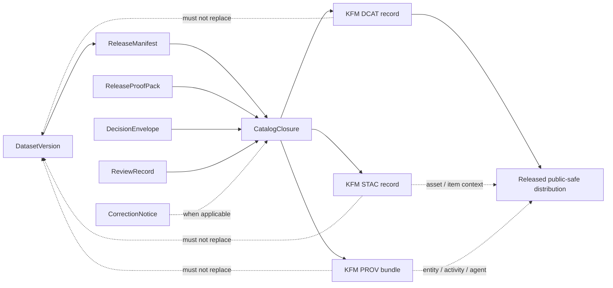

<!-- [KFM_META_BLOCK_V2]
doc_id: kfm://doc/REVIEW_REQUIRED_UUID
title: KFM DCAT Profile
type: standard
version: v1
status: draft
owners: @bartytime4life
created: REVIEW_REQUIRED_DATE
updated: 2026-04-30
policy_label: REVIEW_REQUIRED_POLICY_LABEL
related: [docs/standards/README.md, docs/standards/KFM_STAC_PROFILE.md, docs/standards/KFM_PROV_PROFILE.md, docs/standards/KFM_MARKDOWN_WORK_PROTOCOL.md, docs/runbooks/README.md, contracts/README.md, schemas/README.md, schemas/contracts/README.md, schemas/contracts/v1/README.md, policy/README.md, tests/README.md, .github/workflows/README.md]
tags: [kfm, dcat, standards, metadata, catalog, catalog-closure, publication]
notes: [Revised from the surfaced KFM DCAT Profile draft; doc_id, created date, policy label, mounted-checkout parity, exact emitter paths, schema-home authority, workflow enforcement, and public conformance evidence remain NEEDS VERIFICATION. Owner is retained from surfaced docs evidence and should be rechecked against CODEOWNERS before promotion.]
[/KFM_META_BLOCK_V2] -->

<a id="top"></a>

# KFM DCAT Profile

Governed outward dataset and distribution profile for `CatalogClosure`, designed to work beside STAC and PROV without replacing canonical truth.


> [!IMPORTANT]
> A KFM DCAT record is a **public discovery surface**. It is not the canonical store, not the policy engine, not the review record, not the provenance bundle, and not proof that a release is safe by itself.

**Status:** `draft`  
**Path:** `docs/standards/KFM_DCAT_PROFILE.md`  
**Primary seam:** `CatalogClosure`  
**External baseline:** W3C **DCAT Version 3**. DCAT-US v3 may be useful for U.S. catalog interoperability, but this file does **not** claim DCAT-US conformance.

**Quick jumps:** [Purpose](#purpose) · [Repo fit](#repo-fit) · [Accepted inputs](#accepted-inputs) · [Exclusions](#exclusions) · [Boundary](#boundary) · [Conformance language](#conformance-language) · [Profile rules](#profile-rules) · [KFM alignment](#kfm-semantic-model-alignment) · [Field matrix](#field-matrix) · [STAC / DCAT / PROV closure](#stac--dcat--prov-closure) · [Example](#illustrative-json-ld-example) · [Validation gates](#validation-and-release-gates) · [Definition of done](#definition-of-done) · [Verification backlog](#open-verification-backlog)

---

## Purpose

This standard defines how Kansas Frontier Matrix uses **DCAT** for outward dataset and distribution discovery.

It keeps the catalog edge useful without letting catalog prose outrun evidence, rights, sensitivity handling, release state, review posture, or correction lineage.

The goal is deliberately narrow:

- make released dataset and distribution discovery consistent;
- keep DCAT aligned with `CatalogClosure`, `ReleaseManifest`, STAC, PROV, and visible correction lineage;
- distinguish **profile fit** from **mounted adoption** and **public conformance**;
- give reviewers, validators, and future CI a crisp boundary to check;
- prevent DCAT from being treated as the whole metadata truth for KFM.

[Back to top](#top)

---

## Repo fit

**Upstream / adjacent surfaces**

- [`./README.md`](./README.md) — standards index and routing surface
- [`./KFM_STAC_PROFILE.md`](./KFM_STAC_PROFILE.md) — outward asset / item / collection discovery profile
- [`./KFM_PROV_PROFILE.md`](./KFM_PROV_PROFILE.md) — outward provenance / lineage profile
- [`./KFM_MARKDOWN_WORK_PROTOCOL.md`](./KFM_MARKDOWN_WORK_PROTOCOL.md) — Markdown authoring and review protocol
- [`../README.md`](../README.md) — broader docs landing page
- [`../../README.md`](../../README.md) — repository root landing page

**Downstream / implementation-adjacent surfaces**

- [`../../contracts/README.md`](../../contracts/README.md) — interface and contract routing
- [`../../schemas/README.md`](../../schemas/README.md) — schema authority and registry routing
- [`../../schemas/contracts/README.md`](../../schemas/contracts/README.md) — schema/contract machine-file boundary
- [`../../schemas/contracts/v1/README.md`](../../schemas/contracts/v1/README.md) — versioned contract family index
- [`../../policy/README.md`](../../policy/README.md) — policy rules and fail-closed gates
- [`../../tests/README.md`](../../tests/README.md) — fixtures, validators, and proof burdens
- [`../../.github/workflows/README.md`](../../.github/workflows/README.md) — workflow documentation when present
- [`../runbooks/README.md`](../runbooks/README.md) — operational procedures and publication runbooks

> [!NOTE]
> **NEEDS VERIFICATION:** the current mounted checkout was not available while this revision was authored. Keep relative links, owner assignment, schema locations, workflow claims, and emitter paths under review until verified in the real repository.

---

## Accepted inputs

This profile applies to metadata for:

- released or release-candidate `DatasetVersion` records;
- `CatalogClosure` records that expose outward discovery;
- public-safe distribution metadata for released files, tiles, APIs, collections, or mediated access points;
- release-linked STAC / PROV companion references;
- correction, supersession, withdrawal, and replacement linkage for public catalog records;
- public-safe metadata for derived artifacts, including tiles, downloads, static bundles, and service endpoints.

## Exclusions

This profile is **not** the home for:

- `RAW`, `WORK`, or `QUARANTINE` object design;
- internal-only reviewer workflow records as primary catalog records;
- machine-facing JSON Schemas, vocab registries, or validator implementations;
- direct feature APIs, portrayal APIs, or `EvidenceBundle` resolver contracts;
- policy bundles or Rego rules;
- STAC item/asset rules except where they map into DCAT;
- PROV entity/activity/agent modeling except where it is linked from DCAT;
- claims that the repository already emits valid DCAT records without emitter and validator proof.

[Back to top](#top)

---

## Boundary

### What this profile must do

A KFM DCAT record should let a user, steward, integrator, or catalog harvester answer:

- **What is this dataset?**
- **Which released scope does it represent?**
- **What distributions are actually public-safe and available?**
- **Which profile, release, and validation context shaped it?**
- **Where does lineage continue if catalog prose is not enough?**
- **What rights, access, review, freshness, and sensitivity conditions shaped this release?**
- **How does correction, replacement, or withdrawal remain visible?**

### What this profile must not do

A KFM DCAT record must not:

- replace canonical truth with catalog prose;
- flatten policy, review, release, and correction state into generic metadata;
- publish discovery metadata for unreleased or non-public-safe material;
- imply public conformance just because DCAT is a good vocabulary fit;
- let STAC, DCAT, and PROV drift apart on identifiers, release scope, distributions, checksums, or lineage links.

> [!CAUTION]
> In KFM, **discoverability is a governed outcome**. If release, evidence, rights, sensitivity, schema validity, or correction integrity fail, outward discovery must fail closed.

---

## Conformance language

Use these labels consistently inside this file and in related review notes.

| Label | Meaning | Safe use here |
|---|---|---|
| **CONFIRMED** | Supported by attached KFM doctrine, surfaced repo-facing docs, or official external standards | Doctrine, role separation, standards baseline |
| **INFERRED** | Strongly implied by repeated doctrine or adjacent docs, but not directly proven as implementation | Field mapping and conservative catalog interpretation |
| **PROPOSED** | Recommended starter pattern that fits KFM doctrine | Future gates, command sketches, validator shape |
| **UNKNOWN** | Not verified strongly enough to claim as current repo behavior | Emitters, CI, route names, schema files, runtime output |
| **NEEDS VERIFICATION** | Review-critical detail requiring direct inspection | UUIDs, dates, owners, CODEOWNERS, policy label, workflow enforcement |

### Profile fit vs mounted adoption vs public conformance

| State | Meaning | Safe wording |
|---|---|---|
| **Profile fit** | DCAT is the right outward vocabulary for this job | “KFM uses DCAT as an outward discovery profile.” |
| **Mounted adoption** | A checked-out implementation emits or validates this profile | “The mounted implementation emits KFM DCAT records.” |
| **Public conformance** | Evidence-backed proof exists that emitted records satisfy the pinned profile | “The public catalog conforms to the KFM DCAT Profile.” |

Only the first wording is currently safe without stronger emitter, fixture, validator, release-gate, and catalog-output evidence.

[Back to top](#top)

---

## Profile rules

### Rule 1 — DCAT is downstream of release governance

A DCAT record may be outwardly visible only after the subject scope is release-safe or explicitly release-candidate safe for the target audience.

**KFM consequence:** a valid-looking DCAT record without release linkage, policy state, and review closure is insufficient KFM output.

### Rule 2 — Dataset identity must be stable

Every KFM `dcat:Dataset` must carry a stable identifier that survives re-ingest and can be resolved or crosswalked to the release subject.

**KFM consequence:** ephemeral job IDs, filesystem-only paths, temporary branch names, or UI labels must not become dataset identity.

### Rule 3 — Every public artifact must be represented as a distribution or linked service

A released downloadable file, static tile bundle, mediated API, or equivalent access point should be represented by `dcat:Distribution` and, when service-mediated, a linked `dcat:DataService`.

**KFM consequence:** public assets should not hide behind generic prose when a distribution can be named, typed, and checked.

### Rule 4 — Rights, access, and sensitivity must be visible

A DCAT record must expose enough rights and access posture to support fail-closed behavior.

**KFM consequence:** unresolved rights, restricted access, stewarded access, cultural sensitivity, exact-location risk, or redaction must remain visible through the closure.

### Rule 5 — Spatial and temporal extent are public-safe summaries

Spatial and temporal fields should support discovery, not leak unsafe precision or pretend unsupported temporal certainty.

**KFM consequence:** exact sensitive geometry should be generalized, redacted, delayed, or omitted according to policy, with the transform recorded outside DCAT where needed.

### Rule 6 — STAC, DCAT, and PROV must close together

A DCAT record must participate in `STAC / DCAT / PROV` closure instead of standing alone.

**KFM consequence:** catalog validation should check identifiers, release links, distribution references, checksums, and provenance references together.

### Rule 7 — Correction lineage must remain discoverable

Superseded, narrowed, generalized, withdrawn, or replaced material must preserve visible lineage.

**KFM consequence:** a catalog update must not silently erase prior public meaning.

### Rule 8 — Unknowns fail closed

If a required release, rights, sensitivity, checksum, provenance, review, or correction field is missing, the publication gate should return `DENY`, `HOLD`, `ABSTAIN`, or `ERROR` according to the owning gate grammar.

**KFM consequence:** a catalog record should not be promoted simply because it is syntactically valid.

---

## KFM semantic model alignment

| KFM concept | Role | DCAT posture |
|---|---|---|
| `DatasetVersion` | Released or release-candidate subject set | Usually represented outwardly as, or as the basis for, a `dcat:Dataset` |
| `CatalogClosure` | Outward discoverability plus lineage, rights, review, and release closure | Governing bundle that must connect DCAT, STAC, PROV, and KFM governance artifacts |
| `ReleaseManifest` | Release packaging and subject scope | Must be linked or resolvable from the outward record |
| `ReleaseProofPack` | Evidence that the release passed required proof burdens | Must remain first-class; linkable but not collapsed into DCAT prose |
| `DecisionEnvelope` | Machine-readable policy outcome | Must remain first-class; linkable as policy posture where appropriate |
| `ReviewRecord` | Human review / steward decision | Must remain first-class; linkable where the release burden requires it |
| `SourceDescriptor` | Source identity, rights, cadence, role, and validation plan | Feeds publisher/source/rights fields; does not become the DCAT record itself |
| `EvidenceBundle` | Support package for claims, answers, exports, or narratives | May be referenced only where appropriate; not a public dataset substitute |
| `CorrectionNotice` | Supersession, withdrawal, narrowing, or replacement lineage | Must remain discoverable when public meaning changes |
| Derived public-safe artifact | Download, tile bundle, API endpoint, report, or other releasable output | Represent as `dcat:Distribution` when release-backed and public-safe |

---

## Field matrix

### Core dataset requirements

| Status | Requirement | Likely DCAT carrier | KFM validation expectation |
|---|---|---|---|
| **CONFIRMED** | Public record identifies a released subject | `dct:identifier`, `dct:relation` | Identifier resolves to `DatasetVersion` or `ReleaseManifest` |
| **CONFIRMED** | Public record participates in closure | `dct:conformsTo`, `dct:provenance`, companion links | DCAT has resolvable STAC and PROV companions where applicable |
| **CONFIRMED** | Rights and access posture are visible | `dct:license`, `dct:rights`, `dct:accessRights` | Unknown or restricted rights block public promotion unless reviewed |
| **CONFIRMED** | Public distributions are explicit | `dcat:distribution` | Each public-safe artifact is represented or intentionally excluded |
| **CONFIRMED** | Correction lineage remains visible | `dct:isReplacedBy`, `dct:replaces`, `dct:relation` | Supersession, replacement, narrowing, or withdrawal is resolvable |
| **INFERRED** | Versioning is explicit | `dcat:version`, `dct:isVersionOf`, `dct:hasVersion`, `dcat:inSeries` | Re-ingest does not create ambiguous identity |
| **INFERRED** | Temporal extent is discovery-safe | `dct:temporal` | Valid time and catalog update time are not conflated |
| **INFERRED** | Spatial extent is public-safe | `dct:spatial` | Redacted or generalized geometry is labeled through closure |
| **INFERRED** | Freshness is visible | `dct:modified` plus release-linked freshness note | Stale or delayed output does not look current |
| **PROPOSED** | Distribution integrity is checkable | `spdx:checksum` or KFM-linked digest field | Digest matches release manifest and STAC/PROV closure |

### Distribution requirements

| Status | Requirement | Likely DCAT carrier | KFM validation expectation |
|---|---|---|---|
| **CONFIRMED** | Downloadable files use download URLs | `dcat:downloadURL` | URL points only to released, public-safe artifact |
| **CONFIRMED** | Service-mediated access is labeled | `dcat:accessURL`, `dcat:accessService` | Service description is linked and access class is clear |
| **INFERRED** | Media type is explicit | `dcat:mediaType` | MIME type matches artifact or API response family |
| **INFERRED** | Byte size is included when known | `dcat:byteSize` | Size matches release manifest when available |
| **INFERRED** | Distribution-specific rights are not hidden | `dct:license`, `dct:rights`, `dct:accessRights` on distribution | Per-artifact restrictions override generic dataset text |
| **PROPOSED** | Distribution role is typed | `dct:type` or KFM controlled role | Roles stay in a small controlled list such as `data`, `metadata`, `tiles`, `qa`, `provenance`, `thumbnail` |
| **PROPOSED** | Distribution checksum is closure-checked | `spdx:checksum` or linked digest | Digest matches release proof and any STAC asset checksum |

### Contact, publisher, and source-role requirements

| Status | Requirement | Likely DCAT carrier | KFM validation expectation |
|---|---|---|---|
| **CONFIRMED** | Publisher or steward is visible | `dct:publisher` | Organization or steward role is not blank |
| **INFERRED** | Contact path is routable | `dcat:contactPoint` | Email, URL, or form is usable for stewardship questions |
| **INFERRED** | Source role is not collapsed | `dct:source`, `dct:creator`, `dct:publisher`, `prov` companion | Aggregator, originator, reviewer, and publisher roles do not blur |
| **PROPOSED** | KFM publication agent is distinguishable from upstream source | `prov` companion plus DCAT publisher/source fields | KFM does not appear as source of external facts unless it is the source |

[Back to top](#top)

---

## STAC / DCAT / PROV closure



### Relationship to STAC

STAC is strongest for geospatial asset, item, collection, and spatiotemporal discovery. DCAT is strongest for catalog-level dataset and distribution semantics.

| STAC source | DCAT mapping | KFM caution |
|---|---|---|
| STAC Collection | `dcat:DatasetSeries` or parent `dcat:Dataset` where appropriate | Use series only when the release pattern is truly recurring or grouped |
| STAC Item | `dcat:Dataset` or distribution context depending on release granularity | Do not force every Item into a separate Dataset if the release unit is larger |
| STAC Asset | `dcat:Distribution` | One public-safe asset should become one concrete distribution when useful |
| `properties.datetime` | `dct:temporal` period with same begin/end when instant-only | Do not confuse data time with catalog modification time |
| `start_datetime` / `end_datetime` | `dct:temporal` period | Preserve precision caveats where needed |
| `bbox` / public geometry | `dct:spatial` | Generalize or suppress sensitive geometry |
| `license` code | `dct:license` IRI plus `dct:rights` when needed | License code alone is usually too thin for DCAT |
| `providers[]` | `dct:publisher`, `dct:creator`, `dcat:contactPoint`, `prov` companion | Map provider roles deliberately |
| `keywords` | `dcat:keyword` | Use `dcat:theme` for controlled vocabulary concepts |
| asset checksum | distribution checksum / release manifest digest | Validate against release proof, not only local metadata |

### Relationship to PROV

PROV is strongest for lineage: entities, activities, agents, derivation, generation, and attribution. DCAT should link to provenance rather than attempting to encode the entire lineage chain inline.

| PROV concept | DCAT linkage | KFM caution |
|---|---|---|
| `prov:Entity` for artifact | Distribution relation / provenance reference | Do not treat a distribution URL as full lineage |
| `prov:Activity` for processing | `dct:provenance` / companion link | Keep parameters, tool versions, and run identity in PROV or receipts |
| `prov:Agent` for source/steward/builder | Publisher/source/contact linkage | Distinguish upstream authority from KFM publication role |
| Derivation chain | `dct:source`, `dct:provenance`, `prov:wasDerivedFrom` in companion | Catalog prose should not be the only trace of derivation |
| Generated proof | `ReleaseProofPack` / PROV companion | Proof pack stays first-class, not generic text |

[Back to top](#top)

---

## Illustrative JSON-LD example

> [!NOTE]
> This example is **illustrative**. It is not proof that the repository emits this serialization, and it deliberately uses placeholder IRIs. Replace placeholders only after mounted implementation evidence confirms real identifiers, emitter paths, and profile IRIs.

```json
{
  "@context": {
    "dcat": "http://www.w3.org/ns/dcat#",
    "dct": "http://purl.org/dc/terms/",
    "spdx": "http://spdx.org/rdf/terms#",
    "prov": "http://www.w3.org/ns/prov#",
    "xsd": "http://www.w3.org/2001/XMLSchema#",
    "kfm": "https://example.invalid/kfm/ns#"
  },
  "@id": "kfm:dataset/hydrology-example/v1",
  "@type": "dcat:Dataset",
  "dct:title": "KFM Hydrology Example Dataset v1",
  "dct:description": "Public-safe example dataset record for a release-backed KFM hydrology slice.",
  "dct:identifier": "kfm:dataset/hydrology-example/v1",
  "dcat:version": "v1",
  "dct:issued": {
    "@value": "2026-04-30",
    "@type": "xsd:date"
  },
  "dct:modified": {
    "@value": "2026-04-30T00:00:00Z",
    "@type": "xsd:dateTime"
  },
  "dct:license": {
    "@id": "https://creativecommons.org/licenses/by/4.0/"
  },
  "dct:rights": "Public-safe release after rights, sensitivity, and review closure.",
  "dct:accessRights": "public",
  "dct:publisher": {
    "@id": "kfm:agent/kansas-frontier-matrix"
  },
  "dcat:keyword": [
    "Kansas",
    "hydrology",
    "public-safe",
    "release-backed"
  ],
  "dct:temporal": {
    "@type": "dct:PeriodOfTime",
    "kfm:valid_start": "2026-01-01T00:00:00Z",
    "kfm:valid_end": "2026-01-31T23:59:59Z"
  },
  "dct:spatial": {
    "@type": "dct:Location",
    "kfm:public_geometry_basis": "generalized-bbox",
    "kfm:public_geometry_crs": "EPSG:4326"
  },
  "dct:conformsTo": [
    {
      "@id": "https://www.w3.org/TR/vocab-dcat-3/"
    },
    {
      "@id": "kfm://profile/dcat/v1"
    }
  ],
  "dct:relation": [
    {
      "@id": "kfm://release-manifest/hydrology-example/v1"
    },
    {
      "@id": "kfm://catalog-closure/hydrology-example/v1"
    },
    {
      "@id": "kfm://stac/hydrology-example/v1"
    },
    {
      "@id": "kfm://prov/hydrology-example/v1"
    }
  ],
  "dct:provenance": {
    "@id": "kfm://prov/hydrology-example/v1"
  },
  "dcat:distribution": [
    {
      "@id": "kfm:distribution/hydrology-example/v1/geoparquet",
      "@type": "dcat:Distribution",
      "dct:title": "GeoParquet distribution",
      "dcat:downloadURL": {
        "@id": "https://example.invalid/kfm/published/hydrology-example/v1/data.parquet"
      },
      "dcat:mediaType": {
        "@id": "https://www.iana.org/assignments/media-types/application/vnd.apache.parquet"
      },
      "dct:accessRights": "public",
      "spdx:checksum": {
        "@type": "spdx:Checksum",
        "spdx:algorithm": {
          "@id": "spdx:checksumAlgorithm_sha256"
        },
        "spdx:checksumValue": "REVIEW_REQUIRED_SHA256"
      }
    }
  ]
}
```

---

## Validation and release gates

A KFM DCAT record is promotion-ready only when it passes three classes of checks.

### 1. Profile-shape checks

- required dataset fields are present;
- required distribution fields are present for public artifacts;
- identifiers are stable and resolvable;
- `dct:issued`, `dct:modified`, and `dct:temporal` are not conflated;
- rights and access fields are present;
- spatial and temporal discovery fields are public-safe;
- profile references use stable IRIs or verified KFM profile identifiers.

### 2. Closure checks

- `ReleaseManifest` subject matches the DCAT dataset subject;
- public distributions match released artifacts;
- distribution checksums match release proof or manifest digests when required;
- linked STAC asset references and DCAT distribution references do not drift;
- linked PROV entities and activities resolve to the same released subject;
- correction lineage is present when a published record changes meaning.

### 3. Policy and safety checks

- no DCAT record points to `RAW`, `WORK`, `QUARANTINE`, or unpublished candidate material;
- unknown rights block public release;
- restricted or stewarded access is not published as public;
- exact sensitive geometry is not exposed through catalog fields;
- unresolved review state blocks public release when the burden requires review;
- failed validator, missing proof, or missing linkage produces a fail-closed outcome.

### Proposed validator command shape

> [!WARNING]
> The command names below are **PROPOSED** until the mounted repository confirms actual validator paths, package manager, CI names, and schema homes.

```bash
# PROPOSED examples only — verify actual paths before use.
python tools/validators/catalog_matrix/evaluate.py \
  --release data/releases/<release-id>/release_manifest.json \
  --stac data/catalog/<lane>/stac/ \
  --dcat data/catalog/<lane>/dcat/ \
  --prov data/catalog/<lane>/prov/

python tools/validators/dcat_profile/evaluate.py \
  --profile docs/standards/KFM_DCAT_PROFILE.md \
  --candidate data/catalog/<lane>/dcat/<dataset-id>.jsonld
```

[Back to top](#top)

---

## Definition of done

A KFM DCAT implementation should not be promoted from `draft` language to conformance language until these conditions are met.

- [ ] Mounted checkout confirms this path and neighboring standards links.
- [ ] `doc_id`, `created`, `updated`, owners, and policy label are verified.
- [ ] The pinned external DCAT baseline is recorded in a repo-controlled registry or profile note.
- [ ] At least one valid fixture and one invalid fixture exist for a DCAT dataset.
- [ ] At least one valid fixture and one invalid fixture exist for a DCAT distribution.
- [ ] A closure validator checks DCAT against STAC, PROV, and `ReleaseManifest`.
- [ ] A policy validator denies raw, work, quarantine, unreleased, rights-unknown, or sensitivity-unsafe records.
- [ ] A correction fixture proves replacement, supersession, or withdrawal linkage.
- [ ] A public-safe distribution fixture includes media type, access/download URL, and integrity metadata where required.
- [ ] Documentation links from [`./README.md`](./README.md), STAC, and PROV profiles are synchronized.
- [ ] The release runbook explains how emitted DCAT records are reviewed, corrected, withdrawn, and regenerated.
- [ ] Public conformance wording is backed by emitted artifacts, validator output, and review evidence.

---

## Open verification backlog

| Item | Why it matters | Status |
|---|---|---|
| Confirm mounted path `docs/standards/KFM_DCAT_PROFILE.md` | Avoids editing a stale or parallel file | **NEEDS VERIFICATION** |
| Confirm `doc_id` | Required by KFM Meta Block V2 | **NEEDS VERIFICATION** |
| Confirm original created date | Avoids fabricated metadata | **NEEDS VERIFICATION** |
| Confirm owner and CODEOWNERS coverage | Establishes review burden | **NEEDS VERIFICATION** |
| Confirm policy label | Avoids unsafe public/internal assumption | **NEEDS VERIFICATION** |
| Confirm schema-home authority | Prevents `contracts/` vs `schemas/` drift | **NEEDS VERIFICATION** |
| Confirm actual DCAT emitter path | Needed before mounted adoption claims | **UNKNOWN** |
| Confirm JSON-LD vs other serialization in code | Avoids overfitting examples | **UNKNOWN** |
| Confirm validator names and CI wiring | Required before enforcement claims | **UNKNOWN** |
| Confirm whether DCAT-US v3 is needed | Useful for U.S. catalog interoperability but not assumed | **PROPOSED / NEEDS VERIFICATION** |
| Confirm profile IRI namespace | Required for stable `dct:conformsTo` | **NEEDS VERIFICATION** |
| Confirm checksum carrier | DCAT 3 supports SPDX checksum terms, but KFM use must be implemented | **PROPOSED** |
| Confirm correction-link vocabulary | Needed for visible supersession and withdrawal | **PROPOSED** |

---

## Appendix A — Compact field summary

<details>
<summary>Expand compact maintainer reference</summary>

| Area | Minimum KFM expectation |
|---|---|
| Dataset identity | Stable `dct:identifier`, release subject reference, explicit version |
| Title / description | Human-readable, release-scoped, not overstated |
| Publisher / contact | Organization or steward role plus routable contact path |
| Rights | `dct:license`, `dct:rights`, `dct:accessRights` or equivalent access posture |
| Time | `dct:issued`, `dct:modified`, `dct:temporal` kept distinct |
| Space | Public-safe `dct:spatial`; no unsafe exact geometry |
| Distributions | One record per public-safe released artifact or access point |
| Services | `dcat:DataService` where distribution is service-mediated |
| Integrity | Digest/checksum linked to release proof when required |
| Closure | STAC / DCAT / PROV / release manifest coherence |
| Policy | Fail closed on unknown rights, unresolved review, unsafe sensitivity, or invalid closure |
| Correction | Visible replacement, withdrawal, supersession, or narrowing lineage |
| Validation | Machine-checkable fixtures and validator output before conformance wording |

</details>

## Appendix B — Maintainer notes

<details>
<summary>Expand revision and promotion notes</summary>

When implementation evidence becomes available, update this file by replacing placeholders with:

- verified `doc_id`;
- verified created date;
- verified policy label;
- verified owner coverage;
- verified profile IRI;
- verified emitter paths;
- verified validator commands;
- verified fixture names;
- verified serialization examples;
- verified release runbook links.

Do **not** upgrade `PROPOSED`, `UNKNOWN`, or `NEEDS VERIFICATION` language to `CONFIRMED` without mounted evidence, tests, emitted artifacts, or review records.

</details>

---

## References

- [W3C Data Catalog Vocabulary (DCAT) — Version 3][dcat-v3]
- [W3C DCAT Version 3 publication history][dcat-v3-history]
- [W3C PROV-O: The PROV Ontology][prov-o]
- [OGC SpatioTemporal Asset Catalog (STAC) Community Standard 1.1][ogc-stac]
- [DCAT-US Schema v3.0][dcat-us-v3]

[dcat-v3]: https://www.w3.org/TR/vocab-dcat-3/
[dcat-v3-history]: https://www.w3.org/standards/history/vocab-dcat-3/
[prov-o]: https://www.w3.org/TR/prov-o/
[ogc-stac]: https://docs.ogc.org/cs/25-004/25-004.html
[dcat-us-v3]: https://resources.data.gov/resources/dcat-us3/
