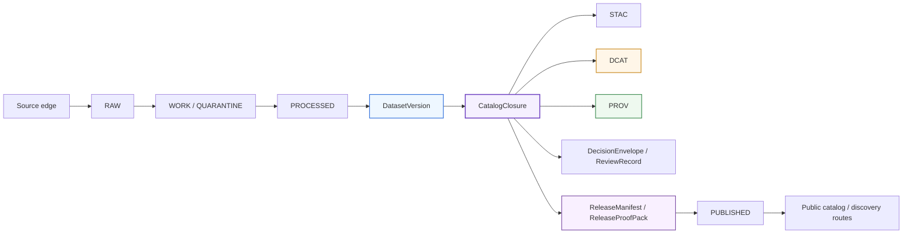

<!-- [KFM_META_BLOCK_V2]
doc_id: kfm://doc/REVIEW_REQUIRED_UUID
title: KFM DCAT Profile
type: standard
version: v1
status: draft
owners: @bartytime4life
created: REVIEW_REQUIRED_DATE
updated: 2026-04-05
policy_label: REVIEW_REQUIRED_POLICY_LABEL
related: [docs/standards/README.md, docs/standards/KFM_STAC_PROFILE.md, docs/standards/KFM_PROV_PROFILE.md, docs/standards/KFM_MARKDOWN_WORK_PROTOCOL.md, docs/runbooks/README.md, contracts/README.md, schemas/README.md, schemas/contracts/README.md, schemas/contracts/v1/README.md, policy/README.md, tests/README.md, .github/workflows/README.md]
tags: [kfm, dcat, standards, metadata, catalog, catalog-closure]
notes: [Current public main was re-inspected for this revision; mounted checkout parity, workflow YAML inventory, platform settings, runtime emitter depth, and canonical schema-home authority remain NEEDS VERIFICATION.]
[/KFM_META_BLOCK_V2] -->

# KFM DCAT Profile

_Governed outward dataset and distribution profile for `CatalogClosure`, designed to work beside STAC and PROV without replacing canonical truth._

     

**Status:** `draft` · **Path:** `docs/standards/KFM_DCAT_PROFILE.md` · **Owners:** `@bartytime4life` · **Primary seam:** `CatalogClosure`

**Quick jump:** [Purpose](#purpose) · [Repo fit](#repo-fit) · [Boundary](#boundary) · [Conformance language](#conformance-language) · [Field matrix](#field-matrix) · [Relationship to STAC and PROV](#relationship-to-stac-and-prov) · [Validation and release gates](#validation-and-release-gates) · [Open verification backlog](#open-verification-backlog)

**Repo fit:** [`README.md`](./README.md) · upstream [`../README.md`](../README.md) / [`../../README.md`](../../README.md) · adjacent [`../../contracts/README.md`](../../contracts/README.md) · [`../../schemas/README.md`](../../schemas/README.md) · [`../../schemas/contracts/README.md`](../../schemas/contracts/README.md) · [`../../schemas/contracts/v1/README.md`](../../schemas/contracts/v1/README.md) · [`../../policy/README.md`](../../policy/README.md) · [`../../tests/README.md`](../../tests/README.md) · [`../../.github/workflows/README.md`](../../.github/workflows/README.md) · downstream [`./KFM_STAC_PROFILE.md`](./KFM_STAC_PROFILE.md) · [`./KFM_PROV_PROFILE.md`](./KFM_PROV_PROFILE.md) · [`../runbooks/README.md`](../runbooks/README.md)

| Field | Value |
| --- | --- |
| Path status | **CONFIRMED** on public `main`; mounted-checkout parity still **NEEDS VERIFICATION** |
| Current public-main signal | This file already exists as a substantive draft and is routed from `docs/standards/README.md` |
| Truth posture | **CONFIRMED** doctrine · **CONFIRMED** public-main path evidence · **INFERRED** field mapping · **PROPOSED** implementation guidance |
| Machine-contract posture | Public `main` now exposes `schemas/contracts/` and `schemas/contracts/v1/`, while adjacent standards and schema docs still keep canonical schema-home authority unresolved |
| Workflow posture | `.github/workflows/` is README-only on public `main`; checked-in merge-gating depth remains **NEEDS VERIFICATION** |
| Current runbook posture | `docs/runbooks/README.md` is present; a dedicated `docs/runbooks/publication.md` is still **PROPOSED** rather than directly confirmed |

> [!IMPORTANT]
> In KFM, a DCAT record is a **public discovery surface**, not the canonical truth store, not the policy engine, and not the review record. It must remain downstream of release, rights, sensitivity, review, and correction closure.

## Purpose

This standard defines how Kansas Frontier Matrix should use **DCAT** for outward dataset and distribution discovery.

The goal is deliberately narrow:

- make public dataset and distribution discovery consistent
- keep DCAT aligned with `CatalogClosure`, `ReleaseManifest`, linked STAC and PROV surfaces, and visible correction lineage
- prevent “profile fit” language from being confused with mounted conformance
- give review, tests, and eventual CI a crisp boundary to validate

This document does **not** define canonical storage, internal truth modeling, machine-readable schemas, policy bundles, or API route contracts. It defines the outward profile rules those executable surfaces should satisfy.

[Back to top](#kfm-dcat-profile)

## Repo fit

### Current public-main signals

| Surface | Current public read | Consequence for this file |
| --- | --- | --- |
| `docs/standards/KFM_DCAT_PROFILE.md` | Present on public `main` as a substantive draft | Revise in place rather than creating a parallel file |
| `docs/standards/README.md` | Routes directly to this file as the DCAT profile surface | Keep terminology and links synchronized with the standards index |
| `docs/runbooks/README.md` | Present and substantive | Link to the runbooks lane now; do not assume `publication.md` exists yet |
| `.github/CODEOWNERS` | `/docs/` currently falls under `@bartytime4life` via visible public rules | Owner can be grounded at the `/docs/` level |
| `schemas/contracts/` and `schemas/contracts/v1/` | Live public subtree with machine-file scaffolds and vocab registries | Do not describe the repo as “contracts-only” anymore |
| `schemas/contracts/v1/README.md` | Public index says the subtree is real but still placeholder-heavy | Do not imply machine-enforced DCAT profile bodies already exist |
| `.github/workflows/README.md` | Public `main` exposes workflow documentation only | Do not claim checked-in workflow enforcement from public-tree evidence alone |

> [!WARNING]
> Public `main` now proves more structure than older PDF-only drafts assumed. It does **not** yet prove platform settings, required checks, OIDC wiring, emitted DCAT payloads, or end-to-end release gating behavior.

### Accepted inputs

This document is for:

- released or release-candidate dataset metadata
- `CatalogClosure` design and validation work
- outward dataset and distribution discovery behavior
- linked STAC, PROV, and release-manifest references
- public-safe artifact classes such as packaged files, tiles, downloadable datasets, and mediated access points

### Exclusions

This document is **not** for:

- `RAW`, `WORK`, or `QUARANTINE` object design
- internal-only policy bundles or reviewer workflows as primary catalog records
- machine-facing JSON Schemas, vocab registries, or validator implementations  
  → keep those in the owning machine surface
- direct feature APIs, portrayal APIs, or `EvidenceBundle` resolver contracts  
  → keep those in API, runtime, or evidence-resolution surfaces
- treating DCAT as the only metadata truth for KFM  
  → DCAT remains one outward layer inside the larger `STAC / DCAT / PROV` closure

[Back to top](#kfm-dcat-profile)

## Boundary

### What this profile must do

This profile must make outward discovery honest.

A KFM DCAT record should tell a user, integrator, or crawler enough to answer the following questions without pretending to be more authoritative than it is:

- **What is this dataset?**
- **Which released scope does it represent?**
- **What distributions are actually public-safe and available?**
- **Which standards or profiles shaped the outward record?**
- **Where does lineage continue if the reader needs more than catalog prose?**
- **What rights, review, freshness, and sensitivity conditions shaped this release?**
- **How does a correction, replacement, or withdrawal remain visible?**

### What this profile must not do

This profile must not:

- replace canonical truth with catalog prose
- flatten policy, review, release, and correction state into generic metadata
- publish discovery metadata for unreleased or non-public-safe material
- imply mounted conformance merely because DCAT is a good doctrinal fit
- let STAC, DCAT, and PROV drift apart on identifiers, release scope, or lineage links

> [!NOTE]
> KFM doctrine treats standards as **edge vocabularies**. That is the right posture here. DCAT is valuable because it reduces ambiguity at the public catalog edge, not because it can absorb all of KFM’s internal semantics.

## Conformance language

Use the labels below consistently.

| Label | Meaning | Use in this document |
| --- | --- | --- |
| **CONFIRMED** | Directly supported by the March 2026 KFM doctrine corpus and/or direct public-`main` inspection | Doctrinal rules and repo-surface facts |
| **INFERRED** | Strongly implied by repeated doctrine or adjacent public repo docs, but not directly proven as mounted implementation | Field mapping and conservative repo interpretation |
| **PROPOSED** | Recommended starter pattern that fits KFM doctrine and public-tree reality | Implementation guidance, future gates, or unresolved path shapes |
| **UNKNOWN** | Not verified strongly enough in the current session to claim as current reality | Emitters, validators, platform settings, runtime behavior |
| **NEEDS VERIFICATION** | Review-critical detail that should be checked before merge or reliance | UUIDs, dates, policy label, exact extension namespace, exact CI wiring |

### Profile fit vs mounted adoption vs public conformance

| State | Meaning | Safe wording |
| --- | --- | --- |
| **Profile fit** | DCAT is the right outward vocabulary for the job | “KFM uses DCAT as an outward discovery profile.” |
| **Mounted adoption** | The checked-out implementation actually emits or validates against this profile | “The mounted implementation emits KFM DCAT records.” |
| **Public conformance claim** | Evidence-backed proof exists that emitted records satisfy the pinned profile | “KFM public catalog conforms to this profile.” |

Only the first sentence is currently safe without stronger emitter, validator, fixture, and release-gate evidence.

## KFM positioning



### Reading rule

`CatalogClosure` is the decisive seam.

Upstream of it, KFM is still concerned with admission, validation, policy, and review. Downstream of it, KFM can expose outward discovery surfaces. DCAT belongs on the outward side of that seam.

## Baseline profile line

| Concern | Rule | Status |
| --- | --- | --- |
| DCAT line | Use **DCAT 3** as the outward dataset/distribution baseline | **CONFIRMED doctrine** |
| STAC companion line | Treat **STAC 1.1.0** as the spatiotemporal companion profile | **CONFIRMED doctrine** |
| PROV companion line | Treat **PROV-O** as the outward lineage vocabulary | **CONFIRMED doctrine** |
| Validation family | Use **JSON Schema Draft 2020-12** for machine-checkable serializations, fixtures, and profile validation where JSON is emitted | **CONFIRMED doctrine** |
| Mounted standards registry path | Do **not** assume a final registry location from current public evidence alone | **NEEDS VERIFICATION** |

> [!IMPORTANT]
> Pinning a standards line is not the same thing as claiming conformance. KFM requires version pinning, validation, and evidence before public conformance language is allowed.

## KFM semantic model alignment

| KFM concept | Role | DCAT posture |
| --- | --- | --- |
| `DatasetVersion` | Authoritative released or release-candidate subject set | Usually represented outwardly as, or as the basis of, a `dcat:Dataset` |
| `CatalogClosure` | Outward discoverability plus lineage, rights, review, and release closure | The governing bundle that should point to DCAT, STAC, and PROV views together |
| `ReleaseManifest` / `ReleaseProofPack` | Release-level packaging and proof | Must remain linked from the outward record, not collapsed into it |
| `DecisionEnvelope` / `ReviewRecord` | Machine-readable policy result and human review posture | Stay first-class beside the standards; do not dissolve them into vague catalog prose |
| Derived public-safe artifact | Actual downloadable or accessible output | Represent as `dcat:Distribution` only when it is release-backed and public-safe |
| `EvidenceBundle` | Support package for claims, answers, exports, or narratives | Not a public dataset substitute; link out only where appropriate |
| `CorrectionNotice` | Visible supersession, narrowing, withdrawal, or replacement lineage | Must remain discoverable from the outward record when meaning changes |

[Back to top](#kfm-dcat-profile)

## Field matrix

### Core dataset and distribution rules

| Status | Requirement | Likely DCAT carrier | KFM consequence |
| --- | --- | --- | --- |
| **CONFIRMED** | Every outward DCAT record must be release-linked, not just human-readable. | `dct:relation` and/or verified companion links | Public discovery cannot outrun release state. |
| **CONFIRMED** | The record must participate in `STAC / DCAT / PROV` closure rather than standing alone. | `dct:conformsTo`, `dct:provenance`, linked companion artifacts | DCAT is one outward view, not the whole metadata story. |
| **CONFIRMED** | Rights and sensitivity posture must be visible enough to support fail-closed behavior. | `dct:license`, `dct:rights`, release-linked notes | Unknown rights should block outward publication. |
| **CONFIRMED** | Review and release readiness must be represented at the closure level before public release. | Linked closure and release artifacts | A public DCAT record must not imply “ready” when review is unresolved. |
| **INFERRED** | Stable dataset identity is required across re-ingests; versioning must be explicit. | `dct:identifier`, version relation fields | Identifier drift breaks discovery, lineage, and correction. |
| **INFERRED** | Public-safe temporal and spatial extent belong in the outward record when meaningful. | `dct:temporal`, `dct:spatial` | Discovery must expose scope without leaking unsafe precision. |
| **INFERRED** | Freshness basis should be visible when delayed or stale derived outputs would change interpretation. | `dct:modified` plus release-linked freshness notes | Prevents catalog surfaces from bluffing currentness. |
| **INFERRED** | Every public-safe artifact should map to a concrete distribution record. | `dcat:distribution` | Do not hide actual released deliverables behind generic prose. |
| **INFERRED** | Profile references must be machine- and human-readable. | `dct:conformsTo` | Readers must be able to see which rules shaped the record. |
| **PROPOSED** | Exact KFM extension predicates should remain unresolved until the repo publishes them. | `kfm:*` or repo-specific extension namespace | Avoid inventing extension names in prose before mounted adoption exists. |

### Minimum outward dataset shape

| Area | Minimum expectation | Status |
| --- | --- | --- |
| Identity | Stable dataset identifier, title, description | **INFERRED** |
| Release linkage | Link to release-manifest and/or catalog-closure artifacts | **CONFIRMED** |
| Lineage | Link to outward PROV bundle or equivalent provenance surface | **CONFIRMED** |
| Discovery profile refs | Declare DCAT profile and any linked STAC/KFM profile refs | **CONFIRMED** |
| Rights posture | License and any additional rights notes required for public use | **CONFIRMED** |
| Review / publication posture | Enough outward indication that release is valid, generalized, corrected, or withdrawn | **CONFIRMED** |
| Extent | Temporal extent and public-safe spatial extent where relevant | **INFERRED** |
| Freshness basis | `modified`, stale-visible note, or equivalent outward freshness signal where it changes meaning | **INFERRED** |
| Distributions | One record per public-safe distribution class | **INFERRED** |

### Distribution rules

| Status | Rule |
| --- | --- |
| **CONFIRMED** | A distribution must never point at `RAW`, `WORK`, or `QUARANTINE` scope. |
| **CONFIRMED** | A distribution must inherit release linkage, rights posture, freshness basis, and correction state. |
| **INFERRED** | Use `downloadURL` only for actual downloadable artifacts; use `accessURL` when the artifact is a service or mediated access point. |
| **INFERRED** | Keep media type explicit and tied to the released artifact class. |
| **PROPOSED** | If one dataset exposes multiple artifact classes (for example COG, GeoParquet, PMTiles, CSV), publish one `dcat:Distribution` per class rather than flattening them into one ambiguous object. |

### Avoid patterns

| Status | Avoid | Why |
| --- | --- | --- |
| **CONFIRMED** | Treating DCAT as canonical truth | KFM refuses outward metadata to become sovereign truth. |
| **CONFIRMED** | Claiming conformance because the standard is a good fit | KFM separates profile fit from mounted adoption. |
| **CONFIRMED** | Publishing outward records without rights, review, or release closure | Fail-closed behavior must remain real. |
| **CONFIRMED** | Letting correction happen without visible outward lineage | KFM correction preserves history. |
| **INFERRED** | Letting DCAT and STAC disagree on identity, release scope, or lineage links | That drift breaks discoverability and trust. |
| **PROPOSED** | Minting KFM extension fields ad hoc per lane | Extension drift becomes catalog drift. |

[Back to top](#kfm-dcat-profile)

## Relationship to STAC and PROV

| Need | Primary carrier | Why |
| --- | --- | --- |
| Dataset and distribution discovery | **DCAT** | Best fit for outward catalog and distribution discovery |
| Item and asset discovery with spatiotemporal emphasis | **STAC** | Best fit where items, scenes, or assets are the right carrier |
| Activity, agent, and entity lineage | **PROV** | Best fit for causal provenance |
| KFM policy, review, release, and correction state | **KFM artifacts beside the standards** | Must remain first-class rather than being erased into generic metadata |

### Practical rule

Use the three together.

- Use **STAC** when the reader needs item or asset shape.
- Use **DCAT** when the reader needs dataset or distribution discovery.
- Use **PROV** when the reader needs lineage.
- Keep **KFM policy, review, release, and correction artifacts** visible beside them.

That is the profile KFM doctrine supports most strongly.

## Validation and release gates

A public conformance claim for this profile should be blocked unless all of the following pass.

### Definition of done

- [ ] The emitted record validates against the pinned machine profile.
- [ ] Catalog-closure tests prove `STAC / DCAT / PROV` resolution and outward-link integrity.
- [ ] Identifier consistency holds across the outward closure.
- [ ] Release linkage resolves to a real release artifact.
- [ ] Rights and sensitivity posture is explicit enough to support fail-closed behavior.
- [ ] Public-safe extent is validated against the lane’s precision rules.
- [ ] Distribution URLs are release-backed and do not expose unpublished scope.
- [ ] Correction, supersession, narrowing, or withdrawal behavior stays visible and link-preserving.
- [ ] Documentation and runbook text match emitted behavior.
- [ ] Public conformance wording is withheld until emitter, validator, and workflow proof exists.

### Review prompts

| Question | Why it matters |
| --- | --- |
| Does this record describe a **released** scope, or only a desirable future one? | Prevents trust theater. |
| Is the outward record discoverable **and** reconstructable back to governed release state? | Keeps discoverability tied to truth. |
| Are STAC, DCAT, and PROV linked, or are they drifting as parallel metadata silos? | Prevents closure breakage. |
| Does the record preserve public-safe behavior for sensitive geometry or review-bearing lanes? | Protects policy posture. |
| Would a correction or withdrawal remain visible to a reader starting from the catalog? | Preserves lineage under change. |
| Are workflow or CI claims grounded in visible evidence, not just documented intent? | Prevents documentation from outrunning enforcement reality. |

### Change control

| Change type | Example | Required response |
| --- | --- | --- |
| Additive outward field | New optional relation or profile ref | Minor version bump; fixture update |
| Meaning change | New interpretation of release readiness, freshness, or identifier rules | Breaking-change review; migration note; fixture + runbook update |
| Standard-line change | DCAT / STAC / PROV / JSON Schema baseline changes | Compatibility review; explicit pin update |
| Mounted conformance claim | First real emitter or validator lands in repo | Add evidence, tests, and public conformance note |

> [!CAUTION]
> Current public `main` shows `.github/workflows/README.md` only inside `.github/workflows/`. Do not let this file claim merge-blocking enforcement or emitted conformance evidence that the checked-in public tree does not actually show.

[Back to top](#kfm-dcat-profile)

## Illustrative JSON-LD starter

<details>
<summary>Open a minimal starter example</summary>

> [!NOTE]
> This example is illustrative. It is deliberately conservative and keeps repo-specific IRIs and extension predicates as placeholders until the actual serializer, validator, and profile registry are confirmed.

```json
{
  "@context": [
    "https://www.w3.org/ns/dcat2.jsonld",
    {
      "dct": "http://purl.org/dc/terms/",
      "foaf": "http://xmlns.com/foaf/0.1/",
      "vcard": "http://www.w3.org/2006/vcard/ns#",
      "locn": "http://www.w3.org/ns/locn#",
      "time": "http://www.w3.org/2006/time#"
    }
  ],
  "@type": "dcat:Dataset",
  "dct:identifier": "kfm.hydro.usgs_streamflow",
  "dct:title": "USGS streamflow — Kansas (released view)",
  "dct:description": "Illustrative outward discovery record for a release-backed, public-safe KFM dataset.",
  "dct:modified": "<TODO:modified>",
  "dct:license": {
    "@id": "<TODO:license-iri>"
  },
  "dct:rights": "<TODO:rights-note-or-iri>",
  "dct:publisher": {
    "@type": "foaf:Organization",
    "foaf:name": "<TODO:publisher-name>"
  },
  "dcat:contactPoint": {
    "@type": "vcard:Organization",
    "vcard:fn": "<TODO:contact-name>",
    "vcard:hasEmail": "mailto:<TODO:contact-email>"
  },
  "dct:temporal": {
    "@type": "dct:PeriodOfTime",
    "time:hasBeginning": {
      "@type": "time:Instant",
      "time:inXSDDateTime": "<TODO:begin>"
    },
    "time:hasEnd": {
      "@type": "time:Instant",
      "time:inXSDDateTime": "<TODO:end>"
    }
  },
  "dct:spatial": {
    "@type": "dct:Location",
    "locn:geometry": "<TODO:public-safe-wkt-or-geometry-ref>"
  },
  "dct:conformsTo": [
    { "@id": "https://www.w3.org/TR/vocab-dcat-3/" },
    { "@id": "https://stacspec.org/" },
    { "@id": "<TODO:repo-published-kfm-dcat-profile-iri>" }
  ],
  "dct:provenance": {
    "@id": "<TODO:prov-jsonld-ref>"
  },
  "dct:relation": [
    { "@id": "<TODO:catalog-closure-ref>" },
    { "@id": "<TODO:release-manifest-ref>" }
  ],
  "dcat:distribution": [
    {
      "@type": "dcat:Distribution",
      "dct:title": "<TODO:distribution-title>",
      "dcat:downloadURL": {
        "@id": "<TODO:release-backed-download-url>"
      },
      "dcat:mediaType": "<TODO:media-type>",
      "dct:conformsTo": [
        { "@id": "<TODO:artifact-profile-iri>" }
      ]
    }
  ]
}
```

### Example reading notes

- `dct:relation` is used here as a safe placeholder for release-linked governed artifacts until the mounted KFM extension namespace is verified.
- `dct:spatial` must remain public-safe; it is not a license to publish precise sensitive geometry.
- The example assumes richer lineage continues in a linked PROV artifact rather than being flattened into free-text catalog prose.

</details>

## Open verification backlog

<details>
<summary>Items that still need stronger repo or runtime evidence</summary>

### Document-control verification

- Confirm `doc_id`, `created`, and `policy_label` for the KFM meta block.
- Reconfirm whether `updated: 2026-04-05` should remain the document date at merge time.
- Decide whether this file should carry a narrower owner than the current `/docs/` fallback.

### Repo and path verification

- Reconfirm mounted-checkout parity for the public-`main` paths linked above.
- Reverify whether a dedicated `docs/runbooks/publication.md` lands; until then, keep links pointed at `docs/runbooks/README.md`.
- Check whether any adjacent directory README now narrows the current `/docs/` fallback ownership signal.

### Machine-profile and fixture verification

- Confirm the actual canonical schema-home decision between root `contracts/` and live `schemas/contracts/`.
- Confirm whether a dedicated `CatalogClosure` schema or fixture is present in the mounted checkout.
- Confirm the final file names and locations for valid and invalid DCAT fixtures.
- Confirm whether a standards registry file exists and, if so, where its canonical home lives.

### Emitter and validator verification

- Confirm whether the repo emits DCAT as JSON-LD, RDF, Turtle, or another serialization.
- Confirm the actual validator command, harness location, and negative-path fixtures.
- Confirm whether any checked-in workflow YAML or platform settings now enforce this profile, since public `main` currently exposes workflow documentation only.

### Namespace and predicate verification

- Confirm whether KFM has a published extension namespace for release, review, decision, correction, and profile references.
- Confirm the exact predicate choices for release linkage, correction linkage, and profile refs.
- Confirm lane-specific generalization rules before calling any `dct:spatial` field complete.

</details>

## Non-goals

This standard does not settle:

- exact JSON-LD serialization layout for every lane
- exact KFM extension predicate names
- exact API route inventory
- exact schema filenames or CI workflow names
- exact conformance-report format
- exact mounted workflow enforcement depth

Those belong to mounted contracts, registries, workflows, runbooks, and runtime proof surfaces.

---

## Maintainer checklist

Before promoting this document from `draft`, verify the following:

- the KFM meta block placeholders are resolved or intentionally retained
- the repo-fit links still point at the correct adjacent docs
- machine-contract-home wording still matches current public evidence
- a real emitter example exists or all conformance wording remains bounded
- a validator and fixture path exists
- at least one outward-closure test proves `STAC / DCAT / PROV` link integrity
- runbook references still match the actual runbooks lane
- the wording in this file does not outrun visible repo, workflow, or runtime evidence

[Back to top](#kfm-dcat-profile)
