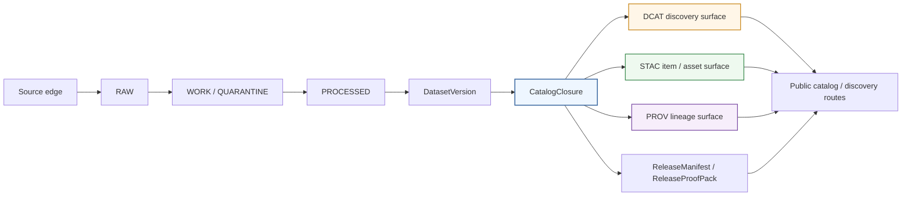

<!-- [KFM_META_BLOCK_V2]
doc_id: kfm://doc/<TODO-uuid>
title: KFM DCAT Profile
type: standard
version: v1
status: draft
owners: <TODO:owners>
created: <TODO:YYYY-MM-DD>
updated: <TODO:YYYY-MM-DD>
policy_label: <TODO:policy_label>
related: [<TODO:confirm docs/standards/README.md>, <TODO:confirm ../../contracts/>, <TODO:confirm standards profile registry path>]
tags: [kfm, dcat, standards, metadata, catalog]
notes: [Mounted repo tree was not directly inspected in this session; mounted conformance, owners, dates, and adjacent file paths need verification.]
[/KFM_META_BLOCK_V2] -->

# KFM DCAT Profile

KFM’s outward DCAT profile for dataset and distribution discovery inside `CatalogClosure`, designed to work beside STAC and PROV without replacing canonical truth.

**Quick jump:** [Purpose](#purpose) · [Repo fit](#repo-fit) · [Boundary](#boundary) · [Conformance language](#conformance-language) · [Field matrix](#field-matrix) · [STAC + PROV relationship](#relationship-to-stac-and-prov) · [Validation gates](#validation-and-release-gates) · [Open verification](#open-verification-backlog)

| Field | Value |
| --- | --- |
| Status | `draft` |
| Path | `docs/standards/KFM_DCAT_PROFILE.md` |
| Primary role | Define KFM’s outward DCAT dataset/distribution profile |
| Truth posture | **CONFIRMED** doctrine, **INFERRED** field mapping, **PROPOSED** starter implementation guidance |
| Mounted conformance | **UNKNOWN** |
| Machine-contract home | `../../contracts/` is the likely authoritative home for schemas and vocabularies, not this prose standard |
| Primary seam | `CatalogClosure` |

> [!IMPORTANT]
> In KFM, a DCAT record is a **public discovery surface**, not the canonical truth store, not the policy engine, and not the review record. This profile exists to make outward catalog behavior explicit while preserving KFM’s governed truth path.

---

## Purpose

This document defines how Kansas Frontier Matrix should use DCAT for outward dataset and distribution discovery.

The goal is narrow on purpose:

- make public dataset/distribution discovery consistent
- keep DCAT aligned with `CatalogClosure`, `ReleaseManifest`, and linked PROV/STAC artifacts
- prevent “profile fit” language from being confused with mounted implementation conformance
- make release gating and validation expectations explicit enough to test

This document does **not** define the canonical storage model, route inventory, or machine-readable schemas themselves. It defines the profile rules those artifacts should follow.

[Back to top](#kfm-dcat-profile)

## Repo fit

### Path and neighboring responsibilities

| Role | Path | Status | Notes |
| --- | --- | --- | --- |
| This standard | `docs/standards/KFM_DCAT_PROFILE.md` | **CONFIRMED** | Target path supplied in the task. |
| Standards index | `docs/standards/README.md` | **NEEDS VERIFICATION** | Repo-grounded evidence suggests this directory routes machine contracts elsewhere. |
| Machine contracts / vocabularies | `../../contracts/` | **INFERRED** | Expected home for schemas, registries, and machine-facing profiles. |
| Standards registry | `contracts/profiles/standards_profile.yaml` | **PROPOSED** | Mentioned repeatedly in March 2026 planning material as the likely profile registry seam. |
| Publication runbook | `../runbooks/publication.md` | **PROPOSED** | Logical downstream consumer of this standard. |

### Accepted inputs

This document is for:

- released or release-candidate dataset metadata
- `CatalogClosure` design and validation work
- outward dataset/distribution discovery behavior
- linked STAC, PROV, and release-manifest references
- public-safe artifact classes such as packaged files, tiles, and downloadable distributions

### Exclusions

This document is **not** for:

- RAW / WORK / QUARANTINE object design
- internal-only policy bundles or reviewer workflows as primary catalog records
- machine-facing JSON Schemas or vocab registries  
  → those belong in `../../contracts/`
- direct feature APIs, portrayal APIs, or EvidenceBundle resolver contracts  
  → those belong in API / contract surfaces
- treating DCAT as the only metadata truth for KFM  
  → DCAT must remain one outward layer inside the larger `STAC / DCAT / PROV` closure

[Back to top](#kfm-dcat-profile)

## Boundary

### What this profile must do

This profile must make outward discovery honest.

That means a KFM DCAT record should tell a user, integrator, or crawler enough to answer the following questions without pretending to be more authoritative than it is:

- **What is this dataset?**
- **Which released scope does it represent?**
- **What distributions are actually public-safe and available?**
- **What profile(s) does it claim to follow?**
- **Where does lineage continue if the reader needs more than catalog prose?**
- **What rights, review, and sensitivity conditions shaped this release?**

### What this profile must not do

This profile must not:

- replace canonical truth with catalog prose
- flatten policy, review, and correction state into generic metadata
- publish discovery metadata for unreleased or non-public-safe material
- imply mounted conformance merely because a standard is a good doctrinal fit
- let STAC, DCAT, and PROV drift apart on identifiers, release scope, or lineage links

> [!NOTE]
> KFM doctrine repeatedly treats standards as **edge vocabularies**. That is the right posture here. DCAT is valuable because it reduces ambiguity at the public catalog edge, not because it can absorb all of KFM’s internal semantics.

## Conformance language

Use the terms below consistently.

| Label | Meaning | Use in this document |
| --- | --- | --- |
| **CONFIRMED** | Directly supported by the attached KFM corpus | Doctrinal rules and architectural constraints |
| **INFERRED** | Strongly implied by the corpus, but not directly proven as mounted implementation | Field mapping and document placement guidance |
| **PROPOSED** | Recommended starter pattern that fits KFM doctrine | Registry paths, implementation checklists, sample shapes |
| **UNKNOWN** | Not directly verified in the current session | Existing repo file contents, actual emitters, exact predicate extensions |

### Profile fit vs mounted conformance

| State | Meaning | Allowed wording |
| --- | --- | --- |
| **Profile fit** | DCAT is the right outward vocabulary for the job | “KFM uses DCAT as an outward discovery profile.” |
| **Mounted adoption** | The repo actually emits or validates against this profile | “The mounted implementation emits KFM DCAT records.” |
| **Public conformance claim** | The system has evidence-backed proof that emitted records meet the pinned profile | “KFM public catalog conforms to this profile.” |

Only the first sentence is safe by doctrine without repo/runtime inspection.

[Back to top](#kfm-dcat-profile)

## Relationship to KFM architecture



### Reading rule

`CatalogClosure` is the decisive seam.

Upstream of it, KFM is still concerned with admission, validation, policy, and review. Downstream of it, KFM can expose outward discovery surfaces. DCAT belongs on the outward side of that seam.

## Normative baseline

### KFM doctrinal anchors

| Anchor | KFM role | Consequence for this document |
| --- | --- | --- |
| Governed truth path | `RAW -> WORK/QUARANTINE -> PROCESSED -> CATALOG -> PUBLISHED` | DCAT belongs in the outward catalog closure, not in canonical truth. |
| `CatalogClosure` | Publish outward discoverability, lineage, rights/review closure | This profile is centered on the `CatalogClosure` object family. |
| Standards profile discipline | Standards can be a fit without proving mounted conformance | This file separates doctrine from implementation claims. |
| Route-family discipline | Catalog/discovery is a distinct public route family | DCAT records should support discovery routes, not bypass the trust membrane. |
| Verification doctrine | Catalog closure must be tested, not merely described | This file includes release-gate expectations. |

### External standard pins to declare in the mounted standards registry

Until the repo publishes a different standards registry, the default expectation is to pin and verify at least the following baselines:

| Standard family | Role in KFM |
| --- | --- |
| JSON Schema Draft 2020-12 | Machine-checkable profile and fixture validation |
| DCAT 3 | Outward dataset/distribution catalog metadata |
| STAC 1.1 | Spatiotemporal item / asset description and discovery |
| PROV-O | Outward lineage vocabulary |

> [!IMPORTANT]
> Pinning a standard version is not the same as claiming conformance. This document expects version pinning, validation, and evidence before any public conformance language appears.

## KFM semantic model alignment

| KFM concept | Role | DCAT posture |
| --- | --- | --- |
| `DatasetVersion` | Authoritative released or release-candidate subject set | Usually represented outwardly as, or as the basis of, a `dcat:Dataset` |
| `CatalogClosure` | Outward discoverability + lineage + rights/review closure | The profile bundle that should point to DCAT, STAC, and PROV views together |
| `ReleaseManifest` / `ReleaseProofPack` | Release-level packaging and proof | Must remain linked from the outward record, but not collapsed into it |
| Derived public-safe artifact | Actual downloadable or accessible output | Represent as `dcat:Distribution` only when it is release-backed and public-safe |
| `EvidenceBundle` | Support package for claims, answers, or exports | Not a public dataset substitute; link out only where appropriate |
| `CorrectionNotice` | Visible supersession / withdrawal / replacement lineage | Must be linkable from outward discovery when the release changes |

## Field matrix

### Core dataset / distribution rules

| Status | Requirement | DCAT carrier | KFM consequence |
| --- | --- | --- | --- |
| **CONFIRMED** | Every outward DCAT record must be release-linked, not just human-readable. | `dct:relation` and/or verified companion links | Public discovery cannot outrun release state. |
| **CONFIRMED** | The record must participate in `STAC / DCAT / PROV` closure rather than standing alone. | `dct:conformsTo`, `dct:provenance`, linked companion artifacts | DCAT is one outward view, not the whole metadata story. |
| **CONFIRMED** | Rights and sensitivity posture must be visible enough to support fail-closed behavior. | `dct:license`, `dct:rights`, release-linked notes | Unknown rights should block outward publication. |
| **CONFIRMED** | Review / release readiness must be represented at the closure level before public release. | linked closure / manifest artifacts | A public DCAT record must not imply “ready” when review is unresolved. |
| **INFERRED** | Stable dataset identity is required across re-ingests; versioning must be explicit. | `dct:identifier`, version relation fields | Identifier drift breaks discovery, lineage, and correction. |
| **INFERRED** | Public-safe temporal and spatial extent belong in the outward record when meaningful. | `dct:temporal`, `dct:spatial` | Discovery must expose scope without leaking sensitive precision. |
| **INFERRED** | Every public-safe artifact should map to a concrete distribution record. | `dcat:distribution` | Do not hide the actual released deliverables behind generic prose. |
| **INFERRED** | Profile references must be machine- and human-readable. | `dct:conformsTo` | Readers must be able to see which standards/profile rules shaped the record. |
| **PROPOSED** | Exact KFM extension predicates should remain unresolved until the repo publishes them. | `<TODO:repo-published KFM extension namespace>` | Avoid inventing extension names in prose before mounted adoption exists. |

### Minimum outward dataset shape

| Area | Minimum expectation | Status |
| --- | --- | --- |
| Identity | Stable dataset identifier, title, description | **INFERRED** |
| Release linkage | Link to release-manifest and/or catalog-closure artifacts | **CONFIRMED** |
| Lineage | Link to outward PROV bundle or equivalent provenance surface | **CONFIRMED** |
| Discovery profile refs | Declare DCAT profile and any linked STAC/KFM profile refs | **CONFIRMED** |
| Rights posture | License and any additional rights notes required for public use | **CONFIRMED** |
| Review / publication posture | Enough outward indication that public release is valid, generalized, or corrected | **CONFIRMED** |
| Extent | Temporal extent and public-safe spatial extent where relevant | **INFERRED** |
| Distributions | One record per public-safe distribution class | **INFERRED** |

### Distribution rules

| Status | Rule |
| --- | --- |
| **CONFIRMED** | A distribution must never point at RAW / WORK / QUARANTINE scope. |
| **CONFIRMED** | A distribution must inherit release linkage, rights posture, freshness basis, and correction state. |
| **INFERRED** | Use `downloadURL` only for actual downloadable artifacts; use `accessURL` when the artifact is a service or mediated access point. |
| **INFERRED** | Keep media type explicit and tied to the released artifact class. |
| **PROPOSED** | If one dataset exposes multiple artifact classes (for example, COG, GeoParquet, PMTiles, CSV), publish one `dcat:Distribution` per class rather than flattening them into one ambiguous object. |

### Avoid patterns

| Status | Avoid | Why |
| --- | --- | --- |
| **CONFIRMED** | Treating DCAT as canonical truth | KFM refuses outward metadata to become sovereign truth. |
| **CONFIRMED** | Claiming conformance because the standard is a good fit | KFM separates profile fit from mounted adoption. |
| **CONFIRMED** | Publishing outward records without rights / review closure | Fail-closed behavior must remain real. |
| **CONFIRMED** | Letting correction happen without visible outward lineage | KFM correction preserves history. |
| **INFERRED** | Letting DCAT and STAC disagree on identity, release scope, or lineage links | That drift breaks discoverability and trust. |
| **PROPOSED** | Minting KFM extension fields ad hoc per lane | Extension drift will become catalog drift. |

[Back to top](#kfm-dcat-profile)

## Relationship to STAC and PROV

| Need | Primary carrier | Why |
| --- | --- | --- |
| Dataset / distribution discovery | **DCAT** | Best fit for outward catalog and distribution discovery |
| Item / asset discovery with spatiotemporal emphasis | **STAC** | Best fit where items/assets/scenes are the right carrier |
| Activity / agent / entity lineage | **PROV** | Best fit for causal provenance |
| KFM policy, review, release, and correction state | **KFM artifacts beside the standards** | Must remain first-class rather than being erased into generic metadata |

### Practical rule

Use the three together.

- Use **STAC** when the reader needs item/asset shape.
- Use **DCAT** when the reader needs dataset/distribution discovery.
- Use **PROV** when the reader needs lineage.
- Keep **KFM policy/review/release/correction artifacts** visible alongside them.

That is the profile KFM doctrine supports most strongly.

## Validation and release gates

A public conformance claim for this profile should be blocked unless all of the following pass.

### Definition of done

- [ ] The emitted record validates against the pinned machine profile.
- [ ] Catalog-closure tests prove `STAC / DCAT / PROV` resolution and outward-link integrity.
- [ ] Identifier consistency holds across the outward closure.
- [ ] Release linkage resolves to a real release artifact.
- [ ] Rights and sensitivity posture is explicit enough to support fail-closed behavior.
- [ ] Public-safe extent is validated against the lane’s precision rules.
- [ ] Distribution URLs are release-backed and do not expose unpublished scope.
- [ ] Correction / supersession behavior is visible and link-preserving.
- [ ] Documentation and runbook text match emitted behavior.
- [ ] Public conformance wording is withheld until mounted evidence exists.

### Review prompts

| Question | Why it matters |
| --- | --- |
| Does this record describe a **released** scope, or only a desirable future one? | Prevents trust theater. |
| Is the outward record discoverable **and** reconstructable back to governed release state? | Keeps discoverability tied to truth. |
| Are STAC, DCAT, and PROV linked, or are they drifting as parallel metadata silos? | Prevents closure breakage. |
| Does the record preserve public-safe behavior for sensitive geometry or review-bearing lanes? | Protects policy posture. |
| Would a correction or withdrawal remain visible to a reader starting from the catalog? | Preserves lineage under change. |

## Change control

| Change type | Example | Required response |
| --- | --- | --- |
| Additive outward field | New optional relation or profile ref | Minor version bump; fixture update |
| Meaning change | New interpretation of release readiness or identifier rules | Breaking-change review; migration note; fixture + runbook update |
| Standard-pin change | DCAT / STAC / PROV baseline changes in the registry | Compatibility review; explicit pin update |
| Mounted conformance claim | First real emitter or validator lands in repo | Add evidence, tests, and public conformance note |

> [!WARNING]
> This file should not be used to claim mounted conformance until the repo exposes the actual emitter, validator, fixtures, and release-gate evidence.

## Open verification backlog

<details>
<summary>Items that still need mounted repo or runtime inspection</summary>

### File / repo verification

- Confirm whether `docs/standards/KFM_DCAT_PROFILE.md` already exists and whether this should be a revision rather than a new standard.
- Confirm the actual neighboring standards docs and link targets.
- Confirm whether `contracts/` is now the single authoritative schema home or whether an ADR is still pending.

### Standards registry verification

- Confirm the actual mounted standards registry path and filename.
- Confirm the pinned versions actually declared by the repo.
- Confirm whether the repo already distinguishes profile fit, adoption, and conformance in machine-readable form.

### Emitter / validator verification

- Confirm whether the repo already emits DCAT JSON-LD, RDF, or another serialization.
- Confirm the actual validator command and CI workflow name.
- Confirm whether catalog-closure tests already exist and what they prove.

### KFM extension verification

- Confirm whether KFM has a published extension namespace for release, review, decision, and correction references.
- Confirm the exact predicate choices for release linkage, correction linkage, and profile refs.
- Confirm lane-specific geometry generalization rules before calling any `dct:spatial` field complete.

### Document control verification

- Fill the meta-block placeholders: UUID, owners, dates, policy label, related paths.
- Verify whether this standard should point at a runbook, ADR, or profile registry that already exists.

</details>

## Illustrative JSON-LD example

<details>
<summary>Open a minimal starter example</summary>

The example below is illustrative. It is deliberately conservative and uses placeholders for any repo-specific namespace or URI that was not directly verified in this session.

```json
{
  "@context": [
    "https://www.w3.org/ns/dcat2.jsonld",
    {
      "dct": "http://purl.org/dc/terms/",
      "foaf": "http://xmlns.com/foaf/0.1/",
      "vcard": "http://www.w3.org/2006/vcard/ns#",
      "locn": "http://www.w3.org/ns/locn#",
      "time": "http://www.w3.org/2006/time#"
    }
  ],
  "@type": "dcat:Dataset",
  "dct:identifier": "kfm.hydro.usgs_streamflow",
  "dct:title": "USGS streamflow — Kansas (released view)",
  "dct:description": "Illustrative outward discovery record for a release-backed, public-safe KFM dataset.",
  "dct:license": {
    "@id": "<TODO:license-iri>"
  },
  "dct:publisher": {
    "@type": "foaf:Organization",
    "foaf:name": "<TODO:publisher-name>"
  },
  "dcat:contactPoint": {
    "@type": "vcard:Organization",
    "vcard:fn": "<TODO:contact-name>",
    "vcard:hasEmail": "mailto:<TODO:contact-email>"
  },
  "dct:temporal": {
    "@type": "dct:PeriodOfTime",
    "time:hasBeginning": {
      "@type": "time:Instant",
      "time:inXSDDateTime": "<TODO:begin>"
    },
    "time:hasEnd": {
      "@type": "time:Instant",
      "time:inXSDDateTime": "<TODO:end>"
    }
  },
  "dct:spatial": {
    "@type": "dct:Location",
    "locn:geometry": "<TODO:public-safe-wkt-or-geometry-ref>"
  },
  "dct:conformsTo": [
    { "@id": "https://www.w3.org/TR/vocab-dcat-3/" },
    { "@id": "https://stacspec.org/" },
    { "@id": "<TODO:repo-published-kfm-dcat-profile-iri>" }
  ],
  "dct:provenance": {
    "@id": "<TODO:prov-jsonld-ref>"
  },
  "dct:relation": [
    { "@id": "<TODO:catalog-closure-ref>" },
    { "@id": "<TODO:release-manifest-ref>" }
  ],
  "dcat:distribution": [
    {
      "@type": "dcat:Distribution",
      "dct:title": "<TODO:distribution-title>",
      "dcat:downloadURL": {
        "@id": "<TODO:release-backed-download-url>"
      },
      "dcat:mediaType": "<TODO:media-type>",
      "dct:conformsTo": [
        { "@id": "<TODO:artifact-profile-iri>" }
      ]
    }
  ]
}
```

### Example reading notes

- `dct:relation` is used here as a safe placeholder for release-linked governed artifacts until the mounted KFM extension namespace is verified.
- `dct:spatial` must remain public-safe; it is not a license to publish precise sensitive geometry.
- The example assumes that richer lineage continues in a linked PROV artifact rather than being flattened into free-text catalog prose.

</details>

## Non-goals

This standard does not settle:

- exact JSON-LD serialization layout for every lane
- exact KFM extension predicate names
- exact API route inventory
- exact schema filenames or CI workflow names
- exact conformance-report format

Those belong to mounted contracts, registries, workflows, and runbooks.

---

## Maintainer checklist

Before promoting this document from `draft`, verify the following:

- the target file already exists or is approved as new
- meta-block placeholders are filled
- adjacent standards docs are linked correctly
- the standards registry path is confirmed
- one mounted DCAT emitter example exists
- one validator / fixture path exists
- one catalog-closure test proves outward integrity
- the conformance wording in this file matches repo reality

[Back to top](#kfm-dcat-profile)
