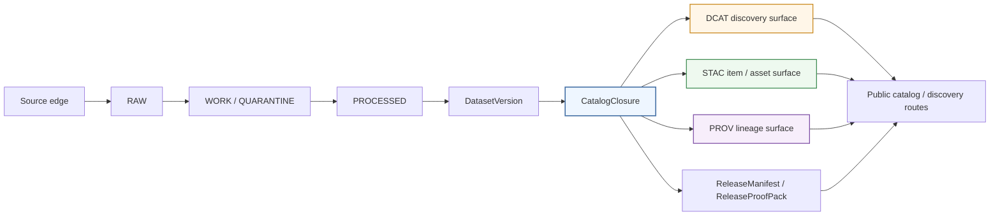

<!-- [KFM_META_BLOCK_V2]
doc_id: kfm://doc/<TODO-uuid>
title: KFM DCAT Profile
type: standard
version: v1
status: draft
owners: @bartytime4life
created: <TODO:YYYY-MM-DD>
updated: <TODO:YYYY-MM-DD>
policy_label: <TODO:confirm public|restricted>
related: [./README.md, ./KFM_STAC_PROFILE.md, ./KFM_PROV_PROFILE.md, ./KFM_MARKDOWN_WORK_PROTOCOL.md, ../../contracts/README.md, ../../schemas/contracts/README.md, ../../tests/contracts/README.md, ../../.github/workflows/README.md, ../runbooks/README.md]
tags: [kfm, dcat, standards, metadata, catalog, catalogclosure]
notes: [doc_id/created/updated/policy_label need live-branch verification; current public-main evidence shows a live schemas/contracts subtree but does not settle canonical schema-home authority.]
[/KFM_META_BLOCK_V2] -->

# KFM DCAT Profile

_Release-linked outward dataset and distribution profile for `CatalogClosure`, designed to keep DCAT inside KFM’s governed `STAC / DCAT / PROV` closure instead of letting catalog prose replace canonical truth._

[](#status--verification-boundary)
[](#status--verification-boundary)
[](#normative-baseline)
[](#relationship-to-stac-and-prov)
[](#current-public-main-signals)
[](#status--verification-boundary)

**Quick jump:** [Purpose](#purpose) · [Status & verification boundary](#status--verification-boundary) · [Repo fit](#repo-fit) · [Current public-main signals](#current-public-main-signals) · [Boundary](#boundary) · [Normative baseline](#normative-baseline) · [Required KFM companion objects](#required-kfm-companion-objects) · [Field matrix](#field-matrix) · [STAC + PROV](#relationship-to-stac-and-prov) · [Validation gates](#validation-and-release-gates) · [Illustrative example](#illustrative-json-ld-example) · [Open verification](#open-verification-backlog)

> [!IMPORTANT]
> This file is a **standard for outward metadata behavior**. It is not the machine contract, not the release proof pack, not the policy bundle, and not proof that the checked-in branch already emits a live DCAT surface.

## Purpose

This standard defines how Kansas Frontier Matrix should use **DCAT** for outward **dataset** and **distribution** discovery.

Its job is deliberately narrow:

- make outward dataset/distribution discovery consistent
- keep DCAT aligned with `CatalogClosure`, `ReleaseManifest`, and linked PROV/STAC artifacts
- preserve the difference between **profile fit** and **mounted conformance**
- make release-gate expectations explicit enough to test
- keep outward catalog behavior honest without collapsing KFM’s internal governance into generic metadata

This document does **not** define canonical storage, route inventory, machine-readable schema bodies, or enforcement code. It defines the **human-readable profile rules** those machine surfaces should eventually reflect.

[Back to top](#kfm-dcat-profile)

## Status & verification boundary

| Field | Value |
| --- | --- |
| Status | `draft` |
| Document role | Standard |
| Path | `docs/standards/KFM_DCAT_PROFILE.md` |
| Owners | `@bartytime4life` *(current strongest public owner signal via `/docs/` coverage in `/.github/CODEOWNERS`; narrower file-level ownership still needs branch verification)* |
| Repo reality | This file exists on public `main` and is routed from `docs/standards/README.md` |
| Truth posture | **CONFIRMED** doctrine · **CONFIRMED** public-main path evidence where stated · **INFERRED** field mapping · **PROPOSED** starter implementation guidance |
| Mounted conformance | **UNKNOWN** |
| Primary seam | `CatalogClosure` |
| Machine-contract authority | **UNKNOWN / NEEDS VERIFICATION** — current public docs still point strongly toward `../../contracts/`, while public `../../schemas/contracts/` now exposes real machine-file scaffolds |

> [!NOTE]
> Current public-main inspection improves the **repo-fit accuracy** of this standard, but it does **not** prove emitter depth, validator depth, fixture ownership, required checks, or live conformance.

## Repo fit

### Path map

| Role | Path | Status | Why it matters |
| --- | --- | --- | --- |
| This standard | [`./KFM_DCAT_PROFILE.md`](./KFM_DCAT_PROFILE.md) | **CONFIRMED** | This is the owned prose surface for DCAT dataset/distribution rules. |
| Standards index | [`./README.md`](./README.md) | **CONFIRMED** | The standards lane already routes here as a substantive draft standard. |
| Sibling STAC profile | [`./KFM_STAC_PROFILE.md`](./KFM_STAC_PROFILE.md) | **CONFIRMED** | DCAT must stay closure-aligned with STAC. |
| Sibling PROV profile | [`./KFM_PROV_PROFILE.md`](./KFM_PROV_PROFILE.md) | **CONFIRMED** | DCAT must stay closure-aligned with PROV. |
| Markdown authoring protocol | [`./KFM_MARKDOWN_WORK_PROTOCOL.md`](./KFM_MARKDOWN_WORK_PROTOCOL.md) | **CONFIRMED** | Keeps truth labels, placeholders, and repo-native authoring discipline aligned. |
| Runbooks index | [`../runbooks/README.md`](../runbooks/README.md) | **CONFIRMED** | Publication/correction/rollback procedures belong there, not here. |
| Publication runbook | `../runbooks/publication.md` | **PROPOSED** | A logical downstream consumer, but not yet a confirmed checked-in file. |
| Human-readable contract lane | [`../../contracts/README.md`](../../contracts/README.md) | **CONFIRMED** doctrinal signal | Public repo docs still point more strongly here for contract authority. |
| Live machine-file contract lane | [`../../schemas/contracts/README.md`](../../schemas/contracts/README.md) | **CONFIRMED** subtree | Public `main` now exposes real machine-file scaffolds here. |
| Versioned machine contract families | [`../../schemas/contracts/v1/README.md`](../../schemas/contracts/v1/README.md) | **CONFIRMED** subtree | Eight first-wave family lanes are now visible here. |
| Release-family schema lane | [`../../schemas/contracts/v1/release/README.md`](../../schemas/contracts/v1/release/README.md) | **CONFIRMED** subtree | The release-family seam is visible, but current schema bodies are still placeholder-heavy. |
| Schema-side fixtures lane | [`../../schemas/tests/README.md`](../../schemas/tests/README.md) | **CONFIRMED** scaffold lane | Nested `valid/invalid` fixture scaffolds are visible, but fixture-home law is not settled. |
| Contract-facing verification lane | [`../../tests/contracts/README.md`](../../tests/contracts/README.md) | **CONFIRMED** | Root verification burden is explicitly visible and sharper than schema-side scaffolds. |
| Workflow lane | [`../../.github/workflows/README.md`](../../.github/workflows/README.md) | **CONFIRMED** docs surface / **UNKNOWN** YAML depth | Public `main` documents workflow intent, but the checked-in workflow directory is README-only. |

### Accepted inputs

This standard is for:

- released or release-candidate dataset metadata
- `CatalogClosure` design and validation work
- outward dataset/distribution discovery behavior
- linked STAC, PROV, and release-manifest references
- public-safe artifact classes such as packaged files, tiles, services, and downloadable distributions
- cross-cutting profile rules that multiple KFM domains should share

### Exclusions

This standard is **not** the home for:

- `RAW`, `WORK`, or `QUARANTINE` object design  
  → keep those in intake, validation, and review surfaces
- machine-facing JSON Schema bodies or controlled vocabularies  
  → keep those in the decided machine-contract lane
- executable policy logic, reasons, or obligation registries  
  → keep those in [`../../policy/`](../../policy/)
- fixtures, negative-path proof packs, or validator harnesses  
  → keep those in [`../../tests/`](../../tests/) and [`../../tests/contracts/`](../../tests/contracts/)
- release manifests, proof packs, receipts, or correction notices as primary records  
  → keep those in their artifact-owning truth-path homes
- direct feature APIs, portrayal APIs, or EvidenceBundle resolver contracts  
  → keep those in code-owning or contract-owning surfaces
- any claim that DCAT is the only metadata truth in KFM  
  → DCAT remains one outward layer inside the larger `STAC / DCAT / PROV` closure

[Back to top](#kfm-dcat-profile)

## Current public-main signals

The strongest improvement this revision makes is **not doctrinal**. It is **repo-fit accuracy**.

| Public-main signal | Current state | Consequence for this standard | Status |
| --- | --- | --- | --- |
| `docs/standards/README.md` | Routes to this file as a substantive draft standard | Revise in place; do not create a parallel DCAT authority surface | **CONFIRMED** |
| `schemas/contracts/` | Live subtree with `v1/` and `vocab/` | Do not describe the machine side as hypothetical anymore | **CONFIRMED** |
| `schemas/contracts/v1/` | Eight family subdirectories with checked-in `*.schema.json` files | Contract-family lanes are real, even though current bodies remain placeholder-heavy | **CONFIRMED** |
| `schemas/contracts/v1/release/release_manifest.schema.json` | Present, current body placeholder (`{}`) | Release-family machine seam exists, but it is not proof of DCAT emitter depth | **CONFIRMED** |
| `schemas/tests/fixtures/contracts/v1/{valid,invalid}` | Visible scaffold-only fixture lane | Example/fixture placement is now a real review concern, not a hypothetical one | **CONFIRMED** |
| `tests/contracts/README.md` | Visible root contract-facing verification lane | Keep validation expectations pointed at proof surfaces, not vague future intent | **CONFIRMED** |
| `.github/workflows/README.md` | Documents workflow lane; public `.github/workflows/` remains README-only | Gate intent is public; merge-blocking YAML inventory is still unproven | **CONFIRMED** |
| Historical workflow names in Actions history | Delete-run history references `verify-docs.yml`, `verify-contracts-and-policy.yml`, `verify-runtime.yml`, `verify-tests-and-reproducibility.yml`, `release-evidence.yml`, and `promote-and-reconcile.yml` | Useful reconstruction clues only; not current checked-in inventory | **CONFIRMED** historical signal / **NEEDS VERIFICATION** for reuse |
| Root `contracts/` vs `schemas/contracts/` | Public docs still route machine-contract authority more strongly toward `contracts/`, while machine files are visible under `schemas/contracts/` | Replace single-home wording with an explicit unresolved-authority posture | **CONFIRMED** tension / **UNKNOWN** resolution |

> [!CAUTION]
> The highest-risk drift is now the opposite of the older problem.  
> It is no longer safe to imply “there is no machine side yet,” and it is still not safe to imply “machine files exist, therefore authority has already moved.”

[Back to top](#kfm-dcat-profile)

## Boundary

### What this profile must do

This profile must make outward discovery **honest**.

A KFM DCAT record should tell a user, integrator, or crawler enough to answer the following questions without pretending to be more authoritative than it is:

- **What is this dataset?**
- **Which released scope does it represent?**
- **What distributions are actually public-safe and available?**
- **What profile(s) does it claim to follow?**
- **Where does lineage continue if the reader needs more than catalog prose?**
- **What rights, review, and sensitivity conditions shaped this release?**
- **How would a correction, supersession, or withdrawal remain visible?**

### What this profile must not do

This profile must not:

- replace canonical truth with catalog prose
- flatten policy, review, and correction state into generic metadata
- publish discovery metadata for unreleased or non-public-safe material
- imply mounted conformance merely because a standard is a good doctrinal fit
- let STAC, DCAT, and PROV drift apart on identifiers, release scope, or lineage links
- silently convert a visible scaffold into a proof of enforcement
- outrun release state, rights state, or public-safe generalization rules

> [!NOTE]
> KFM doctrine repeatedly treats standards as **edge vocabularies**. That posture remains right here. DCAT is valuable because it reduces ambiguity at the public catalog edge, not because it can absorb all of KFM’s internal semantics.

[Back to top](#kfm-dcat-profile)

## Relationship to KFM architecture



### Reading rule

`CatalogClosure` is the decisive seam.

Upstream of it, KFM is still concerned with admission, validation, policy, and review. Downstream of it, KFM can expose outward discovery surfaces. DCAT belongs on the **outward side** of that seam.

[Back to top](#kfm-dcat-profile)

## Normative baseline

### KFM doctrinal anchors

| Anchor | KFM role | Consequence for this document |
| --- | --- | --- |
| Governed truth path | `RAW -> WORK/QUARANTINE -> PROCESSED -> CATALOG -> PUBLISHED` | DCAT belongs in outward catalog closure, not canonical truth. |
| `CatalogClosure` | Publish outward discoverability, lineage, rights/review closure | This profile is centered on the `CatalogClosure` object family. |
| Standards profile discipline | Standards can be a fit without proving mounted conformance | This file must keep doctrine separate from implementation claims. |
| Route-family discipline | Catalog/discovery is a distinct public route family | DCAT records should support discovery routes, not bypass the trust membrane. |
| Verification doctrine | Catalog closure must be tested, not merely described | This file includes release-gate expectations rather than prose-only aspirations. |
| Correction-visible publication | Narrowing, supersession, and withdrawal must remain visible | DCAT records must preserve outward lineage under change. |

### External standard pins

Until the repo exposes a stronger machine-readable registry, the minimum baseline to pin and verify is:

| Standard family | Role in KFM |
| --- | --- |
| JSON Schema Draft 2020-12 | Machine-checkable profile and fixture validation |
| DCAT 3 | Outward dataset/distribution catalog metadata |
| STAC 1.1 | Spatiotemporal item/asset description and discovery |
| PROV-O | Outward lineage vocabulary |

> [!IMPORTANT]
> Pinning a version is **not** the same thing as claiming conformance. Public conformance language remains blocked until the emitter, validator, fixtures, and release-gate evidence are exposed.

### Public-main companion signals

| Surface | What it proves | What it does **not** prove |
| --- | --- | --- |
| [`./README.md`](./README.md) | This file is already routed as a substantive standard | Any emitter or validator exists |
| [`../../schemas/contracts/README.md`](../../schemas/contracts/README.md) | A live machine-file subtree now exists | That schema-home authority is settled |
| [`../../schemas/contracts/v1/release/README.md`](../../schemas/contracts/v1/release/README.md) | The release-family seam is machine-visible | That a DCAT profile schema or release validator is already mounted |
| [`../../tests/contracts/README.md`](../../tests/contracts/README.md) | A sharper contract-facing verification lane exists | That DCAT-specific proof packs are currently checked in |
| [`../../.github/workflows/README.md`](../../.github/workflows/README.md) | Workflow intent and historical lane names are documented | That current public `main` carries active workflow YAML or merge-blocking checks |

[Back to top](#kfm-dcat-profile)

## Required KFM companion objects

DCAT is not enough on its own. In KFM, outward discovery depends on companion objects beside it.

| KFM object | Why it matters for DCAT publication | Status |
| --- | --- | --- |
| `DatasetVersion` | Provides the authoritative released or release-candidate subject set | **CONFIRMED** doctrine |
| `CatalogClosure` | Carries outward `STAC / DCAT / PROV` linkage and release-facing identifiers | **CONFIRMED** doctrine |
| `DecisionEnvelope` | Records machine-readable rights/sensitivity/release result and obligations | **CONFIRMED** doctrine |
| `ReviewRecord` | Captures human approval/denial/escalation where review burden exists | **CONFIRMED** doctrine |
| `ReleaseManifest` / `ReleaseProofPack` | Anchors what the catalog is actually allowed to expose | **CONFIRMED** doctrine |
| `ProjectionBuildReceipt` | Proves that a derived distribution was built from a known release scope | **CONFIRMED** doctrine |
| `CorrectionNotice` | Preserves visible supersession, narrowing, withdrawal, or replacement lineage | **CONFIRMED** doctrine |

> [!WARNING]
> Public `main` now exposes a release-family schema lane, but the closest directly reopened machine file there is still placeholder-only.  
> Treat these companion objects as **required architectural burden**, not as already-proven checked-in enforcement.

[Back to top](#kfm-dcat-profile)

## Field matrix

### KFM semantic model alignment

| KFM concept | Role | DCAT posture |
| --- | --- | --- |
| `DatasetVersion` | Authoritative released or release-candidate subject set | Usually represented outwardly as, or as the basis of, a `dcat:Dataset` |
| `CatalogClosure` | Outward discoverability + lineage + rights/review closure | The decisive bundle that should point to DCAT, STAC, and PROV views together |
| `ReleaseManifest` / `ReleaseProofPack` | Release-level packaging and proof | Must remain linked from the outward record, not collapsed into it |
| Derived public-safe artifact | Actual downloadable or accessible output | Represent as `dcat:Distribution` only when it is release-backed and public-safe |
| `EvidenceBundle` | Support package for claims, answers, or exports | Not a public dataset substitute; link out only where appropriate |
| `CorrectionNotice` | Visible supersession / withdrawal / replacement lineage | Must remain linkable from outward discovery when the release changes |

### Core dataset / distribution rules

| Status | Requirement | DCAT carrier | KFM consequence |
| --- | --- | --- | --- |
| **CONFIRMED** | Every outward DCAT record must be release-linked, not just human-readable | `dct:relation` and/or verified companion links | Public discovery cannot outrun release state |
| **CONFIRMED** | The record must participate in `STAC / DCAT / PROV` closure rather than standing alone | `dct:conformsTo`, `dct:provenance`, linked companion artifacts | DCAT is one outward view, not the whole metadata story |
| **CONFIRMED** | Rights and sensitivity posture must be visible enough to support fail-closed behavior | `dct:license`, `dct:rights`, release-linked notes | Unknown rights should block outward publication |
| **CONFIRMED** | Review / release readiness must be represented at the closure level before public release | linked closure / manifest artifacts | A public DCAT record must not imply “ready” when review is unresolved |
| **INFERRED** | Stable dataset identity is required across re-ingests; versioning must be explicit | `dct:identifier`, version relation fields | Identifier drift breaks discovery, lineage, and correction |
| **INFERRED** | Public-safe temporal and spatial extent belong in the outward record when meaningful | `dct:temporal`, `dct:spatial` | Discovery must expose scope without leaking sensitive precision |
| **INFERRED** | Every public-safe artifact should map to a concrete distribution record | `dcat:distribution` | Do not hide the actual released deliverables behind generic prose |
| **INFERRED** | Profile references must be machine- and human-readable | `dct:conformsTo` | Readers must be able to see which standards/profile rules shaped the record |
| **PROPOSED** | Exact KFM extension predicates should remain unresolved until the repo publishes them | `<TODO:repo-published KFM extension namespace>` | Avoid inventing extension names in prose before mounted adoption exists |

### Minimum outward dataset shape

| Area | Minimum expectation | Status |
| --- | --- | --- |
| Identity | Stable dataset identifier, title, description | **INFERRED** |
| Release linkage | Link to release-manifest and/or catalog-closure artifacts | **CONFIRMED** |
| Lineage | Link to outward PROV bundle or equivalent provenance surface | **CONFIRMED** |
| Discovery profile refs | Declare DCAT profile and any linked STAC/KFM profile refs | **CONFIRMED** |
| Rights posture | License and any additional rights notes required for public use | **CONFIRMED** |
| Review / publication posture | Enough outward indication that public release is valid, generalized, or corrected | **CONFIRMED** |
| Extent | Temporal extent and public-safe spatial extent where relevant | **INFERRED** |
| Distributions | One record per public-safe distribution class | **INFERRED** |

### Distribution rules

| Status | Rule |
| --- | --- |
| **CONFIRMED** | A distribution must never point at `RAW` / `WORK` / `QUARANTINE` scope |
| **CONFIRMED** | A distribution must inherit release linkage, rights posture, freshness basis, and correction state |
| **INFERRED** | Use `downloadURL` only for actual downloadable artifacts; use `accessURL` when the artifact is a service or mediated access point |
| **INFERRED** | Keep media type explicit and tied to the released artifact class |
| **INFERRED** | Distinguish `issued`, `modified`, and data-time extent when those meanings differ materially |
| **PROPOSED** | If one dataset exposes multiple artifact classes (for example, COG, GeoParquet, PMTiles, CSV), publish one `dcat:Distribution` per class rather than flattening them into one ambiguous object |
| **PROPOSED** | Carry checksums or digest echoes where the machine profile settles them, rather than forcing consumers to trust only link text |

### Avoid patterns

| Status | Avoid | Why |
| --- | --- | --- |
| **CONFIRMED** | Treating DCAT as canonical truth | KFM refuses outward metadata to become sovereign truth |
| **CONFIRMED** | Claiming conformance because the standard is a good fit | KFM separates profile fit from mounted adoption |
| **CONFIRMED** | Publishing outward records without rights / review closure | Fail-closed behavior must remain real |
| **CONFIRMED** | Letting correction happen without visible outward lineage | KFM correction preserves history |
| **INFERRED** | Letting DCAT and STAC disagree on identity, release scope, or lineage links | That drift breaks discoverability and trust |
| **INFERRED** | Letting prose imply a settled schema home that adjacent docs still describe as unresolved | It creates silent authority drift between docs and machine files |
| **PROPOSED** | Minting KFM extension fields ad hoc per lane | Extension drift will become catalog drift |

[Back to top](#kfm-dcat-profile)

## Relationship to STAC and PROV

| Need | Primary carrier | Why |
| --- | --- | --- |
| Dataset / distribution discovery | **DCAT** | Best fit for outward catalog and distribution discovery |
| Item / asset discovery with spatiotemporal emphasis | **STAC** | Best fit where items/assets/scenes are the right carrier |
| Activity / agent / entity lineage | **PROV** | Best fit for causal provenance |
| KFM policy, review, release, and correction state | **KFM artifacts beside the standards** | Must remain first-class rather than being erased into generic metadata |

### Practical rule

Use the three together.

- Use **STAC** when the reader needs item/asset shape.
- Use **DCAT** when the reader needs dataset/distribution discovery.
- Use **PROV** when the reader needs lineage.
- Keep **KFM policy / review / release / correction artifacts** visible alongside them.

That is the profile KFM doctrine supports most strongly.

[Back to top](#kfm-dcat-profile)

## Validation and release gates

A public conformance claim for this profile should be blocked unless all of the following pass.

### Definition of done

- [ ] The emitted record validates against the pinned machine profile.
- [ ] `CatalogClosure` tests prove `STAC / DCAT / PROV` resolution and outward-link integrity.
- [ ] Identifier consistency holds across the outward closure.
- [ ] Release linkage resolves to a real release artifact.
- [ ] Rights and sensitivity posture is explicit enough to support fail-closed behavior.
- [ ] Public-safe extent is validated against the lane’s precision rules.
- [ ] Distribution URLs are release-backed and do not expose unpublished scope.
- [ ] Correction / supersession behavior is visible and link-preserving.
- [ ] Documentation and runbook text match emitted behavior.
- [ ] Current branch evidence, not historical workflow memory, supports any conformance wording.
- [ ] Public conformance wording is withheld until mounted evidence exists.

### Current public proof-lane reality

| Surface | What is visible now | What still needs proof |
| --- | --- | --- |
| `docs/standards/` | Real routing surface with STAC, DCAT, PROV, and Markdown protocol docs | Emitter depth, validator depth, and profile synchronization with machine files |
| `schemas/contracts/v1/` | Real machine-file family lane | Substantive schema bodies, settled canonical-home law, and DCAT-specific machine profile location |
| `schemas/tests/` | Real scaffold-only nested fixture lane | DCAT-specific valid/invalid packs and canonical fixture-home resolution |
| `tests/contracts/` | Real contract-facing verification lane | DCAT-specific executable proof packs |
| `.github/workflows/` | Real workflow README plus historical lane names | Current checked-in workflow YAML, required checks, and merge-blocking reality |

### Review prompts

| Question | Why it matters |
| --- | --- |
| Does this record describe a **released** scope, or only a desirable future one? | Prevents trust theater |
| Is the outward record discoverable **and** reconstructable back to governed release state? | Keeps discoverability tied to truth |
| Are STAC, DCAT, and PROV linked, or are they drifting as parallel metadata silos? | Prevents closure breakage |
| Does the record preserve public-safe behavior for sensitive geometry or review-bearing lanes? | Protects policy posture |
| Would a correction or withdrawal remain visible to a reader starting from the catalog? | Preserves lineage under change |
| Does the prose stay honest about the unresolved `contracts/` vs `schemas/contracts/` authority split? | Prevents silent schema-home drift |

## Change control

| Change type | Example | Required response |
| --- | --- | --- |
| Additive outward field | New optional relation or profile ref | Minor version bump; fixture update |
| Meaning change | New interpretation of release readiness or identifier rules | Breaking-change review; migration note; fixture + runbook update |
| Standard-pin change | DCAT / STAC / PROV baseline changes in the registry | Compatibility review; explicit pin update |
| Schema-home decision | Canonical machine-contract authority moves or is formally settled | Boundary-doc update across `contracts/`, `schemas/`, standards, and tests in the same PR |
| Mounted conformance claim | First real emitter or validator lands in repo | Add evidence, tests, and public conformance note |

> [!WARNING]
> This file should not be used to claim mounted conformance until the repo exposes the actual emitter, validator, fixtures, and release-gate evidence.

[Back to top](#kfm-dcat-profile)

## Open verification backlog

<details>
<summary>Items that still need branch or runtime verification</summary>

### Document control

- Fill `doc_id`, `created`, `updated`, and `policy_label` from the real document record.
- Confirm whether file-level ownership should remain `@bartytime4life` or narrow under a future `/docs/standards/` rule.
- Re-check this file against the exact working branch before merge.

### Canonical machine-contract home

- Confirm whether DCAT machine profile authority remains rooted under `../../contracts/`, moves to `../../schemas/contracts/`, or resolves some other way.
- Confirm whether there is a dedicated DCAT machine-readable profile file already present in the active branch.
- Confirm whether the visible schema-side subtree is intended as canonical, mirrored, or transitional.

### Fixtures and validators

- Confirm whether DCAT `valid/invalid` fixtures exist and which lane owns them.
- Confirm the actual validator command, fixture manifest, and error-report shape.
- Confirm whether `tests/contracts/` and `schemas/tests/` have an explicit division of labor for DCAT profile proof.

### Workflow and gate reality

- Confirm whether any historical workflow names documented in `.github/workflows/README.md` have been restored as checked-in YAML.
- Confirm required checks, branch protections, environment approvals, and any OIDC or signing gates that affect outward release proof.
- Confirm whether release-evidence and promote/reconcile lanes exist as current automation or remain historical reconstruction clues.

### Public semantics and KFM extension namespace

- Confirm whether KFM has a published extension namespace for release, review, correction, and profile references.
- Confirm the exact predicate choices for release linkage, correction linkage, and profile refs.
- Confirm lane-specific geometry generalization rules before calling any `dct:spatial` field complete.
- Confirm how checksum/digest carriage should be represented once the machine profile settles.

### Runbook alignment

- Confirm whether `../runbooks/publication.md` exists on the target branch or whether the runbooks index should remain the only linkable neighbor.
- Confirm whether change-control and correction expectations in this standard match the active publication/correction runbooks.

</details>

[Back to top](#kfm-dcat-profile)

## Illustrative JSON-LD example

<details>
<summary>Open a conservative starter example</summary>

The example below is **illustrative**. It is deliberately conservative and keeps placeholders anywhere the current public evidence does not confirm a repo-specific namespace, URL, or predicate choice.

```json
{
  "@context": [
    "https://www.w3.org/ns/dcat2.jsonld",
    {
      "dct": "http://purl.org/dc/terms/",
      "foaf": "http://xmlns.com/foaf/0.1/",
      "vcard": "http://www.w3.org/2006/vcard/ns#",
      "locn": "http://www.w3.org/ns/locn#",
      "time": "http://www.w3.org/2006/time#",
      "spdx": "http://spdx.org/rdf/terms#"
    }
  ],
  "@type": "dcat:Dataset",
  "dct:identifier": "kfm.hydro.usgs_streamflow",
  "dct:title": "USGS streamflow — Kansas (released view)",
  "dct:description": "Illustrative outward discovery record for a release-backed, public-safe KFM dataset.",
  "dct:issued": "<TODO:issued>",
  "dct:modified": "<TODO:modified>",
  "dct:license": {
    "@id": "<TODO:license-iri>"
  },
  "dct:rights": "<TODO:rights-or-public-note>",
  "dct:publisher": {
    "@type": "foaf:Organization",
    "foaf:name": "<TODO:publisher-name>"
  },
  "dcat:contactPoint": {
    "@type": "vcard:Organization",
    "vcard:fn": "<TODO:contact-name>",
    "vcard:hasEmail": "mailto:<TODO:contact-email>"
  },
  "dct:temporal": {
    "@type": "dct:PeriodOfTime",
    "time:hasBeginning": {
      "@type": "time:Instant",
      "time:inXSDDateTime": "<TODO:begin>"
    },
    "time:hasEnd": {
      "@type": "time:Instant",
      "time:inXSDDateTime": "<TODO:end>"
    }
  },
  "dct:spatial": {
    "@type": "dct:Location",
    "locn:geometry": "<TODO:public-safe-wkt-or-geometry-ref>"
  },
  "dct:conformsTo": [
    { "@id": "https://www.w3.org/TR/vocab-dcat-3/" },
    { "@id": "https://stacspec.org/" },
    { "@id": "<TODO:repo-published-kfm-dcat-profile-iri>" }
  ],
  "dct:provenance": {
    "@id": "<TODO:prov-jsonld-ref>"
  },
  "dct:relation": [
    { "@id": "<TODO:catalog-closure-ref>" },
    { "@id": "<TODO:release-manifest-ref>" }
  ],
  "dcat:distribution": [
    {
      "@type": "dcat:Distribution",
      "dct:title": "GeoParquet distribution",
      "dcat:downloadURL": {
        "@id": "<TODO:release-backed-download-url>"
      },
      "dcat:mediaType": "application/vnd.apache.parquet",
      "dcat:byteSize": "<TODO:bytes>",
      "spdx:checksum": {
        "@type": "spdx:Checksum",
        "spdx:algorithm": "spdx:checksumAlgorithm_sha256",
        "spdx:checksumValue": "<TODO:sha256>"
      },
      "dct:conformsTo": [
        { "@id": "<TODO:artifact-profile-iri>" }
      ]
    }
  ]
}
```

### Reading notes

- `dct:relation` is used here as a conservative placeholder for release-linked governed artifacts until a repo-published KFM extension namespace is verified.
- `dct:spatial` must remain **public-safe**. It is not a license to publish precise sensitive geometry.
- `spdx:checksum` is illustrative only. Use it only if the eventual machine profile settles checksum carriage there.
- Richer lineage should continue in a linked PROV surface rather than being flattened into free-text catalog prose.

</details>

[Back to top](#kfm-dcat-profile)

## Maintainer checklist

Before promoting this file from `draft`, verify the following:

- [ ] The meta-block placeholders are filled from real document control data.
- [ ] Repo-fit paths still match the exact branch under review.
- [ ] The standards index, STAC profile, PROV profile, and runbooks links resolve.
- [ ] The machine-profile home is either confirmed or still explicitly marked unresolved.
- [ ] At least one fixture lane and one validator path are confirmed.
- [ ] Any conformance wording is still proportional to current evidence.
- [ ] Behavior-significant changes in emitter/gate reality update this file in the same PR.
- [ ] Release, correction, and public-safe extent language still matches current doctrine and adjacent docs.

[Back to top](#kfm-dcat-profile)
