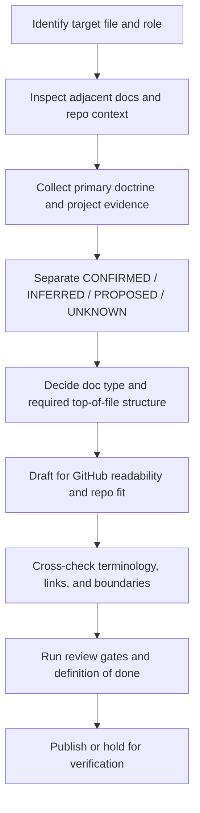

<!-- [KFM_META_BLOCK_V2]
doc_id: kfm://doc/REVIEW_REQUIRED_UUID
title: KFM Markdown Work Protocol
type: standard
version: v1
status: draft
owners: REVIEW_REQUIRED_OWNER
created: REVIEW_REQUIRED_DATE
updated: REVIEW_REQUIRED_DATE
policy_label: REVIEW_REQUIRED_POLICY_LABEL
related: [docs/standards/README.md, docs/standards/markdown-rules.md, ../../README.md, ../../contracts/README.md, ../../schemas/README.md, ../../policy/README.md, ../../tests/README.md, ../../.github/workflows/README.md]
tags: [kfm, documentation, markdown, standards, governance]
notes: [This file existed as scaffold-only on the reviewed public main branch; owners, doc_id, dates, and policy label need direct repo verification before publish.]
[/KFM_META_BLOCK_V2] -->

# KFM Markdown Work Protocol

Governed authoring, revision, and review rules for Markdown that must remain faithful to KFM doctrine, repo evidence, and GitHub-native readability.

> [!IMPORTANT]
> This protocol is a **documentation standard**, not a license to invent implementation state. In KFM, docs are production surfaces: they must preserve truth posture, trust boundaries, release discipline, and visible unknowns.

| Status | Owners | Repo fit | Current public-main state |
|---|---|---|---|
| `draft` | `REVIEW_REQUIRED_OWNER` | `docs/standards/KFM_MARKDOWN_WORK_PROTOCOL.md` | Present previously as scaffold-only; expanded here into a governed protocol |


**Quick jump:** [Scope](#scope) · [Repo fit](#repo-fit) · [Inputs](#accepted-inputs) · [Exclusions](#exclusions) · [Truth posture](#truth-posture-and-claim-discipline) · [Workflow](#authoring-workflow) · [Formatting](#github-markdown-formatting-protocol) · [Review gates](#review-gates-and-definition-of-done) · [Appendix](#appendix)

---

## Scope

This protocol governs how Markdown is created, revised, extended, and reviewed in KFM when the document is expected to be:

- repo-native
- evidence-aware
- GitHub-readable
- doctrine-consistent
- safe to commit after verification

It applies most strongly to:

- standards documents
- README-like docs
- architecture and governance docs
- workflow and protocol docs
- cross-cutting reference docs
- documentation rewrites that translate doctrine into clearer repo-ready form

It does **not** convert unsupported repo guesses into fact, and it does **not** outrank stronger project doctrine.

[Back to top](#kfm-markdown-work-protocol)

## Repo fit

**Path:** `docs/standards/KFM_MARKDOWN_WORK_PROTOCOL.md`

**Upstream context**

- `../../README.md` — repo-level posture, truth vocabulary, and contributor-facing framing
- `docs/standards/README.md` — directory index and local standards map
- `docs/standards/markdown-rules.md` — normative Markdown authoring instruction surface for this repo area

**Downstream / neighboring docs**

- standards and profiles that need consistent Markdown structure
- future doctrine-to-implementation docs under `docs/standards/`
- docs that need shared treatment of truth labels, placeholders, metadata blocks, visual structure, and GitHub reviewability

**Working role in the repo**

This file is the operating protocol for how KFM Markdown should be written. It is intentionally narrower than master doctrine and more operational than the directory README.

[Back to top](#kfm-markdown-work-protocol)

## Accepted inputs

The following inputs belong here when authoring or revising Markdown under this protocol:

| Input class | What to use it for | Minimum expectation |
|---|---|---|
| KFM doctrinal manuals | Governing language, invariants, truth posture, trust membrane, publication rules | Prefer repeated doctrine over one-off phrasing |
| Adjacent repo docs | Local structure, section rhythm, naming patterns, visual style | Match nearby conventions where they are strong |
| Contracts / schemas / policy docs | Machine-checkable claims, object names, route families, validation burdens | Do not paraphrase away load-bearing terms |
| Verified repo files | File paths, ownership signals, current scaffold state, workflow surface facts | Treat direct repo inspection as stronger than memory |
| CI / workflow docs | Review gates, merge expectations, generated-doc burdens | Keep enforcement claims proportional to visible evidence |
| Tests / fixtures / examples | Concrete proof that behavior exists | If absent, say so |
| External standards | Boundary-sensitive or version-sensitive clarification only | Use to sharpen, not to silently override KFM |

[Back to top](#kfm-markdown-work-protocol)

## Exclusions

This file does **not** own the canonical contents of:

- API or object schemas that belong in `contracts/` or `schemas/`
- executable policy logic that belongs in `policy/`
- fixtures, validation suites, or harness code that belong in `tests/`
- build tooling details that belong in `tools/`, `scripts/`, or workflow files
- implementation claims not supported by direct repo, workspace, or authoritative source evidence

When content primarily belongs elsewhere, this protocol should link to it rather than absorb it.

> [!NOTE]
> Markdown may summarize other system surfaces, but it must not become a shadow schema registry, a fake runbook, or a second source of truth that drifts from the actual repo.

[Back to top](#kfm-markdown-work-protocol)

## Truth posture and claim discipline

KFM documentation must keep uncertainty visible.

### Required truth labels

Use these labels when precision matters:

| Label | Meaning | Use when |
|---|---|---|
| **CONFIRMED** | Directly supported by visible repo/workspace evidence, attached source material, or authoritative verification used for unstable facts | Stating what the repo, doctrine, or artifact actually shows |
| **INFERRED** | Conservative structural completion strongly implied by multiple project sources | Filling a necessary gap without claiming mounted implementation |
| **PROPOSED** | Recommended design, workflow, or structure consistent with doctrine but not verified as current implementation | Suggesting next-shape docs, routes, checklists, templates, or policy surfaces |
| **UNKNOWN** | Not verified strongly enough in the current session to claim as current fact | Repo topology, automation coverage, shipping behavior, real schema inventory, actual workflow gates |
| **NEEDS VERIFICATION** | Review-critical item that must be checked before publish or implementation reliance | Ownership, dates, policy label, exact enforcement, exact file paths if not directly inspected |

### Claim rules

1. **Repo fact claims require repo evidence.**
2. **Implementation claims require implementation evidence.**
3. **Doctrinal claims may rely on doctrinal documents, but should keep mounted implementation separate.**
4. **Recommendations must be labeled as recommendations.**
5. **Unknowns stay visible.** Do not smooth them away for polish.

### Disallowed moves

- stating that a workflow is enforced because it is described
- stating that a schema exists because a README references it
- stating that CI blocks merges because a checklist says it should
- implying that docs prove runtime reality
- replacing project terms with nicer generic terms
- collapsing **INFERRED** or **PROPOSED** into **CONFIRMED**

[Back to top](#kfm-markdown-work-protocol)

## KFM-specific authoring principles

### 1) Docs are production surfaces

In KFM, documentation is part of the operating system of trust. It should help preserve:

- governed publication
- correction lineage
- evidence visibility
- rights and sensitivity posture
- route and contract clarity
- reviewer confidence

### 2) Doctrine outranks fashion

Prefer:

- trust membrane
- canonical truth path
- authoritative-versus-derived separation
- cite-or-abstain posture
- fail-closed negative outcomes
- map-first and time-aware operation
- 2D-by-default reasoning unless extra burden is justified

### 3) Strong docs stay close to executable seams

Good KFM Markdown points clearly toward:

- contracts
- schemas
- policy bundles
- fixtures
- tests
- route families
- proof objects
- review gates
- correction and rollback paths

### 4) Pleasant GitHub rendering matters, but not more than truth

Readable structure is required. Decorative overconfidence is not.

[Back to top](#kfm-markdown-work-protocol)

## Document type decision

Before drafting, decide what kind of Markdown you are writing.

| Doc type | Required baseline behavior | Special obligations |
|---|---|---|
| Standard doc | Include KFM meta block v2 unless a stronger local exception is already established | Keep metadata synchronized with visible title and role |
| README-like doc | Include purpose line, repo fit, accepted inputs, exclusions, impact block, quick jumps, diagram | Must feel navigable in GitHub |
| Architecture / governance doc | Separate doctrine, realization, and unknowns | Avoid runtime overclaim |
| Revision of existing file | Preserve strong substance and local terminology | Improve without flattening |
| New file | Fit adjacent structure and linking patterns | Do not duplicate nearby docs unless the split is intentional |

If a document is both standard and README-like, satisfy both unless a neighboring convention clearly says otherwise.

[Back to top](#kfm-markdown-work-protocol)

## Authoring workflow



### Step 1 — Identify the target

Confirm:

- exact path
- likely audience
- document role
- whether it is new, scaffold-only, or already substantive

### Step 2 — Inspect local context first

Read nearby files before drafting:

- local README
- same-directory docs
- repo root README if relevant
- neighboring standards, schemas, policy, or test docs

### Step 3 — Build the evidence stack

Use evidence in this order:

1. attached and canonical project doctrine
2. directly visible repo/workspace files
3. authoritative external material only where needed

### Step 4 — Separate statement classes

For each important statement, ask:

- Is this a repo fact?
- Is this a doctrinal rule?
- Is this an implementation claim?
- Is this a recommendation?
- Is this still unknown?

### Step 5 — Draft in repo-native form

The draft should feel like it belongs exactly where it is placed.

### Step 6 — Audit for drift and overclaim

Specifically check for:

- invented repo state
- softened unknowns
- term substitution
- unsupported enforcement claims
- duplicated neighboring docs
- flat or visually dead sections

[Back to top](#kfm-markdown-work-protocol)

## Required top-of-file structure

### For standard docs

Include the KFM meta block v2 at the top of the file.

### For README-like or operational protocol docs

Include, near the top:

- title
- one-line purpose
- status
- owners
- repo fit
- quick jump links
- badges
- clear note when parts remain placeholders or need verification

### Placeholder discipline

If a value is not confirmed, use a reviewable placeholder such as:

- `REVIEW_REQUIRED_OWNER`
- `REVIEW_REQUIRED_DATE`
- `REVIEW_REQUIRED_UUID`
- `REVIEW_REQUIRED_POLICY_LABEL`

Do not silently guess.

[Back to top](#kfm-markdown-work-protocol)

## GitHub Markdown formatting protocol

### Headings

- one `#` heading only
- crisp, informative section names
- stable anchor-friendly wording
- avoid decorative heading noise

### Paragraph rhythm

- keep paragraphs compact
- vary section cadence
- break dense guidance with tables, diagrams, callouts, or examples

### Links

- prefer relative links
- link to adjacent docs when they materially help navigation
- do not link excessively just to decorate the page

### Tables

Use tables when they reduce ambiguity, especially for:

- truth labels
- ownership surfaces
- document classes
- gate lists
- responsibility splits
- allowed vs disallowed behavior

### Callouts

Use only where they help. Preferred set:

- NOTE
- TIP
- IMPORTANT
- WARNING
- CAUTION

### Code fences

- always language-tagged when possible
- use `text` when the block is a literal example rather than runnable code
- label pseudocode as such

### Long content

Wrap bulk material in `<details>` if it is reference-heavy but not critical to first-pass reading.

### Diagrams

README-like and directory-facing docs should include at least one meaningful Mermaid diagram.

[Back to top](#kfm-markdown-work-protocol)

## Repo-native writing rules

### Preserve project language

Use the terms the project already uses, including where relevant:

- trust membrane
- canonical truth path
- EvidenceBundle
- RuntimeResponseEnvelope
- DecisionEnvelope
- ReleaseManifest
- CorrectionNotice
- map-first
- time-aware
- authoritative-versus-derived
- public-safe

Do not silently replace them with softer generic prose.

### Keep boundaries explicit

A good KFM Markdown file should make it easy to tell:

- what belongs here
- what belongs elsewhere
- which claims are doctrine
- which are implementation
- which are still pending verification

### Do not treat scaffolds as proof

A scaffold file, placeholder README, or intent-only workflow document is evidence of **planned structure**, not evidence of active enforcement.

### Avoid duplicate authority

If an adjacent file already serves as the directory index or local doctrine summary, this file should deepen or specialize it rather than rewriting it.

[Back to top](#kfm-markdown-work-protocol)

## README-like minimums for KFM docs

When the document behaves like a README, it must include:

| Requirement | Why |
|---|---|
| Title | Reader orientation |
| One-line purpose | Immediate context |
| Repo fit | Path and placement clarity |
| Accepted inputs | Scope control |
| Exclusions | Boundary protection |
| Impact block | Review and maintenance shortcut |
| Quick jumps | GitHub navigation |
| Diagram | Structural explanation |
| Review checklist or task list | Commit readiness |

[Back to top](#kfm-markdown-work-protocol)

## Review gates and definition of done

A KFM Markdown file is not done when it merely sounds polished.

### Minimum review gates

- [ ] Title matches the actual role of the file
- [ ] KFM meta block v2 is present for standard docs
- [ ] Unverified values are placeholders, not guesses
- [ ] Adjacent docs were inspected
- [ ] Repo fit is explicit
- [ ] Accepted inputs and exclusions are explicit
- [ ] At least one meaningful diagram is included where README-like structure applies
- [ ] Links are relative where possible
- [ ] Terminology matches KFM doctrine
- [ ] No implementation claim outruns visible evidence
- [ ] **CONFIRMED / INFERRED / PROPOSED / UNKNOWN / NEEDS VERIFICATION** are used where precision matters
- [ ] The document is readable in GitHub without feeling flat or overstuffed
- [ ] Long appendices are collapsed when appropriate
- [ ] Open verification items are left visible

### Definition of done

A document meets this protocol when it is:

1. faithful to KFM doctrine  
2. honest about repo and implementation evidence  
3. visually usable in GitHub  
4. locally consistent with adjacent repo docs  
5. structurally reviewable in Git  
6. safe to commit after direct verification of remaining placeholders

[Back to top](#kfm-markdown-work-protocol)

## Common failure modes

> [!WARNING]
> The most damaging documentation failure in KFM is not ugly formatting. It is persuasive overclaim.

| Failure mode | Why it is harmful | Required correction |
|---|---|---|
| Treating doctrine as shipped implementation | Creates false confidence | Relabel as **PROPOSED** or **UNKNOWN** |
| Replacing project terms with generic language | Weakens doctrinal precision | Restore project terminology |
| Writing from memory of the repo | Introduces drift | Re-inspect files |
| Building “better looking” but flatter docs | Loses auditability and usefulness | Reintroduce evidence, boundaries, and review detail |
| Hiding unresolved metadata values | Breaks governance posture | Use placeholders and notes |
| Duplicating nearby README content | Creates competing guidance | Link and specialize instead |
| Claiming enforcement without visible gates | Misstates trust posture | Mark **NEEDS VERIFICATION** |

[Back to top](#kfm-markdown-work-protocol)

## Change discipline for existing Markdown

When revising an existing file:

1. keep strong doctrinal language
2. remove repetition only when it adds no governance value
3. normalize term drift
4. add structure where scanability is weak
5. make unknowns more visible, not less
6. improve navigation, examples, and reviewability
7. avoid broad rewrites unless the current file is only a scaffold or clearly broken

For scaffold-only files, a substantial upward rewrite is appropriate so long as it stays evidence-bounded.

[Back to top](#kfm-markdown-work-protocol)

## Illustrative starter pattern

> [!NOTE]
> The following is illustrative. It demonstrates shape, not confirmed repo-wide automation.

```text
1. Inspect adjacent docs
2. Identify stronger doctrinal anchors
3. Confirm whether the target file is standard, README-like, or both
4. Add KFM meta block with placeholders where required
5. Draft purpose, repo fit, inputs, exclusions, and quick jumps
6. Add one meaningful diagram
7. Separate confirmed facts from recommendations
8. Run review gates
9. Leave unresolved items visible
```

[Back to top](#kfm-markdown-work-protocol)

## Protocol interaction with other standards surfaces

This file should be read alongside, not instead of:

- `docs/standards/README.md` for directory navigation
- `docs/standards/markdown-rules.md` for the broader Markdown authoring instruction set
- repo-level governance and doctrine docs for stronger architectural authority
- contracts, policy, and test surfaces when writing about executable behavior

[Back to top](#kfm-markdown-work-protocol)

## Appendix

<details>
<summary><strong>Appendix A — What this file should eventually verify directly</strong></summary>

Before this document moves beyond draft, verify at minimum:

- confirmed owner or team
- final doc UUID
- confirmed policy label
- whether markdown linting, Vale, pre-commit hooks, or CI doc gates exist
- whether this protocol applies repo-wide or only within `docs/standards/`
- whether there is a separate documentation source-of-truth manual already mounted in the repo
- whether any templates or generators should be linked here explicitly

</details>

<details>
<summary><strong>Appendix B — Recommended companion checklist for reviewers</strong></summary>

Reviewer prompts:

- Does the file sound like KFM, or like generic platform documentation?
- Which claims are truly **CONFIRMED**?
- Are any repo, path, route, workflow, or schema statements overclaimed?
- Is the metadata block honest?
- Does the page help a maintainer move faster without hiding uncertainty?
- Does the doc link to neighboring authority instead of competing with it?

</details>

<details>
<summary><strong>Appendix C — Suggested downstream standards that may cite this protocol</strong></summary>

Potential downstream users of this protocol include:

- standards profiles
- source onboarding docs
- route-family docs
- review and correction workflow docs
- package and release proof-pack docs
- shell and Evidence Drawer docs
- contributor-facing documentation contribution rules

</details>
