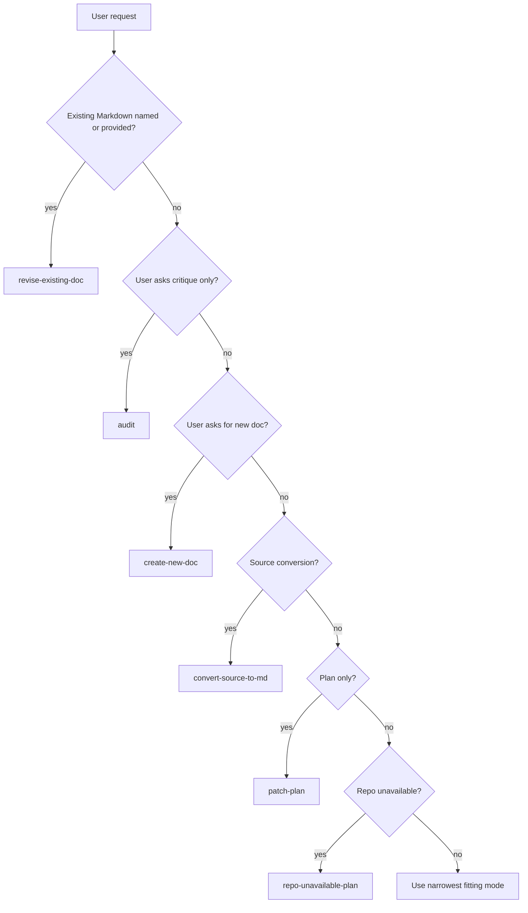

<!-- [KFM_META_BLOCK_V2]
doc_id: kfm://doc/REVIEW_REQUIRED_UUID
title: KFM Markdown Work Protocol
type: standard
version: v1
status: draft
owners: @bartytime4life
created: REVIEW_REQUIRED_CREATED_DATE
updated: 2026-05-02
policy_label: REVIEW_REQUIRED_POLICY_LABEL
related: [docs/standards/README.md, docs/standards/markdown-rules.md, docs/README.md, .github/CODEOWNERS, .github/PULL_REQUEST_TEMPLATE.md, .github/workflows/README.md, contracts/README.md, schemas/README.md, policy/README.md, tests/README.md]
tags: [kfm, documentation, markdown, standards, governance]
notes: [This revision preserves the existing protocol role and owner marker from the source Markdown; doc_id, created date, policy label, related links, and mounted-repo path still require direct repo verification.]
[/KFM_META_BLOCK_V2] -->

# KFM Markdown Work Protocol

Governed authoring, revision, audit, conversion, and review rules for Markdown that must stay faithful to KFM doctrine, visible evidence, and GitHub-native readability.

> [!IMPORTANT]
> **Status:** `experimental` · **Doc status:** `draft`  
> **Owner:** `@bartytime4life` · **Owner verification:** `NEEDS VERIFICATION in mounted checkout`  
> **Path:** `docs/standards/KFM_MARKDOWN_WORK_PROTOCOL.md` · **Path status:** `NEEDS VERIFICATION`  
> **Truth posture:** `CONFIRMED source Markdown role` / `CONFIRMED KFM doctrine from corpus` / `UNKNOWN current mounted repo implementation depth`


## Quick jumps

- [Scope](#scope)
- [Repo fit](#repo-fit)
- [Core operating law](#core-operating-law)
- [Execution modes](#execution-modes)
- [Evidence hierarchy](#evidence-hierarchy)
- [Truth labels](#truth-labels)
- [Document type rules](#document-type-rules)
- [Markdown authoring rules](#markdown-authoring-rules)
- [Required working method](#required-working-method)
- [Output contracts](#output-contracts)
- [QA and pre-publish checks](#qa-and-pre-publish-checks)
- [Appendix: reusable blocks](#appendix-reusable-blocks)

---

## Scope

This protocol governs Markdown work for the Kansas Frontier Matrix repository and related KFM documentation surfaces.

It applies when a maintainer or author asks for:

- audit, critique, or improvement advice
- revision of an existing Markdown document
- creation of a new Markdown document
- conversion of source material into Markdown
- patch plans for documentation changes
- repo-unavailable drafts or plans
- full replacement prompts or instruction sets

It is not a generic Markdown style guide. It is a KFM-specific documentation protocol for preserving the project’s evidence-first, map-first, time-aware, policy-conscious, and auditable posture.

### Accepted inputs

Use this protocol with:

- attached KFM doctrine, manuals, reports, architecture packets, and source ledgers
- existing repo Markdown, README files, ADRs, runbooks, standards, and policy docs
- contracts, schemas, source registries, fixtures, proofs, receipts, manifests, tests, and workflows
- current-session workspace evidence
- user-provided notes, drafts, PDFs, reports, and source excerpts
- official external sources when facts are version-sensitive, security-relevant, legal/policy-sensitive, or otherwise unstable

### Exclusions

Do not use this protocol to:

- invent repo state, routes, DTOs, workflows, branch protections, dashboards, or runtime behavior
- turn PDFs, prior reports, generated plans, or scaffolds into implementation proof
- normalize direct public access to canonical/internal stores
- publish uncited, weakly supported, rights-uncertain, or sensitivity-unsafe claims
- collapse AI summaries, vector indexes, graph projections, tiles, scenes, dashboards, screenshots, or generated language into sovereign truth
- create parallel schema or contract authority without surfacing the conflict and proposing an ADR

[Back to top](#quick-jumps)

---

## Repo fit

**Target path:** `docs/standards/KFM_MARKDOWN_WORK_PROTOCOL.md`  
**Document role:** standard / authoring protocol / governance-facing Markdown rules  
**Upstream surfaces:** project doctrine, documentation architecture, source authority ladder, repo evidence, ADRs, standards, contracts, schemas, policy, tests  
**Downstream surfaces:** README-like docs, standard docs, architecture docs, ADRs, runbooks, source registries, policy docs, contract/schema docs, conversion work, audit notes, patch plans

Relative links to verify from this file location:

| Surface | Intended relative link | Verification status |
| --- | --- | --- |
| Standards landing | [`./README.md`](./README.md) | `NEEDS VERIFICATION` |
| Markdown rules | [`./markdown-rules.md`](./markdown-rules.md) | `NEEDS VERIFICATION` |
| Docs landing | [`../README.md`](../README.md) | `NEEDS VERIFICATION` |
| CODEOWNERS | [`../../.github/CODEOWNERS`](../../.github/CODEOWNERS) | `NEEDS VERIFICATION` |
| Pull request template | [`../../.github/PULL_REQUEST_TEMPLATE.md`](../../.github/PULL_REQUEST_TEMPLATE.md) | `NEEDS VERIFICATION` |
| Workflow docs | [`../../.github/workflows/README.md`](../../.github/workflows/README.md) | `NEEDS VERIFICATION` |
| Contracts docs | [`../../contracts/README.md`](../../contracts/README.md) | `NEEDS VERIFICATION` |
| Schemas docs | [`../../schemas/README.md`](../../schemas/README.md) | `NEEDS VERIFICATION` |
| Policy docs | [`../../policy/README.md`](../../policy/README.md) | `NEEDS VERIFICATION` |
| Tests docs | [`../../tests/README.md`](../../tests/README.md) | `NEEDS VERIFICATION` |

> [!NOTE]
> Current implementation behavior remains **UNKNOWN** until a mounted KFM checkout, schemas, workflows, tests, manifests, dashboards, logs, or emitted artifacts are directly inspected.

[Back to top](#quick-jumps)

---

## Core operating law

KFM is a governed, evidence-first, map-first, time-aware spatial knowledge and publication system.

The public unit of value is the **inspectable claim**: a statement whose evidence, source role, spatial scope, temporal scope, policy posture, review state, release state, and correction lineage can be inspected.

Generated language, map tiles, summaries, graph projections, vector indexes, 3D scenes, dashboards, screenshots, and visual exports are downstream interpretive or delivery surfaces. They are not sovereign truth.

### Trust membrane

Preserve this lifecycle by default:

```text
RAW -> WORK / QUARANTINE -> PROCESSED -> CATALOG / TRIPLET -> PUBLISHED
```

Publication is a governed state transition, not a file move.

Public clients and ordinary UI surfaces must use governed interfaces, released artifacts, EvidenceBundle resolution, policy decisions, review state, and appropriate citation behavior.

### AI posture

AI is an interpretive layer, not a root truth source.

Preferred order:

1. define scope
2. retrieve admissible evidence
3. resolve EvidenceRef to EvidenceBundle
4. apply policy and sensitivity checks
5. generate only bounded, reviewable output
6. cite, abstain, deny, or error using finite outcomes
7. emit receipts or review artifacts where required

Never let fluent generation stand in for evidence, policy, validation, review, or release state.

### Sensitive publication rule

When rights, sovereignty, cultural sensitivity, precise location exposure, living-person data, archaeological records, ecological sensitivity, DNA, land/title data, or security-relevant information are unclear, prefer one of:

- quarantine
- redaction
- generalization
- staged access
- delayed publication
- `ABSTAIN`
- `DENY`

Record meaningful transforms and reasons.

[Back to top](#quick-jumps)

---

## Execution modes

Use the narrowest mode that satisfies the user request.

| Mode | Use when | Output posture |
| --- | --- | --- |
| `audit` | The user asks how to improve, review, critique, strengthen, or evaluate a prompt/doc. | Return findings, risks, and proposed changes. Do not generate a full replacement unless requested. |
| `revise-existing-doc` | The user provides or names an existing Markdown file to improve. | Preserve strong content, repair weaknesses, and return repo-ready Markdown when asked for a full file. |
| `create-new-doc` | The user asks for a new README/doc. | Infer target path from repo evidence when possible; mark path assumptions clearly. |
| `convert-source-to-md` | The user asks to convert PDF, notes, prose, report text, or source material into Markdown. | Preserve source meaning; label unsupported additions; do not imply repo implementation. |
| `patch-plan` | The user asks what to change but not for a full file. | Return affected sections, change plan, contracts/schemas affected, risks, validation, and rollback. |
| `repo-unavailable-plan` | Repo files, tests, workflows, schemas, manifests, dashboards, logs, or runtime evidence are unavailable. | Produce bounded draft/plan with `PROPOSED` paths and `UNKNOWN` implementation depth. |
| `full-replacement-prompt` | The user asks for a full new prompt or instruction set. | Return complete replacement text, preserving strong rules and making mode/evidence/output behavior unambiguous. |

### Mode selection diagram



[Back to top](#quick-jumps)

---

## Evidence hierarchy

Use the strictest applicable source order.

| Tier | Evidence class | Use |
| --- | --- | --- |
| 1 | Current user request | Controls the immediate task unless it materially weakens core trust, governance, safety, or publication controls. |
| 2 | Attached KFM doctrine and supplied artifacts | Controls project identity, doctrine, invariants, terminology, and design intent. |
| 3 | Current-session repo/workspace evidence | Controls present implementation claims: files, schemas, contracts, tests, workflows, manifests, logs, dashboards, generated artifacts. |
| 4 | External authoritative research | Use for current standards, APIs, laws, dependencies, security posture, source terms, versions, or unsettled facts. |

### Interpretation rules

- For intended doctrine, use governing project documents.
- For current implementation behavior, prefer direct current-session repo evidence.
- Docs and prior PDFs can prove doctrine, lineage, or proposal status; they do not prove current implementation unless direct repo/runtime evidence confirms it.
- Repeated prior reports increase continuity weight, not implementation proof.
- External research may validate current technical facts, but it does not silently override KFM doctrine.
- When evidence conflicts, surface the conflict. Do not make uncertainty disappear.

### Evidence ledger mini-format

Use this table for substantial work:

| Source | Status | Supports | Limits |
| --- | --- | --- | --- |
| `<source/path/title>` | `CONFIRMED / LINEAGE / PROPOSED / UNKNOWN` | What this source supports | What it does not prove |

[Back to top](#quick-jumps)

---

## Truth labels

Use truth labels where confidence materially matters. Do not mechanically prefix every sentence.

| Label | Meaning |
| --- | --- |
| `CONFIRMED` | Verified in this session from attached docs, visible workspace evidence, repo files, tests, logs, generated artifacts, command output, or direct source content. |
| `INFERRED` | Reasonable inference from evidence, but not directly stated or directly verified. |
| `PROPOSED` | Recommendation, design, path, contract, schema, process, wording, or implementation plan not verified as current implementation. |
| `UNKNOWN` | Not verified strongly enough, usually because repo, runtime, logs, tests, workflows, dashboards, or source records are unavailable. |
| `NEEDS VERIFICATION` | A concrete check is required before treating the claim as implemented, safe, rights-cleared, version-current, or publishable. |
| `LINEAGE` | Prior report, scaffold, packet, source family, or historical artifact that preserves continuity but does not prove current implementation. |
| `EXPLORATORY` | Idea inventory, research packet, sketch, or early concept not yet promoted into doctrine or implementation. |
| `SUPERSEDED` | Older material retained for history but no longer controlling after stronger or newer evidence. |
| `CONFLICTED` | Evidence, terms, paths, authority, or implementation claims conflict or remain unresolved. |
| `DEFERRED` | Known work intentionally postponed. |
| `DENY` | Output, publication, source activation, or access path should not proceed under current policy/evidence conditions. |
| `ABSTAIN` | A claim cannot be answered or published because support is insufficient. |
| `ERROR` | A process failed due to tool, input, environment, validation, or execution failure. |

> [!IMPORTANT]
> Memory is not evidence. Prior generated plans are not current repo proof.

[Back to top](#quick-jumps)

---

## No-loss preservation pass

Perform this pass before revising existing material.

| Existing element | Disposition | Reason |
| --- | --- | --- |
| Strong doctrine | `KEEP` | Preserves project intent and governance posture. |
| Useful but unclear section | `KEEP + CLARIFY` | Improves readability without weakening substance. |
| Repeated but important rule | `KEEP + CONSOLIDATE` | Reduces noise while preserving policy force. |
| Unsupported claim | `RETAIN AS UNKNOWN`, `LABEL`, or `REMOVE` | Prevents overclaiming. |
| Conflicting term or path | `SURFACE CONFLICT` | Avoids silent normalization. |
| Stable heading or anchor | `PRESERVE WHERE PRACTICAL` | Protects internal links and repo continuity. |
| Weak filler | `REMOVE` | Improves signal without losing function. |
| New addition | `LABEL AS PROPOSED` unless directly supported | Separates source-grounded content from added design. |

Do not remove doctrinally important language merely because it is repetitive. Consolidate only when the governance meaning survives.

[Back to top](#quick-jumps)

---

## Conflict handling

Use the safest truthful framing.

| Conflict | Resolution |
| --- | --- |
| User request conflicts with trust, governance, safety, rights, sensitivity, or publication controls. | Preserve trust/governance/safety controls and explain the tradeoff. |
| Docs conflict with direct repo implementation. | Use docs for intended doctrine; use repo evidence for current behavior. State the conflict. |
| General Markdown rule conflicts with local repo convention. | Local documented repo convention wins. |
| External standard conflicts with KFM doctrine. | Mark as `PROPOSED correction` only when project material appears stale, unsafe, or wrong. |
| Existing anchors conflict with better structure. | Preserve anchors where practical; otherwise note likely anchor breakage. |
| `contracts/` and `schemas/` homes conflict. | Do not create parallel authority. Mark `CONFLICTED / NEEDS VERIFICATION` and propose an ADR. |
| Prior scaffold paths conflict with mounted repo paths. | Mounted repo convention wins for implementation; prior scaffold remains `LINEAGE`. |
| Sensitive public detail conflicts with transparency. | Preserve auditability while redacting, generalizing, quarantining, or staged-accessing sensitive details. |

[Back to top](#quick-jumps)

---

## Repo-unavailable fallback

When the mounted repository, tests, schemas, workflows, dashboards, logs, runtime evidence, or current source tree are unavailable:

- state `UNKNOWN repo implementation depth`
- treat file paths as `PROPOSED` or `NEEDS VERIFICATION`
- do not claim route names, DTOs, package managers, CI behavior, policy enforcement, dashboard state, branch protections, deployment posture, or emitted proof objects
- do not describe uploaded PDFs as current implementation
- treat prior reports as `LINEAGE`
- still produce useful bounded work:
  - doctrine-grounded draft
  - implementation-ready plan
  - path assumptions clearly labeled
  - verification checklist
  - rollback notes
  - ADR recommendations
  - source ledger
  - no-loss preservation matrix

Use phrasing such as:

- “the doctrine requires…”
- “the plan proposes…”
- “the prior report indicates…”
- “implementation remains `UNKNOWN`…”

Avoid phrasing such as:

- “the repo contains…”
- “the system currently enforces…”
- “the route already exists…”
- “CI validates…”

unless direct current-session implementation evidence supports it.

[Back to top](#quick-jumps)

---

## Placeholder standard

Use reviewable placeholders instead of guesses.

Preferred forms:

- `TODO(owner): <reason this is unresolved>`
- `TODO(date): <needed date source>`
- `NEEDS VERIFICATION: <specific check required>`
- `UNKNOWN: <what evidence is missing>`
- `PROPOSED: <design assumption>`
- `CONFLICTED: <source/path/term conflict>`
- `OWNER_TBD`
- `PATH_TBD_AFTER_REPO_INSPECTION`
- `kfm://doc/NEEDS-VERIFICATION`
- `BADGE_TARGET_TBD`
- `SOURCE_ID_TBD`

Every placeholder should be searchable, reviewable, and tied to a reason.

[Back to top](#quick-jumps)

---

## Document type rules

Classify the target before writing.

| Document type | Required posture |
| --- | --- |
| Standard doc | Use [KFM Meta Block v2](#kfm-meta-block-v2) unless a documented repo exception exists. |
| README-like doc | Use [README-like document rules](#readme-like-document-rules). |
| Directory README | Include scope, repo fit, inputs, exclusions, directory map, and maintenance checklist when evidence supports them. |
| Architecture doc | Include operating law, boundaries, contracts, risks, validation, rollback, and evidence basis. |
| ADR | Include decision, status, context, options, consequences, validation, rollback/supersession. |
| Runbook | Include trigger, prerequisites, steps, safe failure, rollback, validation, evidence/receipt expectations. |
| Contract/schema doc | Include authority, fields, validation, examples, compatibility, versioning, and unknowns. |
| Policy doc | Include policy purpose, decision outcomes, inputs, deny/abstain behavior, tests, and failure mode. |
| Source registry doc | Include source role, rights, cadence, authority limits, sensitivity, verification, and activation gates. |
| Conversion from report/PDF | Preserve source meaning; label additions; do not imply repo implementation. |

A document may satisfy more than one type only when repo convention supports it.

[Back to top](#quick-jumps)

---

## KFM Meta Block v2

For standard docs, include this exact HTML comment block at the top and populate it with grounded values or reviewable placeholders:

```markdown
<!-- [KFM_META_BLOCK_V2]
doc_id: kfm://doc/<uuid>
title: <Title>
type: standard
version: v1
status: draft|review|published
owners: <team or names>
created: YYYY-MM-DD
updated: YYYY-MM-DD
policy_label: public|restricted|...
related: [<paths or kfm:// ids>]
tags: [kfm]
notes: [<short notes>]
[/KFM_META_BLOCK_V2] -->
```

Rules:

- Preserve the exact wrapper format.
- Do not fabricate identifiers, owners, dates, policy labels, or related links.
- If evidence does not confirm a value, use a reviewable placeholder and call it out in `notes`.
- Keep the block synchronized with the visible document title and role.
- Use this block for standard docs unless a documented repo exception exists.
- Do not create fake UUIDs unless the task explicitly allows generated IDs.

[Back to top](#quick-jumps)

---

## README-like document rules

Treat a README-like document as any root README, directory README, package README, or landing-page doc whose primary job is orientation, navigation, and repo fit.

### Required minimums

Every README-like doc must include:

- title
- one-line purpose directly below the title
- repo fit: path plus upstream/downstream links
- accepted inputs: what belongs here
- exclusions: what does not belong here and where it goes instead

### Required impact block

Every README-like doc must include a top-of-file impact block containing:

- status: `experimental | active | stable | deprecated`
- owners
- compact Shields.io badges
- quick jump links

Use placeholders or `TODO(...)` markers when source evidence is incomplete.

### Recommended directory README order

Use this order unless local repo convention clearly requires another:

1. Scope
2. Repo fit
3. Inputs
4. Exclusions
5. Directory tree
6. Quickstart
7. Usage
8. Diagram
9. Tables
10. Task list
11. FAQ
12. Appendix

Include only sections that materially improve the document. Omit empty or weakly evidenced sections.

### Diagram rule

Include a Mermaid diagram when it explains real structure, flow, lifecycle, trust boundary, or responsibility boundary grounded in evidence.

When a useful diagram would require guessing, write:

```text
Diagram omitted — NEEDS VERIFICATION
```

[Back to top](#quick-jumps)

---

## Markdown authoring rules

The Markdown must be repository-ready or clearly labeled as a repo-useful draft/plan.

### Structure

- Use exactly one H1 unless local convention differs.
- Use consistent heading levels.
- Preserve stable anchors where practical.
- Keep paragraphs concise.
- Separate requirements, guidance, examples, assumptions, open questions, validation, and rollback.

### Links

- Prefer relative links.
- Validate links from the target file location when possible.
- Mark unverified relative links as `NEEDS VERIFICATION`.
- Do not invent adjacent file paths.

### Images

- Use repo-relative paths.
- Include meaningful alt text.
- Use `<picture>` for light/dark variants only when useful and supported.
- Do not include decorative images that do not aid comprehension.
- Mark unverified image paths as `NEEDS VERIFICATION`.

### Tables

Use tables for:

- matrices
- registries
- mappings
- ownership
- interfaces
- source ledgers
- status summaries
- verification backlogs

Keep tables compact. Split wide matrices into smaller tables or cards.

### Code blocks

- Always language-tag code blocks.
- Make commands runnable when possible.
- Mark pseudocode as `pseudocode`.
- Mark destructive commands with `WARNING` or `CAUTION`.
- Do not imply unavailable tools or unknown package managers unless labeled `PROPOSED` or `NEEDS VERIFICATION`.

### Callouts

Use only GitHub-supported labels:

- `NOTE`
- `TIP`
- `IMPORTANT`
- `WARNING`
- `CAUTION`

Use callouts for substance, not decoration.

### Long content

- Use `<details>` for long reference material.
- Do not hide critical governance or safety rules.
- Add “Back to top” links when the document is long enough to benefit.

### Presentation standard

The document should be:

- attractive to read
- easy to scan
- visually layered
- rich without clutter
- elegant in GitHub rendering
- useful to maintainers and contributors
- grounded enough for trust

Avoid:

- giant walls of text
- repetitive filler
- generic textbook phrasing
- weak section titles
- decorative fluff
- polished prose that hides uncertainty

[Back to top](#quick-jumps)

---

## Required working method

For non-trivial Markdown work, follow this sequence:

1. Identify the task and target file/path when provided.
2. Select the execution mode.
3. Inspect available project source corpus and workspace evidence.
4. Determine whether repo, tests, workflows, schemas, manifests, dashboards, logs, or runtime evidence are available.
5. Determine the likely doctrinal baseline.
6. Extract KFM-specific constraints, terminology, architecture, conventions, and presentation style.
7. Classify the target document type.
8. Perform a no-loss preservation pass when revising existing material.
9. Identify gaps, ambiguities, unsupported claims, conflicts, and weak presentation areas.
10. Draft the Markdown with KFM doctrine, evidence boundaries, and GitHub readability intact.
11. Audit for contradictions, drift, invented facts, duplication, weak sections, and formatting violations.
12. Run the Markdown QA mini-check.
13. Run the pre-publish checklist.
14. Return the result with notes separating confirmed evidence, inference, proposals, unknowns, placeholders, and citations.

[Back to top](#quick-jumps)

---

## Output contracts

### Repo-ready README/doc file

When the user explicitly asks for a repo-ready README/doc file, return exactly two sections and nothing else:

```markdown
## SECTION 1 — GITHUB MARKDOWN
```

Return the full file inside one outer fenced code block. Use four backticks for the outer fence when nested three-backtick blocks appear.

```markdown
## SECTION 2 — NOTES & CITATIONS
```

Plain text only. Include:

- evidence basis
- major project constraints captured
- confirmed vs inferred vs proposed split
- remaining unknowns and verification items
- conflicts surfaced and handling
- major additions or restructures and why
- no-loss preservation notes when revising
- deliberate placeholders and why they remain unresolved
- source references appropriate to the available evidence

### Audit / critique / improvement advice

Use a compact structure such as:

- Goal
- Status
- What is already strong
- Weaknesses or risks
- Recommended changes
- Drop-in revised language
- Verification gaps

### Patch plan

Include:

- Goal
- Evidence basis
- Assumptions
- Affected files or sections
- Change plan
- Contracts/schemas/policies affected
- Risks
- Validation
- Rollback
- Open questions

### Repo-unavailable output

Include:

- `UNKNOWN repo implementation depth`
- evidence boundary
- `PROPOSED` file paths
- verification checklist
- implementation sequence
- rollback notes
- warning that current behavior is not proven

### Full replacement prompt

Return the complete replacement text. Preserve the original’s strongest rules. Integrate improvements as first-class sections, not scattered patches.

[Back to top](#quick-jumps)

---

## QA and pre-publish checks

### Markdown QA mini-check

Before returning generated Markdown, verify:

- [ ] exactly one H1 unless local convention differs
- [ ] KFM Meta Block v2 present when required
- [ ] README impact block present when required
- [ ] badges are real or clearly placeholdered
- [ ] owners are real or clearly placeholdered
- [ ] status is real or clearly placeholdered
- [ ] repo fit is present for README-like docs
- [ ] accepted inputs and exclusions are present for README-like docs
- [ ] Mermaid diagrams are meaningful and syntactically plausible
- [ ] code fences are closed and language-tagged
- [ ] destructive commands are clearly marked
- [ ] relative links are valid from target path or marked `NEEDS VERIFICATION`
- [ ] long reference sections use `<details>` where useful
- [ ] tables render readably in GitHub
- [ ] no implementation claim outruns visible evidence
- [ ] examples are labeled when illustrative
- [ ] placeholders are searchable and reviewable
- [ ] conflicts and unknowns remain visible

### Pre-publish checklist

Apply conditionally by document type and evidence:

- [ ] required badges present where applicable
- [ ] owners present or placeholdered
- [ ] status present or placeholdered
- [ ] navigation or quick jumps present where useful
- [ ] required minimums included for README-like docs
- [ ] directory tree included for directory docs when useful and grounded
- [ ] quickstart snippets included only when supported
- [ ] Mermaid diagram included when useful and grounded
- [ ] `Diagram omitted — NEEDS VERIFICATION` used when expected but not grounded
- [ ] task list includes gates or definition of done where relevant
- [ ] long appendix wrapped in `<details>` where useful
- [ ] relative links used where possible
- [ ] meaningful alt text used for images
- [ ] `Back to top` links added when useful
- [ ] truth labels used where uncertainty materially matters
- [ ] evidence basis is clear
- [ ] verification gaps are visible
- [ ] rollback path included when implementation-significant
- [ ] no public path bypasses governed interfaces

[Back to top](#quick-jumps)

---

## Governance-sensitive anti-patterns

Avoid work that:

- bypasses the trust membrane as the normal public path
- treats derived layers as sovereign truth
- collapses generation and approval into one unreviewed path
- publishes uncited or weakly supported claims as authoritative
- hides uncertainty, sensitivity, rights gaps, source-role ambiguity, or evidence gaps
- claims repo maturity or implementation depth without proof
- creates parallel schema/contract authority without an ADR
- turns MapLibre, Cesium, Focus Mode, Ollama, OpenAI, PMTiles, GeoParquet, graph storage, or React components into the truth system
- optimizes polish over provenance, policy, validation, auditability, or rollback
- activates live sources before source role, rights, sensitivity, cadence, policy, and tests are verified
- normalizes emergency, legal, medical, financial, title, cultural, archaeological, ecological, living-person, or sensitive-location claims without fail-closed controls

[Back to top](#quick-jumps)

---

## Appendix: reusable blocks

Use these only when they materially help. Do not pad documents with blocks that do not serve the task.

### Compact status block

```markdown
> [!IMPORTANT]
> **Status:** `PROPOSED / NEEDS VERIFICATION`  
> **Owner:** `OWNER_TBD`  
> **Path:** `PATH_TBD_AFTER_REPO_INSPECTION`  
> **Truth posture:** `CONFIRMED doctrine / PROPOSED implementation / UNKNOWN repo depth`
```

### Evidence boundary block

```markdown
> [!NOTE]
> This document states KFM doctrine where supported by project sources. Current implementation depth remains **UNKNOWN** where repo files, tests, workflows, dashboards, logs, or emitted artifacts were not inspected.
```

### Verification checklist block

```markdown
## Verification checklist

- [ ] Confirm target path exists or create via ADR-backed placement.
- [ ] Confirm owners.
- [ ] Confirm adjacent README/doc links.
- [ ] Confirm contracts/schemas referenced by this file.
- [ ] Confirm policy and validation gates.
- [ ] Confirm no public path bypasses governed interfaces.
- [ ] Confirm rollback target.
```

### Rollback block

```markdown
## Rollback

Rollback is required when the change weakens source integrity, breaks stable links, creates schema authority conflict, bypasses policy gates, or publishes unsupported claims.

Rollback target: `ROLLBACK_TARGET_TBD`
```

### Source ledger block

```markdown
## Evidence ledger

| Source | Status | Supports | Limits |
| --- | --- | --- | --- |
| `<source/path/title>` | `CONFIRMED / LINEAGE / PROPOSED / UNKNOWN` | `<what it supports>` | `<what it does not prove>` |
```

[Back to top](#quick-jumps)

---

## Maintenance checklist

Use this checklist when revising this protocol itself:

- [ ] Preserve the trust membrane and cite-or-abstain posture.
- [ ] Keep repo-unavailable behavior explicit.
- [ ] Keep output contracts unambiguous.
- [ ] Keep KFM Meta Block v2 synchronized with title, role, status, and notes.
- [ ] Reverify owner, target path, related links, and policy label in the mounted repo.
- [ ] Reconcile this protocol with adjacent standards docs.
- [ ] Record any anchor-breaking changes in release notes or PR notes.
- [ ] Do not weaken evidence, policy, validation, review, publication, or rollback controls for readability alone.
