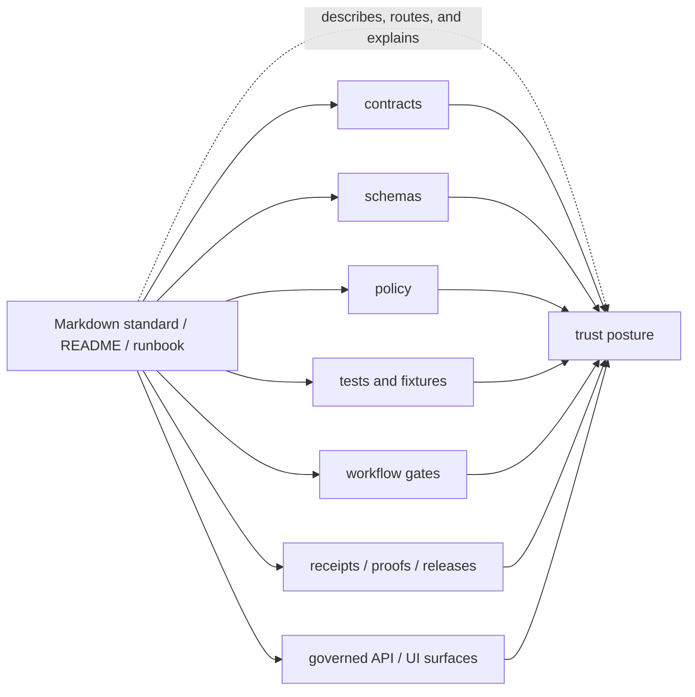
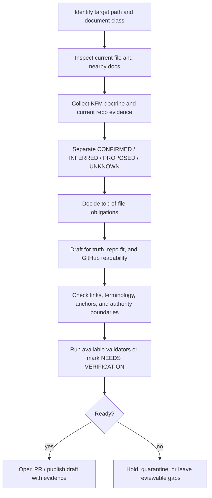

<!-- [KFM_META_BLOCK_V2]
doc_id: kfm://doc/REVIEW_REQUIRED_UUID
title: KFM Markdown Work Protocol
type: standard
version: v1
status: draft
owners: @bartytime4life
created: REVIEW_REQUIRED_DATE
updated: 2026-04-30
policy_label: REVIEW_REQUIRED_POLICY_LABEL
related: [docs/standards/README.md, docs/standards/markdown-rules.md, docs/README.md, README.md, .github/CODEOWNERS, .github/PULL_REQUEST_TEMPLATE.md, .github/workflows/README.md, contracts/README.md, schemas/README.md, policy/README.md, tests/README.md, docs/runbooks/README.md]
tags: [kfm, documentation, markdown, standards, governance]
notes: [doc_id created date and policy_label require active-checkout verification; owner is grounded in the current public CODEOWNERS fallback but should be confirmed before publication; this revision expands a thin public-main protocol using KFM doctrine and prior richer draft lineage without claiming enforcement.]
[/KFM_META_BLOCK_V2] -->

<a id="top"></a>

# KFM Markdown Work Protocol

Governed authoring, revision, and review rules for KFM Markdown that must remain evidence-aware, repo-native, truth-labeled, and pleasant to read in GitHub.

<div align="left">


</div>

> [!IMPORTANT]
> **Status:** `experimental` · **Doc status:** `draft`  
> **Owners:** `@bartytime4life` *(current public `CODEOWNERS` fallback; active-checkout ownership still needs verification)*  
> **Path:** `docs/standards/KFM_MARKDOWN_WORK_PROTOCOL.md`  
> **Repo fit:** standards protocol under [`./README.md`](./README.md), aligned with [`./markdown-rules.md`](./markdown-rules.md), upstream of governed README-like docs, and adjacent to contracts, schemas, policy, tests, workflows, and runbooks.  
> **Evidence boundary:** current public `main` confirms this file exists as a thin protocol; this expanded revision is **PROPOSED** until landed and rechecked in the active checkout.  
> **Quick jumps:** [Scope](#scope) · [Repo fit](#repo-fit) · [Current evidence snapshot](#current-evidence-snapshot) · [Accepted inputs](#accepted-inputs) · [Exclusions](#exclusions) · [Truth posture](#truth-posture-and-claim-discipline) · [Document classes](#document-classes-and-top-of-file-obligations) · [Workflow](#authoring-workflow) · [Formatting](#github-markdown-formatting-protocol) · [Review gates](#review-gates-and-definition-of-done) · [Appendix](#appendix)

> [!NOTE]
> This protocol is a documentation standard, not a shortcut around evidence. In KFM, Markdown is part of the working trust system: it must preserve truth posture, authority boundaries, release discipline, correction visibility, and reviewable unknowns.

---

## Scope

This protocol governs how Markdown is created, revised, extended, and reviewed across KFM when the file is expected to be:

- repo-native;
- evidence-aware;
- GitHub-readable;
- doctrine-consistent;
- safe to review in Git;
- safe to commit after unresolved placeholders are verified.

It applies most strongly to:

| Surface | Why this protocol matters |
|---|---|
| Standards documents | They can easily become accidental law. |
| README-like docs | They orient contributors and reviewers, so bad structure spreads quickly. |
| Architecture and governance docs | They often sit close to trust boundaries and implementation claims. |
| Workflow, protocol, and runbook docs | They can imply enforcement even when automation is not verified. |
| Cross-cutting reference docs | They need consistent routing, source posture, and authority labels. |
| Doctrine-to-implementation rewrites | They must make strong source material more usable without flattening it into generic prose. |

This protocol does **not** convert unsupported repo guesses into fact, and it does **not** outrank stronger KFM doctrine, contracts, schemas, policy, tests, receipts, proof packs, release records, or current implementation evidence.

[Back to top](#top)

---

## Repo fit

### Working role

`KFM_MARKDOWN_WORK_PROTOCOL.md` is the normative Markdown authoring and review protocol for KFM standards and governed documentation surfaces.

It is intentionally:

- narrower than the root KFM doctrine;
- more operational than the standards directory index;
- more truth-discipline-oriented than a generic Markdown style guide;
- adjacent to, but not the same as, the task-facing [`./markdown-rules.md`](./markdown-rules.md) mirror.

### Relationship map

| Relationship | Path | Role |
|---|---|---|
| This file | `docs/standards/KFM_MARKDOWN_WORK_PROTOCOL.md` | Normative Markdown authoring and review protocol |
| Local standards index | [`./README.md`](./README.md) | Standards routing, accepted inputs, exclusions, and local directory boundary |
| Task-facing mirror | [`./markdown-rules.md`](./markdown-rules.md) | Quick authoring brief; keep aligned, but do not silently let it outrank this protocol |
| Parent docs lane | [`../README.md`](../README.md) | Broader documentation landing and doctrine/navigation layer |
| Repo root | [`../../README.md`](../../README.md) | KFM identity, trust path, and top-level orientation |
| Contracts | [`../../contracts/README.md`](../../contracts/README.md) | Object meaning, lifecycle semantics, and compatibility posture |
| Schemas | [`../../schemas/README.md`](../../schemas/README.md) | Machine-readable shape and schema-home ambiguity notes |
| Policy | [`../../policy/README.md`](../../policy/README.md) | Allow / deny / abstain / obligation logic and publication posture |
| Tests | [`../../tests/README.md`](../../tests/README.md) | Verification, fixtures, negative paths, and proof coverage |
| Workflows | [`../../.github/workflows/README.md`](../../.github/workflows/README.md) | Workflow intent; enforcement depth still requires YAML and platform verification |
| Review routing | [`../../.github/CODEOWNERS`](../../.github/CODEOWNERS) and [`../../.github/PULL_REQUEST_TEMPLATE.md`](../../.github/PULL_REQUEST_TEMPLATE.md) | Ownership, review expectations, affected surfaces, and evidence links |
| Runbooks | [`../runbooks/README.md`](../runbooks/README.md) | Operational procedures, correction, rollback, and promotion steps |

> [!WARNING]
> Standards prose is not proof of enforcement. A Markdown rule becomes operational only when its companion schema, validator, fixture, policy, workflow, review gate, receipt, proof object, or release artifact is verified.

[Back to top](#top)

---

## Current evidence snapshot

This section records the evidence posture used for this revision. Recheck it before merge.

| Surface | Current posture for this revision | Consequence |
|---|---|---|
| `docs/standards/KFM_MARKDOWN_WORK_PROTOCOL.md` | **CONFIRMED public-main presence; thin current file.** The current public file is a compact protocol, not a full governed standard. | This revision is an upward expansion, not a scratch replacement. |
| `docs/standards/README.md` | **CONFIRMED public-main standards index.** It routes Markdown rules to this file and treats `markdown-rules.md` as a mirror/brief. | Keep this protocol aligned with the index. |
| `docs/standards/markdown-rules.md` | **CONFIRMED public-main task-facing mirror.** | If the two diverge, this protocol should remain the stronger authority unless maintainers decide otherwise. |
| `.github/CODEOWNERS` | **CONFIRMED public-main broad fallback owner:** `@bartytime4life`. | Use owner confidently enough for draft routing, but confirm active-checkout review rules before publication claims. |
| Root README | **CONFIRMED public-main doctrine:** KFM is evidence-first, map-first, time-aware, and governed; maps and AI are downstream evidence carriers. | Preserve KFM terminology and trust posture in every governed doc. |
| Attached richer Markdown draft | **LINEAGE / PROPOSED.** It contains stronger material for this protocol but should not be treated as current public-main proof where public-main evidence differs. | Preserve useful substance, but relabel current-state claims carefully. |
| Mounted local checkout | **NEEDS VERIFICATION.** This authoring pass did not have a mounted repo checkout available. | Do not claim active branch parity, CI enforcement, or local test results. |

### Snapshot rule

Use current repository evidence for “what exists now.” Use KFM doctrine for “what should govern.” Use prior drafts as lineage, not as current implementation proof.

[Back to top](#top)

---

## Accepted inputs

A Markdown file belongs under this protocol when it is meant to shape, route, explain, or review KFM’s governed work.

| Accepted input | Belongs here when… | Companion surfaces to inspect |
|---|---|---|
| Standards prose | It defines reusable human-readable rules across more than one lane. | `docs/standards/**`, `docs/adr/**` |
| README-like docs | It orients a directory, package, app, tool lane, policy lane, schema lane, contract lane, test lane, or workflow lane. | Local `README.md`, parent README, adjacent lane READMEs |
| Architecture docs | It explains boundaries, object families, lifecycle, UI, AI, API, data, or publication architecture. | `docs/architecture/**`, contracts, schemas, policy, tests |
| Governance docs | It affects rights, sensitivity, sovereignty, stewardship, policy, review, or release posture. | `policy/**`, `docs/runbooks/**`, `data/receipts/**`, `data/proofs/**` |
| Contract-facing docs | It explains object semantics, DTOs, envelopes, or compatibility rules. | `contracts/**`, `schemas/**`, `tests/contracts/**` |
| Workflow docs | It describes CI, validation, promotion, review, or release behavior. | `.github/workflows/**`, `tools/**`, `tests/**`, generated reports |
| Runbook-like docs | It gives operator or reviewer steps. | `docs/runbooks/**`, policy, receipts, proofs, release artifacts |
| AI-assisted rewrites | It improves an existing doc using retrieved evidence and repo context. | Existing file, neighboring docs, doctrine, source ledger, tests |

### Minimum bar

A governed Markdown change should answer:

1. What is this file for?
2. Where does it fit?
3. What belongs here?
4. What does not belong here?
5. Which claims are confirmed, inferred, proposed, unknown, or waiting on verification?
6. Which adjacent trust surfaces must be updated or checked?

[Back to top](#top)

---

## Exclusions

Do not use Markdown polish to blur ownership.

| Do not put this in a Markdown doc as if it were proof | Proper home or handling |
|---|---|
| Machine-readable JSON Schema bodies | `schemas/**` or the repo-confirmed schema home |
| Executable policy logic | `policy/**` |
| Runtime code, route handlers, adapters, or UI components | App/package/tool lane confirmed by repository inspection |
| Valid/invalid fixtures | `tests/**`, `schemas/tests/**`, or the repo-confirmed fixture home |
| Source registry rows | `data/registry/**` |
| Receipts, proof packs, manifests, releases, or emitted artifacts | `data/receipts/**`, `data/proofs/**`, `data/releases/**`, `release/**`, or repo-confirmed emitted-artifact lane |
| RAW, WORK, QUARANTINE, PROCESSED, or PUBLISHED data | Data lifecycle lanes, not docs |
| Secrets, tokens, private endpoints, credentials, or sensitive screenshots | Never publish; redact, rotate, quarantine, or document only the safe handling rule |
| Exact sensitive locations or sensitive community knowledge | Deny, generalize, stage access, or hold for steward review |
| Generated model output as proof | Treat as interpretive text only; require EvidenceBundle-backed support |
| Exploratory ideas as current law | Intake, backlog, ADR candidate, or clearly labeled lineage/archive surface |
| Old docs with unresolved supersession | Archive/lineage with successor links; do not silently delete or republish as current |

> [!CAUTION]
> If a Markdown update would expose rights-unclear material, sovereignty-sensitive content, living-person information, DNA/genomic material, private landowner exposure, exact sensitive locations, credentials, or unpublished candidate data, stop and route through policy and review first.

[Back to top](#top)

---

## Truth posture and claim discipline

KFM documentation should use the narrowest truthful label when confidence materially matters.

| Label | Use it for | Do not use it for |
|---|---|---|
| **CONFIRMED** | Verified in the current session or current repo evidence: visible file, current public source, command output, schema, workflow, test, log, generated artifact, or governing doc. | Memory, inferred conventions, or plans. |
| **INFERRED** | Conservative conclusion strongly implied by multiple project sources, where the inference is useful and bounded. | Claims that should be checked directly before reliance. |
| **PROPOSED** | A recommended design, structure, file, workflow, validator, rule, or next step not yet verified as implemented. | Current repo state. |
| **UNKNOWN** | Not verified strongly enough to claim safely. | Something that is merely inconvenient to inspect. |
| **NEEDS VERIFICATION** | A specific check must happen before publication, enforcement, implementation reliance, or stronger status. | Vague uncertainty with no review action. |

### Claim rules

1. Repo fact claims require repo evidence.
2. Implementation claims require implementation evidence.
3. Enforcement claims require verified gates, not just workflow prose.
4. Documentation can record doctrine, but it cannot prove runtime behavior by itself.
5. Public-main evidence and active-branch evidence are not interchangeable.
6. Prior scaffold reports and exploratory packets are lineage unless current repo files prove adoption.
7. Examples are illustrative unless fixture-backed, contract-backed, or generated from verified artifacts.
8. Unknowns should stay visible until resolved.

### Disallowed moves

- stating that a workflow is enforced because a README describes it;
- stating that a schema exists because a standards doc expects it;
- treating a path in a PDF plan as a current repo file;
- treating a generated summary as a source of truth;
- collapsing **PROPOSED** into **CONFIRMED** for readability;
- replacing KFM terms with generic industry terms that weaken doctrine;
- hiding unresolved owner, policy label, route, workflow, or release status.

[Back to top](#top)

---

## KFM-specific authoring principles

### 1) Docs are production surfaces

KFM docs help preserve trust. They should make the following visible where relevant:

- evidence basis;
- source role;
- policy posture;
- rights and sensitivity state;
- review state;
- release state;
- correction lineage;
- rollback path;
- neighboring machine or governance surfaces.

### 2) Doctrine outranks style

Prefer KFM terms unless a local doc already defines a better one:

| KFM term | Preserve the distinction |
|---|---|
| `RAW → WORK / QUARANTINE → PROCESSED → CATALOG / TRIPLET → PUBLISHED` | Lifecycle states are not interchangeable folders. |
| `EvidenceRef → EvidenceBundle` | References must resolve to evidence before consequential claims. |
| `cite-or-abstain` | Unsupported confidence is not a valid output. |
| `PolicyDecision` | Policy reasoning should remain explicit and reason-bearing. |
| `ReleaseManifest`, `ProofPack`, `CatalogMatrix` | Publication evidence must stay inspectable. |
| `CorrectionNotice`, `RollbackPlan` | Published claims need a path to correction and recovery. |
| `RuntimeResponseEnvelope` | Runtime and AI outputs should stay finite and bounded. |
| `ANSWER`, `ABSTAIN`, `DENY`, `ERROR` | Negative outcomes are first-class, not failures to hide. |

### 3) Strong docs stay close to executable seams

Good Markdown points to the surfaces that prove or constrain it:



### 4) GitHub readability matters

Readable Markdown is not decoration. It improves review, reduces drift, and makes trust boundaries harder to miss.

Use:

- concise paragraphs;
- strong section names;
- compact tables;
- meaningful diagrams;
- callouts only when they change reviewer behavior;
- `<details>` for bulk reference material;
- checklists for gates and definition of done.

[Back to top](#top)

---

## Document classes and top-of-file obligations

Decide the document class before drafting.

| Doc class | Required baseline | Special obligation |
|---|---|---|
| Standard doc | `KFM_META_BLOCK_V2`, one H1, purpose, scope, repo fit, truth posture, validation/review expectations | Keep metadata synchronized with title and role. |
| README-like doc | Title, one-line purpose, impact block, owners, status, repo fit, quick jumps, accepted inputs, exclusions | Must orient readers quickly and link to upstream/downstream surfaces. |
| Directory README | README-like baseline plus directory tree, quickstart, diagram when grounded, task list/definition of done | Use a truthful snapshot or explicit placeholder. |
| Architecture / governance doc | Doctrine, realization, evidence basis, unknowns, affected surfaces, validation, rollback | Do not let design language sound implemented without proof. |
| Contract-facing doc | Object meaning, fields, lifecycle, compatibility, companion schema/test/policy surfaces | Do not become a silent schema home. |
| Workflow / CI doc | Purpose, triggers, inputs, outputs, artifacts, reviewer value, enforcement status | Distinguish documented intent from verified YAML/platform enforcement. |
| Runbook-like doc | Preconditions, steps, outputs, failure handling, rollback/correction | Mark destructive or public-facing steps clearly. |
| Existing-file revision | Preserve strong substance, stable anchors, local terminology, and useful links | Improve in place unless the file is scaffold-only or misleading. |
| New file | Fit adjacent structure and naming conventions | State inferred placement and identify neighboring docs that should link back. |

### KFM Meta Block V2 template

Use the exact wrapper for standard docs unless a documented repo exception exists.

```html
<!-- [KFM_META_BLOCK_V2]
doc_id: kfm://doc/REVIEW_REQUIRED_UUID
title: <Title>
type: standard
version: v1
status: draft
owners: REVIEW_REQUIRED_OWNER
created: REVIEW_REQUIRED_DATE
updated: REVIEW_REQUIRED_DATE
policy_label: REVIEW_REQUIRED_POLICY_LABEL
related: [<paths or kfm:// ids>]
tags: [kfm]
notes: [<short notes>]
[/KFM_META_BLOCK_V2] -->
```

### Placeholder discipline

Use reviewable placeholders. Do not guess.

Good placeholders:

- `REVIEW_REQUIRED_UUID`
- `REVIEW_REQUIRED_DATE`
- `REVIEW_REQUIRED_OWNER`
- `REVIEW_REQUIRED_POLICY_LABEL`
- `NEEDS_VERIFICATION_ACTIVE_CHECKOUT`
- `TODO_CONFIRM_WORKFLOW_ENFORCEMENT`

Bad placeholders:

- “probably”
- “same as usual”
- “TBD” with no review target
- invented UUIDs, owners, dates, or policy labels

### README-like impact block

For README-like docs, include a top block with:

| Required field | Purpose |
|---|---|
| Status | Maturity and reviewer expectation |
| Owners | Review routing |
| Path | Placement clarity |
| Repo fit | Upstream/downstream context |
| Quick jumps | GitHub navigation |
| Badges | Fast scanning |
| Accepted inputs | Scope control |
| Exclusions | Boundary protection |

[Back to top](#top)

---

## Authoring workflow



### Step 1 — Identify the target

Confirm:

- exact path;
- document role;
- likely audience;
- whether the file is new, scaffold-only, thin, substantive, or superseded;
- whether it is a standard doc, README-like doc, or both.

### Step 2 — Inspect local context

Read at minimum:

- the target file;
- local `README.md`;
- same-directory docs;
- parent README;
- root README when relevant;
- neighboring contracts, schemas, policy, tests, runbooks, workflows, and review templates.

### Step 3 — Build the evidence stack

Use this order:

1. KFM doctrine and canonical project materials;
2. current repository evidence;
3. current public source evidence when branch evidence is missing;
4. generated artifacts and logs when directly inspected;
5. external authoritative sources for current standards, APIs, law, security, or version-sensitive details;
6. prior drafts and exploratory packets as lineage.

### Step 4 — Draft with visible boundaries

Every governed doc should make clear:

- what is confirmed;
- what is inferred;
- what is proposed;
- what is unknown;
- what requires verification before merge, publication, or enforcement.

### Step 5 — Validate, or say what could not be validated

Use repo-native validators when present. If they are not present or not inspected, do not invent them.

```bash
# Safe orientation commands from repository root.
git status --short
git branch --show-current
find docs/standards -maxdepth 2 -type f | sort
grep -RIn "KFM_META_BLOCK_V2\|^# " docs/standards | sed -n '1,160p'
```

```bash
# NEEDS VERIFICATION: run only if these tools exist in the active checkout.
python tools/docs/check_doc_structure.py docs/standards/KFM_MARKDOWN_WORK_PROTOCOL.md
node tools/docs/examples/run-governance-doc-structure.mjs
```

[Back to top](#top)

---

## GitHub Markdown formatting protocol

### Formatting matrix

| Area | Rule | Review signal |
|---|---|---|
| Headings | One H1. Use crisp, informative section names. Preserve stable anchors when practical. | The outline is readable without the body text. |
| Links | Prefer relative links. Use reference-style links only when repetition becomes noisy. | Links work from the target file location. |
| Images | Use repo-relative paths and meaningful alt text. Use `<picture>` for light/dark variants when needed. | Images explain, not decorate. |
| Lists | Use bullets for concepts and numbers for ordered steps. Keep lists shaped. | Lists do not become shapeless dumps. |
| Tables | Use for matrices, mappings, ownership, interface boundaries, registries, or comparisons. | Tables are compact enough to review in GitHub. |
| Code fences | Always language-tag code fences. Mark pseudocode explicitly. Mark destructive commands clearly. | Snippets are copy/paste-safe or labeled illustrative. |
| Callouts | Use only `NOTE`, `TIP`, `IMPORTANT`, `WARNING`, or `CAUTION`. Do not nest callouts. | Callouts change reviewer behavior. |
| Long content | Use `<details>` for appendices, long examples, or reference material. | Critical guidance is not hidden. |
| Diagrams | Use Mermaid when it clarifies a real flow, boundary, or responsibility split. | The diagram teaches something grounded. |
| Badges | Keep badges compact and honest. Placeholder badges are allowed when truthfully labeled. | Badges do not imply enforcement or maturity. |
| Back-to-top links | Use on long docs. | Long docs remain navigable. |
| Tone | KFM-specific, evidence-first, and direct. | The file does not read like generic documentation. |

### Diagram rule

Add a Mermaid diagram when the document is README-like, directory-oriented, architecture-heavy, or otherwise benefits from a grounded flow or boundary diagram.

Do not add a diagram only to satisfy decoration pressure.

### Code fence rule

Use language tags:

```text
Use `text` for plain examples.
Use `bash` for shell commands.
Use `json` for JSON.
Use `yaml` for YAML.
Use `mermaid` for diagrams.
Use `markdown` for Markdown examples.
Use `html` for meta-block examples.
```

### Relative link rule

From `docs/standards/KFM_MARKDOWN_WORK_PROTOCOL.md`, these examples are preferred:

```markdown
[Standards index](./README.md)
[Parent docs README](../README.md)
[Root README](../../README.md)
[Contracts](../../contracts/README.md)
[Schemas](../../schemas/README.md)
[Policy](../../policy/README.md)
[Tests](../../tests/README.md)
```

[Back to top](#top)

---

## AI-assisted drafting boundary

AI can help make KFM Markdown clearer, but it must remain subordinate to evidence and policy.

| Allowed | Not allowed |
|---|---|
| Summarizing provided docs with citations or source notes | Inventing repo paths, route names, owners, tests, workflows, or enforcement |
| Improving structure, navigation, readability, and scanability | Flattening KFM doctrine into generic best practices |
| Producing labeled illustrative examples | Presenting illustrative examples as fixture-backed proof |
| Extracting candidate checklists from verified sources | Treating generated prose as source authority |
| Identifying contradictions or gaps | Hiding uncertainty for polish |
| Suggesting small reversible changes | Bypassing review, policy, or publication gates |

> [!IMPORTANT]
> AI-generated Markdown is not a root truth source. EvidenceBundle, policy, review state, release state, and current repo evidence outrank generated language.

[Back to top](#top)

---

## Review gates and definition of done

A KFM Markdown file is not done when it merely sounds polished.

### Minimum review gates

- [ ] The title matches the actual role of the file.
- [ ] The file has exactly one H1.
- [ ] `KFM_META_BLOCK_V2` is present for standard docs.
- [ ] Metadata values are verified or marked with reviewable placeholders.
- [ ] Adjacent docs were inspected.
- [ ] Repo fit is explicit.
- [ ] Accepted inputs and exclusions are explicit where the file is README-like or boundary-setting.
- [ ] Truth labels are used where confidence materially matters.
- [ ] KFM terminology is preserved.
- [ ] Public-main facts and active-branch facts are kept distinct.
- [ ] No implementation claim outruns visible evidence.
- [ ] Links are relative where possible and checked from the file location.
- [ ] Code fences are language-tagged.
- [ ] Diagrams are grounded and useful where included.
- [ ] Long appendices are collapsed when appropriate.
- [ ] Sensitive, rights-unclear, sovereignty-sensitive, living-person, exact-location, or private material is denied, generalized, redacted, staged, or held for review.
- [ ] Any enforcement claim points to a verified schema, policy, fixture, validator, workflow, platform setting, emitted artifact, or review record.
- [ ] Open verification items remain visible.
- [ ] The file is readable in GitHub without becoming flat, vague, or overstuffed.

### Definition of done

A Markdown document meets this protocol when it is:

1. faithful to KFM doctrine;
2. honest about repo and implementation evidence;
3. explicit about scope, exclusions, and repo fit;
4. visually usable in GitHub;
5. locally consistent with adjacent docs;
6. structurally reviewable in Git;
7. linked to companion trust surfaces when it introduces requirements;
8. safe to commit after direct verification of remaining placeholders.

### Merge-time prompt

Before merge, ask:

> What claim in this file would become false if the active repo were inspected line by line?

If the answer is unclear, hold the document at `draft` and mark the claim **NEEDS VERIFICATION**.

[Back to top](#top)

---

## Common failure modes

> [!WARNING]
> The most damaging KFM documentation failure is persuasive overclaim: a polished document that makes unverified implementation sound real.

| Failure mode | Why it is harmful | Required correction |
|---|---|---|
| Treating doctrine as shipped implementation | Creates false confidence | Relabel as **PROPOSED** or **UNKNOWN** |
| Treating a standards file as enforcement | Overstates governance maturity | Link to verified gate or mark **NEEDS VERIFICATION** |
| Replacing KFM terms with generic language | Weakens doctrinal precision | Restore project terminology |
| Writing from memory | Introduces drift | Re-inspect files |
| Duplicating nearby README content | Creates competing guidance | Link and specialize |
| Hiding unresolved metadata | Breaks governance posture | Use placeholders and notes |
| Claiming workflow enforcement from README prose | Misstates trust posture | Verify YAML and platform rules |
| Treating historical workflow traces as current automation | Confuses lineage with current state | State as historical or platform signal only |
| Adding broad new structure without ADRs | Creates authority collision | Add/update ADR and migration notes |
| Letting examples look real | Misleads contributors | Label illustrative or fixture-backed |

[Back to top](#top)

---

## Change discipline for existing Markdown

When revising an existing file:

1. Preserve strong doctrinal language.
2. Preserve stable headings and anchors where practical.
3. Remove repetition only when it adds no governance value.
4. Normalize term drift.
5. Add structure where scanability is weak.
6. Make unknowns more visible, not less.
7. Improve navigation, examples, and reviewability.
8. Keep adjacent docs synchronized.
9. Avoid broad rewrites unless the current file is scaffold-only, thin, misleading, or clearly broken.
10. Record likely anchor breakage or downstream updates in the PR.

### Thin file rule

For thin public-main files, a substantial upward rewrite is appropriate when it:

- preserves the file’s role;
- keeps the path stable;
- stays evidence-bounded;
- adds missing metadata and navigation;
- improves repo fit;
- does not invent implementation maturity.

### Substantive file rule

For already substantive files, improve in place and keep neighboring conventions stable unless the current local pattern is itself misleading.

[Back to top](#top)

---

## Protocol interaction with neighboring surfaces

Read this file alongside, not instead of:

- [`./README.md`](./README.md) for standards-lane routing;
- [`./markdown-rules.md`](./markdown-rules.md) for quick task-facing reminders;
- [`../README.md`](../README.md) for the parent documentation lane;
- [`../../README.md`](../../README.md) for KFM identity and trust posture;
- [`../../contracts/README.md`](../../contracts/README.md) for object meaning and compatibility;
- [`../../schemas/README.md`](../../schemas/README.md) for machine-readable shape and schema-home ambiguity;
- [`../../policy/README.md`](../../policy/README.md) for decision rules and obligations;
- [`../../tests/README.md`](../../tests/README.md) for validation and fixtures;
- [`../../.github/workflows/README.md`](../../.github/workflows/README.md) for workflow intent;
- [`../../.github/CODEOWNERS`](../../.github/CODEOWNERS) for ownership routing;
- [`../../.github/PULL_REQUEST_TEMPLATE.md`](../../.github/PULL_REQUEST_TEMPLATE.md) for review evidence expectations;
- [`../runbooks/README.md`](../runbooks/README.md) for operational procedure, correction, rollback, and promotion steps.

### Alignment rule

If this protocol and `markdown-rules.md` diverge, treat this protocol as the stronger normative surface until maintainers explicitly consolidate or reassign authority.

[Back to top](#top)

---

## Appendix

<details>
<summary><strong>Appendix A — Active-checkout verification backlog</strong></summary>

Before this file moves beyond draft, verify:

| Item | Why it matters | Status |
|---|---|---:|
| Stable `doc_id` | Enables durable registry lookup and cross-reference | `NEEDS VERIFICATION` |
| Created date | Prevents metadata drift | `NEEDS VERIFICATION` |
| Updated date convention | This revision uses `2026-04-30`; confirm repo convention before merge | `NEEDS VERIFICATION` |
| Policy label | GitHub public visibility is not the same as KFM policy classification | `NEEDS VERIFICATION` |
| CODEOWNERS routing | Public fallback exists; active branch and branch rules still need check | `NEEDS VERIFICATION` |
| Link integrity | Prevents standards-lane rot | `NEEDS VERIFICATION` |
| Whether doc validators exist | Avoids claiming automation from prose | `NEEDS VERIFICATION` |
| Whether `markdown-rules.md` should remain separate | Prevents silent dual authority | `NEEDS VERIFICATION` |
| Whether this protocol applies repo-wide or only to standards docs | Controls scope and validation burden | `NEEDS VERIFICATION` |
| Companion reports or CI summaries | Needed before enforcement claims | `NEEDS VERIFICATION` |

</details>

<details>
<summary><strong>Appendix B — Reviewer prompts</strong></summary>

Use these prompts during review:

1. Does the file sound like KFM, or like generic platform documentation?
2. Which claims are truly **CONFIRMED**?
3. Are any repo, path, route, workflow, schema, policy, test, UI, runtime, owner, or platform-setting statements overclaimed?
4. Is the metadata block honest?
5. Does the page help a maintainer move faster without hiding uncertainty?
6. Does the doc link to neighboring authority instead of competing with it?
7. If working-branch evidence exceeds public-main docs, is that delta stated explicitly?
8. If public-main evidence conflicts with an older draft, is that conflict surfaced?
9. Does the change preserve the trust membrane?
10. Is rollback or correction possible if this doc becomes wrong?

</details>

<details>
<summary><strong>Appendix C — Standard doc starter skeleton</strong></summary>

```markdown
<!-- [KFM_META_BLOCK_V2]
doc_id: kfm://doc/REVIEW_REQUIRED_UUID
title: <Title>
type: standard
version: v1
status: draft
owners: REVIEW_REQUIRED_OWNER
created: REVIEW_REQUIRED_DATE
updated: REVIEW_REQUIRED_DATE
policy_label: REVIEW_REQUIRED_POLICY_LABEL
related: [<paths or kfm:// ids>]
tags: [kfm]
notes: [<short notes>]
[/KFM_META_BLOCK_V2] -->

# <Title>

One-line purpose.

> [!IMPORTANT]
> State status, owner, path, evidence boundary, and verification limits.

## Scope

## Repo fit

## Accepted inputs

## Exclusions

## Evidence boundary

## Requirements

## Validation

## Review gates

## Open verification
```

</details>

<details>
<summary><strong>Appendix D — README-like doc starter skeleton</strong></summary>

```markdown
# <Area> README

One-line purpose.

> [!IMPORTANT]
> **Status:** experimental | active | stable | deprecated  
> **Owners:** REVIEW_REQUIRED_OWNER  
> **Path:** <path>  
> **Repo fit:** upstream / downstream links  
> **Quick jumps:** [Scope](#scope) · [Repo fit](#repo-fit) · [Inputs](#inputs) · [Exclusions](#exclusions)


## Scope

## Repo fit

## Inputs

## Exclusions

## Evidence boundary

## Directory tree

## Quickstart

## Diagram

## Definition of done

## Related docs
```

</details>

<details>
<summary><strong>Appendix E — ADR starter skeleton for documentation authority decisions</strong></summary>

```markdown
# ADR-XXXX: <Decision>

Status: PROPOSED | ACCEPTED | SUPERSEDED | WITHDRAWN  
Date: REVIEW_REQUIRED_DATE  
Owners: REVIEW_REQUIRED_OWNER  
Affected surfaces: docs, standards, contracts, schemas, policy, tests, workflows, runbooks

## Context

## Decision

## Alternatives considered

## Consequences

## Validation

## Rollback

## Supersession / migration notes

## Open verification gaps
```

</details>

[Back to top](#top)
