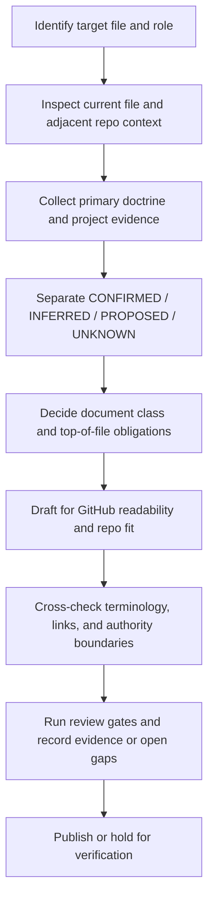

<!-- [KFM_META_BLOCK_V2]
doc_id: kfm://doc/REVIEW_REQUIRED_UUID
title: KFM Markdown Work Protocol
type: standard
version: v1
status: draft
owners: @bartytime4life
created: REVIEW_REQUIRED_DATE
updated: 2026-04-14
policy_label: REVIEW_REQUIRED_POLICY_LABEL
related: [
  ./README.md,
  ./markdown-rules.md,
  ../README.md,
  ../../README.md,
  ../../.github/CODEOWNERS,
  ../../.github/PULL_REQUEST_TEMPLATE.md,
  ../../.github/workflows/README.md,
  ../../contracts/README.md,
  ../../schemas/README.md,
  ../../policy/README.md,
  ../../tests/README.md
]
tags: [kfm, documentation, markdown, standards, governance]
notes: [
  "Owners confirmed from the current public /docs/ CODEOWNERS rule.",
  "doc_id, created date, updated date at merge time, and policy_label still need direct repo verification.",
  "Current public main shows this file as a substantive draft protocol rather than a blank scaffold.",
  "markdown-rules.md remains a distinct repo-visible authoring brief and should not silently outrank this protocol."
]
[/KFM_META_BLOCK_V2] -->

<a id="top"></a>

# `KFM_MARKDOWN_WORK_PROTOCOL.md`

Governed authoring, revision, and review rules for Markdown that must remain faithful to KFM doctrine, visible repo evidence, and GitHub-native readability.

> [!NOTE]
> **Status:** experimental  
> **Document status:** draft  
> **Owners:** `@bartytime4life`  
> **Path:** `docs/standards/KFM_MARKDOWN_WORK_PROTOCOL.md`  
>       
> **Quick jump:** [Scope](#scope) · [Repo fit](#repo-fit) · [Evidence snapshot](#current-public-evidence-snapshot) · [Accepted inputs](#accepted-inputs) · [Exclusions](#exclusions) · [Truth posture](#truth-posture-and-claim-discipline) · [Authoring workflow](#authoring-workflow) · [Formatting protocol](#github-markdown-formatting-protocol) · [Review gates](#review-gates-and-definition-of-done) · [Failure modes](#common-failure-modes) · [Appendix](#appendix)

> [!IMPORTANT]
> This protocol is a **documentation standard**, not a license to invent implementation state.
>
> In KFM, docs are production surfaces: they must preserve truth posture, trust boundaries, release discipline, and visible unknowns.

> [!TIP]
> Revise this file **in place** when the standards lane changes.
>
> Do not create a second Markdown protocol unless the authority split is explicit, reviewed, and documented in the same change stream.

---

## Scope

This protocol governs how Markdown is created, revised, extended, and reviewed in KFM when the document is expected to be:

- repo-native
- evidence-aware
- GitHub-readable
- doctrine-consistent
- safe to commit after verification

It applies most strongly to:

- standards documents
- README-like docs
- architecture and governance docs
- workflow and protocol docs
- cross-cutting reference docs
- documentation rewrites that translate doctrine into clearer repo-ready form

It does **not**:

- convert unsupported repo guesses into fact
- outrank stronger project doctrine
- replace contracts, policy, tests, or workflow truth
- permit “polished overclaim” as a substitute for evidence

[Back to top](#top)

---

## Repo fit

### Working role

This file is the operating protocol for how KFM Markdown should be written.

It is intentionally:

- narrower than master doctrine
- more operational than the standards index
- more authoring-specific than `markdown-rules.md`
- upstream of README rewrites, standards updates, and repo-facing protocol docs

### Upstream context

- [`./README.md`](./README.md) — local standards index and routing surface
- [`./markdown-rules.md`](./markdown-rules.md) — broader Markdown authoring instruction surface
- [`../README.md`](../README.md) — `docs/` as a production-facing trust surface
- [`../../README.md`](../../README.md) — repo-level posture and contributor-facing framing

### Adjacent authority and proof surfaces

- [`../../contracts/README.md`](../../contracts/README.md)
- [`../../schemas/README.md`](../../schemas/README.md)
- [`../../policy/README.md`](../../policy/README.md)
- [`../../tests/README.md`](../../tests/README.md)
- [`../../.github/CODEOWNERS`](../../.github/CODEOWNERS)
- [`../../.github/PULL_REQUEST_TEMPLATE.md`](../../.github/PULL_REQUEST_TEMPLATE.md)
- [`../../.github/workflows/README.md`](../../.github/workflows/README.md)

### Downstream / neighboring use

This protocol should guide:

- standards and profiles that need consistent Markdown structure
- README-like docs that must stay GitHub-readable without losing truth posture
- architecture, governance, review, and protocol docs that sit close to executable seams
- future doctrine-to-implementation docs under `docs/**`

### Boundary rule

Use this file to govern **how Markdown should be written**.

Do **not** use it to silently own:

- schema definitions
- policy logic
- workflow enforcement
- runtime behavior
- release truth
- domain-specific ETL instructions

[Back to top](#top)

---

## Current public evidence snapshot

This protocol should reflect the repo that is actually visible, not an older or more convenient memory of it.

| Surface | Current public-main state | Why it matters here |
|---|---|---|
| [`./README.md`](./README.md) | substantive directory index | this file should deepen that index, not compete with it |
| [`./markdown-rules.md`](./markdown-rules.md) | present as the broader Markdown instruction surface | this file should specialize KFM truth posture and repo fit, not rephrase everything generically |
| `./KFM_MARKDOWN_WORK_PROTOCOL.md` | present as a substantive draft protocol | revise in place; do not describe it as a blank stub |
| [`../../.github/CODEOWNERS`](../../.github/CODEOWNERS) | `/docs/` currently routes to `@bartytime4life` | owner coverage is confirmable at the current public layer |
| [`../../.github/workflows/README.md`](../../.github/workflows/README.md) | workflow lane is README-only on public `main` | do not imply markdown lint, Vale, merge-blocking checks, or docs CI without direct proof |
| [`../../.github/PULL_REQUEST_TEMPLATE.md`](../../.github/PULL_REQUEST_TEMPLATE.md) | review template explicitly requires truth labels and evidence links | Markdown changes should stay aligned with review expectations already visible in-repo |
| [`../README.md`](../README.md) | `docs/` is framed as a production-facing trust surface | documentation must stay tied to policy, review, correction, and proof-bearing surfaces |

> [!CAUTION]
> Public-tree evidence is stronger than memory, but still narrower than full platform truth.
>
> GitHub rulesets, required checks, environment approvals, OIDC wiring, private settings, and non-public workflow inventory remain **UNKNOWN** unless directly reverified.

### What still needs verification

The following must remain visibly open unless a checked-out branch or directly inspected platform setting proves them:

- final doc UUID
- created / updated dates
- policy label
- markdown lint / Vale / pre-commit / docs CI depth
- whether this protocol is enforced repo-wide or only within `docs/standards/`
- branch protections and required checks
- any platform-only GitHub settings

[Back to top](#top)

---

## Accepted inputs

The following inputs belong here when authoring or revising Markdown under this protocol:

| Input class | What to use it for | Minimum expectation |
|---|---|---|
| KFM doctrinal manuals | governing language, invariants, truth posture, trust membrane, publication rules | prefer repeated doctrine over one-off phrasing |
| Adjacent repo docs | local structure, section rhythm, naming patterns, visual style | match nearby conventions where they are strong |
| Contracts / schemas / policy docs | machine-checkable claims, object names, route families, validation burdens | do not paraphrase away load-bearing terms |
| Verified repo files | file paths, ownership signals, current scaffold state, workflow surface facts | treat direct repo inspection as stronger than memory |
| Review templates / ownership surfaces | truth labels, evidence-link expectations, reviewer routing | keep working-branch deltas and public-main facts distinct |
| CI / workflow docs | review gates, merge expectations, generated-doc burdens | keep enforcement claims proportional to visible evidence |
| Tests / fixtures / examples | concrete proof that behavior exists | if absent, say so |
| Historical workflow or Actions signals | continuity clues only | never treat historical runs or deleted workflow names as proof of current checked-in YAMLs |
| External standards | boundary-sensitive or version-sensitive clarification only | use to sharpen, not to silently override KFM |

### Minimum input rule

A Markdown change should be grounded in the strongest relevant evidence available, in this order:

1. canonical KFM doctrine
2. directly visible repo / workspace evidence
3. authoritative external reference when needed

[Back to top](#top)

---

## Exclusions

This file does **not** own the canonical contents of:

- API or object schemas that belong in `contracts/` or `schemas/`
- executable policy logic that belongs in `policy/`
- fixtures, validation suites, or harness code that belong in `tests/`
- build tooling details that belong in `tools/`, `scripts/`, or workflow files
- platform-only GitHub settings, rulesets, required checks, OIDC trust, secrets, or environment approvals
- implementation claims not supported by direct repo, workspace, or authoritative source evidence

When content primarily belongs elsewhere, this protocol should **link to it rather than absorb it**.

> [!NOTE]
> Markdown may summarize other system surfaces, but it must not become:
>
> - a shadow schema registry
> - a fake runbook
> - a second source of truth
> - a prose substitute for missing implementation evidence

[Back to top](#top)

---

## Truth posture and claim discipline

KFM documentation must keep uncertainty visible.

### Required truth labels

Use these labels when precision matters:

| Label | Meaning | Use when |
|---|---|---|
| **CONFIRMED** | directly supported by attached source material, mounted workspace evidence, or directly inspected repo/platform evidence | stating what the doctrine, repo, or artifact actually shows |
| **INFERRED** | conservative structural completion strongly implied by multiple project sources | filling a necessary gap without claiming mounted implementation |
| **PROPOSED** | recommended design, workflow, or structure consistent with doctrine but not verified as current implementation | suggesting next-shape docs, routes, checklists, templates, or policy surfaces |
| **UNKNOWN** | not verified strongly enough in the current session to claim as current fact | repo topology, automation coverage, shipping behavior, real schema inventory, actual workflow gates |
| **NEEDS VERIFICATION** | review-critical item that must be checked before publish or implementation reliance | ownership, dates, policy label, exact enforcement, exact file paths, or platform settings not directly inspected |

### Claim rules

1. **Repo fact claims require repo evidence.**
2. **Implementation claims require implementation evidence.**
3. **Doctrinal claims may rely on doctrinal documents, but should keep mounted implementation separate.**
4. **Recommendations must be labeled as recommendations.**
5. **Unknowns stay visible.**
6. **Public-main and working-branch facts are not interchangeable.**

### Disallowed moves

- stating that a workflow is enforced because it is described
- stating that a schema exists because a README references it
- stating that CI blocks merges because a checklist says it should
- implying that docs prove runtime reality
- treating historical workflow pages or deleted workflow names as current checked-in YAML inventory
- replacing project terms with nicer generic terms
- collapsing **INFERRED** or **PROPOSED** into **CONFIRMED**

[Back to top](#top)

---

## KFM-specific authoring principles

### 1. Docs are production surfaces

In KFM, documentation is part of the operating system of trust.

It should help preserve:

- governed publication
- correction lineage
- evidence visibility
- rights and sensitivity posture
- route and contract clarity
- reviewer confidence

### 2. Doctrine outranks fashion

Prefer project language such as:

- trust membrane
- canonical truth path
- authoritative-versus-derived separation
- cite-or-abstain posture
- fail-closed negative outcomes
- map-first and time-aware operation
- 2D-by-default reasoning unless extra burden is justified

### 3. Strong docs stay close to executable seams

Good KFM Markdown points clearly toward:

- contracts
- schemas
- policy bundles
- fixtures
- tests
- route families
- proof objects
- review gates
- correction and rollback paths

### 4. Pleasant GitHub rendering matters, but not more than truth

Readable structure is required. Decorative overconfidence is not.

[Back to top](#top)

---

## Document classes and top-of-file obligations

This protocol should be applied after deciding what kind of Markdown the target file actually is.

| Doc type | Required baseline behavior | Special obligations |
|---|---|---|
| Standard doc | include KFM Meta Block v2 unless a stronger local exception is already established | keep metadata synchronized with visible title and role |
| README-like doc | include purpose line, repo fit, accepted inputs, exclusions, impact block, quick jumps, and at least one meaningful diagram | must feel navigable in GitHub |
| Architecture / governance doc | separate doctrine, realization, and unknowns | avoid runtime overclaim |
| Revision of existing file | preserve strong substance and local terminology | improve without flattening |
| New file | fit adjacent structure and linking patterns | do not duplicate nearby docs unless the split is intentional |

### This file’s own class

This protocol is best treated as **both**:

- a standard doc
- a README-like operational protocol

That means it should satisfy both metadata requirements and GitHub-readability requirements.

### Top-of-file requirements

#### For standard docs

Include the KFM Meta Block v2 at the top of the file.

#### For README-like or operational protocol docs

Include, near the top:

- title
- one-line purpose
- status
- owners
- path
- quick jumps
- badges
- a clear note when parts remain placeholders or need verification

### Placeholder discipline

If a value is not confirmed, use a reviewable placeholder such as:

- `REVIEW_REQUIRED_OWNER`
- `REVIEW_REQUIRED_DATE`
- `REVIEW_REQUIRED_UUID`
- `REVIEW_REQUIRED_POLICY_LABEL`

Do not silently guess.

[Back to top](#top)

---

## Authoring workflow



### Step 1 — Identify the target

Confirm:

- exact path
- likely audience
- document role
- whether it is new, scaffold-only, or already substantive

### Step 2 — Inspect local context first

Read nearby files before drafting:

- the target file itself
- local README / index files
- same-directory docs
- repo root README when relevant
- neighboring standards, schemas, policy, test, workflow, and review docs

### Step 3 — Build the evidence stack

Use evidence in this order:

1. attached and canonical project doctrine
2. directly visible repo / workspace files
3. authoritative external material only where needed

### Step 4 — Separate statement classes

For each important statement, ask:

- Is this a repo fact?
- Is this a doctrinal rule?
- Is this an implementation claim?
- Is this a recommendation?
- Is this still unknown?

### Step 5 — Draft in repo-native form

The draft should feel like it belongs exactly where it is placed.

### Step 6 — Audit for drift and overclaim

Specifically check for:

- invented repo state
- softened unknowns
- term substitution
- unsupported enforcement claims
- duplicated neighboring docs
- public-main versus working-branch confusion
- flat or visually dead sections

[Back to top](#top)

---

## GitHub Markdown formatting protocol

### Headings

- use one `#` heading only
- make section titles crisp, informative, and anchor-friendly
- avoid decorative heading noise

### Paragraph rhythm

- keep paragraphs compact
- vary section cadence
- break dense guidance with tables, diagrams, callouts, or examples

### Links

- prefer relative links
- link to adjacent docs when they materially help navigation
- do not link excessively just to decorate the page

### Tables

Use tables when they reduce ambiguity, especially for:

- truth labels
- ownership surfaces
- document classes
- gate lists
- responsibility splits
- allowed vs disallowed behavior

### Callouts

Use only where they help. Preferred set:

- NOTE
- TIP
- IMPORTANT
- WARNING
- CAUTION

### Code fences

- always language-tagged when possible
- use `text` when the block is a literal example rather than runnable code
- label pseudocode as such

### Long content

Wrap bulk material in `<details>` if it is reference-heavy but not critical to first-pass reading.

### Diagrams

README-like and directory-facing docs should include at least one meaningful Mermaid diagram.

### Quick-jump rule

For long docs, include a top-of-file quick-jump line and maintain stable heading anchors so GitHub scanning stays fast.

[Back to top](#top)

---

## Repo-native writing rules

### Preserve project language

Use the terms the project already uses, including where relevant:

- trust membrane
- canonical truth path
- `EvidenceBundle`
- `RuntimeResponseEnvelope`
- `DecisionEnvelope`
- `ReleaseManifest`
- `CorrectionNotice`
- map-first
- time-aware
- authoritative-versus-derived
- public-safe

Do not silently replace them with softer generic prose.

### Keep boundaries explicit

A good KFM Markdown file should make it easy to tell:

- what belongs here
- what belongs elsewhere
- which claims are doctrine
- which are implementation
- which are still pending verification

### Do not treat scaffolds as proof

A scaffold file, placeholder README, or intent-only workflow document is evidence of **planned structure**, not evidence of active enforcement.

### Do not treat public platform hints as checked-in truth

GitHub Actions history, deleted workflow names, platform badges, and other UI signals may be useful continuity clues, but they are not substitutes for checked-in repo inventory or directly inspected settings.

### Avoid duplicate authority

If an adjacent file already serves as the directory index or local doctrine summary, this file should deepen or specialize it rather than rewriting it.

[Back to top](#top)

---

## README-like minimums and directory exceptions

When a document behaves like a README, it must include:

| Requirement | Why |
|---|---|
| Title | reader orientation |
| One-line purpose | immediate context |
| Repo fit | path and placement clarity |
| Accepted inputs | scope control |
| Exclusions | boundary protection |
| Impact block | review and maintenance shortcut |
| Quick jumps | GitHub navigation |
| Diagram | structural explanation |
| Review checklist or task list | commit readiness |

### Directory README note

For directory READMEs, follow the fuller section-order expectations from [`./markdown-rules.md`](./markdown-rules.md).

For single-file standards like this one, keep the same minimum ingredients but omit directory-only scaffolding unless it adds real value.

[Back to top](#top)

---

## Review gates and definition of done

A KFM Markdown file is not done when it merely sounds polished.

### Minimum review gates

- [ ] Title matches the actual role of the file
- [ ] KFM Meta Block v2 is present for standard docs
- [ ] Unverified values are placeholders, not guesses
- [ ] Adjacent docs were inspected
- [ ] Repo fit is explicit
- [ ] Accepted inputs and exclusions are explicit
- [ ] At least one meaningful diagram is included where README-like structure applies
- [ ] Links are relative where possible
- [ ] Terminology matches KFM doctrine
- [ ] No implementation claim outruns visible evidence
- [ ] Public-main facts and working-branch-only facts are kept distinct
- [ ] **CONFIRMED / INFERRED / PROPOSED / UNKNOWN / NEEDS VERIFICATION** are used where precision matters
- [ ] The document is readable in GitHub without feeling flat or overstuffed
- [ ] Long appendices are collapsed when appropriate
- [ ] Open verification items are left visible

### Definition of done

A document meets this protocol when it is:

1. faithful to KFM doctrine  
2. honest about repo and implementation evidence  
3. visually usable in GitHub  
4. locally consistent with adjacent repo docs  
5. structurally reviewable in Git  
6. safe to commit after direct verification of remaining placeholders

[Back to top](#top)

---

## Common failure modes

> [!WARNING]
> The most damaging documentation failure in KFM is not ugly formatting. It is persuasive overclaim.

| Failure mode | Why it is harmful | Required correction |
|---|---|---|
| Treating doctrine as shipped implementation | creates false confidence | relabel as **PROPOSED** or **UNKNOWN** |
| Replacing project terms with generic language | weakens doctrinal precision | restore project terminology |
| Writing from memory of the repo | introduces drift | re-inspect files |
| Building “better looking” but flatter docs | loses auditability and usefulness | reintroduce evidence, boundaries, and review detail |
| Hiding unresolved metadata values | breaks governance posture | use placeholders and notes |
| Duplicating nearby README content | creates competing guidance | link and specialize instead |
| Claiming enforcement without visible gates | misstates trust posture | mark **NEEDS VERIFICATION** |
| Treating historical workflow traces as current automation | confuses continuity with checked-in reality | state them as historical or platform signal only |

[Back to top](#top)

---

## Change discipline for existing Markdown

When revising an existing file:

1. keep strong doctrinal language
2. remove repetition only when it adds no governance value
3. normalize term drift
4. add structure where scanability is weak
5. make unknowns more visible, not less
6. improve navigation, examples, and reviewability
7. avoid broad rewrites unless the current file is only a scaffold or clearly broken

For scaffold-only files, a substantial upward rewrite is appropriate so long as it stays evidence-bounded.

For already substantive files, improve in place and keep neighboring conventions stable unless the current local pattern is itself misleading.

[Back to top](#top)

---

## Illustrative starter pattern

> [!NOTE]
> The following is illustrative. It demonstrates shape, not confirmed repo-wide automation.

```text
1. Inspect the current file and adjacent docs
2. Identify stronger doctrinal anchors
3. Confirm whether the target is standard, README-like, or both
4. Add KFM Meta Block with placeholders where required
5. Draft purpose, repo fit, inputs, exclusions, and quick jumps
6. Add one meaningful diagram
7. Separate confirmed facts from recommendations
8. Run review gates
9. Leave unresolved items visible
```

[Back to top](#top)

---

## Protocol interaction with neighboring surfaces

This file should be read alongside, not instead of:

- [`./README.md`](./README.md) for local standards routing
- [`./markdown-rules.md`](./markdown-rules.md) for the broader Markdown authoring instruction surface
- [`../README.md`](../README.md) and [`../../README.md`](../../README.md) for stronger repo-level doctrine and framing
- [`../../contracts/README.md`](../../contracts/README.md), [`../../schemas/README.md`](../../schemas/README.md), [`../../policy/README.md`](../../policy/README.md), and [`../../tests/README.md`](../../tests/README.md) when writing about executable behavior
- [`../../.github/workflows/README.md`](../../.github/workflows/README.md) when discussing automation or release gates
- [`../../.github/PULL_REQUEST_TEMPLATE.md`](../../.github/PULL_REQUEST_TEMPLATE.md) and [`../../.github/CODEOWNERS`](../../.github/CODEOWNERS) when discussing review routing, evidence links, and truth-label expectations

[Back to top](#top)

---

## Appendix

<details>
<summary><strong>Appendix A — What this file should eventually verify directly</strong></summary>

Before this document moves beyond draft, verify at minimum:

- final doc UUID
- confirmed created / updated dates
- confirmed policy label
- whether markdown linting, Vale, pre-commit hooks, or CI doc gates exist
- whether this protocol applies repo-wide or only within `docs/standards/`
- whether there is a separate documentation source-of-truth manual already mounted in the repo
- whether any templates or generators should be linked here explicitly
- whether current public owner coverage should be replaced by a narrower standards-specific owner rule

</details>

<details>
<summary><strong>Appendix B — Recommended companion checklist for reviewers</strong></summary>

Reviewer prompts:

- Does the file sound like KFM, or like generic platform documentation?
- Which claims are truly **CONFIRMED**?
- Are any repo, path, route, workflow, schema, or platform-setting statements overclaimed?
- Is the metadata block honest?
- Does the page help a maintainer move faster without hiding uncertainty?
- Does the doc link to neighboring authority instead of competing with it?
- If working-branch evidence exceeds public-main docs, is that delta stated explicitly?

</details>

<details>
<summary><strong>Appendix C — Suggested downstream docs that may cite this protocol</strong></summary>

Potential downstream users of this protocol include:

- standards profiles
- source onboarding docs
- route-family docs
- review and correction workflow docs
- package and release proof-pack docs
- shell and Evidence Drawer docs
- contributor-facing documentation contribution rules
- README revisions for repo lanes that now have substantive public-main inventory but still need bounded trust language

</details>

[Back to top](#top)
