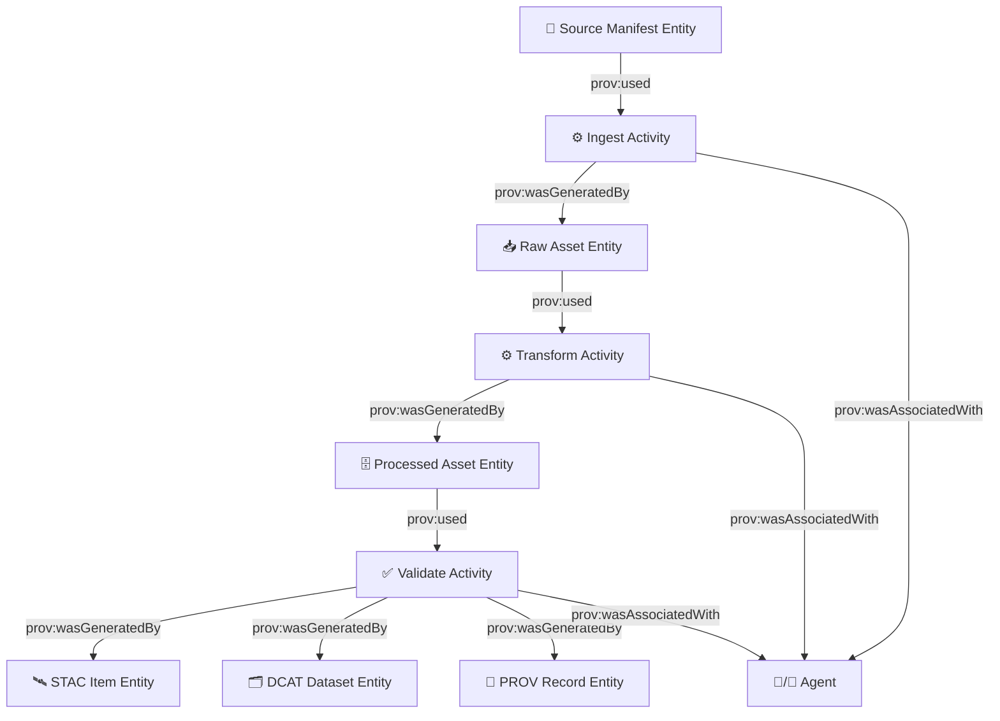

<a id="top"></a>

# 🧬 KFM PROV Profile (KFM-PROV) — v11.0.0 ✅  

%20%7C%20PROV--JSON-8957e5)


> [!IMPORTANT]
> This document defines **how Kansas Frontier Matrix (KFM)** records provenance using **W3C PROV**.  
> Every promoted dataset **MUST** have a corresponding provenance record in `data/provenance/` and be linkable from STAC/DCAT.

---

## 🧭 Quick Jump
- 🎯 [Purpose & Non‑Goals](#-purpose--non-goals)
- 🧱 [Core Concepts](#-core-concepts)
- 🗂️ [Where PROV Lives](#️-where-prov-lives)
- 🔗 [KFM-MDP: Staging → Validation → Publish](#-kfm-mdp-staging--validation--publish)
- 🧬 [KFM PROV Data Model](#-kfm-prov-data-model)
- 🆔 [Identifiers & Immutability](#-identifiers--immutability)
- 🧾 [Required Fields](#-required-fields)
- 🔌 [Integration: STAC, DCAT, Graph, GitHub](#-integration-stac-dcat-graph-github)
- 🔐 [Security, Sensitivity & Redaction](#-security-sensitivity--redaction)
- ✅ [Validation & QA Gates](#-validation--qa-gates)
- 🧪 [Examples](#-examples)
- 📚 [Project Library Mapping](#-project-library-mapping)
- 🗒️ [Changelog](#️-changelog)

---

## 🎯 Purpose & Non‑Goals

### ✅ Purpose
KFM provenance exists so that any user (human or machine) can answer:

- **What** is this artifact/dataset?
- **Where** did it come from (sources)?
- **How** was it produced (pipelines, parameters, code, environment)?
- **Who/what** performed it (human + software agent attribution)?
- **When** did it run?
- **Can it be reproduced** deterministically?

KFM treats provenance as a **first-class deliverable**, not an afterthought.

### 🚫 Non‑Goals
- This profile is **not** a replacement for STAC or DCAT.
- This profile does **not** define a full ontology for all knowledge graph entities (that belongs to KFM ontology standards).
- This profile does **not** mandate a single workflow engine (Airflow, Prefect, GitHub Actions, etc.). It mandates the **evidence** emitted.

---

## 🧱 Core Concepts

KFM uses **W3C PROV** primitives:

- **Entity** 🧱: a thing (file, dataset, STAC item, model artifact, config snapshot)
- **Activity** ⚙️: a process/action that used/produced entities (ingest, transform, validate, publish, build tiles)
- **Agent** 🧑‍💻🤖: actor responsible (person, organization, software, CI agent, Earth Engine script runner)

…and the canonical relations:

- `prov:used`
- `prov:wasGeneratedBy`
- `prov:wasDerivedFrom`
- `prov:wasAssociatedWith`
- `prov:wasAttributedTo`
- `prov:actedOnBehalfOf`
- `prov:hadPlan` (recommended for configs)
- `prov:wasInformedBy` (recommended for chained steps)

---

## 🗂️ Where PROV Lives

### 📁 Required repository locations
KFM’s repository structure explicitly includes a provenance home:

```text
📁 data/
├─ 🧾 sources/        # source manifests (metadata only)
├─ 📥 raw/            # raw inputs (append-only / immutable)
├─ 🗄️ processed/      # processed outputs (versioned)
├─ 🗂️ catalog/        # STAC catalog JSON
└─ 🧬 provenance/     # PROV records (this profile governs these)
```

> [!NOTE]
> KFM’s technical documentation explicitly describes `data/provenance/` as the store for provenance records and recommends **JSON-LD using W3C PROV-O** as the core format.

### 🧾 What must produce PROV?
Any pipeline run that **promotes** data (i.e., enters official catalog) **MUST** emit PROV.

Additionally, KFM **SHOULD** emit PROV for:
- 🧠 model training / inference runs (analytics artifacts)
- 🗺️ tile builds & style exports
- 🕸️ graph build/import runs
- 🤖 CI “Watcher–Planner–Executor” agent actions (PR creation, policy fixes)

---

## 🚦 KFM-MDP: Staging → Validation → Publish

KFM follows a strict promotion rulebook (**KFM‑MDP**) with **no shortcuts**:

```mermaid
flowchart LR
  A[🧾 sources manifest] --> B[📥 raw ingest]
  B --> C[🗄️ processed normalize]
  C --> D[✅ validate]
  D --> E[🛰️ catalog publish (STAC/DCAT)]
  E --> F[🧬 provenance publish (PROV)]
  F --> G[🕸️ graph register]
```

### ✅ Provenance responsibilities per stage
| Stage | Expected PROV behavior |
|------:|-------------------------|
| 🧾 sources | record source URL/license/publisher as entities (even if the source data isn’t stored in-repo) |
| 📥 raw | record download/import activity; capture checksums + retrieval timestamp |
| 🗄️ processed | record transforms + parameters + software versions |
| ✅ validate | record validation activity + results + schema versions |
| 🛰️ publish | record publish activity + generated STAC/DCAT entities |
| 🧬 provenance publish | record the provenance record itself as a versioned artifact |
| 🕸️ graph register | record graph import activity + graph snapshot identifiers |

---

## 🧬 KFM PROV Data Model

### 🧠 The “KFM Spine” (recommended minimal graph)
Every promoted dataset should yield a chain like:



### 🧱 KFM entity types (profile vocabulary)
KFM uses `prov:Entity` with a `prov:type` (and optionally a `kfm:type`) from this set:

- 🧾 `kfm:SourceManifest`
- 📥 `kfm:RawAsset`
- 🗄️ `kfm:ProcessedAsset`
- 📦 `kfm:Dataset` (conceptual dataset ID; often aligns with DCAT)
- 🛰️ `kfm:STACItem`
- 🛰️ `kfm:STACCollection` (optional)
- 🗂️ `kfm:DCATDataset`
- 🧬 `kfm:ProvenanceRecord`
- ⚙️ `kfm:PipelineConfig` (plan entity)
- 🧠 `kfm:ModelArtifact` (optional)
- 🗺️ `kfm:TileSet` / `kfm:MapStyle` (optional)
- 🎬 `kfm:StoryNode` (optional)
- 🕸️ `kfm:GraphSnapshot` (optional)
- 🧪 `kfm:ValidationReport` (recommended)

### ⚙️ KFM activity types
KFM uses `prov:Activity` with `prov:type` (and optionally `kfm:type`) from:

- 📥 `kfm:Ingest`
- 🧹 `kfm:Normalize`
- 🧪 `kfm:Transform`
- ✅ `kfm:Validate`
- 🛰️ `kfm:PublishCatalog`
- 🧬 `kfm:PublishProvenance`
- 🕸️ `kfm:RegisterGraph`
- 🗺️ `kfm:BuildTiles`
- 🧠 `kfm:ModelRun`
- 🔐 `kfm:PolicyCheck` (security/compliance)
- 🧑‍⚖️ `kfm:GovernanceAction` (decision/audit events)
- 🤖 `kfm:AgentMaintenance` (Watcher/Planner/Executor automation)

### 🧑‍💻 KFM agent types
KFM uses `prov:Agent` with:

- 🧑 `prov:Person`  
- 🏛️ `prov:Organization`  
- 🤖 `prov:SoftwareAgent`  
- 🧠 `kfm:AIReasoner` (optional — used when an AI agent proposes a change or an answer)

> [!WARNING]
> When recording AI involvement (Focus Mode or CI agents), KFM provenance **MUST** include a human review boundary when applicable (e.g., PR review). The AI agent **MUST NOT** appear as the sole accountable actor for irreversible publish actions.

---

## 🆔 Identifiers & Immutability

### 🆔 Identifier rules (normative)
All PROV nodes (entities/activities/agents) **MUST** have stable identifiers.

**KFM recommended ID scheme:**
- `kfm:<namespace>:<kind>:<name>:<version_or_hash>`

Examples:
- `kfm:data:dataset:agri.yields:2024-05`  
- `kfm:data:file:raw/usda_yields_2024.csv:sha256-<...>`  
- `kfm:pipeline:run:historical_map_georef:<run_id>`  
- `kfm:agent:software:kfm-pipeline:<git_commit>`  

### ♻️ Immutability contract (normative)
- `data/raw/**` **MUST** be treated as append-only. If a source changes, it becomes a **new entity**.
- Every material artifact entity **MUST** carry a content hash (at least SHA‑256).
- If an artifact changes, it **MUST** be published under a new versioned path or name.

> [!TIP]
> Use a monotonic run ID (ULID/UUIDv7) and a deterministic **idempotency key** for replays.

---

## 🧾 Required Fields

This profile defines a **minimum** set of metadata to consider a provenance record “KFM-conformant”.

### ✅ Required for every `prov:Entity`
- `prov:id` (or JSON-LD `@id`)
- `prov:type` (include a `kfm:*` type)
- `prov:label` (human readable)
- `kfm:hash.sha256` (if materialized artifact)
- `kfm:license` (or a pointer to DCAT license)
- `kfm:sensitivity` (e.g., `public|internal|restricted`)

### ✅ Required for every `prov:Activity`
- `prov:id`
- `prov:type` (kfm activity type)
- `prov:startedAtTime`
- `prov:endedAtTime` (or explicit “open” activity if streaming)
- `kfm:run_id`
- `kfm:code_ref.git_commit` (or equivalent immutable code ref)
- `kfm:environment` (at least one of: container digest, runtime version, or execution host signature)
- `prov:used` edges to all material inputs
- `prov:wasGeneratedBy` edges for outputs

### ✅ Required for every `prov:Agent`
- `prov:id`
- `prov:type` (person/org/software)
- `prov:label`
- `kfm:contact` (for people/orgs) **OR** `kfm:repository` (for software agents)

---

## 🧾 Serialization & Files

### 🧬 Required formats
KFM provenance **MUST** be emitted in at least one:

1. **PROV‑O JSON‑LD** (preferred)  
2. **PROV‑JSON** (acceptable)

KFM **MAY** additionally emit:
- PROV‑N (human diff-friendly)
- RDF/Turtle (linked data workflows)
- Signed attestations (supply-chain integrity)

### 📁 File layout (normative)
Each promoted dataset **MUST** have a dataset folder:

```text
data/provenance/
└─ <dataset_id>/
   └─ <run_id>/
      ├─ prov.jsonld        # REQUIRED (preferred)
      ├─ prov.json          # OPTIONAL (PROV-JSON)
      ├─ validation.json    # RECOMMENDED (schema/QA summary)
      └─ README.md          # OPTIONAL (human notes)
```

### 🧷 JSON-LD context (recommended)
KFM JSON-LD **SHOULD** include a context that defines `kfm:` attributes cleanly.

<details>
<summary>📌 Minimal KFM JSON-LD context (starter)</summary>

```json
{
  "@context": {
    "prov": "http://www.w3.org/ns/prov#",
    "kfm": "https://kansasfrontiermatrix.org/ns/kfm#",
    "xsd": "http://www.w3.org/2001/XMLSchema#",
    "kfm:hash": { "@id": "kfm:hash", "@type": "@json" },
    "kfm:code_ref": { "@id": "kfm:code_ref", "@type": "@json" },
    "kfm:environment": { "@id": "kfm:environment", "@type": "@json" },
    "kfm:sensitivity": { "@id": "kfm:sensitivity", "@type": "xsd:string" }
  }
}
```
</details>

---

## 🔌 Integration: STAC, DCAT, Graph, GitHub

### 🛰️ STAC integration (normative)
If an output is cataloged as STAC, the STAC Item **MUST** link to provenance:

- Include a STAC `link` object with:
  - `rel: "provenance"` (recommended)
  - `href: "<path-to-prov.jsonld>"`
  - `type: "application/ld+json"`

<details>
<summary>🛰️ Example STAC link snippet</summary>

```json
{
  "links": [
    {
      "rel": "provenance",
      "href": "../../provenance/agri.yields/01J1ABCDEF/prov.jsonld",
      "type": "application/ld+json",
      "title": "KFM provenance record (PROV-O JSON-LD)"
    }
  ]
}
```
</details>

### 🗂️ DCAT integration (normative)
If an output is cataloged as DCAT, the DCAT dataset **SHOULD** reference provenance via `dct:provenance` or an equivalent field.

<details>
<summary>🗂️ Example DCAT provenance pointer</summary>

```json
{
  "dct:provenance": {
    "@id": "data/provenance/agri.yields/01J1ABCDEF/prov.jsonld"
  }
}
```
</details>

### 🕸️ Knowledge graph integration (recommended)
KFM’s Neo4j layer should ingest provenance edges so the graph can answer:

- “show upstream sources for this layer”
- “list pipeline runs touching this dataset”
- “audit who published this artifact and with which code”

**Suggested mapping (non-normative):**
- `prov:Entity` → `(:Entity {id, type, label, hash, sensitivity})`
- `prov:Activity` → `(:Activity {id, type, run_id, start, end, code_ref})`
- `prov:Agent` → `(:Agent {id, type, label})`
- Relations → `:USED`, `:GENERATED`, `:ASSOCIATED_WITH`, `:DERIVED_FROM`

### 🧑‍⚖️ GitHub / CI integration (recommended)
KFM proposals include “GitHub PR → PROV Graph Integration” and provenance-first CI agents.

#### 🤖 Watcher–Planner–Executor agent pattern (recommended)
Model the CI automation as:
- `WatcherAlert` entity (immutable fact)
- `Plan` entity (deterministic plan)
- `ExecutorPR` entity (PR object)
- Activities for observe/plan/execute
- A human reviewer agent in the chain before merge

> [!IMPORTANT]
> The executor **MUST NOT** auto-merge. Human review remains a provenance boundary.

---

## 🔐 Security, Sensitivity & Redaction

### 🏷️ Sensitivity tag (normative)
Every promoted dataset provenance record **MUST** declare:

- `kfm:sensitivity: "public" | "internal" | "restricted"`

### 🧼 Redaction rules (normative)
When sensitivity is `restricted`:
- PROV records **MAY** omit exact coordinates, detailed paths, or sensitive identifiers.
- Redacted references **MUST** remain linkable via stable IDs and hashes where feasible.
- Access to restricted PROV files **MUST** follow the same policy as the dataset.

### 🔏 Hashes and tamper resistance (recommended)
KFM emphasizes integrity checks:
- Use SHA‑256 for artifacts.
- Record `kfm:hash.sha256` for raw downloads and for processed outputs.
- Prefer content-addressed naming for exported artifacts and tiles where practical.

> [!TIP]
> If a source is external and mutable, store a “source snapshot signature” entity with retrieval time + checksum.

---

## ✅ Validation & QA Gates

### ✅ KFM PROV conformance checks (normative)
A PROV record is “KFM‑PROV conformant” if:

- [ ] It is valid JSON (and valid JSON-LD if applicable)
- [ ] It contains at least one **Activity** with `kfm:run_id`
- [ ] Every output artifact entity has a SHA‑256 hash
- [ ] Every promoted dataset links to its provenance (STAC/DCAT pointers)
- [ ] All referenced IDs are resolvable (within repo or via declared external resolvers)
- [ ] Sensitivity is declared and not contradictory to the dataset policy

### 🧪 Recommended QA artifacts
Each provenance folder **SHOULD** include:
- `validation.json` with:
  - schema versions checked
  - bounding box / time range checks performed
  - link integrity results
  - policy checks performed (license, sensitivity, allowed geometry exposure)

---

## 🧪 Examples

### 1) Minimal PROV-JSON (pipeline run)
<details>
<summary>📄 Minimal example (PROV-JSON)</summary>

```json
{
  "prefix": {
    "prov": "http://www.w3.org/ns/prov#",
    "kfm": "https://kansasfrontiermatrix.org/ns/kfm#"
  },
  "entity": {
    "kfm:src:manifest:usda_yields_2024": {
      "prov:type": "kfm:SourceManifest",
      "prov:label": "USDA yields manifest (2024)",
      "kfm:sensitivity": "public"
    },
    "kfm:raw:file:usda_yields_2024_csv:sha256-AAA": {
      "prov:type": "kfm:RawAsset",
      "prov:label": "USDA yields 2024 CSV (raw)",
      "kfm:hash": { "sha256": "AAA..." },
      "kfm:sensitivity": "public"
    },
    "kfm:proc:file:agri_yields_2024_geoparquet:sha256-BBB": {
      "prov:type": "kfm:ProcessedAsset",
      "prov:label": "Kansas yields 2024 (GeoParquet)",
      "kfm:hash": { "sha256": "BBB..." },
      "kfm:sensitivity": "public"
    }
  },
  "activity": {
    "kfm:act:run:agri_yields:01J1ABCDEF": {
      "prov:type": "kfm:Transform",
      "prov:startedAtTime": "2026-01-12T10:00:00Z",
      "prov:endedAtTime": "2026-01-12T10:02:00Z",
      "kfm:run_id": "01J1ABCDEF",
      "kfm:code_ref": { "git_commit": "abc123" }
    }
  },
  "agent": {
    "kfm:agent:software:kfm-pipelines:abc123": {
      "prov:type": "prov:SoftwareAgent",
      "prov:label": "kfm-pipelines @ abc123"
    }
  },
  "used": {
    "_:u1": {
      "prov:activity": "kfm:act:run:agri_yields:01J1ABCDEF",
      "prov:entity": "kfm:raw:file:usda_yields_2024_csv:sha256-AAA"
    }
  },
  "wasGeneratedBy": {
    "_:g1": {
      "prov:entity": "kfm:proc:file:agri_yields_2024_geoparquet:sha256-BBB",
      "prov:activity": "kfm:act:run:agri_yields:01J1ABCDEF"
    }
  },
  "wasAssociatedWith": {
    "_:a1": {
      "prov:activity": "kfm:act:run:agri_yields:01J1ABCDEF",
      "prov:agent": "kfm:agent:software:kfm-pipelines:abc123"
    }
  }
}
```
</details>

### 2) Model run provenance (recommended pattern)
When producing forecasts/estimates, include:
- training data entity
- feature engineering activity
- model training activity
- evaluation report entity
- model artifact entity

> [!NOTE]
> This aligns with KFM’s modeling + analytics discipline and supports future auditability for environmental correction models, simulations, and decision support.

### 3) CI Agent provenance (Watcher–Planner–Executor)
Record:
- watcher alert entity (immutable)
- planner plan entity (deterministic; includes idempotency key)
- executor PR entity (link to PR)
- human review activity + agent

---

## 📚 Project Library Mapping

KFM keeps a project library that informs how provenance should be recorded (rigor, reproducibility, security, governance).  
Below is how **each project file** contributes to KFM-PROV thinking and coverage.

> [!TIP]
> Treat this as a “why this profile looks like it does” index — not a normative dependency list.

### 🧭 Core KFM sources (authoritative for KFM specifics)
- 📄 **Kansas Frontier Matrix (KFM) – Comprehensive Technical Documentation.docx**  
  → Defines `data/provenance/`, W3C PROV usage, KFM-MDP staging discipline, and “provenance emission on each pipeline run”.
- 📄 **🌟 Kansas Frontier Matrix – Latest Ideas & Future Proposals.docx**  
  → Expands provenance into CI agents, PR→PROV graph integration, policy packs, and supply-chain provenance attestation.
- 📄 **Audit of the Kansas Frontier Matrix (KFM) Repository.pdf**  
  → Confirms standards posture (STAC/DCAT + PROV-O JSON-LD) and highlights operational gaps that provenance can help close (completeness, implementation status, integration depth).

### 🛰️ Remote sensing & geospatial operations
- ☁️ **Cloud-Based Remote Sensing with Google Earth Engine-Fundamentals and Applications.pdf**  
  → Reinforces the need to record scripts, date ranges, exports, and cloud execution context as first-class provenance.
- 🧭 **making-maps-a-visual-guide-to-map-design-for-gis.pdf**  
  → Encourages recording map design choices, classification methods, and style versions (cartographic provenance).
- 🐍 **python-geospatial-analysis-cookbook.pdf**  
  → Supports reproducible geospatial transforms and highlights common points where provenance prevents “mystery GIS”.
- 📱 **Mobile Mapping_ Space, Cartography and the Digital - 9789048535217.pdf**  
  → Motivates provenance for data context and user-facing narratives in mobile/digital mapping.
- 🧊 **webgl-programming-guide-interactive-3d-graphics-programming-with-webgl.pdf**  
  → Supports provenance for 3D visualization builds, assets, and rendering configuration.
- 🖼️ **compressed-image-file-formats-jpeg-png-gif-xbm-bmp.pdf**  
  → Reinforces recording encoding/transcoding settings for tiles, thumbnails, and story media assets.

### 🗄️ Data systems & “data space” governance
- 🗄️ **PostgreSQL Notes for Professionals - PostgreSQLNotesForProfessionals.pdf**  
  → Supports provenance of schema migrations, query transforms, and reproducible spatial indexing.
- ⚙️ **Scalable Data Management for Future Hardware.pdf**  
  → Encourages provenance for partitioning, compute environment, and performance-relevant execution details.
- 🧺 **Data Spaces.pdf**  
  → Frames provenance as a trust mechanism across organizations and sharing boundaries (policy + audit + interoperability).

### 🧪 Modeling, statistics & scientific credibility
- 🧪 **Scientific Modeling and Simulation_ A Comprehensive NASA-Grade Guide.pdf**  
  → Supports recording V&V activities, assumptions, calibration, and credibility evidence as provenance.
- 📉 **regression-analysis-with-python.pdf**  
  → Supports provenance for model assumptions, diagnostics, and reproducibility of statistical results.
- 🧾 **Regression analysis using Python - slides-linear-regression.pdf**  
  → Reinforces the “record inputs/parameters/metrics” approach for transparent modeling.
- 🎛️ **Understanding Statistics & Experimental Design.pdf**  
  → Encourages provenance for study design choices, sampling, and analytic constraints.
- 📊 **graphical-data-analysis-with-r.pdf**  
  → Motivates provenance for EDA artifacts (outlier handling, distribution shifts, visual audit trail).
- 🎲 **think-bayes-bayesian-statistics-in-python.pdf**  
  → Supports provenance for priors, posterior summaries, and uncertainty reporting.
- 🧱 **Generalized Topology Optimization for Structural Design.pdf**  
  → Supports provenance for optimization constraints, objective functions, and solver configurations.
- 🎼 **Spectral Geometry of Graphs.pdf**  
  → Supports provenance for graph computations, embeddings, clustering runs, and algorithm parameterization.
- 🧬 **Principles of Biological Autonomy - book_9780262381833.pdf**  
  → Encourages systems thinking: provenance as feedback/constraint memory across a complex adaptive system.

### 🌐 Web delivery & software engineering
- 📐 **responsive-web-design-with-html5-and-css3.pdf**  
  → Motivates provenance for UI builds, accessibility checks, and front-end artifacts.
- 🧵 **concurrent-real-time-and-distributed-programming-in-java-threads-rtsj-and-rmi.pdf**  
  → Motivates provenance for concurrency-sensitive pipelines, scheduling, and event ordering.

### 🧑‍⚖️ Governance, human-centered constraints & legal framing
- 🧠 **Introduction to Digital Humanism.pdf**  
  → Reinforces provenance as a human-centered accountability mechanism (traceable claims, agency, transparency).
- ⚖️ **On the path to AI Law’s prophecies and the conceptual foundations of the machine learning age.pdf**  
  → Encourages provenance around AI decision support, compliance, and explainability boundaries.

### 🔐 Security references (defensive posture only)
- 🛡️ **ethical-hacking-and-countermeasures-secure-network-infrastructures.pdf**  
  → Supports security logging, threat-aware audit trails, and defensive validation gates.
- 🧪 **Gray Hat Python - Python Programming for Hackers and Reverse Engineers (2009).pdf**  
  → Used only to inform defensive thinking and supply-chain awareness; KFM provenance helps detect tampering and unexpected changes.

### 📚 Programming library bundles (broad implementation references)
- 📘 **A programming Books.pdf**
- 📗 **B-C programming Books.pdf**
- 📙 **D-E programming Books.pdf**
- 📕 **F-H programming Books.pdf**
- 📔 **I-L programming Books.pdf**
- 📓 **M-N programming Books.pdf**
- 📒 **O-R programming Books.pdf**
- 📘 **S-T programming Books.pdf**
- 📗 **U-X programming Books.pdf**
- 🧠 **Deep Learning for Coders with fastai and PyTorch - Deep.Learning.for.Coders.with.fastai.and.PyTorchpdf**  
  → Collectively support implementation patterns, testing, ML reproducibility norms, and engineering discipline that provenance must capture.

---

## 🧷 Developer Checklist (Paste into PRs) ✅

- [ ] I emitted `prov.jsonld` into `data/provenance/<dataset_id>/<run_id>/`
- [ ] My provenance includes **inputs, outputs, params, code ref, environment, agent**
- [ ] All material artifacts in PROV have **SHA‑256**
- [ ] STAC Item links to provenance (`rel="provenance"`)
- [ ] DCAT metadata references provenance (recommended)
- [ ] Sensitivity is tagged and matches policy
- [ ] Validation report exists (recommended) and CI checks pass

---

## ⬆️ Back to Top
[↑ return](#top)

---

## 🗒️ Changelog
- **v11.0.0** (2026-01-12) — Initial governed profile: storage layout, conformance rules, STAC/DCAT integration guidance, CI agent modeling, sensitivity handling.
