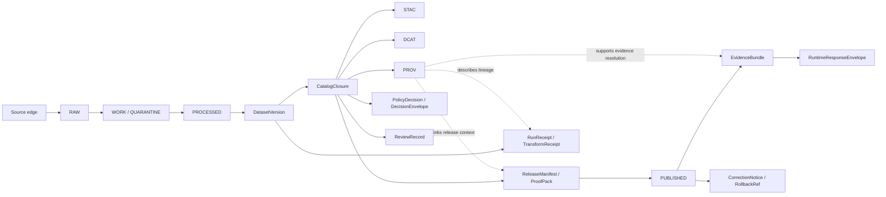

<!-- [KFM_META_BLOCK_V2]
doc_id: kfm://doc/NEEDS_VERIFICATION
title: KFM PROV Profile
type: standard
version: v1
status: draft
owners: NEEDS_VERIFICATION
created: 2026-04-30
updated: 2026-04-30
policy_label: NEEDS_VERIFICATION
related: [NEEDS_VERIFICATION: companion STAC profile doc, NEEDS_VERIFICATION: companion DCAT profile doc, NEEDS_VERIFICATION: CatalogClosure schema, NEEDS_VERIFICATION: DatasetVersion schema, NEEDS_VERIFICATION: ReleaseManifest schema, NEEDS_VERIFICATION: EvidenceBundle schema]
tags: [kfm, provenance, prov-o, standards]
notes: [Grounded in the attached March-April 2026 KFM corpus and the uploaded KFM PROV Profile baseline draft; target repo path is docs/standards/KFM_PROV_PROFILE.md; doc_id, owners, policy label, related paths, mounted schema filenames, validators, emitters, and CI enforcement remain NEEDS_VERIFICATION.]
[/KFM_META_BLOCK_V2] -->

<a id="top"></a>

# KFM PROV Profile

A KFM-specific provenance profile for outward lineage, release traceability, and evidence-linked publication.

<div align="left">


</div>

> [!IMPORTANT]
> This file defines a **publication-facing provenance profile**. It does **not** claim that the active repository already contains PROV emitters, validators, schemas, catalog compilers, CI gates, or released PROV bundles.

| Signal | Value |
|---|---|
| **Target path** | `docs/standards/KFM_PROV_PROFILE.md` |
| **Document role** | Standard / outward provenance profile |
| **Current posture** | **CONFIRMED** KFM doctrine · **PROPOSED** profile details · **UNKNOWN** mounted implementation |
| **Primary semantic base** | W3C PROV-O |
| **Closure role** | Companion lineage member beside STAC and DCAT inside KFM catalog closure |
| **Primary audience** | Data, platform, catalog, policy, review, release, and delivery maintainers |
| **Not a substitute for** | `EvidenceBundle`, `ReleaseManifest`, `DecisionEnvelope`, `PolicyDecision`, `ReviewRecord`, `ProofPack`, or correction lineage |

**Quick jumps:** [Purpose](#1-purpose) · [Scope](#2-scope) · [Truth labels](#3-truth-labels-and-evidence-boundary) · [Architecture position](#4-position-in-kfm-architecture) · [PROV in KFM](#7-what-prov-means-in-kfm) · [Required outcomes](#8-required-profile-outcomes) · [Contract crosswalk](#11-crosswalk-to-kfm-contract-families) · [STAC / DCAT relationship](#12-relationship-to-stac-and-dcat) · [Validation checklist](#17-validation-checklist) · [Examples](#18-examples) · [Open verification](#21-open-verification-items)

---

## At a glance

- **PROV in KFM is outward lineage vocabulary, not sovereign system truth.**
- **Catalog closure carries STAC / DCAT / PROV together**; the three profiles should align, not compete.
- **KFM governance artifacts remain first-class** and must not be flattened into generic provenance triples.
- **Publication is fail-closed:** unresolved rights, sensitivity, evidence, review, policy, catalog, or release gaps block outward release.
- **PROV surfaces must be public-safe** for their audience; provenance must not leak exact restricted locations, sensitive identifiers, steward-only context, or unreleased source details.
- **This profile is intentionally conservative** until repository schema homes, validators, emitters, and CI wiring are directly verified.

---

## 1. Purpose

This standard defines how **Kansas Frontier Matrix (KFM)** should use **PROV-O** as its outward provenance and lineage vocabulary for released datasets, release-bearing artifacts, and publication-safe derivatives.

It exists to make three things explicit:

1. what **PROV must express** in KFM;
2. how **PROV relates to STAC and DCAT** inside KFM’s outward catalog closure; and
3. which **KFM-specific governance objects** must remain visible beside generic provenance relations.

> [!IMPORTANT]
> In KFM, provenance is not a decorative appendix. It is part of governed publication, correction lineage, evidence inspectability, and audit reconstruction.

[Back to top](#top)

---

## 2. Scope

### 2.1 Applies to

This profile applies to **released or release-bearing provenance surfaces** associated with:

- dataset versions;
- published layers;
- COG, GeoParquet, PMTiles, TileJSON, MVT, scene, or other release artifacts;
- catalog closure records;
- public-safe derived products;
- correction, supersession, withdrawal, or rollback chains;
- evidence-bearing exports;
- governed API payloads that need outward lineage linkage.

### 2.2 Does not apply to

This profile does **not** make the following publishable by itself:

- RAW source captures;
- WORK-stage transforms;
- QUARANTINE artifacts;
- unpublished candidates;
- private steward review material;
- sensitive exact-location evidence;
- direct model outputs;
- analyst scratch products;
- internal-only debugging traces.

### 2.3 Outward provenance surface

A **KFM outward PROV surface** is any machine-readable provenance object, bundle, sidecar, catalog member, or linked document that is intended to travel with a released or release-bearing subject.

It may describe internal processing steps, but it must expose only the level of detail permitted for the target audience.

[Back to top](#top)

---

## 3. Truth labels and evidence boundary

| Label | How it is used in this standard |
|---|---|
| **CONFIRMED** | Directly supported by attached KFM doctrine or by direct current-session workspace inspection. |
| **INFERRED** | Structurally necessary completion strongly implied by repeated KFM corpus patterns. |
| **PROPOSED** | Recommended profile choice that fits KFM doctrine but is not verified as mounted implementation. |
| **UNKNOWN** | Not verified strongly enough from the mounted workspace, repository tree, runtime, logs, tests, or generated artifacts. |
| **NEEDS VERIFICATION** | A concrete repo, owner, date, schema, path, policy, validator, emitter, CI, rights, or release-state check remains required. |

### 3.1 Current evidence boundary

CONFIRMED in this session:

- the target path was supplied by the user: `docs/standards/KFM_PROV_PROFILE.md`;
- the visible workspace contains uploaded PDFs and prior Markdown-like drafts;
- `/mnt/data` is not a Git repository;
- no mounted KFM source tree, schema registry, workflow YAML, tests, dashboards, logs, or emitted PROV bundles were directly available.

Therefore this file states doctrine and profile design, but does not claim current implementation depth.

[Back to top](#top)

---

## 4. Position in KFM architecture

KFM’s governed truth path is:

```text
SOURCE EDGE -> RAW -> WORK / QUARANTINE -> PROCESSED -> CATALOG / TRIPLET -> PUBLISHED
```

At the **CATALOG / TRIPLET** stage, outward closure includes the **STAC / DCAT / PROV** triplet plus KFM release, policy, review, proof, and correction references. That means this PROV profile belongs to the **publication-facing closure layer**, not to ad hoc logs or detached technical notes.


```mermaid
flowchart LR
    A[Source edge] --> B[RAW]
    B --> C[WORK / QUARANTINE]
    C --> D[PROCESSED]
    D --> E[DatasetVersion]
    E --> F[CatalogClosure]

    F --> G[STAC]
    F --> H[DCAT]
    F --> I[PROV]

    F --> J[PolicyDecision / DecisionEnvelope]
    F --> K[ReviewRecord]
    F --> L[ReleaseManifest / ProofPack]
    L --> M[PUBLISHED]

    E --> N[RunReceipt / TransformReceipt]
    M --> O[EvidenceBundle]
    O --> P[RuntimeResponseEnvelope]
    M --> Q[CorrectionNotice / RollbackRef]

    I -. describes lineage .-> N
    I -. links release context .-> L
    I -. supports evidence resolution .-> O
```

### 4.1 KFM rule

**PROV is one member of the closure set.** It must link coherently with:

- the release-bearing subject;
- the catalog closure;
- the relevant release object;
- the evidence bundle or evidence references;
- the audit, review, policy, correction, and rollback chain where applicable.

> [!NOTE]
> `CatalogClosure` is the outward seam where discovery and lineage travel together. Decision, review, release, runtime, and correction objects remain adjacent first-class artifacts rather than being absorbed into PROV.

[Back to top](#top)

---

## 5. Normative standards basis

The attached KFM corpus treats STAC, DCAT, and PROV as complementary outward catalog / discovery / lineage surfaces. This file narrows the PROV side of that closure.

| Standard / profile | Role in this profile | Status in this standard |
|---|---|---|
| **PROV-O** | Semantic base for entities, activities, agents, and causal / responsibility relations | **CONFIRMED external standard** / **PROPOSED KFM profile use** |
| **PROV-DM** | Conceptual data model behind PROV-O | **CONFIRMED external standard** / background |
| **DCAT** | Companion outward dataset and distribution metadata | **CONFIRMED KFM closure role** / companion profile **NEEDS VERIFICATION** |
| **STAC** | Companion spatiotemporal asset / item / collection discovery vocabulary | **CONFIRMED KFM closure role** / companion profile **NEEDS VERIFICATION** |
| **JSON Schema** | Proposed validation family for JSON serializations and profile schemas | **PROPOSED** until schema-home and draft target are verified in repo |
| **JSON-LD** | Proposed outward-friendly serialization for linked catalog interoperability | **PROPOSED** until emitter and validator behavior are verified |

### 5.1 Semantic authority

The semantic authority for the generic provenance concepts in this profile is **PROV-O**. KFM adds governance, policy, evidence, review, release, and correction obligations around it.

### 5.2 KFM authority

External standards sharpen interoperability. They do **not** override KFM’s truth path, trust membrane, cite-or-abstain posture, policy checks, sensitivity rules, or governed promotion law.

[Back to top](#top)

---

## 6. Design principles

### 6.1 PROV is subordinate to KFM doctrine

PROV must **support** KFM’s governed evidence system, not simplify it into generic graph prose.

### 6.2 Outward provenance must remain release-linked

A PROV bundle without release linkage is incomplete for KFM.

### 6.3 Governance artifacts stay first-class

`DecisionEnvelope`, `PolicyDecision`, `ReviewRecord`, `ReleaseManifest`, `ProofPack`, `EvidenceBundle`, `CorrectionNotice`, and `RollbackRef` must remain inspectable objects. Link them from PROV; do not dissolve them into unlabeled triples.

### 6.4 Public-safe posture is mandatory

No outward provenance surface may expose restricted, exact-location, sovereign, cultural, personal, DNA, archaeology, rare-species, critical-infrastructure, private-land, source-term-restricted, or steward-only detail unless that disclosure has passed KFM publication controls.

### 6.5 Correction must preserve lineage

Supersession, withdrawal, generalization, replacement, rollback, and narrowed republication must remain visible. Provenance must help preserve lineage, not erase it.

### 6.6 Identifiers must be stable enough for closure

A PROV surface must use stable identifiers that can cross-link to release manifests, catalog records, evidence bundles, receipts, and correction records without guesswork.

[Back to top](#top)

---

## 7. What PROV means in KFM

KFM uses PROV to describe:

- **Entities** — released artifacts, dataset versions, source captures, transformed derivatives, catalog resources, evidence-supporting assets;
- **Activities** — fetch, ingest, normalize, validate, transform, generalize, redact, build, catalog, promote, publish, correct, withdraw;
- **Agents** — source organizations, maintainers, review actors, software runners, governed services, policy engines, model adapters where relevant.

### 7.1 KFM interpretation

| PROV concept | KFM interpretation |
|---|---|
| `prov:Entity` | A governed artifact or published / referenced subject in the truth path |
| `prov:Activity` | A named transformation, validation, release, correction, or cataloging step |
| `prov:Agent` | A responsible organization, reviewer, service, software actor, or controlled runtime |
| `prov:used` | Input relation from an activity to source, configuration, prior artifact, receipt, or release-bearing entity |
| `prov:wasGeneratedBy` | Output relation from an entity to the activity that generated it |
| `prov:wasAssociatedWith` | Operational association between activity and actor / service / software runner |
| `prov:wasAttributedTo` | Accountability or authorship / ownership link for an entity |
| `prov:wasDerivedFrom` | Content, version, transform, or lineage derivation across entities |
| `prov:hadPrimarySource` | Source-origin relation where a source artifact is the primary source for a derived or cataloged entity |
| `prov:wasRevisionOf` | Correction, replacement, or revised publication relation where appropriate |
| `prov:invalidatedAtTime` / `prov:wasInvalidatedBy` | Withdrawal, replacement, rollback, or supersession timing where appropriate |
| `prov:qualifiedAssociation` | Optional refinement where runner role, reviewer role, software version, or execution plan matters |
| `prov:qualifiedGeneration` | Optional refinement where generation time, method, digest, or transform condition matters |
| `prov:Bundle` | A named set of provenance descriptions; in KFM, often aligned to a release, dataset version, proof pack, or catalog closure |

> [!WARNING]
> PROV can describe lineage. It does not, by itself, prove rights, safety, review, release approval, or artifact integrity. Those remain KFM governance obligations.

[Back to top](#top)

---

## 8. Required profile outcomes

A KFM-conformant outward PROV surface **MUST** do all of the following:

1. identify the published or release-bearing subject unambiguously;
2. identify at least one generating, transforming, cataloging, or publishing activity;
3. identify at least one accountable agent;
4. link the PROV surface to the relevant KFM release / correction context;
5. preserve enough lineage for reconstruction, review, audit, rollback, or dispute handling;
6. remain consistent with matching STAC and DCAT closure where those companion surfaces apply;
7. remain public-safe for the target audience;
8. remain machine-checkable;
9. expose correction / supersession linkage where applicable;
10. avoid treating rendered, summarized, or AI-generated language as provenance authority.

### 8.1 Fail-closed outcomes

A KFM outward PROV surface **MUST NOT** be accepted for public release when:

- the subject cannot be resolved to a release-bearing object;
- a generating activity is missing;
- no accountable agent is identified;
- release, review, or policy linkage is absent for a release-significant subject;
- required identifiers disagree across STAC / DCAT / PROV closure;
- public-safe redaction or generalization receipts are missing for sensitive material;
- required artifact digests or integrity links are missing;
- correction lineage is contradicted or silently omitted.

[Back to top](#top)

---

## 9. Minimum outward content

The table below defines the minimum profile content for a KFM outward PROV surface.

| Field family | Minimum requirement | Status |
|---|---|---|
| **profile_version** | KFM PROV profile version identifier | **PROPOSED** |
| **subject_id** | Stable identifier for the governed subject | **PROPOSED** |
| **subject_type** | Subject class such as dataset version, release artifact, projection artifact, catalog closure resource, or correction record | **PROPOSED** |
| **release_ref** | Reference to the release-bearing object or release window | **INFERRED** |
| **catalog_closure_ref** | Link to the outward closure object that coordinates STAC / DCAT / PROV | **INFERRED** |
| **audit_ref** | KFM audit linkage key | **INFERRED** |
| **entities** | At least one input or output entity with stable identifiers | **CONFIRMED** concept |
| **activities** | At least one named activity with time bounds or generated-at timing | **CONFIRMED** concept |
| **agents** | At least one accountable human, organization, service, or software agent | **CONFIRMED** concept |
| **core relations** | `used`, `wasGeneratedBy`, and one accountability relation | **PROPOSED** minimum set |
| **time bounds** | Start / end, generated-at, invalidated-at, or equivalent timing | **PROPOSED** |
| **digest / integrity echo** | Checksum, spec hash, manifest digest, or integrity linkage where the artifact model provides one | **PROPOSED** |
| **rights / sensitivity echo** | Public-safe state or relevant obligations echoed or linked | **INFERRED** |
| **review / policy linkage** | Link to `ReviewRecord`, `PolicyDecision`, or `DecisionEnvelope` where release-significant | **INFERRED** |
| **correction linkage** | Supersession / replacement / rollback / withdrawal linkage where applicable | **INFERRED** |
| **serialization metadata** | Media type, schema / profile identifier, or linked context | **PROPOSED** |

[Back to top](#top)

---

## 10. Mandatory relation set

A KFM outward PROV representation **MUST** include enough structure to express:

- **an output**;
- **the activity that produced it**;
- **the agent responsible or associated**;
- **the input(s) used**;
- **release, audit, or correction linkage**.

### 10.1 Minimum relation rule

For a normal released artifact, the minimum viable set is:

- one `prov:Entity` for the released subject;
- one `prov:Activity` for the generating / building / cataloging / publishing step;
- one `prov:Agent`;
- one `prov:wasGeneratedBy`;
- one `prov:used`;
- one of:
  - `prov:wasAssociatedWith`, or
  - `prov:wasAttributedTo`.

### 10.2 KFM extension rule

Where KFM needs more specificity, the profile **MAY** use refined relations such as:

- `prov:qualifiedAssociation`;
- `prov:qualifiedGeneration`;
- `prov:qualifiedUsage`;
- `prov:wasDerivedFrom`;
- `prov:wasRevisionOf`;
- `prov:wasInvalidatedBy`.

These refinements are useful, but they are not a substitute for the release, audit, evidence, review, and policy objects KFM keeps outside generic PROV.

[Back to top](#top)

---

## 11. Crosswalk to KFM contract families

This is the highest-value repo-facing bridge in the profile.

| KFM contract family | PROV profile role | Rule |
|---|---|---|
| `SourceDescriptor` | Source identity / provenance input context | Linkable input authority description; do not replace source-role policy |
| `SourceIntakeRecord` | Source admission activity / record | May be represented as activity context or linked entity |
| `IngestReceipt` | Process-memory receipt for acquisition | Link as entity used by downstream activity; not release proof by itself |
| `ValidationReport` | Validation activity output | Link as entity generated by validation activity |
| `RunReceipt` | Processing activity receipt | Link to the activity and outputs; do not treat as proof pack |
| `AIReceipt` | AI-mediated activity receipt | Link only when model mediation touches a governed path; never substitute for evidence |
| `TransformReceipt` | Transform / normalization / redaction memory | Required where sensitive or meaning-bearing transforms occur |
| `RedactionReceipt` / `GeneralizationReceipt` | Public-safe transform evidence | Required where outward PROV hides or generalizes details |
| `DatasetVersion` | Primary released or candidate entity | Core `prov:Entity` subject in most dataset cases |
| `ReleaseArtifact` | Published file, tile, layer, export, or package | Core `prov:Entity` when artifact-level lineage matters |
| `CatalogClosure` | Outward closure object | Must carry or resolve STAC / DCAT / PROV together |
| `CatalogMatrix` | Cross-surface closure check | Must prove identifiers / digests / references agree across catalog surfaces |
| `DecisionEnvelope` | Finite decision control-plane artifact | Must remain first-class; linkable but not absorbed |
| `PolicyDecision` | Policy outcome and obligations | Must remain first-class; PROV can link to it but cannot replace it |
| `ReviewRecord` | Human / steward review or approval artifact | Must remain first-class; linkable but not absorbed |
| `ReleaseManifest` | Release-bearing publication object | Must be linked from outward provenance |
| `ReleaseProofPack` / `ProofPack` | Release-significant proof closure | Must be linked where the PROV surface supports public release |
| `EvidenceBundle` | Request-time support package | May link to PROV, but is broader than PROV |
| `EvidenceRef` | Resolver pointer into evidence | May point to a PROV-backed bundle member; must resolve, not merely cite text |
| `RuntimeResponseEnvelope` | Runtime outcome object | Not a substitute for dataset / release provenance |
| `EvidenceDrawerPayload` | UI trust payload | Consumes provenance linkage; does not own provenance authority |
| `CorrectionNotice` | Correction lineage object | Must remain visible and linkable in correction chains |
| `RollbackRef` | Rollback target and state transition context | Must remain visible where release reversibility matters |

> [!IMPORTANT]
> KFM is strongest when `CatalogClosure` carries **STAC / DCAT / PROV** together and when release, review, decision, runtime, and correction artifacts remain explicit beside that closure.

[Back to top](#top)

---

## 12. Relationship to STAC and DCAT

### 12.1 Do not force the three to compete

KFM is strongest when:

- **STAC** describes spatiotemporal assets, items, collections, and scenes;
- **DCAT** describes outward datasets and distributions;
- **PROV** expresses lineage, activities, agents, derivation, and responsibility;
- **KFM-specific governance artifacts** stay alongside them.

### 12.2 Closure rules

| Closure member | Primary job | KFM expectation |
|---|---|---|
| **STAC** | Asset / item / collection discovery | Present when spatiotemporal items or assets are the right carrier |
| **DCAT** | Dataset / distribution discovery | Present for outward catalog and distribution description |
| **PROV** | Lineage / activities / agents | Present or resolvable for released artifacts and closures |
| **KFM governance objects** | Policy, review, release, correction, proof, rollback | Must remain first-class |

### 12.3 Linkage expectations

- A STAC resource **SHOULD** link to provenance-bearing context where relevant.
- A DCAT dataset or distribution **SHOULD** expose provenance linkage through the closure.
- The PROV bundle **MUST** be consistent with the released identifiers and distribution references used elsewhere in closure.
- The KFM `CatalogMatrix` or equivalent closure validator **SHOULD** fail when identifiers, digests, release refs, or policy refs disagree.

[Back to top](#top)

---

## 13. Serialization guidance

### 13.1 Semantic norm

The semantic authority is **PROV-O**.

### 13.2 Outward serialization stance

The attached KFM corpus confirms **PROV-O** as the ontology basis, but does not prove one mounted serialization format in the repo. Therefore:

- **JSON-LD** is the **PROPOSED outward-preferred serialization** for linked catalog interoperability.
- **PROV-JSON** or equivalent JSON representations are **PROPOSED acceptable internal or tooling serializations** where needed.
- Additional serializations may be used if they remain semantically equivalent, profile-labeled, public-safe, and machine-checkable.

### 13.3 Validation stance

Where JSON-based serializations are emitted, schema validation **SHOULD** use the project’s JSON Schema profile family after the repo’s schema home and draft target are verified.

> [!WARNING]
> Do not create parallel authoritative schemas in both `contracts/` and `schemas/` unless the mounted repo has an explicit ADR or documented split. Schema-home authority remains **NEEDS VERIFICATION**.

[Back to top](#top)

---

## 14. Minimum KFM PROV object model

The following object classes are recommended for a first-wave profile.

| Object | Role | Minimum fields |
|---|---|---|
| `KfmProvSurface` | Root outward provenance object | `profile_version`, `subject`, `entities`, `activities`, `agents`, `relations`, `kfm_links`, `public_safety`, `integrity` |
| `ProvSubject` | Release-bearing object being described | `id`, `type`, `release_ref`, `catalog_closure_ref`, `policy_label` |
| `ProvEntityRef` | Entity reference | `id`, `type`, `label`, `digest_ref?`, `source_ref?`, `release_ref?`, `public_safe_class?` |
| `ProvActivityRef` | Activity reference | `id`, `type`, `started_at?`, `ended_at?`, `generated_at?`, `method_ref?`, `receipt_ref?` |
| `ProvAgentRef` | Agent reference | `id`, `type`, `label`, `role?`, `service_identity?`, `organization?` |
| `ProvRelation` | Relation edge | `predicate`, `subject`, `object`, `qualified?`, `role?`, `at_time?` |
| `KfmProvLinks` | KFM governance linkage | `release_manifest_ref`, `evidence_bundle_refs`, `decision_ref`, `review_ref`, `policy_ref`, `correction_notice_ref?`, `rollback_ref?` |
| `PublicSafetyEcho` | Public-facing safety state | `audience`, `sensitivity_posture`, `rights_class`, `redaction_state`, `transform_receipt_refs?`, `withheld_detail_note?` |
| `IntegrityEcho` | Integrity state | `spec_hash?`, `artifact_digests?`, `manifest_digest?`, `schema_ref?`, `profile_ref?` |

### 14.1 Proposed JSON shape

The following shape is illustrative and **PROPOSED**. It is not proof of a mounted schema.

```json
{
  "profile_version": "kfm-prov-profile.v1",
  "subject": {
    "id": "kfm://release-artifact/example",
    "type": "ReleaseArtifact",
    "release_ref": "kfm://release/example",
    "catalog_closure_ref": "kfm://catalog-closure/example",
    "policy_label": "public-safe"
  },
  "entities": [],
  "activities": [],
  "agents": [],
  "relations": [],
  "kfm_links": {
    "release_manifest_ref": "kfm://release-manifest/example",
    "evidence_bundle_refs": ["kfm://evidence-bundle/example"],
    "decision_ref": "kfm://decision/example",
    "review_ref": "kfm://review/example",
    "policy_ref": "kfm://policy-decision/example"
  },
  "public_safety": {
    "audience": "public",
    "sensitivity_posture": "public_safe",
    "rights_class": "allowed",
    "redaction_state": "none"
  },
  "integrity": {
    "spec_hash": "urn:kfm:spec:sha256:NEEDS_EXAMPLE",
    "artifact_digests": [],
    "schema_ref": "kfm://schema/NEEDS_VERIFICATION"
  }
}
```

[Back to top](#top)

---

## 15. Identifier and digest rules

### 15.1 Stable identifier expectations

A KFM PROV surface **SHOULD** use identifiers that are stable enough to support:

- catalog closure;
- audit reconstruction;
- resolver lookup;
- correction lineage;
- rollback;
- digest comparison;
- release review.

### 15.2 Digest expectations

Where the artifact model provides digest material, the PROV surface **SHOULD** echo or link:

- `spec_hash`;
- artifact checksum or digest;
- manifest digest;
- schema / profile version;
- toolchain or transform receipt reference where relevant.

### 15.3 What not to hash into identity

Do not include volatile, non-meaning-bearing fields in identity hashes unless the canonicalization ADR says otherwise. Examples include:

- render-time timestamps;
- temporary paths;
- local machine names;
- non-semantic formatting;
- non-public debug logs;
- runtime-only UI state.

### 15.4 Digest mismatch rule

A digest mismatch across `ReleaseManifest`, `CatalogMatrix`, STAC, DCAT, PROV, or published artifact descriptors **MUST** produce a denial, quarantine, or review obligation before release.

[Back to top](#top)

---

## 16. Public-safety and sensitivity rules

### 16.1 Outward PROV must not leak restricted details

PROV often exposes process and source linkage. That can itself leak sensitive information. KFM outward PROV surfaces must be filtered through the same policy posture as the artifact they support.

| Risk | Safer behavior |
|---|---|
| Exact archaeological site location | Generalize, suppress, or deny; link transform receipt |
| Rare species / habitat sensitivity | Generalize or suppress precise location; expose sensitivity posture |
| Living-person or DNA context | Deny public release unless policy explicitly permits |
| Private land or sensitive infrastructure | Generalize, withhold, or use steward-gated access |
| Sovereign / cultural restrictions | Fail closed and require steward review |
| Rights ambiguity | Quarantine or abstain until source terms are resolved |
| Model-derived or candidate anomaly | Mark as candidate / derived; do not present as confirmed site or fact |

### 16.2 Transform receipt rule

If public-safe output differs from internal evidence because of redaction, generalization, masking, withholding, aggregation, or precision degradation, the PROV surface **MUST** link a transform receipt or equivalent explanation.

### 16.3 Withheld detail rule

A public PROV surface may say that details were withheld, generalized, or policy-restricted. It must not expose the withheld value through identifiers, labels, filenames, paths, bounding boxes, or debugging metadata.

[Back to top](#top)

---

## 17. Validation checklist

A KFM PROV validator or review checklist should fail closed unless the following conditions are true.

| Check | Required? | Expected result |
|---|---:|---|
| Root object declares `profile_version` | Yes | Versioned profile identity |
| Subject has stable `subject_id` / `subject.type` | Yes | Resolvable governed subject |
| Subject links release or release-bearing context | Yes | `release_ref` or equivalent |
| At least one output `prov:Entity` exists | Yes | Entity graph is not empty |
| At least one `prov:Activity` exists | Yes | Generation / transformation represented |
| At least one accountable `prov:Agent` exists | Yes | Responsibility is visible |
| `prov:wasGeneratedBy` or equivalent exists | Yes | Output-to-activity link |
| `prov:used` or equivalent exists | Yes | Activity-to-input link |
| Accountability relation exists | Yes | `wasAssociatedWith` or `wasAttributedTo` |
| STAC / DCAT / PROV closure agrees when companion surfaces exist | Yes | No identifier / digest conflict |
| Public-safety posture declared | Yes | `public_safety` present |
| Required redaction / generalization receipts linked | Conditional | Sensitive transforms traceable |
| Release manifest linked | Conditional for release-bearing subject | Publication context visible |
| Evidence bundle or evidence refs linked | Conditional for evidence-bearing claim | Evidence resolution possible |
| Correction / rollback linkage present where applicable | Conditional | Lineage preserved |
| Digest / integrity linkage present where artifact supports it | Conditional | Re-verification possible |
| Schema / profile reference present | Yes | Machine-checkable |
| No restricted internal paths, secrets, tokens, or exact sensitive values leak | Yes | Public-safe output |

### 17.1 Negative fixtures to keep

A first validation suite should include invalid fixtures for:

- missing activity;
- missing agent;
- missing release reference;
- missing catalog closure;
- STAC / DCAT / PROV identifier disagreement;
- missing redaction receipt for generalized sensitive geometry;
- digest mismatch;
- correction notice omitted after supersession;
- direct RAW / WORK / QUARANTINE pointer in public output;
- unresolved `EvidenceRef`;
- policy-denied public release.

[Back to top](#top)

---

## 18. Examples

The examples below are **illustrative**. They show the intended shape of KFM-compatible provenance, not mounted repository output.

### 18.1 Normal released artifact

```json
{
  "@context": {
    "prov": "http://www.w3.org/ns/prov#",
    "kfm": "kfm://vocab/"
  },
  "@id": "kfm://prov/release/example-layer/v1",
  "@type": ["prov:Bundle", "kfm:KfmProvSurface"],
  "kfm:profile_version": "kfm-prov-profile.v1",
  "kfm:subject": "kfm://release-artifact/example-layer/v1.pmtiles",
  "kfm:release_ref": "kfm://release/example-layer/v1",
  "kfm:catalog_closure_ref": "kfm://catalog-closure/example-layer/v1",
  "prov:wasAttributedTo": {
    "@id": "kfm://agent/NEEDS_VERIFICATION"
  },
  "kfm:entities": [
    {
      "@id": "kfm://source-capture/example",
      "@type": "prov:Entity",
      "kfm:source_ref": "kfm://source/NEEDS_VERIFICATION"
    },
    {
      "@id": "kfm://release-artifact/example-layer/v1.pmtiles",
      "@type": ["prov:Entity", "kfm:ReleaseArtifact"],
      "kfm:digest": "sha256:NEEDS_EXAMPLE"
    }
  ],
  "kfm:activities": [
    {
      "@id": "kfm://activity/build/example-layer/v1",
      "@type": ["prov:Activity", "kfm:BuildActivity"],
      "prov:startedAtTime": "2026-04-30T00:00:00Z",
      "prov:endedAtTime": "2026-04-30T00:00:00Z",
      "kfm:run_receipt_ref": "kfm://run-receipt/example"
    }
  ],
  "kfm:relations": [
    {
      "predicate": "prov:used",
      "subject": "kfm://activity/build/example-layer/v1",
      "object": "kfm://source-capture/example"
    },
    {
      "predicate": "prov:wasGeneratedBy",
      "subject": "kfm://release-artifact/example-layer/v1.pmtiles",
      "object": "kfm://activity/build/example-layer/v1"
    }
  ],
  "kfm:kfm_links": {
    "release_manifest_ref": "kfm://release-manifest/example-layer/v1",
    "evidence_bundle_refs": ["kfm://evidence-bundle/example-layer/v1"],
    "decision_ref": "kfm://decision/example-layer/v1",
    "review_ref": "kfm://review/example-layer/v1",
    "policy_ref": "kfm://policy-decision/example-layer/v1"
  },
  "kfm:public_safety": {
    "audience": "public",
    "sensitivity_posture": "public_safe",
    "redaction_state": "none"
  }
}
```

### 18.2 Corrected artifact

A corrected artifact should preserve both the earlier release and the correction activity.

```json
{
  "@context": {
    "prov": "http://www.w3.org/ns/prov#",
    "kfm": "kfm://vocab/"
  },
  "@id": "kfm://prov/release/example-layer/v2",
  "@type": ["prov:Bundle", "kfm:KfmProvSurface"],
  "kfm:profile_version": "kfm-prov-profile.v1",
  "kfm:subject": "kfm://release-artifact/example-layer/v2.pmtiles",
  "kfm:release_ref": "kfm://release/example-layer/v2",
  "kfm:correction_notice_ref": "kfm://correction/example-layer/notice-001",
  "kfm:rollback_ref": "kfm://rollback/example-layer/v1",
  "kfm:relations": [
    {
      "predicate": "prov:wasRevisionOf",
      "subject": "kfm://release-artifact/example-layer/v2.pmtiles",
      "object": "kfm://release-artifact/example-layer/v1.pmtiles"
    },
    {
      "predicate": "prov:wasGeneratedBy",
      "subject": "kfm://release-artifact/example-layer/v2.pmtiles",
      "object": "kfm://activity/correct/example-layer/notice-001"
    }
  ],
  "kfm:public_safety": {
    "audience": "public",
    "sensitivity_posture": "public_safe",
    "redaction_state": "unchanged"
  }
}
```

[Back to top](#top)

---

## 19. Non-goals

This standard intentionally does **not**:

- define the full KFM schema home;
- replace companion STAC or DCAT profiles;
- replace `EvidenceBundle`;
- replace `ReleaseManifest`;
- replace `PolicyDecision` or `DecisionEnvelope`;
- replace `ReviewRecord`;
- define all source descriptors;
- grant publication authority;
- expose canonical stores;
- define a model-runtime prompt or AI answer format;
- claim current repo implementation;
- claim any particular validator, package manager, or CI workflow already exists.

[Back to top](#top)

---

## 20. Implementation plan

### 20.1 P0 — Verify repo and schema home

Before implementation claims can be upgraded:

- mount the active repository;
- inspect `docs/`, `contracts/`, `schemas/`, `policy/`, `tools/validators/`, `tests/`, `data/catalog/`, `data/proofs/`, and `data/receipts/`;
- confirm or create the ADR for schema-home authority;
- confirm companion STAC and DCAT profile locations;
- confirm actual policy labels and owners.

### 20.2 P1 — Create first profile artifacts

Recommended first implementation bundle:

| Artifact | Status |
|---|---|
| `docs/standards/KFM_PROV_PROFILE.md` | This file |
| PROV profile schema | **PROPOSED** |
| one valid PROV fixture | **PROPOSED** |
| one invalid missing-activity fixture | **PROPOSED** |
| one invalid missing-agent fixture | **PROPOSED** |
| one invalid sensitive-leak fixture | **PROPOSED** |
| one catalog-closure crosswalk fixture | **PROPOSED** |
| validator README or test notes | **PROPOSED** |

### 20.3 P2 — Bind to catalog closure

After STAC / DCAT companion profiles are verified or drafted:

- add a `CatalogMatrix` fixture that links all three;
- check identifier agreement;
- check digest agreement where applicable;
- check release manifest linkage;
- check policy / sensitivity closure.

### 20.4 P3 — Bind to UI and runtime consumers

Only after evidence and catalog closure are verified:

- expose provenance linkage in Evidence Drawer payloads;
- ensure Focus Mode receives provenance only through governed evidence paths;
- ensure export manifests carry provenance references;
- ensure negative states appear when provenance is missing, restricted, stale, or contradicted.

[Back to top](#top)

---

## 21. Open verification items

| Item | Why it matters | Status |
|---|---|---|
| Active `doc_id` UUID | Required by KFM meta block discipline | **NEEDS VERIFICATION** |
| Owners | Required for review and stewardship | **NEEDS VERIFICATION** |
| Policy label | Required for publication posture | **NEEDS VERIFICATION** |
| Actual schema home | Prevents `contracts/` vs `schemas/` drift | **NEEDS VERIFICATION** |
| Companion STAC profile path | Required for closure | **NEEDS VERIFICATION** |
| Companion DCAT profile path | Required for closure | **NEEDS VERIFICATION** |
| `CatalogClosure` / `CatalogMatrix` schema path | Needed for validation | **NEEDS VERIFICATION** |
| `ReleaseManifest` schema path | Needed for release linkage | **NEEDS VERIFICATION** |
| `EvidenceBundle` schema path | Needed for evidence resolution | **NEEDS VERIFICATION** |
| PROV emitter location | Needed to claim implementation | **UNKNOWN** |
| PROV validator location | Needed to claim enforcement | **UNKNOWN** |
| CI enforcement | Needed to claim merge-blocking behavior | **UNKNOWN** |
| Existing emitted PROV examples | Needed to upgrade examples from illustrative to confirmed | **UNKNOWN** |
| Redaction / generalization receipt schema | Required for sensitive outward provenance | **NEEDS VERIFICATION** |
| Correction and rollback object names | Required for post-release lineage | **NEEDS VERIFICATION** |

[Back to top](#top)

---

## 22. References

- [W3C PROV-O][prov-o]
- [W3C PROV-DM][prov-dm]
- Companion KFM STAC profile: **NEEDS VERIFICATION**
- Companion KFM DCAT profile: **NEEDS VERIFICATION**
- KFM `CatalogClosure` / `CatalogMatrix` schema: **NEEDS VERIFICATION**
- KFM `ReleaseManifest` schema: **NEEDS VERIFICATION**
- KFM `EvidenceBundle` schema: **NEEDS VERIFICATION**

[prov-o]: https://www.w3.org/TR/prov-o/
[prov-dm]: https://www.w3.org/TR/prov-dm/
