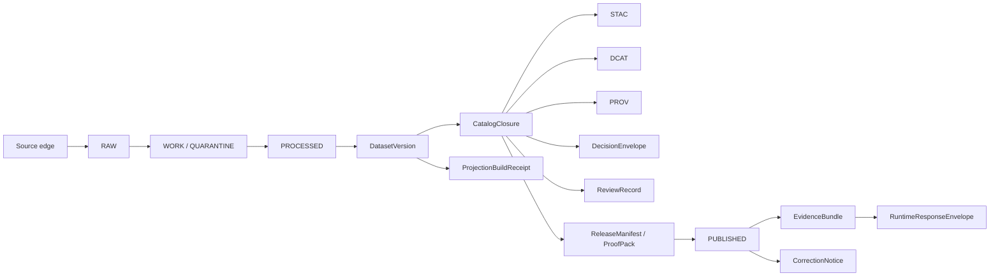

<!-- [KFM_META_BLOCK_V2]
doc_id: kfm://doc/NEEDS_VERIFICATION
title: KFM PROV Profile
type: standard
version: v1
status: draft
owners: NEEDS_VERIFICATION
created: YYYY-MM-DD
updated: YYYY-MM-DD
policy_label: NEEDS_VERIFICATION
related: [NEEDS_VERIFICATION: companion STAC profile doc, NEEDS_VERIFICATION: companion DCAT profile doc, NEEDS_VERIFICATION: CatalogClosure schema, NEEDS VERIFICATION: DatasetVersion schema, NEEDS_VERIFICATION: ReleaseManifest schema, NEEDS_VERIFICATION: EvidenceBundle schema]
tags: [kfm, provenance, prov-o, standards]
notes: [Grounded in the attached March-April 2026 KFM corpus and the uploaded baseline draft; target repo path, doc_id, owners, dates, policy label, neighboring standards paths, and mounted schema filenames still require verification.]
[/KFM_META_BLOCK_V2] -->

# KFM PROV Profile

A KFM-specific provenance profile for outward lineage, release traceability, and evidence-linked publication.

*Use this file as a publication-profile standard, not as evidence that mounted PROV emitters, schemas, or repo paths have already been verified in the current workspace.*

**Quick jump:** [Purpose](#1-purpose) · [Scope](#2-scope) · [Architecture position](#4-position-in-kfm-architecture) · [Contract crosswalk](#11-crosswalk-to-kfm-contract-families) · [STAC / DCAT relationship](#12-relationship-to-stac-and-dcat) · [Validation checklist](#17-validation-checklist) · [Open verification items](#21-open-verification-items)

| Signal | Value |
|---|---|
| **Document role** | Standard |
| **Current posture** | **CONFIRMED** doctrine · **PROPOSED** profile details |
| **Primary semantic base** | W3C PROV-O |
| **Closure role** | Companion lineage member beside STAC and DCAT inside `CatalogClosure` |
| **Mounted repo state** | **NEEDS VERIFICATION** |
| **Intended readers** | Data, platform, catalog, policy, review, and delivery maintainers |

## At a glance

- **PROV in KFM is outward lineage vocabulary, not sovereign system truth.**
- **`CatalogClosure` is the closure seam that carries the STAC / DCAT / PROV triplet together.**
- **KFM governance artifacts remain first-class and must not be flattened into generic provenance triples.**
- **Publication is fail-closed:** unresolved rights, sensitivity, evidence, or closure gaps block outward release.
- **This file defines a profile shape, not a claim that mounted schemas or emitters already exist.**

---

## 1. Purpose

This standard defines how **Kansas Frontier Matrix (KFM)** should use **PROV-O** as its outward provenance and lineage vocabulary for released datasets, release-bearing artifacts, and publication-safe derivatives.

It exists to make three things explicit:

1. what **PROV must express** in KFM,
2. how **PROV relates to STAC and DCAT** inside KFM’s outward catalog closure, and
3. what **KFM-specific governance objects** must remain visible beside generic provenance relations.

> [!IMPORTANT]
> In KFM, provenance is not a decorative appendix. It is part of governed publication, correction lineage, and evidence inspectability.

## 2. Scope

### 2.1 Applies to

This profile applies to **released or release-bearing provenance surfaces** associated with:

- `DatasetVersion`
- `CatalogClosure`
- `ReleaseManifest` / `ReleaseProofPack`
- `ProjectionBuildReceipt`
- `EvidenceBundle`
- `CorrectionNotice`

### 2.2 Does not replace

This profile does **not** replace:

- policy decisions,
- review decisions,
- runtime answer envelopes,
- source admission contracts,
- release approval artifacts,
- rights / sensitivity controls.

Those remain separate KFM truth and control-plane objects.

## 3. Truth posture for this file

| Label | How it is used here |
|---|---|
| **CONFIRMED** | Directly supported by the attached March-April 2026 KFM corpus. |
| **INFERRED** | Structurally necessary completions strongly implied by repeated corpus patterns. |
| **PROPOSED** | Recommended profile choices that fit KFM doctrine but are not proven as mounted implementation. |
| **UNKNOWN** | Anything not verified from the current-session mounted workspace. |
| **NEEDS VERIFICATION** | Placeholder repo metadata, file paths, owners, dates, policy labels, or schema locations that should be corrected against the actual repository. |

## 4. Position in KFM architecture

KFM’s canonical governed path is:

```text
Source edge -> RAW -> WORK / QUARANTINE -> PROCESSED -> CATALOG -> PUBLISHED
```

At the **CATALOG** stage, closure includes the outward **STAC / DCAT / PROV** triplet plus release-bearing references. That means this PROV profile belongs to the **publication-facing closure layer**, not to ad hoc notes or detached technical logs.


```mermaid
flowchart LR
    A[Source edge] --> B[RAW]
    B --> C[WORK / QUARANTINE]
    C --> D[PROCESSED]
    D --> E[DatasetVersion]
    E --> F[CatalogClosure]

    F --> G[STAC]
    F --> H[DCAT]
    F --> I[PROV]

    F --> J[DecisionEnvelope]
    F --> K[ReviewRecord]
    F --> L[ReleaseManifest / ProofPack]
    L --> M[PUBLISHED]

    E --> N[ProjectionBuildReceipt]
    M --> O[EvidenceBundle]
    O --> P[RuntimeResponseEnvelope]
    M --> Q[CorrectionNotice]
```

### 4.1 KFM rule

**PROV is one member of the closure set.** It must link coherently with:

- the release-bearing subject (`DatasetVersion`, derivative, or published artifact),
- the catalog closure,
- the relevant release object,
- the KFM audit / correction chain where applicable.

> [!NOTE]
> `CatalogClosure` is the outward seam where discovery and lineage travel together. Decision, review, release, runtime, and correction objects remain adjacent first-class artifacts rather than being absorbed into PROV.

## 5. Normative standards basis

The attached KFM corpus treats the following standards/profile surfaces as current and relevant to machine-validatable contract files and outward discovery.

| Standard / profile | Role in this profile |
|---|---|
| **JSON Schema Draft 2020-12** | Validation family for JSON serializations and profile schemas |
| **PROV-O** | Provenance ontology for entities, activities, agents, and causal relations |
| **DCAT 3** | Outward dataset and distribution metadata |
| **STAC 1.1.0** | Spatiotemporal asset and scene/package discovery vocabulary |

> [!NOTE]
> The attached successor-edition corpus reports a version-sensitive official recheck for these standards. The standards basis is therefore stronger than a generic memory claim, but the exact mounted repo implementation state still remains **UNKNOWN**.

## 6. Design principles

### 6.1 PROV is subordinate to KFM doctrine

PROV must **support** KFM’s governed evidence system, not simplify it into generic graph prose.

### 6.2 Outward provenance must remain release-linked

A PROV bundle without release linkage is incomplete for KFM.

### 6.3 Governance artifacts stay first-class

`DecisionEnvelope`, `ReviewRecord`, `ReleaseManifest`, and `CorrectionNotice` must remain explicit KFM objects even when equivalent causal relations can be expressed in PROV terms.

### 6.4 Public-safe posture is mandatory

No outward provenance surface may expose restricted, exact-location, or otherwise unsafe detail that has not passed KFM publication controls.

### 6.5 Correction must preserve lineage

Supersession, withdrawal, generalization, and replacement must remain visible. Provenance must help preserve lineage, not erase it.

## 7. What PROV means in KFM

KFM uses PROV to describe:

- **Entities** — released artifacts, dataset versions, source captures, transformed derivatives, catalog resources
- **Activities** — fetch, ingest, normalize, validate, build, catalog, publish, correct
- **Agents** — source organizations, maintainers, review actors, software runners, governed services

### 7.1 KFM interpretation

| PROV concept | KFM interpretation |
|---|---|
| `prov:Entity` | A governed artifact or published / referenced subject in the truth path |
| `prov:Activity` | A named transformation or release-bearing process step |
| `prov:Agent` | A responsible organization, reviewer, service, or software actor |
| `prov:used` | Input relation from an activity to source / release-bearing entities |
| `prov:wasGeneratedBy` | Output relation from an entity to the activity that generated it |
| `prov:wasAssociatedWith` | Operational association between activity and actor / service |
| `prov:wasAttributedTo` | Accountability or authorship / ownership link for an entity |
| `prov:wasDerivedFrom` | Content or lineage derivation across entities |
| `prov:qualifiedAssociation` | Optional refinement where runner role or execution details matter |
| `prov:qualifiedGeneration` | Optional refinement where generation conditions matter |

## 8. Required profile outcomes

A KFM-conformant outward PROV surface **MUST** do all of the following:

1. identify the published or release-bearing subject unambiguously;
2. identify at least one generating or transforming activity;
3. identify at least one accountable agent;
4. link the PROV surface to the relevant KFM release / correction context;
5. preserve enough lineage for reconstruction and audit;
6. remain consistent with the matching STAC and DCAT closure;
7. remain public-safe for the target audience;
8. remain machine-checkable.

## 9. Minimum outward content

The table below defines the minimum profile content for a KFM outward PROV surface.

| Field family | Minimum requirement | Status |
|---|---|---|
| **profile_version** | KFM PROV profile version identifier | **PROPOSED** |
| **subject_id** | Stable identifier for the governed subject | **PROPOSED** |
| **subject_type** | Subject class such as dataset version, release artifact, projection artifact, or closure resource | **PROPOSED** |
| **release_ref** | Reference to the release-bearing object or release window | **INFERRED** |
| **audit_ref** | KFM audit linkage key | **INFERRED** |
| **entities** | At least one input or output entity with stable identifiers | **CONFIRMED** concept |
| **activities** | At least one named activity with time bounds | **CONFIRMED** concept |
| **agents** | At least one accountable human, organizational, or software agent | **CONFIRMED** concept |
| **core relations** | `used`, `wasGeneratedBy`, and one accountability relation | **PROPOSED** minimum set |
| **time bounds** | Start / end or equivalent generation timing | **PROPOSED** |
| **digest / integrity echo** | Checksum or digest linkage where the artifact model provides one | **PROPOSED** |
| **rights / sensitivity echo** | Public-safe state or relevant obligations echoed or linked | **INFERRED** |
| **correction linkage** | Supersession / replacement / withdrawal linkage where applicable | **INFERRED** |
| **serialization metadata** | Media type, schema / profile identifier, or linked context | **PROPOSED** |

## 10. Mandatory relation set

A KFM outward PROV representation **MUST** include enough structure to express:

- **an output**
- **the activity that produced it**
- **the agent responsible or associated**
- **the input(s) used**
- **release or correction linkage**

### 10.1 Minimum relation rule

For a normal released artifact, the minimum viable set is:

- one `prov:Entity` for the released subject,
- one `prov:Activity` for the generating / building / cataloging step,
- one `prov:Agent`,
- one `prov:wasGeneratedBy`,
- one `prov:used`,
- one of:
  - `prov:wasAssociatedWith`, or
  - `prov:wasAttributedTo`.

### 10.2 KFM extension rule

Where KFM needs more specificity, the profile **MAY** use refined relations such as:

- `prov:qualifiedAssociation`
- `prov:qualifiedGeneration`
- `prov:wasDerivedFrom`

These refinements are useful, but they are not a substitute for the release, audit, and policy objects KFM keeps outside generic PROV.

## 11. Crosswalk to KFM contract families

This is the highest-value repo-facing bridge in the profile.

| KFM contract family | PROV profile role | Rule |
|---|---|---|
| `SourceDescriptor` | Source identity / provenance input context | Linkable input authority description; not replaced by PROV |
| `IngestReceipt` | Evidence that a fetch / landing event occurred | Should be representable as or referenced by an activity record |
| `ValidationReport` | Validation outcome for candidate material | Reference or attach as validation-side evidence; do not flatten severity / reason grammar into generic triples only |
| `DatasetVersion` | Primary released or candidate entity | Core `prov:Entity` subject in most cases |
| `CatalogClosure` | Outward closure object | Must carry or resolve STAC / DCAT / PROV together |
| `DecisionEnvelope` | Policy decision control-plane artifact | Must remain first-class; linkable but not absorbed |
| `ReviewRecord` | Human review / approval artifact | Must remain first-class; linkable but not absorbed |
| `ReleaseManifest` / `ReleaseProofPack` | Release-bearing publication object | Must be linked from outward provenance |
| `ProjectionBuildReceipt` | Derived build activity and result | Natural fit for activity + derivative entity linkage |
| `EvidenceBundle` | Request-time support package | May link to PROV, but is broader than PROV |
| `RuntimeResponseEnvelope` | Runtime outcome object | Not a substitute for dataset / release provenance |
| `CorrectionNotice` | Correction lineage object | Must remain visible and linkable in correction chains |

> [!IMPORTANT]
> KFM is strongest when `CatalogClosure` carries **STAC / DCAT / PROV** together and when release, review, decision, runtime, and correction artifacts remain explicit alongside that closure.

## 12. Relationship to STAC and DCAT

### 12.1 Do not force the three to compete

KFM is strongest when:

- **STAC** describes spatiotemporal assets and scenes,
- **DCAT** describes outward datasets and distributions,
- **PROV** expresses lineage, activities, and agents,
- and **KFM-specific governance artifacts** stay alongside them.

### 12.2 Closure rules

| Closure member | Primary job | KFM expectation |
|---|---|---|
| **STAC** | Asset / item / collection discovery | Present when spatiotemporal items or assets are the right carrier |
| **DCAT** | Dataset / distribution discovery | Present for outward catalog and distribution description |
| **PROV** | Lineage / activities / agents | Present or resolvable for released artifacts and closures |
| **KFM governance objects** | Policy, review, release, correction | Must remain first-class |

### 12.3 Linkage expectations

- A STAC resource **SHOULD** link to provenance-bearing context where relevant.
- A DCAT dataset or distribution **SHOULD** expose provenance linkage through the closure.
- The PROV bundle **MUST** be consistent with the released identifiers and distribution references used elsewhere in closure.

## 13. Serialization guidance

### 13.1 Semantic norm

The semantic authority is **PROV-O**.

### 13.2 Outward serialization stance

The attached KFM corpus confirms **PROV-O** as the ontology basis, but does not prove one mounted serialization format in the repo. Therefore:

- **JSON-LD** is the **PROPOSED outward-preferred serialization** for linked catalog interoperability.
- **PROV-JSON** or equivalent JSON representations are **PROPOSED acceptable internal or tooling serializations** where needed.
- Additional serializations may be used if they remain semantically equivalent and machine-checkable.

### 13.3 Validation stance

Where JSON-based serializations are emitted, schema validation **SHOULD** use the project’s JSON Schema profile family based on **Draft 2020-12**.

## 14. Minimum KFM PROV object model

The following object classes are recommended for a first-wave profile.

| Object | Meaning | KFM note |
|---|---|---|
| `source_capture` | Raw or landed source artifact | Usually tied to ingest or fetch activities |
| `dataset_version` | Canonical subject set at a governed version | High-value core entity |
| `catalog_closure` | Outward closure resource set | Links STAC / DCAT / PROV together |
| `release_artifact` | Published or promoted artifact | Links to release proof and audit |
| `projection_artifact` | Derived output built from promoted scope | Must never outrun release scope |
| `correction_artifact` | Replacement / supersession / withdrawal object | Preserves lineage |

## 15. Public-safe and fail-closed rules

A KFM PROV surface **MUST NOT** be published when any of the following are unresolved:

- missing or non-resolvable evidence,
- unknown rights or redistribution posture,
- unresolved sensitivity or exact-location risk,
- schema / identity / unit / support failure,
- catalog closure or review artifact failure,
- broken release linkage,
- broken correction linkage where correction is required.

### 15.1 Public-safe echo

Where a PROV surface is outward-facing, it should either:

- include a public-safe summary of rights / sensitivity state, or
- link to the governing release or policy object that carries that state.

## 16. Correction and supersession rules

When a released subject is corrected, generalized, withdrawn, or replaced:

- provenance **must not** imply silent replacement,
- the correction chain **must** remain inspectable,
- affected release references **must** remain resolvable,
- outward STAC / DCAT / PROV closure **must** be updated coherently.

## 17. Validation checklist

Use this checklist before treating a PROV surface as KFM-conformant.

### 17.1 Required checks

- [ ] Subject identifier is stable and resolvable in project context
- [ ] At least one entity, one activity, and one agent are present
- [ ] Minimum relation set is present
- [ ] Time bounds are present where applicable
- [ ] Release linkage is present
- [ ] Audit linkage is present or resolvable
- [ ] STAC / DCAT closure references are coherent
- [ ] Rights / sensitivity state is public-safe or safely linked
- [ ] Correction linkage is present when needed
- [ ] JSON serialization validates against the chosen profile schema
- [ ] Identifiers and checksums match the release-bearing subject
- [ ] No unpublished or unreleased scope leaks into outward provenance

### 17.2 Runtime caution

This standard is for **publication and lineage** surfaces. Runtime explainability may link to PROV, but runtime trust still depends on `EvidenceBundle` and `RuntimeResponseEnvelope`, not on PROV alone.

## 18. Illustrative example

> [!NOTE]
> The example below is **PROPOSED**. It is illustrative only and is **not** a confirmed mounted repo fixture or confirmed emitted serialization.

<details>
<summary>Expand illustrative JSON example</summary>

```json
{
  "@context": {
    "prov": "http://www.w3.org/ns/prov#",
    "kfm": "https://kfm.example/ns#"
  },
  "profile_version": "kfm-prov-profile/v1",
  "subject_id": "kfm:dataset-version:hydrology:nwis:2026-03-14",
  "subject_type": "dataset_version",
  "release_ref": "kfm:release:hydrology:2026-03-14",
  "audit_ref": "audit_01HXYZNEEDSVERIFICATION",
  "closure_refs": {
    "stac_ref": "kfm:stac:hydrology:nwis:2026-03-14",
    "dcat_ref": "kfm:dcat:hydrology:nwis:2026-03-14"
  },
  "integrity_echo": {
    "sha256": "NEEDS_VERIFICATION"
  },
  "entity": {
    "kfm:source:nwis:station-feed": {
      "prov:type": "kfm:SourceCapture",
      "prov:label": "USGS NWIS source capture"
    },
    "kfm:dataset-version:hydrology:nwis:2026-03-14": {
      "prov:type": "kfm:DatasetVersion",
      "prov:label": "Hydrology dataset version"
    },
    "kfm:catalog-closure:hydrology:2026-03-14": {
      "prov:type": "kfm:CatalogClosure",
      "prov:label": "Hydrology closure set"
    }
  },
  "activity": {
    "kfm:activity:normalize-validate-catalog:2026-03-14T12:00:00Z": {
      "prov:type": "kfm:CanonicalBuildActivity",
      "prov:startTime": "2026-03-14T12:00:00Z",
      "prov:endTime": "2026-03-14T12:07:00Z"
    }
  },
  "agent": {
    "kfm:agent:governed-build-runner": {
      "prov:type": "prov:SoftwareAgent",
      "prov:label": "KFM governed build runner"
    }
  },
  "prov:used": {
    "_u1": {
      "prov:activity": "kfm:activity:normalize-validate-catalog:2026-03-14T12:00:00Z",
      "prov:entity": "kfm:source:nwis:station-feed"
    }
  },
  "prov:wasGeneratedBy": {
    "_g1": {
      "prov:entity": "kfm:dataset-version:hydrology:nwis:2026-03-14",
      "prov:activity": "kfm:activity:normalize-validate-catalog:2026-03-14T12:00:00Z"
    },
    "_g2": {
      "prov:entity": "kfm:catalog-closure:hydrology:2026-03-14",
      "prov:activity": "kfm:activity:normalize-validate-catalog:2026-03-14T12:00:00Z"
    }
  },
  "prov:wasAssociatedWith": {
    "_a1": {
      "prov:activity": "kfm:activity:normalize-validate-catalog:2026-03-14T12:00:00Z",
      "prov:agent": "kfm:agent:governed-build-runner"
    }
  }
}
```

</details>

## 19. Recommended profile decisions

These are recommended because they fit the corpus, but they remain **PROPOSED** until verified in mounted implementation.

| Decision | Recommendation |
|---|---|
| Serialization | Prefer JSON-LD for outward profile artifacts |
| Validation | Validate JSON serializations with JSON Schema Draft 2020-12 |
| Linking | Require release and audit linkage on outward PROV surfaces |
| Integrity | Echo digests or checksums where release artifacts already carry them |
| Closure | Require STAC / DCAT / PROV coherence checks in release validation |
| Correction | Require explicit replacement or supersession linkage |

## 20. What this file deliberately does not do

This profile does **not**:

- declare that the repository already contains mounted PROV schemas,
- assert exact emitter filenames or directories as fact,
- replace KFM policy / review / release artifacts with generic provenance triples,
- define every possible lineage event shape,
- turn runtime explanation into a provenance-only problem.

## 21. Open verification items

The following items should be checked directly against the mounted repository before this draft is promoted.

- [ ] Confirm the target repo path for this file
- [ ] Confirm the actual `doc_id`
- [ ] Confirm owners
- [ ] Confirm created and updated dates
- [ ] Confirm the policy label
- [ ] Confirm neighboring standards docs
- [ ] Confirm actual schema filenames and locations
- [ ] Confirm actual serialization choice(s) in code or fixtures
- [ ] Confirm existing STAC and DCAT profile docs and cross-links
- [ ] Confirm existing release proof or catalog emitter implementation
- [ ] Confirm existing tests for closure integrity
- [ ] Confirm whether a repo-wide profile version token already exists for provenance docs

---

## Appendix A — Minimal field summary

<details>
<summary>Expand compact reference</summary>

| Area | Minimum |
|---|---|
| Subject | Stable ID, subject class |
| Lineage core | Entity, Activity, Agent |
| Core relations | `used`, `wasGeneratedBy`, accountability relation |
| Time | Start / end or generation timing |
| KFM linkage | `release_ref`, `audit_ref` |
| Closure linkage | STAC / DCAT / PROV coherence |
| Safety | Public-safe rights / sensitivity posture |
| Correction | Replacement / supersession / withdrawal linkage where needed |
| Validation | Machine-checkable serialization |

</details>

## Appendix B — Maintainer note

When implementation evidence becomes available, prefer updating this file by replacing **PROPOSED** placeholders with:

- verified schema paths,
- verified serialization examples,
- verified fixture names,
- verified contract references,
- verified companion docs.

Do **not** weaken the truth posture by upgrading placeholders to fact without mounted evidence.

[Back to top](#kfm-prov-profile)
