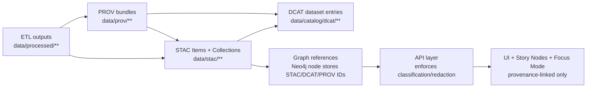

# 🛰️ KFM STAC Profile (v13)


> [!IMPORTANT]
> KFM treats **STAC** as a **contract artifact** (machine-validated boundary output) and as part of the “publish gate”:
> **ETL → Catalogs (STAC/DCAT/PROV) → Graph → API → UI → Story Nodes → Focus Mode**.  
> No downstream stage should depend on a dataset until the dataset’s STAC/DCAT/PROV artifacts exist and validate.

---

## 🎯 Purpose

This document defines **the Kansas Frontier Matrix (KFM) STAC profile**: the minimum required structure, naming, and KFM-specific fields for:

- ✅ STAC **Collections** (dataset-level description + spatial/temporal extents)
- ✅ STAC **Items** (granule-level or artifact-level description + assets)
- ✅ **Cross-links** to DCAT and PROV (“boundary artifacts”)
- ✅ **Governance fields** (classification/access + uncertainty/provenance hooks)

This is a **project standard** for all KFM domains: historical, environmental, infrastructure, simulations, AI outputs, and “evidence artifacts”.

---

## 🧠 Normative language

The keywords **MUST**, **SHOULD**, and **MAY** are used as in RFC 2119.

---

## 🧩 Scope and non-goals

### In scope ✅
- Static-on-disk STAC layout under `data/stac/`
- Required fields for Collections and Items
- KFM custom metadata namespace (`kfm:`) for:
  - provenance references
  - uncertainty indicators
  - access/classification propagation
  - dataset identifiers and stable linking

### Out of scope ❌
- Full STAC API implementation details (search endpoints, paging, auth)
- Domain-specific ETL recipes (these belong in `docs/data/<domain>/README.md`)
- Ontology/graph schema (covered in architecture docs)

---

## 🧷 Baseline compatibility

- **STAC baseline:** `stac_version: "1.0.0"` (minimum contract baseline for KFM v13)
- **GeoJSON baseline:** Items MUST be valid GeoJSON Features
- **CRS baseline:** KFM normalizes published spatial outputs to **WGS84 (EPSG:4326)** for consistency.  
  - Original CRS SHOULD be retained in provenance and/or `proj:*` metadata when relevant.

> [!NOTE]
> “Baseline” means: KFM pipelines and validators assume STAC 1.0.0 semantics. If a domain needs a newer STAC version, it MUST be proposed as a contract change and versioned like any other contract.

---

## 📁 Canonical on-disk layout (v13)

KFM uses **static STAC JSON** checked into the repo (or published as release assets), colocated with KFM’s canonical lifecycle directories.

```text
📦 repo-root/
├─ 📁 data/
│  ├─ 📁 raw/                      # ingest-only inputs
│  ├─ 📁 work/                     # intermediate transforms
│  ├─ 📁 processed/                # publish-grade outputs (assets referenced by STAC)
│  ├─ 📁 prov/                     # PROV bundles for datasets & artifacts
│  ├─ 📁 catalog/
│  │  └─ 📁 dcat/                  # DCAT dataset/distribution records (JSON-LD)
│  └─ 📁 stac/
│     ├─ 📄 catalog.json           # root STAC Catalog (KFM)
│     ├─ 📁 collections/
│     │  └─ 📁 <collection_id>/
│     │     └─ 📄 collection.json
│     └─ 📁 items/
│        └─ 📁 <collection_id>/
│           └─ 📄 <item_id>.json
└─ 📁 docs/
   └─ 📁 standards/
      └─ 📄 KFM_STAC_PROFILE.md    # (this file)
```

### Path rules
- `data/stac/catalog.json` MUST exist and be the STAC root for the repository.
- Collections MUST live under `data/stac/collections/<collection_id>/collection.json`
- Items MUST live under `data/stac/items/<collection_id>/<item_id>.json`
- Asset `href`s MUST resolve to either:
  - a stable file under `data/processed/**`, **or**
  - a stable public endpoint (CDN, object store, API) intended for consumption.

---

## 🆔 IDs, naming, and determinism

KFM uses dataset IDs that are:
- human-readable
- stable across the graph + API + story layers
- version-explicit
- compatible with filenames and URLs

### Dataset/Collection ID format (required)

**Collection `id` MUST follow:**
```text
kfm.<region>.<theme>.<year_range>.v<version>
```

Examples:
- `kfm.ks.landcover.2000_2020.v1`
- `kfm.ks.surficial_geology.1900_2020.v2`
- `kfm.ks.air_quality.1990_2025.v3`

> [!TIP]
> Keep `<theme>` lowercase snake_case. Avoid spaces. Avoid punctuation beyond `_` and `.`.

### Item ID format (required)

**Item `id` MUST be globally unique and SHOULD be derived from the collection id:**
```text
<collection_id>.<granule_or_artifact>
```

Examples:
- `kfm.ks.landcover.2000_2020.v1.2010`
- `kfm.ks.air_quality.1990_2025.v3.epa_aqs_daily_2024-06-01`
- `kfm.ks.historic_maps.1850_1950.v1.khs_railroad_atlas_sheet-12`

### Versioning rules
- Dataset version MUST be encoded as `.vN` in the Collection `id`.
- When a dataset is reprocessed or updated, publish a **new Collection** (new `.vN`) and link it (see **Revision & lineage**).
- Do **not** mutate published STAC records in place unless it is a **non-semantic fix** (typo, broken link) and the fix is recorded.

---

## 🧱 STAC objects and required fields

### 1) Root Catalog (`data/stac/catalog.json`) ✅

Root catalog MUST:
- have `"type": "Catalog"`
- include `id`, `description`, `stac_version`
- link to Collections via `links[]` with `rel: "child"`

Minimal example:

```json
{
  "stac_version": "1.0.0",
  "type": "Catalog",
  "id": "kfm-root",
  "description": "Kansas Frontier Matrix — STAC root catalog",
  "links": [
    { "rel": "self", "href": "./catalog.json", "type": "application/json" },
    { "rel": "child", "href": "./collections/kfm.ks.landcover.2000_2020.v1/collection.json", "type": "application/json" }
  ]
}
```

---

### 2) Collection profile ✅

A KFM STAC Collection MUST include:

| Field | Required | Notes |
|---|---:|---|
| `type` | ✅ | MUST be `"Collection"` |
| `stac_version` | ✅ | MUST be `"1.0.0"` (baseline) |
| `id` | ✅ | MUST follow KFM ID rules |
| `description` | ✅ | Plain-language description |
| `license` | ✅ | SPDX identifier where possible; otherwise `"proprietary"` with rationale in metadata |
| `extent.spatial.bbox` | ✅ | WGS84 bbox; use `[[minLon,minLat,maxLon,maxLat]]` |
| `extent.temporal.interval` | ✅ | ISO-8601 times; `[[start,end]]`; `null` permitted for open-ended |
| `links` | ✅ | MUST include `self` and `root` |
| `title` | 🔶 SHOULD | Display name |
| `keywords` | 🔶 SHOULD | Tags for discovery |
| `providers` | 🔶 SHOULD | Producer/processor/host roles |
| `summaries` | 🔷 MAY | Useful for filtering and UI facets |
| `stac_extensions` | 🔷 MAY | Use when adding extension properties |

#### KFM-required Collection extras (`kfm:` namespace)
Collections MUST include:
- `kfm:access_level`
- `kfm:theme`
- `kfm:region`
- `kfm:dataset_version`
- `kfm:lineage` (high-level pointers to PROV/DCAT)

---

### 3) Item profile ✅

A KFM STAC Item MUST include:

| Field | Required | Notes |
|---|---:|---|
| `type` | ✅ | MUST be `"Feature"` |
| `stac_version` | ✅ | MUST be `"1.0.0"` (baseline) |
| `id` | ✅ | MUST follow KFM Item ID rules |
| `collection` | ✅ | MUST match Collection `id` |
| `geometry` | ✅ | GeoJSON geometry OR `null` if non-spatial |
| `bbox` | ✅ | bbox array OR `null` if non-spatial |
| `properties` | ✅ | MUST include temporal fields |
| `links` | ✅ | MUST include `self`, `root`, `parent`, `collection` |
| `assets` | ✅ | MUST include at least one publishable asset (see Assets rules) |
| `stac_extensions` | 🔷 MAY | Include when using extension properties |

#### Temporal rules (required)
Items MUST include one of:
- `properties.datetime` (instant), OR
- `properties.start_datetime` + `properties.end_datetime` (interval)

All datetimes MUST be ISO-8601; prefer UTC `Z`.

#### Spatial rules (required)
- If spatial: `geometry` and `bbox` MUST be in WGS84 lon/lat ordering.
- If non-spatial: set `geometry: null`, `bbox: null`, and include an explanatory note in `kfm:spatial`.

#### KFM-required Item extras (`kfm:` namespace)
Items MUST include:
- `kfm:access_level`
- `kfm:theme`
- `kfm:region`
- `kfm:dataset_id` (same as `collection`)
- `kfm:lineage` (PROV/DCAT pointers)
- `kfm:uncertainty` (at minimum a structured declaration — see below)

---

## 🧾 Assets: roles, keys, and conventions

### Asset minimum (required)
Every Item MUST have at least one asset with:
- `roles` containing `"data"`, and
- `href` pointing to `data/processed/**` or stable external storage.

### Recommended asset keys (convention)
KFM uses predictable asset keys so clients can reliably render:

| Asset key | Typical role(s) | Use |
|---|---|---|
| `data` | `["data"]` | Primary distribution (GeoJSON/GeoParquet/COG/CSV/etc.) |
| `tiles` | `["tiles"]` | Vector/raster tiles endpoint or tile archive (PMTiles/3D Tiles) |
| `thumbnail` | `["thumbnail"]` | Small preview |
| `overview` | `["overview"]` | Readable overview image (PNG/JPG) |
| `metadata` | `["metadata"]` | Data dictionary, schema, README, processing notes |
| `provenance` | `["provenance"]` | PROV bundle (JSON-LD) |
| `license` | `["license"]` | License text file if needed |
| `documentation` | `["documentation"]` | Domain module docs, notebooks, methodology |

> [!IMPORTANT]
> KFM policy: **assets MUST be attributable**. If a dataset has complex attribution requirements, the STAC record MUST carry the attribution text either in `kfm:attribution` or via a `metadata` asset.

### Recommended media types (best-effort)
KFM SHOULD use appropriate `type` values on assets:

| Format | Recommended `type` |
|---|---|
| GeoJSON | `application/geo+json` |
| JSON / JSON-LD | `application/json` / `application/ld+json` |
| CSV | `text/csv` |
| GeoTIFF / COG | `image/tiff` |
| Parquet / GeoParquet | `application/octet-stream` (or a more specific Parquet type if consistently supported in the stack) |
| PMTiles | `application/octet-stream` |
| PNG / JPG | `image/png` / `image/jpeg` |
| PDF | `application/pdf` |

> [!NOTE]
> MIME types vary across tooling for some geospatial formats. KFM prioritizes **consistency** and **consumer compatibility** over “perfect” MIME strings.

---

## 🧬 KFM custom namespace (`kfm:`) — required extension fields

KFM adds project-specific fields using the `kfm:` prefix.

### Where `kfm:` fields live
- Collections: top-level `kfm:*` fields are allowed (and required by this profile).
- Items: `kfm:*` fields MAY be top-level, but **SHOULD live under `properties`** unless they describe the whole Item object.

> [!TIP]
> Prefer Item custom fields under `properties` so STAC tooling and item property filtering remains consistent.

---

### Required `kfm:` fields (Collection)

| Field | Type | Required | Meaning |
|---|---|---:|---|
| `kfm:region` | string | ✅ | Region code (e.g., `ks`) |
| `kfm:theme` | string \| string[] | ✅ | Theme/category (e.g., `air_quality`, `treaties`) |
| `kfm:access_level` | string | ✅ | `public` \| `internal` \| `confidential` \| `restricted` |
| `kfm:dataset_version` | integer | ✅ | Version number from `.vN` |
| `kfm:lineage` | object | ✅ | Pointers to DCAT + PROV |

---

### Required `kfm:` fields (Item)

| Field | Type | Required | Meaning |
|---|---|---:|---|
| `kfm:dataset_id` | string | ✅ | Must match `collection` |
| `kfm:region` | string | ✅ | Region code |
| `kfm:theme` | string \| string[] | ✅ | Theme/category |
| `kfm:access_level` | string | ✅ | Classification for propagation |
| `kfm:lineage` | object | ✅ | PROV/DCAT pointers + run identifiers |
| `kfm:uncertainty` | object | ✅ | Structured uncertainty/confidence declaration |

---

### `kfm:access_level` semantics 🔒

Allowed values:
- `public`
- `internal`
- `confidential`
- `restricted`

**Propagation rule (required):**
- Outputs MUST NOT be less restrictive than inputs.
- If an input is `restricted`, all derived outputs MUST be `restricted` unless explicitly reviewed and redacted.

Recommended additional fields:
- `kfm:redaction_applied`: boolean
- `kfm:redaction_summary`: string
- `kfm:sovereignty_notes`: string (CARE/sovereignty considerations where applicable)

---

### `kfm:lineage` (required)

`kfm:lineage` provides explicit linking across the “boundary artifacts”:

**Minimum structure:**
```json
{
  "prov": { "href": "../../prov/<prov_id>.jsonld", "id": "<prov_id>" },
  "dcat": { "href": "../../catalog/dcat/<dcat_id>.jsonld", "id": "<dcat_id>" },
  "run": {
    "run_id": "<pipeline-run-id>",
    "code_ref": "<git-commit-or-tag>",
    "config_ref": "<config-path-or-hash>"
  }
}
```

Rules:
- `prov.href` MUST resolve to a PROV bundle under `data/prov/` (or stable external URI).
- `dcat.href` MUST resolve to a DCAT entry under `data/catalog/dcat/` (or stable external URI).
- `run.run_id` and at least one of `code_ref` / `config_ref` SHOULD be present for deterministic reproduction.

---

### `kfm:uncertainty` (required)

KFM requires uncertainty to be explicit — especially for:
- modeled outputs
- interpolations
- classifications
- OCR/NLP extractions
- AI-generated layers (“evidence artifacts”)

**Minimum structure:**
```json
{
  "kind": "measurement|model|classification|extraction|aggregation|unknown",
  "statement": "Plain-language summary of uncertainty and known limitations.",
  "confidence": 0.0,
  "method": "How confidence/uncertainty was derived (metric, rubric, QA checks).",
  "bounds": {
    "type": "interval|stddev|credible_interval|none|unknown",
    "value": null,
    "units": null,
    "level": null
  }
}
```

Rules:
- `confidence` MUST be in `[0.0, 1.0]` when present.
- If confidence is not quantifiable, set `confidence: null` and provide a clear `statement`.

> [!WARNING]
> “Unknown” uncertainty is acceptable only as a temporary state. If `kfm:uncertainty.kind="unknown"`, the Item SHOULD include a `metadata` asset with a QA plan or open issue reference.

---

## 🔗 Cross-layer linkage (STAC ↔ DCAT ↔ PROV ↔ Graph)

KFM requires cross-references to keep catalogs and the knowledge system in sync:

- **STAC → Data assets**: Items point to published files/endpoints.
- **STAC → PROV**: Items/Collections link to PROV bundles capturing lineage.
- **STAC → DCAT**: Items/Collections link to dataset discovery records.
- **Graph → Catalog references**: graph nodes store IDs/URIs to catalog entries (not bulky payloads).
- **Story Nodes / Focus Mode**: narrative content MUST cite cataloged assets.

### Recommended link relations
KFM uses standard STAC link rels where possible, and adds a small set of project rels where helpful:

| `rel` | Use |
|---|---|
| `root`, `self`, `parent`, `child`, `collection` | Standard STAC navigation |
| `via` | Link to DCAT record or upstream portal |
| `describedby` | Link to docs/methodology |
| `license` | Link to license text if needed |
| `kfm:provenance` (custom) | Link to PROV bundle if you prefer a direct link relation |

> [!NOTE]
> Custom `rel` values are permitted, but keep them minimal and stable.

### Mermaid overview 🧭


---

## ♻️ Revision & lineage rules (dataset evolution)

When producing a new dataset version (`.vN+1`):

1. Publish a new Collection (`id` changes because `.vN` changes).
2. Link to predecessor:
   - DCAT SHOULD include `prov:wasRevisionOf` (or equivalent DCAT/PROV linkage).
   - PROV SHOULD encode the derivation chain (old entities → activities → new entities).
3. STAC SHOULD include at least one of:
   - `kfm:lineage.revision_of` (string id), or
   - a link with `rel: "via"` / `rel: "derived_from"` (if your toolchain supports it consistently), or
   - an explicit mention in `description` plus PROV link (minimum fallback).

Recommended:
- Include a persistent identifier field if minted (DOI/ARK):
  - `kfm:pid`: `"doi:10.xxxx/xxxxx"` or `"ark:/xxxxx/xxxxx"`

---

## ✅ Validation gates (CI expectations)

A dataset is “publishable” only if:

- [ ] The STAC Collection validates against STAC + this profile
- [ ] The STAC Items validate against STAC + this profile
- [ ] All `href` targets resolve (or are intentionally external and reachable)
- [ ] A DCAT record exists and links back to STAC and/or distributions
- [ ] A PROV bundle exists capturing inputs → work → outputs and run identifiers
- [ ] Access level tags are set and propagated
- [ ] Uncertainty is declared (`kfm:uncertainty`) for Items

> [!TIP]
> Prefer failing fast: it’s better to reject incomplete catalog artifacts than to allow “ghost datasets” into graph/UI layers.

---

## 🧪 Examples

### Example A — Collection (surficial geology, dual distribution: GeoParquet + PMTiles)

```json
{
  "stac_version": "1.0.0",
  "type": "Collection",
  "id": "kfm.ks.surficial_geology.1900_2020.v1",
  "title": "Kansas Surficial Geology (1900–2020)",
  "description": "Surficial geology compilation for Kansas with generalized units and cartographic tiles for visualization.",
  "license": "CC-BY-4.0",
  "extent": {
    "spatial": { "bbox": [[-102.051, 36.993, -94.588, 40.003]] },
    "temporal": { "interval": [["1900-01-01T00:00:00Z", "2020-12-31T23:59:59Z"]] }
  },
  "keywords": ["geology", "surficial", "kansas", "tiles", "geoparquet"],
  "providers": [
    { "name": "Kansas Frontier Matrix", "roles": ["processor", "host"] }
  ],
  "links": [
    { "rel": "root", "href": "../../catalog.json", "type": "application/json" },
    { "rel": "self", "href": "./collection.json", "type": "application/json" }
  ],
  "kfm:region": "ks",
  "kfm:theme": "surficial_geology",
  "kfm:access_level": "public",
  "kfm:dataset_version": 1,
  "kfm:lineage": {
    "prov": { "href": "../../../prov/kfm.ks.surficial_geology.1900_2020.v1.jsonld", "id": "kfm.ks.surficial_geology.1900_2020.v1" },
    "dcat": { "href": "../../../catalog/dcat/kfm.ks.surficial_geology.1900_2020.v1.jsonld", "id": "kfm.ks.surficial_geology.1900_2020.v1" },
    "run": {
      "run_id": "etl-2026-01-01T12:34:56Z",
      "code_ref": "git:abcd1234",
      "config_ref": "pipelines/geology/surficial_geology.yaml"
    }
  }
}
```

---

### Example B — Item (statewide artifact + assets)

```json
{
  "stac_version": "1.0.0",
  "type": "Feature",
  "id": "kfm.ks.surficial_geology.1900_2020.v1.statewide",
  "collection": "kfm.ks.surficial_geology.1900_2020.v1",
  "geometry": {
    "type": "Polygon",
    "coordinates": [[[ -102.051,36.993 ],[ -94.588,36.993 ],[ -94.588,40.003 ],[ -102.051,40.003 ],[ -102.051,36.993 ]]]
  },
  "bbox": [-102.051, 36.993, -94.588, 40.003],
  "properties": {
    "datetime": "2026-01-01T00:00:00Z",
    "kfm:dataset_id": "kfm.ks.surficial_geology.1900_2020.v1",
    "kfm:region": "ks",
    "kfm:theme": "surficial_geology",
    "kfm:access_level": "public",
    "kfm:lineage": {
      "prov": { "href": "../../../prov/kfm.ks.surficial_geology.1900_2020.v1.jsonld", "id": "kfm.ks.surficial_geology.1900_2020.v1" },
      "dcat": { "href": "../../../catalog/dcat/kfm.ks.surficial_geology.1900_2020.v1.jsonld", "id": "kfm.ks.surficial_geology.1900_2020.v1" },
      "run": {
        "run_id": "etl-2026-01-01T12:34:56Z",
        "code_ref": "git:abcd1234",
        "config_ref": "pipelines/geology/surficial_geology.yaml"
      }
    },
    "kfm:uncertainty": {
      "kind": "aggregation",
      "statement": "Units are generalized from multiple sources; boundaries may be simplified for statewide consistency.",
      "confidence": 0.85,
      "method": "Expert review + topology validation + source agreement scoring.",
      "bounds": { "type": "none", "value": null, "units": null, "level": null }
    }
  },
  "links": [
    { "rel": "root", "href": "../../catalog.json", "type": "application/json" },
    { "rel": "parent", "href": "../../collections/kfm.ks.surficial_geology.1900_2020.v1/collection.json", "type": "application/json" },
    { "rel": "collection", "href": "../../collections/kfm.ks.surficial_geology.1900_2020.v1/collection.json", "type": "application/json" },
    { "rel": "self", "href": "./kfm.ks.surficial_geology.1900_2020.v1.statewide.json", "type": "application/json" },
    { "rel": "via", "href": "../../../catalog/dcat/kfm.ks.surficial_geology.1900_2020.v1.jsonld", "type": "application/ld+json" }
  ],
  "assets": {
    "data": {
      "href": "../../../processed/geology/surficial_geology/v1/surficial_geology_ks.geoparquet",
      "type": "application/octet-stream",
      "roles": ["data"],
      "title": "GeoParquet distribution"
    },
    "tiles": {
      "href": "../../../processed/geology/surficial_geology/v1/surficial_geology_ks.pmtiles",
      "type": "application/octet-stream",
      "roles": ["tiles"],
      "title": "PMTiles vector tiles"
    },
    "metadata": {
      "href": "../../../processed/geology/surficial_geology/v1/README.md",
      "type": "text/markdown",
      "roles": ["metadata", "documentation"],
      "title": "Dataset notes + schema"
    },
    "provenance": {
      "href": "../../../prov/kfm.ks.surficial_geology.1900_2020.v1.jsonld",
      "type": "application/ld+json",
      "roles": ["provenance"],
      "title": "PROV lineage bundle"
    }
  }
}
```

---

### Example C — Non-spatial evidence artifact (OCR text corpus)

> [!NOTE]
> KFM may still create a STAC Collection/Item for consistency even when the artifact is non-spatial.

Key rule:
- `geometry: null`, `bbox: null`, temporal fields still present, assets point to published corpus + provenance.

---

## 🧭 Operational checklist (author / steward)

Before merging a dataset PR:

- [ ] Collection ID follows `kfm.<region>.<theme>.<year_range>.v<version>`
- [ ] Item IDs derived from collection and unique
- [ ] `kfm:access_level` set correctly and propagated from inputs
- [ ] `kfm:lineage` includes DCAT + PROV hrefs + run identifiers
- [ ] `kfm:uncertainty` present and meaningful
- [ ] Assets exist, are in `data/processed/**` (or stable external), and have roles
- [ ] Links resolve (`root`, `self`, `parent`, `collection`)
- [ ] Domain module docs updated (`docs/data/<domain>/README.md`)

---

## 📚 Related KFM standards and docs

Internal (repo):
- `docs/MASTER_GUIDE_v13.md` 📘
- `docs/architecture/KFM_REDESIGN_BLUEPRINT_v13.md` 🧱
- `docs/standards/KFM_DCAT_PROFILE.md` 🗂️
- `docs/standards/KFM_PROV_PROFILE.md` 🧾
- `Audit of the Kansas Frontier Matrix (KFM) Repository.pdf` 🧪
- `Kansas Frontier Matrix (KFM) – Comprehensive Technical Documentation.docx` 🧭

External (reference):
- STAC specification: https://github.com/radiantearth/stac-spec
- STAC extensions index: https://stac-extensions.github.io/
- DCAT (W3C): https://www.w3.org/TR/vocab-dcat-3/
- PROV (W3C): https://www.w3.org/TR/prov-overview/

---

## 🛠️ TODOs (v13 hardening)

- [ ] Add `schemas/stac/extensions/kfm/` JSON Schema for the `kfm:` fields
- [ ] Add a repo validator script (CI) to enforce:
  - path conventions
  - link resolution
  - required `kfm:` fields
- [ ] Define an official list of `kfm:theme` values (controlled vocabulary)
- [ ] Add a “restricted metadata” pattern for cases where even descriptive fields must be minimized
