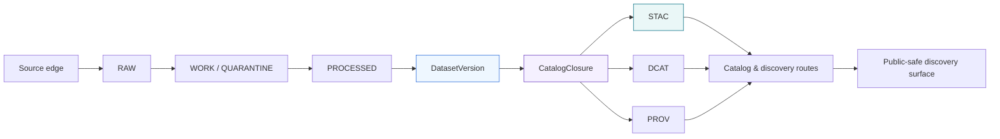

<!-- [KFM_META_BLOCK_V2]
doc_id: kfm://doc/TODO-NEEDS-UUID
title: KFM STAC Profile
type: standard
version: v1
status: draft
owners: TODO-NEEDS-VERIFICATION
created: TODO-NEEDS-VERIFICATION
updated: TODO-NEEDS-VERIFICATION
policy_label: TODO-NEEDS-VERIFICATION
related: [TODO-NEEDS-VERIFICATION]
tags: [kfm, stac, standards, catalog, interoperability]
notes: [Mounted workspace evidence for this drafting session was PDF-only; repo links, owners, dates, and mounted schema/route inventory require direct verification.]
[/KFM_META_BLOCK_V2] -->

# KFM STAC Profile

KFM’s outward STAC profile for **published** spatiotemporal discovery metadata, release-linked assets, and governed catalog closure.

> [!IMPORTANT]
> This document is doctrine-aligned and implementation-bounded. In this drafting session, mounted workspace evidence was PDF-only. Exact repo wiring, schema registry paths, endpoint names, CI jobs, and linked adjacent docs remain **UNKNOWN** until directly reverified.

[](#status-and-scope)
[](#status-and-scope)
[](#baseline-profile-line)
[](#kfm-positioning)
[](#verification-boundary)

**Quick jump:** [Scope](#scope) · [Inputs](#accepted-inputs) · [Exclusions](#exclusions) · [KFM positioning](#kfm-positioning) · [Profile rules](#profile-rules) · [KFM extensions](#kfm-fields-and-extensions) · [Validation](#validation-and-gates) · [Examples](#illustrative-examples) · [Open questions](#open-questions)

## Status and scope

| Field | Value |
| --- | --- |
| Status | `draft` |
| Posture | `CONFIRMED doctrine` / `PROPOSED starter realization` / `UNKNOWN mounted implementation` |
| Intended role | Outward STAC profile for **catalog and discovery** surfaces |
| Baseline profile line | `STAC 1.1.0` |
| Repo fit | Path: `docs/standards/KFM_STAC_PROFILE.md` |
| Upstream links | `TODO-NEEDS-VERIFICATION` |
| Downstream links | `TODO-NEEDS-VERIFICATION` |
| Verification boundary | Mounted repo tree, schemas, fixtures, workflows, route inventory, and neighboring docs were **not** directly verified in this session |

## Scope

This standard defines how KFM should use STAC at the **published discovery boundary**.

It governs:

- STAC catalogs, collections, items, and release-safe asset links emitted from governed catalog closure
- release-linked discovery metadata for public-safe or otherwise policy-permitted published assets
- outward interoperability at the discovery layer, alongside DCAT and PROV closure

It does **not** redefine KFM’s canonical truth model. STAC is a **discovery and exchange profile**, not KFM’s sovereign internal record.

## Repo fit

| Topic | Value |
| --- | --- |
| Target path | `docs/standards/KFM_STAC_PROFILE.md` |
| Likely audience | Data architecture, geospatial delivery, catalog tooling, API, review, and publication teams |
| Likely neighboring docs | `TODO-NEEDS-VERIFICATION` |
| Likely upstream sources | KFM canonical doctrine, catalog closure rules, release manifests, policy/review outputs |
| Likely downstream consumers | discovery APIs, catalog compilers, release tooling, map/data portals, validation gates |

## Accepted inputs

Only the following belong at this profile boundary:

| Accepted input | Why it belongs here |
| --- | --- |
| Published or publication-ready `DatasetVersion` | STAC must describe governed release scope, not informal working state |
| `CatalogClosure` outputs | KFM doctrine places STAC inside outward catalog closure |
| `ReleaseManifest` / release-safe public references | Discovery metadata must remain tied to release state |
| `DecisionEnvelope` outcomes permitting publication | Rights, sensitivity, and publication posture must already be resolved |
| `ProjectionBuildReceipt` or equivalent derivative lineage refs | Derived assets must still show release linkage and freshness basis |
| Public-safe asset distributions | STAC should point to assets that are allowed to be discovered and retrieved |

## Exclusions

This file does **not** govern the following, and they should live elsewhere:

| Excluded material | Where it belongs instead |
| --- | --- |
| `RAW`, `WORK`, `QUARANTINE`, unpublished candidate artifacts | Canonical ingest, validation, and review lanes |
| Internal review, moderation, or stewardship actions | Internal governed APIs and review records |
| `EvidenceBundle` payload structure | Evidence-resolution contracts and governed evidence APIs |
| `RuntimeResponseEnvelope` structure | Runtime / Focus / governed-assistance contracts |
| Portrayal-specific map styling internals | Portrayal, tile, and renderer standards |
| Hidden internal audit fields not safe for publication | Internal ops, audit, and control-plane artifacts |
| Canonical entity storage model | Canonical data architecture and internal schemas |

## KFM positioning

KFM treats STAC as an **outward metadata layer** inside governed catalog closure, not as an internal truth store.

Three doctrinal consequences shape this profile:

1. **STAC is downstream of release governance.**  
   No STAC document should imply publication authority by itself.

2. **STAC must preserve linkage.**  
   Discovery metadata must remain tied to dataset version, release state, rights/sensitivity posture, provenance, and correction lineage.

3. **STAC must not bypass the trust membrane.**  
   Public discovery can read only published scope and must not expose unpublished or policy-restricted internals.


```mermaid
flowchart LR
    A[Source edge] --> B[RAW]
    B --> C[WORK / QUARANTINE]
    C --> D[PROCESSED]
    D --> E[DatasetVersion]
    E --> F[CatalogClosure]
    F --> G[STAC]
    F --> H[DCAT]
    F --> I[PROV]
    G --> J[Catalog & discovery routes]
    H --> J
    I --> J
    J --> K[Public-safe discovery surface]

    style E fill:#eef7ff,stroke:#2f6fdb
    style F fill:#f5f0ff,stroke:#6f42c1
    style G fill:#eaf7f7,stroke:#0b7285
```

## Baseline profile line

### Baseline profile line

| Concern | Rule | Status |
| --- | --- | --- |
| STAC line | Use `STAC 1.1.0` as the baseline outward profile line until reverified | `CONFIRMED` |
| Catalog boundary | Treat STAC as part of the outward `STAC / DCAT / PROV` closure | `CONFIRMED` |
| Discovery stack | Align discovery surfaces with STAC, DCAT 3, and OGC API Records where applicable | `CONFIRMED doctrine` |
| Feature/tile relation | Keep feature-read and portrayal/tile obligations distinct from STAC discovery metadata | `CONFIRMED doctrine` |
| Mounted conformance claim | Do **not** claim live conformance until schemas, fixtures, and routes are directly verified | `UNKNOWN` |

> [!NOTE]
> “Profile fit” and “mounted conformance” are not the same thing. This file defines what KFM should require at the standard boundary. It does **not** claim that the currently mounted repo already emits this profile.

## Profile rules

### Rule 1 — public scope only

STAC emission is allowed only for release-bearing, policy-cleared scope. No catalog, collection, item, or asset link should point into unpublished `RAW`, `WORK`, `QUARANTINE`, or candidate-only material.

### Rule 2 — release linkage is mandatory

Every published STAC object must remain traceable to release scope, not just to a storage path or convenience export.

### Rule 3 — rights and sensitivity are first-class

Discovery metadata must not hide unresolved rights, redistribution limits, redaction, generalization, or sensitivity posture.

### Rule 4 — correction lineage stays visible

Superseded, narrowed, withdrawn, generalized, or replaced material must remain visibly linked rather than silently overwritten.

### Rule 5 — discovery and portrayal stay separated

STAC should describe **what exists and how it may be discovered**. It should not absorb all renderer- or portrayal-specific contracts.

## Required field posture

| Element | KFM posture | Notes |
| --- | --- | --- |
| `stac_version` | **REQUIRED** | Pin to the approved baseline line |
| `id` | **REQUIRED** | Must be stable and release-safe; do not recycle IDs across materially different released objects |
| `type` | **REQUIRED** | Standard STAC object typing |
| `geometry` / `bbox` | **REQUIRED** unless the standard allows null shape | If geometry is generalized, redacted, or intentionally coarsened, that state must be visible |
| Temporal metadata | **REQUIRED** | Enough to preserve KFM time semantics for discovery and filtering |
| `links` | **REQUIRED** | Must support resolvable navigation and outward closure |
| `assets` | **REQUIRED** when the object describes retrievable data | Assets must point only to public-safe, release-linked distributions |
| Media types / roles | **REQUIRED** on assets | Avoid opaque links |
| Provenance linkage | **REQUIRED** | Via linked PROV closure or equivalent release-linked lineage pointer |
| Rights / license posture | **REQUIRED** | Must be visible, not assumed |
| Correction / supersession visibility | **REQUIRED when applicable** | Discovery must not erase lineage |

## Strong recommendations

| Recommendation | Why it matters |
| --- | --- |
| Include explicit release linkage on every emitted object or through resolvable links | Keeps discovery aligned to governed publication |
| Keep stable subject identity distinct from derivative build identity | Prevents discovery drift across re-projections or repackaging |
| Distinguish authoritative subject assets from derived convenience assets | Protects authoritative-vs-derived separation |
| Carry enough metadata to explain freshness and stale-after expectations | KFM requires trust-visible freshness |
| Keep asset URLs, IDs, and identifiers deterministic where practical | Simplifies validation, correction, and auditability |
| Expose redaction/generalization explicitly | Prevents false precision |

## Forbidden or fail-closed conditions

| Condition | Required behavior |
| --- | --- |
| Unresolved rights or redistribution posture | Do not publish STAC; fail closed |
| Sensitive exact location with no safe generalized representation | Do not publish exact geometry; either generalize visibly or deny publication |
| Missing release linkage | Do not emit outward STAC |
| Broken STAC/DCAT/PROV closure | Do not treat the closure as publishable |
| Non-resolvable outward links | Fail validation |
| Hidden correction or stale state | Fail validation or withhold publication |
| Unpublished candidate scope linked from public catalog | Fail validation |

<details>
<summary><strong>Anti-patterns this profile rejects</strong></summary>

- Treating STAC as KFM’s canonical truth store
- Publishing STAC directly from ingest or candidate lanes
- Using STAC to hide unresolved rights or sensitivity
- Mixing discovery metadata and portrayal contracts into one opaque surface
- Dropping correction lineage when assets are superseded
- Treating derivative tiles, caches, or summaries as automatically authoritative

</details>

## KFM fields and extensions

> [!NOTE]
> The `kfm:*` fields below are a **PROPOSED starter profile**, not a verified mounted namespace. Use them as a reviewable draft until the repo’s actual schema registry and extension URIs are directly confirmed.

### Proposed starter fields

| Field | Purpose | Status |
| --- | --- | --- |
| `kfm:dataset_version_id` | Link STAC output back to the authoritative dataset version | `PROPOSED` |
| `kfm:release_id` | Tie emitted discovery metadata to release scope | `PROPOSED` |
| `kfm:decision_ref` | Link to the publication decision or decision envelope | `PROPOSED` |
| `kfm:evidence_state` | Surface source-stated / extracted / inferred / reviewed / generalized style state | `PROPOSED` |
| `kfm:rights_class` | Surface rights posture in a machine-readable way | `PROPOSED` |
| `kfm:sensitivity_class` | Surface sensitivity class without leaking protected detail | `PROPOSED` |
| `kfm:correction_state` | Make superseded / withdrawn / narrowed / replaced status visible | `PROPOSED` |
| `kfm:profile_version` | Pin the KFM STAC profile revision used to emit the object | `PROPOSED` |
| `kfm:generalization_note` | Explain why geometry or timing has been coarsened | `PROPOSED` |

### Public-safe caution

Internal-only values such as deep audit internals, raw enforcement traces, or hidden stewardship state should **not** be copied into public STAC unless policy explicitly permits it.

## KFM object mapping

| KFM object family | STAC role | Profile expectation |
| --- | --- | --- |
| `CatalogClosure` | Governs emitted catalog / collection / item link set | STAC should be downstream of closure, not parallel to it |
| `DatasetVersion` | Governs authoritative version identity and support/time semantics | STAC must not invent its own competing version truth |
| `ReleaseManifest` | Governs release-safe publication linkage | STAC should link to release context or inherit it through closure |
| `ProjectionBuildReceipt` | Governs lineage for derived assets | Derived STAC assets should keep build/ref linkage visible |
| `CorrectionNotice` | Governs visible supersession / withdrawal / replacement | STAC should preserve successor or replacement discoverability |
| `EvidenceBundle` | Related trust object, but not itself a STAC object | Link out through governed evidence routes when appropriate |
| `DecisionEnvelope` / `ReviewRecord` | Control-plane publication proof | Usually linked indirectly via release closure, not exposed wholesale |

## Route fit

KFM’s discovery and trust doctrine suggests the following split.

| Surface family | Fit with this STAC profile |
| --- | --- |
| Catalog and discovery routes | **Primary fit** |
| Feature or subject read routes | Adjacent, but not the same profile |
| Map / tile / portrayal routes | Related, but governed separately |
| Evidence-resolution routes | Related trust surface, not STAC itself |
| Story / dossier / compare routes | May consume STAC links but are not governed by STAC alone |
| Focus / governed assistance | May reference STAC-discovered assets, but runtime contracts remain separate |

## Rights, sensitivity, and correction

> [!WARNING]
> In KFM, STAC publication is not a convenience export. It is a governed outward-facing act.

### Rights and redistribution

Public STAC must not imply broader reuse than KFM has actually cleared. If redistribution posture is unresolved, publication should fail closed.

### Sensitive location handling

If exact geometry is too sensitive for the requested audience, this profile expects one of three outcomes:

1. withhold publication entirely
2. publish a visibly generalized representation
3. publish metadata-only discovery without exact coordinates

### Correction and supersession

Correction must remain visible across discovery surfaces. A replaced or withdrawn item should not simply disappear without a successor, replacement, or withdrawal trace where policy allows.

## Validation and gates

### Minimum validation stack

| Gate | What it checks | Status |
| --- | --- | --- |
| STAC schema validation | Object shape and STAC baseline validity | `CONFIRMED requirement` |
| KFM profile validation | KFM-specific release, rights, provenance, and correction rules | `PROPOSED starter gate` |
| Catalog-closure validation | STAC / DCAT / PROV resolution and outward-link integrity | `CONFIRMED requirement` |
| Identifier consistency | Stable IDs across closure, release, and assets | `CONFIRMED requirement` |
| Rights/sensitivity gate | Public-safe posture and redaction/generalization behavior | `CONFIRMED requirement` |
| Correction propagation checks | Supersession / withdrawal / replacement visibility | `CONFIRMED requirement` |
| Link integrity checks | No dead or unresolved outward links | `CONFIRMED requirement` |

### Validation rule of thumb

A STAC document that is syntactically valid but missing release linkage, policy posture, or correction visibility is **not** acceptable KFM output.

<details>
<summary><strong>PROPOSED starter file set</strong></summary>

```text
schemas/stac/kfm-catalog.schema.json
schemas/stac/kfm-collection.schema.json
schemas/stac/kfm-item.schema.json
schemas/stac/extensions/kfm-profile.schema.json
tests/fixtures/stac/valid/
tests/fixtures/stac/invalid/
tests/fixtures/stac/closure/
```

These paths are reviewable starter patterns only. They are **not** asserted mounted repo facts.

</details>

## Illustrative examples

> [!NOTE]
> The examples below are illustrative profile sketches. They are intentionally generic and should not be treated as confirmed mounted payloads.

### Illustrative STAC Item

```json
{
  "stac_version": "1.1.0",
  "type": "Feature",
  "id": "TODO-ILLUSTRATIVE-KFM-ITEM-ID",
  "geometry": {
    "type": "Polygon",
    "coordinates": [[[0, 0], [1, 0], [1, 1], [0, 1], [0, 0]]]
  },
  "bbox": [0, 0, 1, 1],
  "properties": {
    "datetime": "2026-03-01T00:00:00Z",
    "kfm:dataset_version_id": "TODO-ILLUSTRATIVE",
    "kfm:release_id": "TODO-ILLUSTRATIVE",
    "kfm:evidence_state": "reviewed",
    "kfm:rights_class": "public",
    "kfm:sensitivity_class": "generalized",
    "kfm:profile_version": "v1"
  },
  "assets": {
    "data": {
      "href": "TODO-ILLUSTRATIVE",
      "type": "image/tiff; application=geotiff; profile=cloud-optimized",
      "roles": ["data"]
    }
  },
  "links": [
    {
      "rel": "root",
      "href": "TODO-ILLUSTRATIVE"
    },
    {
      "rel": "collection",
      "href": "TODO-ILLUSTRATIVE"
    },
    {
      "rel": "describedby",
      "href": "TODO-ILLUSTRATIVE"
    },
    {
      "rel": "via",
      "href": "TODO-ILLUSTRATIVE"
    },
    {
      "rel": "related",
      "href": "TODO-ILLUSTRATIVE"
    }
  ]
}
```

<details>
<summary><strong>Illustrative link expectations</strong></summary>

A review-ready emitted object should usually make room for:

- root / parent / collection navigation
- schema or profile description
- release-manifest linkage
- provenance linkage
- correction or successor linkage when applicable

</details>

## Task list and definition of done

### Review gates

- [ ] Verify whether `docs/standards/KFM_STAC_PROFILE.md` already exists and merge with any stronger neighboring material
- [ ] Replace all `TODO-NEEDS-VERIFICATION` placeholders with mounted repo values
- [ ] Confirm the mounted schema registry path and extension namespace
- [ ] Add valid and invalid fixtures for at least one catalog, collection, and item
- [ ] Verify catalog-closure checks for STAC / DCAT / PROV integrity
- [ ] Verify public-safe redaction/generalization on one real dataset
- [ ] Verify correction visibility on one supersession or withdrawal example
- [ ] Add relative links to the actual adjacent standards, route, and runbook docs
- [ ] Confirm whether public discovery uses STAC alone, STAC + OGC API Records, or another mounted boundary shape
- [ ] Confirm owners, created date, updated date, and policy label

### Done means

A reviewer should be able to answer **yes** to all of the following:

- Does this profile keep STAC clearly downstream of KFM governance?
- Does it distinguish `CONFIRMED`, `PROPOSED`, and `UNKNOWN` material?
- Can a catalog compiler, release tool, or validator implement this without guessing the doctrine?
- Does it fail closed on rights, sensitivity, release, and correction problems?
- Does it avoid turning discovery metadata into sovereign truth?

## Open questions

| Question | Current state |
| --- | --- |
| Does the target file already exist in the mounted repo? | `UNKNOWN` |
| What neighboring standards docs should this link to? | `UNKNOWN` |
| What exact owners, dates, and policy label belong in the meta block? | `UNKNOWN` |
| What is the mounted STAC schema registry path? | `UNKNOWN` |
| What exact extension namespace and schema URI should be used? | `UNKNOWN` |
| What exact public route names or API paths currently serve discovery? | `UNKNOWN` |
| Is correction represented through successor links, explicit flags, or both in mounted implementation? | `UNKNOWN` |
| Which asset classes are already emitted as STAC in the mounted workspace? | `UNKNOWN` |

<details>
<summary><strong>Appendix — compact drafting posture</strong></summary>

This file is intentionally written as a standards-layer bridge between KFM doctrine and later mounted implementation verification:

- doctrine is kept explicit
- starter profile rules are concrete enough to validate
- unverified repo details stay visible instead of being guessed away

</details>
