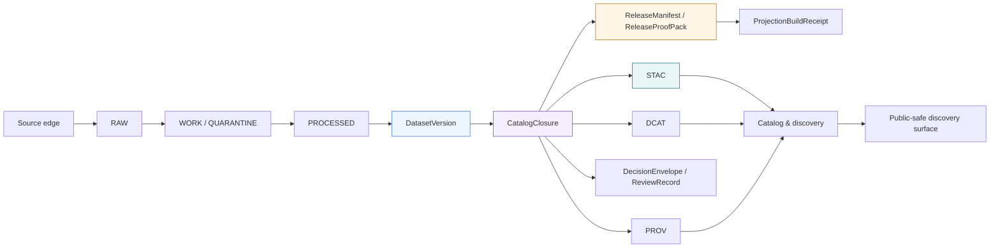

<!-- [KFM_META_BLOCK_V2]
doc_id: kfm://doc/TODO-NEEDS-UUID
title: KFM STAC Profile
type: standard
version: v1
status: draft
owners: TODO-NEEDS-VERIFICATION
created: TODO-NEEDS-VERIFICATION
updated: TODO-NEEDS-VERIFICATION
policy_label: TODO-NEEDS-VERIFICATION
related: [docs/architecture/, docs/governance/, contracts/, schemas/, policy/, tests/, tools/]
tags: [kfm, stac, standards, catalog, interoperability]
notes: [Revised from attached draft baseline using attached KFM doctrine plus current public-main repo-root and .github evidence; exact in-repo target path, owners, policy label, schema/validator filenames, endpoint names, and non-public GitHub enforcement settings still need direct verification.]
[/KFM_META_BLOCK_V2] -->

# KFM STAC Profile

KFM’s outward STAC profile for **published spatiotemporal discovery metadata**, **release-linked assets**, and **governed catalog closure**.

> [!IMPORTANT]
> This revision keeps the original doctrine intact but retires the earlier **PDF-only** evidence posture. Attached KFM doctrine remains primary. Current public `main` also confirms repo-root and `.github` directory anchors relevant to this standard. Exact file placement, schema filenames, validator entrypoints, workflow YAML inventory, and live enforcement details still remain **NEEDS VERIFICATION**.

[](#status-and-evidence-boundary)
[](#status-and-evidence-boundary)
[](#baseline-profile-line)
[](#kfm-positioning)
[](#status-and-evidence-boundary)

**Quick jump:** [Status](#status-and-evidence-boundary) · [Repo anchors](#current-repo-anchors) · [Role](#role-in-kfm) · [Scope](#scope) · [Object minima](#object-class-minima) · [Rules](#profile-rules) · [Control plane](#control-plane-prerequisites) · [Gates](#validation-and-gates) · [Fields](#proposed-kfm-starter-fields) · [Examples](#illustrative-examples) · [Verification backlog](#verification-backlog)

## Status and evidence boundary

| Field | Value |
| --- | --- |
| Status | `draft` |
| Posture | `CONFIRMED doctrine` / `CONFIRMED public-main directory anchors` / `PROPOSED profile realization` / `UNKNOWN exact in-tree implementation` |
| Intended role | Standard for **published discovery metadata**, not canonical storage |
| Baseline profile line | `STAC 1.1.0` |
| Discovery closure | `STAC + DCAT + PROV` |
| Current evidence boundary | attached doctrine corpus + uploaded draft baseline + current public `main` repo-root / `.github` directory evidence |
| Still not directly verified here | exact target file path, schema filenames, fixtures, validator entrypoints, workflow YAML inventory, live route names, non-public platform settings, runtime outputs |

## Current repo anchors

These are the **current public-tree anchors** this draft can safely name without inventing deeper implementation state.

| Anchor | Why it matters for this standard | Status |
| --- | --- | --- |
| `docs/architecture/` | likely doctrinal neighbor or eventual home for adjacent architecture standards | `CONFIRMED path` |
| `docs/governance/` | policy, review, release, and trust-language neighbor | `CONFIRMED path` |
| `contracts/` | eventual machine-contract alignment surface | `CONFIRMED path` |
| `schemas/` | future schema home or validator reference surface | `CONFIRMED path` |
| `policy/` | future executable gate alignment surface | `CONFIRMED path` |
| `tests/` | fixture, contract, and regression neighbor | `CONFIRMED path` |
| `tools/` | likely validation or lint tooling neighbor | `CONFIRMED path` |
| `pipelines/` | release-producing lanes this standard must constrain without silently owning | `CONFIRMED path` |
| exact path for this file | final in-repo location for the committed standard | `NEEDS VERIFICATION` |

> [!NOTE]
> Current public `.github/` evidence is useful but bounded. Public `.github/workflows/` and `.github/watchers/` are documentation-only on the checked-in tree. Do **not** claim checked-in workflow enforcement, app permissions, OIDC wiring, required checks, or other platform-only controls from public-tree surface alone.

## Role in KFM

KFM treats STAC as a **release-facing catalog and discovery carrier**.

That means this standard is about:

- outward discoverability of released spatiotemporal assets
- stable catalog, collection, item, link, and asset semantics for public-safe or otherwise policy-permitted release scope
- linkage from discovery metadata into release, provenance, rights, sensitivity, freshness, and correction state

It is **not** a replacement for KFM’s canonical truth plane, policy plane, review plane, or runtime evidence-resolution contracts.

## KFM positioning

KFM is strongest when STAC, DCAT, and PROV are emitted as one outward closure instead of treated as competing metadata worlds:

- **STAC** carries spatiotemporal item and asset discovery.
- **DCAT** carries outward dataset and distribution discovery.
- **PROV** carries lineage, agents, and activities.
- **KFM-specific policy and review artifacts** remain first-class beside them.


```mermaid
flowchart LR
    A[Source edge] --> B[RAW]
    B --> C[WORK / QUARANTINE]
    C --> D[PROCESSED]
    D --> E[DatasetVersion]
    E --> F[CatalogClosure]
    F --> G[STAC]
    F --> H[DCAT]
    F --> I[PROV]
    F --> J[DecisionEnvelope / ReviewRecord]
    F --> K[ReleaseManifest / ReleaseProofPack]
    K --> L[ProjectionBuildReceipt]
    G --> M[Catalog & discovery]
    H --> M
    I --> M
    M --> N[Public-safe discovery surface]

    style E fill:#eef7ff,stroke:#2f6fdb
    style F fill:#f5f0ff,stroke:#6f42c1
    style G fill:#eaf7f7,stroke:#0b7285
    style K fill:#fff6e8,stroke:#b26b00
```

## Scope

This profile governs STAC emitted at the **published discovery boundary**.

It covers:

- STAC catalogs, collections, items, and release-safe asset links
- outward metadata emitted from governed catalog closure
- discovery metadata for released data products, portrayals, and derivative packages that remain tied to release scope
- visibility of rights, sensitivity, freshness, and correction state where those change meaning

## Out of scope

This standard does **not** govern the following:

| Out of scope | Where it belongs instead |
| --- | --- |
| `RAW`, `WORK`, `QUARANTINE`, and unpublished candidate artifacts | intake, validation, and review lanes |
| canonical entity storage and internal truth modeling | canonical data architecture and internal schemas |
| `EvidenceBundle` payload shape | evidence-resolution contracts |
| `RuntimeResponseEnvelope` shape | runtime and Focus contracts |
| internal moderation, approval, rollback, or rights-handling workflows | policy/review plane |
| portrayal-specific renderer internals | portrayal, style, and renderer standards |
| direct feature-edit semantics | governed feature APIs and authoring contracts |

## Baseline profile line

| Concern | Rule | Status |
| --- | --- | --- |
| STAC baseline line | Use `STAC 1.1.0` as the baseline outward profile line | `CONFIRMED` |
| Closure model | Treat STAC as part of a linked `STAC / DCAT / PROV` outward closure | `CONFIRMED doctrine` |
| Discovery boundary | Align discovery with catalog/discovery route families rather than canonical storage | `CONFIRMED doctrine` |
| Mounted conformance claim | Do **not** claim live conformance until actual schemas, fixtures, validators, and emitted examples are reverified | `UNKNOWN` |

> [!NOTE]
> This document defines the **required shape of the standard boundary**. It does not claim that the currently visible project already emits this profile end to end.

## Object-class minima

This section is intentionally **object-class-specific**. It avoids flattening Collection-only fields into Item-core rules or confusing STAC core with KFM closure obligations.

| STAC object | Baseline outward minimum | KFM additions / cautions |
| --- | --- | --- |
| **Catalog** | `stac_version`, `type=Catalog`, stable `id`, human-usable `description`, traversable `links` | must not surface unpublished or unreleasable scope through navigation |
| **Collection** | Catalog minimums plus `license` and `extent`; `providers`, `keywords`, `summaries`, and `item_assets` should be present when needed for useful discovery | collection-level rights, freshness, correction, and release posture should be visible or cleanly resolvable |
| **Item** | `stac_version`, `type=Feature`, stable `id`, `geometry`, `bbox`, `properties`, `links`, and `assets`; collection relation when organized under a collection | item-level release linkage, evidence/provenance path, correction visibility, and source/evidence state must remain visible |
| **Asset / Link** | resolvable `href`; object-appropriate typing and relation semantics | for promoted outputs, KFM strongly expects explicit media type, predictable roles, and a path to integrity / proof material |

### KFM object-class expectations

| Concern | Catalog | Collection | Item | Asset / Link |
| --- | --- | --- | --- | --- |
| Release-safe scope only | `REQUIRED` | `REQUIRED` | `REQUIRED` | `REQUIRED` |
| Rights posture visible | `RECOMMENDED` | `REQUIRED` | `REQUIRED when item-level meaning changes` | `REQUIRED when asset-level restrictions differ` |
| Freshness / stale cues | `RECOMMENDED` | `REQUIRED when applicable` | `REQUIRED when applicable` | `REQUIRED when derived freshness matters` |
| Correction visibility | `RECOMMENDED` | `REQUIRED when applicable` | `REQUIRED when applicable` | `REQUIRED when the asset meaning has changed` |
| Provenance / lineage pointer | `RECOMMENDED` | `REQUIRED` | `REQUIRED` | `REQUIRED when independently retrievable` |
| Digest / integrity pointer | `OPTIONAL in STAC core` | `STRONGLY EXPECTED in KFM closure` | `STRONGLY EXPECTED in KFM closure` | `STRONGLY EXPECTED for promotion-ready assets` |

## Profile rules

### Rule 1 — published scope only

STAC is emitted only for **published** or otherwise explicitly release-safe scope. No public STAC document should point into `RAW`, `WORK`, `QUARANTINE`, or unpublished candidate material.

### Rule 2 — STAC is downstream of release governance

STAC is not a publication act by itself. A valid STAC object without release linkage, policy state, or review closure is still insufficient KFM output.

### Rule 3 — release linkage is mandatory

Every emitted STAC object must remain tied to release-bearing scope, not merely to a storage location or convenience export.

### Rule 4 — rights and sensitivity are first-class

Public discovery metadata must not hide unresolved rights, redistribution limits, precision controls, geoprivacy limits, or cultural/sensitivity posture.

### Rule 5 — discovery and authority remain separate

STAC is a discovery layer, not KFM’s sovereign internal truth layer.

### Rule 6 — correction lineage stays visible

Superseded, narrowed, generalized, withdrawn, or replaced material must preserve visible lineage rather than silently disappearing.

### Rule 7 — derived delivery stays downstream

Tiles, portrayals, search views, graph projections, scene packages, and other discovery-adjacent derivatives must inherit release linkage, freshness basis, and correction state from promoted scope.

### Rule 8 — fail closed

Where release, evidence, rights, sensitivity, schema validity, or correction integrity fail, publication must fail closed.

## Control-plane prerequisites

A STAC object may be outwardly visible only after the relevant control-plane prerequisites exist.

| KFM object | Why it matters for STAC publication | Status |
| --- | --- | --- |
| `SourceDescriptor` | declares source identity, support, cadence, rights posture, validation plan, and publication intent | `CONFIRMED doctrine` |
| `IngestReceipt` | proves fetch/landing and integrity context occurred | `CONFIRMED doctrine` |
| `ValidationReport` | records what checks passed, failed, or were quarantined | `CONFIRMED doctrine` |
| `DatasetVersion` | carries the authoritative candidate or promoted subject set with support/time semantics and provenance | `CONFIRMED doctrine` |
| `CatalogClosure` | publishes outward metadata closure and STAC/DCAT/PROV linkage | `CONFIRMED doctrine` |
| `DecisionEnvelope` | expresses policy result machine-readably | `CONFIRMED doctrine` |
| `ReviewRecord` | captures required human approval, denial, escalation, or note | `CONFIRMED doctrine` |
| `ReleaseManifest` / `ReleaseProofPack` | assembles public-safe release and proof | `CONFIRMED doctrine` |
| `ProjectionBuildReceipt` | proves a derived layer was built from a known release scope | `CONFIRMED doctrine` |
| `CorrectionNotice` | preserves visible lineage when published meaning changes | `CONFIRMED doctrine` |

> [!CAUTION]
> In KFM, **discoverability is a governed outcome**. If control-plane proof is missing, STAC should not be treated as releasable.

### Required control-plane consequences

1. A `CatalogClosure` must exist before outward discoverability is considered valid.
2. A `DecisionEnvelope` must capture the rights / sensitivity / release result machine-readably.
3. A `ReviewRecord` is required when the publication burden for the lane or artifact class demands review.
4. A `ReleaseManifest` or equivalent release proof must anchor what the catalog is allowed to expose.
5. Any derived portrayal or tile-facing STAC asset should carry or resolve to a `ProjectionBuildReceipt`.
6. Any post-release narrowing, replacement, or withdrawal must emit a `CorrectionNotice`.

## Route fit

| Route family | Fit with this profile | Notes |
| --- | --- | --- |
| Catalog and discovery | **Primary fit** | STAC belongs here most directly |
| Feature or subject read | Adjacent | subject-read contracts remain distinct |
| Map / tile / portrayal | Related | should inherit release linkage, freshness, and correction state |
| Evidence resolution | Related but separate | STAC may point toward evidence, but it is not the evidence contract |
| Story / dossier / compare | Consumer of STAC, not defined by it | shell surfaces must still drill through to evidence |
| Export and report | Related | exports may expose STAC-linked assets but remain governed separately |
| Focus / governed assistance | Consumer of STAC-linked released scope | runtime contracts remain separate |

## Rights, sensitivity, freshness, and correction

### Rights and redistribution

A STAC document must not imply broader reuse than KFM has actually cleared. Unresolved or ambiguous rights posture is a fail-closed condition.

### Sensitive location handling

If exact location is not safe for the intended audience, the profile expects one of the following:

1. do not publish
2. publish a visibly generalized spatial representation
3. publish metadata-only discovery without precise coordinates

### Source-dependent and modeled material

Where a published asset is source-dependent, modeled, generalized, assimilated, or otherwise interpretively burdened, that state should be visible rather than implied away.

### Freshness and stale-visible behavior

If a derived portrayal, projection, or linked asset becomes stale beyond its declared tolerance, the surface should move into a visible stale state rather than silently presenting itself as current.

### Correction propagation

Correction must remain visible across discovery, map, story, export, and Focus-adjacent surfaces. A replacement should not erase the fact that replacement occurred.

## Proposed KFM starter fields

> [!NOTE]
> The following `kfm:*` fields are **PROPOSED starter fields**. They are not asserted as mounted schemas, extension URIs, or already-deployed property names.

| Field | Purpose | Status |
| --- | --- | --- |
| `kfm:dataset_version_id` | tie STAC output back to the authoritative dataset version | `PROPOSED` |
| `kfm:release_id` | tie STAC output to release scope | `PROPOSED` |
| `kfm:decision_ref` | point to the publication decision or decision envelope | `PROPOSED` |
| `kfm:review_ref` | point to a review record when one governs publication | `PROPOSED` |
| `kfm:evidence_state` | surface source-stated / extracted / inferred / reviewed / generalized state | `PROPOSED` |
| `kfm:rights_class` | surface rights posture in a machine-readable way | `PROPOSED` |
| `kfm:sensitivity_class` | surface sensitivity class without leaking protected detail | `PROPOSED` |
| `kfm:source_mode` | distinguish observed / modeled / assimilated / source-dependent material | `PROPOSED` |
| `kfm:correction_state` | make superseded / withdrawn / narrowed / replaced status visible | `PROPOSED` |
| `kfm:profile_version` | pin the KFM STAC profile revision used to emit the object | `PROPOSED` |
| `kfm:generalization_note` | explain why geometry or timing has been coarsened | `PROPOSED` |
| `kfm:checksum_ref` | point to asset digest or closure-integrity material | `PROPOSED` |

## Validation and gates

### Minimum validation stack

| Gate | What it proves | Posture |
| --- | --- | --- |
| STAC core schema validation | core object shape and baseline validity | `CONFIRMED doctrine` |
| Collection / item field QA | required fields, links, and policy metadata are not silently incomplete | `CONFIRMED doctrine / NEEDS VERIFICATION for mounted CI wiring` |
| Closure integrity checks | STAC / DCAT / PROV resolve cleanly together | `CONFIRMED doctrine` |
| Identifier consistency checks | IDs resolve consistently across closure and release | `CONFIRMED doctrine` |
| Rights / sensitivity gate | publication is public-safe for the intended audience | `CONFIRMED doctrine` |
| Link integrity checks | outward links and relations resolve | `CONFIRMED doctrine` |
| Freshness / stale-projection checks | derived discovery layers do not silently impersonate current truth | `CONFIRMED doctrine` |
| Correction propagation checks | supersession / narrowing / withdrawal stay visible | `CONFIRMED doctrine` |
| KFM profile validation | KFM-specific rules beyond STAC core | `PROPOSED starter gate` |
| Digest / integrity checks | content digests are present and coherent for promotion-ready assets | `PROPOSED starter gate` |

### Release gate reminder

A publishable STAC surface should not be treated as complete without:

- dataset version reference
- catalog closure
- decision envelope
- review record where required
- release manifest or release proof pack
- evidence-resolution proof or representative sample pass
- rollback / correction posture
- updated docs, examples, or runbook delta where behavior changed

> [!WARNING]
> A syntactically valid STAC object is **not** automatically acceptable KFM output.

## Forbidden or fail-closed conditions

| Condition | Required behavior |
| --- | --- |
| missing reconstructible evidence path for an outward claim | fail closed |
| unknown rights or redistribution posture | fail closed |
| exact-location risk not covered by a safe representation | withhold or generalize visibly |
| schema / identity / unit / support failure | fail validation |
| missing catalog closure or required review artifact | no releasable discoverability |
| runtime citation failure on a trust-bearing outward surface | no confident outward answer path |
| stale derived projection beyond declared tolerance | stale-visible, rebuilt, or withheld |
| unlinked or orphaned derived assets | do not publish as current |

<details>
<summary><strong>Anti-patterns this profile rejects</strong></summary>

- treating STAC as KFM’s canonical truth store
- publishing directly from ingest or candidate lanes
- allowing tiles, caches, graphs, or summaries to quietly become authoritative
- shipping discovery metadata with no visible rights or provenance posture
- dropping correction lineage when assets are replaced
- claiming mounted validators, schema paths, or endpoints that have not been directly reverified

</details>

## Illustrative examples

> [!NOTE]
> The examples below are illustrative only. They show **profile intent**, not confirmed mounted payloads.

### Illustrative Collection

```json
{
  "stac_version": "1.1.0",
  "type": "Collection",
  "id": "TODO-ILLUSTRATIVE-KFM-COLLECTION",
  "description": "TODO-ILLUSTRATIVE",
  "license": "TODO-ILLUSTRATIVE",
  "extent": {
    "spatial": {
      "bbox": [[0, 0, 1, 1]]
    },
    "temporal": {
      "interval": [["2026-03-01T00:00:00Z", null]]
    }
  },
  "keywords": ["TODO-ILLUSTRATIVE"],
  "providers": [
    {
      "name": "TODO-ILLUSTRATIVE",
      "roles": ["producer"]
    }
  ],
  "links": [
    { "rel": "root", "href": "TODO-ILLUSTRATIVE" },
    { "rel": "self", "href": "TODO-ILLUSTRATIVE" },
    { "rel": "items", "href": "TODO-ILLUSTRATIVE" },
    { "rel": "describedby", "href": "TODO-ILLUSTRATIVE" }
  ]
}
```

### Illustrative Item

```json
{
  "stac_version": "1.1.0",
  "type": "Feature",
  "id": "TODO-ILLUSTRATIVE-KFM-ITEM-ID",
  "collection": "TODO-ILLUSTRATIVE-KFM-COLLECTION",
  "geometry": {
    "type": "Polygon",
    "coordinates": [[[0, 0], [1, 0], [1, 1], [0, 1], [0, 0]]]
  },
  "bbox": [0, 0, 1, 1],
  "properties": {
    "datetime": "2026-03-01T00:00:00Z",
    "kfm:dataset_version_id": "TODO-ILLUSTRATIVE",
    "kfm:release_id": "TODO-ILLUSTRATIVE",
    "kfm:evidence_state": "reviewed",
    "kfm:rights_class": "public",
    "kfm:sensitivity_class": "generalized",
    "kfm:source_mode": "observed",
    "kfm:profile_version": "v1"
  },
  "assets": {
    "data": {
      "href": "TODO-ILLUSTRATIVE",
      "type": "image/tiff; application=geotiff; profile=cloud-optimized",
      "roles": ["data"]
    }
  },
  "links": [
    { "rel": "root", "href": "TODO-ILLUSTRATIVE" },
    { "rel": "collection", "href": "TODO-ILLUSTRATIVE" },
    { "rel": "via", "href": "TODO-ILLUSTRATIVE" },
    { "rel": "related", "href": "TODO-ILLUSTRATIVE" }
  ]
}
```

<details>
<summary><strong>Illustrative link expectations</strong></summary>

A review-ready STAC object will usually make room for:

- root / parent / collection navigation
- profile or schema description
- release-manifest or release-context linkage
- provenance linkage
- correction or successor linkage where applicable

</details>

## Verification backlog

| Unknown | Why it matters |
| --- | --- |
| exact target repo path for this file | keeps links and adjacent docs correct |
| mounted schema registry path | required before claiming extension or validator wiring |
| mounted STAC fixtures and examples | needed for conformance claims |
| mounted CI / workflow coverage | needed before claiming enforced release gates |
| mounted endpoint names and route trees | needed before naming real public discovery surfaces |
| mounted owners, dates, and policy label | required to finalize the meta block |
| mounted KFM extension namespace / schema URI | required before hardening `kfm:*` properties beyond draft |
| actual checksum / integrity requirements in code | needed before turning closure-digest expectations into confirmed enforcement |

## Definition of done for this standard

- [ ] choose and verify the final in-repo home for this standard
- [ ] replace all `TODO-NEEDS-VERIFICATION` placeholders in the meta block
- [ ] confirm matching machine-contract surfaces under `contracts/`, `schemas/`, and `policy/`
- [ ] verify whether catalog fixtures or examples already exist under `data/`, `tests/`, `tools/`, or `examples/`
- [ ] confirm actual validator entrypoints and whether any public-tree lint or contract jobs call them
- [ ] verify one positive and one negative closure example for `STAC / DCAT / PROV`
- [ ] verify one release-linked item with visible rights / sensitivity posture
- [ ] verify one correction example with successor or withdrawal behavior
- [ ] verify one stale-projection or freshness-control example
- [ ] confirm whether digests / attestations are already enforced or remain starter doctrine

<details>
<summary><strong>Appendix — drafting posture</strong></summary>

This draft intentionally keeps four things separate:

1. **CONFIRMED doctrine**  
   What the attached KFM manuals establish clearly.

2. **CONFIRMED public-tree anchors**  
   What the current public repo tree exposes at directory and gatehouse level.

3. **PROPOSED starter realization**  
   A usable first profile shape for later schema, fixture, and validator work.

4. **UNKNOWN or NEEDS VERIFICATION**  
   Anything that would require direct file-level repo inspection, workflow verification, runtime proof, or private platform-state access.

That separation is part of the standard, not a temporary embarrassment.

</details>

[Back to top](#kfm-stac-profile)
