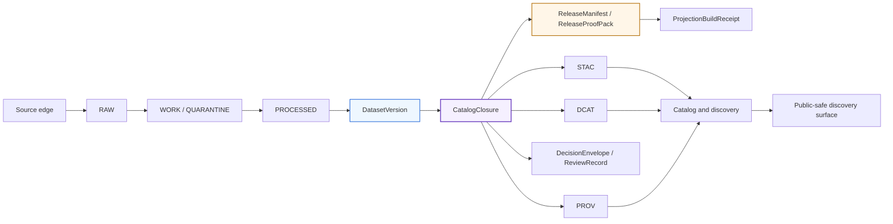

<!-- [KFM_META_BLOCK_V2]
doc_id: kfm://doc/NEEDS-VERIFICATION
title: KFM STAC Profile
type: standard
version: v1
status: draft
owners: NEEDS_VERIFICATION
created: NEEDS_VERIFICATION
updated: 2026-04-30
policy_label: NEEDS_VERIFICATION
related: [NEEDS_VERIFICATION: docs/standards/KFM_DCAT_PROFILE.md, NEEDS_VERIFICATION: docs/standards/KFM_PROV_PROFILE.md, NEEDS_VERIFICATION: docs/architecture/, NEEDS_VERIFICATION: docs/governance/, NEEDS_VERIFICATION: contracts/, NEEDS_VERIFICATION: schemas/, NEEDS_VERIFICATION: policy/, NEEDS_VERIFICATION: tests/, NEEDS_VERIFICATION: tools/, NEEDS_VERIFICATION: data/catalog/]
tags: [kfm, stac, standards, catalog, interoperability, evidence, publication]
notes: [Target path supplied by the task is docs/standards/KFM_STAC_PROFILE.md. No mounted KFM repository was available in this drafting session, so doc_id, owners, created date, policy label, companion paths, schema filenames, validator entrypoints, workflow coverage, and live conformance remain NEEDS VERIFICATION. STAC 1.1.0 and STAC API 1.0.0 are grounded in current official OGC sources checked during this revision.]
[/KFM_META_BLOCK_V2] -->

<a id="top"></a>

# KFM STAC Profile

KFM’s outward profile for **published spatiotemporal discovery metadata**, **release-linked assets**, and **governed catalog closure**.


> [!IMPORTANT]
> **STAC is a discovery surface, not KFM truth.**  
> A syntactically valid STAC Catalog, Collection, or Item is not releasable KFM output unless it is tied to release scope, policy state, review state where required, evidence resolution, and correction lineage.

**Quick jump:** [Status](#status-and-evidence-boundary) · [Role](#role-in-kfm) · [Scope](#scope) · [Profile line](#baseline-profile-line) · [Object minima](#object-class-minima) · [Rules](#profile-rules) · [Control plane](#control-plane-prerequisites) · [Fields](#proposed-kfm-starter-fields) · [Validation](#validation-and-gates) · [Examples](#illustrative-examples) · [Backlog](#verification-backlog)

---

## Status and evidence boundary

| Field | Value |
|---|---|
| **Target path** | `docs/standards/KFM_STAC_PROFILE.md` |
| **Document role** | Standard for outward STAC metadata at the published discovery boundary |
| **Current posture** | `CONFIRMED` doctrine · `PROPOSED` profile realization · `UNKNOWN` mounted implementation |
| **Baseline STAC line** | `STAC 1.1.0` |
| **STAC API line** | `STAC API 1.0.0` where API conformance is claimed |
| **Closure model** | `STAC + DCAT + PROV` carried or resolved through `CatalogClosure` |
| **Current repo evidence** | `UNKNOWN` — no mounted KFM checkout was available in this drafting session |
| **Do not claim yet** | Live schema files, extension namespace, fixtures, validators, CI enforcement, route names, public catalog conformance, or emitted proof objects |

### Conformance vocabulary

| Label | Meaning in this standard |
|---|---|
| `MUST` | Required for KFM profile conformance once the profile is adopted |
| `SHOULD` | Strong default; exceptions need an explicit reason in review or ADR notes |
| `MAY` | Allowed when compatible with release, rights, sensitivity, and evidence rules |
| `NEEDS VERIFICATION` | Not safe to claim until checked against the real repo, emitted artifact, workflow, or official source |
| `PROPOSED` | Profile design or starter realization not yet proven as mounted implementation |

### Adoption states

| State | Safe wording | What would strengthen it |
|---|---|---|
| **Profile fit** | “KFM uses STAC as the outward spatiotemporal asset discovery profile.” | This document accepted as a standard |
| **Mounted adoption** | “The implementation emits KFM STAC records.” | Checked-in emitter, fixture, and validator evidence |
| **Public conformance** | “The public catalog conforms to the KFM STAC profile.” | Passing CI, release proof, sample emitted records, and public catalog verification |

---

## Role in KFM

STAC describes **published spatiotemporal assets and their discovery metadata**. It helps clients find and understand release-safe assets, but it must not replace KFM’s stronger control-plane objects.

KFM is strongest when the outward catalog closure keeps these roles distinct:

| Closure member | Primary job | KFM expectation |
|---|---|---|
| **STAC** | Catalog / Collection / Item / Asset discovery | Describes release-safe spatiotemporal assets |
| **DCAT** | Dataset and distribution discovery | Describes outward datasets, distributions, publisher, license, and catalog-facing metadata |
| **PROV** | Lineage, activities, entities, and agents | Explains how released material was generated, derived, attributed, or corrected |
| **KFM governance objects** | Policy, review, evidence, release, correction, rollback | Stay first-class; linkable but not flattened into STAC |


```mermaid
flowchart LR
    A[Source edge] --> B[RAW]
    B --> C[WORK / QUARANTINE]
    C --> D[PROCESSED]
    D --> E[DatasetVersion]
    E --> F[CatalogClosure]
    F --> G[STAC]
    F --> H[DCAT]
    F --> I[PROV]
    F --> J[DecisionEnvelope / ReviewRecord]
    F --> K[ReleaseManifest / ReleaseProofPack]
    K --> L[ProjectionBuildReceipt]
    G --> M[Catalog and discovery]
    H --> M
    I --> M
    M --> N[Public-safe discovery surface]

    style E fill:#eef7ff,stroke:#2f6fdb,stroke-width:1.5px
    style F fill:#f5f0ff,stroke:#6f42c1,stroke-width:2px
    style K fill:#fff6e8,stroke:#b26b00,stroke-width:1.5px
```

> [!NOTE]
> `CatalogClosure` is the decisive seam. Upstream of it, KFM is still resolving admission, evidence, validation, policy, and review. Downstream of it, KFM may expose discovery surfaces.

[Back to top](#top)

---

## Scope

This profile governs STAC emitted at the **published discovery boundary**.

### Applies to

- STAC Catalogs, Collections, Items, Links, and Assets emitted by KFM.
- Release-safe asset links for published or explicitly release-safe scope.
- Discovery metadata for released data products, portrayals, tiles, COGs, GeoParquet, PMTiles, scene packages, or other assets.
- Rights, sensitivity, freshness, support, source role, and correction signals that change how a user should interpret a discovered asset.
- KFM-specific starter fields that point back to control-plane artifacts.

### Out of scope

| Out of scope | Belongs instead |
|---|---|
| `RAW`, `WORK`, `QUARANTINE`, and unpublished candidate material | intake, validation, quarantine, and review lanes |
| Canonical entity storage | internal canonical schemas and stores |
| `EvidenceBundle` payload shape | evidence-resolution contracts |
| `RuntimeResponseEnvelope` or Focus answer shape | runtime / governed AI contracts |
| Policy decisions and obligations as primary records | policy plane and `DecisionEnvelope` |
| Human approval, denial, or steward notes | review plane and `ReviewRecord` |
| Rollback, withdrawal, correction, or replacement process details | release / correction plane |
| Renderer-specific layer styling | MapLibre / portrayal / layer-manifest standards |
| Direct edit semantics | governed authoring and feature APIs |

[Back to top](#top)

---

## Baseline profile line

| Concern | Rule | Status |
|---|---|---|
| STAC core | Use `STAC 1.1.0` as the outward baseline | `CONFIRMED external` |
| STAC API | Use `STAC API 1.0.0` only when API conformance is claimed | `CONFIRMED external` |
| Object model | Preserve Catalog / Collection / Item distinctions | `CONFIRMED external` |
| Geometry and JSON | Treat STAC Items as GeoJSON Features with additional attributes | `CONFIRMED external` |
| Validation | Validate STAC core and declared extensions with JSON Schema-compatible tooling | `CONFIRMED external` |
| Extension use | Declare every extension used; prefer mature extensions for production surfaces | `PROPOSED KFM rule` |
| KFM profile extension | Do not harden `kfm:*` fields into a claimed extension until schema URI and namespace are verified | `NEEDS VERIFICATION` |
| Public conformance | Do not claim public conformance until emitted examples, validators, and release gates are verified | `UNKNOWN` |

### Extension posture

KFM **SHOULD** prefer existing STAC extensions when they fit the meaning, especially for asset-level projection and file/checksum metadata. KFM-specific fields are allowed as starter profile design only when they remain visibly marked as `PROPOSED` until the profile namespace, schema URI, fixtures, and validators are verified.

> [!WARNING]
> Do not treat arbitrary `kfm:*` fields as deployed extension semantics. They are profile requirements only after an extension schema or equivalent validator has been accepted.

[Back to top](#top)

---

## Object-class minima

This section is object-class-specific on purpose. Do not flatten Collection-only fields into Item rules, and do not treat STAC core validity as complete KFM publication proof.

| Object class | STAC minimum | KFM profile minimum |
|---|---|---|
| **Catalog** | `type`, `stac_version`, `id`, `description`, `links` | `kfm:profile_version`, links to root/self/children, link or reference to `CatalogClosure`, no unpublished links |
| **Collection** | Catalog fields plus `license`, `extent`, summaries where useful | release scope reference, provider/source role clarity, rights and sensitivity posture, temporal/spatial support, declared extension list |
| **Item** | `type: Feature`, `stac_version`, `id`, `geometry`, `bbox`, `properties`, `links`, `assets` | `DatasetVersion` reference, release reference, policy decision reference, evidence state, rights class, sensitivity class, correction state |
| **Asset** | `href`, `type`, `roles`, title / description where useful | asset role, media type, release-safe URL/path, checksum or digest reference for promotion-ready assets, provenance / receipt / proof linkage where relevant |
| **Link** | `rel`, `href`, media type where useful | resolvable relation to parent/root/collection, provenance, DCAT/PROV closure, review/release/correction refs where appropriate |

### Asset role starter set

KFM SHOULD keep asset roles predictable. The following roles are starter guidance, not a mounted registry claim:

| Asset role | Use |
|---|---|
| `data` | Primary downloadable or queryable data asset |
| `metadata` | Machine-readable metadata, manifest, or companion descriptor |
| `tiles` | Tile package or tile-facing distribution such as PMTiles |
| `visual` | COG, thumbnail, preview, overview, or display-oriented raster |
| `provenance` | PROV JSON-LD or equivalent lineage bundle |
| `receipt` | ingest, validation, projection, publication, or redaction receipt |
| `proof` | release proof pack, attestation, signature bundle, or digest manifest |
| `redaction_report` | public-safe summary of generalization or withheld precision |

[Back to top](#top)

---

## Profile rules

### Rule 1 — published scope only

STAC is emitted only for **published** or otherwise explicitly release-safe scope. No public STAC object may point into `RAW`, `WORK`, `QUARANTINE`, or unpublished candidate material.

### Rule 2 — STAC is downstream of release governance

STAC is not a publication act by itself. A valid STAC object without release linkage, policy state, and review closure where required is insufficient KFM output.

### Rule 3 — release linkage is mandatory

Every emitted STAC object MUST remain tied to release-bearing scope, not merely to a storage location, convenience export, tile cache, or visualization endpoint.

### Rule 4 — rights and sensitivity are first-class

Public discovery metadata MUST NOT hide unresolved rights, redistribution limits, precision controls, geoprivacy limits, cultural sensitivity, sovereignty restrictions, or steward-review obligations.

### Rule 5 — discovery and authority remain separate

STAC is a discovery layer. It is not KFM’s sovereign internal truth layer, evidence bundle, policy decision, review record, release manifest, or correction notice.

### Rule 6 — correction lineage stays visible

Superseded, narrowed, generalized, withdrawn, or replaced material MUST preserve visible lineage rather than silently disappearing.

### Rule 7 — derived delivery stays downstream

Tiles, portrayals, search views, graph projections, scene packages, model outputs, and other discovery-adjacent derivatives MUST inherit release linkage, freshness basis, support semantics, and correction state from promoted scope.

### Rule 8 — fail closed

Where release, evidence, rights, sensitivity, schema validity, link integrity, or correction integrity fails, STAC publication MUST fail closed.

[Back to top](#top)

---

## Control-plane prerequisites

A STAC object may be outwardly visible only after the relevant control-plane prerequisites exist.

| KFM object | Why it matters for STAC publication | Required posture |
|---|---|---|
| `SourceDescriptor` | Declares source identity, role, cadence, support, rights posture, caveats, and validation plan | Required before source-derived publication |
| `IngestReceipt` | Proves fetch / landing / capture context occurred | Required for sourced assets |
| `ValidationReport` | Records checks, failures, quarantine, and obligations | Required for candidate-to-release movement |
| `DatasetVersion` | Carries the authoritative released or candidate subject set | Required for release-linked STAC |
| `CatalogClosure` | Carries or resolves STAC / DCAT / PROV together | Required before outward discoverability |
| `DecisionEnvelope` | Captures policy result machine-readably | Required when policy gates affect release |
| `ReviewRecord` | Captures human/steward approval, denial, escalation, or notes | Required when lane or sensitivity burden demands review |
| `ReleaseManifest` / `ReleaseProofPack` | Anchors exactly what catalog is allowed to expose | Required for published scope |
| `ProjectionBuildReceipt` | Proves derived portrayal / tile / projection was built from a known release | Required for derived delivery assets |
| `CorrectionNotice` | Preserves replacement, withdrawal, narrowing, or supersession lineage | Required when published meaning changes |

> [!CAUTION]
> In KFM, **discoverability is a governed outcome**. If control-plane proof is missing, STAC must not be treated as releasable.

### Required consequences

1. A `CatalogClosure` must exist before outward discovery is considered valid.
2. A `DecisionEnvelope` must capture rights, sensitivity, and release posture when those gates apply.
3. A `ReviewRecord` must exist when a lane, source, or artifact class requires human or steward review.
4. A `ReleaseManifest` or equivalent release proof must anchor what the catalog can expose.
5. Any derived tile, portrayal, or scene-facing asset should carry or resolve to a `ProjectionBuildReceipt`.
6. Any post-release replacement, narrowing, withdrawal, or supersession must emit a `CorrectionNotice`.

[Back to top](#top)

---

## Route fit

| Route family | Fit with this profile | Notes |
|---|---|---|
| Catalog and discovery | **Primary fit** | STAC belongs here most directly |
| Feature or subject read | Adjacent | Subject-read contracts remain distinct |
| Map / tile / portrayal | Related | Inherits release linkage, freshness, support, and correction state |
| Evidence resolution | Related but separate | STAC may point toward evidence, but is not the evidence contract |
| Story / dossier / compare | Consumer | Narrative surfaces must still drill through to evidence |
| Export and report | Related | Exports may expose STAC-linked assets but remain governed separately |
| Focus / governed assistance | Consumer | Runtime contracts and finite outcomes remain separate |

[Back to top](#top)

---

## Rights, sensitivity, freshness, and correction

### Rights and redistribution

A STAC object MUST NOT imply broader reuse than KFM has actually cleared. Unknown, ambiguous, incompatible, or source-prohibited rights posture is a fail-closed condition.

### Sensitive location handling

If exact location is unsafe for the intended audience, the profile allows only these outcomes:

1. do not publish the object;
2. publish a visibly generalized spatial representation;
3. publish metadata-only discovery without precise coordinates;
4. publish restricted discovery only through an access-controlled governed surface.

### Source-dependent and modeled material

Where an asset is observed, modeled, assimilated, generalized, inferred, source-dependent, or otherwise interpretively burdened, that state MUST be visible rather than implied away.

### Freshness and stale-visible behavior

If a derived portrayal, projection, tile package, or linked asset becomes stale beyond declared tolerance, it must move into a visible stale state, rebuild, or be withheld.

### Correction propagation

Correction must remain visible across discovery, map, story, export, and Focus-adjacent surfaces. A replacement should not erase the fact that replacement occurred.

[Back to top](#top)

---

## Proposed KFM starter fields

> [!NOTE]
> The following `kfm:*` fields are **PROPOSED starter fields**. They are not asserted as mounted schemas, extension URIs, or already-deployed property names.

| Field | Purpose | Status |
|---|---|---|
| `kfm:dataset_version_id` | Tie STAC output back to the authoritative dataset version | `PROPOSED` |
| `kfm:release_id` | Tie STAC output to release scope | `PROPOSED` |
| `kfm:catalog_closure_ref` | Point to the closure object that resolves STAC / DCAT / PROV | `PROPOSED` |
| `kfm:decision_ref` | Point to the publication decision or decision envelope | `PROPOSED` |
| `kfm:review_ref` | Point to a review record when one governs publication | `PROPOSED` |
| `kfm:evidence_state` | Surface source-stated / extracted / inferred / reviewed / generalized support | `PROPOSED` |
| `kfm:rights_class` | Surface rights posture in machine-readable form | `PROPOSED` |
| `kfm:sensitivity_class` | Surface sensitivity class without leaking protected details | `PROPOSED` |
| `kfm:source_mode` | Distinguish observed / modeled / assimilated / source-dependent material | `PROPOSED` |
| `kfm:correction_state` | Make superseded / withdrawn / narrowed / replaced status visible | `PROPOSED` |
| `kfm:profile_version` | Pin the KFM STAC profile revision used to emit the object | `PROPOSED` |
| `kfm:generalization_note` | Explain why geometry, timing, or support has been coarsened | `PROPOSED` |
| `kfm:checksum_ref` | Point to asset digest or closure-integrity material | `PROPOSED` |

### Starter value hints

| Field | Starter values |
|---|---|
| `kfm:evidence_state` | `source_stated`, `extracted`, `inferred`, `reviewed`, `generalized`, `mixed`, `unknown` |
| `kfm:rights_class` | `public_domain`, `open_license`, `restricted`, `no_redistribution`, `unknown` |
| `kfm:sensitivity_class` | `public_safe`, `generalized`, `restricted`, `steward_review_required`, `withheld` |
| `kfm:source_mode` | `observed`, `modeled`, `assimilated`, `derived`, `source_dependent`, `interpretive` |
| `kfm:correction_state` | `current`, `superseded`, `withdrawn`, `narrowed`, `replaced`, `stale_visible` |

[Back to top](#top)

---

## Validation and gates

### Minimum validation stack

| Gate | What it proves | Posture |
|---|---|---|
| STAC core schema validation | Core object shape and baseline validity | `CONFIRMED external` |
| Declared extension validation | Extension fields are declared and valid | `CONFIRMED external / NEEDS VERIFICATION for repo wiring` |
| Collection / Item field QA | Required fields, links, assets, and policy metadata are not silently incomplete | `PROPOSED` |
| Catalog closure validation | STAC / DCAT / PROV resolve cleanly together | `CONFIRMED doctrine` |
| Identifier consistency checks | IDs resolve consistently across closure, release, and evidence objects | `CONFIRMED doctrine` |
| Rights / sensitivity gate | Publication is public-safe for the intended audience | `CONFIRMED doctrine` |
| Link integrity checks | Outward links and relations resolve | `PROPOSED` |
| Freshness / stale-projection checks | Derived discovery layers do not silently impersonate current truth | `CONFIRMED doctrine` |
| Correction propagation checks | Supersession, narrowing, replacement, and withdrawal stay visible | `CONFIRMED doctrine` |
| KFM profile validation | KFM-specific rules beyond STAC core | `PROPOSED starter gate` |
| Digest / integrity checks | Content digests are present and coherent for promotion-ready assets | `PROPOSED starter gate` |

### Release gate reminder

A publishable STAC surface is incomplete without:

- dataset version reference,
- catalog closure,
- decision envelope where policy applies,
- review record where required,
- release manifest or release proof pack,
- evidence-resolution proof or representative sample pass,
- rollback / correction posture,
- updated docs, examples, or runbook delta where behavior changed.

### Forbidden or fail-closed conditions

| Condition | Required behavior |
|---|---|
| Missing reconstructible evidence path for an outward claim | fail closed |
| Unknown rights or redistribution posture | fail closed |
| Exact-location risk not covered by safe representation | withhold or generalize visibly |
| Schema / identity / unit / support failure | fail validation |
| Missing catalog closure or required review artifact | no releasable discoverability |
| Runtime citation failure on a trust-bearing outward surface | no confident outward answer path |
| Stale derived projection beyond declared tolerance | stale-visible, rebuilt, or withheld |
| Unlinked or orphaned derived assets | do not publish as current |
| `kfm:*` fields emitted without a profile namespace or validator plan | hold for review |

<details>
<summary><strong>Anti-patterns this profile rejects</strong></summary>

- treating STAC as KFM’s canonical truth store;
- publishing directly from ingest, work, quarantine, or candidate lanes;
- allowing tiles, caches, graphs, or summaries to quietly become authoritative;
- shipping discovery metadata with no visible rights or provenance posture;
- dropping correction lineage when assets are replaced;
- using STAC links to bypass EvidenceBundle resolution;
- claiming mounted validators, schema paths, or endpoints that have not been directly reverified.

</details>

[Back to top](#top)

---

## Illustrative examples

> [!NOTE]
> These examples show **profile intent**, not confirmed mounted payloads. Do not promote them to fixtures until the KFM extension namespace, schema path, owners, and validator entrypoints are verified.

### Illustrative Collection

```json
{
  "type": "Collection",
  "stac_version": "1.1.0",
  "stac_extensions": [
    "NEEDS_VERIFICATION:KFM-STAC-profile-extension-schema-uri"
  ],
  "id": "kfm-hydrology-example-public-safe",
  "title": "KFM Hydrology Example Public-Safe Release",
  "description": "Illustrative release-safe hydrology collection for the KFM STAC profile.",
  "license": "NOASSERTION",
  "extent": {
    "spatial": {
      "bbox": [[-102.1, 36.9, -94.5, 40.1]]
    },
    "temporal": {
      "interval": [["2026-04-01T00:00:00Z", "2026-04-30T23:59:59Z"]]
    }
  },
  "providers": [
    {
      "name": "Kansas Frontier Matrix",
      "roles": ["processor", "licensor"],
      "url": "NEEDS_VERIFICATION"
    }
  ],
  "keywords": ["kfm", "hydrology", "published", "evidence-linked"],
  "links": [
    {
      "rel": "self",
      "href": "NEEDS_VERIFICATION"
    },
    {
      "rel": "root",
      "href": "NEEDS_VERIFICATION"
    }
  ],
  "summaries": {
    "kfm:rights_class": ["unknown"],
    "kfm:sensitivity_class": ["public_safe"],
    "kfm:source_mode": ["observed", "derived"]
  },
  "kfm:profile_version": "v1",
  "kfm:catalog_closure_ref": "NEEDS_VERIFICATION",
  "kfm:release_id": "NEEDS_VERIFICATION"
}
```

### Illustrative Item

```json
{
  "type": "Feature",
  "stac_version": "1.1.0",
  "stac_extensions": [
    "NEEDS_VERIFICATION:KFM-STAC-profile-extension-schema-uri"
  ],
  "id": "kfm-example-item-0001",
  "collection": "kfm-hydrology-example-public-safe",
  "bbox": [-99.5, 38.1, -98.9, 38.6],
  "geometry": {
    "type": "Polygon",
    "coordinates": [[
      [-99.5, 38.1],
      [-98.9, 38.1],
      [-98.9, 38.6],
      [-99.5, 38.6],
      [-99.5, 38.1]
    ]]
  },
  "properties": {
    "datetime": "2026-04-30T00:00:00Z",
    "kfm:dataset_version_id": "NEEDS_VERIFICATION",
    "kfm:release_id": "NEEDS_VERIFICATION",
    "kfm:catalog_closure_ref": "NEEDS_VERIFICATION",
    "kfm:decision_ref": "NEEDS_VERIFICATION",
    "kfm:review_ref": "NEEDS_VERIFICATION",
    "kfm:evidence_state": "reviewed",
    "kfm:rights_class": "unknown",
    "kfm:sensitivity_class": "public_safe",
    "kfm:source_mode": "derived",
    "kfm:correction_state": "current",
    "kfm:profile_version": "v1",
    "kfm:generalization_note": "Illustrative public-safe generalized geometry; not an emitted fixture.",
    "kfm:checksum_ref": "NEEDS_VERIFICATION"
  },
  "assets": {
    "data": {
      "href": "NEEDS_VERIFICATION",
      "type": "application/vnd.geo+parquet",
      "roles": ["data"],
      "title": "Illustrative GeoParquet asset"
    },
    "provenance": {
      "href": "NEEDS_VERIFICATION",
      "type": "application/ld+json",
      "roles": ["provenance"],
      "title": "Illustrative PROV bundle"
    },
    "proof": {
      "href": "NEEDS_VERIFICATION",
      "type": "application/json",
      "roles": ["proof"],
      "title": "Illustrative release proof reference"
    }
  },
  "links": [
    {
      "rel": "self",
      "href": "NEEDS_VERIFICATION"
    },
    {
      "rel": "collection",
      "href": "NEEDS_VERIFICATION"
    },
    {
      "rel": "derived_from",
      "href": "NEEDS_VERIFICATION",
      "type": "application/ld+json",
      "title": "Illustrative provenance linkage"
    }
  ]
}
```

[Back to top](#top)

---

## Implementation checklist

Use this as the first review checklist when wiring this standard into schemas, validators, examples, or emitters.

- [ ] Confirm final in-repo path for this file.
- [ ] Replace all meta-block placeholders with verified values.
- [ ] Confirm companion `KFM_DCAT_PROFILE.md` and `KFM_PROV_PROFILE.md` paths.
- [ ] Decide whether `kfm:*` fields live in a STAC extension schema, profile validator, linked control-plane artifact, or a combination.
- [ ] Add at least one positive and one negative STAC fixture.
- [ ] Add a release-linked Collection + Item + DCAT + PROV closure example.
- [ ] Add a denied fixture for unknown rights.
- [ ] Add a denied or generalized fixture for exact-location sensitivity.
- [ ] Add a correction fixture that preserves successor or withdrawal lineage.
- [ ] Validate declared extensions and asset media types.
- [ ] Validate catalog closure identity consistency.
- [ ] Confirm whether digests, attestations, or checksum extensions are enforced or only recommended.
- [ ] Add docs/runbook notes when emitted behavior changes.

[Back to top](#top)

---

## Verification backlog

| Unknown | Why it matters |
|---|---|
| exact target repo path for this file | keeps links and adjacent docs correct |
| `doc_id`, owners, created date, and policy label | required for finalized KFM meta block |
| mounted schema registry path | required before claiming extension or validator wiring |
| KFM STAC extension namespace / schema URI | required before hardening `kfm:*` fields |
| mounted STAC fixtures and examples | needed for conformance claims |
| mounted CI / workflow coverage | needed before claiming enforced release gates |
| mounted endpoint names and route trees | needed before naming public discovery surfaces |
| actual checksum / integrity requirements in code | needed before enforcing digest expectations |
| exact rights vocabulary | needed before machine-checking `kfm:rights_class` |
| exact sensitivity vocabulary | needed before machine-checking `kfm:sensitivity_class` |
| correction object schema names | needed before linking correction state as more than profile intent |

<details>
<summary><strong>Drafting posture</strong></summary>

This draft intentionally keeps four things separate:

1. **CONFIRMED doctrine** — KFM source law, lifecycle law, release posture, evidence discipline, and STAC / DCAT / PROV complementarity.
2. **CONFIRMED external standards** — official STAC and STAC API baseline lines checked during this revision.
3. **PROPOSED starter realization** — KFM-specific field names, validation gates, and illustrative examples.
4. **UNKNOWN or NEEDS VERIFICATION** — anything that requires direct repo inspection, emitted fixtures, workflow evidence, or runtime proof.

That separation is part of the standard, not a temporary caveat.

</details>

---

## References

- [OGC STAC standards page][ogc-stac]
- [OGC STAC Community Standard 1.1.0][ogc-stac-core]
- [OGC STAC API Community Standard 1.0.0][ogc-stac-api]
- [STAC Extensions index][stac-extensions]
- [STAC Projection Extension][stac-projection]

[ogc-stac]: https://www.ogc.org/standards/stac/
[ogc-stac-core]: https://docs.ogc.org/cs/25-004/25-004.html
[ogc-stac-api]: https://docs.ogc.org/cs/25-005/25-005.html
[stac-extensions]: https://stac-extensions.github.io/
[stac-projection]: https://github.com/stac-extensions/projection

[Back to top](#top)
