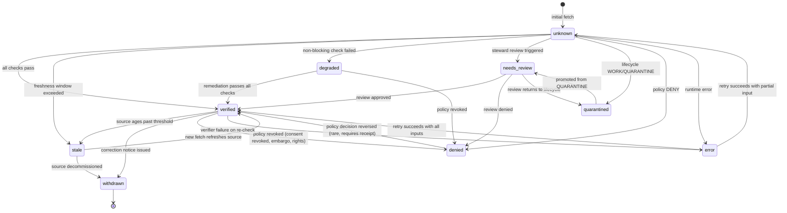

<!-- [KFM_META_BLOCK_V2]
doc_id: kfm://doc/standard/map-trust-states
title: Map Trust States — KFM Vocabulary and Visual Contract
type: standard
version: v1
status: draft
owners: <TBD: docs steward + map/UI lead + governance lead>
created: 2026-05-24
updated: 2026-05-24
policy_label: public
related: [
  docs/standards/EVIDENCE_BUNDLE.md,
  docs/standards/SENSITIVITY_RUBRIC.md,
  docs/standards/REDACTION_DETERMINISM.md,
  docs/standards/PROV/README.md,
  docs/standards/DUO_PROFILE.md,
  contracts/v1/runtime/,
  contracts/v1/evidence/,
  schemas/contracts/v1/runtime/,
  policy/render/,
  packages/maplibre-runtime/,
  packages/ui/,
  docs/architecture/map-shell.md,
  docs/architecture/governed-api.md,
  docs/doctrine/trust-membrane.md
]
tags: [kfm, standard, map, trust-state, maplibre, evidence-drawer, governance, ux, accessibility]
notes: [
  "Topical standards document (UPPERCASE_WITH_UNDERSCORES) per Directory Rules §6.1.a — names a cross-cutting KFM UI contract, not an external standard.",
  "Vocabulary canonicalizes KFM-P1-FEAT-0044 (verified/degraded/quarantined/denied/needs review/stale/error) and reconciles with kfm_unified_doctrine_synthesis §19 negative-state table.",
  "Implementation (MapLibre adapter, UI components, OPA rules, JSON Schema) lives elsewhere; see §2 Scope guardrail."
]
[/KFM_META_BLOCK_V2] -->

# Map Trust States — KFM Vocabulary and Visual Contract

> A single, finite vocabulary for the user-visible trust state of every governed map surface in KFM — the labels users see, the reasons that produce each label, and the visual contract that keeps those labels honest.

[](#)
[](#)
[](#)
[](#)
[](#)
[](#)
[](#)

| Status | Owners | Last reviewed |
|---|---|---|
| **draft** | _TBD — docs steward + map/UI lead + governance lead_ | 2026-05-24 |

---

> [!CAUTION]
> **Scope guardrail.** This document defines the **vocabulary**, **semantics**, and **visual contract** for map trust states. It does **not** define the implementation, the schema, the OPA rules, the CSS, or the React components. Those live in `packages/maplibre-runtime/`, `schemas/contracts/v1/runtime/`, `policy/render/`, and `packages/ui/`. If you find yourself writing code or rules here, stop and move to the canonical home — see §2.

---

## Quick jump

- [1. Purpose](#1-purpose)
- [2. Scope guardrail — what this doc is NOT](#2-scope-guardrail--what-this-doc-is-not)
- [3. Authority and standing](#3-authority-and-standing)
- [4. Canonical trust-state vocabulary](#4-canonical-trust-state-vocabulary)
- [5. Negative-state reasons](#5-negative-state-reasons)
- [6. How a state is computed](#6-how-a-state-is-computed)
- [7. Visual contract](#7-visual-contract)
- [8. State surfaces — where the state appears](#8-state-surfaces--where-the-state-appears)
- [9. State transitions](#9-state-transitions)
- [10. Anti-patterns](#10-anti-patterns)
- [11. Tensions and known limits](#11-tensions-and-known-limits)
- [12. Open questions](#12-open-questions)
- [13. Related docs](#13-related-docs)
- [Appendix A — Worked example: a stale hydrology layer](#appendix-a--worked-example-a-stale-hydrology-layer)
- [Appendix B — Vocabulary crosswalk](#appendix-b--vocabulary-crosswalk)

---

## 1. Purpose

KFM is map-first. Every layer the user sees is the **final, public-facing carrier** of an evidence chain that begins at a `SourceDescriptor` and threads through `EvidenceBundle`, `RunReceipt`, `PolicyDecision`, `PromotionDecision`, and `ReleaseManifest`. The user does not see that chain. The user sees a map.

CONFIRMED doctrine — KFM-P1-FEAT-0044, KFM-P1-FEAT-0042, and the *Master MapLibre Components-Functions-Features* category S — states that **map layers MUST expose trust state as first-class layer metadata** and that **viewers MUST fail closed or degrade visibly when verification cannot complete**. ML-061-140 hardens the rule: *"unknown, stale, or failed verification states need distinct visual treatment."*

The corpus also flags an open question (KFM-P1-FEAT-0044): *"What trust-state vocabulary should be shared across API, UI, and release manifests?"* This document is the proposed answer.

The vocabulary defined here governs:

1. **The label** a layer carries in its `TrustVisibleState` field — one of nine finite values.
2. **The reasons** that accompany a non-verified label — drawn from a finite reason set traceable to specific upstream checks.
3. **The visual treatment** every renderer MUST apply per label — distinguishable, accessible, and never substituting the badge for the Evidence Drawer.
4. **The surfaces** every state MUST propagate to — layer badge, Evidence Drawer, popup, export, review queue, AI answer panel.

> [!NOTE]
> The vocabulary is intentionally finite. *Verified-ish*, *probably-fine*, and *under-the-fold* are not states. If a layer's trust cannot be expressed in one of the nine labels in §4, the system fails closed.

[Back to top](#quick-jump)

---

## 2. Scope guardrail — what this doc is NOT

> [!IMPORTANT]
> The vocabulary here is the **what**. The **how** lives elsewhere. If you find yourself writing Rego, JSON Schema, React, or CSS in this document, stop and move it.

| If the content is about… | …it lives at | …not here |
|---|---|---|
| The `TrustVisibleState` JSON Schema | `schemas/contracts/v1/runtime/trust_visible_state.schema.json` (PROPOSED home) | this doc |
| The `TrustVisibleState` object meaning (contract Markdown) | `contracts/v1/runtime/trust_visible_state.md` (PROPOSED home) | this doc |
| The OPA rules that compute a state from EvidenceBundle / Policy / Source freshness | `policy/render/trust_state.rego` (PROPOSED home) | this doc |
| The MapLibre layer-style expressions that paint badges and hatches | `packages/maplibre-runtime/src/styles/trust-state/` (PROPOSED home) | this doc |
| The React components that render badges, banners, and the Evidence Drawer | `packages/ui/src/trust-state/` (PROPOSED home) | this doc |
| Design tokens (color values, contrast ratios, icon SVGs) | `packages/ui/src/design-tokens/` or `docs/brand/` (PROPOSED home) | this doc |
| Per-domain trust-state customization (e.g., archaeology CARE chips) | Domain-specific UI extensions referenced from this vocabulary | this doc |
| Tests and fixtures | `tests/standards/trust-state/`, `fixtures/standards/trust-state/` | this doc |
| Performance budgets for badge rendering | the *Master MapLibre Components-Functions-Features* category T | this doc |

What this document **does** own:

- The list of canonical trust-state labels and their definitions.
- The list of reasons that may attend a non-verified state.
- The visual contract every renderer MUST honor.
- The surface contract — where state must propagate to.
- The state-transition rules — when state changes.
- The anti-patterns this vocabulary exists to prevent.

[Back to top](#quick-jump)

---

## 3. Authority and standing

| Aspect | Value | Label |
|---|---|---|
| Document class | KFM-coined **topical standards document** | CONFIRMED per Directory Rules §6.1.a |
| Canonical path | `docs/standards/MAP_TRUST_STATES.md` | PROPOSED — sister to `EVIDENCE_BUNDLE.md`, `SENSITIVITY_RUBRIC.md`, `REDACTION_DETERMINISM.md` |
| Primary doctrine anchor | **KFM-P1-FEAT-0044** — "Map trust states as first-class layer metadata" | CONFIRMED |
| Companion doctrine | KFM-P1-FEAT-0042 (viewer-side verification fails closed); KFM-P1-FEAT-0065 (Evidence Drawer required); `kfm_unified_doctrine_synthesis.md` §19 (negative states and trust badges) | CONFIRMED |
| MapLibre report category | Category **S — Accessibility, UX, and Trust-Visible States** | CONFIRMED |
| Required objects referenced | `TrustVisibleState`, `EvidenceDrawerPayload`, `StaleSourceFixture`, `VerifyReceipt`, `LayerManifest`, `PolicyDecision`, `EvidenceBundle`, `RunReceipt`, `AIReceipt` | CONFIRMED (named in Master MapLibre Category S) |
| Authority **NOT** held by this doc | Schema, contract Markdown, policy code, UI components, MapLibre styles, design tokens, tests | CONFIRMED (Directory Rules §6.1.a) |

> [!NOTE]
> KFM-P1-FEAT-0044 lists the trust-state vocabulary as *"verified, degraded, quarantined, denied, needs review, stale, or error."* This document **preserves that list verbatim** (with normalized casing) and **PROPOSED-adds** two values — `unknown` and `withdrawn` — drawn from ML-S-032 and `kfm_unified_doctrine_synthesis.md` §19's `RELEASE_WITHDRAWN`. Adoption of those additions is a §12-class question.

[Back to top](#quick-jump)

---

## 4. Canonical trust-state vocabulary

The vocabulary is **finite and exhaustive**. A `TrustVisibleState` value MUST be one of these nine labels; no other value renders. Values use lowercase `snake_case`.

| Label | Meaning | Origin | Posture |
|---|---|---|---|
| `verified` | All upstream checks resolved successfully: `EvidenceBundle` resolved, `spec_hash` matched, signature valid, policy allowed, source within freshness window, sensitivity profile satisfied, release current. | CONFIRMED — KFM-P1-FEAT-0044 ("verified") | The only state that licenses authoritative rendering. |
| `degraded` | Layer renders, but at least one non-blocking quality check failed — e.g., partial fixture coverage, sub-tile rendering errors logged, watcher missed one of several refresh cadences. | CONFIRMED — KFM-P1-FEAT-0044 ("degraded"); ML-S-030 ("Degraded isolation must be explicit") | Rendering continues, with visible degradation; does not promote AI claims. |
| `stale` | The underlying source has not refreshed within its documented freshness window, or its `last_observed` timestamp exceeds the cadence threshold for its source class. | CONFIRMED — KFM-P1-FEAT-0044 ("stale"); ML-061-094, ML-061-118 | Renders with stale-state badge; popups, exports, and AI answers MUST surface staleness. |
| `unknown` | Verification could not be completed — not because it failed, but because a required input was unavailable (mirror offline, transparency log unreachable, schema not yet pinned). | PROPOSED extension — ML-S-032 ("Unknown is not failure but prevents authoritative") | Renders with explicit-unknown visual; does **not** promote authoritative use, but also does **not** deny. |
| `needs_review` | A steward review is pending — for example, after a CARE-flagged dataset enters PROCESSED, or after an AI-authored correction enters the review queue. | CONFIRMED — KFM-P1-FEAT-0044 ("needs review"); unified-doctrine §19 `REVIEW_PENDING` | Renders only in reviewer-authorized surfaces; public surfaces show `unknown` or `denied`. |
| `quarantined` | Layer is in WORK or QUARANTINE per the lifecycle. May render in operator surfaces; **MUST NOT** render in public surfaces. | CONFIRMED — KFM-P1-FEAT-0044 ("quarantined") | Operator-only; public surface fails closed. |
| `denied` | Policy explicitly denied rendering for this audience: rights, sensitivity, consent, embargo, or geoprivacy. | CONFIRMED — KFM-P1-FEAT-0044 ("denied"); unified-doctrine §19 `DENIED_BY_POLICY` | Layer is **not drawn**; the user sees a denial chip with reason, not a blank tile. |
| `withdrawn` | A previously released layer has been withdrawn or superseded; a correction notice exists. | PROPOSED extension — unified-doctrine §19 `RELEASE_WITHDRAWN` | Tile bytes may still exist in caches; the surface MUST render the withdrawn state, not the stale tile. |
| `error` | A runtime error blocked verification: governed API timeout, resolver crash, signature library exception, or schema-validation failure. | CONFIRMED — KFM-P1-FEAT-0044 ("error"); unified-doctrine §19 `RUNTIME_ERROR` | Fails closed; layer is not drawn; error chip surfaces the operator-grade reason. |

> [!IMPORTANT]
> Only `verified` licenses authoritative rendering. Every other label requires the surface to either **degrade visibly**, **withhold**, or **deny** — never silently render as if `verified`. Per KFM-P1-FEAT-0042: *"a viewer should fail closed or degrade visibly when artifact signatures, sidecars, hashes, policy state, or release manifests cannot be verified."*

### 4.1 Public vs. operator visibility

PROPOSED — implementation NEEDS VERIFICATION against mounted-repo evidence.

| State | Public map shell | Operator / steward surface | Diagnostic surface |
|---|---|---|---|
| `verified` | ✅ Render | ✅ Render | ✅ Render |
| `degraded` | ✅ Render with badge | ✅ Render with badge | ✅ Render with badge |
| `stale` | ✅ Render with stale chip | ✅ Render with stale chip | ✅ Render with stale chip |
| `unknown` | ✅ Render with unknown chip | ✅ Render | ✅ Render |
| `needs_review` | ⛔ Withhold (substitute `unknown`) | ✅ Render with review chip | ✅ Render |
| `quarantined` | ⛔ Deny | ✅ Render with quarantine chip | ✅ Render |
| `denied` | ⛔ Deny with reason chip | ⛔ Deny with reason chip | ✅ Show denial record |
| `withdrawn` | 🪦 Withdrawn chip, no tile | 🪦 Withdrawn chip with correction link | ✅ Show withdrawal record |
| `error` | ⛔ Error chip, no tile | ⛔ Error chip with operator reason | ✅ Show error record |

[Back to top](#quick-jump)

---

## 5. Negative-state reasons

A non-`verified` state MUST carry at least one **reason**. Reasons are drawn from a finite vocabulary — extending the negative-states table in `kfm_unified_doctrine_synthesis.md` §19 — and a single state may carry multiple reasons.

PROPOSED reason vocabulary, anchored on CONFIRMED doctrine:

| Reason code | Triggers | State(s) it can produce |
|---|---|---|
| `MISSING_EVIDENCE` | No `EvidenceBundle` resolves for this layer or claim. | `denied`, `unknown` |
| `EVIDENCE_HASH_MISMATCH` | `spec_hash` recomputation does not match the bundle's recorded hash. | `error`, `denied` |
| `SIGNATURE_INVALID` | Cosign signature does not verify, or Rekor entry missing. | `error`, `denied` |
| `SIGNATURE_UNAVAILABLE` | Sigstore / transparency log unreachable; signature not checkable now. | `unknown` |
| `SOURCE_STALE` | Source `last_observed` exceeds freshness threshold (ML-061-094). | `stale`, `degraded` |
| `SOURCE_DECOMMISSIONED` | Sensor or upstream marked offline (ML-061-118). | `stale`, `withdrawn` |
| `DENIED_BY_POLICY` | OPA returned DENY for this audience (sensitivity, rights, consent, embargo). | `denied` |
| `CONSENT_REVOKED` | Consent token revoked between promotion and render (DUO / GA4GH gate). | `denied`, `withdrawn` |
| `RESTRICTED_ACCESS` | Material exists at sensitivity tier the requester does not hold. | `denied` |
| `GENERALIZED_GEOMETRY` | Geometry transformed for public safety; original is restricted. | `degraded` (with `RedactionReceipt` link) |
| `CONFLICTED_SUPPORT` | Multiple sources disagree; no resolution recorded. | `degraded`, `needs_review` |
| `CITATION_FAILED` | A claim cites a source that did not resolve (forces ABSTAIN). | `error`, `denied` |
| `RELEASE_WITHDRAWN` | Prior release withdrawn; correction notice exists. | `withdrawn` |
| `REVIEW_PENDING` | Steward review in progress. | `needs_review` |
| `RUNTIME_ERROR` | Governed API / resolver failure. | `error` |
| `SCHEMA_VALIDATION_FAILED` | Layer or bundle failed schema validation at render time. | `error`, `denied` |
| `WATCHER_MISSED_REFRESH` | Source watcher missed a scheduled cadence. | `stale`, `degraded` |
| `CARE_CHIP_REQUIRED` | Layer carries CARE / sovereignty obligations (ML-061-160). | _Coexists with any state_; renders as a separate chip per §7.3. |

> [!NOTE]
> Reasons are **machine-readable**. The human-readable copy a user sees is rendered by `packages/ui/`, drawn from a documented copy registry. This document specifies **what reasons exist**, not what their copy says.

[Back to top](#quick-jump)

---

## 6. How a state is computed

PROPOSED. The implementation lives in `policy/render/trust_state.rego` (PROPOSED home); this section specifies the **inputs and precedence**, not the rule code.

### 6.1 Input ledger

| Input | Where it comes from | What it contributes |
|---|---|---|
| `EvidenceBundle` resolution | `EvidenceRef` → bundle resolver | Presence; `spec_hash` match; signature verification |
| `RunReceipt` chain | Bundle's `prov:wasGeneratedBy` round-trip | Lineage verification |
| `PolicyDecision` | OPA `policy.consent.render`, `policy.sensitivity.render`, `policy.rights.render` | ALLOW / DENY / ABSTAIN / ERROR per audience |
| `SourceDescriptor.freshness` | Source registry + observed cadence | Staleness computation |
| `SensitivityRubric` rank | `policy/sensitivity/` | Audience-vs-rank match |
| `ConsentSidecar` | Consent token + DUO codes (see `DUO_PROFILE.md`) | Consent ALLOW / DENY |
| `ReleaseManifest` | `release/manifests/` | Release-current vs withdrawn |
| `CorrectionNotice` | `correction/` registry | Withdrawal trigger |
| Runtime health | Governed API health probe | Error/unknown trigger |

### 6.2 Precedence rule

PROPOSED. When multiple inputs disagree, the state resolves by the **most-restrictive** rule:

```text
error > denied > withdrawn > quarantined > needs_review > unknown > stale > degraded > verified
```

A layer that would otherwise be `verified` but whose source is `stale` resolves to `stale`. A layer that is `stale` and `denied` resolves to `denied`. A layer that errors during verification resolves to `error` regardless of other inputs. This codifies the **fail-closed default**: doubt always demotes the state, never promotes it.

> [!WARNING]
> Precedence is non-negotiable. A renderer that displays a `verified` badge while any input has returned a non-allow result is a trust-membrane violation, not a configuration choice.

[Back to top](#quick-jump)

---

## 7. Visual contract

This section specifies **what the renderer MUST guarantee**, not the specific colors, icons, or pixel measurements. Design tokens live in `packages/ui/` and `docs/brand/`.

### 7.1 Distinct visual treatment per state

CONFIRMED requirement — ML-061-140: *"unknown, stale, or failed verification states need distinct visual treatment."* Each of the nine labels MUST be visually distinguishable through **at least two** of the following channels:

1. **Color** — hue MUST clear WCAG AA contrast against both light and dark map backgrounds.
2. **Icon / glyph** — non-color signal for color-blind users and grayscale displays.
3. **Text** — short label (e.g., "Stale", "Denied"), localizable.
4. **Pattern or hatching** — layer-level overlay (e.g., diagonal hatching for `stale`, crosshatch for `withdrawn`).
5. **Opacity / saturation** — controlled demotion for `degraded` and `stale`; not used alone.

Color or opacity **alone** does not satisfy the rule. Color + icon, or icon + text, is the minimum.

### 7.2 Accessibility floor

PROPOSED minimums — implementation NEEDS VERIFICATION:

- **Contrast:** badge foreground/background pairs meet WCAG AA (4.5:1 for text, 3:1 for non-text).
- **Keyboard:** every badge and chip is keyboard-focusable in tab order.
- **Screen reader:** every badge announces its state and at least one reason code; `aria-label` is required.
- **Color-only:** never the sole signal; see §7.1.
- **Motion:** any state-change animation respects `prefers-reduced-motion`.
- **Hit target:** ≥ 24 × 24 CSS px (PROPOSED — pending design-token review).
- **Snapshot tests:** visual-regression coverage for each state, light and dark themes (ML-057-018).

### 7.3 The CARE chip is separate

CONFIRMED — ML-061-160 / ML-061-164. CARE / sovereignty obligations render as a **separate chip** alongside the trust-state badge, never folded into it. A `verified` layer that carries CARE obligations renders as `verified` + `CARE` — two chips, not one composite.

> [!CAUTION]
> A trust-state badge is not a license. A `verified` badge on a CARE-flagged layer does **not** authorize use beyond what the sovereignty notice permits.

### 7.4 Export and screenshot preservation

CONFIRMED — ML-061-141. Every export and screenshot MUST preserve:

- The trust-state badge for each visible layer.
- The reason codes attached to non-verified states.
- The `ReleaseManifest` ID and `spec_hash`.
- A pointer back to the EvidenceBundle (URI, not bytes).

A screenshot that drops trust state and ships a clean-looking map is an evidence-laundering operation. The export pipeline MUST refuse to produce one.

[Back to top](#quick-jump)

---

## 8. State surfaces — where the state appears

CONFIRMED — KFM-P1-FEAT-0065: *"Evidence Drawer or equivalent trust-visible payloads should be available wherever users encounter public claims, map features, layer states, or AI summaries."*

| Surface | What it shows | Click behavior |
|---|---|---|
| **Layer badge** | State label + count of non-verified reasons (e.g., "Stale · 1 reason") | Click opens Evidence Drawer focused on the layer's bundle. |
| **Feature popup** | State for the feature, inherited from layer unless overridden | Click opens Evidence Drawer focused on the feature's bundle. |
| **Evidence Drawer** | Full state, all reasons, link to `EvidenceBundle`, `RunReceipt`, `PolicyDecision`, signature attestation | The Drawer is the authoritative trust surface; badges do not replace it (ML-061-139). |
| **Focus Mode panel** | Per-claim state with citation rows | Drives ABSTAIN behavior on `denied` / `error` / `citation_failed`. |
| **Review console** | Layer state from operator perspective; review-pending reasons foregrounded | Drives reviewer actions; not public-facing. |
| **Export / screenshot** | Preserved as overlay or footer per §7.4 | Static artifact; preserves IDs for re-resolution. |
| **AI answer panel** | Trust state of every cited layer or bundle | If any cited input is non-`verified`, AI MUST abstain or qualify; see `kfm_unified_doctrine_synthesis.md` §20. |
| **Release manifest** | Per-layer trust state at release time (CONFIRMED — KFM-P1-FEAT-0044) | Read-only audit trail. |
| **Governed API DTO** | `TrustVisibleState` field on every layer or feature response | Consumed by all client surfaces. |

> [!IMPORTANT]
> The vocabulary in §4 is **shared across all surfaces**. A layer that is `stale` in the layer badge MUST be `stale` in the popup, the Evidence Drawer, the export, the API DTO, and the release manifest. Surface-specific synonyms are prohibited.

[Back to top](#quick-jump)

---

## 9. State transitions

PROPOSED. Transitions are governed events; they are not silent.



PROPOSED — diagram synthesizes the lifecycle (RAW → WORK / QUARANTINE → PROCESSED → CATALOG / TRIPLET → PUBLISHED) with the render-time state machine. Tooling and implementation NEED VERIFICATION.

### 9.1 Transition obligations

PROPOSED. Every state transition MUST:

1. Be recorded in the layer's audit log alongside the inputs that triggered it.
2. Invalidate downstream caches (PMTiles index, tile server) when the transition changes public visibility — `verified → withdrawn`, `verified → denied`, `verified → stale`.
3. Issue a `tombstone` for `verified → withdrawn` per `kfm_unified_doctrine_synthesis.md` §19 `RELEASE_WITHDRAWN`.
4. Surface in the Evidence Drawer with the new reason set and a timestamp.

Transitions are not animations. They are governance events; the visual transition is the surface artifact.

[Back to top](#quick-jump)

---

## 10. Anti-patterns

CONFIRMED — accumulated from ML-061-090, ML-061-138, ML-061-139, ML-061-141, ML-S-029, ML-S-030, ML-058-034, and `kfm_unified_doctrine_synthesis.md` §19.

| Anti-pattern | Why it's wrong | Counter-rule |
|---|---|---|
| **Badge as proof substitute** (ML-061-090) | A badge is an annotation; proof is the EvidenceBundle. Treating the badge as proof is "visual trust theater." | Badges click through to the Drawer; the Drawer is the citation surface, not the badge. |
| **Silent blank tiles** (ML-S-063) | A blank tile is indistinguishable from a slow load. Users do not learn to distrust it. | `denied`, `withdrawn`, `error` MUST render a chip with reason; never a blank tile. |
| **Color-only state signal** (§7.1) | Excludes color-blind users; fails grayscale exports. | Always two channels (color + icon, icon + text, etc.). |
| **Hiding `degraded` to look clean** (ML-S-030) | "Looks clean" is the opposite of honest. | `degraded` MUST render with its badge. |
| **Composite CARE-into-trust badge** (§7.3) | Folds two orthogonal obligations into one visual; sovereignty becomes invisible. | CARE chip renders separately, always. |
| **Surface-specific vocabulary drift** (§8) | Layer badge says "stale," API DTO says "out_of_date," release manifest says "expired." | The vocabulary in §4 is shared across all surfaces. |
| **Suppressing `unknown` to avoid alarm** (ML-S-032) | Unknown is not failure, but it is also not verified. Suppressing it falsely promotes. | `unknown` renders as `unknown`; it does not borrow `verified`'s visual. |
| **Export drops badges** (ML-061-141) | A clean-looking screenshot detached from its trust state is misinformation by omission. | Exports preserve badge state, reasons, manifest ID, and EvidenceBundle pointer. |
| **AI answer ignores cited-layer state** (kfm_unified_doctrine_synthesis §20) | AI claims rendered against `stale` or `denied` data as if `verified`. | AI MUST inspect cited inputs' `TrustVisibleState` and ABSTAIN or qualify accordingly. |
| **Per-domain state proliferation** (Directory Rules §6.1.a) | Hydrology invents `stale_hydrology`; archaeology invents `denied_archaeology`. | The nine labels in §4 are exhaustive. Domain-specific differentiation lives in reason codes or the CARE chip, not in new states. |
| **Verification badge with no receipt** (ML-061-090) | Renders trust without the proof underneath. | A `verified` badge requires the EvidenceBundle, RunReceipt, signature, and policy decision to all be resolvable through the Drawer. |
| **Render-on-revoked-consent** (ML-058-034) | Layer continues rendering after consent revocation. | Render-time consent verification blocks invalid / revoked / expired displays; state transitions to `denied` immediately. |

[Back to top](#quick-jump)

---

## 11. Tensions and known limits

| Tension | Source | KFM posture |
|---|---|---|
| The corpus vocabulary in KFM-P1-FEAT-0044 has seven labels; the unified-doctrine §19 vocabulary has ten negative-state codes; this document proposes nine state labels plus ~18 reason codes. | KFM-P1-FEAT-0044, unified-doctrine §19 | The reconciliation is structural: state labels are the *primary axis* (one per layer); reasons are the *secondary axis* (multiple per non-verified state). Appendix B carries the crosswalk. |
| `unknown` is a PROPOSED extension; ML-S-032 supports it but KFM-P1-FEAT-0044 does not list it. | this document | Adoption decision is §12 item 1. |
| `withdrawn` is a PROPOSED extension; §19 has `RELEASE_WITHDRAWN` but KFM-P1-FEAT-0044 does not list it. | this document | Adoption decision is §12 item 2. |
| CARE chip is structurally separate, but visually adjacent — risk that users conflate them. | ML-061-160 | Per §7.3, the visual contract enforces separation; a/b accessibility tests should verify users can distinguish. |
| Distinguishing nine states visually without overwhelming the map. | §7.1 | Visual complexity is bounded by reusing icon-color-text combinations; not all nine appear on the same map at once in practice. |
| State at *layer* granularity vs *feature* granularity — when does a single feature override its layer's state? | KFM-P1-FEAT-0044 | PROPOSED rule: feature state overrides layer state when the feature carries its own `EvidenceBundle`; otherwise feature inherits. Resolution is §12 item 5. |
| Stale-threshold definition varies by source class. | ML-061-094, ML-061-118 | Thresholds live in `SourceDescriptor.freshness` per source class, not in this vocabulary. |
| AI answers can cite multiple layers with mixed states. | unified-doctrine §20 | Conservative rule: AI must answer in terms of the most-restrictive cited state. |
| `denied` chip leaks the existence of restricted content. | §6.2 (denied still renders a chip) | PROPOSED: for high-sensitivity tiers, the chip may say `unavailable` rather than `denied`; the reason is hidden but the state is honest. Resolution is §12 item 6. |

[Back to top](#quick-jump)

---

## 12. Open questions

UNKNOWN / NEEDS VERIFICATION items, tracked here until resolved by ADR or mounted-repo evidence.

1. **Adoption of `unknown` as a canonical label** — extends KFM-P1-FEAT-0044's vocabulary. PROPOSED yes; resolution by ADR or `docs/standards/README.md` rule.
2. **Adoption of `withdrawn` as a canonical label** — same shape; same resolution.
3. **Reason-code ID convention** — UPPER_SNAKE_CASE (e.g., `MISSING_EVIDENCE`) as proposed here, or a CURIE-style prefix (e.g., `kfm:trust:missing-evidence`)? NEEDS DECISION.
4. **Canonical visual contract artifact** — design-token registry path. PROPOSED: `packages/ui/src/design-tokens/trust-state.ts`. NEEDS VERIFICATION.
5. **Layer-vs-feature precedence rule** — when does a feature's state override its layer's state? PROPOSED in §11; needs ADR.
6. **Denial-leakage for high-sensitivity content** — should the chip say `denied` or `unavailable` when revealing the denial reason itself would leak sensitivity? PROPOSED per-tier policy.
7. **State transition cadence** — re-verification frequency (per session, per N minutes, per data event). NEEDS DECISION; affects performance budget per Master MapLibre category T.
8. **Export-watermark format** — how the trust badge and manifest ID are embedded in PNG / PDF exports. NEEDS DECISION; KFM-P5-PROG-0019 (reveal-key handler) is adjacent.
9. **Schema home for `TrustVisibleState`** — PROPOSED `schemas/contracts/v1/runtime/trust_visible_state.schema.json`. NEEDS VERIFICATION against ADR-0001.
10. **Crosswalk between this vocabulary and any external interoperability standard** — none identified to date; if a partner introduces one, the crosswalk lives here.

[Back to top](#quick-jump)

---

## 13. Related docs

PROPOSED links — verify all paths against mounted repo before publishing.

- [`docs/standards/EVIDENCE_BUNDLE.md`](./EVIDENCE_BUNDLE.md) — the bundle whose resolution is the primary input to `verified`.
- [`docs/standards/SENSITIVITY_RUBRIC.md`](./SENSITIVITY_RUBRIC.md) — _PROPOSED, not yet authored._ The rank that drives `denied` / `restricted_access` reasons.
- [`docs/standards/REDACTION_DETERMINISM.md`](./REDACTION_DETERMINISM.md) — _PROPOSED, not yet authored._ Drives `GENERALIZED_GEOMETRY` reason.
- [`docs/standards/DUO_PROFILE.md`](./DUO_PROFILE.md) — consent vocabulary; drives `CONSENT_REVOKED` reason.
- [`docs/standards/PROV/README.md`](./PROV/README.md) — provenance profile; the chain whose breakage produces `MISSING_EVIDENCE` / `CITATION_FAILED`.
- [`docs/standards/PMTILES.md`](./PMTILES.md) — published-tile profile; cache invalidation tied to `withdrawn` / `stale`.
- [`docs/architecture/map-shell.md`](../architecture/map-shell.md) — _PROPOSED placement._ The shell that consumes this vocabulary.
- [`docs/architecture/governed-api.md`](../architecture/governed-api.md) — _PROPOSED placement._ The DTO contract that carries `TrustVisibleState`.
- [`docs/doctrine/trust-membrane.md`](../doctrine/trust-membrane.md) — _PROPOSED placement._ The invariants this vocabulary is the surface expression of.
- `contracts/v1/runtime/trust_visible_state.md` — _PROPOSED contract home._ Object meaning.
- `schemas/contracts/v1/runtime/trust_visible_state.schema.json` — _PROPOSED schema home._ Machine shape.
- `policy/render/trust_state.rego` — _PROPOSED policy home._ Rule that computes the state from the §6 inputs.
- `packages/maplibre-runtime/src/styles/trust-state/` — _PROPOSED renderer home._ MapLibre style expressions.
- `packages/ui/src/trust-state/` — _PROPOSED UI home._ React components for badges, chips, Evidence Drawer integration.

[Back to top](#quick-jump)

---

<details>
<summary><strong>Appendix A — Worked example: a stale hydrology layer</strong></summary>

A `kfm:hydrology/streamflow-7day` layer fetched 36 hours ago. The source class declares a 24-hour freshness window. Walk-through:

**Inputs at render time:**

| Input | Value |
|---|---|
| `EvidenceBundle` resolved | ✅ yes; `spec_hash` matches; signature verifies |
| `RunReceipt` chain | ✅ resolves to a fetchable receipt |
| `PolicyDecision` | ✅ ALLOW for public audience |
| `SourceDescriptor.freshness.threshold_hours` | `24` |
| `SourceDescriptor.last_observed` | `36 hours ago` |
| `SensitivityRubric` | ✅ tier 0; no obstruction |
| `ConsentSidecar` | n/a (no human-subject data) |
| `ReleaseManifest` | ✅ current release |
| Runtime health | ✅ |

**Computation (§6.2 precedence):**

- All checks pass *except* freshness.
- Freshness exceeds threshold → reason `SOURCE_STALE`.
- Per precedence: `verified > stale`, so `stale` wins.

**Result:**

```json
{
  "trust_visible_state": "stale",
  "reasons": ["SOURCE_STALE"],
  "evidence_ref": "kfm://entity-bundle/<HEX>",
  "release_manifest_id": "kfm://release/2026-05-24/<HEX>",
  "last_observed": "<ISO-8601 — 36h ago>",
  "freshness_threshold_hours": 24
}
```

**What the user sees:**

- Layer renders with the stale badge per §7.1 (color + icon + "Stale" text).
- Popup on a feature carries the layer's `stale` state.
- Click on the badge opens the Evidence Drawer focused on this layer's `EvidenceBundle`, showing the resolved bundle, the policy ALLOW, **and** the freshness mismatch as the dominant non-passing check.
- Any AI answer citing this layer must qualify: "(streamflow data refreshed 36 hours ago, threshold 24 hours)."
- Export preserves the stale badge, reason code, manifest ID, and bundle pointer.

**What changes when the source refreshes:**

- New fetch → `SourceDescriptor.last_observed` advances.
- Watcher recomputes; staleness clears.
- State transitions `stale → verified`; transition recorded in audit log; downstream caches invalidated.
- Next render shows the verified badge; Drawer reflects the new bundle.

</details>

<details>
<summary><strong>Appendix B — Vocabulary crosswalk</strong></summary>

PROPOSED reconciliation between three corpus vocabularies, anchored on this document's §4 / §5.

### B.1 KFM-P1-FEAT-0044 (CONFIRMED) → this doc's state labels

| Corpus token | This doc's label | Notes |
|---|---|---|
| `verified` | `verified` | Verbatim. |
| `degraded` | `degraded` | Verbatim. |
| `quarantined` | `quarantined` | Verbatim. |
| `denied` | `denied` | Verbatim. |
| `needs review` | `needs_review` | Casing normalized to `snake_case`. |
| `stale` | `stale` | Verbatim. |
| `error` | `error` | Verbatim. |
| _(not in corpus list)_ | `unknown` | PROPOSED extension; ML-S-032 anchor; §12 item 1. |
| _(not in corpus list)_ | `withdrawn` | PROPOSED extension; unified-doctrine §19 anchor; §12 item 2. |

### B.2 kfm_unified_doctrine_synthesis.md §19 negative states → this doc's reasons + states

| §19 negative state | This doc's reason | Resulting state(s) |
|---|---|---|
| `MISSING_EVIDENCE` | `MISSING_EVIDENCE` | `denied`, `unknown` |
| `SOURCE_STALE` | `SOURCE_STALE` | `stale`, `degraded` |
| `DENIED_BY_POLICY` | `DENIED_BY_POLICY` | `denied` |
| `GENERALIZED_GEOMETRY` | `GENERALIZED_GEOMETRY` | `degraded` (with `RedactionReceipt` link) |
| `RESTRICTED_ACCESS` | `RESTRICTED_ACCESS` | `denied` |
| `CONFLICTED_SUPPORT` | `CONFLICTED_SUPPORT` | `degraded`, `needs_review` |
| `CITATION_FAILED` | `CITATION_FAILED` | `error`, `denied` |
| `RELEASE_WITHDRAWN` | `RELEASE_WITHDRAWN` | `withdrawn` |
| `RUNTIME_ERROR` | `RUNTIME_ERROR` | `error` |
| `REVIEW_PENDING` | `REVIEW_PENDING` | `needs_review` |

### B.3 Master MapLibre Category S required objects

| Object | Role | Home |
|---|---|---|
| `TrustVisibleState` | Carries the `state` + `reasons[]` shape this document defines. | `schemas/contracts/v1/runtime/` (PROPOSED) |
| `EvidenceDrawerPayload` | Drawer DTO that links back to bundle and receipts. | `contracts/v1/runtime/` (PROPOSED) |
| `StaleSourceFixture` | Test fixture for stale-state rendering. | `fixtures/standards/trust-state/` (PROPOSED) |
| `VerifyReceipt` | Verifier output recording which checks ran and their results. | `contracts/v1/runtime/` (PROPOSED) |

### B.4 Crosswalk rule

A renderer or service that emits the corpus seven-token vocabulary verbatim is **forward-compatible** with this document (the labels match). A renderer that emits a value not in §4 is **non-conforming**; the resolver MUST map it to `error` and log a vocabulary-drift event.

</details>

---

### Footer

> **Document class:** Topical standards document · **Scope:** Vocabulary, semantics, and visual contract for KFM map trust states · **Authority NOT held:** schema, contract Markdown, policy code, UI components, MapLibre styles, design tokens, tests.

| | |
|---|---|
| **Canonical homes** | Meaning → [`contracts/v1/runtime/`](../../contracts/v1/runtime/) · Shape → [`schemas/contracts/v1/runtime/`](../../schemas/contracts/v1/runtime/) · Rules → [`policy/render/`](../../policy/render/) · Renderer → [`packages/maplibre-runtime/`](../../packages/maplibre-runtime/) · UI → [`packages/ui/`](../../packages/ui/) |
| **Related** | [EVIDENCE_BUNDLE.md](./EVIDENCE_BUNDLE.md) · [DUO_PROFILE.md](./DUO_PROFILE.md) · [PROV/](./PROV/README.md) · [PMTILES.md](./PMTILES.md) |
| **Sister topical docs** | _SENSITIVITY_RUBRIC.md (PROPOSED)_ · _REDACTION_DETERMINISM.md (PROPOSED)_ |
| **Last updated** | 2026-05-24 |
| **Doc owner** | _TBD_ |

[Back to top](#quick-jump)
