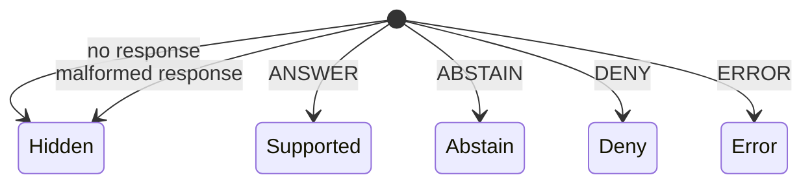

<!-- [KFM_META_BLOCK_V2]
doc_id: kfm://doc/standard/map-trust-states
title: Map Trust States — Repository-Grounded Profile and Projection Boundary
type: standard/profile
version: v2.0
status: "draft; repository-grounded; mixed-maturity"
owners:
  - "@bartytime4life"
created: 2026-05-24
updated: 2026-08-18
policy_label: repository-facing
owning_root: docs/
responsibility: "Describe the current repository-visible map and UI trust-state vocabularies, their independent axes, their projection boundaries, and the evidence required to graduate toward one governed cross-surface profile without redefining semantic, schema, policy, release, renderer, or runtime authority."
truth_posture: "CONFIRMED same-path standards placement, current bounded Explorer projection code, paired schemas, fixtures, validators, tests, and MapLibre package scaffold / PROPOSED semantic unification, cross-surface profile, visual tokens, renderer integration, and release binding / UNKNOWN live Governed API transport, deployed map routes, public release, production source resolution, and operational accessibility / NEEDS VERIFICATION accountable specialist stewardship and future adoption decisions"
evidence_snapshot: "main@c9cdafedec9e29fa8e9a28834601c1d426dd0e83; prior target blob 4ad18938932902f8660b306c143638fdb64430a1; docs standards README; ADR-0029; Explorer governed projection, Trust Header, Evidence Drawer, schemas, fixtures, validator, unit tests, workflow, app README, and MapLibre package README"
related:
  - docs/standards/README.md
  - docs/standards/EVIDENCE_BUNDLE.md
  - docs/architecture/ui/TRUST_BADGES.md
  - docs/architecture/ui/EVIDENCE_DRAWER.md
  - docs/architecture/map-shell.md
  - docs/brand/trust-state-visuals.md
  - contracts/ui/trust_badge_state.md
  - contracts/ui/evidence_drawer_payload.md
  - schemas/contracts/v1/ui/trust_badge_state.schema.json
  - schemas/contracts/v1/ui/evidence_drawer_payload.schema.json
  - fixtures/ui/evidence_drawer_payload/
  - tools/validators/ui/validate_evidence_drawer_payload.py
  - apps/explorer-web/src/adapters/GovernedClient.ts
  - apps/explorer-web/src/features/trust_header/index.tsx
  - apps/explorer-web/src/features/evidence_drawer/index.tsx
  - apps/explorer-web/tests/trust-header.test.ts
  - apps/explorer-web/README.md
  - packages/maplibre/README.md
notes:
  - "v2.0 replaces a proposal-era nine-label universal state model with a repository-grounded multi-axis profile."
  - "The current bounded Explorer profile uses finite response outcomes, Trust Header view states, six trust dimensions, and historical evidence dispositions; these are related but not interchangeable enums."
  - "The proposal-era TrustBadgeState four-value contract and permissive schema stub remain visible as unresolved authority rather than being silently promoted or deleted."
  - "This document changes human-readable guidance only. It does not amend a contract, schema, policy rule, fixture, validator, app, renderer, release record, or public surface."
[/KFM_META_BLOCK_V2] -->

<a id="top"></a>

# Map Trust States — Repository-Grounded Profile and Projection Boundary

> Map trust is not one badge and not one universal enum. It is a governed projection of **finite outcome, policy, review, release, freshness, correction, source role, and evidence history** into a public-safe UI surface.


> [!IMPORTANT]
> **This page is a human-readable profile and crosswalk.** It does not create a canonical machine enum, resolve evidence, execute policy, authenticate review, authorize release, admit a renderer, expose lifecycle stores, or publish a map. Semantic meaning belongs in `contracts/`; machine shape belongs in `schemas/`; admissibility belongs in `policy/`; current behavior belongs in code, fixtures, validators, tests, workflows, and runtime evidence; release authority belongs in `release/`.

> [!CAUTION]
> **The previous edition overclaimed convergence.** Its nine lowercase labels and universal precedence chain were useful proposal-era design pressure, but current repository evidence does not establish them as the implemented or adopted KFM-wide state machine. This edition preserves their lineage in [Appendix B](#appendix-b--vocabulary-crosswalk) without presenting them as current machine authority.

<a id="quick-jump"></a>

**Quick navigation:** [Status](#0-current-evidence-snapshot) · [Purpose](#1-purpose) · [Scope](#2-scope-guardrail--what-this-doc-is-not) · [Authority](#3-authority-and-standing) · [Axes](#4-canonical-trust-state-vocabulary) · [Reasons](#5-negative-state-reasons) · [Computation](#6-how-a-state-is-computed) · [Visuals](#7-visual-contract) · [Surfaces](#8-state-surfaces--where-the-state-appears) · [Transitions](#9-state-transitions) · [Anti-patterns](#10-anti-patterns) · [Limits](#11-tensions-and-known-limits) · [Backlog](#12-open-questions) · [Validation](#13-validation-and-proof-limits) · [Related](#13-related-docs) · [Rollback](#15-change-protocol-and-rollback)

---

## 0. Current evidence snapshot

The observations below are pinned to `main@c9cdafedec9e29fa8e9a28834601c1d426dd0e83`. They prove tracked repository state at that revision. They do not prove deployed behavior, source truth, policy approval, human review, release approval, public availability, or operational conformance.

| Surface | CONFIRMED repository state | Bounded conclusion |
|---|---|---|
| This document | Existing path; prior blob `4ad18938932902f8660b306c143638fdb64430a1`; proposal-era nine-label model | Same-path semantic reconciliation is warranted |
| Standards lane | `docs/standards/README.md` classifies this path as human-readable map trust-state guidance | Placement is supported; standards prose is not machine authority |
| UI semantic contract | `contracts/ui/trust_badge_state.md` is draft / PROPOSED and names four UI states: `VERIFIED`, `STALE`, `UNKNOWN`, `FAILED` | A proposal-era semantic family exists, but it is not yet a closed adopted profile |
| UI schema stub | `schemas/contracts/v1/ui/trust_badge_state.schema.json` requires only `id`, allows undeclared fields, and contains no state enum | The four-state contract is not machine-enforced by its paired schema |
| Evidence Drawer projection | Closed schema, public-safe profile, fixtures, validator, tests, adapter, and UI resolver exist | A bounded fixture-first projection is implemented |
| Trust Header projection | App code and unit tests exist for `SUPPORTED`, `ABSTAIN`, `DENY`, and `ERROR`, plus hidden missing/invalid states | Current browser trust chrome is narrower and different from the previous nine-label model |
| Explorer default | The composed app defaults to `ABSTAIN / NO_GOVERNED_RESPONSE` and exposes no live map or live governed transport | Bounded slices do not establish a released map application |
| MapLibre package | `packages/maplibre/` is a private `0.0.0` scaffold with a placeholder export and no established runtime consumer | Map-layer paint, hatching, popup, or renderer-state behavior remains unproven |
| Review routing | Repository-default CODEOWNERS routes this path to `@bartytime4life` | One GitHub review route is verified; independent evidence, UI, accessibility, policy, and release stewardship remain `NEEDS VERIFICATION` |

### 0.1 Maturity summary

```text
CONFIRMED
  same-path standards guidance
  closed EvidenceDrawerPayload schema
  fixture-first validator and negative tests
  defensive browser adapter
  Evidence Drawer projection
  Trust Header projection
  no-network and no-internal-store boundaries

PROPOSED
  TrustBadgeState semantic contract
  one cross-surface map-trust object
  shared layer/feature trust projection
  visual-token and renderer contract
  release-manifest and export parity

HOLD / UNKNOWN
  admitted MapLibre runtime
  live Governed API transport
  released public map layers
  production evidence resolution
  operational policy and review binding
  deployment, public availability, and publication
```

[Back to top](#top)

---

<a id="1-purpose"></a>

## 1. Purpose

KFM is map-first, but the map remains downstream of evidence, policy, review, release, correction, and rollback. This page gives maintainers and implementers a reliable answer to four questions:

1. **Which trust-related vocabularies are actually present in the repository?**
2. **Which vocabulary belongs to which bounded surface?**
3. **What does current executable validation prove—and not prove?**
4. **What decisions and implementation work remain before KFM can claim one governed map-trust profile?**

The current repository does **not** support reducing every concern to one label. A public-safe map response may simultaneously have:

- a finite response outcome;
- a Trust Header view state;
- a source role;
- a policy state;
- a review state;
- a release state;
- a freshness state;
- a correction state; and
- zero or more historical evidence dispositions.

Those axes must remain separable so a `WITHDRAWN` release is not confused with a runtime `ERROR`, a `STALE` source is not confused with policy `DENY`, and a `CORRECTED` answer does not silently make superseded evidence current again.

### 1.1 Operating rule

> **Project trust state; do not invent it in the renderer.**

The intended direction is:

```text
governed response or released public-safe artifact
  -> strict app-local validation
  -> bounded trust projection
  -> Trust Header / Evidence Drawer / future map surface
```

The browser may validate and project a bounded response. It must not resolve source truth, execute policy, approve review, promote lifecycle state, or infer trust from pixels, route parameters, feature properties, cache presence, or generated language.

[Back to top](#top)

---

<a id="2-scope-guardrail--what-this-doc-is-not"></a>

## 2. Scope guardrail — what this doc is not

This document owns **human-readable vocabulary reconciliation, projection boundaries, implementation status, proof limits, and graduation guidance**.

| Concern | Owning surface | Role of this page |
|---|---|---|
| UI badge meaning | [`contracts/ui/trust_badge_state.md`](../../contracts/ui/trust_badge_state.md) | Report current proposal and unresolved naming |
| Evidence Drawer public-safe meaning | [`contracts/ui/evidence_drawer_payload.md`](../../contracts/ui/evidence_drawer_payload.md) | Explain the bounded projection |
| Trust-badge machine shape | [`schemas/contracts/v1/ui/trust_badge_state.schema.json`](../../schemas/contracts/v1/ui/trust_badge_state.schema.json) | Report that it is a permissive stub |
| Evidence Drawer machine shape | [`schemas/contracts/v1/ui/evidence_drawer_payload.schema.json`](../../schemas/contracts/v1/ui/evidence_drawer_payload.schema.json) | Crosswalk exact current enums |
| Admissibility | `policy/` and governed review | Never infer allow/deny here |
| Evidence support | Evidence contracts, resolver, and evidence objects | Never turn UI state into evidence |
| Browser projection | [`apps/explorer-web/`](../../apps/explorer-web/) | Report implemented bounded behavior |
| Renderer and map lifecycle | [`packages/maplibre/`](../../packages/maplibre/) and an accepted adapter decision | Record current HOLD/scaffold posture |
| Visual design | [`docs/brand/trust-state-visuals.md`](../brand/trust-state-visuals.md) plus future verified tokens/components | Separate proposal from implementation |
| Release, withdrawal, rollback | `release/` plus correction and rollback authorities | Do not approve or perform transitions |
| Fixtures and validation | [`fixtures/ui/evidence_drawer_payload/`](../../fixtures/ui/evidence_drawer_payload/) and [`tools/validators/ui/`](../../tools/validators/ui/) | State exact bounded proof |
| Public deployment | Deployment/runtime evidence | `UNKNOWN` in this document |

This page must not become:

- a second semantic contract;
- a parallel schema registry;
- a policy rule expressed in prose;
- a renderer plugin allowlist;
- a release manifest;
- an evidence or proof store;
- a promise that every map, popup, export, AI answer, or catalog currently shares one state;
- a substitute for source-specific freshness rules;
- a substitute for accessibility testing; or
- a declaration that a fixture-first browser projection is published truth.

[Back to top](#top)

---

<a id="3-authority-and-standing"></a>

## 3. Authority and standing

| Aspect | Current standing |
|---|---|
| Path | `docs/standards/MAP_TRUST_STATES.md` — existing same-path standards guidance |
| Placement basis | Accepted ADR-0029 / Directory Rules v2 plus the current `docs/standards/README.md` boundary |
| Human-readable authority | Vocabulary reconciliation, evidence limits, navigation, and graduation guidance |
| Semantic authority | `contracts/`, currently including the draft `TrustBadgeState` and `EvidenceDrawerPayload` contracts |
| Machine-shape authority | `schemas/contracts/v1/`, currently including a permissive trust-badge stub and a closed Evidence Drawer projection |
| Executable behavior | Current Explorer adapter, Trust Header, Evidence Drawer, tests, and validators at a pinned revision |
| Policy authority | `policy/` plus authorized review; not this document |
| Release authority | `release/` and its governing evidence/review objects; not this document |
| Review route | `@bartytime4life` through repository-default CODEOWNERS |
| Adoption state | No repository evidence reviewed for this revision establishes a single adopted KFM-wide map-trust enum |
| Publication state | No public KFM map release is established by this page |

### 3.1 Normative language

`MUST`, `SHOULD`, and `MAY` in this page have one of three roles:

1. report an already enforced bounded implementation rule;
2. report a higher-authority KFM invariant; or
3. mark a clearly labeled `PROPOSED` graduation requirement.

A normative verb without its authority or status does not make a proposal adopted.

### 3.2 Negative authority

A green check for this Markdown proves only the checked documentation assertions. A green Evidence Drawer validator proves only its declared schema and semantic profile. A passing browser unit test proves only the tested projection. None proves:

- that evidence is true or complete;
- that policy allowed a real request;
- that review occurred;
- that a release is current;
- that MapLibre rendered a released layer;
- that a user can access a deployed app; or
- that KFM published a claim.

[Back to top](#top)

---

<a id="4-canonical-trust-state-vocabulary"></a>

## 4. Current trust vocabulary: independent axes, not one enum

The heading anchor is retained for compatibility with the previous edition. The current finding is that **no single repository-grounded canonical trust-state enum spans all map and UI surfaces**.

### 4.1 Vocabulary map

| Axis | Current values | Current owner / evidence | Status |
|---|---|---|---|
| Governed response outcome | `ANSWER`, `ABSTAIN`, `DENY`, `ERROR` | Closed Evidence Drawer schema, adapter, validator, fixtures | **CONFIRMED bounded implementation** |
| Trust Header view state | `SUPPORTED`, `ABSTAIN`, `DENY`, `ERROR` | `trust_header/index.tsx` and unit tests | **CONFIRMED bounded implementation** |
| Trust Header visibility | `VISIBLE`, `HIDDEN` | `trust_header/index.tsx` | **CONFIRMED bounded implementation** |
| Source role | `authoritative`, `official`, `derived`, `context` | Evidence Drawer projection | **CONFIRMED bounded implementation** |
| Policy | `ALLOW`, `ABSTAIN`, `DENY`, `ERROR` | Evidence Drawer projection; caller-supplied field checked by schema/adapter | **CONFIRMED shape; policy execution not performed in browser** |
| Review | `REVIEWED`, `PENDING`, `NOT_APPLICABLE` | Evidence Drawer projection | **CONFIRMED bounded implementation** |
| Release | `RELEASED`, `UNRELEASED`, `WITHDRAWN` | Evidence Drawer projection | **CONFIRMED bounded implementation** |
| Freshness | `CURRENT`, `STALE`, `UNKNOWN` | Evidence Drawer projection | **CONFIRMED bounded implementation** |
| Correction | `NONE`, `CURRENT`, `CORRECTED`, `SUPERSEDED` | Evidence Drawer projection | **CONFIRMED bounded implementation** |
| Historical evidence disposition | `HELD`, `DENIED`, `SUPERSEDED`, `REVOKED`, `WITHDRAWN` | Evidence Drawer history profile | **CONFIRMED bounded implementation** |
| Proposal-era UI badge state | `VERIFIED`, `STALE`, `UNKNOWN`, `FAILED` | Draft semantic contract and UI architecture | **PROPOSED; paired schema does not enforce enum** |
| Previous edition composite list | `verified`, `degraded`, `stale`, `unknown`, `needs_review`, `quarantined`, `denied`, `withdrawn`, `error` | Prior version of this page | **Historical proposal; not current machine authority** |

### 4.2 Governed response outcomes

The current public-safe Explorer projection uses the same four finite outcomes as the wider governed-response posture:

| Outcome | Current bounded meaning |
|---|---|
| `ANSWER` | The projection contains `SUPPORTED`, evidence references, citations, and the required trust-dimension combination |
| `ABSTAIN` | The projection cannot support an answer within the bounded profile; no unsupported claim is shown |
| `DENY` | Policy or rights posture blocks public detail; the public projection prevents support/history leakage |
| `ERROR` | The governed projection could not complete; the public projection prevents evidence/history leakage |

`ANSWER` is not a synonym for evidence truth, human approval, or release authorization. The browser accepts a profile-conforming projection; it does not independently prove the upstream facts represented by the fields.

### 4.3 Trust Header view states

The Trust Header translates the governed outcome into app-local chrome:

| Input condition | Header visibility | Header state | Detail behavior |
|---|---:|---|---|
| No governed response | `HIDDEN` | internal fallback `ERROR` | No header, no drawer action |
| Malformed governed response | `HIDDEN` | internal fallback `ERROR` | No partial render; protected fields are not reflected |
| `ANSWER` | `VISIBLE` | `SUPPORTED` | Six text-first badges; Evidence Drawer action allowed |
| `ABSTAIN` | `VISIBLE` | `ABSTAIN` | Fixed no-leak copy; outcome badge only |
| `DENY` | `VISIBLE` | `DENY` | Fixed no-leak copy; outcome badge only |
| `ERROR` | `VISIBLE` | `ERROR` | Fixed no-leak copy; outcome badge only |

For `ANSWER`, the six current badges are:

```text
Outcome · Policy · Review · Release · Freshness · Correction
```

Source role is carried in the Evidence Drawer projection but is not one of the six current Trust Header badges.

### 4.4 Multi-dimensional trust state

The Evidence Drawer does not collapse policy, review, release, freshness, and correction into one global label. This is intentional.

Example:

```text
outcome    = ANSWER
policy     = ALLOW
review     = REVIEWED
release    = RELEASED
freshness  = CURRENT
correction = CORRECTED
```

The response is supported while still disclosing that correction lineage exists. The prior superseded evidence remains audit-visible history and cannot resolve as current support.

Another example:

```text
outcome    = ABSTAIN
policy     = ABSTAIN
release    = RELEASED
freshness  = STALE
reason     = STALE_EVIDENCE
```

Here, `STALE` is a freshness value, not a replacement for the finite outcome. The public result is `ABSTAIN`.

### 4.5 Historical dispositions are not current support

The current history object preserves:

- held evidence;
- denied evidence;
- superseded evidence;
- revoked evidence;
- withdrawn evidence; and
- correction edges from prior to active evidence.

Every historical negative record is marked:

```text
visible_in_runtime = true
resolvable_as_current = false
```

Visibility in an audit/history surface is therefore not permission to use that evidence as current claim support.

### 4.6 Proposal-era four-state contract

`contracts/ui/trust_badge_state.md` defines a draft semantic projection with:

```text
VERIFIED · STALE · UNKNOWN · FAILED
```

Its paired schema currently requires only `id`, allows additional properties, and contains no enum for `state`. This means:

- the prose contract is useful design guidance;
- the schema does not yet prove the proposed state family;
- current Trust Header code does not consume that four-state object; and
- adopting or retiring the object name requires a separate contract/schema decision.

### 4.7 Status of the previous nine-label list

The former list mixed at least five concerns:

- positive support (`verified`);
- quality/freshness (`degraded`, `stale`, `unknown`);
- lifecycle/review (`quarantined`, `needs_review`);
- policy (`denied`);
- release/correction (`withdrawn`); and
- runtime failure (`error`).

That compression is easy to render but hard to govern. It can hide which authority produced the state and can create impossible precedence assumptions. This edition therefore keeps the labels only as a historical crosswalk, not as a claim that KFM currently emits one nine-value object.

[Back to top](#top)

---

<a id="5-negative-state-reasons"></a>

## 5. Current reason codes and negative-history vocabulary

A finite outcome is accompanied by a stable reason code. The current Evidence Drawer schema and adapter recognize these values:

| Family | Codes | Current role |
|---|---|---|
| Supported | `SUPPORTED` | Required by `ANSWER` |
| Evidence insufficiency | `MISSING_EVIDENCE`, `STALE_EVIDENCE`, `CITATION_UNRESOLVED` | Supports bounded abstention paths |
| Policy and exposure | `POLICY_DENIED`, `RIGHTS_UNRESOLVED`, `SENSITIVE_DETAIL_RESTRICTED` | Supports denial and safe public copy |
| Operational failure | `UPSTREAM_ERROR` | Required by the current `ERROR` profile |
| Historical/non-current evidence | `HELD_EVIDENCE`, `SUPERSEDED_EVIDENCE`, `WITHDRAWN_EVIDENCE`, `REVOKED_EVIDENCE` | Binds historical dispositions that cannot become current support |

### 5.1 Current history-state binding

| Historical state | Allowed matching reason(s) |
|---|---|
| `HELD` | `HELD_EVIDENCE` |
| `DENIED` | `POLICY_DENIED`, `RIGHTS_UNRESOLVED`, `SENSITIVE_DETAIL_RESTRICTED` |
| `SUPERSEDED` | `SUPERSEDED_EVIDENCE` |
| `REVOKED` | `REVOKED_EVIDENCE` |
| `WITHDRAWN` | `WITHDRAWN_EVIDENCE` |

The validator rejects a history state and reason that describe different dispositions.

### 5.2 Public no-leak rule

The current bounded projection deliberately narrows negative responses:

- `DENY` cannot expose current evidence references or citations;
- `DENY` cannot expose history identifiers;
- `ERROR` cannot expose evidence, citations, or history;
- the Trust Header uses fixed generic copy for `ABSTAIN`, `DENY`, and `ERROR`;
- malformed input yields no renderable header; and
- tests use private-field and sensitive-detail canaries to verify non-reflection.

The user-visible reason may therefore be less detailed than the internal review record. That is a policy-safe projection boundary, not missing auditability.

### 5.3 What is not established

This profile does not establish:

- one repository-wide reason-code registry;
- external interoperability for these codes;
- per-domain extension rules;
- a public/operator reason redaction policy beyond the bounded current projection;
- stable numeric identifiers; or
- a guarantee that every API, release manifest, layer manifest, or AI surface uses these exact codes.

[Back to top](#top)

---

<a id="6-how-a-state-is-computed"></a>

## 6. How the current bounded projection is computed

The current Explorer browser code is a **validator and projector**, not a policy engine or evidence resolver.

### 6.1 Inputs

The closed Evidence Drawer payload contains:

- profile identity;
- object ID;
- finite outcome;
- reason code;
- bounded title and summary;
- evidence references;
- HTTPS citations;
- limitations;
- six trust dimensions; and
- optional negative/correction history.

The browser adapter:

- accepts only exact known top-level and nested fields;
- bounds string and array sizes;
- rejects unsafe identifiers and malformed timestamps;
- requires HTTPS citation URLs;
- rejects cyclic correction history;
- rejects negative-history/current-support overlap; and
- freezes normalized projections before feature code consumes them.

### 6.2 Cross-field rules

The no-network validator and browser adapter enforce equivalent bounded semantics.

#### `ANSWER`

`ANSWER` requires:

- `reason_code = SUPPORTED`;
- at least one evidence reference;
- at least one citation;
- `policy = ALLOW`;
- `review = REVIEWED`;
- `release = RELEASED`;
- `freshness = CURRENT`; and
- current correction support that is not `SUPERSEDED`.

When correction history is present:

- `correction = CORRECTED`;
- the chain must be acyclic;
- each prior correction input must appear as superseded negative history;
- each terminal correction target must be bound as current evidence; and
- historical evidence cannot overlap current evidence.

#### `ABSTAIN`

`ABSTAIN` requires:

- a non-`SUPPORTED` reason; and
- `policy = ABSTAIN`.

Historical abstention reasons such as held, superseded, withdrawn, or revoked require the corresponding historical disposition. Superseded abstention also requires `correction = SUPERSEDED`.

#### `DENY`

`DENY` requires:

- a non-`SUPPORTED` reason;
- `policy = DENY`;
- no public current-support references;
- no citations; and
- no public history identifiers.

#### `ERROR`

`ERROR` requires:

- `reason_code = UPSTREAM_ERROR`;
- `policy = ERROR`; and
- no evidence, citation, or history detail in the public projection.

### 6.3 Trust Header projection

```text
missing input
  -> HIDDEN / NO_GOVERNED_RESPONSE

malformed input
  -> HIDDEN / INVALID_GOVERNED_RESPONSE

ANSWER
  -> VISIBLE / SUPPORTED / six badges / drawer action

ABSTAIN
  -> VISIBLE / ABSTAIN / fixed public copy / no drawer action

DENY
  -> VISIBLE / DENY / fixed public copy / no drawer action

ERROR
  -> VISIBLE / ERROR / fixed public copy / no drawer action
```

### 6.4 No universal precedence rule is implemented

The previous edition proposed:

```text
error > denied > withdrawn > quarantined > needs_review > unknown > stale > degraded > verified
```

Current repository evidence does not establish that precedence as executable KFM policy. The bounded implementation instead validates explicit cross-field combinations in one projection profile. A future universal reducer would need:

- an accepted semantic contract;
- a closed machine schema;
- policy ownership;
- an explicit public/operator exposure model;
- conflict and tie-breaking rules;
- positive and negative fixtures;
- deterministic tests; and
- migration behavior for existing surfaces.

Until then, implementers must not invent a browser-local “most restrictive” reducer that silently changes upstream meaning.

### 6.5 Computation boundaries

Current browser code performs no:

- network request;
- local or session persistence;
- RAW/WORK/QUARANTINE/PROCESSED/CATALOG/TRIPLET/PUBLISHED store access;
- source activation;
- evidence resolution;
- policy evaluation;
- review authentication;
- release mutation;
- correction mutation;
- model invocation; or
- publication.

[Back to top](#top)

---

<a id="7-visual-contract"></a>

## 7. Visual and accessibility contract

This section separates **implemented browser behavior** from **proposed map/rendering behavior**.

### 7.1 Confirmed in the current Trust Header slice

The current renderer is text-first:

- a semantic region is created only for a renderable state;
- the region uses `role="status"` or `role="alert"`;
- state-specific `aria-label` and `aria-live` values are set;
- badges render as term/value pairs in a description list;
- supported state may expose a keyboard-operable button to open the Evidence Drawer;
- negative states use fixed copy rather than reflecting protected payload detail; and
- missing or malformed input does not produce a partial header.

The code therefore supports non-color interpretation. It does **not** by itself prove complete accessibility conformance, keyboard behavior across a composed route tree, contrast, screen-reader interoperability, localization, zoom behavior, or production assistive-technology testing.

### 7.2 Confirmed in the current Evidence Drawer slice

The current drawer:

- uses a complementary landmark;
- exposes outcome and reason text;
- renders trust dimensions as text labels;
- preserves safe history labels;
- provides open, close, Escape, and focus-return behavior; and
- uses assertive live-region behavior for error.

Again, this is bounded component evidence, not complete app accessibility certification.

### 7.3 Proposed visual requirements

The following remain `PROPOSED` until backed by verified tokens, components, rendered fixtures, and tests:

- distinct iconography for every state or outcome;
- color and contrast tokens;
- layer hatching or opacity rules;
- `degraded`, `quarantined`, or `needs_review` map paint;
- feature-level override visuals;
- public/operator visual differences;
- dark-mode and high-contrast parity;
- `prefers-reduced-motion` transitions;
- map legend integration;
- screenshot/export watermarks; and
- cache/tile placeholder behavior for withdrawal or error.

[`docs/brand/trust-state-visuals.md`](../brand/trust-state-visuals.md) is useful proposal-era visual guidance. It is not current component or token implementation proof.

### 7.4 MapLibre boundary

No current evidence reviewed for this edition establishes:

- a MapLibre dependency in `apps/explorer-web/package.json`;
- a functioning `packages/maplibre` adapter;
- an admitted renderer version;
- a layer-badge binding;
- a trust-state paint expression;
- a popup integration;
- a released layer; or
- a public map boot.

Accordingly, this page must not prescribe exact MapLibre paint, layout, feature-state, source, or plugin behavior as current fact.

[Back to top](#top)

---

<a id="8-state-surfaces--where-the-state-appears"></a>

## 8. State surfaces and propagation status

The previous edition required one state to appear identically across every surface. Current repository evidence supports a narrower statement: **shared meaning and lineage are required, but each surface currently has a distinct bounded projection.**

| Surface | Current state | What is proved | What remains |
|---|---|---|---|
| GovernedClient adapter | Implemented bounded slice | Strict parsing and normalization of one public-safe profile | Live transport and upstream authority |
| Trust Header | Implemented bounded slice | Supported/negative/hidden projection and six badges | Route composition, real data, visual tokens |
| Evidence Drawer | Implemented bounded slice | Finite outcome, trust labels, history, no-leak negative copy | Live EvidenceBundle resolution |
| Default Explorer shell | Implemented fail-closed baseline | No-input abstention and defensive composition | Live map, route tree, authentication, deployment |
| Feature popup | `UNKNOWN` | No current evidence reviewed establishes trust-state popup wiring | Governed candidate-to-drawer integration |
| Layer Catalog | `UNKNOWN` | No current evidence reviewed establishes parity with this profile | Layer-level projection contract |
| MapLibre map layer | `HOLD` / scaffold | Package docs and placeholder exist | Renderer admission, runtime, layer binding |
| Export / screenshot | `PROPOSED` | Documentation expresses preservation goals | Machine contract, renderer, tests, release binding |
| Release manifest | `NEEDS VERIFICATION` | Release-related docs and contracts exist elsewhere | Per-layer trust projection at a released revision |
| Focus Mode / AI | `NEEDS VERIFICATION` | Finite outcome doctrine exists | Current mixed-input trust reducer and cited-layer behavior |
| Review console | `UNKNOWN` | Not inspected for this bounded update | Operator projection and redaction boundary |
| Public deployment | `UNKNOWN` | No deployment evidence in this profile | Hosting, auth, CSP, operations, public release |

### 8.1 Propagation rule

A future cross-surface profile should preserve:

- subject identity;
- finite outcome;
- reason code;
- source role;
- policy, review, release, freshness, and correction axes;
- evidence references where public-safe;
- release and correction lineage; and
- the public/operator redaction boundary.

It should **not** require every surface to use the same display enum if the underlying axes remain explicit and lossless.

### 8.2 Surface-specific synonyms

Surface-specific user copy may differ for accessibility or sensitivity, but machine fields must not silently change meaning. For example:

- public copy may say “View restricted” rather than expose a sensitive denial reason;
- the machine outcome remains `DENY`;
- the policy axis remains `DENY`; and
- the detailed internal decision remains in its owning authority surface.

[Back to top](#top)

---

<a id="9-state-transitions"></a>

## 9. State transitions and correction lineage

Current repository evidence establishes **projection changes based on different inputs**, not one persisted global map-state machine.

### 9.1 Current render transitions


```mermaid
stateDiagram-v2
  [*] --> Hidden : no response
  [*] --> Hidden : malformed response
  [*] --> Supported : ANSWER
  [*] --> Abstain : ABSTAIN
  [*] --> Deny : DENY
  [*] --> Error : ERROR
```

This diagram describes Trust Header rendering only. It does not authorize lifecycle or release transitions.

### 9.2 Axis-preserving examples

| Material change | Current profile expression |
|---|---|
| Source ages past its admitted window | `freshness: CURRENT -> STALE`; typically `outcome: ABSTAIN`, `reason_code: STALE_EVIDENCE` |
| Evidence is superseded | Negative history `SUPERSEDED`; `reason_code: SUPERSEDED_EVIDENCE`; correction axis may become `SUPERSEDED` or `CORRECTED` depending on current support |
| Release is withdrawn | `release: WITHDRAWN`; history may contain `WITHDRAWN`; current support cannot rely on withdrawn evidence |
| Policy blocks exposure | `policy: DENY`; `outcome: DENY`; no public evidence/history detail |
| Upstream service fails | `policy: ERROR`; `outcome: ERROR`; no public evidence/history detail |
| Complete correction chain becomes current | `correction: CORRECTED`; terminal active evidence supports `ANSWER`; priors remain superseded history |

### 9.3 Governance transitions remain upstream

A UI change is not a source admission, policy decision, review approval, release, correction, withdrawal, rollback, or publication event.

```text
upstream governed transition
  -> new public-safe projection
  -> UI rerender
```

The browser may reflect the result. It must not create the authority-bearing transition.

### 9.4 Cache and renderer invalidation

The previous edition stated that state changes invalidate PMTiles and tile-server caches. That is a reasonable future release requirement but is not proven by the current bounded Explorer profile. Cache invalidation, artifact withdrawal, tombstones, and renderer refresh must be specified and tested in their release and delivery authorities before being described as implemented.

[Back to top](#top)

---

<a id="10-anti-patterns"></a>

## 10. Anti-patterns

| Anti-pattern | Why it fails | Required posture |
|---|---|---|
| **One-enum collapse** | Hides which authority produced policy, freshness, review, release, correction, or runtime state | Keep axes explicit until an adopted reducer exists |
| **Badge as evidence** | A visual projection cannot substitute for EvidenceBundle support | Route supported detail to the Evidence Drawer |
| **`ANSWER` as release approval** | Browser profile validity does not authorize release | Preserve release authority and references separately |
| **Renderer-local policy** | Client filters can leak or misclassify sensitive data | Apply consequential policy and transformation upstream |
| **Pixels as truth** | Map paint, tile presence, or feature properties are carriers, not evidence | Resolve governed support |
| **Historical evidence as current** | Superseded, held, revoked, denied, or withdrawn records can contaminate claims | Preserve history with `resolvable_as_current: false` |
| **Negative-detail reflection** | Public error or denial UI can leak evidence IDs, sensitive canaries, or internal causes | Use fixed public-safe copy |
| **Malformed partial render** | Unknown fields or invalid combinations can bypass the trust membrane | Fail closed and render no partial header |
| **Universal precedence in browser code** | A client-local reducer silently becomes policy authority | Require contract, schema, policy, fixtures, and tests |
| **Four-state proposal treated as implemented** | The paired schema does not enforce it and current header code uses different values | Label contract/schema maturity precisely |
| **Nine-state proposal treated as canonical** | No current machine authority or consumer parity was verified | Keep it as lineage/crosswalk only |
| **Color-only trust meaning** | Trust becomes inaccessible and disappears in grayscale or screenshots | Text-first and non-color signals |
| **MapLibre capability claim from scaffolding** | Package presence does not prove dependency, adapter, runtime, or rendering | Keep renderer state on HOLD until admitted and tested |
| **Green check as publication proof** | Validator/test success covers only declared assertions | Report scope and non-effects |
| **Silent correction** | Users cannot reconstruct why support changed | Preserve correction and supersession lineage |
| **Docs-only adoption by assertion** | A standards page cannot accept a contract or policy by wording | Use the appropriate decision and owning roots |

[Back to top](#top)

---

<a id="11-tensions-and-known-limits"></a>

## 11. Tensions and known limits

| Tension | Current evidence | Safe posture |
|---|---|---|
| `TrustVisibleState` vs `TrustBadgeState` | Architecture and older standards text use the first; current semantic contract uses the second | `NEEDS DECISION`; do not create both as parallel machine authorities |
| Four badge states vs four finite outcomes | They describe different concerns and use different tokens | Keep distinct unless an adopted mapping closes semantics |
| Previous nine labels vs current axes | Nine labels compressed lifecycle, policy, release, quality, and runtime | Historical crosswalk only |
| Contract vs schema | Trust badge prose proposes fields; paired schema requires only `id` | Do not claim schema closure |
| Schema status vs executable consumer | Evidence Drawer schema says `PROPOSED`, while code, validator, fixtures, and tests consume it | Report “bounded implemented proposed profile,” not adopted universal contract |
| Caller-supplied trust fields vs executed policy | Browser validates values but does not execute policy, review, or release systems | Do not call browser projection an authority decision |
| Layer vs feature granularity | No current cross-surface contract reviewed closes inheritance/override | `NEEDS VERIFICATION` |
| Public vs operator reason detail | Current public negative paths intentionally hide detail | Preserve separate safe projection and internal audit record |
| Freshness thresholds | Profile carries `CURRENT/STALE/UNKNOWN`, but source-class computation is upstream | Threshold authority remains outside this page |
| Mixed-state AI input | No current reducer reviewed for multiple cited layers | AI must remain evidence- and policy-bounded; exact reducer is future work |
| Visual vocabulary | Proposal-era visual guidance exists; verified production tokens/components are not established | Keep visuals `PROPOSED` |
| MapLibre integration | Package is a scaffold and Explorer has no dependency | Renderer behavior remains `HOLD` |
| Default app vs isolated slices | Feature slices exist, but composed app remains no-input fail-closed | Do not imply integrated product maturity |
| Accessibility | Semantic markup exists; full operational conformance is unproven | Require focused component and composed-app verification |

[Back to top](#top)

---

<a id="12-open-questions"></a>

## 12. Dependency-ordered graduation backlog

These are verification and decision targets, not commitments made by this page.

### P0 — semantic and machine authority

1. Decide whether KFM needs one cross-surface `MapTrustProjection` object or a documented composition of existing outcome and trust axes.
2. Resolve `TrustVisibleState` versus `TrustBadgeState` naming without creating parallel contracts.
3. Expand, replace, or explicitly retire the permissive trust-badge schema stub.
4. Define which current enums are shared kernel and which are UI projection details.
5. Bind public/operator reason projection to policy so sensitive denial detail cannot leak.
6. Define an authoritative mapping from governed response and release state to a future layer/feature projection.
7. Add closed positive and negative fixtures for any adopted mapping.
8. Record compatibility and migration behavior for current Explorer consumers.

### P1 — map, UI, and accessibility realization

1. Resolve the MapLibre adapter and dependency-admission decisions before adding renderer-specific state.
2. Implement one synthetic, no-network layer-level projection behind the governed adapter boundary.
3. Define layer-to-feature inheritance and override rules.
4. Add text, icon, and non-color visual fixtures for supported and finite negative outcomes.
5. Test keyboard, focus, screen-reader labels, reduced motion, zoom, contrast, and high-contrast behavior.
6. Prove that compact layout, route changes, style changes, and active-layer changes cannot hide required trust state.
7. Bind source-class freshness results without computing consequential freshness ad hoc in the browser.
8. Add correction, withdrawal, and stale rerender tests without live source activation.

### P2 — cross-surface closure

1. Preserve projection identity and reason codes in exports and screenshots.
2. Bind released layer manifests to the public-safe trust projection.
3. Define cache invalidation and tombstone behavior for withdrawal/correction.
4. Prove parity across Trust Header, Evidence Drawer, layer catalog, popup, map, export, and read-only review surfaces.
5. Define mixed-input Focus Mode behavior and citation-state qualification.
6. Add safe telemetry that records projection behavior without raw evidence, protected geometry, or hidden policy detail.
7. Define interoperability mappings only when an actual external consumer requires them.
8. Add correction/rollback drills for the complete released-map path.

### 12.1 Decision triggers

A separate ADR or equivalent governed decision is warranted when work would:

- establish one new shared object family;
- rename or supersede an existing semantic contract;
- make a previously app-local enum cross-system authority;
- admit MapLibre or a renderer dependency;
- move contract/schema/policy homes;
- change public/operator exposure semantics; or
- define release-significant cache/withdrawal behavior.

[Back to top](#top)

---

<a id="13-validation-and-proof-limits"></a>

## 13. Validation and proof limits

### 13.1 Repository-native adjacent checks

The current executable profile is exercised by:

```bash
python tools/validators/ui/validate_evidence_drawer_payload.py --fixtures
python -m unittest -q tests.validators.test_validate_evidence_drawer_payload
pnpm --dir apps/explorer-web run test:unit
pnpm --dir apps/explorer-web run build
```

The dedicated read-only workflow also verifies the generated Evidence Drawer authoring receipt.

### 13.2 What those checks prove

Within the checked revision, they can prove:

- the closed schema accepts and rejects the intended fixture polarity;
- finite outcomes and reason codes satisfy declared cross-field rules;
- correction chains are acyclic;
- negative history cannot become current support;
- public `DENY` and `ERROR` projections do not carry forbidden support/history detail;
- the app-local adapter and feature view models behave as tested;
- Trust Header negative copy does not reflect protected canaries;
- current feature source contains no direct transport, browser persistence, lifecycle-store path, or model-runtime access; and
- the Explorer TypeScript/Vite build compiles when the locked environment succeeds.

### 13.3 What those checks do not prove

They do not prove:

- EvidenceRef-to-EvidenceBundle resolution;
- source accuracy or authority;
- policy execution;
- rights, sensitivity, or consent approval;
- authenticated human review;
- release or publication;
- live Governed API transport;
- MapLibre renderer admission;
- map-layer or popup behavior;
- production cache invalidation;
- complete accessibility conformance;
- deployed security posture;
- operational availability; or
- public KFM use.

### 13.4 Documentation validation expectations

A change to this page should additionally verify:

- KFM metadata parses;
- Markdown fences balance;
- explicit anchor IDs are unique;
- internal fragment links resolve;
- relative repository links exist at the pinned revision;
- no proposed path is presented as current fact;
- prior major fragment anchors remain available; and
- the resulting diff changes only the admitted documentation surface unless a dependency is independently required.

[Back to top](#top)

---

<a id="13-related-docs"></a>

## 14. Related repository surfaces

### Standards and architecture

- [`docs/standards/README.md`](./README.md) — lane boundary and authority split.
- [`docs/standards/EVIDENCE_BUNDLE.md`](./EVIDENCE_BUNDLE.md) — evidence-bundle profile and resolver boundary.
- [`docs/architecture/ui/TRUST_BADGES.md`](../architecture/ui/TRUST_BADGES.md) — proposal-era UI badge architecture.
- [`docs/architecture/ui/EVIDENCE_DRAWER.md`](../architecture/ui/EVIDENCE_DRAWER.md) — Evidence Drawer architecture.
- [`docs/architecture/map-shell.md`](../architecture/map-shell.md) — map-first governed-shell posture.
- [`docs/brand/trust-state-visuals.md`](../brand/trust-state-visuals.md) — proposal-era visual guidance.

### Contracts and schemas

- [`contracts/ui/trust_badge_state.md`](../../contracts/ui/trust_badge_state.md) — draft four-state UI semantic contract.
- [`schemas/contracts/v1/ui/trust_badge_state.schema.json`](../../schemas/contracts/v1/ui/trust_badge_state.schema.json) — permissive paired schema stub.
- [`contracts/ui/evidence_drawer_payload.md`](../../contracts/ui/evidence_drawer_payload.md) — public-safe UI projection semantics.
- [`schemas/contracts/v1/ui/evidence_drawer_payload.schema.json`](../../schemas/contracts/v1/ui/evidence_drawer_payload.schema.json) — closed projection schema.

### Implementation and proof

- [`apps/explorer-web/src/adapters/GovernedClient.ts`](../../apps/explorer-web/src/adapters/GovernedClient.ts) — strict app-local parser.
- [`apps/explorer-web/src/features/trust_header/index.tsx`](../../apps/explorer-web/src/features/trust_header/index.tsx) — current Trust Header projection.
- [`apps/explorer-web/src/features/evidence_drawer/index.tsx`](../../apps/explorer-web/src/features/evidence_drawer/index.tsx) — current Evidence Drawer projection.
- [`apps/explorer-web/tests/trust-header.test.ts`](../../apps/explorer-web/tests/trust-header.test.ts) — Trust Header unit evidence.
- [`fixtures/ui/evidence_drawer_payload/README.md`](../../fixtures/ui/evidence_drawer_payload/README.md) — fixture scope and non-effects.
- [`tools/validators/ui/validate_evidence_drawer_payload.py`](../../tools/validators/ui/validate_evidence_drawer_payload.py) — no-network validator.
- [`.github/workflows/evidence-drawer-payload.yml`](../../.github/workflows/evidence-drawer-payload.yml) — read-only bounded workflow.
- [`apps/explorer-web/README.md`](../../apps/explorer-web/README.md) — current app maturity boundary.
- [`packages/maplibre/README.md`](../../packages/maplibre/README.md) — renderer-package scaffold and HOLDs.

[Back to top](#top)

---

<a id="15-change-protocol-and-rollback"></a>

## 15. Change protocol and rollback

A material change to this profile should identify which authority is changing:

| Change | Minimum owning work |
|---|---|
| Add or remove a semantic state | Contract update, schema update, fixtures, validator, consumer migration, docs |
| Change finite outcome meaning | Governed response contract/policy review plus all consumers |
| Add a trust dimension | Contract/schema/fixtures/validator and UI projection review |
| Change public negative copy | UI, accessibility, sensitivity/no-leak review and tests |
| Add map paint or hatching | Admitted renderer path, visual tokens, accessible fallback, tests |
| Bind state to release | Release contract/schema, proof and rollback behavior |
| Change historical evidence behavior | Evidence/correction contract, validator, migration and replay tests |
| Rename `TrustVisibleState` or `TrustBadgeState` | ADR or equivalent decision, aliases, consumer migration, rollback |
| Claim cross-surface parity | Exact-revision evidence for every named consumer |

Rollback for this documentation-only revision is to revert its commit through the normal reviewed path. The prior blob remains recoverable at:

```text
4ad18938932902f8660b306c143638fdb64430a1
```

Restoring the prior text for historical analysis should retain a warning that its nine-label state machine was proposal-era guidance, not current implementation proof.

This page does not authorize contract/schema rollback, source-state rollback, release rollback, cache invalidation, deployment rollback, or public correction. Those transitions remain in their owning systems.

[Back to top](#top)

---

<a id="appendix-a--worked-example-a-stale-hydrology-layer"></a>

<details>
<summary><strong>Appendix A — Worked synthetic example: stale evidence</strong></summary>

This example mirrors the current bounded fixture profile. It is synthetic and carries no source, review, release, or publication authority.

```json
{
  "profile": "kfm.explorer.evidence-drawer.public-safe.v1",
  "id": "kfm:ui:evidence-drawer:synthetic-stale",
  "outcome": "ABSTAIN",
  "reason_code": "STALE_EVIDENCE",
  "title": "Evidence not sufficient",
  "summary": "Released evidence is stale for this request.",
  "evidence_refs": ["kfm:evidence:synthetic-stale"],
  "citations": [],
  "limitations": ["No unsupported claim is shown."],
  "trust_state": {
    "source_role": "official",
    "policy": "ABSTAIN",
    "review": "REVIEWED",
    "release": "RELEASED",
    "freshness": "STALE",
    "correction": "NONE"
  },
  "history": {
    "negative_outcomes": [],
    "corrections": []
  }
}
```

Current bounded behavior:

1. The adapter validates the exact profile and fields.
2. The Evidence Drawer renders `ABSTAIN / STALE_EVIDENCE` and safe trust labels.
3. The Trust Header renders `ABSTAIN`, fixed copy, and one outcome badge.
4. The Trust Header does not expose an Evidence Drawer action for the negative projection.
5. No map layer, popup, MapLibre paint, cache change, source refresh, or release transition is implied.

A later fresh response would be a new governed projection. The browser does not update `SourceDescriptor`, evaluate freshness policy, or promote the result itself.

</details>

[Back to top](#top)

---

<a id="appendix-b--vocabulary-crosswalk"></a>

<details>
<summary><strong>Appendix B — Previous nine-label vocabulary crosswalk</strong></summary>

This table preserves lineage without asserting one-to-one equivalence.

| Previous label | Closest current axis or surface | Why it is not a direct global mapping |
|---|---|---|
| `verified` | `ANSWER` + Trust Header `SUPPORTED`; proposal contract `VERIFIED` | Current `ANSWER` also requires explicit policy/review/release/freshness fields and remains a bounded projection |
| `degraded` | No current top-level Explorer outcome; possible future quality dimension | Current schema has no `degraded` enum |
| `stale` | `freshness = STALE`; usually `outcome = ABSTAIN`, reason `STALE_EVIDENCE` | Freshness and finite outcome are independent axes |
| `unknown` | `freshness = UNKNOWN`; proposal contract `UNKNOWN`; missing/malformed header paths | These cases have different semantics and visibility |
| `needs_review` | `review = PENDING`; historical `HELD`; possible `ABSTAIN` | Review and evidence disposition remain separate |
| `quarantined` | Historical `HELD` or upstream lifecycle QUARANTINE | Browser profile does not expose lifecycle stores or a `quarantined` top-level state |
| `denied` | `outcome = DENY`, `policy = DENY`; history `DENIED` | Public current denial and historical denied evidence are different |
| `withdrawn` | `release = WITHDRAWN`; history `WITHDRAWN`; reason `WITHDRAWN_EVIDENCE` | Release state, history, and outcome are distinct |
| `error` | `outcome = ERROR`, `policy = ERROR`, reason `UPSTREAM_ERROR`; malformed input may hide header | Operational failure and malformed-input fallback are distinct paths |

### B.1 Compatibility rule

No current consumer should emit the previous nine labels merely because this historical crosswalk exists. A future migration must define:

- source and target object identities;
- exact mapping and non-mappable cases;
- public/operator behavior;
- compatibility aliases;
- fixture polarity;
- deterministic validation;
- consumer inventory;
- correction behavior; and
- rollback.

</details>

[Back to top](#top)

---

### Footer

| Field | Value |
|---|---|
| Document class | Human-readable KFM standards/profile guidance |
| Current machine profile discussed | `kfm.explorer.evidence-drawer.public-safe.v1` |
| Current browser projection | Trust Header + Evidence Drawer bounded slices |
| Renderer state | HOLD / scaffold; no current MapLibre runtime proof in this profile |
| Authority not held | Evidence, semantic contract, schema, policy, review, release, renderer, deployment, publication |
| Evidence snapshot | `main@c9cdafedec9e29fa8e9a28834601c1d426dd0e83` |
| Prior blob | `4ad18938932902f8660b306c143638fdb64430a1` |
| Last updated | 2026-08-18 |
| Review route | `@bartytime4life`; specialist and independent stewardship `NEEDS VERIFICATION` |

[Back to top](#top)
