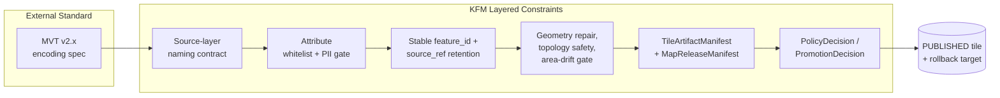
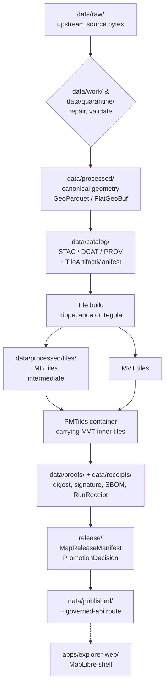
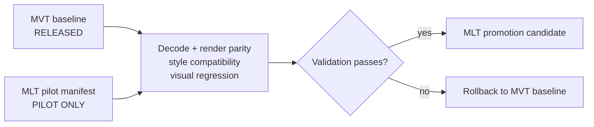

<!-- [KFM_META_BLOCK_V2]
doc_id: kfm://doc/standards/mvt
title: Mapbox Vector Tiles (MVT) — KFM Conformance Standard
type: standard
version: v1
status: draft
owners: <Map / Tile steward> + <Docs steward>   <!-- PLACEHOLDER — confirm via CODEOWNERS -->
created: 2026-05-14
updated: 2026-05-14
policy_label: public
related:
  - docs/doctrine/directory-rules.md
  - docs/doctrine/lifecycle-law.md
  - docs/doctrine/truth-posture.md
  - docs/doctrine/trust-membrane.md
  - docs/architecture/map-shell.md
  - docs/standards/STAC.md            # TODO — confirm filename
  - docs/standards/DCAT.md            # TODO — confirm filename
  - docs/standards/PROV.md            # TODO — confirm filename
  - schemas/contracts/v1/map/tile_artifact_manifest.schema.json   # PROPOSED
  - schemas/contracts/v1/map/map_release_manifest.schema.json     # PROPOSED
tags: [kfm, standards, mvt, vector-tiles, pmtiles, tiles]
notes:
  - "All path references are PROPOSED until verified against mounted-repo evidence per Directory Rules §0."
  - "Sections 2 and 9 cite the external MVT specification (EXTERNAL); all other claims are project-grounded."
[/KFM_META_BLOCK_V2] -->

# Mapbox Vector Tiles (MVT) — KFM Conformance Standard

> The external vector-tile encoding KFM uses as its **practical default**, and the KFM-specific rules layered on top of it before any MVT artifact may be released.

[](#0-status--authority)
[](../doctrine/directory-rules.md)
[](#2-the-external-standard)
[](#3-kfm-conformance-posture)
[](#9-relationship-to-mlt-pilot-posture)
[](#5-pipeline--lifecycle-placement)
<!-- TODO — replace with CI/coverage/last-updated badges once Shields targets are verified. -->

**Status:** Draft &nbsp;·&nbsp; **Owners:** Map / Tile steward + Docs steward *(placeholder — confirm via CODEOWNERS)* &nbsp;·&nbsp; **Last updated:** 2026-05-14

---

## Quick jump

- [0. Status & authority](#0-status--authority)
- [1. Purpose & scope](#1-purpose--scope)
- [2. The external standard](#2-the-external-standard)
- [3. KFM conformance posture](#3-kfm-conformance-posture)
- [4. KFM-specific constraints on top of MVT](#4-kfm-specific-constraints-on-top-of-mvt)
- [5. Pipeline & lifecycle placement](#5-pipeline--lifecycle-placement)
- [6. Required object families & manifests](#6-required-object-families--manifests)
- [7. Validation & CI gates](#7-validation--ci-gates)
- [8. Anti-patterns](#8-anti-patterns)
- [9. Relationship to MLT (pilot posture)](#9-relationship-to-mlt-pilot-posture)
- [10. STAC / DCAT / PROV crosswalk for MVT artifacts](#10-stac--dcat--prov-crosswalk-for-mvt-artifacts)
- [11. Open questions & NEEDS VERIFICATION](#11-open-questions--needs-verification)
- [Appendix A — Glossary](#appendix-a--glossary)
- [Appendix B — Illustrative manifest fragment](#appendix-b--illustrative-manifest-fragment)
- [Related docs](#related-docs)

---

## 0. Status & authority

| Field | Value |
|---|---|
| **Document type** | Standard / external-standard conformance doc |
| **Authority of this document** | CONFIRMED for the *posture* KFM takes toward MVT; specific implementation paths PROPOSED until verified against mounted-repo evidence |
| **Proposed canonical home** | `docs/standards/MVT.md` *(per Directory Rules §6.1: `docs/standards/` is "external standards KFM conforms to (STAC, DCAT, PROV, etc.)")* |
| **External standard referenced** | Mapbox Vector Tile Specification (MVT) v2.x — EXTERNAL |
| **KFM default vector tile encoding** | MVT — CONFIRMED doctrine |
| **MLT posture** | Pilot only, non-default until KFM validation completes — CONFIRMED doctrine |
| **Schema-home convention** | `schemas/contracts/v1/map/…` per ADR-0001 — PROPOSED |
| **Lifecycle invariant** | `RAW → WORK / QUARANTINE → PROCESSED → CATALOG / TRIPLET → PUBLISHED`; **MVT artifacts are downstream carriers**, not canonical geometry |

> [!IMPORTANT]
> MVT tiles are a **derived, delivery-time** representation. They are subordinate to canonical geometry, evidence, and release decisions. A vector tile is never proof of a claim; it is a public-safe carrier of features that resolve back to `EvidenceBundle`s through governed APIs.

---

## 1. Purpose & scope

This document defines:

1. How KFM **conforms to** the external Mapbox Vector Tile (MVT) specification.
2. The KFM-specific **constraints layered on top** of MVT before a tile may be released.
3. Where MVT artifacts sit in the KFM **pipeline and lifecycle**.
4. Which **object families, manifests, and validators** govern MVT artifacts.
5. Which patterns are **anti-patterns** that block release.

It does **not** decide:

- Whether a given dataset belongs in MVT, PMTiles, COG, or GeoParquet — that is a `LayerManifest` / `TileArtifactManifest` decision and is governed elsewhere.
- The shape of canonical geometry — that is governed by `contracts/`, `schemas/`, and the geometry-repair pipeline.
- Public release of any specific tileset — that is a `PromotionDecision` / `MapReleaseManifest` matter governed by `release/` and `policy/`.

> [!NOTE]
> When this doc and a mounted-repo file disagree, the repo wins for *current state* and this doc wins for *doctrine*. Open a drift entry in `docs/registers/DRIFT_REGISTER.md` rather than silently conforming.

---

## 2. The external standard

The Mapbox Vector Tile Specification (MVT) is an open, protocol-buffers–based, tiled encoding of vector geometry and feature attributes, designed to be served as immutable `z/x/y` tile artifacts and decoded incrementally by web map renderers. The specification is maintained at the [`mapbox/vector-tile-spec`](https://github.com/mapbox/vector-tile-spec) repository and is the de-facto interchange format for vector tiles across MapLibre, Mapbox, OpenLayers, deck.gl, and tippecanoe-class tooling. *(EXTERNAL — referenced for the external standard itself only; no KFM-implementation claim is made from this paragraph.)*

Practical properties relied on by KFM:

| Property | Value (per MVT v2.x) | KFM relevance |
|---|---|---|
| Container | Protocol buffer message per tile | Decode-time integrity must be verifiable from `TileArtifactManifest` digest, not by inspection alone |
| Geometry types | Point, LineString, Polygon (and multi-variants) | KFM enforces `MultiPolygon`, 2D, right-hand-rule **before** tile handoff |
| Feature attributes | Key/value typed pairs at the feature level | KFM **whitelists** attributes — see §4 |
| Layers within a tile | Multiple named "source layers" per tile | Source-layer names are **contract-bearing** for KFM styles |
| Feature IDs | Optional 64-bit unsigned integer | KFM requires **stable** feature IDs for filter-list and feature-state strategies |
| Tile scheme | XYZ (Web Mercator EPSG:3857) by default | KFM follows XYZ; TMS only by explicit justification |

> [!NOTE]
> The MVT spec governs **encoding**. It does **not** govern naming, attribute admissibility, provenance, rights, sensitivity, release, or rollback. Those are KFM's responsibility, layered in §4 below.

---

## 3. KFM conformance posture



**Posture in one sentence:** KFM treats MVT as the **practical default vector tile encoding** for public delivery, but no MVT artifact is released without KFM's geometry, attribute, manifest, policy, and promotion layers wrapped around it.

| Decision | KFM position | Evidence basis |
|---|---|---|
| Default vector tile encoding for public layers | **MVT** | Master MapLibre Components — MVT recorded as "current production baseline" / "practical default vector tile encoding" |
| Default vector tile container | **PMTiles carrying MVT inner tiles** | Master MapLibre Components — "PMTiles vector archives carry standard MVT inner tiles" |
| Default static tile generator | **Tippecanoe** for stable daily/weekly/monthly cadences | Master MapLibre Components — "Tippecanoe pre-generated tiles are preferred for stable daily/weekly/monthly layers" |
| Default dynamic MVT path | **Tegola / t_rex from PostGIS**, only where sub-hour cadence or per-request filtering is justified | Master MapLibre Components — "Dynamic MVT from PostGIS fits sub-hour updates or per-request filtering" |
| MBTiles posture | **Intermediate / build-time only**; convert to PMTiles for public delivery | Master MapLibre Components — "MBTiles should be converted to PMTiles for single-file CDN-friendly hosting" |
| MLT posture | **Pilot only**, non-default until KFM toolchain validation completes | Master MapLibre Components — "MLT is a pilot candidate, not default production format" |

> [!TIP]
> Choosing between static (Tippecanoe → PMTiles) and dynamic (Tegola/t_rex) MVT is a **cadence and filtering** decision, not a stylistic one. Pre-generate unless minute-level cadence, per-request filtering, or stewarded access requires otherwise.

[⬆ Back to top](#mapbox-vector-tiles-mvt--kfm-conformance-standard)

---

## 4. KFM-specific constraints on top of MVT

These are KFM rules. The MVT spec does not require them; KFM does, before any tile may be promoted.

### 4.1 Source-layer naming is contract-bearing

Source-layer names inside an MVT tile bind to `LayerManifest.source_layer` and to style JSON `source-layer` references. Renaming a source layer is a **contract change**, not a build-time tweak; it requires a manifest version bump and downstream style updates.

### 4.2 Attribute whitelisting (PII gate)

> [!CAUTION]
> **No vector-tile attribute is published unless it appears on the per-layer attribute whitelist.** Style filters and popups cannot retroactively suppress sensitive attributes that have already been encoded into public PMTiles.

- Whitelists are enforced at build time (e.g., Tippecanoe `-y <attr>` per allowed key) and verified by a CI fixture.
- The whitelist is owned by the `LayerManifest`, not by the style.
- PII, exact-location, rare-species precision, and rights-restricted attributes **MUST NOT** appear in public MVT.

### 4.3 Feature ID stability

Vector tile feature IDs **MUST** be stable across rebuilds of the same logical feature so that filter-list and feature-state interactions remain coherent. The stability anchor is the canonical feature identity, not the tile build order.

### 4.4 `source_ref` retention in features

Every feature in a public MVT tile **SHOULD** carry a `source_ref` (or equivalent governed attribute) that resolves to an `EvidenceRef`, which in turn resolves to an `EvidenceBundle` through the governed API. Tiles are carriers; evidence is sovereign.

### 4.5 Geometry preconditions

| Precondition | Rule | Failure mode |
|---|---|---|
| Validity | Deterministic `make-valid` runs in source CRS **before** simplification or tiling | Simplifying invalid geometry hides defects in tiles |
| Topology | Topology-aware simplification (avoid shared-boundary cracks) | Cracks/slivers appear at unit boundaries |
| Dissolve | Dissolve by the **intended tileset attribute** before simplification | Over-merging when dissolve keys are wrong |
| Type / orientation | Force `MultiPolygon`, 2D, right-hand-rule **before** style/tile handoff | Tile/style instability across renderers |
| Drop policy | **Never silently drop geometry** — log, count, and fail CI on changes beyond thresholds | Silent feature loss in published tiles |
| Area drift | Polygon area drift exceeding the configured threshold fails CI | Quiet generalization changes ship to public |

### 4.6 Tile budgets

| Budget | Target | Notes |
|---|---|---|
| Per-tile vector payload (interactive zooms) | ≲ 64 KB *(PROPOSED — common practical ceiling)* | Avoid oversized range reads; enforce at the tiler |
| Tile fetch latency from CDN | **p95 < 150 ms** | Tracked as a release SLO with error-budget |
| Range-read support | Required for PMTiles delivery | Verified by `Range/CORS` test |

### 4.7 Tiler parameter governance

> [!IMPORTANT]
> **Tippecanoe (or equivalent tiler) parameter changes are release-significant.** Zoom range, simplification level, attribute whitelist, dissolve keys, and feature-attribute promotion flags are pinned in `TileArtifactManifest` and require a version bump on change.

[⬆ Back to top](#mapbox-vector-tiles-mvt--kfm-conformance-standard)

---

## 5. Pipeline & lifecycle placement

MVT artifacts live downstream of canonical geometry. They never short-circuit the lifecycle, and they are never the source of truth.



| Phase | What MVT looks like here | Governance |
|---|---|---|
| `RAW` | Not applicable — RAW is upstream bytes, never tiles | Trust membrane (never publicly routed) |
| `WORK` / `QUARANTINE` | Not applicable — geometry repair and validation happen on canonical types | Lifecycle law |
| `PROCESSED` | Canonical geometry is the input to tiling | GeoParquet preferred as canonical pre-tile artifact |
| `CATALOG` / `TRIPLET` | MVT/PMTiles **artifacts are recorded** via STAC Items, DCAT Distributions, PROV lineage, and `TileArtifactManifest` | Catalog closure |
| `PUBLISHED` | MVT inside PMTiles is the public delivery form, behind the governed shell | `MapReleaseManifest`, `PromotionDecision`, rollback target |

> [!WARNING]
> A pipeline that writes directly from `data/raw/` to a public MVT/PMTiles artifact is a **lifecycle skip** (Directory Rules §13.5). Promotion is a governed state transition, not a file move.

[⬆ Back to top](#mapbox-vector-tiles-mvt--kfm-conformance-standard)

---

## 6. Required object families & manifests

MVT artifacts are governed by the same object families that govern every other map artifact. None of these paths are claimed to exist in the current mounted repo; all are **PROPOSED** until verified.

| Object family | Role for MVT | Proposed schema home | Status |
|---|---|---|---|
| `SourceDescriptor` | Upstream identity, rights, sensitivity for the data feeding the tile | `schemas/contracts/v1/sources/source_descriptor.schema.json` | PROPOSED |
| `LayerManifest` | UI-layer contract: source_layer name, attribute whitelist, evidence_ref field, release state | `schemas/contracts/v1/map/layer_manifest.schema.json` | PROPOSED |
| `StyleManifest` | Style identity referencing the layer's `source-layer` | `schemas/contracts/v1/map/style_manifest.schema.json` | PROPOSED |
| `TileArtifactManifest` | The MVT/PMTiles artifact contract — `artifact_id`, `type`, `url`, `digest`, `zooms`, `bounds`, `format`, `source_layers`, `metadata`, `range_required`, `cors_required` | `schemas/contracts/v1/map/tile_artifact_manifest.schema.json` | PROPOSED |
| `MapReleaseManifest` | Coordinates layer/style/tile release and rollback | `schemas/contracts/v1/map/map_release_manifest.schema.json` | PROPOSED |
| `EvidenceBundle` / `EvidenceRef` | What `source_ref` in a feature resolves to via the governed API | `schemas/contracts/v1/evidence/evidence_bundle.schema.json` | PROPOSED |
| `PolicyDecision` | Allow/deny/abstain before tile exposure | `schemas/contracts/v1/policy/policy_decision.schema.json` | PROPOSED |
| `PromotionDecision` | The governed state transition into release | `schemas/contracts/v1/release/promotion_decision.schema.json` *(PROPOSED path)* | PROPOSED |
| `RunReceipt` | Records source URL, ETag, `spec_hash`, tile artifacts, tiler version/flags | `schemas/contracts/v1/receipts/run_receipt.schema.json` *(PROPOSED path)* | PROPOSED |
| `GeometryRepairReport` | Pre-tile geometry validity + area-drift evidence | *(home PROPOSED — likely under proof/receipt families)* | PROPOSED |
| Rollback target | Restores prior `MapReleaseManifest` and invalidates caches | governed by `release/` | PROPOSED |

> [!NOTE]
> Field lists above are **doctrinal**, reflecting the master Components-Functions-Features matrix. Exact field names, casing, and required-vs-optional status MUST be confirmed against the schemas under `schemas/contracts/v1/` once those are mounted. Until then, treat them as **NEEDS VERIFICATION**.

[⬆ Back to top](#mapbox-vector-tiles-mvt--kfm-conformance-standard)

---

## 7. Validation & CI gates

Every MVT artifact MUST pass these gates before promotion. Negative paths (DENY / ABSTAIN / ERROR) MUST be exercised in fixtures, not only happy paths.

### 7.1 Build-time gates

| Gate | What it checks | Failure mode |
|---|---|---|
| **Geometry validity** | `make-valid` run, no remaining invalid rings | Fail closed |
| **Area-drift** | Polygon area drift within threshold | Fail closed |
| **Topology safety** | Shared-boundary regression (area / perimeter / Hausdorff) | Fail closed |
| **Tiler smoke test** | Tippecanoe (or equivalent) build to `/dev/null` succeeds; warnings treated as potential blockers | Fail closed on hard error; review on warning |
| **Tiler param pin** | `TileArtifactManifest` records tiler version + flags + zoom range + input digest | Drift detected → version bump required |
| **Attribute whitelist** | Only whitelisted attributes appear in tiles | Fail closed (PII / rights leak) |
| **Source-layer allow-list** | Only declared source-layer names emitted | Fail closed |
| **Feature-ID stability** | Stable `id` across rebuilds for same logical feature | Fail closed |
| **`source_ref` retention** | Every feature carries `source_ref` (or equivalent) | Fail closed for public-tier tiles |

### 7.2 Artifact-level gates

| Gate | What it checks |
|---|---|
| **Digest match** | `TileArtifactManifest.digest` matches recomputed digest |
| **Signature** | DSSE / cosign signature verifies against the project key |
| **Sidecar linkage** | Sidecar metadata references the artifact digest |
| **Manifest schema** | `TileArtifactManifest` and `MapReleaseManifest` validate against their schemas |
| **Catalog closure** | STAC Item, DCAT Distribution, and PROV lineage exist for the tileset |
| **Range / CORS** | PMTiles host returns correct `Range` and `CORS` headers |

### 7.3 Public-path gates

> [!CAUTION]
> The map shell must never load an MVT artifact that has not passed promotion. If a `MapReleaseManifest` does not list a tile, the shell does not fetch it.

| Gate | What it checks |
|---|---|
| **No public RAW path** | No client route resolves to `data/raw/`, `data/work/`, `data/quarantine/` |
| **No unreleased tile load** | Style JSON references only artifacts listed in the current `MapReleaseManifest` |
| **Click-to-EvidenceBundle** | A feature click resolves to an `EvidenceBundle` (positive) or to an `ABSTAIN` (negative); both paths tested |
| **Sensitive geometry denial** | Tiles for restricted-precision features are denied at the policy layer — never hidden only by style filter |
| **Trust-visible state** | Released / stale / degraded / denied state is visible in the UI |

### 7.4 Rollback gate

| Gate | What it checks |
|---|---|
| **Rollback replay** | Reverting to the previous `MapReleaseManifest` restores prior tile set and invalidates CDN caches |
| **Cache-invalidation record** | An invalidation record exists, with a materiality decision (no no-change invalidations) |

[⬆ Back to top](#mapbox-vector-tiles-mvt--kfm-conformance-standard)

---

## 8. Anti-patterns

> [!WARNING]
> The following patterns block release. None of them are softened by a "we'll fix it later" caveat.

| Anti-pattern | Why it fails | Fix |
|---|---|---|
| **Vector tile treated as proof** | A tile is a public-safe carrier, not an evidence object | Resolve `source_ref` → `EvidenceRef` → `EvidenceBundle` through governed API |
| **Style filters as policy** | Style filters cannot hide sensitive geometry already encoded in the tile | Apply policy at build time (whitelist) and at the gate, not in the renderer |
| **Silent geometry loss** | Tiles silently drop features past simplification thresholds | Log, count, threshold; fail CI on excess |
| **PII / rights-restricted attributes in public MVT** | Attributes shipped in public PMTiles cannot be recalled | Enforce whitelist with tiler flag + CI fixture |
| **Unpinned tiler parameters** | A re-run produces a different surface from the "same" inputs | Pin tiler version and flags in `TileArtifactManifest`; version-bump on change |
| **Centroid-only incident layers** | Mislead users about extent / footprint | Carry true geometry; degrade only at the policy layer |
| **Direct RAW → PUBLISHED tile build** | Skips lifecycle, breaks trust membrane | Promotion is a governed state transition; canonical geometry first |
| **Parallel tiles root without ADR** | Fragments authority for tile artifacts | Route tile files via Directory Rules responsibility roots; ADR for any new home |
| **Source snippets cited as repo implementation** | Doctrine ≠ deployed code | Label CONFIRMED / PROPOSED / UNKNOWN / NEEDS VERIFICATION honestly |
| **MLT treated as default before validation** | Toolchain and renderer support not yet proven for KFM use | Keep MLT on a pilot manifest with rollback to MVT |

[⬆ Back to top](#mapbox-vector-tiles-mvt--kfm-conformance-standard)

---

## 9. Relationship to MLT (pilot posture)

MapLibre Tile (MLT) is a column-oriented, GPU-friendly successor format under development with smaller tiles and faster decoding goals. *(EXTERNAL — referenced for its existence as a candidate format; KFM makes no implementation claim.)*

KFM's position is unambiguous:

| Question | KFM answer |
|---|---|
| Is MLT the default? | **No.** MVT remains the practical default. |
| Can MLT ship to public layers? | **Not yet.** MLT requires a separate pilot manifest. |
| What unlocks MLT? | Renderer support, encoder maturity, decode-parity tests, style-compatibility tests, and visual-regression tests against an MVT baseline. |
| What is the rollback target for an MLT pilot? | The corresponding MVT artifact. |



> [!NOTE]
> Until the MLT pilot passes KFM validation, all production wiring (`StyleManifest`, `LayerManifest`, `TileArtifactManifest.format`) targets MVT.

[⬆ Back to top](#mapbox-vector-tiles-mvt--kfm-conformance-standard)

---

## 10. STAC / DCAT / PROV crosswalk for MVT artifacts

Every MVT tileset MUST have catalog records and provenance:

| External standard | Role for MVT | KFM expectation |
|---|---|---|
| **STAC Item** | Spatiotemporal catalog record for the tileset | One Item per tileset; assets reference the PMTiles container with the MVT format inside |
| **STAC asset role / media type** | Classifies the artifact for downstream clients | PMTiles asset uses `roles: [tiles]` and media type `application/vnd.pmtiles`; the MVT inner format is recorded in `TileArtifactManifest.format` |
| **DCAT Distribution** | Open-data dataset description for catalog discovery | One Distribution per tile artifact, conforming to the KFM evidence-bundle profile where applicable |
| **PROV lineage** | Provenance chain: upstream sources, processing tools, workflow commit, tiler version, generalization tolerances | Required per tileset; the receipt links the PROV record |

> [!IMPORTANT]
> Catalog records are **required**, not decorative. A tile artifact without STAC + DCAT + PROV records is not promotable.

For STAC- and DCAT-specific conformance details, see [`docs/standards/STAC.md`](./STAC.md) and [`docs/standards/DCAT.md`](./DCAT.md). *(TODO — confirm filenames once `docs/standards/` is mounted.)*

[⬆ Back to top](#mapbox-vector-tiles-mvt--kfm-conformance-standard)

---

## 11. Open questions & NEEDS VERIFICATION

These items are explicitly not resolved by this document and SHOULD be tracked in `docs/registers/VERIFICATION_BACKLOG.md`.

- **NEEDS VERIFICATION** — Exact `TileArtifactManifest` field names, casing, and required-vs-optional status, once the schema file is mounted.
- **NEEDS VERIFICATION** — Whether `tile_artifact_manifest.schema.json` lives at `schemas/contracts/v1/map/…` or under a different responsibility lane (ADR-0001 default applies until confirmed).
- **NEEDS VERIFICATION** — The canonical home of `GeometryRepairReport` (proofs vs. receipts vs. an ADR-justified new family).
- **NEEDS VERIFICATION** — Per-tile vector payload ceiling: the 64 KB figure in §4.6 is a **PROPOSED** practical default and should be confirmed against any KFM-specific budget set in `release/` or `policy/`.
- **NEEDS VERIFICATION** — The `source_ref` field name and shape inside an MVT feature (whether it is literally `source_ref`, an `evidence_ref_field` per `LayerManifest`, or another KFM convention).
- **NEEDS VERIFICATION** — Whether KFM allows TMS-scheme MVT in any production lane, or strictly XYZ.
- **NEEDS VERIFICATION** — Tile-fetch SLO of p95 < 150 ms — whether this is the KFM-wide release target or a per-tier target.
- **OPEN** — Should an ADR formalize "MVT is the default vector tile encoding; MLT is pilot only" as canonical doctrine?
- **OPEN** — Whether `data/processed/tiles/` (MBTiles intermediate) is canonical or whether MBTiles is strictly an in-memory build artifact.

[⬆ Back to top](#mapbox-vector-tiles-mvt--kfm-conformance-standard)

---

## Appendix A — Glossary

<details>
<summary><strong>Click to expand glossary</strong></summary>

| Term | Meaning |
|---|---|
| **MVT** | Mapbox Vector Tile — the protocol-buffers vector tile encoding governed by the external spec. |
| **MLT** | MapLibre Tile — emerging column-oriented vector tile format; **pilot only** in KFM. |
| **PMTiles** | Single-file tile archive carrying MVT (or raster) inner tiles, served via HTTP range reads. |
| **MBTiles** | SQLite-based tile archive used as build-time intermediate in KFM. |
| **Source layer** | A named layer of features inside an MVT tile; KFM treats its name as **contract-bearing**. |
| **Feature ID** | The optional `id` field on a tile feature; KFM requires **stability** across rebuilds. |
| **`source_ref`** | KFM attribute carried on a feature that resolves to an `EvidenceRef` → `EvidenceBundle`. |
| **`spec_hash`** | Deterministic identity hash for a governed object (e.g., source descriptor). |
| **`TileArtifactManifest`** | KFM contract that binds a tile artifact to its bytes, digest, format, zooms, source layers, and access requirements. |
| **`MapReleaseManifest`** | KFM contract that coordinates the release of `LayerManifest`, `StyleManifest`, and `TileArtifactManifest` under a `PromotionDecision`. |
| **`EvidenceBundle`** | Truth-bearing evidence object that outranks generated language and decorative tiles. |
| **`PolicyDecision`** | Allow / deny / abstain / error verdict before public exposure. |
| **`PromotionDecision`** | The governed state transition from CATALOG into PUBLISHED. |
| **`RunReceipt`** | Records source URL, ETag, `spec_hash`, tile artifacts, tiler version and flags. |
| **`GeometryRepairReport`** | Evidence object recording pre-tile geometry validity, area drift, and repair operations. |
| **Rollback target** | The prior `MapReleaseManifest` restored on rollback. |

</details>

## Appendix B — Illustrative manifest fragment

> [!NOTE]
> The fragment below is **illustrative**, not a sourced exemplar. Field names follow the doctrinal `TileArtifactManifest` field list and must be reconciled with the actual schema once mounted.

<details>
<summary><strong>Illustrative <code>TileArtifactManifest</code> fragment for an MVT-in-PMTiles release</strong></summary>

```jsonc
{
  "artifact_id": "kfm://tile-artifact/hydrology-events/v1",
  "type": "vector",
  "format": "mvt",                            // inner format inside the PMTiles container
  "container": "pmtiles",
  "url": "oci://<registry>/<repo>@sha256:<digest>",   // PROPOSED — confirm registry path
  "digest": "sha256:<digest>",
  "zooms": { "min": 5, "max": 14 },
  "bounds": [-102.05, 36.99, -94.59, 40.00],   // Kansas bbox — illustrative
  "tiler": {
    "name": "tippecanoe",
    "version": "<pinned-version>",            // NEEDS VERIFICATION
    "flags": ["-Z5", "-z14", "-y", "source_ref", "-y", "event_class"]
  },
  "source_layers": ["hydrology_events"],
  "attributes_whitelist": ["source_ref", "event_class", "valid_from", "valid_to"],
  "feature_id_strategy": "stable_canonical_id",
  "range_required": true,
  "cors_required": true,
  "metadata": {
    "spec_hash": "<canonical-hash>",
    "input_digest": "<geoparquet-sha256>",
    "geometry_repair_report": "kfm://proof/geometry-repair/<id>",
    "stac_item": "kfm://catalog/stac/items/<id>",
    "dcat_distribution": "kfm://catalog/dcat/distributions/<id>",
    "prov_record": "kfm://catalog/prov/<id>"
  },
  "status": "PROPOSED"
}
```

</details>

[⬆ Back to top](#mapbox-vector-tiles-mvt--kfm-conformance-standard)

---

## Related docs

- [`docs/doctrine/directory-rules.md`](../doctrine/directory-rules.md) — placement authority for everything tile-shaped.
- [`docs/doctrine/lifecycle-law.md`](../doctrine/lifecycle-law.md) — `RAW → … → PUBLISHED` invariant.
- [`docs/doctrine/truth-posture.md`](../doctrine/truth-posture.md) — cite-or-abstain; tiles are not proof.
- [`docs/doctrine/trust-membrane.md`](../doctrine/trust-membrane.md) — why the shell cannot read canonical stores.
- [`docs/architecture/map-shell.md`](../architecture/map-shell.md) — how MapLibre consumes MVT/PMTiles through governed APIs.
- [`docs/standards/STAC.md`](./STAC.md) — catalog records for tilesets. *(TODO — confirm filename.)*
- [`docs/standards/DCAT.md`](./DCAT.md) — distribution records for tilesets. *(TODO — confirm filename.)*
- [`docs/standards/PROV.md`](./PROV.md) — lineage for tilesets. *(TODO — confirm filename.)*

---

**Last updated:** 2026-05-14 &nbsp;·&nbsp; **Version:** v1 (draft) &nbsp;·&nbsp; [⬆ Back to top](#mapbox-vector-tiles-mvt--kfm-conformance-standard)
