<!-- [KFM_META_BLOCK_V2]
doc_id: kfm://doc/standards/oai-pmh
title: OAI-PMH — Open Archives Initiative Protocol for Metadata Harvesting
type: standard
version: v1
status: draft
owners: Docs steward · Connectors steward · Archives-lane steward
created: 2026-05-14
updated: 2026-05-14
policy_label: public
related:
  - docs/doctrine/directory-rules.md
  - docs/doctrine/lifecycle-law.md
  - docs/doctrine/trust-membrane.md
  - docs/standards/STAC.md
  - docs/standards/DCAT.md
  - docs/standards/PROV.md
  - docs/standards/DUBLIN-CORE.md
  - docs/standards/IIIF.md
  - docs/sources/README.md
  - contracts/source/source-descriptor.md
  - schemas/contracts/v1/source/source-descriptor.json
tags: [kfm, standards, harvest, archives, metadata, oai-pmh, dublin-core]
notes:
  - Status PROPOSED for every KFM-internal path quoted here until verified against mounted-repo evidence.
  - External standards descriptions are EXTERNAL and cited inline.
[/KFM_META_BLOCK_V2] -->

# OAI-PMH — Open Archives Initiative Protocol for Metadata Harvesting

> *Standards conformance brief for harvesting metadata from OAI-PMH–exposing archives into the KFM lifecycle.*

[](#)
[](#)
[](#)
[](#)
[](#)
[](#)
[](#)

| Field | Value |
|---|---|
| **Status** | `draft` |
| **Owners** | Docs steward · Connectors steward · Archives-lane steward (placeholders, NEEDS VERIFICATION against CODEOWNERS) |
| **Authority class** | Standards conformance brief (`docs/standards/`) — describes an external standard KFM conforms to |
| **Last updated** | 2026-05-14 |
| **External baseline** | OAI-PMH 2.0 |
| **Internal baseline** | Directory Rules · Lifecycle Law · Trust Membrane |

---

## 🧭 Contents

- [1. Purpose & scope](#1-purpose--scope)
- [2. Why KFM uses OAI-PMH](#2-why-kfm-uses-oai-pmh)
- [3. OAI-PMH at a glance](#3-oai-pmh-at-a-glance)
- [4. KFM conformance posture](#4-kfm-conformance-posture)
- [5. Lifecycle placement](#5-lifecycle-placement)
- [6. SourceDescriptor fields for OAI-PMH endpoints](#6-sourcedescriptor-fields-for-oai-pmh-endpoints)
- [7. Harvest cadence & incremental discipline](#7-harvest-cadence--incremental-discipline)
- [8. Verb reference](#8-verb-reference)
- [9. Worked examples](#9-worked-examples)
- [10. Metadata format mapping](#10-metadata-format-mapping)
- [11. Rights, sensitivity & deduplication](#11-rights-sensitivity--deduplication)
- [12. Validators & tests](#12-validators--tests)
- [13. Failure modes & quarantine triggers](#13-failure-modes--quarantine-triggers)
- [14. Related docs](#14-related-docs)

---

## 1. Purpose & scope

This document records **how KFM conforms to the Open Archives Initiative Protocol for Metadata Harvesting (OAI-PMH)** when harvesting metadata from external repositories — primarily the Kansas archives stack — and **where harvested material lands in the KFM lifecycle**.

It is one of several standards briefs under `docs/standards/`, which the Directory Rules designate as the canonical home for *"external standards KFM conforms to (STAC, DCAT, PROV, etc.)."* [CONFIRMED — Directory Rules §6.1]

### What this is

- A KFM-specific conformance description for **OAI-PMH 2.0**.
- A specification of the **SourceDescriptor shape**, lifecycle placement, and validators expected of any OAI-PMH-based connector.
- A reference table for OAI-PMH verbs as they appear in KFM connectors, run receipts, and ingest documentation.

### What this is **not**

| This IS | This is NOT |
|---|---|
| A conformance brief for harvesting metadata | A connector implementation (those live in `connectors/`) |
| A description of the external standard | A redefinition of the standard — the OAI-PMH 2.0 specification remains authoritative |
| A statement of KFM's harvest discipline | A bypass around rights, sensitivity, or trust-membrane policy |
| A standards anchor referenced by source descriptors | A publication channel — harvested metadata is RAW input, not a public surface |

> [!IMPORTANT]
> OAI-PMH is an **ingest** standard, not a publication standard. Material acquired via OAI-PMH enters KFM as RAW and follows the lifecycle invariant **RAW → WORK / QUARANTINE → PROCESSED → CATALOG / TRIPLET → PUBLISHED**. Promotion is a **governed state transition, not a file move.** [CONFIRMED — KFM doctrine]

---

## 2. Why KFM uses OAI-PMH

The KFM Kansas archives stack spans institutions with heterogeneous publication interfaces: *"some publish stable APIs, some publish OAI-PMH, some publish PDFs and CSVs that must be harvested with bespoke agents."* [CONFIRMED — C10-07 Archives Stack]

The corpus also names OAI-PMH harvesters explicitly as a **Dependency / Prerequisite** for the archives source family. [CONFIRMED — C10-07]

### KFM archives stack relevant to this brief

| Institution | OAI-PMH availability (PROPOSED — verify per institution) | Role in KFM |
|---|---|---|
| **KSHS Kansas Memory** | PROPOSED — verify endpoint and `oai_dc` support | Largest single source for digitized Kansas historical materials [CONFIRMED — C10-07] |
| **KU Spencer Research Library** | PROPOSED — verify endpoint | Archival collections; LCNAF-anchored description common [CONFIRMED — C7-02, C10-07] |
| **KSU Special Collections** | PROPOSED — verify endpoint | Largest in-state holdings cited (~1M items per corpus) [CONFIRMED — C10-07] |
| **WSU Special Collections** | PROPOSED — verify endpoint | Regional holdings [CONFIRMED — C10-07] |
| **KHRI** (Kansas Historic Resources Inventory) | UNKNOWN — corpus does not assert OAI-PMH; many Kansas authorities lack stable HTTP APIs [CONFIRMED tension — C10-07] | Canonical inventory of Kansas historic resources |
| **County historical societies** | UNKNOWN — many lack structured publication interfaces [CONFIRMED — C10-07] | Long tail; falls back to bespoke or manual flows |
| **LOC IIIF** | n/a — IIIF is a different standard (see `docs/standards/IIIF.md`) [PROPOSED related doc] | Federal-level discovery surface |
| **SNAC / EAC-CPF** | UNKNOWN — separate authority pathway [CONFIRMED — C7-06 SNAC] | Cross-archive authority for persons and corporate bodies |

> [!NOTE]
> Per-institution availability is **PROPOSED** until each endpoint is confirmed by a successful `Identify` response captured in a SourceDescriptor and a corresponding ingest receipt. The `data/registry/sources/` register is the canonical place to record verified endpoints.

---

## 3. OAI-PMH at a glance

This section summarizes the external standard; it does not redefine it. The authoritative specification is **OAI-PMH 2.0** at the Open Archives Initiative. [EXTERNAL]

### 3.1 Roles and model [EXTERNAL]

OAI-PMH defines two roles: Data Providers are repositories that expose structured metadata via OAI-PMH, and Service Providers make OAI-PMH service requests to harvest that metadata [![](claude-citation:/icon.png?validation=F10FEA1B-2852-48B2-A308-69F9C5E28DC4&citation=eyJlbmRJbmRleCI6NzM4NywibWV0YWRhdGEiOnsiZmF2aWNvblVybCI6Imh0dHBzOlwvXC93d3cuZ29vZ2xlLmNvbVwvczJcL2Zhdmljb25zP3N6PTY0JmRvbWFpbj1hY2Nlc3N0b21lbW9yeS5vcmciLCJzaXRlRG9tYWluIjoiYWNjZXNzdG9tZW1vcnkub3JnIiwic2l0ZU5hbWUiOiJBdG9NIiwidHlwZSI6IndlYnBhZ2VfbWV0YWRhdGEifSwic291cmNlcyI6W3siaWNvblVybCI6Imh0dHBzOlwvXC93d3cuZ29vZ2xlLmNvbVwvczJcL2Zhdmljb25zP3N6PTY0JmRvbWFpbj1hY2Nlc3N0b21lbW9yeS5vcmciLCJzb3VyY2UiOiJBdG9NIiwidGl0bGUiOiJPQUkgUmVwb3NpdG9yeSB8IERvY3VtZW50YXRpb24gKFZlcnNpb24gMi4zKSB8IEF0b006IE9wZW4gU291cmNlIEFyY2hpdmFsIERlc2NyaXB0aW9uIFNvZnR3YXJlIiwidXJsIjoiaHR0cHM6XC9cL3d3dy5hY2Nlc3N0b21lbW9yeS5vcmdcL2VuXC9kb2NzXC8yLjNcL3VzZXItbWFudWFsXC9pbXBvcnQtZXhwb3J0XC9vYWktcG1oXC8ifV0sInN0YXJ0SW5kZXgiOjcyMzQsInRpdGxlIjoiT0FJIFJlcG9zaXRvcnkgfCBEb2N1bWVudGF0aW9uIChWZXJzaW9uIDIuMykgfCBBdG9NOiBPcGVuIFNvdXJjZSBBcmNoaXZhbCBEZXNjcmlwdGlvbiBTb2Z0d2FyZSIsInVybCI6Imh0dHBzOlwvXC93d3cuYWNjZXNzdG9tZW1vcnkub3JnXC9lblwvZG9jc1wvMi4zXC91c2VyLW1hbnVhbFwvaW1wb3J0LWV4cG9ydFwvb2FpLXBtaFwvIiwidXVpZCI6IjU2M2IyMTE0LTk3YmQtNDg1Zi1iMzIzLTI1YTBlZDBhMTNkYSJ9 "AtoM")](https://www.accesstomemory.org/en/docs/2.3/user-manual/import-export/oai-pmh/). OAI-PMH is a set of six verbs or services that are invoked within HTTP [![](claude-citation:/icon.png?validation=F10FEA1B-2852-48B2-A308-69F9C5E28DC4&citation=eyJlbmRJbmRleCI6NzQ1OSwibWV0YWRhdGEiOnsiZmF2aWNvblVybCI6Imh0dHBzOlwvXC93d3cuZ29vZ2xlLmNvbVwvczJcL2Zhdmljb25zP3N6PTY0JmRvbWFpbj1hY2Nlc3N0b21lbW9yeS5vcmciLCJzaXRlRG9tYWluIjoiYWNjZXNzdG9tZW1vcnkub3JnIiwic2l0ZU5hbWUiOiJBdG9NIiwidHlwZSI6IndlYnBhZ2VfbWV0YWRhdGEifSwic291cmNlcyI6W3siaWNvblVybCI6Imh0dHBzOlwvXC93d3cuZ29vZ2xlLmNvbVwvczJcL2Zhdmljb25zP3N6PTY0JmRvbWFpbj1hY2Nlc3N0b21lbW9yeS5vcmciLCJzb3VyY2UiOiJBdG9NIiwidGl0bGUiOiJPQUkgUmVwb3NpdG9yeSB8IERvY3VtZW50YXRpb24gKFZlcnNpb24gMi4zKSB8IEF0b006IE9wZW4gU291cmNlIEFyY2hpdmFsIERlc2NyaXB0aW9uIFNvZnR3YXJlIiwidXJsIjoiaHR0cHM6XC9cL3d3dy5hY2Nlc3N0b21lbW9yeS5vcmdcL2VuXC9kb2NzXC8yLjNcL3VzZXItbWFudWFsXC9pbXBvcnQtZXhwb3J0XC9vYWktcG1oXC8ifV0sInN0YXJ0SW5kZXgiOjczODksInRpdGxlIjoiT0FJIFJlcG9zaXRvcnkgfCBEb2N1bWVudGF0aW9uIChWZXJzaW9uIDIuMykgfCBBdG9NOiBPcGVuIFNvdXJjZSBBcmNoaXZhbCBEZXNjcmlwdGlvbiBTb2Z0d2FyZSIsInVybCI6Imh0dHBzOlwvXC93d3cuYWNjZXNzdG9tZW1vcnkub3JnXC9lblwvZG9jc1wvMi4zXC91c2VyLW1hbnVhbFwvaW1wb3J0LWV4cG9ydFwvb2FpLXBtaFwvIiwidXVpZCI6ImY0NTg1YmJhLTdmYjgtNDU2OS1iZDQ1LTEwN2Y4NjA5MTFjOCJ9 "AtoM")](https://www.accesstomemory.org/en/docs/2.3/user-manual/import-export/oai-pmh/).

In KFM terms:

| OAI-PMH role | KFM role |
|---|---|
| Data Provider | External archive being harvested (e.g., Kansas Memory) |
| Service Provider | KFM connector emitting to `data/raw/<domain>/<source_id>/<run_id>/` — never a public surface |

### 3.2 The six verbs [EXTERNAL]

OAI-PMH 2.0 defines six verbs invoked as HTTP `GET` or `POST` parameters on a single **base URL**. [EXTERNAL]

| Verb | Purpose | Required arguments | Optional arguments |
|---|---|---|---|
| `Identify` | Retrieve repository metadata | — | — |
| `ListMetadataFormats` | List supported metadata formats | — | `identifier` |
| `ListSets` | List the set hierarchy | — | `resumptionToken` (exclusive) |
| `ListIdentifiers` | List record headers only | `metadataPrefix` | `from`, `until`, `set`, `resumptionToken` (exclusive) |
| `ListRecords` | List full records | `metadataPrefix` | `from`, `until`, `set`, `resumptionToken` (exclusive) |
| `GetRecord` | Retrieve a single record | `identifier`, `metadataPrefix` | — |

Selective harvesting is supported via the `from` and `until` datestamp arguments and `set` filter; large result sets are paginated using **resumption tokens**. [EXTERNAL] Optional arguments permit selective harvesting of headers based on set membership and/or datestamp. The metadataPrefix is a required argument as part of the request [![](claude-citation:/icon.png?validation=F10FEA1B-2852-48B2-A308-69F9C5E28DC4&citation=eyJlbmRJbmRleCI6ODc5MywibWV0YWRhdGEiOnsiZmF2aWNvblVybCI6Imh0dHBzOlwvXC93d3cuZ29vZ2xlLmNvbVwvczJcL2Zhdmljb25zP3N6PTY0JmRvbWFpbj1hY2Nlc3N0b21lbW9yeS5vcmciLCJzaXRlRG9tYWluIjoiYWNjZXNzdG9tZW1vcnkub3JnIiwic2l0ZU5hbWUiOiJBdG9NIiwidHlwZSI6IndlYnBhZ2VfbWV0YWRhdGEifSwic291cmNlcyI6W3siaWNvblVybCI6Imh0dHBzOlwvXC93d3cuZ29vZ2xlLmNvbVwvczJcL2Zhdmljb25zP3N6PTY0JmRvbWFpbj1hY2Nlc3N0b21lbW9yeS5vcmciLCJzb3VyY2UiOiJBdG9NIiwidGl0bGUiOiJPQUkgUmVwb3NpdG9yeSB8IERvY3VtZW50YXRpb24gKFZlcnNpb24gMi4zKSB8IEF0b006IE9wZW4gU291cmNlIEFyY2hpdmFsIERlc2NyaXB0aW9uIFNvZnR3YXJlIiwidXJsIjoiaHR0cHM6XC9cL3d3dy5hY2Nlc3N0b21lbW9yeS5vcmdcL2VuXC9kb2NzXC8yLjNcL3VzZXItbWFudWFsXC9pbXBvcnQtZXhwb3J0XC9vYWktcG1oXC8ifV0sInN0YXJ0SW5kZXgiOjg2MjksInRpdGxlIjoiT0FJIFJlcG9zaXRvcnkgfCBEb2N1bWVudGF0aW9uIChWZXJzaW9uIDIuMykgfCBBdG9NOiBPcGVuIFNvdXJjZSBBcmNoaXZhbCBEZXNjcmlwdGlvbiBTb2Z0d2FyZSIsInVybCI6Imh0dHBzOlwvXC93d3cuYWNjZXNzdG9tZW1vcnkub3JnXC9lblwvZG9jc1wvMi4zXC91c2VyLW1hbnVhbFwvaW1wb3J0LWV4cG9ydFwvb2FpLXBtaFwvIiwidXVpZCI6IjUzZDI2MTYyLWQ0ZDEtNDczMy1hZDU0LWRiZDU3MGZhNmY3NiJ9 "AtoM")](https://www.accesstomemory.org/en/docs/2.3/user-manual/import-export/oai-pmh/).

### 3.3 Identify response — required fields [EXTERNAL]

A repository's Identify response declares: repositoryName, baseURL, protocolVersion, adminEmail, earliestDatestamp (lower bound for all datestamps), deletedRecord (no, transient, or persistent), and granularity (the finest harvesting granularity) [](http://oai.dlib.vt.edu/OAI/2.0/openarchivesprotocol.htm). KFM captures all of these in the SourceDescriptor (see §6).

### 3.4 Metadata formats [EXTERNAL]

Every OAI-PMH repository **MUST** support the `oai_dc` (simple Dublin Core) metadata format. Additional formats — for example `oai_ead` (EAD 2002) — may be supported and discovered via `ListMetadataFormats`. [EXTERNAL]

KFM **MUST** request `oai_dc` as a baseline and **SHOULD** additionally request any richer format the provider exposes (e.g., `oai_ead`, MODS, MARCXML) when its mapping to the KFM canonical record is well-defined. [PROPOSED policy]

---

## 4. KFM conformance posture

OAI-PMH is an external **input** standard. KFM imposes governance on top of it; it does not modify the protocol.

### 4.1 Conformance summary

| KFM requirement | Conformance posture |
|---|---|
| Lifecycle invariant (RAW → … → PUBLISHED) | OAI-PMH responses land in `data/raw/<domain>/<source_id>/<run_id>/`. **MUST** [CONFIRMED — Directory Rules §9.1] |
| Trust membrane | Public clients **MUST NOT** consume OAI-PMH responses directly — only governed outputs downstream of validation, policy, and release. [CONFIRMED — doctrine] |
| Cite-or-abstain | Claims derived from harvested metadata **MUST** resolve to an `EvidenceBundle` before any public surface use. [CONFIRMED — KFM doctrine] |
| Fail-closed on rights | Harvested records with unknown rights/license **MUST** go to `data/quarantine/` until a `PolicyDecision` clears them. [CONFIRMED — directory rules §9.1; ENCY rights checks] |
| Deterministic identity | A `spec_hash` of the canonicalized SourceDescriptor **MUST** be computable and reproducible. [CONFIRMED — KFM spec_hash doctrine] |
| Cadence & receipt | Each harvest **MUST** emit an ingest receipt that records access path and harvest cadence. [CONFIRMED — C10-07: *"the receipt records the access path and the harvest cadence"*] |
| Source-role | OAI-PMH-harvested records carry source-role typically `administrative` (institutional description) or `observed` only when the underlying material is observational (rare for archive metadata). [PROPOSED — see §11] |
| Watcher-as-non-publisher | OAI-PMH connectors **MUST NOT** write to `data/published/`, `data/processed/`, or `release/`. [CONFIRMED — Directory Rules §5 *"Connectors do not publish"*] |

> [!CAUTION]
> An OAI-PMH endpoint surfacing rich metadata is **not evidence of permission to republish**. License, attribution, redistribution terms, and per-record rights statements are evaluated as separate gates against `policy/rights/` before any promotion. Unknown rights fail closed. [CONFIRMED — ENCY rights-and-terms doctrine]

### 4.2 Anti-patterns

- ❌ Treating an OAI-PMH `oai_dc` record as a publishable KFM claim without normalization, validation, evidence-bundle resolution, and release decision.
- ❌ Re-emitting harvested metadata into a public-facing API on the basis that "it was already public upstream." [CONFIRMED — trust-membrane doctrine]
- ❌ Coalescing OAI-PMH records from multiple institutions into a single `dataset_id` without preserving originating institution and authority anchors.
- ❌ Using OAI-PMH `from`/`until` polling without recording the resumption-token chain and headers in a `RunReceipt`. [PROPOSED]

---

## 5. Lifecycle placement

The diagram below shows where an OAI-PMH harvest sits in the KFM lifecycle. Labels in **bold** denote required artifacts at each transition. [PROPOSED — gate names confirmed by doctrine; per-repo wiring NEEDS VERIFICATION.]

```mermaid
flowchart LR
  A[OAI-PMH Data Provider<br/>e.g., Kansas Memory] -->|Identify · ListSets ·<br/>ListMetadataFormats| B[Connector<br/>connectors&#47;archives&#47;&lt;source&gt;]
  B -->|ListRecords&#47;ListIdentifiers<br/>oai_dc &#43; native formats| C[data&#47;raw&#47;archives&#47;&lt;source_id&gt;&#47;&lt;run_id&gt;&#47;]
  C -->|TransformReceipt<br/>SourceDescriptor| D{Validation gate}
  D -->|pass| E[data&#47;work&#47;archives&#47;&#x2026;]
  D -->|fail| F[data&#47;quarantine&#47;archives&#47;&#x2026;<br/>reason recorded]
  E -->|ValidationReport<br/>RedactionReceipt if applicable| G[data&#47;processed&#47;archives&#47;&#x2026;]
  G -->|EvidenceBundle<br/>CatalogMatrix| H[data&#47;catalog&#47;stac &#7c; dcat &#7c; prov]
  H -->|ReleaseManifest<br/>RollbackCard<br/>ReviewRecord| I[data&#47;published&#47;&#x2026;]
  H -->|GraphDelta| J[data&#47;triplets&#47;&#x2026;]
  I -.->|client reads| K[Governed API]
  J -.->|graph queries| K

  classDef rawish fill:#fff4d6,stroke:#b08800
  classDef proc fill:#dff0d8,stroke:#3c763d
  classDef pub fill:#cce5ff,stroke:#004085
  classDef quar fill:#f8d7da,stroke:#a94442
  class A,B,C rawish
  class E,G,H,J proc
  class I,K pub
  class F quar
```



> [!NOTE]
> The OAI-PMH connector **never** writes directly to `processed/`, `catalog/`, or `published/`. Every advance is a governed transition recorded by a receipt and (for release) a `ReleaseManifest`. [CONFIRMED — Directory Rules §9.1; lifecycle law]

---

## 6. SourceDescriptor fields for OAI-PMH endpoints

This section is **PROPOSED** until the canonical SourceDescriptor schema home in the repo is confirmed. The default schema home per ADR-0001 is `schemas/contracts/v1/source/source-descriptor.json`; relocation requires an ADR. [CONFIRMED — Directory Rules §6.4]

### 6.1 Required descriptor fields (PROPOSED minimum for OAI-PMH source family)

| Field | Type | Required? | Source / notes |
|---|---|---|---|
| `source_id` | string | MUST | KFM stable source identifier (e.g., `archives.kshs.kansas-memory`) |
| `source_family` | enum (must include `oai_pmh`) | MUST | Drives validator and connector selection |
| `source_role` | enum (`observed` \| `regulatory` \| `modeled` \| `aggregate` \| `administrative` \| `candidate` \| `synthetic`) | MUST | Archive metadata is most often `administrative`; per-record role may differ [CONFIRMED roles enum — Domains Atlas §24.1.3] |
| `base_url` | URI | MUST | OAI-PMH base URL [EXTERNAL — required by spec] |
| `protocol_version` | string (`2.0`) | MUST | Captured from `Identify` response [EXTERNAL] |
| `repository_name` | string | MUST | Captured from `Identify` [EXTERNAL] |
| `admin_email` | string | MUST | Captured from `Identify` [EXTERNAL] |
| `earliest_datestamp` | UTC datetime | MUST | Captured from `Identify`; bounds incremental harvest [EXTERNAL] |
| `granularity` | enum (`YYYY-MM-DD` \| `YYYY-MM-DDThh:mm:ssZ`) | MUST | Captured from `Identify` [EXTERNAL] |
| `deleted_record_policy` | enum (`no` \| `transient` \| `persistent`) | MUST | Captured from `Identify`; drives deletion handling [EXTERNAL] |
| `metadata_prefixes` | array | MUST | Result of `ListMetadataFormats` [EXTERNAL] |
| `sets` | array (optional sets to filter) | MAY | Result of `ListSets` [EXTERNAL] |
| `rights_status` | enum (`known_open` \| `known_restricted` \| `unknown`) | MUST | `unknown` fails closed at promotion [CONFIRMED — rights doctrine] |
| `license_spdx` | SPDX expression or `null` | SHOULD | When per-collection or per-set license is known |
| `sensitivity_class` | enum (0–5 rubric) | MUST | Default 0 for institutional archive metadata; may be raised by domain rules [CONFIRMED — C6-01 rubric] |
| `harvest_cadence` | duration (ISO 8601, e.g., `P1D`, `P7D`, `P30D`) | MUST | Recorded in every ingest receipt [CONFIRMED — C10-07] |
| `kansas_authority_iri` | IRI | SHOULD | Stored in parallel with federal/international anchors per KFM convention [CONFIRMED — C7 authority doctrine] |
| `spec_hash` | hex digest (e.g., BLAKE3 or SHA-256) | MUST | Hash of canonicalized descriptor [CONFIRMED — C1-02 spec_hash] |

> [!TIP]
> The `Identify` response **is** the descriptor's source-of-truth for protocol fields. Connectors **SHOULD** re-fetch `Identify` at every scheduled cadence and emit a `RunReceipt` even when the descriptor is unchanged — a stable spec_hash on consecutive runs is itself evidence of upstream stability. [PROPOSED]

---

## 7. Harvest cadence & incremental discipline

### 7.1 Cadence recording

Every OAI-PMH harvest **MUST** emit an ingest receipt that records — at minimum — the access path (base URL, verb, arguments), the resumption-token chain, the response datestamp range, and the cadence under which the harvest ran. The corpus is explicit: *"the receipt records the access path and the harvest cadence."* [CONFIRMED — C10-07]

### 7.2 Incremental harvest

For repositories supporting incremental harvesting:

1. **First run.** No `from`; bounded only by `Identify.earliestDatestamp`.
2. **Subsequent runs.** `from` = the prior run's high-water datestamp; `until` = harvest start time (UTC).
3. **Resumption tokens.** Each token is captured; a broken token chain (token expires before chain completes) **MUST NOT** silently truncate the harvest — the run **MUST** be marked partial and retried with an updated `from`. [PROPOSED]
4. **Deleted records.** Handling depends on the provider's `deletedRecord` policy:
   - `no` — deletions are invisible; KFM relies on full re-harvest at a longer cadence.
   - `transient` — deletions disappear from headers; full re-harvest is required.
   - `persistent` — deletions are signaled by `status="deleted"` and **MUST** be propagated as `CorrectionNotice` candidates downstream.

### 7.3 Cadence defaults (PROPOSED)

| Provider class | Default cadence | Notes |
|---|---|---|
| High-velocity archives with active digitization (e.g., Kansas Memory) | `P7D` (weekly) | PROPOSED — confirm against KSHS publishing rhythm |
| Stable archives with infrequent additions | `P30D` (monthly) | PROPOSED |
| Reference catalogs treated as authorities (e.g., LCNAF rotation) | `P90D` (quarterly) | CONFIRMED related — C7-02 LCNAF rotation cadence is an open question; record per source |

> [!NOTE]
> The "Document Kansas-authority API stability and harvest cadence per authority" item is on the corpus's open work backlog. [CONFIRMED — Pass 10 §10.7 Missing-Evidence Track]

---

## 8. Verb reference

This is a compact reference for the six OAI-PMH verbs as they appear in KFM connectors and receipts. [EXTERNAL — protocol details]

<details>
<summary><strong>Click to expand verb reference table</strong></summary>

| Verb | Typical use in KFM | Receipt field recorded | Failure handling |
|---|---|---|---|
| `Identify` | Once per harvest run; populates SourceDescriptor | `identify_response_hash`, `protocol_version`, `granularity` | Connector aborts if missing `protocolVersion=2.0` or `earliestDatestamp` |
| `ListMetadataFormats` | Once per descriptor refresh | `available_formats[]` | Connector aborts if `oai_dc` not listed |
| `ListSets` | Once per descriptor refresh; informs `set` filtering | `set_spec[]`, `set_name[]` | Soft fail if repository does not support sets (`noSetHierarchy` error) |
| `ListIdentifiers` | Cheap discovery; supports incremental delta detection | `header_count`, `from`, `until`, `resumption_token_chain[]` | Partial harvest flagged on broken token chain |
| `ListRecords` | Bulk metadata pull; primary harvest verb | `record_count`, `metadata_prefix`, `from`, `until`, `resumption_token_chain[]`, `raw_payload_digest` | Partial harvest flagged on token expiry; `cannotDisseminateFormat` quarantines record |
| `GetRecord` | Targeted re-fetch (correction, single-record audit) | `identifier`, `metadata_prefix`, `record_digest` | `idDoesNotExist` propagates as a `CorrectionNotice` candidate |

</details>

### 8.1 OAI-PMH error codes (selected) [EXTERNAL]

| Error code | Meaning | KFM disposition (PROPOSED) |
|---|---|---|
| `badArgument` | Illegal/missing argument | Connector bug; abort and open issue |
| `badResumptionToken` | Token invalid or expired | Mark run partial; restart from last good `from` |
| `badVerb` | Verb unknown | Connector bug |
| `cannotDisseminateFormat` | Format unsupported for this record | Per-record quarantine with reason |
| `idDoesNotExist` | Identifier unknown | Candidate `CorrectionNotice` if previously seen |
| `noRecordsMatch` | No records in selection range | Emit no-change heartbeat receipt; no catalog churn [PROPOSED — analogous to hydrology no-change pattern, CONFIRMED elsewhere] |
| `noMetadataFormats` | No formats available for record | Per-record quarantine |
| `noSetHierarchy` | Repository does not support sets | Soft-fail; record in SourceDescriptor |

---

## 9. Worked examples

The examples below show the shape of OAI-PMH requests; they are **illustrative**. Real provider URLs are recorded in `data/registry/sources/` and are **NEEDS VERIFICATION** per provider.

<details>
<summary><strong>9.1 — Identify a repository</strong></summary>

```bash
curl -sS "https://example.org/oai?verb=Identify"
```

Expected XML (truncated, illustrative): [EXTERNAL]

```xml
<OAI-PMH xmlns="http://www.openarchives.org/OAI/2.0/">
  <responseDate>2026-05-14T12:00:00Z</responseDate>
  <request verb="Identify">https://example.org/oai</request>
  <Identify>
    <repositoryName>Example Repository</repositoryName>
    <baseURL>https://example.org/oai</baseURL>
    <protocolVersion>2.0</protocolVersion>
    <adminEmail>archivist@example.org</adminEmail>
    <earliestDatestamp>2005-01-01T00:00:00Z</earliestDatestamp>
    <deletedRecord>persistent</deletedRecord>
    <granularity>YYYY-MM-DDThh:mm:ssZ</granularity>
  </Identify>
</OAI-PMH>
```

</details>

<details>
<summary><strong>9.2 — Incremental harvest (illustrative)</strong></summary>

```bash
# First run — no `from` lower bound
curl -sS "https://example.org/oai?verb=ListIdentifiers&metadataPrefix=oai_dc&until=2026-05-14T00:00:00Z"

# Subsequent run — incremental window from last high-water datestamp
curl -sS "https://example.org/oai?verb=ListIdentifiers&metadataPrefix=oai_dc&from=2026-05-07T00:00:00Z&until=2026-05-14T00:00:00Z"

# Follow resumption token (verb-only + token; per spec)
curl -sS "https://example.org/oai?verb=ListIdentifiers&resumptionToken=eyJvZmZzZXQiOjEwMDAsImV4cCI6Li4ufQ"
```

> Per OAI-PMH 2.0, a continued request should not include other arguments (such as the metadataPrefix, or from/until parameters); only the verb, and the resumptionToken argument and token should be included [![](claude-citation:/icon.png?validation=F10FEA1B-2852-48B2-A308-69F9C5E28DC4&citation=eyJlbmRJbmRleCI6MjMxNDYsIm1ldGFkYXRhIjp7ImZhdmljb25VcmwiOiJodHRwczpcL1wvd3d3Lmdvb2dsZS5jb21cL3MyXC9mYXZpY29ucz9zej02NCZkb21haW49YWNjZXNzdG9tZW1vcnkub3JnIiwic2l0ZURvbWFpbiI6ImFjY2Vzc3RvbWVtb3J5Lm9yZyIsInNpdGVOYW1lIjoiQXRvTSIsInR5cGUiOiJ3ZWJwYWdlX21ldGFkYXRhIn0sInNvdXJjZXMiOlt7Imljb25VcmwiOiJodHRwczpcL1wvd3d3Lmdvb2dsZS5jb21cL3MyXC9mYXZpY29ucz9zej02NCZkb21haW49YWNjZXNzdG9tZW1vcnkub3JnIiwic291cmNlIjoiQXRvTSIsInRpdGxlIjoiT0FJIFJlcG9zaXRvcnkgfCBEb2N1bWVudGF0aW9uIChWZXJzaW9uIDIuNSkgfCBBdG9NOiBPcGVuIFNvdXJjZSBBcmNoaXZhbCBEZXNjcmlwdGlvbiBTb2Z0d2FyZSIsInVybCI6Imh0dHBzOlwvXC93d3cuYWNjZXNzdG9tZW1vcnkub3JnXC9lblwvZG9jc1wvMi41XC91c2VyLW1hbnVhbFwvaW1wb3J0LWV4cG9ydFwvb2FpLXBtaFwvIn1dLCJzdGFydEluZGV4IjoyMjk3OSwidGl0bGUiOiJPQUkgUmVwb3NpdG9yeSB8IERvY3VtZW50YXRpb24gKFZlcnNpb24gMi41KSB8IEF0b006IE9wZW4gU291cmNlIEFyY2hpdmFsIERlc2NyaXB0aW9uIFNvZnR3YXJlIiwidXJsIjoiaHR0cHM6XC9cL3d3dy5hY2Nlc3N0b21lbW9yeS5vcmdcL2VuXC9kb2NzXC8yLjVcL3VzZXItbWFudWFsXC9pbXBvcnQtZXhwb3J0XC9vYWktcG1oXC8iLCJ1dWlkIjoiMGIwZmNjY2EtODNkOS00MjZiLWJjZWMtYjE1MWMyNjA2OTZjIn0%3D "AtoM")](https://www.accesstomemory.org/en/docs/2.5/user-manual/import-export/oai-pmh/). [EXTERNAL]

</details>

<details>
<summary><strong>9.3 — Capture for SourceDescriptor and spec_hash (illustrative)</strong></summary>

```bash
# Capture the canonical Identify payload
curl -sS "https://example.org/oai?verb=Identify" > identify.xml

# Build the SourceDescriptor (illustrative shape; not an authoritative schema dump)
jq -n --rawfile xml identify.xml '{
  source_id: "archives.example.org",
  source_family: "oai_pmh",
  source_role: "administrative",
  base_url: "https://example.org/oai",
  identify_response_xml_sha256: ($xml | @base64),
  harvest_cadence: "P7D",
  rights_status: "unknown",
  sensitivity_class: 0
}' > source_descriptor.json

# Canonicalize and hash for spec_hash (BLAKE3 example; SHA-256 also acceptable)
jq -cS '.' source_descriptor.json | b3sum --no-names > spec_hash.txt
```

> [!IMPORTANT]
> `rights_status: "unknown"` is a **fail-closed** posture: the descriptor is recorded, but no record from this source advances past the validation gate until rights are resolved. [CONFIRMED — KFM fail-closed doctrine]

</details>

---

## 10. Metadata format mapping

OAI-PMH carries metadata; the metadata itself follows whatever schema the provider exposes. KFM's mapping discipline is the same as for any external descriptive vocabulary.

### 10.1 Baseline: oai_dc (Dublin Core)

All OAI-PMH 2.0 providers expose `oai_dc` (simple Dublin Core, 15 elements). [EXTERNAL]

| Dublin Core element | KFM canonical target (PROPOSED) | Notes |
|---|---|---|
| `dc:title` | `kfm:title` | Free text; preserves provider language |
| `dc:creator` | candidate for `kfm:Person` anchored via LCNAF → VIAF → ISNI → Wikidata [CONFIRMED ladder — C7-02..04] | Routes through authority anchoring |
| `dc:subject` | `kfm:subject[]` | Candidate for LCSH or local authority anchoring |
| `dc:description` | `kfm:description` | Preserved verbatim |
| `dc:publisher` | `kfm:publisher` | Often the holding institution itself |
| `dc:contributor` | `kfm:contributor[]` | Same authority ladder as `dc:creator` |
| `dc:date` | candidate `temporal_scope` | Parsed cautiously; ABSTAIN on ambiguous date strings [CONFIRMED — TemporalScope doctrine] |
| `dc:type` | `kfm:type_hint` | Not authoritative — KFM type comes from canonical contracts |
| `dc:format` | `kfm:format` | Media type / IMT |
| `dc:identifier` | `kfm:upstream_identifier[]` | Always retained alongside KFM IDs |
| `dc:source` | `kfm:upstream_source[]` | |
| `dc:language` | `kfm:language` | BCP-47 normalization SHOULD apply |
| `dc:relation` | `kfm:relation[]` | Candidate for graph projection (CIDOC-CRM via C8-01) [CONFIRMED — C8 graph layer] |
| `dc:coverage` | `kfm:coverage` | Spatial / temporal; **MUST NOT** be treated as geometry truth |
| `dc:rights` | input to `policy/rights/` evaluation | Free text alone is insufficient to declare a rights status — see §11 |

### 10.2 Richer formats

When a provider exposes `oai_ead`, MODS, MARCXML, or an institution-specific format, **prefer the richer format** for normalization and **also retain `oai_dc`** in RAW for cross-provider consistency. [PROPOSED]

### 10.3 Geometry caveat

> [!WARNING]
> Dublin Core `dc:coverage` may contain spatial strings ("Douglas County, Kansas") or coordinate-like values. **These are not geometry**. They are textual hints that may inform a geocoding candidate. Any spatial join derived from `dc:coverage` strings is a `WORK`-tier candidate at best; precision claims are a `false precision` risk. [CONFIRMED — overlay/false-precision doctrine in ENCY]

---

## 11. Rights, sensitivity & deduplication

### 11.1 Rights

OAI-PMH does not standardize a rights vocabulary. Provider-level license and per-record `dc:rights` are evaluated by `policy/rights/`. The defaults that apply:

- **Unknown rights fail closed.** No record advances past validation while rights remain unknown. [CONFIRMED — Encyclopedia rights-and-terms doctrine]
- **License travels with the data.** A per-collection or per-record license, if known, is recorded in the SourceDescriptor and on every downstream artifact. [CONFIRMED — Master MapLibre ML-062-016: *"License travels with deltas before map ingestion"*]
- **Public discoverability ≠ permission to republish.** The KFM trust membrane evaluates redistribution independently. [CONFIRMED — doctrine]

### 11.2 Sensitivity

Archive metadata is usually low-sensitivity. Exceptions that **MUST** be screened: living-person identifiers, precise location of archaeological or burial sites, materials that name individuals in vulnerable categories, and any record where the institutional sensitivity flag conflicts with the OAI-PMH set membership. [CONFIRMED — C6 Sensitivity machinery; archaeology & people-DNA-land caution]

The C6 sensitivity rubric (0–5) governs the obligation. [CONFIRMED — C6-01]

### 11.3 Deduplication across the Kansas archives stack

A single item may appear in multiple archives' OAI-PMH feeds (e.g., a county society item also harvested by KSHS, or a record cross-listed at WSU and KSU SC). Deduplication is **not** the connector's job. The expected order:

1. RAW captures retain the originating institution unaltered.
2. WORK applies authority anchoring (LCNAF / VIAF / SNAC for persons; GNIS / KHRI / TGN for places — per the authority-ladder doctrine).
3. CATALOG closure decides canonical/duplicate semantics with reviewer involvement.
4. The Kansas-authority IRI **MUST** be stored in parallel with any federal/international anchor. [CONFIRMED — C7 authority doctrine]

> [!NOTE]
> The federated catalog editorial seat across Kansas archives is itself an **open governance question** in the corpus. [CONFIRMED open question — C10-07]

---

## 12. Validators & tests

The validators and fixtures below are **PROPOSED** until the relevant connector, schema, and test directories are inspected in a mounted repo.

| Validator (PROPOSED path) | What it checks | Failure mode |
|---|---|---|
| `tools/validators/oai_pmh/identify_response.py` | `Identify` XML well-formed; protocolVersion=2.0; required fields present | Connector abort |
| `tools/validators/oai_pmh/list_metadata_formats.py` | `oai_dc` is offered | SourceDescriptor flagged unsupported |
| `tools/validators/oai_pmh/resumption_chain.py` | Token chain completeness; partial-run flag accuracy | Mark run partial; do not promote |
| `tools/validators/oai_pmh/dc_mapping.py` | `oai_dc` to KFM canonical record mapping shape | Per-record quarantine |
| `tools/validators/oai_pmh/cadence_check.py` | Ingest receipt records access path and cadence | Promotion gate denial [CONFIRMED requirement — C10-07] |
| `schemas/contracts/v1/source/source-descriptor.json` (oai_pmh discriminator) | SourceDescriptor shape for OAI-PMH family | Schema validation deny |
| `policy/sources/oai_pmh_rules.rego` | rights/sensitivity/source-role gates | Fail-closed at promotion |

### Fixtures (PROPOSED under `fixtures/standards/oai_pmh/`)

- `valid/identify_persistent_deletes.xml`
- `valid/list_records_oai_dc.xml`
- `valid/resumption_chain_complete.xml`
- `invalid/identify_missing_earliest_datestamp.xml`
- `invalid/resumption_token_expired.xml`
- `invalid/no_oai_dc_offered.xml`
- `invalid/dc_rights_unknown.xml` (negative-path rights fail-closed)

> [!TIP]
> Negative-path fixtures are mandatory in KFM's fail-closed posture: a connector that *only* passes happy-path fixtures is not yet trust-bearing. [CONFIRMED — New Ideas: negative-path fixtures are *"very important"*]

---

## 13. Failure modes & quarantine triggers

| Trigger | Disposition |
|---|---|
| `Identify` returns `protocolVersion` ≠ `2.0` | Connector abort; SourceDescriptor not written |
| `oai_dc` not offered | Connector abort; SourceDescriptor flagged |
| Repository sets `deletedRecord=no` and prior records appear missing | Schedule full re-harvest at longer cadence; do not infer deletions |
| Resumption token expires mid-chain | Mark run partial; no promotion; retry with adjusted `from` |
| `dc:rights` ambiguous or absent and no provider-level license | Quarantine record with reason `rights_unknown` |
| Record updates upstream identifier without `setSpec` change | Treat as candidate `CorrectionNotice`; preserve prior version in RAW |
| Provider returns HTTP 5xx repeatedly | Circuit-break; emit heartbeat receipt; alert |
| Provider returns malformed XML | Quarantine the response payload as-is for diagnostic re-parse |

> [!CAUTION]
> Quarantine is **not** a staging area for publication. Material in `data/quarantine/` either gets remediated and re-validated or is retired by an explicit `ReviewRecord`. It never quietly graduates to `published/`. [CONFIRMED — Directory Rules §9.1]

---

## 14. Related docs

The links below are **relative-path PROPOSED targets** under the canonical doc tree (`docs/`). Each is marked CONFIRMED (tree slot exists in Directory Rules), PROPOSED (likely peer not asserted by name), or `TODO` (placeholder until created).

- [`docs/doctrine/directory-rules.md`](../doctrine/directory-rules.md) — placement law for this file [CONFIRMED slot]
- [`docs/doctrine/lifecycle-law.md`](../doctrine/lifecycle-law.md) — RAW → … → PUBLISHED invariant [CONFIRMED slot]
- [`docs/doctrine/trust-membrane.md`](../doctrine/trust-membrane.md) — boundary keeping harvested data off public surfaces [CONFIRMED slot]
- [`docs/standards/STAC.md`](./STAC.md) — sibling standard; spatiotemporal catalog records [PROPOSED peer]
- [`docs/standards/DCAT.md`](./DCAT.md) — sibling standard; non-spatial catalog records [PROPOSED peer]
- [`docs/standards/PROV.md`](./PROV.md) — sibling standard; provenance vocabulary [PROPOSED peer]
- [`docs/standards/DUBLIN-CORE.md`](./DUBLIN-CORE.md) — sibling standard; the format OAI-PMH must support [PROPOSED peer]
- [`docs/standards/IIIF.md`](./IIIF.md) — adjacent: LOC and KU presentation surfaces [PROPOSED peer]
- [`docs/sources/README.md`](../sources/README.md) — source-descriptor standards and source families [CONFIRMED slot]
- [`contracts/source/source-descriptor.md`](../../contracts/source/source-descriptor.md) — SourceDescriptor meaning [CONFIRMED slot per Directory Rules §6.3]
- [`schemas/contracts/v1/source/source-descriptor.json`](../../schemas/contracts/v1/source/source-descriptor.json) — SourceDescriptor shape [CONFIRMED default home per ADR-0001]
- `TODO` — `docs/adr/ADR-NNNN-oai-pmh-source-family.md` once a discriminator is added to SourceDescriptor

---

> [!NOTE]
> **Open verification items** (also surfaced for `docs/registers/VERIFICATION_BACKLOG.md`):
> - Per-institution OAI-PMH endpoint URLs and metadata-format support for the Kansas archives stack.
> - Whether `connectors/archives/<source>/` is the chosen home for OAI-PMH connectors, or a different connector layout applies.
> - Whether the SourceDescriptor `source_family` enum currently includes `oai_pmh` (or an equivalent token).
> - Concrete harvest cadence per Kansas authority (corpus open work).

---

### Last reviewed
**2026-05-14** — Draft authored against KFM project doctrine and OAI-PMH 2.0 external specification. KFM-internal repo paths PROPOSED until inspected in a mounted repo.

[⬆ Back to top](#oai-pmh--open-archives-initiative-protocol-for-metadata-harvesting)
