<!-- [KFM_META_BLOCK_V2]
doc_id: kfm://doc/standards/ogc-api-tiles
title: OGC API — Tiles (KFM Standards Reference)
type: standard
version: v1
status: draft
owners: TBD — Docs steward + Map/Tiles subsystem owner
created: 2026-05-14
updated: 2026-05-14
policy_label: public
related:
  - docs/standards/README.md
  - docs/standards/PMTILES.md
  - docs/standards/STAC.md
  - docs/standards/WMTS.md
  - docs/architecture/map-shell.md
  - docs/architecture/governed-api.md
  - docs/doctrine/trust-membrane.md
  - docs/doctrine/lifecycle-law.md
tags: [kfm, standards, tiles, ogc, maplibre, governance]
notes:
  - Doc placement and related links are PROPOSED until verified against mounted repo evidence.
  - KFM-specific integration paths are PROPOSED; OGC API — Tiles content is EXTERNAL.
[/KFM_META_BLOCK_V2] -->

# OGC API — Tiles (KFM Standards Reference)

> How KFM relates to **OGC API — Tiles v1.0** and the **OGC Two Dimensional Tile Matrix Set (TMS) 2.0** standard — what we accept from the spec, where it sits in our trust membrane, and what we will **not** delegate to it.

<!-- Badge row (placeholders; replace endpoints once the docs CI publishes status targets) -->


| Field | Value |
|---|---|
| **Status** | `draft` |
| **Owners** | _TBD — Docs steward + Map/Tiles subsystem owner_ (placeholder) |
| **Last reviewed** | 2026-05-14 |
| **Authority of this doc** | Standards reference. Doctrinal placement: `docs/standards/` (external standards KFM conforms to). |
| **Authority of OGC API — Tiles claims** | **EXTERNAL** — sourced from OGC standards docs, cited inline. |
| **Authority of KFM integration claims** | **PROPOSED** — no current-session evidence of an integrated OGC API — Tiles adapter. |

---

## 📑 Quick jump

- [1. Purpose and scope](#1-purpose-and-scope)
- [2. Why KFM tracks this standard](#2-why-kfm-tracks-this-standard)
- [3. The standard in brief](#3-the-standard-in-brief)
- [4. Conformance classes](#4-conformance-classes)
- [5. Resources and URL templates](#5-resources-and-url-templates)
- [6. TileMatrixSet 2.0 reference](#6-tilematrixset-20-reference)
- [7. KFM positioning and trust posture](#7-kfm-positioning-and-trust-posture)
- [8. KFM integration model](#8-kfm-integration-model)
- [9. Required KFM objects and contracts](#9-required-kfm-objects-and-contracts)
- [10. Validation expectations](#10-validation-expectations)
- [11. Anti-patterns](#11-anti-patterns)
- [12. Open questions and NEEDS VERIFICATION](#12-open-questions-and-needs-verification)
- [13. References](#13-references)
- [14. Related docs](#14-related-docs)

---

## 1. Purpose and scope

This document is the KFM standards-reference page for **OGC API — Tiles — Part 1: Core** and the supporting **OGC Two Dimensional Tile Matrix Set (TMS) and Tile Set Metadata** standard. It explains:

- What the standard is, in language KFM reviewers can use.
- Which conformance classes KFM currently considers in scope.
- Where an OGC API — Tiles **client** or **server** would sit relative to KFM's trust membrane, source descriptors, manifests, and release gates.
- Which KFM doctrine **must** be satisfied before any OGC API — Tiles endpoint can be treated as more than a context layer.

This is a **standards-reference doc, not an implementation manual**. It does not claim that any OGC API — Tiles adapter, client, or server currently exists in the KFM repository. Concrete adapter paths, package choices, and route names remain `PROPOSED / NEEDS VERIFICATION` until checked against mounted-repo evidence.

> [!IMPORTANT]
> **Cite-or-abstain still applies.** OGC API — Tiles is a delivery standard. It does **not** make rendered tiles authoritative. Per KFM doctrine, tiles are downstream carriers; consequential claims still resolve through `EvidenceBundle` and the Evidence Drawer.

[Back to top ↑](#-quick-jump)

---

## 2. Why KFM tracks this standard

KFM's tile strategy is governed by the master MapLibre / tile category catalogue (categories **H. Vector Tiles**, **I. PMTiles**, **J. Server-Mediated Tile Serving**, and **L. WMS / WMTS / External Map Services**). OGC API — Tiles is the modern REST/OpenAPI successor to WMTS and therefore sits **inside Category L's authority scope** rather than displacing PMTiles.

| KFM concern | Why OGC API — Tiles is relevant |
|---|---|
| External source ingestion | Many federal, state, and academic providers are expected to expose OGC API — Tiles endpoints alongside or in place of WMTS. Source descriptors must understand the protocol. |
| Server-mediated tiles (Category J) | Catalog-backed dynamic tile serving may publish OGC API — Tiles surfaces as a public-safe contract for restricted/internal layers. |
| Tooling parity with PMTiles | OGC API — Tiles can carry vector or map tiles; KFM's PMTiles-first stance still holds for public-safe static delivery. The two are complementary, not competing. |
| Provenance and rights | The standard is silent on rights, sensitivity, and provenance. KFM must wrap any endpoint in `SourceDescriptor`, manifests, and policy gates **before** public exposure. |
| AI / Focus Mode safety | Focus Mode must not treat a tile fetched over OGC API — Tiles as evidence. The protocol is transport; the truth posture is unchanged. |

[Back to top ↑](#-quick-jump)

---

## 3. The standard in brief

OGC API — Tiles v1.0 specifies a standard for Web APIs that provide tiles of geospatial information, supporting different forms of geospatial information such as tiles of vector features ("vector tiles"), coverages, and maps or imagery [](https://docs.ogc.org/is/20-057/20-057.html). The normative URI for the standard is `http://www.opengis.net/spec/ogcapi-tiles-1/1.0`. It is a successor to the OGC Web Map Tile Service (WMTS) standard, focusing on simple reusable REST API building blocks that can be described using the OpenAPI specification. [](https://ogcapi.ogc.org/tiles/)

The standard references the OGC Two Dimensional Tile Matrix Set (TMS) and Tileset Metadata standard, which defines logical models and encodings for specifying tile matrix sets and describing tile sets. A tile matrix set is a tiling scheme that enables an application to partition and index space based on a set of regular grids defined for multiple scales in a Coordinate Reference System (CRS). [](https://ogcapi.ogc.org/tiles/)

> [!NOTE]
> **Reading order suggestion.** Read the [OGC API — Tiles overview](https://ogcapi.ogc.org/tiles/overview.html) first, then the [Part 1: Core specification](https://docs.ogc.org/is/20-057/20-057.html), then [TMS 2.0 (OGC 17-083r4)](https://docs.ogc.org/is/17-083r4/17-083r4.html). The OGC API workshop has an accessible deep-dive walkthrough.

[Back to top ↑](#-quick-jump)

---

## 4. Conformance classes

Conformance in OGC API — Tiles is modular: a server advertises which classes it satisfies, and a client decides which it requires.

| Conformance class | Purpose (EXTERNAL summary) | KFM acceptance |
|---|---|---|
| **Core** | Specifies that tiles are retrievable according to a tile matrix set, using some template URL made up of a tile matrix, a tile row, and a tile column. [](https://github.com/opengeospatial/ogcapi-tiles) | **PROPOSED minimum.** Any KFM client adapter for OGC API — Tiles **MUST** require Core. |
| **TileSet** | Specifies a tileset resource (tiles in a single Tile Matrix Set), including a link to the definition of the TileMatrixSet, as well as a URI for it if applicable. [](https://github.com/opengeospatial/ogcapi-tiles) | **PROPOSED required** for any catalog-bound layer. KFM `TileArtifactManifest` MUST be able to embed or reference a TileSet metadata document. |
| **TileSets List** | Describes a list of tilesets with subset metadata. | **PROPOSED required** for connector discovery. |
| **Dataset Tilesets** | Defines how to retrieve all tiles for a dataset that could potentially consist of multiple geospatial data resources. All implementation instances of the Tiles API must implement this Requirements Class if they are claiming to support dataset tiles following this OGC API — Tiles — Part 1: Core Standard. [](https://docs.ogc.org/is/20-057/20-057.html) | **PROPOSED conditional.** Only relevant when KFM combines multiple resources behind one dataset surface. |
| **GeoData Tilesets** | Supports the retrieval of tiles from a specific geospatial data resource. [](https://docs.ogc.org/is/20-057/20-057.html) | **PROPOSED conditional.** Useful when binding tiles to a single STAC collection or feature collection. |
| **XML TileSet Metadata** | Specifies how to use XML as an alternative encoding for describing tilesets. [](https://docs.ogc.org/is/20-057/20-057.html) | **NEEDS VERIFICATION.** KFM defaults to JSON; XML support is not justified yet. |

Servers advertise conformance via the `/conformance` endpoint. A server that conforms with the Core Tile requirements and the Core Common requirements would advertise this with a document containing `http://www.opengis.net/spec/ogcapi-common-1/1.0/conf/core` and `http://www.opengis.net/spec/ogcapi-tiles-1/1.0/conf/core`. [](https://developers.planet.com/blog/2023/May/12/ogc-made-easy-tiling-spec/)

> [!TIP]
> When wrapping an external OGC API — Tiles endpoint as a KFM source, capture the **full `conformsTo` array** in the `SourceDescriptor` provenance block. Conformance claims are part of source identity and must be re-checked on refresh.

[Back to top ↑](#-quick-jump)

---

## 5. Resources and URL templates

The core resource shape, summarized from the OGC API workshop:

`GET .../tiles/{tileMatrixSetId}/{tileMatrix}/{tileRow}/{tileCol}` retrieves a tile from a specific tileset (tiled according to a particular tile matrix set) in the requested tile matrix set, on the requested tile matrix (e.g. zoom level) with the requested row and column. [](https://ogcapi.ogc.org/tiles/overview.html)

By combining Tiles building blocks with other OGC API standards, different types of tilesets can be provided from a single API. Dataset tilesets are typically available at `{datasetAPI}/tiles`, collection tilesets at `{datasetAPI}/collections/{collectionId}/tiles`, and dataset map tilesets at `{datasetAPI}/map/tiles`. [](https://ogcapi.ogc.org/tiles/overview.html)

<details>
<summary><b>Reference resource table (EXTERNAL)</b></summary>

| Resource | Typical path | Notes |
|---|---|---|
| Landing page | `/` | OGC API Common; advertises links. |
| Conformance | `/conformance` | Required for any OGC API server. |
| TileSets list | `/tiles` | Dataset-level tilesets. |
| TileSet metadata | `/tiles/{tileMatrixSetId}` | TMS-specific tileset. |
| Tile | `/tiles/{tileMatrixSetId}/{tileMatrix}/{tileRow}/{tileCol}` | Core tile retrieval. |
| Collection tiles | `/collections/{collectionId}/tiles/{tileMatrixSetId}/{tileMatrix}/{tileRow}/{tileCol}` | Per-collection tilesets. |
| Map tiles | `/map/tiles/{tileMatrixSetId}/{tileMatrix}/{tileRow}/{tileCol}` | Map (rendered) tiles. |

The columns above are EXTERNAL and reflect the standard's resource model, not the shape of any KFM endpoint. KFM endpoint paths are PROPOSED.
</details>

> [!CAUTION]
> Some clients use `{z}/{x}/{y}` (XYZ-style) for legacy reasons. If you also conform to the OGC API — Common — Part 1: Core Standard, then the `{z}`, `{x}` and `{y}` parameters need to be renamed to `{tileMatrix}`, `{tileCol}` and `{tileRow}`. [](https://tiles.developer.ogc.org/standard.html) KFM `SourceDescriptor` and `TileArtifactManifest` MUST capture which template a given endpoint actually serves.

[Back to top ↑](#-quick-jump)

---

## 6. TileMatrixSet 2.0 reference

OGC API — Tiles defers the tiling-scheme definition to a separate standard. The OGC API — Tiles Standard references the OGC Two-Dimensional Tile Matrix Set (TMS) and Tile Set Metadata Standard [OGC 17-083r4]. That Standard defines logical models and encodings for specifying tile matrix sets and describing tile sets. [](https://docs.ogc.org/is/20-057/20-057.html)

The Tile Matrix Set concept, initially developed as part of the OGC Web Map Tile Service (WMTS) 1.0 Standard, is now provided as an independent standard that can be referenced by other standards such as OGC API — Tiles, OGC GeoPackage, OGC CDB, or MapML. The OGC Two Dimensional Tile Matrix Set and Tile Set Metadata Standard ensures that the TMS concept can be used to structure both gridded as well as vector data in a tiled format. [](https://docs.ogc.org/is/17-083r4/17-083r4.html)

The canonical web-map tiling scheme is **WebMercatorQuad**. The KFM corpus already names WebMercator as the default for tile generation (e.g., `tiling_scheme = xyz (WebMercator)` in PMTiles sidecar recipes; see `Master_MapLibre_Components-Functions-Features` and `New_Ideas_5-8-26`).

> [!NOTE]
> **Provenance for TMS choice.** KFM `TileArtifactManifest` SHOULD record the **TMS identifier** (e.g. `WebMercatorQuad`) and a **TMS source URI** when not using the default. Custom TMS definitions MUST be persisted as part of the release manifest, not inferred from the renderer.

[Back to top ↑](#-quick-jump)

---

## 7. KFM positioning and trust posture

KFM accepts OGC API — Tiles as a **delivery and exchange standard**, not as a trust authority. The doctrine summary:

- **OGC API — Tiles is a carrier, not a truth root.** Per KFM trust law (see `docs/doctrine/trust-membrane.md`), tiles fetched via this protocol are downstream artifacts; consequential claims resolve through `EvidenceBundle` and the Evidence Drawer.
- **PMTiles remains the default for public-safe static delivery.** OGC API — Tiles fits the **server-mediated** path (Category J) when dynamic, role-scoped, or per-request behavior is required.
- **External OGC API — Tiles endpoints are context until evidence-linked.** Following the existing rule for `WMS / WMTS / External Map Services`, an external OGC API — Tiles service is **contextual** until a `SourceDescriptor`, rights statement, freshness contract, and attribution policy are in place. This is doctrine continuity, not a new rule.
- **No public RAW path.** Public clients do not call third-party OGC API — Tiles endpoints directly when the layer carries KFM-released claims; calls go through `apps/governed-api/`. (PROPOSED enforcement path; current implementation is UNKNOWN.)
- **Sensitive geometry must be transformed before tile generation.** OGC API — Tiles does not provide redaction, generalization, or rights enforcement. Style filters and zoom limits are **not** publication controls.
- **Layer toggle is not publication.** Adding an OGC API — Tiles source to a MapLibre style does not promote it; promotion is a governed state transition recorded in `MapReleaseManifest`.

| Comparison | When OGC API — Tiles wins | When PMTiles / other wins | KFM trust consequence |
|---|---|---|---|
| Static, public-safe layers at scale | Rarely | PMTiles — single-file, range-served, immutable digest | PMTiles preferred for public release |
| Dynamic / per-request / role-scoped | OGC API — Tiles or Martin-class servers | PMTiles cannot enforce per-request policy | Governed API issues capabilities |
| Catalog/standards interop with external providers | OGC API — Tiles + STAC | PMTiles less standardized in catalogs | Source descriptor must capture conformance |
| Offline / PWA / archive | PMTiles | OGC API — Tiles requires network + server | PWA cache policy unchanged |
| Custom TMS / non-WebMercator | OGC API — Tiles (TMS 2.0 declares scheme) | PMTiles supports non-WM but tooling thinner | TMS identity must be in manifest |

[Back to top ↑](#-quick-jump)

---

## 8. KFM integration model

The diagram below shows the **PROPOSED** path for both inbound (external provider) and outbound (KFM serving) OGC API — Tiles flows. No KFM-side implementation is claimed to exist; this is a doctrinal placement, not a repo fact.

```mermaid
flowchart LR
  subgraph EXT[External OGC API — Tiles provider]
    direction TB
    EXT_LAND["/ (landing)"]
    EXT_CONF["/conformance"]
    EXT_TS["/tiles/{tms}"]
    EXT_TILE["/tiles/{tms}/{m}/{r}/{c}"]
  end

  subgraph TM[KFM Trust Membrane]
    direction TB
    SD[SourceDescriptor]
    LM[LayerManifest]
    TM_MAN[TileArtifactManifest]
    SM[StyleManifest]
    RM[MapReleaseManifest]
    POL[PolicyDecision]
    EB[EvidenceBundle]
  end

  subgraph KFM_OUT[KFM-served OGC API — Tiles surface — PROPOSED]
    direction TB
    GAPI[apps/governed-api/]
    GTILES["/tiles/{tms}/{m}/{r}/{c}"]
  end

  CLIENT[MapLibre / Cesium / Evidence Drawer]

  EXT_LAND --> EXT_CONF --> EXT_TS --> EXT_TILE
  EXT_TILE -. ingested via connector .-> SD
  SD --> LM --> TM_MAN --> RM
  LM --> SM
  RM --> POL
  POL --> GAPI
  GAPI --> GTILES
  GTILES --> CLIENT
  CLIENT -. click .-> EB
  EB -. resolves .-> CLIENT

  classDef ext fill:#fde,stroke:#a36,color:#000
  classDef trust fill:#def,stroke:#369,color:#000
  classDef out fill:#efd,stroke:#363,color:#000
  classDef cli fill:#fff,stroke:#333,color:#000

  class EXT,EXT_LAND,EXT_CONF,EXT_TS,EXT_TILE ext
  class TM,SD,LM,TM_MAN,SM,RM,POL,EB trust
  class KFM_OUT,GAPI,GTILES out
  class CLIENT cli
```



> [!WARNING]
> **NEEDS VERIFICATION.** The boxes above are doctrinal placements. There is no current-session evidence that `apps/governed-api/`, a tile route, an OGC API — Tiles connector, or an adapter package exists in the mounted repo. Any future PR introducing such code MUST cite the Directory Rules section that justifies the path and the ADR (if any) governing the schema home.

[Back to top ↑](#-quick-jump)

---

## 9. Required KFM objects and contracts

When an OGC API — Tiles endpoint enters the KFM lifecycle — whether as inbound source or outbound surface — the following object families are involved. Field-level shape lives in `schemas/contracts/v1/...` per **ADR-0001** (PROPOSED home; verify against mounted repo).

| Object family | Why it applies to OGC API — Tiles | Status |
|---|---|---|
| `SourceDescriptor` | Captures endpoint URL, conformance classes, TMS, CRS, rights, attribution, freshness contract, refresh policy. | PROPOSED extension |
| `LayerManifest` | Binds an OGC API — Tiles collection or dataset to a KFM layer with sensitivity class, evidence refs, and release state. | PROPOSED |
| `TileArtifactManifest` | Records the specific tileset bytes / digest / TMS / zoom range when KFM caches or republishes tiles. | CONFIRMED family, PROPOSED OGC API extension |
| `StyleManifest` | Pins MapLibre style JSON, sprite/glyph references, and `renderHints` / `tileProtocol` (`ogcapi-tiles` vs `pmtiles` vs `wmts` vs `xyz`). | PROPOSED `tileProtocol` enum value |
| `MapReleaseManifest` | Records promotion of layer + style + tile artifact together; rollback target. | CONFIRMED family |
| `PolicyDecision` | Admissibility gate — rights, sensitivity, CARE, license, release state — evaluated **before** the layer reaches a public client. | CONFIRMED |
| `EvidenceBundle` / `EvidenceRef` | What a tile click resolves to; tiles never substitute for evidence. | CONFIRMED |
| `CitationValidationReport` | Required before Focus Mode answers or exports may reference an OGC API — Tiles–backed layer. | CONFIRMED |
| `RunReceipt` / `AIReceipt` | Captures the runtime decision when a Focus Mode answer rests on an OGC API — Tiles–backed layer. | CONFIRMED |

> [!IMPORTANT]
> **No new parallel homes.** Per Directory Rules, OGC API — Tiles support **MUST NOT** spawn a new schema, contract, policy, source, registry, or release home. Extend existing object families under their canonical roots. New roots require an ADR.

[Back to top ↑](#-quick-jump)

---

## 10. Validation expectations

Any future OGC API — Tiles connector, server, or client adapter SHOULD be backed by fixture-driven tests in `tests/` and `fixtures/` (canonical homes per Directory Rules). The minimum PROPOSED matrix:

| Test class | What it proves |
|---|---|
| `/conformance` parse | The endpoint's advertised conformance classes are captured into `SourceDescriptor`. |
| TileSet metadata parse | `tileMatrixSetURI`, `tileMatrixSetLimits`, `boundingBox`, and link relations are read correctly. |
| URL-template binding | A KFM layer correctly assembles `{tileMatrixSetId}/{tileMatrix}/{tileRow}/{tileCol}` requests for both `WebMercatorQuad` and at least one alternate TMS. |
| Range / CORS / cache probes | The endpoint supports the headers required for the chosen carrier (KFM hosting manifest must record the result, consistent with PMTiles range expectations). |
| Auth / capability | Restricted endpoints require a capability issued by `apps/governed-api/`; unauthenticated public calls are denied. |
| Rights / attribution | `SourceDescriptor` carries a non-empty rights statement; missing rights → DENY release. |
| Sensitivity | No public layer is admitted if the underlying data is classified above public per the KFM sensitivity rubric. Style filters do not satisfy this. |
| Stale / freshness | When upstream conformance, TMS, or attribution change, the layer enters a stale state and clients show a stale badge. |
| Rollback | `MapReleaseManifest` rollback restores the prior tileset binding and emits a cache-invalidation record. |
| Citation preservation | Exports, screenshots, and Focus Mode outputs preserve citations and the OGC API — Tiles source identity. |

<details>
<summary><b>Illustrative SourceDescriptor sketch (PROPOSED — not a schema)</b></summary>

The block below is **illustrative**, not a normative schema, and is not bound to any current `schemas/contracts/v1/` file. Field names are PROPOSED.

```yaml
source:
  id: "ext.example.org/ogcapi-tiles/zoomstack"        # PROPOSED identity
  kind: "ogcapi-tiles"
  endpoint: "https://demo.example.org/zoomstack"
  conforms_to:
    - "http://www.opengis.net/spec/ogcapi-common-1/1.0/conf/core"
    - "http://www.opengis.net/spec/ogcapi-tiles-1/1.0/conf/core"
    - "http://www.opengis.net/spec/ogcapi-tiles-1/1.0/conf/tileset"
  tile_matrix_set:
    id: "WebMercatorQuad"
    uri: "http://www.opengis.net/def/tilematrixset/OGC/1.0/WebMercatorQuad"
  collection_id: "zoomstack"
  encoding: "application/vnd.mapbox-vector-tile"
  rights:
    license: "TBD"               # MUST be resolved before release
    attribution: "TBD"
  freshness:
    refresh_policy: "TBD"
    etag_check: true
  sensitivity:
    class: "public"              # per KFM rubric; must match data, not desired UX
  evidence_refs: []              # bound by LayerManifest
```
</details>

[Back to top ↑](#-quick-jump)

---

## 11. Anti-patterns

These patterns are denied by KFM doctrine. They are listed here because OGC API — Tiles makes some of them tempting.

| Anti-pattern | Response |
|---|---|
| Treating an OGC API — Tiles endpoint as the **source of truth** for KFM claims. | DENY. The protocol is a carrier. Claims resolve through `EvidenceBundle`. |
| Direct **public-client** access to a third-party OGC API — Tiles service that carries KFM-released claims. | DENY. Public clients use governed surfaces; external services are contextual. |
| Hiding sensitive geometry behind **style filters** or **zoom limits** on an OGC API — Tiles layer. | DENY. Sensitive geometry must be transformed before tile generation. |
| Promoting a layer because an **`addSource`** call succeeded. | DENY. Promotion is a `MapReleaseManifest` decision. |
| Using **mutable tag-style URLs** as authoritative tile references in the catalog. | DENY. KFM prefers digest-pinned references where the carrier supports them. |
| Skipping `/conformance` and trusting the response media type. | DENY. Conformance arrays must be captured into `SourceDescriptor`. |
| Bypassing **rights and attribution** because the protocol "doesn't require it." | DENY. KFM policy is stricter than the wire protocol. |
| Treating an OGC API — Tiles **map tile** as a substitute for the underlying vector or coverage evidence. | DENY. Rendered tiles are not data of record. |
| Creating a **parallel** tile manifest home rather than extending `TileArtifactManifest`. | DENY. Requires an ADR. |
| Allowing **Focus Mode** to answer from an OGC API — Tiles layer without a resolved `EvidenceBundle` and `CitationValidationReport`. | ABSTAIN or DENY. |

[Back to top ↑](#-quick-jump)

---

## 12. Open questions and NEEDS VERIFICATION

The following items should be tracked in `docs/registers/VERIFICATION_BACKLOG.md` and resolved by ADR, repo inspection, or per-root README where applicable.

- **NEEDS VERIFICATION** — Whether any current KFM connector consumes an OGC API — Tiles endpoint. _Doctrine is CONFIRMED; implementation is UNKNOWN._
- **NEEDS VERIFICATION** — Whether `apps/governed-api/` exposes (or is intended to expose) an OGC API — Tiles surface for KFM-served layers. _PROPOSED only._
- **NEEDS VERIFICATION** — The canonical schema home for an `ogcapi-tiles` source kind. ADR-0001 default is `schemas/contracts/v1/source/...`; verify against mounted repo before adding fields.
- **NEEDS VERIFICATION** — The exact `tileProtocol` enum value(s) accepted in `StyleManifest.renderHints` (`ogcapi-tiles`? `ogc-api-tiles`?). Naming MUST be ADR'd before adapter code lands.
- **NEEDS VERIFICATION** — Whether KFM should accept the **XML TileSet Metadata** conformance class. Default stance: JSON only.
- **OPEN** — Should KFM publish a **demonstration OGC API — Tiles server** in front of `data/published/` for interop testing, or restrict its server-side surface to internal use?
- **OPEN** — Should the **`featureInfo`** extension (when ratified) be wired to the Evidence Drawer click path, or treated as a separate inspection surface?
- **OPEN** — How to reconcile **custom TMS definitions** with KFM's preference for digest-pinned, immutable release references.
- **NEEDS VERIFICATION** — Status of OGC API — Tiles **Part 2** and related multi-tile / transactions extensions at the time of any adapter PR; the standard family is evolving.

[Back to top ↑](#-quick-jump)

---

## 13. References

External standards and documentation cited inline above. KFM's own doctrine is linked separately under [§14 Related docs](#14-related-docs).

| Ref | Source | URL |
|---|---|---|
| OGC API — Tiles — Part 1: Core | OGC standards docs | https://docs.ogc.org/is/20-057/20-057.html |
| OGC API — Tiles overview | OGC API site | https://ogcapi.ogc.org/tiles/overview.html |
| OGC API — Tiles landing | OGC API site | https://ogcapi.ogc.org/tiles/ |
| OGC API — Tiles workshop deep-dive | OGC API workshop | https://ogcapi-workshop.ogc.org/api-deep-dive/tiles/ |
| OGC Two Dimensional Tile Matrix Set 2.0 (17-083r4) | OGC standards docs | https://docs.ogc.org/is/17-083r4/17-083r4.html |
| OGC TMS standard page | OGC | https://www.ogc.org/standards/tms/ |
| OGC API — Tiles working repo | OGC GitHub | https://github.com/opengeospatial/ogcapi-tiles |
| OGC API — Tiles SWG page | OGC | https://www.ogc.org/standards/ogcapi-tiles/ |
| "OGC Made Easy: Tiling Spec" | Planet Developer Center (secondary) | https://developers.planet.com/blog/2023/May/12/ogc-made-easy-tiling-spec/ |

[Back to top ↑](#-quick-jump)

---

## 14. Related docs

The following links are **PROPOSED** and depend on whether the linked files exist at these exact paths in the mounted repo. Verify before merging.

- [`docs/standards/README.md`](./README.md) — `docs/standards/` overview (PROPOSED)
- [`docs/standards/PMTILES.md`](./PMTILES.md) — Static tile carrier KFM prefers for public-safe delivery (PROPOSED)
- [`docs/standards/STAC.md`](./STAC.md) — Catalog standard often paired with OGC API — Tiles (PROPOSED)
- [`docs/standards/WMTS.md`](./WMTS.md) — Predecessor protocol; KFM treats both via Category L doctrine (PROPOSED)
- [`docs/architecture/map-shell.md`](../architecture/map-shell.md) — How map clients reach governed surfaces (PROPOSED)
- [`docs/architecture/governed-api.md`](../architecture/governed-api.md) — Public trust path (PROPOSED)
- [`docs/doctrine/trust-membrane.md`](../doctrine/trust-membrane.md) — Tiles are carriers, not truth (PROPOSED)
- [`docs/doctrine/lifecycle-law.md`](../doctrine/lifecycle-law.md) — RAW → WORK/QUARANTINE → PROCESSED → CATALOG/TRIPLET → PUBLISHED (PROPOSED)
- [`docs/doctrine/directory-rules.md`](../doctrine/directory-rules.md) — Why this file lives in `docs/standards/` (PROPOSED)
- [`docs/adr/`](../adr/) — Any future ADR that names `ogcapi-tiles` as a `tileProtocol` value, or that adds a TileSet metadata schema field (PROPOSED)

---

<sub>
<b>Last reviewed:</b> 2026-05-14 · <b>Status:</b> draft · <b>Authority:</b> standards reference · <b>Cite-or-abstain</b> applies.<br/>
<a href="#-quick-jump">↑ Back to top</a>
</sub>
