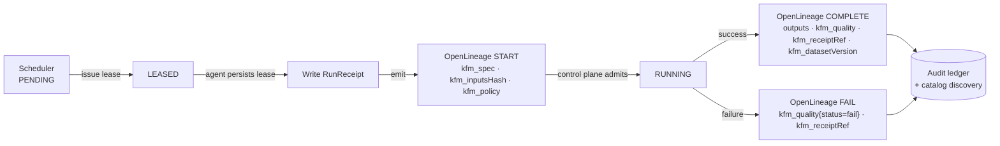
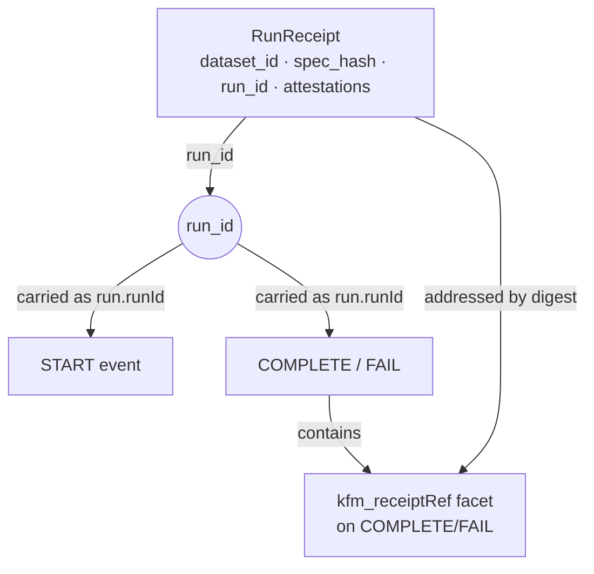

<!-- [KFM_META_BLOCK_V2]
doc_id: kfm://doc/standards/openlineage-facets
title: OpenLineage Facets — KFM Custom Facet Standard
type: standard
version: v1-draft
status: draft
owners: TODO (governance + platform leads)
created: 2026-05-14
updated: 2026-05-14
policy_label: public
related:
  - docs/standards/RUN_RECEIPT.md
  - docs/standards/AGENT_CONTRACT.md
  - docs/standards/CANONICALIZATION.md
  - docs/standards/PROVENANCE.md
  - docs/standards/TELEMETRY_MINIMUMS.md
  - docs/adr/ADR-XXXX-openlineage-backend-tier.md
  - schemas/contracts/v1/facets/
  - policy/conftest/lineage/
tags: [kfm, openlineage, lineage, receipts, governance, c1, c5]
notes:
  - "Path verified against Directory Rules §6.1 (docs/standards/ holds external standards KFM conforms to)."
  - "Facet shapes are PROPOSED until schemas/contracts/v1/facets/ exists and the OpenLineage backend tier is fixed by ADR."
[/KFM_META_BLOCK_V2] -->

# OpenLineage Facets — KFM Custom Facet Standard

*Canonical shape, naming, and lifecycle rules for the KFM-namespaced OpenLineage facets that make every governed run discoverable through lineage tooling.*


> **Status:** PROPOSED (draft) · **Owners:** TODO (platform + governance) · **Last updated:** 2026-05-14
>
> This document is the canonical KFM facet specification. The repository is **not mounted in this session**; all path, schema-URL, and Conftest-rule references in this doc are PROPOSED and must be verified against the live tree before they enter enforcement.

> [!IMPORTANT]
> **Lineage is governance, not telemetry.** Gate **F** of the promotion contract refuses to promote any run whose OpenLineage `run_id` is not emitted with input and output dataset facets present. The KFM-namespaced facets on this page are the discovery counterpart of the cryptographic [`RunReceipt`](#receipt-coupling); together they make every published artifact traceable backwards to its inputs, spec, and policy.

---

## Contents

1. [Purpose](#1-purpose)
2. [Scope and non-goals](#2-scope-and-non-goals)
3. [Authority and source ladder](#3-authority-and-source-ladder)
4. [Event lifecycle](#4-event-lifecycle)
5. [Identity model](#5-identity-model)
6. [KFM custom facets — canonical shapes](#6-kfm-custom-facets--canonical-shapes)
7. [Facet → object-family crosswalk](#7-facet--object-family-crosswalk)
8. [Receipt coupling](#8-receipt-coupling)
9. [Promotion-gate behavior](#9-promotion-gate-behavior)
10. [Validation and Conftest rules](#10-validation-and-conftest-rules)
11. [Backend tier and retention](#11-backend-tier-and-retention)
12. [Failure modes and bypass posture](#12-failure-modes-and-bypass-posture)
13. [Versioning and migration policy](#13-versioning-and-migration-policy)
14. [Related docs](#14-related-docs)
15. [Open questions](#15-open-questions)
16. [Appendix — full event examples](#16-appendix--full-event-examples)

---

## 1. Purpose

**CONFIRMED (doctrine).** Every KFM run emits OpenLineage `START` and `COMPLETE` (or `FAIL`) events carrying consistent facets — `job`, `run`, `inputs`, `outputs`, plus KFM-namespaced facets for `spec`, `inputsHash`, `policy`, `quality`, `receiptRef`, and `datasetVersion` — so that catalog and observability tooling can auto-discover the run, its lineage, and its evidence reference without scraping artifact stores.

OpenLineage is the **discovery layer** that complements the cryptographic evidence layer. While `RunReceipt`, cosign attestations, and the audit ledger *prove* what happened, OpenLineage events make those runs *findable* — by job, by input dataset, by output dataset, by `run_id`, and by policy label.

> [!NOTE]
> The KFM-specific facet keys (`receiptRef`, `spec`, `inputsHash`, `policy`, `quality`, `datasetVersion`) are **not part of the upstream OpenLineage vocabulary** and therefore **must be namespaced** under a KFM prefix per the OpenLineage Custom Facets convention.

[↑ Back to top](#contents)

---

## 2. Scope and non-goals

### In scope

- The canonical shape, naming, and required fields for KFM-namespaced OpenLineage facets.
- The lifecycle pairing between `RunReceipt` emission and `START` / `COMPLETE` events.
- The promotion-gate contract that depends on facet presence (Gate F).
- The schema-URL and versioning policy for KFM facet schemas.
- Conftest / OPA rule expectations for facet validation in CI.

### Out of scope

- Receipt structure itself → see [`docs/standards/RUN_RECEIPT.md`](../standards/RUN_RECEIPT.md) (**PROPOSED**, may not yet exist).
- Lease semantics and the four-event agent contract → see [`docs/standards/AGENT_CONTRACT.md`](../standards/AGENT_CONTRACT.md) (**PROPOSED**).
- Canonicalization (`jcs:sha256:...`) used to compute `spec_hash` → see [`docs/standards/CANONICALIZATION.md`](../standards/CANONICALIZATION.md) (**PROPOSED**).
- Choice of OpenLineage backend (Marquez vs OpenMetadata vs DataHub) — addressed in §11 as an open ADR question.

[↑ Back to top](#contents)

---

## 3. Authority and source ladder

| Layer | Source | Role for this doc |
|---|---|---|
| Doctrine (CONFIRMED) | Pass 10 Idea Index — **C1-05**, **C2-04**, **C5-08**, **ML-063-033** | Defines the facet inventory, START-on-lease-accept rule, and Gate F. |
| Doctrine (CONFIRMED) | Pass 10 Idea Index — **C1-01**, **C1-02** | Defines `RunReceipt` fields and `spec_hash` (`jcs:sha256:<hex>`) referenced by `kfm_spec` and `kfm_receiptRef`. |
| Repo evidence | `directory-rules.md` §6.1, §15 | Confirms `docs/standards/` as the correct home for this file. |
| External (EXTERNAL) | OpenLineage spec `OpenLineage.md` / `OpenLineage.json` | Custom-facet convention, `_producer`, `_schemaURL`, PascalCase `{Prefix}{Name}{Entity}Facet`. |
| External (EXTERNAL) | OpenLineage Custom Facets docs | Required `BaseFacet` shape and example emitter code. |

> [!CAUTION]
> External-standard claims about OpenLineage facet *vocabulary* are stable in broad strokes but **version-sensitive in detail**. The KFM facet `_schemaURL` values must point to **immutable** references (a git tag or sha, never `main`). See §13.

[↑ Back to top](#contents)

---

## 4. Event lifecycle

**CONFIRMED.** The agent contract (C2-04) emits four events in this order:

1. **Accept lease** — scheduler issues lease token; agent persists it.
2. **Emit `RunReceipt`** — minimal receipt is written before any side effect.
3. **Emit OpenLineage `START`** — with `run_id` and the KFM `policy`, `spec`, and `inputsHash` facets so the control plane can admit/deny/delay *before any side effect*.
4. **Execute → emit `COMPLETE` or `FAIL`** — carrying output dataset facets, `quality`, wallclock duration, and `kfm_receiptRef`.



> [!NOTE]
> The `START` event is the **policy-admission boundary**. Carrying `kfm_policy` *here* — not only on `COMPLETE` — is what lets the control plane refuse a run before it touches any canonical store. Emitting only on `COMPLETE` collapses generation and approval into one unreviewed path (§19 anti-pattern).

[↑ Back to top](#contents)

---

## 5. Identity model

**CONFIRMED.** `run_id` is derived deterministically so retries are idempotent.

| Field | Source | Shape | Notes |
|---|---|---|---|
| `run.runId` | derived from `spec_hash` + `inputs_hash` | UUID-format string | Retries append evidence under the **same** `run_id`. |
| `job.namespace` | scheduler / orchestrator namespace | string | One namespace per orchestrator deployment. **PROPOSED:** `kfm.<env>` (e.g., `kfm.prod`, `kfm.dev`). |
| `job.name` | dotted job identity | `<domain>.<dataset_id>.<step>` | **PROPOSED** convention; align with `docs/standards/AGENT_CONTRACT.md`. |
| `inputs[].namespace` / `outputs[].namespace` | datasource | string | KFM datasets use **PROPOSED** `kfm.dataset` plus a typed sub-namespace where appropriate (e.g., `kfm.dataset.processed`). |
| `inputs[].name` / `outputs[].name` | logical dataset identity | `<dataset_id>@<version>` or `<dataset_id>` paired with `kfm_datasetVersion` facet | Pick one — see §6.6. |

> [!IMPORTANT]
> **Run-id parity rule.** The `run_id` in `RunReceipt` MUST equal `run.runId` in the OpenLineage events for the same logical run. A Conftest rule enforces this (§10).

[↑ Back to top](#contents)

---

## 6. KFM custom facets — canonical shapes

All KFM facets MUST follow the OpenLineage custom-facet contract:

- Include `_producer` (URI to the emitter's source, ideally pinned to a tag or sha).
- Include `_schemaURL` (an **immutable** JSONPointer to the facet's JSON Schema — see §13).
- Use a **distinct prefix** (`kfm_`) so they cannot collide with upstream facets.
- Name the underlying schema as PascalCase `Kfm{Name}{Entity}Facet`.

> [!NOTE]
> **PROPOSED** prefix is `kfm_` (snake_case key in the `facets` map) with PascalCase schema class names. This aligns with both the corpus's use of `kfm_prov_id` / `kfm_run_id` log keys and the OpenLineage `{prefix}{name}{entity}Facet` convention. Final form is ADR-class because once emitted into a backend, renaming is expensive.

### 6.1 Facet inventory

| Facet key | Attaches to | Schema (PROPOSED) | Required on |
|---|---|---|---|
| `kfm_spec` | `run.facets` | `KfmSpecRunFacet` | `START`, `COMPLETE`, `FAIL` |
| `kfm_inputsHash` | `run.facets` | `KfmInputsHashRunFacet` | `START`, `COMPLETE`, `FAIL` |
| `kfm_policy` | `run.facets` | `KfmPolicyRunFacet` | `START`, `COMPLETE`, `FAIL` |
| `kfm_quality` | `run.facets` | `KfmQualityRunFacet` | `COMPLETE`, `FAIL` |
| `kfm_receiptRef` | `run.facets` | `KfmReceiptRefRunFacet` | `COMPLETE`, `FAIL` |
| `kfm_datasetVersion` | `outputs[].facets` (and `inputs[].facets` where known) | `KfmDatasetVersionDatasetFacet` | `COMPLETE` |

### 6.2 `kfm_spec` — pins the spec identity

```json
{
  "_producer": "https://github.com/<org>/kfm/tree/<git-sha>",
  "_schemaURL": "https://<host>/schemas/contracts/v1/facets/KfmSpecRunFacet.json",
  "spec_hash": "jcs:sha256:<hex>",
  "spec_kind": "dataset|model|contract|migration|redaction",
  "transform_git_sha": "<40-char hex>"
}
```

- `spec_hash` MUST match `RunReceipt.spec_hash` exactly (`jcs:sha256:<hex>` per C1-02).
- `transform_git_sha` MUST match the receipt's `transform_git_sha`.

### 6.3 `kfm_inputsHash` — pins what the run consumed

```json
{
  "_producer": "https://github.com/<org>/kfm/tree/<git-sha>",
  "_schemaURL": "https://<host>/schemas/contracts/v1/facets/KfmInputsHashRunFacet.json",
  "inputs_hash": "sha256:<hex>",
  "method": "jcs|sorted-keys|sha256-of-uri-list",
  "input_count": 3
}
```

- `inputs_hash` is the digest used (together with `spec_hash`) to derive `run.runId` (§5).
- `method` MUST be one of the **PROPOSED** enum values; `jcs` is the default for structured input descriptors.

### 6.4 `kfm_policy` — admission decision context

```json
{
  "_producer": "https://github.com/<org>/kfm/tree/<git-sha>",
  "_schemaURL": "https://<host>/schemas/contracts/v1/facets/KfmPolicyRunFacet.json",
  "labels": ["public", "evidence-first"],
  "obligations": ["redact:pii=false"],
  "policy_bundle_hash": "sha256:<hex>",
  "decision": "allow|quarantine|escalate"
}
```

- `labels` and `obligations` follow the sample START event documented in C2-04.
- `policy_bundle_hash` pins the OPA bundle that admitted the run.
- The `decision` field aligns with the broader `PolicyDecision` object family.

### 6.5 `kfm_quality` — outcome envelope

```json
{
  "_producer": "https://github.com/<org>/kfm/tree/<git-sha>",
  "_schemaURL": "https://<host>/schemas/contracts/v1/facets/KfmQualityRunFacet.json",
  "status": "pass|warn|fail|abstain",
  "wallclock_seconds": 12.318,
  "checks": [
    { "name": "schema-validate", "status": "pass" },
    { "name": "no-network-fixture", "status": "pass" }
  ]
}
```

- `status` is the canonical lineage-side quality flag. `abstain` corresponds to cite-or-abstain truth posture and is a **finite outcome**, not silent skip.

### 6.6 `kfm_receiptRef` — link back to the immutable receipt

```json
{
  "_producer": "https://github.com/<org>/kfm/tree/<git-sha>",
  "_schemaURL": "https://<host>/schemas/contracts/v1/facets/KfmReceiptRefRunFacet.json",
  "receipt_uri": "oci://registry.example/kfm/receipts@sha256:<hex>",
  "receipt_digest": "sha256:<hex>",
  "ledger_path": "data/receipts/<class>/YYYY/MM/<digest>.json",
  "attestation_bundle_digest": "sha256:<hex>"
}
```

- At least one of `receipt_uri` or `ledger_path` MUST be present. Both is preferred where the ledger is dual-homed.
- `receipt_digest` MUST match the digest of the canonical receipt bytes used at signing time.
- The actual home of receipt bytes is governed by `directory-rules.md` §9.1 (`data/receipts/...`) — **PROPOSED** until ADR-S-03 (Receipt schema layout) is resolved.

### 6.7 `kfm_datasetVersion` — pins what was produced (or consumed)

```json
{
  "_producer": "https://github.com/<org>/kfm/tree/<git-sha>",
  "_schemaURL": "https://<host>/schemas/contracts/v1/facets/KfmDatasetVersionDatasetFacet.json",
  "dataset_id": "<stable-id>",
  "dataset_version": "<semver-or-date-or-digest>",
  "content_digest": "sha256:<hex>",
  "release_state": "RAW|WORK|QUARANTINE|PROCESSED|CATALOG|PUBLISHED"
}
```

- `release_state` MUST be one of the lifecycle phases from `directory-rules.md` §9.1 / the lifecycle invariant. A lineage event with `release_state=PUBLISHED` on an `output` MUST be paired with a `PromotionDecision` and a `ReleaseManifest` — see §9.

[↑ Back to top](#contents)

---

## 7. Facet → object-family crosswalk

| OpenLineage facet | KFM object family | Relationship |
|---|---|---|
| `run.facets.kfm_spec` | `RunReceipt.spec_hash`, `SourceDescriptor` | Lineage carries the same `spec_hash` as the receipt. |
| `run.facets.kfm_inputsHash` | `RunReceipt` / agent contract | Used to derive `run_id`; idempotency anchor. |
| `run.facets.kfm_policy` | `PolicyDecision` | Lineage records the admission decision context; the canonical decision lives in the receipt + signed bundle. |
| `run.facets.kfm_quality` | `ValidationReport`, `EvidenceBundle` | Lineage summarises; bundle contains the evidence. |
| `run.facets.kfm_receiptRef` | `RunReceipt`, `EvidenceRef` | Pointer; never substitutes for the receipt itself. |
| `outputs[].facets.kfm_datasetVersion` | `LayerManifest` / `TileArtifactManifest` / `ReleaseManifest` | Discovery-side mirror of the canonical manifest's identity. |

> [!WARNING]
> The lineage event is **not** a substitute for any of these objects. Lineage is queryable metadata; canonical truth lives in receipts, evidence bundles, catalogs, manifests, and release decisions.

[↑ Back to top](#contents)

---

## 8. Receipt coupling

**CONFIRMED.** A run that emits an OpenLineage event without a paired `RunReceipt` (or vice versa) is a governance failure.

- `RunReceipt` is written **before** `START` (C2-04).
- `START` event carries `kfm_spec`, `kfm_inputsHash`, `kfm_policy`.
- `COMPLETE` / `FAIL` carries `kfm_quality`, `kfm_receiptRef`, and output `kfm_datasetVersion` facets.
- The receipt's `run_id` MUST equal `run.runId` (parity rule, §5).



[↑ Back to top](#contents)

---

## 9. Promotion-gate behavior

**CONFIRMED (C5-08).** Gate **F** refuses to promote any run that is invisible to lineage. The gate MUST verify:

1. A `START` and a matching `COMPLETE` (or `FAIL`) event were emitted to the configured backend.
2. The `run.runId` is discoverable via the backend's API.
3. `inputs[]` and `outputs[]` are present and non-empty for promotions past `WORK`.
4. `kfm_spec`, `kfm_inputsHash`, `kfm_policy`, `kfm_quality`, `kfm_receiptRef` are present and well-formed.
5. `kfm_receiptRef.receipt_digest` resolves to a signed receipt in the audit ledger.

> [!IMPORTANT]
> **A run with `kfm_quality.status = "fail"` MUST NOT be promoted past `WORK`.** A run with `status = "abstain"` MAY proceed to `CATALOG` only if a paired `EvidenceBundle` justifies the abstain — cite-or-abstain is the default truth posture, not a polish-over-evidence excuse.

[↑ Back to top](#contents)

---

## 10. Validation and Conftest rules

**PROPOSED.** Rules live under `policy/conftest/lineage/` (mirrors `policy/` per `directory-rules.md`; **NEEDS VERIFICATION** against live tree).

| Rule id (PROPOSED) | Behavior | Status |
|---|---|---|
| `lineage.run_id_parity` | DENY if `RunReceipt.run_id ≠ OpenLineage run.runId` | PROPOSED |
| `lineage.required_facets_start` | DENY if any of `kfm_spec`, `kfm_inputsHash`, `kfm_policy` missing on `START` | PROPOSED |
| `lineage.required_facets_complete` | DENY if any of `kfm_quality`, `kfm_receiptRef` missing on `COMPLETE`/`FAIL` | PROPOSED |
| `lineage.dataset_facets_on_promotion` | DENY if `inputs[]` or `outputs[]` empty for promotions past `WORK` | PROPOSED |
| `lineage.schema_url_immutable` | DENY if any facet `_schemaURL` references `main` or a non-pinned branch | PROPOSED |
| `lineage.receipt_digest_resolves` | DENY if `kfm_receiptRef.receipt_digest` is not findable in the audit ledger | PROPOSED |
| `lineage.policy_bundle_pinned` | DENY if `kfm_policy.policy_bundle_hash` does not match the OPA bundle hash in CI | PROPOSED |

Negative-state fixtures (per the negative-state rule) MUST exist for each DENY path — runs that omit facets, runs that pin a branch, runs whose receipts cannot be resolved, and runs whose `run_id` does not parity-match the receipt.

> [!NOTE]
> A Conftest rule existing in this table is **not** evidence that it exists in the repo. Each row is PROPOSED until a corresponding `*.rego` file and a `*_test.rego` fixture pair are merged.

[↑ Back to top](#contents)

---

## 11. Backend tier and retention

**OPEN (ADR-class).** The OpenLineage backend choice is not pinned. Candidates surveyed in the corpus:

| Candidate | Strengths | Trade-offs |
|---|---|---|
| Marquez | Reference implementation; tight OL alignment | Operational surface; lineage-graph queries scale with care. |
| OpenMetadata | Broader catalog + lineage + governance integration | Heavier; opinions about catalog overlap with KFM `catalog/`. |
| DataHub | Strong catalog + lineage + column-level features | Operational complexity; some OL fidelity nuances. |

> [!CAUTION]
> Retention is itself an ADR: the backend's retention budget MUST be at least as long as the receipt ledger's, or the lineage→receipt linkage decays into dangling references. Set retention with the receipt ledger as the source of truth, not the backend's defaults.

**Action:** Open an ADR titled *"OpenLineage backend tier and retention"* (placeholder ADR-XXXX). Until merged, treat the backend as **abstract** in this doc — implementations may pick any compliant backend, but Gate F enforcement requires *some* discoverable backend to be reachable from CI.

[↑ Back to top](#contents)

---

## 12. Failure modes and bypass posture

| Failure | Behavior |
|---|---|
| Backend unreachable from agent | Agent retries with exponential backoff; lease holds; if lease expires, run returns to `PENDING` with the same logical `run_id`. |
| Backend unreachable from CI (Gate F) | **Fail-open-with-audit** (CONFIRMED doctrine, C5-08): CI MAY proceed but MUST log the bypass to the Friday check-in and a `lineage_bypass_register.yaml` entry (PROPOSED location: `control_plane/`). |
| `kfm_receiptRef.receipt_digest` does not resolve | DENY promotion; this is a strong signal of a broken receipt or a misconfigured digest. |
| `run_id` parity violation | DENY promotion. Investigate as a potential watcher-as-publisher anti-pattern. |
| Facet schema URL points to `main` | DENY promotion. Pin to a sha or tag. |
| Tombstone received for a run | Lineage records the tombstone as an additional event (or annotation); discovery hides tombstoned items from public views but retains audit visibility. |

> [!WARNING]
> Bypass is a **finite outcome**, not a quiet skip. Every bypass MUST be visible to governance. A bypass that does not appear in the Friday check-in is a §19 anti-pattern (hides uncertainty, evidence gaps, or release state).

[↑ Back to top](#contents)

---

## 13. Versioning and migration policy

### 13.1 Schema URLs are immutable

Every KFM facet `_schemaURL` MUST resolve to a **versioned, immutable** location — a git tag or sha, not a branch. This mirrors the upstream OpenLineage rule and is enforced by the `lineage.schema_url_immutable` Conftest rule (§10).

**Acceptable (PROPOSED) forms:**

```text
https://raw.githubusercontent.com/<org>/kfm/<sha>/schemas/contracts/v1/facets/KfmSpecRunFacet.json
https://schemas.kfm.example/contracts/v1/facets/KfmSpecRunFacet.json
```

**Unacceptable:**

```text
https://raw.githubusercontent.com/<org>/kfm/main/schemas/contracts/v1/facets/KfmSpecRunFacet.json
```

### 13.2 Facet evolution

| Change | Discipline |
|---|---|
| Add an optional field | Minor schema bump; new `_schemaURL`; backwards-compatible. |
| Add a required field | Major schema bump; ADR; migration window during which both versions are accepted. |
| Rename or remove a field | ADR + schema version bump + receipt schema parity check. |
| Promote a KFM facet to upstream OL | Coordinate with upstream; keep `kfm_` mirror until upstream is ubiquitous. |

[↑ Back to top](#contents)

---

## 14. Related docs

- [`docs/standards/RUN_RECEIPT.md`](../standards/RUN_RECEIPT.md) — receipt envelope and fields (**PROPOSED**).
- [`docs/standards/AGENT_CONTRACT.md`](../standards/AGENT_CONTRACT.md) — lease + four-event protocol (**PROPOSED**).
- [`docs/standards/CANONICALIZATION.md`](../standards/CANONICALIZATION.md) — `jcs:sha256:<hex>` discipline (**PROPOSED**).
- [`docs/standards/PROVENANCE.md`](../standards/PROVENANCE.md) — SLSA / in-toto predicate fields (**PROPOSED**).
- [`docs/standards/TELEMETRY_MINIMUMS.md`](../standards/TELEMETRY_MINIMUMS.md) — telemetry per service class (**PROPOSED**).
- [`docs/doctrine/directory-rules.md`](../doctrine/directory-rules.md) — §6.1 docs/standards home; §15 README contract.
- [`docs/adr/`](../adr/) — pending ADRs ADR-S-03 (Receipt schema layout) and the proposed *OpenLineage backend tier and retention* ADR.

[↑ Back to top](#contents)

---

## 15. Open questions

- **ADR-class:** Pin the OpenLineage backend tier (Marquez vs OpenMetadata vs DataHub) and its retention budget relative to the receipt ledger.
- **ADR-class:** Confirm `kfm_` as the canonical facet prefix and PascalCase `Kfm{Name}{Entity}Facet` as the schema name convention.
- **NEEDS VERIFICATION:** Whether `schemas/contracts/v1/facets/` exists in the live repo and which facets are already authored there.
- **NEEDS VERIFICATION:** Whether `policy/conftest/lineage/` (or `policies/`) is the canonical Rego home — per Directory Rules, `policy/` is canonical and `policies/` is compatibility.
- **OPEN:** Whether the receipt should also carry `openlineage_run_id` explicitly, or rely on parity alone.
- **OPEN:** How tombstones propagate to the lineage backend (annotation, event, or out-of-band).

[↑ Back to top](#contents)

---

## 16. Appendix — full event examples

<details>
<summary><strong>Example START event (illustrative; PROPOSED)</strong></summary>

```json
{
  "eventType": "START",
  "eventTime": "2026-05-14T15:04:05.123Z",
  "run": {
    "runId": "01HW9V6F8K7Q3M0Z9D2E5T8X4N",
    "facets": {
      "kfm_spec": {
        "_producer": "https://github.com/EXAMPLE/kfm/tree/<sha>",
        "_schemaURL": "https://schemas.kfm.example/contracts/v1/facets/KfmSpecRunFacet.json",
        "spec_hash": "jcs:sha256:8a1f...c4",
        "spec_kind": "dataset",
        "transform_git_sha": "1c2d3e4f5a6b7c8d9e0f1a2b3c4d5e6f7a8b9c0d"
      },
      "kfm_inputsHash": {
        "_producer": "https://github.com/EXAMPLE/kfm/tree/<sha>",
        "_schemaURL": "https://schemas.kfm.example/contracts/v1/facets/KfmInputsHashRunFacet.json",
        "inputs_hash": "sha256:e3b0...55",
        "method": "jcs",
        "input_count": 2
      },
      "kfm_policy": {
        "_producer": "https://github.com/EXAMPLE/kfm/tree/<sha>",
        "_schemaURL": "https://schemas.kfm.example/contracts/v1/facets/KfmPolicyRunFacet.json",
        "labels": ["public", "evidence-first"],
        "obligations": ["redact:pii=false"],
        "policy_bundle_hash": "sha256:7f4d...09",
        "decision": "allow"
      }
    }
  },
  "job": {
    "namespace": "kfm.prod",
    "name": "hydrology.nwis_daily.ingest"
  },
  "inputs": [
    {
      "namespace": "kfm.dataset.raw",
      "name": "hydrology.nwis_daily"
    }
  ],
  "outputs": [],
  "producer": "https://github.com/EXAMPLE/kfm/tree/<sha>",
  "schemaURL": "https://openlineage.io/spec/2-0-2/OpenLineage.json#/$defs/RunEvent"
}
```

</details>

<details>
<summary><strong>Example COMPLETE event (illustrative; PROPOSED)</strong></summary>

```json
{
  "eventType": "COMPLETE",
  "eventTime": "2026-05-14T15:04:17.441Z",
  "run": {
    "runId": "01HW9V6F8K7Q3M0Z9D2E5T8X4N",
    "facets": {
      "kfm_spec": { "_producer": "...", "_schemaURL": "...", "spec_hash": "jcs:sha256:8a1f...c4", "spec_kind": "dataset", "transform_git_sha": "1c2d...0d" },
      "kfm_inputsHash": { "_producer": "...", "_schemaURL": "...", "inputs_hash": "sha256:e3b0...55", "method": "jcs", "input_count": 2 },
      "kfm_policy": { "_producer": "...", "_schemaURL": "...", "labels": ["public","evidence-first"], "obligations": ["redact:pii=false"], "policy_bundle_hash": "sha256:7f4d...09", "decision": "allow" },
      "kfm_quality": {
        "_producer": "...",
        "_schemaURL": "https://schemas.kfm.example/contracts/v1/facets/KfmQualityRunFacet.json",
        "status": "pass",
        "wallclock_seconds": 12.318,
        "checks": [
          { "name": "schema-validate", "status": "pass" },
          { "name": "no-network-fixture", "status": "pass" }
        ]
      },
      "kfm_receiptRef": {
        "_producer": "...",
        "_schemaURL": "https://schemas.kfm.example/contracts/v1/facets/KfmReceiptRefRunFacet.json",
        "receipt_uri": "oci://registry.kfm.example/receipts@sha256:b1a2...ff",
        "receipt_digest": "sha256:b1a2...ff",
        "ledger_path": "data/receipts/ingest/2026/05/b1a2ff.json",
        "attestation_bundle_digest": "sha256:9c8d...12"
      }
    }
  },
  "job": {
    "namespace": "kfm.prod",
    "name": "hydrology.nwis_daily.ingest"
  },
  "inputs": [
    { "namespace": "kfm.dataset.raw", "name": "hydrology.nwis_daily" }
  ],
  "outputs": [
    {
      "namespace": "kfm.dataset.processed",
      "name": "hydrology.nwis_daily",
      "facets": {
        "kfm_datasetVersion": {
          "_producer": "...",
          "_schemaURL": "https://schemas.kfm.example/contracts/v1/facets/KfmDatasetVersionDatasetFacet.json",
          "dataset_id": "hydrology.nwis_daily",
          "dataset_version": "2026-05-14T15:04:05Z",
          "content_digest": "sha256:a4c5...77",
          "release_state": "PROCESSED"
        }
      }
    }
  ],
  "producer": "https://github.com/EXAMPLE/kfm/tree/<sha>",
  "schemaURL": "https://openlineage.io/spec/2-0-2/OpenLineage.json#/$defs/RunEvent"
}
```

</details>

<details>
<summary><strong>Reference: required upstream OpenLineage envelope fields</strong></summary>

| Field | Type | Notes |
|---|---|---|
| `eventType` | `START`, `COMPLETE`, `FAIL`, `ABORT`, `OTHER` | KFM uses START + COMPLETE/FAIL. |
| `eventTime` | ISO-8601 UTC string | Wall time of the event. |
| `run.runId` | UUID-format string | KFM derives from `spec_hash` + `inputs_hash`. |
| `job.namespace` / `job.name` | string | One job per logical pipeline step. |
| `inputs[]` / `outputs[]` | dataset list | MUST be non-empty for promotions past WORK. |
| `producer` | URI | KFM convention: pinned to git tag/sha. |
| `schemaURL` | URI | Versioned OL envelope schema. |

</details>

---

> [!NOTE]
> **Status of this document.** This is a PROPOSED standard. It captures KFM doctrine that is CONFIRMED in the project knowledge (Pass 10 C1-05, C2-04, C5-08; Master MapLibre ML-063-033), and it operationalizes that doctrine in PROPOSED facet shapes, schema URLs, and Conftest rules pending repo inspection and ADR resolution. The lineage backend tier, schema prefix, and facet-schema home are explicit ADR-class open questions (§15).

---

**Related docs:** [`RUN_RECEIPT.md`](../standards/RUN_RECEIPT.md) · [`AGENT_CONTRACT.md`](../standards/AGENT_CONTRACT.md) · [`CANONICALIZATION.md`](../standards/CANONICALIZATION.md) · [`PROVENANCE.md`](../standards/PROVENANCE.md) · [`directory-rules.md`](../doctrine/directory-rules.md)

**Last reviewed:** 2026-05-14 · **Owners:** TODO · [↑ Back to top](#contents)
