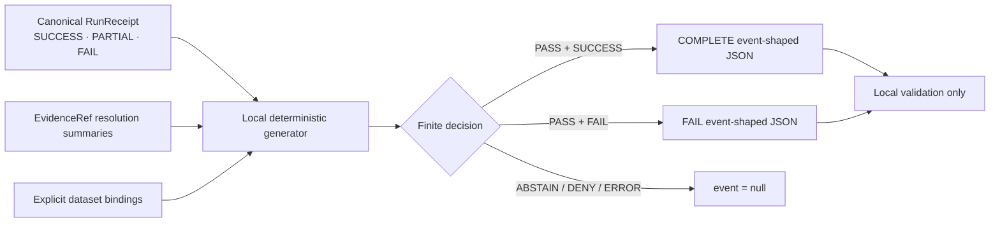

<!-- [KFM_META_BLOCK_V2]
doc_id: kfm://doc/standards/openlineage-facets
title: OpenLineage Facets — Repository-Grounded Projection Profile and Adoption Boundary
type: standard/profile
version: v2.0
status: draft; repository-grounded; fixture-first; exporter-inactive; non-authoritative
owners:
  - "@bartytime4life"
created: 2026-05-14
updated: 2026-08-18
policy_label: repository-facing
owning_root: docs/
responsibility: Describe the upstream OpenLineage facet contract, the exact bounded KFM terminal RunEvent projection currently present in the repository, and the decisions and proof still required before custom facets, START events, a backend, or release-gate integration can become operational.
truth_posture: CONFIRMED same-path standards placement, current fixture-only terminal projection contract/schema/fixtures/generator/validator/tests/workflow, current runtime RunReceipt shape, and upstream OpenLineage core-schema requirements / PROPOSED future custom-facet adoption, START profile, exporter, backend, retention, immutable facet-schema publication, and release integration / UNKNOWN deployed producers, sinks, backend state, production conformance, and public use
evidence_snapshot:
  repository: bartytime4life/Kansas-Frontier-Matrix
  base_ref: main
  base_commit: 6e45646702022513fa0777b294d09ea90d73cf58
  prior_target_blob: 1bc09eeb17277e6bb78f7a656332a6c09ca3bab7
  openlineage_repository_commit: 7a4efe3e4923207b85e2145862cac8d1f8ac6100
  openlineage_core_schema_blob: 58167f71407add7734810cda9943b39b83c89aa2
related:
  - docs/standards/README.md
  - contracts/telemetry/openlineage_run_event_projection.md
  - schemas/contracts/v1/telemetry/openlineage_run_event_projection.schema.json
  - fixtures/contracts/v1/telemetry/openlineage_run_event_projection/README.md
  - tools/generators/telemetry/README.md
  - tools/validators/telemetry/README.md
  - tests/validators/telemetry/README.md
  - .github/workflows/openlineage-run-event-projection.yml
  - contracts/runtime/run_receipt.md
  - schemas/contracts/v1/runtime/run_receipt.schema.json
  - docs/adr/ADR-0016-telemetry-redaction-posture.md
  - policy/telemetry/README.md
  - docs/architecture/publication/promotion-gates.md
  - docs/intake/exploratory/new-ideas-4-openlineage-run-event-projection-source-map.md
tags: [kfm, openlineage, lineage, telemetry, facets, run-event, run-receipt, evidence, fixture-first, no-network, non-publisher]
notes:
  - "v2.0 replaces a proposal-era canonical six-facet model with a repository-grounded account of the implemented inactive terminal projection profile."
  - "The current profile emits only local COMPLETE or FAIL event-shaped documents; START admission and network export remain deferred."
  - "The current projection derives an OpenLineage-compatible UUIDv5 and preserves the non-UUID KFM RunReceipt identity in kfm_run_receipt.sourceRunId."
  - "CODEOWNERS verifies @bartytime4life as the repository review route; observability, OpenLineage, security/privacy, policy, and release stewardship remain NEEDS VERIFICATION."
[/KFM_META_BLOCK_V2] -->

<a id="top"></a>

# OpenLineage Facets — Repository-Grounded Projection Profile and Adoption Boundary

> **Operating rule.** OpenLineage is a lineage carrier and discovery projection. It may describe which governed run referenced which datasets and receipts, but it never becomes source truth, an `EvidenceBundle`, a policy decision, review approval, lifecycle promotion, release approval, or publication authority.


> [!IMPORTANT]
> **This page is human-readable standards guidance.** Semantic meaning belongs in `contracts/`; machine shape belongs in `schemas/`; admissibility belongs in `policy/`; executable proof belongs in fixtures, validators, tests, and workflows; runtime export belongs in an admitted implementation boundary; release authority belongs in `release/`. This page does not activate any of them.

> [!CAUTION]
> **The previous edition overclaimed convergence.** It described six KFM facets, `START` admission, direct `RunReceipt.run_id` parity, “Gate F” lineage enforcement, immutable facet-schema URLs, and a backend bypass as if they were the current KFM standard. Current repository evidence establishes a narrower, inactive, terminal-only projection with different facet keys and no exporter or backend. The earlier vocabulary remains lineage in [Appendix B](#appendix-b--proposal-era-vocabulary-crosswalk), not current machine authority.

> [!WARNING]
> **A valid lineage projection is not a valid release.** A green validator or workflow proves only the bounded synthetic profile at the checked revision. It does not prove source admission, EvidenceBundle authenticity, policy enforcement, review, release, deployment, an operational backend, public availability, or publication.

<a id="contents"></a>

**Quick navigation:** [Snapshot](#0-current-evidence-snapshot) · [Purpose](#1-purpose) · [Scope](#2-scope-and-non-goals) · [Authority](#3-authority-and-source-ladder) · [Lifecycle](#4-event-lifecycle) · [Identity](#5-identity-model) · [Facets](#6-kfm-custom-facets--canonical-shapes) · [Crosswalk](#7-facet--object-family-crosswalk) · [Receipts](#8-receipt-coupling) · [Promotion](#9-promotion-gate-behavior) · [Validation](#10-validation-and-conftest-rules) · [Backend](#11-backend-tier-and-retention) · [Failures](#12-failure-modes-and-bypass-posture) · [Versioning](#13-versioning-and-migration-policy) · [Related](#14-related-docs) · [Backlog](#15-open-questions) · [Examples](#16-appendix--full-event-examples)

---

## 0. Current evidence snapshot

The repository observations below are pinned to `main@6e45646702022513fa0777b294d09ea90d73cf58`. They establish tracked bytes and bounded executable behavior at that revision. They do not establish a deployed OpenLineage producer, backend, transport, retention policy, release integration, or public use.

| Surface | CONFIRMED repository state | Safe conclusion |
|---|---|---|
| This document | Existing standards path; prior blob `1bc09eeb17277e6bb78f7a656332a6c09ca3bab7`; proposal-era six-facet model | Same-path semantic reconciliation is warranted |
| Standards lane | [`docs/standards/README.md`](./README.md) lists this page as OpenLineage facet guidance | Placement is supported; standards prose is not machine authority |
| Semantic profile | [`OpenLineageRunEventProjection`](../../contracts/telemetry/openlineage_run_event_projection.md) is draft, `PROPOSED`, fixture-first, local-only, no-network, and non-authoritative | One bounded terminal projection meaning exists |
| Machine shape | [`openlineage_run_event_projection.schema.json`](../../schemas/contracts/v1/telemetry/openlineage_run_event_projection.schema.json) is a closed Draft 2020-12 profile, version `1.0.0` | The bounded candidate and event-shaped output have enforceable local shape |
| Fixtures | Eighteen synthetic positive and negative cases with exact outcomes and finding-code sets | Fixture polarity and deterministic replay are reviewable |
| Generator and validator | Deterministic local generator and validator exist under `tools/`; no endpoint or exporter is present | Construction and conformance are locally executable |
| Tests | Focused no-network tests cover terminal event mapping, evidence gates, identity, ordering, side-channel denial, and workflow safety | The declared local profile has executable proof |
| Workflow | Read-only [`openlineage-run-event-projection.yml`](../../.github/workflows/openlineage-run-event-projection.yml) runs focused tests, fixture validation, and generated-receipt validation with `KFM_NO_NETWORK=1` | CI orchestration exists; it does not post lineage events |
| Runtime receipt | Current [`RunReceipt`](../../contracts/runtime/run_receipt.md) permits stable non-UUID `run_id` values and uses `sha256:<hex>` for `spec_hash` | Direct OpenLineage UUID parity is not currently available for every receipt |
| Telemetry policy | [`policy/telemetry/`](../../policy/telemetry/README.md) contains a non-enforcing proposed Rego stub and records `WORKFLOW_HOLD` | Operational telemetry admissibility is not established |
| Telemetry decision | [`ADR-0016`](../adr/ADR-0016-telemetry-redaction-posture.md) remains `proposed` | Telemetry redaction posture is not an accepted operational decision |
| Promotion vocabulary | Current promotion guidance maps Gate F to **review**, not lineage | No accepted lineage-to-promotion gate binding is established |
| Backend and export | No endpoint, client, credential, exporter, sink, or backend integration is part of the bounded slice | Runtime emission is absent by design |
| Review route | Repository CODEOWNERS routes the path to `@bartytime4life` | One GitHub route is verified; specialist and independent stewardship remain `NEEDS VERIFICATION` |

### 0.1 Current maturity summary

```text
CONFIRMED
  same-path standards guidance
  terminal COMPLETE / FAIL projection contract
  closed local schema
  18 synthetic cases
  deterministic no-network generator and validator
  focused tests and read-only workflow
  RunReceipt and EvidenceBundle-reference preservation
  public/internal finite decision gates

PROPOSED
  upstream-certified custom facet schemas
  START / pre-run admission profile
  immutable KFM facet-schema publication
  operational telemetry policy
  backend, exporter, transport, authentication, retry, and retention
  promotion/release integration
  correction and tombstone propagation

ABSENT / UNKNOWN
  deployed producers
  stored or exported KFM OpenLineage events
  operational backend state
  production conformance and interoperability
  public lineage surface
```

[Back to top](#top)

---

## 1. Purpose

This page gives maintainers, observability engineers, contract and schema reviewers, security/privacy reviewers, and release reviewers a bounded answer to four questions:

1. What does the upstream OpenLineage core schema require?
2. Which OpenLineage-shaped KFM profile is actually present in the repository?
3. Which custom facets and identity rules are implemented by that profile?
4. What decisions and proof remain before KFM may emit operational lineage?

The current repository implements one narrow object:

> A deterministic terminal `COMPLETE` or `FAIL` RunEvent-shaped projection derived from an existing KFM `RunReceipt`, explicit input/output dataset bindings, and bounded EvidenceRef-to-EvidenceBundle resolution summaries.

The profile exists to test whether an already-recorded run can be represented as lineage without losing receipt identity, lifecycle state, evidence resolution, sensitivity posture, or public-use restrictions.

It does **not** prove upstream OpenLineage conformance, post an event, contact a backend, authenticate evidence, admit a source, make policy, approve review, promote lifecycle state, release an artifact, or publish a public product.

### 1.1 Operating distinction

| Object or surface | Role | Authority limit |
|---|---|---|
| `RunReceipt` | Accountable execution summary | Does not prove truth, review, or release |
| `EvidenceBundle` resolution | Evidence support and restrictions | Remains upstream of telemetry |
| OpenLineage-shaped event | Queryable lineage carrier | Does not replace receipt or evidence |
| Validator result | Local profile conformance | Does not authorize export or release |
| Workflow result | Exact-revision orchestration evidence | Does not establish a safe runtime |
| Backend record | Future discoverability surface | Would remain downstream of governed objects |

[Back to top](#top)

---

## 2. Scope and non-goals

### 2.1 In scope

- Upstream OpenLineage envelope and BaseFacet requirements relevant to the current KFM profile.
- Current KFM terminal event type, facet keys, field surface, identity projection, finite decisions, and non-effects.
- Relationship among the projection, `RunReceipt`, dataset bindings, EvidenceRefs, and EvidenceBundle-resolution summaries.
- Current synthetic fixtures, validator outcomes, tests, and read-only workflow.
- Adoption and graduation requirements for future custom facets, `START`, transport, backend, retention, and release integration.
- Compatibility treatment for the proposal-era six-facet vocabulary.

### 2.2 Out of scope

- Defining the canonical KFM `RunReceipt` shape.
- Defining or authenticating `EvidenceBundle`, `PolicyDecision`, review, promotion, or release objects.
- Choosing or operating Marquez, OpenMetadata, DataHub, or another backend.
- Emitting `START`, `RUNNING`, `COMPLETE`, `FAIL`, `ABORT`, or `OTHER` to a network service.
- Installing an OpenLineage client library or collector.
- Selecting authentication, credentials, endpoint, queue, retry, retention, or deletion behavior.
- Certifying the caller-pinned upstream `schemaURL`.
- Accepting ADR-0016 or creating an OpenLineage-specific ADR.
- Turning telemetry into public truth, a public API, a dashboard promise, or a publication record.

### 2.3 Negative authority

This document must not become:

- a parallel contract or schema;
- a policy rule expressed only in prose;
- a facet registry that outranks the current profile schema;
- a release gate by documentation;
- evidence that a backend or producer exists;
- permission to include source payloads, geometry, coordinates, prompts, secrets, or protected identifiers in telemetry; or
- a reason to bypass KFM evidence, sensitivity, review, correction, or rollback controls.

[Back to top](#top)

---

## 3. Authority and source ladder

### 3.1 KFM authority by question

| Question | Owning authority | Role of this page |
|---|---|---|
| Where this guidance belongs | Accepted ADR-0029, Directory Rules v2, and [`docs/standards/README.md`](./README.md) | Explain the standards lane and current evidence |
| What the projection means | [`contracts/telemetry/openlineage_run_event_projection.md`](../../contracts/telemetry/openlineage_run_event_projection.md) | Summarize; do not redefine |
| What local shape is valid | [`schemas/contracts/v1/telemetry/openlineage_run_event_projection.schema.json`](../../schemas/contracts/v1/telemetry/openlineage_run_event_projection.schema.json) | Crosswalk exact fields |
| What a `RunReceipt` means | [`contracts/runtime/run_receipt.md`](../../contracts/runtime/run_receipt.md) | Preserve the current receipt boundary |
| What telemetry may contain | Accepted policy and review; current policy source is held | State the fail-closed requirement |
| What is executable | Current generator, validator, fixtures, tests, workflow, and observed runtime evidence | Report only the checked boundary |
| Whether lineage may affect release | Accepted promotion and release authorities | Record that no binding is established |
| Whether upstream facts are current | Official OpenLineage repository/specification at a pinned revision | State the dated external baseline |
| Whether operational export is allowed | Future accepted transport/backend/policy decision and current implementation evidence | No authority here |

### 3.2 Upstream OpenLineage baseline

The external baseline for this revision is the official OpenLineage repository at commit `7a4efe3e4923207b85e2145862cac8d1f8ac6100` and core schema blob `58167f71407add7734810cda9943b39b83c89aa2`.

At that revision:

- the core schema `$id` is `https://openlineage.io/spec/2-0-2/OpenLineage.json`;
- `RunEvent` supports `START`, `RUNNING`, `COMPLETE`, `ABORT`, `FAIL`, and `OTHER`;
- a RunEvent requires `run` and `job`; `inputs` and `outputs` are optional in the upstream envelope;
- `run.runId` is UUID-shaped;
- the event envelope requires `eventTime`, `producer`, and `schemaURL`;
- every custom facet extends `BaseFacet`, which requires `_producer` and `_schemaURL`; and
- custom facet payload fields are otherwise extension-defined.

> [!NOTE]
> **Core schema version and client/software release are different axes.** This page pins the upstream core schema by its `$id` and repository commit. It does not infer a KFM client-library version or declare package compatibility.

### 3.3 Upstream custom-facet rules relevant to KFM

A future KFM operational facet family must preserve these upstream concepts:

- use a distinct project prefix to avoid collisions;
- attach the facet at the correct entity level: run, job, input dataset, output dataset, or dataset;
- include `_producer` and `_schemaURL`;
- publish a canonical schema for consumers that need to interpret the payload;
- treat a facet as an atomic object—re-emitting the same facet name replaces that facet's prior payload for the entity rather than patching individual fields; and
- keep `run.runId` UUID-compatible.

The current KFM projection is a repository-local profile and has not been certified against a remote upstream schema or a live backend.

[Back to top](#top)

---

## 4. Event lifecycle

### 4.1 Upstream lifecycle

The upstream RunEvent model supports a `START` event, optional `RUNNING` or `OTHER` metadata events, and a terminal `COMPLETE`, `FAIL`, or `ABORT` event. That is the external protocol model—not proof that KFM currently emits those events.

### 4.2 Current KFM lifecycle

KFM's present profile starts **after** a canonical `RunReceipt` already exists. It projects only a terminal event-shaped document:


```mermaid
flowchart LR
  RR["Canonical RunReceipt<br/>SUCCESS · PARTIAL · FAIL"] --> G["Local deterministic generator"]
  EB["EvidenceRef resolution summaries"] --> G
  DS["Explicit dataset bindings"] --> G
  G --> V{"Finite decision"}
  V -->|PASS + SUCCESS| C["COMPLETE event-shaped JSON"]
  V -->|PASS + FAIL| F["FAIL event-shaped JSON"]
  V -->|ABSTAIN / DENY / ERROR| N["event = null"]
  C --> L["Local validation only"]
  F --> L
```

| Source receipt state | Other gates | Projection outcome | Event |
|---|---|---|---|
| `SUCCESS` | pass | `PASS` | `COMPLETE` |
| `FAIL` | pass | `PASS` | `FAIL` |
| `PARTIAL` | otherwise readable | `ABSTAIN` | `null` |
| any | evidence, lifecycle, sensitivity, telemetry, or public gate fails | `DENY` | `null` |
| malformed/unreadable operational input | cannot be safely evaluated | `ERROR` | `null` |

### 4.3 `START` is intentionally deferred

A completed `RunReceipt` cannot prove pre-run admission. A future `START` profile requires, at minimum:

- a pre-run admission object and accepted semantic contract;
- deterministic start identity;
- source-activation and policy state;
- interruption, timeout, cancellation, and stale-start correction semantics;
- no-side-effect-before-admission guarantees;
- accepted telemetry minimization and redaction;
- exporter and backend failure behavior; and
- focused positive and negative tests.

The current workflow neither emits `START` nor contacts a control plane.

[Back to top](#top)

---

## 5. Identity model

### 5.1 Current compatibility boundary

OpenLineage requires UUID-shaped `run.runId`. The current KFM runtime `RunReceipt` schema permits stable identifiers matching:

```text
^[a-z][a-z0-9_:.-]*$
```

Those grammars are not identical. The current inactive projection therefore does **not** claim direct parity.

### 5.2 Current deterministic projection

```text
identity projection
  = complete candidate excluding projection_id and spec_hash

spec_hash
  = SHA-256(RFC8785-JCS(identity projection))

projection_id
  = "kfm:openlineage-projection:" + spec_hash hex

event run.runId
  = UUIDv5(URL namespace, source_run_receipt.run_id + "|" + source_run_receipt.spec_hash)
```

The original KFM identity is preserved as:

```text
run.facets.kfm_run_receipt.sourceRunId
```

and the original receipt specification hash is preserved as:

```text
run.facets.kfm_run_receipt.sourceRunSpecHash
```

### 5.3 Identity rules

| Rule | Current state |
|---|---|
| Event `run.runId` is UUID-shaped | **CONFIRMED by local schema** |
| UUID is deterministic across identical inputs | **CONFIRMED by generator/tests** |
| Source KFM run identity remains visible | **CONFIRMED in `sourceRunId` facet field** |
| Pinned event time is normalized before identity | **CONFIRMED by profile tests** |
| Generator reads wall clock | **DENIED by profile design** |
| Direct `RunReceipt.run_id == run.runId` | **Not established; proposal-era rule withdrawn as current claim** |
| One global KFM identity mapping for all future exporters | **NEEDS VERIFICATION / ADR-class** |

A future identity decision may retain the UUIDv5 compatibility projection, change the canonical RunReceipt grammar, add a dedicated `openlineage_run_id`, or adopt another explicit mapping. It must not silently reinterpret historical event identities.

[Back to top](#top)

---

## 6. KFM custom facets — canonical shapes

The word **canonical** in this section is bounded to the current local profile schema. It does not mean KFM has adopted a universal OpenLineage facet family.

### 6.1 Current facet inventory

| Facet key | Attaches to | Current local schema definition | Required on current event |
|---|---|---|---|
| `kfm_run_receipt` | `run.facets` | local `runReceiptFacet` | `COMPLETE`, `FAIL` |
| `kfm_projection` | `job.facets` | local `projectionFacet` | `COMPLETE`, `FAIL` |
| `kfm_dataset_state` | each input/output dataset `facets` | local `datasetFacet` | every declared dataset |

The current event profile allows no undeclared facet keys.

### 6.2 `kfm_run_receipt`

Required fields:

| Field | Meaning |
|---|---|
| `_producer` | Absolute URI identifying the projection producer |
| `_schemaURL` | Absolute URI supplied by the bounded projection |
| `codeRef` | Source code/workflow reference from the canonical receipt |
| `outcome` | `SUCCESS` or `FAIL` |
| `runReceiptRef` | Repository-local or otherwise governed receipt reference |
| `sourceDescriptorRefs` | SourceDescriptor references copied as references only |
| `sourceRunId` | Original KFM `RunReceipt.run_id` |
| `sourceRunSpecHash` | Original KFM `RunReceipt.spec_hash` |
| `validationRefs` | Validation references from the receipt |

This facet is a reference-and-summary carrier. It does not embed a receipt digest, signature verification result, policy approval, or release authority.

### 6.3 `kfm_projection`

Required fields:

| Field | Current value or enum |
|---|---|
| `_producer` | Absolute URI |
| `_schemaURL` | Absolute URI |
| `authority` | `NONE` |
| `executionMode` | `FIXTURE_ONLY_NO_NETWORK` |
| `profile` | `kfm.telemetry.openlineage-run-event-projection.v1` |
| `visibility` | `INTERNAL` or `PUBLIC` |

These constants keep the emitted shape honest about its inactive, non-authoritative state.

### 6.4 `kfm_dataset_state`

Required fields:

| Field | Meaning |
|---|---|
| `_producer` | Absolute URI |
| `_schemaURL` | Absolute URI |
| `datasetRef` | Governed logical dataset reference |
| `evidenceBundles` | Bounded EvidenceRef-to-EvidenceBundle resolution summaries |
| `evidenceRefs` | Sorted unique EvidenceRef identifiers |
| `lifecycleStage` | `RAW`, `WORK`, `QUARANTINE`, `PROCESSED`, `CATALOG`, `TRIPLET`, or `PUBLISHED` |
| `publicSafe` | Explicit Boolean public-safe posture |

Each evidence summary carries only:

- `evidenceRef`;
- `bundleId`;
- `bundleSpecHash`;
- `releaseState`; and
- `sensitivityLevel`.

No source payload, geometry, coordinates, excerpts, protected reason text, or canonical EvidenceBundle content is admitted.

### 6.5 `_producer` and `_schemaURL` proof limit

The local schema verifies that both values are absolute URIs. It does **not** currently prove that:

- the URI resolves;
- the target is immutable;
- the target is the canonical schema for the facet;
- the schema is compatible with the current event;
- the producer is trusted or signed; or
- a backend interprets the facet.

Immutable, remotely resolvable facet-schema publication remains a graduation requirement.

### 6.6 Proposal-era vocabulary

The previous edition proposed:

- `kfm_spec`;
- `kfm_inputsHash`;
- `kfm_policy`;
- `kfm_quality`;
- `kfm_receiptRef`; and
- `kfm_datasetVersion`.

No dedicated schema family under `schemas/contracts/v1/facets/` exists at the evidence snapshot, and the current terminal profile uses different keys. Those six names are not current machine authority. Their disposition is recorded in [Appendix B](#appendix-b--proposal-era-vocabulary-crosswalk).

[Back to top](#top)

---

## 7. Facet → object-family crosswalk

| Current facet field | KFM owning object/surface | Relationship and limit |
|---|---|---|
| `kfm_run_receipt.runReceiptRef` | `RunReceipt` contract/schema and receipt storage | Reference only; does not reproduce or verify the receipt |
| `kfm_run_receipt.sourceRunId` | `RunReceipt.run_id` | Preserves source identity through UUID projection |
| `kfm_run_receipt.sourceRunSpecHash` | `RunReceipt.spec_hash` | Preserves receipt-bound specification identity |
| `kfm_run_receipt.codeRef` | `RunReceipt.code_ref` | Carries a code reference; does not authenticate code |
| `kfm_run_receipt.sourceDescriptorRefs` | SourceDescriptor authority | References source identities; does not admit a source |
| `kfm_run_receipt.validationRefs` | Validation records | References validation; does not prove a pass |
| `kfm_dataset_state.datasetRef` | Dataset/lifecycle authorities | Preserves logical dataset binding |
| `kfm_dataset_state.lifecycleStage` | KFM lifecycle state | Reports declared state; does not move state |
| `kfm_dataset_state.evidenceRefs` | EvidenceRef authority | Requires exact resolution-set parity in the local profile |
| `kfm_dataset_state.evidenceBundles` | EvidenceBundle authority | Carries bounded IDs/digests/status only; never replaces the bundle |
| `kfm_dataset_state.publicSafe` | Policy/review/release authorities | Reports an explicit candidate input; the projection does not decide it |
| `kfm_projection.*` | Projection profile itself | Declares non-authority and no-network posture |

> [!WARNING]
> **No facet upgrades its source.** A receipt reference is not a receipt. A bundle ID is not evidence closure. A lifecycle label is not promotion. A public-safe Boolean is not a policy or review decision. An event in a lineage backend would remain downstream metadata.

[Back to top](#top)

---

## 8. Receipt coupling

### 8.1 Current coupling

A projection candidate includes:

1. `request.run_receipt_ref`;
2. a complete `source_run_receipt` matching the canonical runtime receipt schema;
3. explicit dataset bindings whose input/output refs match that receipt exactly; and
4. an exact evidence-resolution set for the EvidenceRefs carried by those datasets.

The generator and validator check those bindings and reproduce them in the terminal event-shaped document.

### 8.2 What current coupling proves

A valid projection proves, for the bounded synthetic profile, that:

- the event points to the declared receipt;
- receipt input/output refs and dataset bindings agree;
- every declared EvidenceRef has exactly one bounded resolution summary;
- the projected event preserves source run identity and `spec_hash`;
- no geometry or source payload side channel was admitted; and
- the result replays deterministically.

### 8.3 What current coupling does not prove

It does not prove:

- receipt signature or digest authenticity;
- EvidenceBundle existence or authenticity outside the candidate;
- source admission;
- policy evaluation;
- human review;
- release approval;
- backend persistence;
- public use; or
- correction propagation.

A future cryptographic binding may add an immutable receipt digest or attestation reference, but that field and its owning schema must be accepted before this page describes it as current.

[Back to top](#top)

---

## 9. Promotion-gate behavior

### 9.1 Current result

No accepted KFM promotion gate is bound to this projection.

Current publication guidance maps:

```text
Gate A  Source admission
Gate B  Provenance
Gate C  Sensitivity
Gate D  Validation
Gate E  Evidence closure
Gate F  Review
Gate G  Release
```

The previous edition's statement that “Gate F” is the lineage gate conflicts with that current map and is not retained as fact.

### 9.2 Current workflow effect

The dedicated OpenLineage workflow:

- has `contents: read`;
- sets `KFM_NO_NETWORK=1`;
- runs focused tests and fixture validation;
- validates a generated authoring receipt; and
- records that no endpoint, exporter, sink, credential, or event posting is configured.

A green run is validation evidence only. It cannot promote a dataset or satisfy source, evidence, sensitivity, review, or release gates by itself.

### 9.3 Proposed future release integration

Before lineage becomes release evidence, an accepted decision must define:

| Decision | Evidence required |
|---|---|
| Which gate consumes lineage | Accepted promotion-gate mapping and owning contract |
| Which event set is sufficient | `START`/terminal pairing, event identity, dataset coverage, and interrupted-run semantics |
| Whether backend discoverability is required | Backend API contract, authentication, retry, outage, and retention behavior |
| Which facet schemas are binding | Immutable schemas, version support, producer/consumer conformance |
| How receipt authenticity is verified | Accepted digest/signature/attestation profile |
| What policy allows emission | Accepted telemetry input, redaction, sensitivity, and destination rules |
| What happens on outage | Explicit `DENY`, `HOLD`, `ABSTAIN`, or another accepted finite outcome |
| How corrections propagate | Event annotation/supersession/tombstone semantics and audit retention |

No fail-open lineage bypass is accepted by this document. Any future exception must be explicit, finite, receipt-bearing, time-bounded, reviewable, and incapable of silently authorizing publication.

[Back to top](#top)

---

## 10. Validation and Conftest rules

### 10.1 Current executable validation

```bash
python -m unittest discover \
  --start-directory tests/validators/telemetry \
  --pattern 'test_openlineage_run_event_projection.py' \
  --verbose

python tools/validators/telemetry/validate_openlineage_run_event_projection.py \
  --fixtures
```

Render and validate one deterministic case:

```bash
python tools/generators/telemetry/build_openlineage_run_event_projection.py \
  --case valid-internal-success-complete \
  > /tmp/openlineage-projection.json

python tools/validators/telemetry/validate_openlineage_run_event_projection.py \
  --candidate /tmp/openlineage-projection.json
```

### 10.2 Current fixture coverage

The eighteen-case manifest covers:

- internal success → `PASS` + `COMPLETE`;
- internal source failure → `PASS` + `FAIL`;
- public released/generalized/public-safe data → `PASS`;
- partial receipt → `ABSTAIN`;
- unpublished public request → `DENY`;
- restricted evidence → `DENY`;
- telemetry denial → `DENY`;
- unresolved evidence;
- dataset/receipt drift;
- evidence-resolution-set drift;
- identity, time, event-presence, ordering, and decision drift;
- geometry side channel; and
- non-effects drift.

### 10.3 Stable validator outcomes

| Outcome | Exit | Meaning |
|---|---:|---|
| `PASS` | `0` | Candidate matches the bounded profile |
| `DENY` | `1` | Readable candidate violates shape or semantics |
| `ERROR` | `1` | Input cannot be read safely |

`ABSTAIN` is a projection decision inside a valid candidate; it emits no event. It is not a validator failure.

### 10.4 Proof limit

Current validation does not:

- fetch the upstream OpenLineage schema;
- validate a live backend;
- authenticate a producer;
- verify a remote `_schemaURL`;
- run an accepted telemetry policy;
- inspect an operational source or EvidenceBundle;
- post an event; or
- prove release/publication.

### 10.5 Conftest status

The proposal-era `policy/conftest/lineage/` path is absent at the evidence snapshot. Current policy authority for telemetry is documented under [`policy/telemetry/`](../../policy/telemetry/README.md), whose present Rego source is non-enforcing and held.

Future policy work must not copy the old Conftest rule table as implemented state. It requires:

- an accepted closed input contract and schema;
- fail-closed rules with stable public-safe reasons and obligations;
- native positive and negative tests;
- bundle selection and evaluator wiring;
- producer and destination binding;
- operational redaction/minimization;
- correction and incident handling; and
- exact-revision runtime evidence.

[Back to top](#top)

---

## 11. Backend tier and retention

### 11.1 Current state

The current profile has no backend. Marquez, OpenMetadata, DataHub, or any other lineage service is not selected, configured, contacted, or required by the fixture-only slice.

### 11.2 Decision packet required before backend admission

| Concern | Required decision/evidence |
|---|---|
| Product and ownership | Selected backend, accountable operator, support boundary, and upgrade policy |
| Transport | Endpoint, protocol, authentication, authorization, TLS, queueing, batching, and size limits |
| Idempotency | Event identity, duplicate behavior, retry windows, and ordering |
| Availability | Timeout, backoff, circuit breaker, outage outcome, replay queue, and recovery |
| Retention | Minimum retention, legal/rights posture, cost, deletion, export, and audit requirements |
| Sensitivity | Field allowlist, source-side minimization, restricted-reference handling, and destination classification |
| Schema support | Accepted OpenLineage core version and supported KFM facet versions |
| Corrections | Supersession, annotation, tombstone, withdrawal, and replay semantics |
| Observability | Safe operational metrics and incident response |
| Release coupling | Whether backend discoverability is release evidence and how it is verified |
| Rollback | Disable/exporter rollback, queued-event disposition, and historical-record handling |

Retention must not be chosen merely from backend defaults. It must be reconciled with receipt/evidence/release retention and with correction, withdrawal, and audit obligations.

[Back to top](#top)

---

## 12. Failure modes and bypass posture

### 12.1 Current local profile

| Failure or state | Current behavior |
|---|---|
| `RunReceipt.outcome = PARTIAL` | `ABSTAIN`; no event |
| Restricted, unknown, or quarantined evidence | `DENY`; no event |
| `telemetry_allowed = false` | `DENY`; no event |
| Public request with unpublished/unsafe dataset or evidence | `DENY`; no event |
| Dataset/receipt/evidence binding drift | `DENY`; no event |
| Geometry or payload side channel | schema/semantic denial; no event |
| Malformed JSON | validator `ERROR` |
| Source run failed but projection gates pass | `PASS`; terminal `FAIL` event-shaped output |
| Network/backend unavailable | Not applicable; no network/backend exists |
| Producer, schema URL, or backend authenticity | Not checked by current profile |

### 12.2 Fail-closed future posture

An operational exporter must define a finite outcome for every transport, policy, schema, receipt, backend, and correction failure. Silent loss, quiet skip, automatic public fallback, or “log and continue” release approval is prohibited.

### 12.3 Sensitive-data and side-channel posture

Lineage events should carry governed references and classifications, not protected values. Unless an accepted profile says otherwise, deny or remove:

- source payloads and excerpts;
- exact or reconstructable restricted locations;
- geometry, coordinates, bounding boxes, WKT, geohashes, tile identifiers, private route identifiers, or small-cohort joins;
- living-person identifiers and DNA/genomic information;
- rare-species, archaeology, sacred/cultural, critical-infrastructure, private-land, or protected-site detail;
- prompts, model inputs/outputs, chain-of-thought, secrets, credentials, tokens, and private URLs; and
- policy reasons whose detail would defeat a control.

Source-side minimization is required before an event crosses a process, transport, persistence, trust, or display boundary. Sink-only filtering is not sufficient.

### 12.4 Correction and tombstone gap

The current profile does not emit correction, supersession, withdrawal, or tombstone events. A later decision must define:

- whether correction is an `OTHER` RunEvent, dataset event, facet replacement, annotation, or separate governed object;
- how prior backend records remain auditable;
- how public or steward queries hide withdrawn state without deleting history improperly; and
- how the lineage record binds to KFM correction and rollback authorities.

[Back to top](#top)

---

## 13. Versioning and migration policy

### 13.1 Independent version axes

Keep these versions separate:

| Axis | Current evidence |
|---|---|
| Upstream OpenLineage core schema | `$id` `.../spec/2-0-2/OpenLineage.json` at the pinned upstream revision |
| KFM projection profile | `kfm.telemetry.openlineage-run-event-projection.v1` |
| KFM projection schema | `schema_version: 1.0.0` |
| KFM runtime RunReceipt schema | Separate proposed runtime schema |
| KFM custom facet schema | No separately published adopted family |
| Exporter/client/backend version | Absent / not selected |

A change in one axis does not silently change the others.

### 13.2 Current profile change discipline

| Change | Required discipline |
|---|---|
| Clarify documentation without changing machine meaning | Same-path documentation update with evidence snapshot |
| Add optional profile field | Schema/profile compatibility review plus fixtures and replay |
| Add required field or facet | Profile/schema version change; contract, generator, validator, fixtures, tests, and workflow update |
| Rename `kfm_run_receipt`, `kfm_projection`, or `kfm_dataset_state` | Breaking migration with consumer inventory and compatibility window |
| Change UUID derivation | Identity migration decision; historical replay and alias proof |
| Add `START` or another event type | New dependency-closed profile with pre-run authority and interruption semantics |
| Add network export | Separate transport/backend/security/policy slice |
| Bind to release | Accepted promotion/release decision plus negative tests and rollback |

### 13.3 Future facet-schema URLs

Operational custom facets should use immutable, versioned schema URLs. The exact KFM publication host and URI form remain `PROPOSED`. Before admission, prove:

- the URL resolves without authentication for intended consumers or has an accepted access model;
- bytes are immutable for the version;
- the schema has stable identity and digest;
- producer and consumer versions are compatible;
- old versions remain resolvable for the retention period; and
- migration and rollback do not reinterpret historical events.

### 13.4 Proposal-era compatibility

Do not silently map the old six proposed facet names to the current three facets. Their semantics are not one-to-one, and no emitted historical backend corpus was established by the inspected evidence. Any later consolidation requires an accepted mapping, schema versions, producer/consumer inventory, replay fixtures, and explicit non-effects.

[Back to top](#top)

---

## 14. Related docs

### 14.1 KFM repository surfaces

- [`docs/standards/README.md`](./README.md) — standards-lane boundary and maturity model.
- [`contracts/telemetry/openlineage_run_event_projection.md`](../../contracts/telemetry/openlineage_run_event_projection.md) — current semantic contract.
- [`schemas/contracts/v1/telemetry/openlineage_run_event_projection.schema.json`](../../schemas/contracts/v1/telemetry/openlineage_run_event_projection.schema.json) — current closed machine profile.
- [`fixtures/contracts/v1/telemetry/openlineage_run_event_projection/README.md`](../../fixtures/contracts/v1/telemetry/openlineage_run_event_projection/README.md) — eighteen-case synthetic manifest.
- [`tools/generators/telemetry/README.md`](../../tools/generators/telemetry/README.md) — deterministic construction boundary.
- [`tools/validators/telemetry/README.md`](../../tools/validators/telemetry/README.md) — validator behavior and limits.
- [`tests/validators/telemetry/README.md`](../../tests/validators/telemetry/README.md) — focused executable proof.
- [`.github/workflows/openlineage-run-event-projection.yml`](../../.github/workflows/openlineage-run-event-projection.yml) — read-only no-network orchestration.
- [`contracts/runtime/run_receipt.md`](../../contracts/runtime/run_receipt.md) and [`run_receipt.schema.json`](../../schemas/contracts/v1/runtime/run_receipt.schema.json) — current receipt semantics and shape.
- [`docs/adr/ADR-0016-telemetry-redaction-posture.md`](../adr/ADR-0016-telemetry-redaction-posture.md) — proposed telemetry-governance decision.
- [`policy/telemetry/README.md`](../../policy/telemetry/README.md) — current policy source and operational hold.
- [`docs/architecture/publication/promotion-gates.md`](../architecture/publication/promotion-gates.md) — current draft gate vocabulary.
- [`docs/intake/exploratory/new-ideas-4-openlineage-run-event-projection-source-map.md`](../intake/exploratory/new-ideas-4-openlineage-run-event-projection-source-map.md) — bounded source adaptation and deferred work.
- [`docs/standards/TELEMETRY_MINIMUMS.md`](./TELEMETRY_MINIMUMS.md) — proposal-era observability guidance; Gate-F lineage wording remains unresolved drift.

### 14.2 Upstream primary sources

- [OpenLineage core schema at the pinned upstream commit](https://github.com/OpenLineage/OpenLineage/blob/7a4efe3e4923207b85e2145862cac8d1f8ac6100/spec/OpenLineage.json).
- [OpenLineage custom-facet guidance at the pinned upstream commit](https://github.com/OpenLineage/OpenLineage/blob/7a4efe3e4923207b85e2145862cac8d1f8ac6100/website/docs/spec/facets/custom-facets.md).

[Back to top](#top)

---

## 15. Open questions

### 15.1 Decision and verification backlog

| Priority | Question | Status | Closure evidence |
|---|---|---|---|
| P0 | What is the accepted identity mapping between KFM `RunReceipt.run_id` and OpenLineage UUID `run.runId`? | `NEEDS VERIFICATION` / ADR-class | Accepted identity decision, migration/replay fixtures, consumer proof |
| P0 | What closed policy input and fail-closed rules permit telemetry emission? | `HOLD` | Accepted contract/schema, Rego, native tests, evaluator and producer binding |
| P0 | Which facet names and schemas are the adopted KFM OpenLineage profile? | `PROPOSED` | Accepted contract/schema registry, immutable URLs, compatibility tests |
| P1 | What pre-run object authorizes a `START` projection? | `UNKNOWN` | Dependency-closed START contract/schema/fixtures/validator/tests |
| P1 | Which upstream OpenLineage core version does KFM support? | `NEEDS VERIFICATION` | Compatibility matrix and upstream conformance fixtures |
| P1 | Which backend, transport, authentication, and retention profile is admitted? | `UNKNOWN` / ADR-class | Accepted decision and operational dry run |
| P1 | Does lineage participate in promotion, and at which gate? | `CONFLICTED` | Accepted promotion-gate matrix and enforcement tests |
| P1 | How are receipt digests/signatures represented without duplicating receipt authority? | `NEEDS VERIFICATION` | Accepted receipt binding and verification profile |
| P1 | How do corrections, withdrawals, and tombstones propagate? | `UNKNOWN` | Accepted semantics, backend tests, rollback/correction drill |
| P2 | How are backend outages, queues, replay, duplicates, and ordering handled? | `UNKNOWN` | Failure contract, chaos/replay tests, operational receipts |
| P2 | Which lineage views, if any, may be public? | `UNKNOWN` | Public-safe projection contract, policy/review/release evidence |
| P2 | What retention and deletion requirements apply to internal and public lineage? | `UNKNOWN` | Rights/privacy/security/release decision and tested retention controls |
| P2 | Which producer and consumer SDK versions are admitted? | `UNKNOWN` | Dependency admission, SBOM/security review, interoperability tests |

### 15.2 Smallest sound graduation sequence

1. Ratify identity mapping and the KFM custom-facet namespace.
2. Create immutable, versioned custom-facet schemas under the accepted schema home.
3. Add upstream core-schema conformance fixtures without network in default CI.
4. Build a separate pre-run/`START` profile with policy-admission semantics.
5. Accept and implement telemetry minimization, redaction, and emission policy.
6. Decide and implement backend, transport, authentication, retry, replay, and retention.
7. Bind lineage to promotion/release only through an accepted gate decision.
8. Prove correction, withdrawal, tombstone, outage, and rollback behavior.
9. Admit a runtime producer only after exact-head tests and an operational dry run.
10. Keep public lineage unavailable until a separate public-safe release profile closes.

[Back to top](#top)

---

## 16. Appendix — full event examples

### Appendix A — current terminal event skeleton

The authoritative full synthetic cases are generated from the fixture manifest. This abbreviated skeleton shows current placement only; values are illustrative and carry no source, evidence, review, or release authority.

```json
{
  "eventType": "COMPLETE",
  "eventTime": "2026-08-07T00:00:00Z",
  "run": {
    "runId": "00000000-0000-5000-8000-000000000000",
    "facets": {
      "kfm_run_receipt": {
        "_producer": "https://github.com/bartytime4life/Kansas-Frontier-Matrix/tree/<commit>",
        "_schemaURL": "https://example.invalid/kfm/openlineage/KfmRunReceiptRunFacet/1.0.0",
        "codeRef": "commit:<commit>",
        "outcome": "SUCCESS",
        "runReceiptRef": "receipt:synthetic",
        "sourceDescriptorRefs": ["source:synthetic"],
        "sourceRunId": "run:synthetic",
        "sourceRunSpecHash": "sha256:<64-lowercase-hex>",
        "validationRefs": ["validation:synthetic"]
      }
    }
  },
  "job": {
    "namespace": "kfm.synthetic",
    "name": "telemetry.openlineage_projection",
    "facets": {
      "kfm_projection": {
        "_producer": "https://github.com/bartytime4life/Kansas-Frontier-Matrix/tree/<commit>",
        "_schemaURL": "https://example.invalid/kfm/openlineage/KfmProjectionJobFacet/1.0.0",
        "authority": "NONE",
        "executionMode": "FIXTURE_ONLY_NO_NETWORK",
        "profile": "kfm.telemetry.openlineage-run-event-projection.v1",
        "visibility": "INTERNAL"
      }
    }
  },
  "inputs": [],
  "outputs": [],
  "producer": "https://github.com/bartytime4life/Kansas-Frontier-Matrix/tree/<commit>",
  "schemaURL": "https://openlineage.io/spec/2-0-2/OpenLineage.json#/$defs/RunEvent"
}
```

> [!CAUTION]
> `example.invalid` deliberately prevents this illustration from masquerading as an operational KFM facet-schema host. The current fixtures and generator—not this snippet—define the complete local profile.

### Appendix B — proposal-era vocabulary crosswalk

| v1-draft proposal | Current v1 projection | Disposition |
|---|---|---|
| `kfm_spec` | source spec hash carried in `kfm_run_receipt.sourceRunSpecHash` | Related, not equivalent; no silent alias |
| `kfm_inputsHash` | deterministic projection identity plus exact receipt/dataset binding | No current facet; future decision required |
| `kfm_policy` | evidence-resolution booleans and public gates are projection inputs, not a policy facet | Not adopted; policy authority remains separate |
| `kfm_quality` | source outcome in `kfm_run_receipt.outcome`; validator decision remains outside event | Not equivalent |
| `kfm_receiptRef` | `kfm_run_receipt.runReceiptRef` | Related reference only; no current receipt digest facet |
| `kfm_datasetVersion` | `kfm_dataset_state.datasetRef`, lifecycle state, EvidenceRefs, and bundle summaries | Broader current dataset-state facet; not a version alias |
| direct receipt/event run-ID parity | UUIDv5 projection plus `sourceRunId` | Replaced for the inactive profile; final identity is unresolved |
| `START` admission | no current START event | Deferred |
| Gate F lineage | current Gate F is review | Removed as current claim |
| backend fail-open bypass | no backend; no bypass | Not adopted |

### Appendix C — change history and rollback

#### v2.0 — 2026-08-18

- Replaced proposal-era “canonical KFM facet specification” claims with a repository-grounded profile boundary.
- Added the current terminal projection contract, schema, fixtures, validator, tests, workflow, and proof limits.
- Reconciled OpenLineage UUID requirements with the current non-UUID KFM RunReceipt grammar.
- Replaced the old six-facet inventory with the exact current `kfm_run_receipt`, `kfm_projection`, and `kfm_dataset_state` profile.
- Removed unsupported claims of START admission, immutable facet-schema enforcement, an operational backend, Conftest lineage policy, direct run-ID parity, and Gate-F lineage enforcement.
- Added upstream core-schema and BaseFacet requirements from a pinned official OpenLineage revision.
- Added explicit graduation, compatibility, correction, backend, security, and rollback boundaries.

**Rollback target:** restore blob `1bc09eeb17277e6bb78f7a656332a6c09ca3bab7`. This is a one-file documentation rollback. It does not require telemetry migration because this update creates no event, exporter, backend record, policy decision, release, deployment, or public artifact.

[Back to top](#top)
