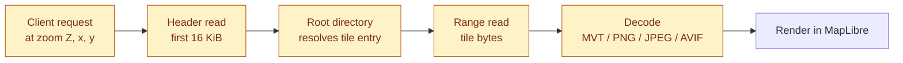
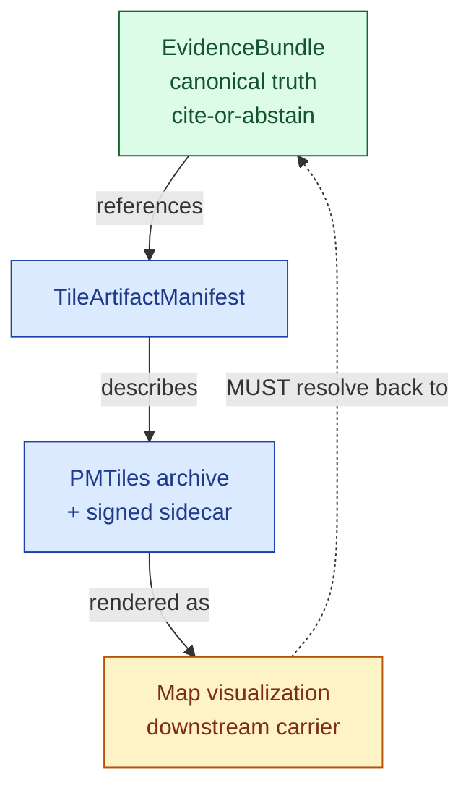
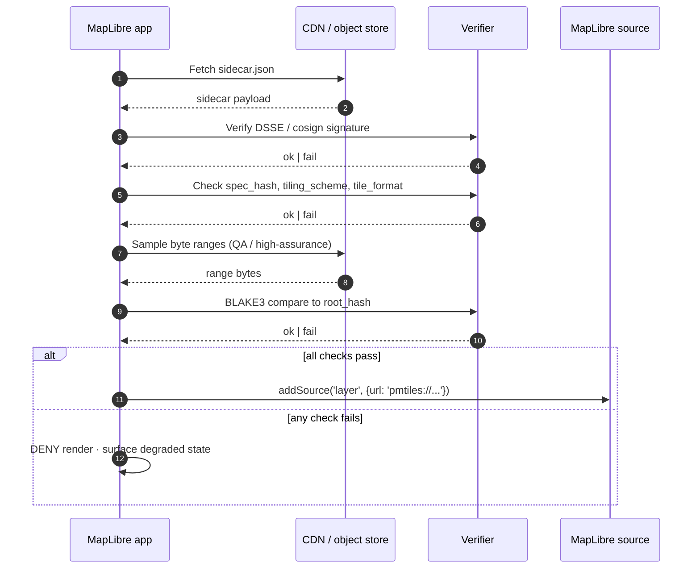
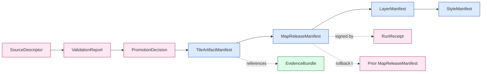

<!-- [KFM_META_BLOCK_V2]
doc_id: kfm://doc/standards/pmtiles
title: PMTiles — KFM Standards Profile
type: standard
version: v1
status: draft
owners: <docs steward + map/tiles subsystem owner — TODO assign>
created: 2026-05-14
updated: 2026-05-14
policy_label: public
related:
  - docs/doctrine/directory-rules.md
  - docs/doctrine/lifecycle-law.md
  - docs/doctrine/trust-membrane.md
  - docs/architecture/map-shell.md
  - docs/standards/STAC.md
  - docs/standards/MVT.md
  - docs/standards/COG.md
  - contracts/release/tile_artifact_manifest.md
  - contracts/release/release_manifest.md
  - schemas/contracts/v1/release/tile_artifact_manifest.schema.json
  - policy/release/
tags: [kfm, standards, tiles, pmtiles, maplibre, release, publication]
notes:
  - PMTiles is CONFIRMED doctrine / PROPOSED implementation
  - All repo paths below are PROPOSED until verified against mounted repo evidence
  - External PMTiles v3 spec facts inline-cited; KFM profile rules sourced to project doctrine
[/KFM_META_BLOCK_V2] -->

# PMTiles — KFM Standards Profile

> How Kansas Frontier Matrix consumes, produces, signs, verifies, and publishes the PMTiles single-file tile archive format — and what KFM forbids when it doesn't.

<!-- Badge row: status, license/policy, validation, version, last-updated -->


**Status:** Draft · **Owners:** _TODO — docs steward + map/tiles subsystem owner_ · **Last updated:** 2026-05-14

---

## Quick Jump

- [1. Purpose & scope](#1-purpose--scope)
- [2. What PMTiles is](#2-what-pmtiles-is)
- [3. KFM trust posture for tiles](#3-kfm-trust-posture-for-tiles)
- [4. Conformance language](#4-conformance-language)
- [5. KFM profile (required fields and behaviors)](#5-kfm-profile-required-fields-and-behaviors)
- [6. Lifecycle placement](#6-lifecycle-placement)
- [7. Sidecar contract](#7-sidecar-contract)
- [8. Verification flow](#8-verification-flow)
- [9. CI publication gates](#9-ci-publication-gates)
- [10. Failure modes and DENY conditions](#10-failure-modes-and-deny-conditions)
- [11. Anti-patterns](#11-anti-patterns)
- [12. When **not** to use PMTiles](#12-when-not-to-use-pmtiles)
- [13. Object-family bindings](#13-object-family-bindings)
- [14. Repo placement (PROPOSED)](#14-repo-placement-proposed)
- [15. Open questions and verification backlog](#15-open-questions-and-verification-backlog)
- [16. References](#16-references)

---

## 1. Purpose & scope

This profile is the **KFM-binding interpretation** of the upstream PMTiles v3 specification. The upstream spec defines the byte format; this profile defines the **governance envelope** around it — which fields are mandatory for a KFM release, what proof must travel with every archive, how clients verify it before `addSource`, and what conditions trigger a `DENY`.

| In scope | Out of scope |
|---|---|
| KFM's profile of PMTiles v3 (vector and raster) | The PMTiles binary format itself — see upstream spec |
| Required sidecar fields and signing | Style spec, glyph spec, sprite spec |
| Verification and CI gates for tile release | Server-mediated tile serving (see Martin/tegola profile) |
| Trust placement of PMTiles in the lifecycle | MVT internal encoding (see `docs/standards/MVT.md`) |
| When PMTiles **must not** be used | Tile authoring tooling (covered in pipeline docs) |

> [!IMPORTANT]
> PMTiles is **CONFIRMED doctrine** in KFM and **PROPOSED implementation** in the current repo. All path-shaped claims below are PROPOSED until verified against mounted-repo evidence. This document defines what KFM *requires* of any PMTiles release, regardless of whether the implementing code currently exists.

---

## 2. What PMTiles is

PMTiles is a single-file archive format for pyramids of map tiles, designed for **static cloud-storage delivery with HTTP Range reads** and no tile server. KFM treats it as a **derived release carrier**, never as a source of evidentiary truth.

**Upstream facts (EXTERNAL):**

- The current specification version is Version 3. [](https://github.com/protomaps/pmtiles)
- PMTiles is a single-file archive format for tiled data. The recommended MIME Type for PMTiles is `application/vnd.pmtiles`. [](https://github.com/protomaps/PMTiles/blob/main/spec/v3/spec.md)
- The magic number is a fixed 7-byte field whose value is always `PMTiles` in UTF-8 encoding (0x50 0x4D 0x54 0x69 0x6C 0x65 0x73). The version is a fixed 1-byte field whose value is always 3 (0x03). [](https://github.com/protomaps/PMTiles/blob/main/spec/v3/spec.md)
- The root directory MUST be contained in the first 16,384 bytes (16 KiB) so that latency-optimized clients can retrieve the root directory in advance. [](https://github.com/protomaps/PMTiles/blob/main/spec/v3/spec.md)
- Spec version 2 would always issue a 512 kilobyte initial request; version 3 reduces this to 16 kilobytes. [](https://protomaps.com/blog/pmtiles-v3-whats-new/)
- GDAL has native support for PMTiles starting with version 3.8.0 (2023-11-13). [](https://docs.protomaps.com/pmtiles/create)



<sub>Diagram: PMTiles v3 read pattern at a high level. Layout is sourced to the upstream spec; the rendering tail is KFM-specific and governed by the verification flow in §8.</sub>

[Back to top](#pmtiles--kfm-standards-profile)

---

## 3. KFM trust posture for tiles

KFM separates **what a tile is** from **what a claim is**. A tile renders pixels; a claim resolves to an `EvidenceBundle`. The two are not the same object, and the rendering layer is not allowed to substitute for the evidence layer.



> [!CAUTION]
> **Visual rendering does not establish evidentiary certainty.** A drawn polygon, a glowing badge, or a confident-looking style is not proof. Any consequential claim must resolve through the Evidence Drawer or Focus Mode to an `EvidenceBundle`, regardless of how good the tile looks.

[Back to top](#pmtiles--kfm-standards-profile)

---

## 4. Conformance language

This profile uses RFC 2119-style terms aligned with `directory-rules.md` §2.2.

| Term | Meaning |
|---|---|
| **MUST / MUST NOT** | Non-negotiable. Violations block release and merge. |
| **SHOULD / SHOULD NOT** | Strong default. Deviation requires explicit justification in the release receipt or per-layer README. |
| **MAY** | Permitted; stay consistent within the lane. |

[Back to top](#pmtiles--kfm-standards-profile)

---

## 5. KFM profile (required fields and behaviors)

Every PMTiles archive published by KFM **MUST** satisfy the following before it can be referenced by any released `LayerManifest`, `StyleManifest`, or public route.

### 5.1 Format

| Field | KFM value | Source |
|---|---|---|
| `pmtiles_version` | `v3` | CONFIRMED doctrine (project) |
| `tiling_scheme` | `xyz` (WebMercator) unless explicitly justified | CONFIRMED doctrine (project) |
| `tile_format` (vector) | `mvt` | CONFIRMED doctrine (project) |
| `tile_format` (raster) | `png`, `jpeg`, or `webp` | PROPOSED (raster lane) |
| MIME type | `application/vnd.pmtiles` | EXTERNAL: upstream spec |
| Magic header | `PMTiles` (7 bytes) + version byte `0x03` | EXTERNAL: upstream spec |

### 5.2 Tile-size budget

> [!WARNING]
> Oversized tiles increase HTTP Range cost, decode time, and client memory pressure. CI **SHOULD** gate pathological tile-size distributions before publication.

| Tile type | KFM target | Rationale |
|---|---|---|
| Vector (MVT) | **≤ 64 KB per tile** | Decode budget; mobile heap safety |
| Raster (PNG/JPEG/WebP) | **≤ 256 KB per tile** | Range-read latency budget |

### 5.3 Hosting

PMTiles publication **MUST** be served from a host that satisfies:

1. **HTTP Range** support (verified by `HEAD` + Range probe in CI).
2. **CORS** allow for the public viewer origin.
3. **Stable cache headers** consistent with the immutability of the archive.
4. **Object-store immutability** (object lock or equivalent) for the released `.pmtiles` and its sidecar.

### 5.4 Pairing

A PMTiles archive **MUST NOT** be published alone. The release unit is `{ .pmtiles, .pmtiles.sidecar.json }`, co-located in the same immutable bucket prefix.

[Back to top](#pmtiles--kfm-standards-profile)

---

## 6. Lifecycle placement

PMTiles is a **PUBLISHED-phase** artifact. It is produced **after** validation, promotion, and policy gates. It MUST NOT be sourced from `RAW`, `WORK`, or `QUARANTINE`, and tile build is not a substitute for source review.

```
RAW → WORK / QUARANTINE → PROCESSED → CATALOG / TRIPLET → PUBLISHED ← PMTiles lands here
```

| Phase | PMTiles relationship |
|---|---|
| `data/raw/` | Source artifacts only. Never tile-direct. |
| `data/work/` or `data/quarantine/` | Source preparation, sensitivity review. No tile yet. |
| `data/processed/` | Canonical pre-tile artifacts (e.g., GeoParquet, COG). |
| `data/catalog/` and `data/triplets/` | STAC/PROV closure; tile asset registered. |
| `data/published/` | Immutable `.pmtiles` + sidecar; referenced by a signed `MapReleaseManifest`. |

> [!NOTE]
> **Promotion is a governed state transition, not a file move.** A PMTiles file appearing in a "published" directory without a signed `PromotionDecision` and a referenced `MapReleaseManifest` is drift, not a release.

[Back to top](#pmtiles--kfm-standards-profile)

---

## 7. Sidecar contract

The sidecar is the **public verification envelope** for the tile artifact. It carries integrity metadata, provenance linkage, the signing proof, publication metadata, and optional delta manifests. **Without the sidecar, the tile is not a KFM release.**

### 7.1 Placement

```
data/published/tiles/<layer-slug>/<version>/
├── layer.pmtiles
└── layer.pmtiles.sidecar.json
```

> [!IMPORTANT]
> The path above is **PROPOSED**. Final placement MUST be checked against `docs/doctrine/directory-rules.md` and any ADR governing `data/published/` substructure. See §14.

### 7.2 Required fields (CONFIRMED in project doctrine)

```json
{
  "spec_hash":            "blake3_of_canonical_source_descriptor",
  "pmtiles_version":      "v3",
  "root_hash":            "blake3_of_pmtiles_root",
  "root_hash_algo":       "blake3",
  "tile_format":          "mvt",
  "tiling_scheme":        "xyz",
  "minzoom":              0,
  "maxzoom":              14,
  "byte_ranges_manifest": [],
  "delta_base_hash":      null,
  "generation_tool":      "tippecanoe@<version> + go-pmtiles@<version>",
  "timestamp":            "RFC3339",
  "signature_b64":        "DSSE_or_cosign_signature",
  "signature_algo":       "ed25519",
  "signature_kid":        "key-id-or-kms-uri",
  "rekor_index_or_proof": "transparency-log-entry-or-inclusion-proof"
}
```

### 7.3 Field semantics

| Field | Purpose | KFM rule |
|---|---|---|
| `spec_hash` | Deterministic fingerprint of the canonicalized `SourceDescriptor` | MUST be reproducible from canonicalized inputs |
| `pmtiles_version` | Format version | MUST be `"v3"` |
| `root_hash` / `root_hash_algo` | Integrity anchor for the archive | MUST be BLAKE3 over the PMTiles root |
| `tile_format` | Inner tile encoding | MUST match actual archive contents |
| `tiling_scheme` | Tile addressing scheme | MUST be `"xyz"` unless an ADR justifies otherwise |
| `minzoom` / `maxzoom` | Zoom envelope | MUST match the build output |
| `byte_ranges_manifest` | Optional per-tile/chunk hashes for high-assurance verification | RECOMMENDED for offline-verifiable releases |
| `delta_base_hash` | Parent artifact linkage for incremental updates | REQUIRED when publishing a delta |
| `generation_tool` | Build provenance | MUST record tool@version (e.g. tippecanoe, go-pmtiles) |
| `timestamp` | Generation time | MUST be RFC 3339 UTC |
| `signature_b64` / `signature_algo` / `signature_kid` | Detached signature over the sidecar payload | MUST be present and verifiable |
| `rekor_index_or_proof` | Transparency-log entry or inclusion proof | MUST be present for public release |

> [!CAUTION]
> **Sidecars are publication artifacts.** They MUST NOT expose secrets, private source locations, unpublished policy state, or restricted `EvidenceBundle` contents.

[Back to top](#pmtiles--kfm-standards-profile)

---

## 8. Verification flow

Every public client **MUST** verify the sidecar before registering the PMTiles source in the renderer. This is non-negotiable for the public path.



### 8.1 MapLibre runtime checklist

- [ ] Fetch sidecar (same bucket as the `.pmtiles`)
- [ ] Verify DSSE / cosign signature
- [ ] Verify `spec_hash`, `tiling_scheme`, `tile_format` match expected layer profile
- [ ] (High-assurance builds) sample byte ranges, BLAKE3-hash, compare to `root_hash`
- [ ] Only then call `map.addSource(...)`
- [ ] **Fail closed** on any mismatch — render an explicit degraded state, not silence

### 8.2 Cesium / 3D path

For Cesium and other 3D consumers, KFM **PREFERS** server-rasterized PMTiles or raster PMTiles with signed sidecar over client-side vector verification.

| Recommendation | Reason |
|---|---|
| Raster drape preferred | Lower client verification cost |
| Short-lived signed URLs | Reduce artifact scraping |
| Token allowlists | Access control on gated layers |
| Sampled range hashing only on low-confidence builds | Practical integrity validation |

[Back to top](#pmtiles--kfm-standards-profile)

---

## 9. CI publication gates

Every PMTiles release **MUST** pass the following gates before promotion to PUBLISHED. PROPOSED gate set, drawn from project doctrine.

| Gate | Required | Surface |
|---|---|---|
| Canonical `SourceDescriptor` stable | YES | `spec_hash` reproducible across runs |
| `spec_hash` deterministic | YES | Cross-run hash equality test |
| Sidecar present and well-formed | YES | Schema validation against `tile_artifact_manifest.schema.json` (PROPOSED home: `schemas/contracts/v1/release/`) |
| Sidecar signed (DSSE / cosign) | YES | `cosign verify-blob` passes |
| Transparency log entry present | YES | `rekor_index_or_proof` resolves |
| HTTP Range + CORS support verified on host | YES | HEAD + Range probe |
| Tile-size distribution within budget | SHOULD | Distribution test against §5.2 |
| Rights / sensitivity posture resolved | YES | Policy decision recorded; no unresolved deferrals |
| Sensitive geometry reviewed and transformed before tile build | YES | See §10 and `policy/sensitivity/` |
| `MapReleaseManifest` references the tile asset | YES | Catalog closure check |
| Rollback target identified | YES | Prior `MapReleaseManifest` pointer present |
| `RunReceipt` records build provenance | YES | Receipt links signature proof id |

<details>
<summary><strong>Drop-in CI checklist (build lane → publish)</strong></summary>

```bash
# 1. Capture source identity and canonicalize
#    - record ETag, Last-Modified, Content-Length of upstream
#    - canonicalize SourceDescriptor JSON, compute BLAKE3
blake3 canonical_descriptor.json > spec_hash.txt

# 2. Build PMTiles (vector example via tippecanoe + go-pmtiles)
tippecanoe -o layer.mbtiles -Z5 -z14 --force input.geojson
pmtiles convert layer.mbtiles layer.pmtiles

# 3. Compute integrity anchor
blake3 layer.pmtiles > root_hash.txt

# 4. Emit sidecar (template in §7.2) and sign it
cosign sign-blob \
  --output-signature sidecar.sig \
  --key cosign.key \
  layer.pmtiles.sidecar.json

# 5. Upload .pmtiles + sidecar together to immutable object store
# 6. Record signature proof id in RunReceipt
# 7. Reference asset in MapReleaseManifest and update catalog
```

> Example commands are illustrative; exact tool versions, flags, and signing keys MUST be pinned in `pipeline_specs/` and `infra/` per repo convention. GDAL has native support for PMTiles starting with version 3.8.0 (2023-11-13) [](https://docs.protomaps.com/pmtiles/create) and may also be used as a builder for raster sources.

</details>

[Back to top](#pmtiles--kfm-standards-profile)

---

## 10. Failure modes and DENY conditions

The publication pipeline and the public client **MUST** fail closed on the conditions below. Silent fallback to a stale tile or to a degraded render without a visible trust-state badge is itself a violation.

| Condition | Action |
|---|---|
| Invalid signature | **DENY** |
| Missing sidecar | **DENY** |
| Unknown tiling scheme | **DENY** |
| Invalid or missing `spec_hash` | **DENY** |
| Tile format mismatch (declared vs actual) | **DENY** |
| Unresolved rights or sensitivity posture | **DENY** |
| Exact sensitive geometry exposed (e.g., rare-species precision below the policy threshold) | **DENY** |
| Publication before review state is recorded | **DENY** |
| Unverifiable delta chain (`delta_base_hash` cannot be resolved) | **DENY** |
| Source-layer mismatch between style and tile | **DENY** at style-compile time |
| Missing `RunReceipt` linkage | **DENY** |
| Transparency-log entry absent | **DENY** |

> [!WARNING]
> A "trust badge" or signature icon in the UI is **not enough**. Failures MUST deny or fall back **before** render, and the trust-visible state of the layer (released / stale / degraded / denied) MUST be exposed to the user.

[Back to top](#pmtiles--kfm-standards-profile)

---

## 11. Anti-patterns

| Anti-pattern | What it looks like | Why it's wrong |
|---|---|---|
| **Treating tiles as proof** | Citing a rendered polygon as an authoritative claim | PMTiles is a downstream carrier; claims resolve to `EvidenceBundle` |
| **Style-only hiding of sensitive geometry** | Filtering out a `protected: true` feature in MapLibre paint | Sensitive geometry MUST be transformed *before* tile build, not hidden by style |
| **Hand-coded raw tile URLs in style JSON** | `"tiles": ["https://some-bucket/...pmtiles/{z}/..."]` written by hand | UI wiring MUST be generated from released manifests |
| **PMTiles before review** | Tile build pipeline runs ahead of sensitivity / rights review | Publication is a state transition; build is not promotion |
| **MLT as default** | Switching the renderer to the MapLibre Tile format because it is newer | MLT remains **NEEDS VERIFICATION** until toolchain and renderer support are proven |
| **Verification theater** | Showing a green checkmark icon without an actual signature check | Cosmetic badges are not gates |
| **Layer toggle as publication** | UI toggle "publishes" a layer | Publication is a governed `PromotionDecision` + signed `ReleaseManifest`, not a UI state |

[Back to top](#pmtiles--kfm-standards-profile)

---

## 12. When **not** to use PMTiles

PMTiles is excellent for **stable, public-safe, low-cadence, static-CDN-friendly** layers. It is the wrong tool for several other cases.

| Avoid PMTiles when… | Use instead |
|---|---|
| Data is highly transactional or real-time | Server-mediated tiles (Martin / tegola), governed API |
| Per-user policy filtering is required | Server-mediated tiles behind the governed API; capability tokens |
| Access must be revocable per row or per feature | Server-mediated; do not bake gated content into a static archive |
| The layer changes more frequently than the release cadence can publish | Server-mediated; consider H3 tile-diff watcher patterns (PROPOSED) |
| The data is intermediate / build-only | `MBTiles` as a build intermediate, then convert |
| Raster analysis with overviews and range reads | `COG` (Cloud Optimized GeoTIFF) |
| Continuous raster surfaces with scientific access patterns | `COG` + STAC item |

> [!NOTE]
> "Universal default PMTiles" is a documented anti-pattern in the KFM map-strategy table. PMTiles wins for static, public-safe derivatives; it loses for dynamic, access-controlled, or per-user-filtered surfaces.

[Back to top](#pmtiles--kfm-standards-profile)

---

## 13. Object-family bindings

PMTiles is bound into KFM's object-family graph through the following contracts (PROPOSED implementation paths; CONFIRMED object families).



| Object family | Role for PMTiles | Status |
|---|---|---|
| `SourceDescriptor` | Upstream identity; basis for `spec_hash` | CONFIRMED family / PROPOSED home |
| `TileArtifactManifest` | Tile-level integrity contract (sidecar fields + extras) | CONFIRMED family / PROPOSED schema home |
| `MapReleaseManifest` | Release decision that references the tile asset | CONFIRMED family / PROPOSED home |
| `LayerManifest` | Layer-level binding to released tile asset | CONFIRMED family / PROPOSED home |
| `StyleManifest` | Style binding; `tileProtocol` enum includes `pmtiles` | CONFIRMED family / PROPOSED home |
| `PromotionDecision` | Governed state transition to PUBLISHED | CONFIRMED family / PROPOSED home |
| `RunReceipt` | Build provenance; links signature proof id | CONFIRMED family / PROPOSED home |
| `EvidenceBundle` | What clicked features MUST resolve to | CONFIRMED family / PROPOSED home |

[Back to top](#pmtiles--kfm-standards-profile)

---

## 14. Repo placement (PROPOSED)

The following paths are **PROPOSED** in line with `docs/doctrine/directory-rules.md`. Each is **NEEDS VERIFICATION** until checked against current mounted-repo evidence.

```
docs/
└── standards/
    └── PMTILES.md                                # this file (standards profile)

contracts/
└── release/
    └── tile_artifact_manifest.md                 # PROPOSED — meaning

schemas/
└── contracts/
    └── v1/
        └── release/
            └── tile_artifact_manifest.schema.json # PROPOSED — shape (per ADR-0001)

policy/
├── release/                                      # release-gate policy
└── sensitivity/                                  # sensitivity classes and redaction rules

data/
└── published/
    └── tiles/
        └── <layer-slug>/<version>/
            ├── layer.pmtiles
            └── layer.pmtiles.sidecar.json
```

> [!NOTE]
> Per `directory-rules.md`, `docs/standards/` is the canonical home for **external standards KFM conforms to** (e.g., STAC, DCAT, PROV). PMTiles fits this lane. The placement is therefore PROPOSED with high confidence, pending mounted-repo verification.

> [!IMPORTANT]
> Per ADR-0001 (schema home), the default machine-schema home is `schemas/contracts/v1/...`. A `TileArtifactManifest` schema **MUST NOT** be authored in `contracts/<…>/…schema.json` form. If a parallel home exists in the current repo, treat it as **CONFLICTED** and route through the drift register.

[Back to top](#pmtiles--kfm-standards-profile)

---

## 15. Open questions and verification backlog

These items are explicitly **not resolved** by this profile and SHOULD be tracked in `docs/registers/VERIFICATION_BACKLOG.md`.

- **NEEDS VERIFICATION** — Whether `schemas/contracts/v1/release/tile_artifact_manifest.schema.json` exists in the current mounted repo or whether the schema is currently authored elsewhere.
- **NEEDS VERIFICATION** — Pinned tool versions for the build chain: `tippecanoe`, `go-pmtiles` (`pmtiles` CLI), `pmtiles-js`, `pmtiles-rs`, MapLibre GL JS, GDAL, cosign, BLAKE3 implementation.
- **NEEDS VERIFICATION** — Whether KFM's signing path is DSSE-over-cosign, plain cosign keyless, KMS-backed, or hybrid. The sidecar template above is doctrine-consistent but does not pre-decide.
- **NEEDS VERIFICATION** — Whether MLT (MapLibre Tile) inside PMTiles is on the roadmap or remains pilot-only. Project doctrine currently labels MLT as **NEEDS VERIFICATION** until toolchain and renderer support are proven.
- **OPEN** — Whether the byte-ranges manifest is RECOMMENDED for every public release or REQUIRED for a defined sensitivity class.
- **OPEN** — Whether delta updates (`delta_base_hash`, `byte_ranges_manifest`) require a separate `DeltaReleaseManifest` family or are absorbed into `MapReleaseManifest`.
- **OPEN** — Whether KFM publishes a public `pmtiles.io`-style inspector mirror, or treats inspection as a stewarded-only tool.
- **OPEN** — Per-layer SLO targets (the project notes a sample target of p95 tile fetch under 150 ms from CDN; **NEEDS VERIFICATION** whether this is normative for KFM).

[Back to top](#pmtiles--kfm-standards-profile)

---

## 16. References

### KFM doctrine (project sources)

- `docs/doctrine/directory-rules.md` — placement authority for this file and related schemas
- `docs/doctrine/lifecycle-law.md` — RAW → WORK / QUARANTINE → PROCESSED → CATALOG / TRIPLET → PUBLISHED
- `docs/doctrine/trust-membrane.md` — public path discipline
- `docs/architecture/map-shell.md` — MapLibre shell, source registration, evidence resolution
- `docs/standards/STAC.md` — STAC profile (PMTiles asset role)
- `docs/standards/MVT.md` — vector tile internal encoding
- `docs/standards/COG.md` — raster carrier alternative
- `contracts/release/` — `TileArtifactManifest`, `MapReleaseManifest` semantics
- `schemas/contracts/v1/release/` — machine-checkable shapes
- `policy/release/`, `policy/sensitivity/` — admissibility and sensitivity gates

### External standards and tooling

- PMTiles v3 specification (`protomaps/PMTiles`, `spec/v3/spec.md`) [](https://github.com/protomaps/PMTiles/blob/main/spec/v3/spec.md) — authoritative format definition
- PMTiles GitHub repository (`protomaps/PMTiles`) [](https://github.com/protomaps/pmtiles) — go-pmtiles CLI, JS library, OpenLayers integration
- Protomaps PMTiles documentation [](https://docs.protomaps.com/pmtiles/) — pmtiles concepts and viewer
- "What's new in PMTiles V3" (Protomaps blog) [](https://protomaps.com/blog/pmtiles-v3-whats-new/) — v2→v3 changes, smaller initial request, metadata limits
- Protomaps "Creating PMTiles" docs [](https://docs.protomaps.com/pmtiles/create) — `rio pmtiles`, GDAL native support from 3.8.0
- DSSE, cosign, Rekor — sigstore ecosystem (transparency, signing, attestation)
- BLAKE3 — integrity hashing

> [!NOTE]
> External references above support generic format and tooling facts only. They do **not** authorize KFM-specific repo-state claims; those remain governed by `directory-rules.md` and current mounted-repo evidence.

---

## Related docs

- [Directory Rules](../doctrine/directory-rules.md) · _TODO verify path_
- [STAC profile](./STAC.md) · _TODO author_
- [MVT profile](./MVT.md) · _TODO author_
- [COG profile](./COG.md) · _TODO author_
- [Map Shell architecture](../architecture/map-shell.md) · _TODO verify path_
- [TileArtifactManifest contract](../../contracts/release/tile_artifact_manifest.md) · _TODO verify path_

**Last reviewed:** 2026-05-14 · **Next review:** flag if older than 6 months · [Back to top](#pmtiles--kfm-standards-profile)
