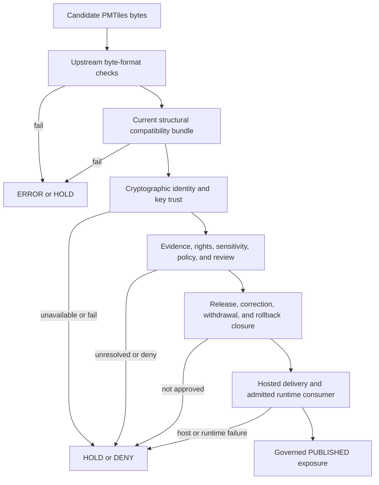
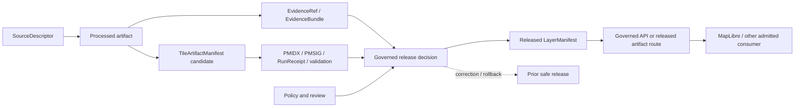

<!-- [KFM_META_BLOCK_V2]
doc_id: kfm://doc/standards/pmtiles
title: PMTiles — KFM Archive and Readiness Boundary
type: standard; archive-guidance; carrier-readiness-boundary
version: v2.0-draft
status: "draft; repository-grounded; upstream-currentness-refreshed; partial-structural-implementation; no-adoption; no-release; no-publication"
owners:
  - "@bartytime4life — verified default GitHub review route through the standards-lane boundary"
  - "NEEDS VERIFICATION — PMTiles, map/tile, standards, contract, schema, policy, evidence, security, release, runtime, performance, and independent-review stewards"
created: 2026-05-14
updated: 2026-08-18
policy_label: "repository-facing; standards-guidance; pmtiles; map-carrier; release-gated; public-safe-only"
owning_root: docs/
current_path: docs/standards/PMTILES.md
responsibility: >
  Explain the upstream PMTiles Version 3 archive format, distinguish it from
  inner tile encodings, hosting, KFM attestation, runtime activation, and
  governed publication, disclose the exact bounded PMTiles-related
  implementation currently present in the repository, and define the evidence
  required before KFM may claim conformance or release a public PMTiles carrier.
truth_posture: >
  CONFIRMED current path, standards-lane placement, default review route,
  upstream PMTiles Version 3 structure and tile-type registry, current split
  SHA-256 PMTiles/PMIDX/PMSIG/RunReceipt compatibility checks, synthetic
  partial-read and mobile verification fixtures, deny-by-default policy text,
  partial CI gate, inactive metadata-readiness profile, unresolved
  TileArtifactManifest schema family, and MapLibre package scaffold / PROPOSED
  canonical PMTiles attestation profile, cryptographic key trust, policy
  execution, release binding, browser admission, hosting profile, performance
  budgets, correction, and rollback behavior / UNKNOWN production PMTiles
  generation, deployed Range/CORS behavior, functioning MapLibre PMTiles
  consumer, released PMTiles artifacts, public publication, and accountable
  specialist stewardship.
evidence_snapshot:
  repository: bartytime4life/Kansas-Frontier-Matrix
  base_ref: main
  base_commit: 6e45646702022513fa0777b294d09ea90d73cf58
  target_prior_blob: 4dd59b0341aa7a2bac2962cf80e9beab2938caa0
  attestation_standard_blob: 372845bd9ee9877a96de2d01d824e003d22010b5
  pmidx_spec_blob: 2dd09ad79f935ed5f61d6be899fdfd5e60e6d4a9
  attestation_fixture_readme_blob: a9e8d87db4688c69e88121e15542ac1f3abc7c55
  mobile_fixture_readme_blob: e6758940031ca4e0fc274d27a32e058034e250d5
  attestation_workflow_blob: 7857db8fafc77b40c84f09d208ca6a60d2b7d4df
  tile_artifact_contract_blob: 138e2d97b0d0bd7311c7c36a45ed983bae63b154
  tile_artifact_schema_blob: ed8fb0834c06a6254d6175f9a08b8d17ccc68d71
  carrier_readiness_contract_blob: 17055a680b83a4f83834735e88aeb0569322845b
  tiles_policy_blob: 5ac2a37d468f99f9195667f723d99b2b7a3325f4
  development_signer_blob: e519a96ed57ba26085604ac45a145c869f30958c
external_currentness_review:
  access_date: 2026-08-18
  upstream_spec: "PMTiles Version 3 Specification; v3 changelog through 3.6"
  upstream_delivery: "Protomaps cloud-storage, CLI, and MapLibre guidance"
  currentness_risk: "The archive header version remains 3 while v3 capabilities and implementations continue to evolve"
related:
  - ./README.md
  - ./MVT.md
  - ./COG.md
  - ./OGC-API-TILES.md
  - ./pmtiles/PMTILES_ATTESTATION_STANDARD.md
  - ./pmtiles/PMIDX_SPEC_V1.md
  - ../doctrine/directory-rules.md
  - ../adr/ADR-0029-adopt-directory-governance-standard-v2.md
  - ../../contracts/release/tile_artifact_manifest.md
  - ../../contracts/release/geospatial_carrier_readiness.md
  - ../../schemas/contracts/v1/map/tile_artifact_manifest.schema.json
  - ../../tools/validators/pmtiles/README.md
  - ../../fixtures/pmtiles/attestation/README.md
  - ../../fixtures/pmtiles/mobile_verification/README.md
  - ../../tests/validators/test_pmtiles_attestation_bundle.py
  - ../../.github/workflows/pmtiles-attestation.yml
  - ../../policy/rego/tiles_publish.rego
  - ../../packages/maplibre/README.md
tags: [kfm, standards, pmtiles, tiles, mvt, mlt, maplibre, attestation, carrier-readiness, release]
notes:
  - "Same-path documentation modernization only; no contract, schema, policy, fixture, validator, workflow, package, source, tile artifact, release object, runtime, deployment, or public product changes."
  - "The prior page overstated KFM-wide adoption, a monolithic sidecar, browser-side cryptographic verification, and production release behavior."
  - "This revision distinguishes upstream archive conformance, the current non-canonical structural compatibility slice, hosted delivery readiness, runtime admission, and governed release."
  - "Malformed generated citation tokens are removed and replaced with direct authoritative references."
  - "Legacy title and numbered-section anchors are retained for inbound-link compatibility."
[/KFM_META_BLOCK_V2] -->

<a id="top"></a>
<a id="pmtiles--kfm-standards-profile"></a>

# PMTiles — KFM Archive and Readiness Boundary

> **Purpose.** Explain what PMTiles Version 3 governs, what KFM currently checks, what remains non-canonical or unimplemented, and what must be proven before a PMTiles carrier may participate in a governed release.


> [!IMPORTANT]
> **A PMTiles archive is a derived delivery carrier, not evidence, policy, review, release, or public truth.** A valid header, matching digest, successful range read, visible MapLibre layer, passing fixture, signature-shaped object, or green workflow does not establish source authority, public safety, evidence closure, release approval, or publication.

> [!CAUTION]
> **Current KFM implementation is bounded and non-canonical.** The repository implements deterministic, no-network structural checks for a split SHA-256 PMTiles + PMIDX + PMSIG + RunReceipt compatibility bundle, optional declared-manifest reconciliation, captured partial-read fixtures, and a synthetic mobile decode/render handoff. Cryptographic signature trust, canonical schema authority, policy execution, release/correction/rollback closure, functioning MapLibre protocol admission, deployed hosting, and public publication remain held or unknown.

> [!WARNING]
> **Do not collapse archive, payload, transport, runtime, and release.** PMTiles is an archive format. MVT, MapLibre Vector Tile, PNG, JPEG, WebP, and AVIF are inner tile types. HTTP Range or a server-mediated Z/X/Y API is delivery. MapLibre protocol registration is runtime integration. KFM evidence, policy, review, and release records decide whether the carrier may be exposed.

| Field | Current bounded result |
|---|---|
| **Evidence snapshot** | `main@6e45646702022513fa0777b294d09ea90d73cf58` |
| **Directory result** | `PLACE` at existing `docs/standards/PMTILES.md`; accepted Directory Rules assign human-readable standards guidance to `docs/standards/` |
| **Upstream baseline** | PMTiles Version 3; v3 changelog reviewed through 3.6 on 2026-08-18 |
| **KFM adoption** | **NOT ESTABLISHED** as one accepted canonical PMTiles attestation, hosting, runtime, or publication profile |
| **Current executable proof** | Structural compatibility checks over synthetic or repository-local candidates; authority remains `NONE` |
| **Canonical manifest/schema** | `TileArtifactManifest` semantics are proposed; the only inspected schema is an open map-family scaffold |
| **Cryptographic verification** | **NOT ESTABLISHED**; PMSIG handling is shape-only and the repository signer emits an explicit development placeholder |
| **Policy execution** | Deny-by-default Rego text exists; execution and policy tests in the PMTiles release path are not established by the inspected workflow |
| **Browser/runtime consumer** | Synthetic PNG verification/render handoff exists; MapLibre boot, `pmtiles://` protocol admission, and a functioning package consumer are not established |
| **Hosted delivery** | Range/CORS behavior is an upstream requirement for direct browser delivery; no KFM deployment or host probe is established here |
| **Release/public effect** | None |

**Quick navigation:** [Purpose](#1-purpose--scope) · [Upstream](#2-what-pmtiles-is) · [Trust](#3-kfm-trust-posture-for-tiles) · [Language](#4-conformance-language) · [Profile](#5-kfm-profile-required-fields-and-behaviors) · [Lifecycle](#6-lifecycle-placement) · [Sidecars](#7-sidecar-contract) · [Verification](#8-verification-flow) · [CI](#9-ci-publication-gates) · [Failures](#10-failure-modes-and-deny-conditions) · [Anti-patterns](#11-anti-patterns) · [Alternatives](#12-when-not-to-use-pmtiles) · [Objects](#13-object-family-bindings) · [Placement](#14-repo-placement-proposed) · [Open work](#15-open-questions-and-verification-backlog) · [References](#16-references)

---

## 1. Purpose & scope

This page is the human-readable KFM boundary for PMTiles. It records the checked upstream format, the repository's current structural compatibility slice, the intended governance posture, and the evidence still required for conformance or release claims.

It is **not** the byte-format specification, a canonical machine schema, a policy rule, an attestation, a release decision, a deployment contract, or proof that a public KFM client consumes PMTiles.

### 1.1 Authority by question

| Question | Owning authority | Role of this page |
|---|---|---|
| What PMTiles Version 3 means | The official PMTiles specification and changelog | Record the checked upstream baseline; do not redefine it |
| Whether KFM adopts PMTiles | Accepted KFM decisions, active contracts/schemas/policy, implementation, tests, and release evidence | State the current unresolved adoption boundary |
| What the KFM PMTiles compatibility bundle checks | Current validator code, fixtures, tests, and workflow at a pinned revision | Summarize its exact structural limits |
| What `TileArtifactManifest` means | [`contracts/release/tile_artifact_manifest.md`](../../contracts/release/tile_artifact_manifest.md) | Cite semantics; do not select the unresolved schema family |
| What machine shape is valid | An accepted schema under `schemas/` | State that the current map-family schema is an open scaffold |
| What is allowed or denied | `policy/`, governed review, and release authority | Explain prerequisites; do not execute or replace policy |
| Whether a signature is trusted | Approved cryptographic implementation, key registry, signer policy, and verification evidence | State that current PMSIG checks are non-cryptographic |
| Whether a host is PMTiles-ready | Observed HTTP Range, CORS, validator, cache, integrity, and failure evidence for the deployed endpoint | Record target checks; do not infer deployment behavior |
| Whether a browser may load the archive | Accepted runtime adapter/protocol, manifest binding, policy, release, and browser tests | State that current MapLibre activation is not established |
| Whether a release may publish | Evidence, policy, review, proof, release, correction, and rollback authorities | Explain closure; never approve publication |

### 1.2 In scope and out of scope

| In scope | Out of scope |
|---|---|
| PMTiles Version 3 archive facts and currentness | Redefining upstream PMTiles bytes |
| KFM trust and lifecycle posture for PMTiles carriers | MVT or MLT payload semantics; see [`MVT.md`](./MVT.md) and upstream encoding specifications |
| Current PMTiles compatibility validators, fixtures, policy text, and CI boundary | Activating a source, renderer dependency, endpoint, or public route |
| Candidate manifest, sidecar, attestation, hosting, and release evidence | Creating a canonical `TileArtifactManifest` schema |
| Fail-closed and correction expectations | Approving rights, sensitivity, review, release, or publication |
| Alternatives when PMTiles is the wrong carrier | General map styling, glyph, sprite, or scene architecture |

### 1.3 Current evidence limit

Repository bytes prove that the named files and checks exist at the evidence snapshot. They do not prove production inputs, successful hosted Range behavior, deployed consumer interoperability, current required-check settings, cryptographic key custody, authorized review, release, or publication.

[Back to top](#top)

---

## 2. What PMTiles is

PMTiles is a single-file archive format for tiled data. The archive can be read from local storage or through byte-range access on static/object storage; a server can also expose its contents through another API. KFM treats PMTiles as a downstream carrier for already-governed, public-safe derivatives.

### 2.1 Upstream Version 3 checkpoint

The authoritative PMTiles material checked on 2026-08-18 establishes:

| Upstream property | Version 3 rule |
|---|---|
| Archive purpose | One file containing a pyramid of tiled data |
| Recommended media type | `application/vnd.pmtiles` |
| Header | Fixed 127 bytes at offset zero |
| Magic and format version | UTF-8 `PMTiles` followed by version byte `0x03` |
| Root directory | Header plus compressed root directory must fit within the first 16,384 bytes |
| Main sections | Header, root directory, JSON metadata, optional leaf directories, and tile data |
| Internal compression | Unknown, none, gzip, Brotli, or Zstandard enum values |
| Tile compression | Declared once in the header for the archive's tiles |
| Tile type | Unknown/other, MVT, PNG, JPEG, WebP, AVIF, or MapLibre Vector Tile |
| Metadata | Valid UTF-8 JSON object; MVT archives must include `vector_layers` as defined by TileJSON 3.0 |
| Tile identity | Directory entries address tile content through PMTiles TileIDs derived from Z/X/Y |
| Bounds and zoom | Stored in the header; max zoom must be greater than or equal to min zoom |

The header format version remains `3`. The separate v3 changelog has evolved through revisions that added AVIF, MapLibre Vector Tile, clarified directory rules, and added terrain encoding metadata. KFM tooling must therefore pin and test the exact feature subset it accepts rather than treating the string “v3” as proof of universal compatibility.

### 2.2 What PMTiles does not define

PMTiles does not define:

- whether source records are authoritative, licensed, current, or public-safe;
- KFM evidence, policy, review, release, correction, or rollback state;
- the meaning of MVT/MLT fields or raster pixels;
- a public API contract, layer semantics, style semantics, or Evidence Drawer payload;
- a required KFM signing, sidecar, receipt, or catalog profile;
- whether direct browser access or a server-mediated tile API is appropriate;
- per-user authorization or row-level revocation.

### 2.3 Archive, payload, delivery, and renderer separation

| Layer | Examples | Governs |
|---|---|---|
| Archive | PMTiles Version 3 | Header, directories, metadata, tile-data layout |
| Inner payload | MVT, MapLibre Vector Tile, PNG, JPEG, WebP, AVIF | Vector or raster tile encoding |
| Tile coordinate/addressing context | Z/X/Y, tile matrix set, CRS, scheme | How tile coordinates map to space |
| Direct delivery | Static/object storage with HTTP Range and CORS | Byte retrieval from the archive |
| Server-mediated delivery | Z/X/Y endpoint, OGC API - Tiles profile, governed API | Server resolves archive bytes into responses |
| Renderer integration | `pmtiles` JavaScript protocol for MapLibre, another admitted client | Runtime source registration and decoding |
| KFM governance | Evidence, policy, review, release, correction, rollback | Whether the carrier may be exposed and how it remains accountable |

Upstream `pmtiles verify` checks archive ordering and header information. It is useful byte-format evidence, but it is not a KFM attestation, source review, policy decision, release manifest, or publication approval.

[Back to top](#top)

---

## 3. KFM trust posture for tiles

> **One-line law.** PMTiles may carry released map derivatives; it must never become the source, evidence bundle, policy engine, review record, release authority, or correction ledger.

### 3.1 Trust rules

- Public clients may consume only governed, released, public-safe artifacts or governed API responses.
- Sensitive geometry and attributes must be removed, generalized, redacted, or withheld **before** archive construction. Renderer styling is not a security boundary.
- Every consequential map-visible claim must retain resolvable evidence and release context outside the tile bytes.
- Archive identity, content digest, source/build lineage, policy/review state, release state, correction lineage, and rollback target remain separate inspectable objects.
- A candidate archive may be built and tested before publication. Build success is not lifecycle promotion.
- Unknown rights, sensitivity, evidence, signature trust, policy, release, or rollback state fails closed for public exposure.

### 3.2 State separation

| Axis | Example | Must not be confused with |
|---|---|---|
| Upstream conformance | Header and directory bytes satisfy PMTiles Version 3 | KFM adoption or release |
| Declared carrier readiness | Metadata says v3/MVT/XYZ, bounded size, approved fields | Byte-format proof or policy approval |
| Structural compatibility | PMTiles/PMIDX/PMSIG/RunReceipt values reconcile | Cryptographic trust or source truth |
| Hosted readiness | Range, CORS, cache, and byte integrity work on a deployed host | Release approval |
| Runtime readiness | An admitted adapter loads the released artifact and fails closed | Evidence or policy authority |
| Release readiness | Evidence, rights, sensitivity, validation, review, manifest, correction, and rollback close | Public exposure by itself |
| Publication | A governed release is actually exposed through an authorized route | Permanent truth; correction still applies |

### 3.3 Current repository evidence

| Surface | CONFIRMED observation | Safe conclusion |
|---|---|---|
| [`docs/standards/README.md`](./README.md) | Standards pages are human-readable guidance and must separate adoption, implementation, validation, release, and publication | This page cannot adopt PMTiles or prove conformance |
| [`PMTILES_ATTESTATION_STANDARD.md`](./pmtiles/PMTILES_ATTESTATION_STANDARD.md) | Draft v1.2 records partial structural implementation and unresolved canonical profile/signature/policy/release authority | The nested page is a proposed attestation design plus implementation ledger, not release authority |
| [`PMIDX_SPEC_V1.md`](./pmtiles/PMIDX_SPEC_V1.md) | Documents the implemented SHA-256 chunk/Merkle compatibility profile and unauthenticated range-metadata limitation | PMIDX v1 is an implemented compatibility profile, not an adopted long-term profile |
| [`tools/validators/pmtiles/`](../../tools/validators/pmtiles/README.md) | Header, metadata, archive digest, chunk leaves, Merkle root, declared ranges, bundle subjects, and opt-in manifest declarations receive deterministic structural checks | Success has `authority: NONE`; canonical schema, crypto, policy, and release remain separate |
| [`fixtures/pmtiles/attestation/`](../../fixtures/pmtiles/attestation/README.md) | Synthetic mutation descriptors generate PMTiles and companion bytes in temporary directories | Fixture success proves only the named no-network behavior |
| [`fixtures/pmtiles/mobile_verification/`](../../fixtures/pmtiles/mobile_verification/README.md) | Tiny synthetic archive, partial verification, PNG decode, and browser canvas handoff are tested | MapLibre is not booted; runtime and release holds remain |
| [`pmtiles-attestation.yml`](../../.github/workflows/pmtiles-attestation.yml) | Read-only, no-secret workflow checks boundaries, runs synthetic tests, inspects candidates, and deliberately denies structurally complete candidates while crypto/release remain unavailable | Partial CI exists; it signs, releases, deploys, and publishes nothing |
| [`tiles_publish.rego`](../../policy/rego/tiles_publish.rego) | Deny-by-default policy text requires header, shared `spec_hash`, PMIDX root, signature verification, approved builder, rollback manifest, and resolved policy | File presence and marker inspection do not prove OPA execution or policy-test coverage in the PMTiles workflow |
| [`sign_pmtiles.py`](../../tools/attest/sign_pmtiles.py) | Emits a PMSIG-shaped JSON object with `DEVELOPMENT_PLACEHOLDER_NOT_A_VALID_COSE_SIGNATURE` | No production signing or trusted signature exists from this tool |
| [`TileArtifactManifest` contract](../../contracts/release/tile_artifact_manifest.md) | Proposed semantics exist and explicitly preserve release/evidence/policy separation | Contract prose is not a canonical schema or release record |
| [`map/tile_artifact_manifest` schema](../../schemas/contracts/v1/map/tile_artifact_manifest.schema.json) | Open object scaffold with no defined properties and `additionalProperties: true` | It cannot prove meaningful tile-manifest conformance |
| [`GeospatialCarrierReadinessCheck`](../../contracts/release/geospatial_carrier_readiness.md) | Inactive metadata-only preflight includes an MVT + PMTiles delivery declaration | It does not open PMTiles or MVT bytes, resolve evidence, execute policy, or publish |
| [`packages/maplibre/`](../../packages/maplibre/README.md) | Private `0.0.0` scaffold and placeholder export; functioning adapter, dependency set, protocol, and consumers are not established | Browser-side PMTiles loading remains unimplemented or unknown at this snapshot |

The PMTiles attestation workflow watches `docs/standards/pmtiles/**`, but not this root `docs/standards/PMTILES.md` file. This is a documentation/CI coverage gap, not evidence that the root page is ignored by every repository check.

[Back to top](#top)

---

## 4. Conformance language

The words `MUST`, `SHOULD`, and `MAY` are binding only when their authority is explicit.

| Source of language | Meaning in this page |
|---|---|
| Upstream PMTiles specification | Normative for a claim of PMTiles Version 3 format conformance |
| Accepted KFM contract, schema, policy, ADR, or release rule | Normative for the adopted KFM scope it governs |
| Current compatibility validator | Binding only for its named, versioned compatibility profile and finite outcomes |
| Proposed target profile in this page | Design requirement for review; not active policy or release authority |
| Example or checklist | Illustrative unless an owning authority adopts it |

A documentation edit, badge, merged pull request, or repeated `MUST` does not make a proposed rule adopted. This revision therefore uses **current compatibility profile** for implemented checks and **proposed release profile** for unresolved target behavior.

[Back to top](#top)

---

## 5. KFM profile (required fields and behaviors)

No single canonical KFM PMTiles profile is currently established. This section separates upstream conformance, the implemented compatibility profile, and the proposed release target.

### 5.1 Upstream byte-format conformance

Before KFM claims an artifact is PMTiles Version 3, a byte-aware check should establish at least:

- exact magic, version byte, and 127-byte header decoding;
- valid, bounded, non-overlapping archive regions;
- header plus compressed root directory within the first 16 KiB;
- valid declared internal and tile compression values;
- valid tile type, zoom range, bounds, and center fields;
- valid directory encoding, non-empty entries, positive entry lengths, and in-bounds offsets;
- metadata decoded with the declared internal compression and parsed as a UTF-8 JSON object;
- `vector_layers` metadata for an MVT archive;
- tile payloads compatible with the header-declared tile type and compression; and
- archive ordering/cluster posture when the intended access profile depends on it.

The current KFM header reader and compatibility tests cover a bounded subset. They handle uncompressed and gzip metadata. Brotli and Zstandard metadata, generic tile-payload decoding, complete directory traversal, and universal v3 feature coverage are not established by the inspected slice.

### 5.2 Implemented compatibility profile

The current split bundle is:

| Artifact | Current role | Current proof boundary |
|---|---|---|
| `tiles.pmtiles` | Synthetic or repository-local candidate archive | Header/metadata and whole-file SHA-256 checks within the validator envelope |
| `tiles.pmtiles.pmidx` | `kfm.pmidx.v1` SHA-256 chunk/Merkle sidecar | Archive digest, leaves, root, and single-chunk range consistency; range metadata is not authenticated |
| `tiles.pmtiles.pmsig` | `kfm.pmsig.v1` signature-subject carrier | Subject and shape reconciliation only; no trusted cryptographic verification |
| `tiles.pmtiles.runreceipt.json` | PMTiles RunReceipt compatibility subject | Exactly one subject plus builder/build parameters/digest/`spec_hash` reconciliation; owning receipt semantics remain separate |
| Optional declared manifest | `kfm.pmtiles.tile-artifact-manifest.compat.v1` | Non-canonical v3/MVT declaration reconciled with bounded archive evidence; source/generator/artifact refs are syntax-only |
| Captured range packet | `kfm.pmtiles.partial-read.compat.v1` | Captured bytes bind to a supplied containing leaf and PMSIG subject; result is `STRUCTURAL_HOLD` |

The compatibility envelope currently limits PMIDX JSON to 16 MiB, companion JSON to 1 MiB, `chunk_bytes` to 1 byte through 64 MiB, and leaves/ranges to 100,000. Ranges are half-open and must fit within one declared chunk. These are implementation limits, not universal PMTiles requirements.

A positive bundle retains at least:

- `CRYPTOGRAPHIC_VERIFICATION_UNWIRED`;
- `POLICY_EVALUATION_NOT_RUN`;
- `RANGE_METADATA_NOT_AUTHENTICATED`;
- `RELEASE_AUTHORIZATION_NOT_EVALUATED`;
- `TILE_ARTIFACT_MANIFEST_SCHEMA_AUTHORITY_UNRESOLVED` when the optional manifest is used;
- `TILE_MANIFEST_DECLARED_PROVENANCE_UNATTESTED` when the optional manifest is used; and
- `TILE_MANIFEST_ARTIFACT_REF_REGISTRY_UNRESOLVED` when the optional manifest is used.

### 5.3 Proposed release-profile information

A future canonical manifest/attestation profile should bind, without embedding payload bytes:

| Information family | Minimum target |
|---|---|
| Artifact identity | Stable manifest ID, governed artifact ref, byte size, media type, complete-content digest |
| Archive profile | PMTiles version, internal compression, tile compression, tile type, clustered posture |
| Spatial profile | Tile matrix/scheme, CRS where not implied, public-safe bounds, center, min/max zoom |
| Payload profile | MVT/MLT layer declarations or raster format/encoding metadata; field allowlist for public vectors |
| Time profile | Valid, observed, source, build, release, correction, and stale times where material |
| Build identity | Deterministic build specification, `spec_hash`, builder/tool versions, parameters, source refs |
| Evidence and source role | EvidenceRefs/EvidenceBundle linkage and explicit observed/modeled/derived/context source roles |
| Rights and sensitivity | Rights, attribution, sensitivity, redaction/generalization, access, and export obligations |
| Validation and attestation | Byte-format report, digest commitments, signature/key evidence, policy/review records |
| Release state | Release manifest, promotion decision, immutable artifact identity, correction/withdrawal lineage, rollback target |
| Delivery/runtime | Expected direct-range or server-mediated route, host profile, admitted consumer/protocol, finite failure behavior |

Until a canonical schema and profile are accepted, examples in documentation must not be presented as machine authority.

### 5.4 Performance and tile-size posture

The repository's inactive MVT metadata preflight currently checks a **64 KiB interactive tile budget**. That is evidence for the named inactive profile only, not a universal PMTiles or KFM raster limit. The prior page's 256 KiB raster rule is not supported strongly enough to retain as a binding requirement.

A future performance profile should be benchmark-bound and record:

- tile-size distribution, not only maximum size;
- archive and root-directory size;
- request count and transferred bytes for representative views;
- cold and warm latency under the intended host/CDN;
- decode, layout, paint, and memory behavior on supported devices;
- directory depth and clustering posture;
- cache-hit and invalidation behavior;
- failure behavior under truncated, stale, mismatched, or denied artifacts; and
- budget version, benchmark fixture, toolchain, device/browser matrix, and result digest.

### 5.5 Proposed hosting readiness

Direct browser delivery requires an observed host profile. At minimum, the release candidate should prove:

1. byte-range `GET` behavior over representative header, directory, metadata, and tile ranges;
2. cross-origin configuration for the exact viewer origins when storage and UI origins differ;
3. exposure of the validators' required response headers, including stable entity identity such as `ETag` where used;
4. consistent byte representation so requested offsets and artifact digests remain meaningful;
5. immutable or content-addressed release URLs rather than mutable `latest` aliases as the authority-bearing reference;
6. cache directives, invalidation, correction, and rollback behavior;
7. expected behavior for `HEAD`, preflight, unsatisfiable ranges, stale entity validators, and missing objects; and
8. no credentials, internal paths, policy reasons, or restricted metadata in public URLs or responses.

Upstream Protomaps guidance requires HTTP Range support and proper CORS for cross-origin direct-browser access. KFM deployment claims remain **UNKNOWN** until measured against an actual endpoint.

[Back to top](#top)

---

## 6. Lifecycle placement

PMTiles can be created as a **candidate derived artifact before publication**. Its lifecycle authority depends on state and governing records, not on the filename or physical directory.

```text
RAW -> WORK / QUARANTINE -> PROCESSED -> CATALOG / TRIPLET -> PUBLISHED
             candidate build/hold          catalog/proof closure       released reference
```

| Lifecycle point | Permitted PMTiles relationship | Not established by file presence |
|---|---|---|
| RAW | Source bytes or immutable source references only; PMTiles should not replace source capture | Source authority, normalization, or public safety |
| WORK | Experimental or replay candidate may be built in an isolated non-public lane | Conformance, review, or release |
| QUARANTINE | Candidate may be held for rights, sensitivity, identity, validation, or profile conflicts | Permission to render or publish |
| PROCESSED | Deterministic candidate artifact may be generated and byte-validated from approved processed inputs | Catalog closure or release |
| CATALOG / TRIPLET | Candidate metadata, provenance, evidence, and relationship projections may be assembled | Promotion or public serving |
| PUBLISHED | An immutable artifact is referenced by the required release, policy, review, correction, and rollback objects and exposed only through an authorized route | Permanent correctness or immunity from correction |

> [!IMPORTANT]
> **Build, copy, path, workflow, pull request, merge, and render are not promotion.** A candidate under `data/published/pmtiles/` is not a governed release merely because a current workflow scans that path.

Logical lifecycle ownership and physical byte storage may differ. External object storage may hold large immutable archives, while KFM retains governed identifiers, digests, manifests, receipts, proofs, release decisions, correction records, and rollback targets in their owning repository or registry surfaces.

[Back to top](#top)

---

## 7. Sidecar contract

There is no established canonical single `layer.pmtiles.sidecar.json` contract in the inspected repository. The currently implemented compatibility chain is split across PMIDX, PMSIG, and RunReceipt-shaped files, with an optional non-canonical declared manifest.

### 7.1 Current split compatibility bundle

| File | Binding | Current authority |
|---|---|---|
| `.pmtiles` | Complete archive bytes and metadata `spec_hash` | Derived candidate only |
| `.pmidx` | Whole-file SHA-256, ordered chunk leaves, Merkle root, optional ranges, shared `spec_hash` | Structural integrity compatibility only |
| `.pmsig` | Archive digest, PMIDX root, `spec_hash`, key ID, signature carrier | Subject/shape only; no cryptographic trust |
| `.runreceipt.json` | Builder and build-definition compatibility subject | Structural provenance compatibility only |
| Optional manifest descriptor | Archive/profile/source/generator declaration | Non-canonical syntax and reconciliation only |

The repository's current `spec_hash` compatibility value is SHA-256. Competing BLAKE3, monolithic sidecar, GeoManifest, DSSE/COSE, transparency-log, and outboard-proof proposals remain unresolved. This page does not select among them or silently translate one profile into another.

### 7.2 Target sidecar/attestation requirements

A future adopted chain should:

- bind the complete archive digest and the exact accepted byte-format profile;
- bind the deterministic build specification and source version(s);
- identify the builder, tools, parameters, environment, and replay inputs;
- authenticate signatures against approved algorithms, identities, key custody, validity, and revocation state;
- bind any partial-read/range proof metadata rather than only the chunk bytes;
- resolve artifact and source refs against governed registries;
- reference evidence, rights, sensitivity, policy, review, validation, release, correction, withdrawal, and rollback state;
- preserve compatibility/version identifiers and a migration path;
- avoid embedding private source locations, credentials, restricted evidence, or sensitive policy reasons; and
- remain verifiable offline where the adopted risk profile requires it.

### 7.3 No sidecar-as-sovereign-truth

A sidecar, PMIDX, PMSIG, RunReceipt, TileArtifactManifest, proof, or signature remains a distinct object family. None may substitute for source evidence, a PolicyDecision, authorized review, a ReleaseManifest, correction lineage, or rollback execution.

[Back to top](#top)

---

## 8. Verification flow

Verification should be layered so that a strong result at one layer cannot impersonate a stronger authority class.


```mermaid
flowchart TD
    A[Candidate PMTiles bytes] --> B[Upstream byte-format checks]
    B -->|fail| X[ERROR or HOLD]
    B --> C[Current structural compatibility bundle]
    C -->|fail| X
    C --> D[Cryptographic identity and key trust]
    D -->|unavailable or fail| H[HOLD or DENY]
    D --> E[Evidence, rights, sensitivity, policy, and review]
    E -->|unresolved or deny| H
    E --> F[Release, correction, withdrawal, and rollback closure]
    F -->|not approved| H
    F --> G[Hosted delivery and admitted runtime consumer]
    G -->|host or runtime failure| H
    G --> P[Governed PUBLISHED exposure]
```

### 8.1 Verification levels

| Level | Evidence | Current KFM status |
|---|---|---|
| Format | PMTiles header, regions, directories, metadata, payload compatibility | **PARTIAL STRUCTURAL** |
| Bundle | Archive digest, PMIDX leaves/root/ranges, PMSIG subject, RunReceipt subject, optional declaration | **IMPLEMENTED COMPATIBILITY / NON-CANONICAL** |
| Cryptographic | Approved signature algorithm, key identity, trust root, validity, revocation, verified bytes | **HOLD / NOT ESTABLISHED** |
| Policy/review | Source, evidence, rights, sensitivity, obligations, reviewer authority | **HOLD / NOT EXECUTED by inspected workflow** |
| Release | Promotion, immutable release binding, correction, withdrawal, rollback | **HOLD / NOT ESTABLISHED** |
| Host | Range/CORS/cache/entity/integrity behavior on deployed endpoint | **UNKNOWN** |
| Runtime | Accepted adapter/protocol, manifest binding, finite failures, public-safe consumer tests | **UNKNOWN; synthetic handoff only** |
| Publication | Authorized public exposure of a released carrier | **NONE** |

### 8.2 MapLibre integration boundary

Upstream Protomaps documents direct MapLibre use through the `pmtiles` JavaScript library and MapLibre's `addProtocol` feature:

```javascript
import { Protocol } from "pmtiles";

const protocol = new Protocol();
maplibregl.addProtocol("pmtiles", protocol.tile);
```

A source may then use a `pmtiles://https://…/archive.pmtiles` URL. This is an **upstream integration example**, not proof that KFM has admitted the dependency, protocol, endpoint, package API, or source.

KFM runtime activation additionally requires an accepted adapter boundary, dependency and supply-chain review, endpoint allowlisting, released manifest binding, public-safe attributes/geometry, finite failure states, correction handling, browser/device tests, and rollback. Whether cryptographic verification occurs in the browser, a governed gateway, a release verifier, or more than one layer remains a governance and threat-model decision.

<a id="82-cesium--3d-path"></a>

### 8.3 Renderer-neutral and 3D boundary

The legacy Cesium-specific recommendation is retired from this page because PMTiles is renderer-neutral and current KFM browser-renderer decisions are owned elsewhere. PMTiles can carry raster or vector tiles used in 2D, 2.5D, globe, or terrain-adjacent presentations, but it does not by itself encode OGC 3D Tiles, glTF scenes, point clouds, subsurface volumes, or a 3D evidence model.

A 3D or synthetic view remains a downstream representation and must preserve the same evidence, policy, sensitivity, release, correction, and reality-boundary controls as the 2D evidence baseline.

[Back to top](#top)

---

## 9. CI publication gates

The current repository has a **partial attestation gate**, not a complete publication pipeline.

### 9.1 Current workflow boundary

[`pmtiles-attestation.yml`](../../.github/workflows/pmtiles-attestation.yml) currently:

- uses read-only repository contents permission;
- exposes no secret, write, OIDC, deployment, or publication capability;
- installs no project dependencies and runs standard-library Python after action bootstrap;
- checks required PMTiles validator/spec/policy boundary files;
- parses validator scripts and local compatibility schemas;
- confirms COSE handling remains explicitly shape-only;
- confirms deny-by-default policy markers remain present without executing the policy;
- runs the generated synthetic attestation unittest matrix;
- checks repository-local candidate completeness and structural reconciliation;
- returns an explicit hold when no candidate exists; and
- deliberately denies a structurally reconciled candidate because cryptographic verification and governed release remain unavailable.

It emits GitHub logs, annotations, and a job conclusion only. It signs nothing, writes no receipt or proof, evaluates no release policy, promotes no lifecycle state, deploys nothing, and publishes nothing.

### 9.2 Proposed dependency-ordered release gates

| Gate | Required evidence | Current status |
|---|---|---|
| 1. Source/build identity | Admitted source refs, deterministic build spec, reproducible `spec_hash`, approved builder/toolchain | **PARTIAL declaration only** |
| 2. PMTiles format | Complete accepted v3 byte-profile validation and inner-payload compatibility | **PARTIAL structural** |
| 3. Integrity bundle | Complete digest, sidecar/range commitments, subject reconciliation | **IMPLEMENTED compatibility / profile unresolved** |
| 4. Cryptographic trust | Approved signature verification, key registry, validity/revocation, signed subject bytes | **HOLD** |
| 5. Evidence/policy/review | Evidence resolution, rights, sensitivity, source role, obligations, authorized review | **HOLD** |
| 6. Catalog/release | Manifest closure, promotion decision, immutable artifact identity, correction/withdrawal/rollback | **HOLD** |
| 7. Hosted delivery | Measured Range/CORS/entity/cache/error behavior for the exact release URL | **UNKNOWN** |
| 8. Runtime admission | Accepted consumer/protocol, manifest-only source activation, browser/device and negative-state tests | **UNKNOWN** |
| 9. Publication | Authorized exposure through governed public/restricted route | **NONE** |

A future gate may combine implementation steps, but it must not collapse their authority. A passing lower gate cannot auto-approve a higher one.

### 9.3 Documentation validation gap

The PMTiles attestation workflow's path filter includes the nested `docs/standards/pmtiles/**` lane but not this root page. A later bounded workflow correction may add the root path if maintainers decide that PMTiles implementation changes must re-run the attestation boundary when this overview changes. This documentation-only revision does not alter the workflow or required-check identity.

[Back to top](#top)

---

## 10. Failure modes and DENY conditions

Not every negative result is the same authority class. Structural tools should return their finite structural result; policy should return its governed decision; runtime should expose a bounded trust-visible state.

| Condition | Current evidence or required posture |
|---|---|
| Invalid magic/version/header/region bounds | Structural `ERROR` or workflow failure; never render or release |
| Unsupported internal metadata compression | Compatibility hold/failure; do not claim generic v3 coverage |
| Archive digest, leaf, root, range, subject, or `spec_hash` mismatch | Structural failure; deny candidate progression |
| Missing or malformed companion object | Structural failure or explicit hold |
| PMSIG development placeholder or shape-only verification | `CRYPTOGRAPHIC_VERIFICATION_UNWIRED`; no release |
| Rewritten PMIDX range metadata with unchanged root | `RANGE_METADATA_NOT_AUTHENTICATED`; no range-proof claim |
| Open or conflicting manifest schema authority | Hold canonical conformance claim |
| Unresolved artifact/source refs or unattested generator declaration | Hold provenance/release claim |
| Unknown rights, sensitivity, source role, or review state | Governed `DENY`, `ABSTAIN`, or `HOLD` according to owning policy; no public exposure |
| Sensitive geometry or attributes encoded in public tiles | Deny release; transform upstream rather than hide by style |
| Missing release, correction, withdrawal, or rollback linkage | Hold/deny publication |
| Range/CORS/entity/cache behavior fails on release host | Deny direct-browser route; do not silently fall back to unverified bytes |
| Runtime source does not match the released manifest | Deny activation and expose a trust-visible error/degraded state |
| Stale, superseded, withdrawn, or corrected artifact remains cached | Invalidate governed routes/caches and surface correction state |
| No evidence supporting a map-visible consequential claim | `ABSTAIN` from the claim even if the tile renders |

> [!WARNING]
> **A trust badge is not a gate.** Denial or hold must occur in the owning validator, policy, release, delivery, or runtime boundary before unsafe use. The UI reflects the result; it does not create it.

[Back to top](#top)

---

## 11. Anti-patterns

| Anti-pattern | Why it fails |
|---|---|
| Treating a rendered tile as evidence | Pixels/features are downstream carriers and must resolve to EvidenceBundle support |
| Calling this page a binding conformance profile | `docs/standards/` explains; contracts, schemas, policy, implementation, tests, and release evidence make bounded claims real |
| Treating `pmtiles verify` as KFM release proof | Upstream archive verification does not establish evidence, policy, review, or release |
| Requiring one monolithic `.sidecar.json` as current fact | Current repository behavior uses a split, non-canonical compatibility bundle |
| Calling a PMSIG placeholder a signature | The current signer explicitly emits a development placeholder and verifier is shape-only |
| Assuming policy is executed because Rego exists | Current workflow checks marker text; it does not run the policy engine |
| Generating PMTiles only after `PUBLISHED` | A candidate must be built and validated before promotion; build state and release state are distinct |
| Style-only hiding of sensitive fields/geometry | Public tile bytes already contain the data; transform or withhold before build |
| Mutable `latest.pmtiles` as release identity | Mutable aliases undermine digest binding, cache invalidation, rollback, and audit |
| Browser-side verification theater | Client checks without approved trust roots, manifest binding, and failure behavior may only add a badge |
| Universal PMTiles default | Dynamic, per-user, revocable, analytical, scientific-raster, or 3D-specific workloads may need other carriers |
| Treating MLT as prohibited because it is newer | PMTiles v3 now has a MapLibre Vector Tile type; KFM adoption/tooling still requires explicit verification |
| Path equals publication | A candidate under `data/published/` remains a candidate until governed release closes |
| Layer toggle equals promotion | Renderer state cannot create a PromotionDecision or ReleaseManifest |

[Back to top](#top)

---

## 12. When **not** to use PMTiles

PMTiles is strongest for immutable or low-cadence tiled derivatives that can be served as one archive. Choose another carrier when the workload or policy boundary does not fit.

| Requirement | Better fit or decision path |
|---|---|
| Highly transactional, rapidly changing, or request-time data | Governed API or server-mediated tile service |
| Per-user/role filtering, feature-level revocation, or private joins | Server-side authorization and filtered responses; do not bake into a public static archive |
| Canonical vector analytics/interchange | GeoParquet or the canonical database, with PMTiles only as a derived display carrier |
| Scientific raster analysis and windowed raster access | COG plus governed metadata/catalog bindings |
| Small, bounded, low-volume interactive feature set | Governed GeoJSON/API response may be simpler |
| OGC tileset discovery and interoperable tile API | [`OGC-API-TILES.md`](./OGC-API-TILES.md) profile, potentially backed by PMTiles internally |
| OGC 3D Tiles, glTF, point clouds, volumes, or scene graphs | A format and release profile designed for that asset class |
| Data with unresolved rights, sensitivity, source role, or review | WORK/QUARANTINE; no public carrier |
| Offline package requiring a different update/revocation model | Explicit offline bundle profile with signed manifest, update, expiry, and rollback semantics |
| Source-preservation or evidence archive | Preserve the source/evidence object; do not substitute PMTiles |

[Back to top](#top)

---

## 13. Object-family bindings

PMTiles participates in KFM through references among distinct object families. No object below absorbs the authority of another.


```mermaid
flowchart LR
    SD[SourceDescriptor] --> PA[Processed artifact]
    PA --> TAM[TileArtifactManifest candidate]
    PA --> EV[EvidenceRef / EvidenceBundle]
    TAM --> AT[PMIDX / PMSIG / RunReceipt / validation]
    EV --> REL[Governed release decision]
    AT --> REL
    POL[Policy and review] --> REL
    REL --> LM[Released LayerManifest]
    LM --> API[Governed API or released artifact route]
    API --> UI[MapLibre / other admitted consumer]
    REL -. correction / rollback .-> PREV[Prior safe release]
```

| Object family | PMTiles relationship | Current status |
|---|---|---|
| `SourceDescriptor` | Identifies admitted upstream source and source role | Family exists in doctrine/repository surfaces; live source binding not established here |
| Processed canonical artifact | Reproducible input to tile build | Required by lifecycle; production PMTiles producer not established |
| `EvidenceRef` / `EvidenceBundle` | Supports consequential claims carried by features/pixels | Required by doctrine; PMTiles bytes do not replace it |
| `TileArtifactManifest` | Describes artifact identity, digest, format, bounds, zoom, lineage, policy/release refs | Proposed semantic contract; canonical schema unresolved |
| PMIDX | Structural archive/chunk commitment compatibility object | Implemented non-canonical SHA-256 profile |
| PMSIG | Signature-subject carrier | Shape-only; cryptographic trust held |
| PMTiles RunReceipt | Build/run provenance compatibility subject | Structural reconciliation only |
| `ValidationReport` | Records bounded checks and limitations | Owning schema/report integration needs verification |
| `PolicyDecision` / review record | Decides rights, sensitivity, obligations, and exposure | Policy text exists; execution and review closure not established |
| `ReleaseManifest` / promotion decision | Binds authorized immutable release and intended audience | No PMTiles release established by this review |
| Correction/withdrawal/rollback objects | Supersede or remove unsafe/stale releases and identify prior safe state | Required target; runtime propagation unverified |
| `LayerManifest` | Connects a released layer to an artifact and source-layer semantics | Strict fixture profile exists; active consumer not established |
| Runtime descriptor/admission result | Allows an approved renderer adapter to load only the released artifact | Proposed; MapLibre package remains scaffold |

[Back to top](#top)

---

## 14. Repo placement (PROPOSED)

<a id="14-repo-placement-proposed"></a>

The path of this document is **CONFIRMED and retained**. Adjacent current repository surfaces are listed below by responsibility; listing them does not declare each surface adopted or canonical.

```text
docs/standards/PMTILES.md                         # human-readable overview and readiness boundary
docs/standards/pmtiles/                           # specialized draft attestation and PMIDX guidance
contracts/release/tile_artifact_manifest.md       # proposed semantic meaning
schemas/contracts/v1/map/
  tile_artifact_manifest.schema.json              # current open scaffold; canonical family unresolved
tools/validators/pmtiles/                         # structural validators and routing documentation
fixtures/pmtiles/attestation/                     # synthetic mutation descriptors
fixtures/pmtiles/mobile_verification/             # synthetic mobile/browser handoff packet
tests/validators/
  test_pmtiles_attestation_bundle.py              # focused structural suite
.github/workflows/pmtiles-attestation.yml         # partial fail-closed CI boundary
policy/rego/tiles_publish.rego                    # deny-by-default proposed publication policy text
tools/attest/sign_pmtiles.py                      # development PMSIG placeholder emitter
data/published/pmtiles/README.md                   # current workflow-scanned candidate boundary; not release proof
packages/maplibre/                                # current renderer-package scaffold
```

### 14.1 Directory Rules basis

Accepted [`ADR-0029`](../adr/ADR-0029-adopt-directory-governance-standard-v2.md) adopts [`docs/doctrine/directory-rules.md`](../doctrine/directory-rules.md). The existing file explains an external format and KFM interoperability/readiness posture, so `docs/standards/PMTILES.md` remains under the `docs/` responsibility root. This same-path update creates no new authority or lifecycle root.

### 14.2 Known placement/identity tensions

- Root `PMTILES.md` and nested `pmtiles/` documents overlap in topic but currently serve overview versus specialized compatibility roles; their long-term consolidation/supersession relationship remains **NEEDS VERIFICATION**.
- `TileArtifactManifest` semantic meaning is under `contracts/release/`, while the only inspected schema is an open `schemas/contracts/v1/map/` scaffold and the proposed release-family schema is absent.
- The attestation workflow scans both compatibility `artifacts/` and `data/published/pmtiles/`; scanning a path does not make either location release authority.
- Tool-local PMTiles schemas are compatibility schemas for the validator lane, not substitutes for an accepted KFM canonical contract-schema family.

Any move, rename, consolidation, or schema-family decision requires a separate, reversible change with inbound-link repair, migration notes, and the applicable governance decision. This update performs none of those transitions.

[Back to top](#top)

---

## 15. Open questions and verification backlog

1. **Canonical profile decision — NEEDS GOVERNED DECISION.** Select or explicitly relate the split SHA-256 compatibility profile, monolithic BLAKE3 proposals, GeoManifest direction, DSSE/COSE subject model, transparency-log posture, and partial-read proof design.
2. **Schema authority — HOLD.** Resolve `TileArtifactManifest` contract/schema family, versioning, compatibility fixtures, registry bindings, and migration path.
3. **Cryptographic trust — HOLD.** Select approved algorithms, subject canonicalization, key custody, signer identity, trust roots, validity/revocation, offline verification, and rotation/rollback behavior.
4. **Range-proof authenticity — HOLD.** Decide whether PMIDX v1 range metadata is replaced, separately signed, or bound into a new tree/outboard proof; preserve compatibility identifiers.
5. **Metadata compression coverage — NEEDS VERIFICATION.** Determine required none/gzip/Brotli/Zstandard support and add positive/negative byte fixtures for the accepted subset.
6. **Tile-type support — NEEDS VERIFICATION.** Decide which of MVT, MapLibre Vector Tile, PNG, JPEG, WebP, AVIF, terrain encoding, and unknown/other are admitted per producer/consumer path.
7. **Policy execution — HOLD.** Prove Rego or successor policy execution with positive/negative fixtures, exact input contract, policy bundle identity, reason codes, and independent review.
8. **Release closure — HOLD.** Bind PMTiles candidates to accepted release, promotion, evidence, correction, withdrawal, cache invalidation, and rollback records without creating parallel authority.
9. **Hosting profile — NEEDS MEASUREMENT.** Test exact Range, CORS, `ETag`/entity, cache, byte consistency, errors, CDN, private/public origin, and correction behavior on intended endpoints.
10. **Runtime admission — HOLD.** Decide and implement the MapLibre adapter/protocol/dependency boundary, endpoint allowlist, manifest resolver, CSP/CORS posture, finite outcomes, mobile/browser budgets, and rollback.
11. **Verification placement — NEEDS DECISION.** Determine which checks run at build, release, gateway, browser, offline client, or multiple layers; do not expose restricted trust metadata to public clients.
12. **Performance budgets — NEEDS BENCHMARK.** Replace proposal constants with named datasets, views, devices, host conditions, percentiles, failure budgets, and reproducible result digests.
13. **Workflow path coverage — BOUNDED GAP.** Decide whether root `docs/standards/PMTILES.md` changes should trigger the PMTiles attestation workflow; preserve workflow/check identity if changed.
14. **Catalog interoperability — NEEDS VERIFICATION.** Define PMTiles asset roles and integrity/release fields for STAC/DCAT/PROV or successors without treating catalog presence as proof.
15. **Owner and separation of duties — NEEDS VERIFICATION.** Name accountable PMTiles, security, policy, map/runtime, release, correction, and independent-review roles without inventing people.
16. **Existing candidate inventory — NEEDS VERIFICATION.** Inventory any real `.pmtiles`, `.pmidx`, `.pmsig`, RunReceipt, manifest, release, deployed endpoint, and public consumer at a pinned revision before making production claims.

[Back to top](#top)

---

## 16. References

### KFM repository evidence

- [`docs/standards/README.md`](./README.md) — standards-lane authority and state separation
- [`docs/standards/MVT.md`](./MVT.md) — MVT encoding and readiness boundary
- [`docs/standards/COG.md`](./COG.md) — raster-carrier alternative
- [`docs/standards/OGC-API-TILES.md`](./OGC-API-TILES.md) — tile API/interoperability boundary
- [`PMTiles Attestation Standard`](./pmtiles/PMTILES_ATTESTATION_STANDARD.md) — proposed attestation chain and current partial implementation ledger
- [`PMIDX Sidecar Specification V1`](./pmtiles/PMIDX_SPEC_V1.md) — current SHA-256 compatibility algorithm
- [`PMTiles validator README`](../../tools/validators/pmtiles/README.md) — executable structural boundary and holds
- [`PMTiles attestation fixtures`](../../fixtures/pmtiles/attestation/README.md) — synthetic mutation matrix
- [`Synthetic mobile PMTiles fixtures`](../../fixtures/pmtiles/mobile_verification/README.md) — no-network browser handoff boundary
- [`PMTiles Attestation` workflow](../../.github/workflows/pmtiles-attestation.yml) — partial fail-closed CI behavior
- [`TileArtifactManifest` contract](../../contracts/release/tile_artifact_manifest.md) — proposed semantics and schema conflict
- [`GeospatialCarrierReadinessCheck`](../../contracts/release/geospatial_carrier_readiness.md) — inactive metadata-only preflight
- [`tiles_publish.rego`](../../policy/rego/tiles_publish.rego) — deny-by-default proposed publication policy text
- [`MapLibre package boundary`](../../packages/maplibre/README.md) — current package scaffold and unresolved runtime admission
- [`Directory Rules`](../doctrine/directory-rules.md) and accepted [`ADR-0029`](../adr/ADR-0029-adopt-directory-governance-standard-v2.md) — placement authority

### Authoritative upstream references

- [PMTiles Version 3 Specification](https://github.com/protomaps/PMTiles/blob/main/spec/v3/spec.md)
- [PMTiles v3 Changelog](https://github.com/protomaps/PMTiles/blob/main/spec/v3/CHANGELOG.md)
- [PMTiles project](https://github.com/protomaps/PMTiles)
- [Cloud Storage for PMTiles](https://docs.protomaps.com/pmtiles/cloud-storage)
- [PMTiles for MapLibre GL](https://docs.protomaps.com/pmtiles/maplibre)
- [PMTiles CLI](https://docs.protomaps.com/pmtiles/cli)
- [Creating PMTiles](https://docs.protomaps.com/pmtiles/create)

### Reference posture

Upstream references establish the external format and implementation guidance as checked on 2026-08-18. They do not establish KFM adoption, conformance, source rights, policy, runtime, release, deployment, or publication. Repository-relative references establish tracked bytes and bounded behavior at the evidence snapshot; they do not prove external deployments or authority beyond their named scope.

[Back to top](#top)
