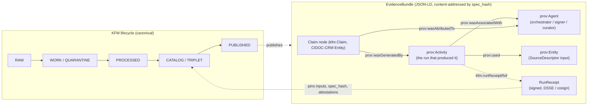
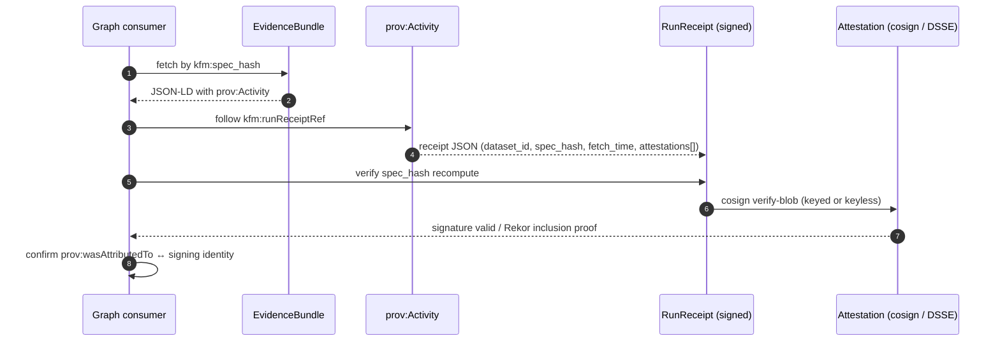

<!-- [KFM_META_BLOCK_V2]
doc_id: kfm://doc/standards/prov-o
title: PROV-O — KFM Provenance Vocabulary Conformance
type: standard
version: v1
status: draft
owners: <TBD — governance / graph-layer steward>
created: 2026-05-14
updated: 2026-05-14
policy_label: public
related:
  - docs/standards/CANONICALIZATION.md     # PROPOSED sibling, see C1-02
  - docs/standards/RUN_RECEIPT.md          # PROPOSED sibling, see C1-01
  - docs/standards/STAC_DWC_PROFILE.md     # PROPOSED sibling, see C4-03
  - docs/adr/ADR-0001-schema-home.md
  - docs/doctrine/truth-posture.md
  - docs/architecture/contract-schema-policy-split.md
tags: [kfm, standards, prov-o, provenance, evidence-bundle, graph]
notes:
  - "All repo paths in this document are PROPOSED until verified against a mounted repo."
  - "External standards facts are labeled EXTERNAL and cited inline."
[/KFM_META_BLOCK_V2] -->

# PROV-O — KFM Provenance Vocabulary Conformance

> The W3C Provenance Ontology, profiled for KFM graph-layer claim provenance and evidence-bundle wrapping.


<!-- TODO: replace badge endpoints with real Shields.io targets once a registry path is fixed. -->

**Status:** draft &middot; **Owners:** _<TBD — governance / graph-layer steward>_ &middot; **Updated:** 2026-05-14

---

## Contents

1. [Purpose](#1-purpose)
2. [Why PROV-O in KFM](#2-why-prov-o-in-kfm)
3. [Authority and scope](#3-authority-and-scope)
4. [Starting-point terms](#4-starting-point-terms)
5. [KFM application profile](#5-kfm-application-profile)
6. [Predicate stability rule](#6-predicate-stability-rule)
7. [Worked JSON-LD example](#7-worked-json-ld-example)
8. [PROV-O ⇄ RunReceipt round-trip](#8-prov-o--runreceipt-round-trip)
9. [PROV-O vs CIDOC-CRM E13 — demarcation](#9-prov-o-vs-cidoc-crm-e13--demarcation)
10. [Canonicalization](#10-canonicalization)
11. [Policy gates and validation](#11-policy-gates-and-validation)
12. [OpenLineage → PROV-O semantics](#12-openlineage--prov-o-semantics)
13. [Open questions and verification backlog](#13-open-questions-and-verification-backlog)
14. [Related docs](#14-related-docs)
15. [Appendix A — Mapping tables](#appendix-a--mapping-tables)
16. [Appendix B — Negative-state fixtures](#appendix-b--negative-state-fixtures)

---

## 1. Purpose

**CONFIRMED.** This document fixes how Kansas Frontier Matrix conforms to the W3C **PROV-O** ontology (and the **PAV** extension) as its claim-level provenance vocabulary. It is the standards-conformance reference cited by graph-layer schemas, evidence-bundle profiles, policy gates, and lineage validators.

What this doc is:

- A KFM **application profile** of PROV-O — the subset and extensions KFM relies on.
- The doctrinal answer to "why do you say that?" for every claim KFM publishes.
- The contract between the **EvidenceBundle**, the **RunReceipt**, and the catalog/triplet layer.

What this doc is **not**:

- It is not the PROV-O specification itself. The normative text lives at the W3C (see [§3](#3-authority-and-scope)).
- It is not a schema. Machine-checkable shape lives under `schemas/contracts/v1/...` per ADR-0001 (PROPOSED — schema home).
- It is not a policy bundle. Admissibility lives under `policy/` (canonical, singular).

> [!NOTE]
> The graph layer is a **derived projection** of the catalog and the receipt layer — it is rebuilt deterministically from those layers on every promotion. PROV-O fragments travel **inside** EvidenceBundles; they do not replace the canonical lifecycle stores.

---

## 2. Why PROV-O in KFM

**CONFIRMED.** KFM's evidence-first posture requires that every published claim carries an inspectable provenance edge that resolves to a verifiable run receipt. PROV-O is selected because it has the right granularity (Activity, Entity, Agent), is widely implemented, and is domain-agnostic enough to apply across hydrology, soil, archaeology, people-DNA-land, and the other domain lanes.

KFM uses **PROV-O** for graph-layer claim provenance and **PAV** (Provenance, Authoring, Versioning) for authoring and curation metadata that PROV-O leaves implicit. Both vocabularies are JSON-LD-friendly and travel inside content-addressed EvidenceBundles.



> [!IMPORTANT]
> Without `prov:wasGeneratedBy`, a claim cannot answer "why do you say that?". Without PAV (`pav:authoredBy`, `pav:lastUpdateOn`, `pav:version`), it cannot answer "who curated this and when?". KFM's policy gates require both.

---

## 3. Authority and scope

| Standard | Status | Namespace | Suggested prefix | Notes |
|---|---|---|---|---|
| **PROV-O** | EXTERNAL — W3C Recommendation, 30 April 2013 | `http://www.w3.org/ns/prov#` | `prov` | PROV-O is published as a W3C Recommendation dated 30 April 2013; it is the OWL2 encoding of the PROV Data Model  |
| **PROV-DM** | EXTERNAL — W3C Recommendation, 30 April 2013 | (data model, not RDF) | n/a | PROV-DM, the data model for provenance, is a W3C Recommendation alongside PROV-O;  KFM relies on PROV-O as the RDF/OWL profile of PROV-DM |
| **PAV** | EXTERNAL — community ontology, current version PAV 2.x | `http://purl.org/pav/` | `pav` | PAV (Provenance, Authoring and Versioning) uses the namespace http://purl.org/pav/ and specializes terms from W3C PROV-O and DC Terms  |
| **kfm:** extension | PROPOSED | _<TBD — namespace IRI not codified in corpus>_ | `kfm` | Extension namespace for KFM-specific properties (sensitivity, consent, receipt refs). Versioning policy is an **open question** — see [§13](#13-open-questions-and-verification-backlog). |

The PROV-O namespace IRI is normative: the namespace for all PROV-O terms is `http://www.w3.org/ns/prov#`,  and the W3C suggests the use of `prov` as the prefix for this namespace. 

> [!CAUTION]
> Do **not** mint a parallel `kfm:Activity` or `kfm:wasGeneratedBy`. KFM extends PROV-O **only** by adding new KFM-namespaced properties; the W3C predicates retain their semantics. See [§6](#6-predicate-stability-rule).

---

## 4. Starting-point terms

PROV-O groups its terms into Starting Point, Expanded, and Qualified categories. KFM relies on the Starting Point set as the load-bearing minimum; Qualified forms are used when an Activity's role, time, or association needs to be attributed precisely (e.g., for signed releases).

| Term | Kind | KFM role |
|---|---|---|
| `prov:Entity` | Class | Anything whose provenance is being recorded: a Claim, a SourceDescriptor, an artifact, a PMTiles file, an EvidenceBundle itself. |
| `prov:Activity` | Class | A run that consumed inputs and produced outputs — typically a pipeline step, a redaction transform, a promotion event, or a publication action. Bound 1:1 to a **RunReceipt**. |
| `prov:Agent` | Class | The orchestrator, signing identity, curator, or upstream authority responsible for the Activity. |
| `prov:wasGeneratedBy` | Property | **Required** edge from every Claim node to the Activity that produced it. The graph-layer policy gate fails closed when absent. |
| `prov:used` | Property | Edge from Activity to each input Entity (SourceDescriptor, prior bundle, fixture). |
| `prov:wasDerivedFrom` | Property | Edge between Entities when one is a transformation of another (e.g., generalized geometry from precise geometry). |
| `prov:wasAssociatedWith` | Property | Edge from Activity to the Agent who ran it (orchestrator, CI runner). |
| `prov:wasAttributedTo` | Property | Edge from Entity to the Agent responsible for it (curator, signer). Used by KFM to bind a cosign signing identity to an artifact. |

> [!TIP]
> When in doubt, start with the four Starting Point relations: `wasGeneratedBy`, `used`, `wasAssociatedWith`, `wasAttributedTo`. Reach for qualified forms (`prov:Generation`, `prov:Usage`, `prov:Association`) only when an edge needs its own time, role, or plan attached.

[Back to top ↑](#contents)

---

## 5. KFM application profile

**CONFIRMED.** The KFM application profile fixes:

1. **Required edges.** Every KFM Claim node carries at least one `prov:wasGeneratedBy` edge to a `prov:Activity` that resolves to a fetchable RunReceipt. Activities carry at least one `prov:used` edge to a source Entity and at least one `prov:wasAssociatedWith` edge to an Agent.
2. **PAV pairing.** Every Claim and every EvidenceBundle SHOULD carry at minimum: `pav:authoredBy`, `pav:authoredOn`, `pav:version`, and `pav:lastUpdateOn`. Curation events use `pav:curatedBy` / `pav:curatedOn`.
3. **Receipt binding.** Every `prov:Activity` carries a KFM extension property — **PROPOSED** name `kfm:runReceiptRef` — whose value is a stable, resolvable RunReceipt URI (e.g. `kfm://run/<spec_hash>`). The exact predicate name and namespace IRI are **NEEDS VERIFICATION** pending a kfm: namespace ADR (see [§13](#13-open-questions-and-verification-backlog)).
4. **Attribution chain for signed artifacts.** A cosign signing identity maps to `prov:wasAttributedTo` plus a `prov:qualifiedGeneration` annotation tying the signed bundle to the Activity. _CONFIRMED in Master_MapLibre_Components-Functions-Features report (ML-061-078)._
5. **Bitemporal hygiene.** Activities record `prov:startedAtTime` / `prov:endedAtTime`; Entities representing real-world states carry `validFrom` / `validTo` (KFM extension or domain schema). _CONFIRMED in Master_MapLibre report (ML-061-085)._
6. **Lineage closure.** Lineage validators reject (a) Entities without a generator Activity and (b) `prov:wasDerivedFrom` chains whose source lacks a concrete producing step. _CONFIRMED in Master_MapLibre report (ML-061-086, ML-061-087)._

<details>
<summary><b>Minimum field set per object (PROPOSED — see ADR-0001)</b></summary>

| Object | Required PROV-O / PAV fields |
|---|---|
| `kfm:Claim` (graph node) | `@id`, `@type`, `prov:wasGeneratedBy`, `prov:wasAttributedTo`, `pav:authoredBy`, `pav:authoredOn` |
| `prov:Activity` | `@id`, `@type`, `prov:used` (≥1), `prov:wasAssociatedWith` (≥1), `prov:startedAtTime`, `prov:endedAtTime`, `kfm:runReceiptRef` |
| `prov:Agent` | `@id`, `@type` (`prov:SoftwareAgent` \| `prov:Person` \| `prov:Organization`), `pav:version` (for software) |
| `prov:Entity` (Source) | `@id`, `@type`, `pav:retrievedFrom`, `pav:retrievedOn`, `kfm:sourceDescriptorRef` |

</details>

[Back to top ↑](#contents)

---

## 6. Predicate stability rule

> [!WARNING]
> **Do not rename W3C PROV predicates.** `prov:used`, `prov:wasGeneratedBy`, `prov:wasDerivedFrom`, `prov:wasAssociatedWith`, and `prov:wasAttributedTo` retain their W3C semantics inside KFM. KFM extends PROV-O only by adding **new** `kfm:`-namespaced properties — never by re-defining or re-mapping existing PROV terms. _CONFIRMED in Master_MapLibre report (ML-061-083)._

This rule is non-negotiable because PROV-O is the interoperability surface KFM offers to external graph consumers (Wikidata, federated SPARQL endpoints, downstream cultural-heritage partners). Renaming would break that surface silently. A consumer that ingests a KFM EvidenceBundle and queries `prov:wasGeneratedBy` MUST get the same answer a KFM internal traversal would.

[Back to top ↑](#contents)

---

## 7. Worked JSON-LD example

The following is **illustrative** — a minimal EvidenceBundle fragment showing the PROV-O / PAV / kfm: composition. Field names suffixed `# PROPOSED` are KFM extensions whose canonical IRIs are **NEEDS VERIFICATION** pending the kfm: namespace ADR.

```jsonld
{
  "@context": {
    "prov": "http://www.w3.org/ns/prov#",
    "pav":  "http://purl.org/pav/",
    "kfm":  "<TBD — see §13 open question on kfm: namespace IRI>",
    "crm":  "http://www.cidoc-crm.org/cidoc-crm/"
  },
  "@id": "kfm://bundle/7f9a0c1e...",
  "@type": "kfm:EvidenceBundle",
  "kfm:spec_hash": "jcs:sha256:7f9a0c1e...",            
  "kfm:release_state": "released",                      
  "@graph": [
    {
      "@id": "kfm://claim/0b4c...",
      "@type": ["kfm:Claim", "prov:Entity"],
      "prov:wasGeneratedBy":  { "@id": "kfm://activity/aa31..." },
      "prov:wasAttributedTo": { "@id": "kfm://agent/curator/ks-archives" },
      "pav:authoredBy":       { "@id": "kfm://agent/curator/ks-archives" },
      "pav:authoredOn":       "2026-05-14T12:00:00Z",
      "pav:version":          "1"
    },
    {
      "@id": "kfm://activity/aa31...",
      "@type": "prov:Activity",
      "prov:used":              [ { "@id": "kfm://source/ksgs-aquifer-2024" } ],
      "prov:wasAssociatedWith": [ { "@id": "kfm://agent/orchestrator/ci" } ],
      "prov:startedAtTime":     "2026-05-14T11:59:01Z",
      "prov:endedAtTime":       "2026-05-14T11:59:42Z",
      "kfm:runReceiptRef":      "kfm://run/aa31..."     
    },
    {
      "@id": "kfm://agent/orchestrator/ci",
      "@type": ["prov:SoftwareAgent", "prov:Agent"],
      "pav:version": "kfm-pipeline@2026.5.0"
    },
    {
      "@id": "kfm://source/ksgs-aquifer-2024",
      "@type": "prov:Entity",
      "pav:retrievedFrom": "https://kgs.ku.edu/...",
      "pav:retrievedOn":   "2026-05-14T11:58:30Z"
    }
  ]
}
```

> [!NOTE]
> This document is canonicalized via **RFC 8785 JCS + SHA-256** before hashing to `kfm:spec_hash`; **URDNA2015** is reserved for cases where RDF-semantic equivalence (not byte equivalence) is the relevant invariant. See [§10](#10-canonicalization).

[Back to top ↑](#contents)

---

## 8. PROV-O ⇄ RunReceipt round-trip

**CONFIRMED doctrine; PROPOSED enforcement.** Every `prov:Activity` in a KFM bundle MUST resolve to a RunReceipt, and every RunReceipt MUST be reachable from at least one Activity. This round-trip is the contract that prevents the graph from drifting into a denormalized claim store.



How the link is materialized (**PROPOSED**, the corpus flags this as an open question):

- **Option A — direct IRI.** The RunReceipt JSON carries the `prov:Activity` IRI under a field such as `prov_activity_iri`. The bundle's Activity carries `kfm:runReceiptRef` pointing back. Symmetric, but adds a field to the receipt envelope.
- **Option B — inferred by `spec_hash`.** The Activity's `kfm:runReceiptRef` is `kfm://run/<spec_hash>`; the receipt is content-addressed; the link is structural rather than fielded. Cheaper, but harder to traverse from receipt → graph.

KFM has not codified which option is canonical. _Open Question 8.7 / C8-03._

[Back to top ↑](#contents)

---

## 9. PROV-O vs CIDOC-CRM E13 — demarcation

**CONFIRMED tension.** PROV-O and CIDOC-CRM **E13 Attribute Assignment** overlap: both can express "who said this and when." The KFM corpus names a preference but does **not** fully codify the dividing line. Use this table as guidance until an ADR codifies the rule.

| Use case | Prefer PROV-O | Prefer CIDOC-CRM E13 |
|---|---|---|
| A pipeline run produced a derived dataset | ✅ `prov:Activity` + `prov:wasGeneratedBy` | ⛔ — operational provenance, not scholarly attribution |
| A scholar asserts a person-place identification | ⛔ — under-specified for editorial nuance | ✅ E13 with E55 Type, P140/P141 |
| A signed release attests an artifact's integrity | ✅ `prov:wasAttributedTo` + cosign agent | ⛔ |
| A curator disambiguates two people with the same name | ⚠️ possible, but loses editorial context | ✅ E13 carries the editorial reasoning |
| Lineage of a redaction transform | ✅ | ⛔ |
| Bibliographic citation backing a claim | ⚠️ usable via `prov:wasInformedBy` | ✅ E13 → E89 Propositional Object |

> [!NOTE]
> Rule of thumb: **PROV-O answers "what process made this?"; E13 answers "what scholar said this, on what evidence?"** Both can be present on the same Claim; they do not conflict, they layer.

A worked demarcation guide ("when to use PROV-O vs CRM E13, with examples") is named as Expansion Direction in C8-03 and is **PROPOSED future work**.

[Back to top ↑](#contents)

---

## 10. Canonicalization

**CONFIRMED.** KFM's default canonicalization for JSON-LD bundles (including PROV-O fragments) is **RFC 8785 JCS + SHA-256**, recorded as `jcs:sha256:<hex>`. **W3C URDNA2015** is reserved for cases where RDF-semantic equivalence is the relevant invariant (e.g., federated SPARQL merging a KFM bundle with non-KFM RDF).

> [!WARNING]
> JCS and URDNA2015 can produce **different hashes for the same logical bundle** — JSON-LD round-tripping is not an identity transformation. The choice MUST be recorded in the receipt. A consumer that uses URDNA2015 to verify a JCS-hashed bundle will fail the verification silently.

The detailed canonicalization rules and JCS-vs-URDNA2015 decision matrix live in [`docs/standards/CANONICALIZATION.md`](./CANONICALIZATION.md) (**PROPOSED** sibling — see C1-02 / C8-05).

[Back to top ↑](#contents)

---

## 11. Policy gates and validation

The graph-layer policy gate (PROPOSED home: `policy/runtime/` or `policy/promotion/`) MUST fail closed when any of the following is true:

| Gate | Failure condition | Outcome |
|---|---|---|
| `prov.required-edge` | A Claim node lacks any `prov:wasGeneratedBy` edge | **DENY** (publication) / **ABSTAIN** (runtime) |
| `prov.activity-resolvable` | `prov:Activity` exists but its RunReceipt cannot be resolved | **DENY** |
| `prov.spec-hash-match` | Recomputed `spec_hash` does not match the receipt's declared `spec_hash` | **DENY** + QUARANTINE |
| `prov.predicate-rename` | A custom predicate aliases a W3C PROV predicate (see [§6](#6-predicate-stability-rule)) | **DENY** |
| `prov.dangling-entity` | An Entity has no producing Activity | **DENY** |
| `prov.broken-derivation` | A `prov:wasDerivedFrom` chain ends without a concrete producing step | **DENY** |
| `prov.attribution-signer-mismatch` | `prov:wasAttributedTo` Agent ≠ signing identity in the cosign attestation | **DENY** |
| `pav.authoring-required` | A published Claim has no `pav:authoredBy` / `pav:authoredOn` | **ABSTAIN** + correction notice |

> [!IMPORTANT]
> The policy gate enforces the **negative-state** path: every gate above MUST have at least one fixture under `policy/tests/` (PROPOSED) that proves the DENY/ABSTAIN path actually fires. A validator that does not exercise its failure path is not a validator.

[Back to top ↑](#contents)

---

## 12. OpenLineage → PROV-O semantics

**CONFIRMED doctrine.** OpenLineage events are **operational** (transient, queue-shaped). PROV-O is the **permanent semantic layer** that survives in the EvidenceBundle. A KFM-conformant pipeline emits OpenLineage events for operational lineage tooling **and** translates them into stable PROV-O assertions inside the bundle. _CONFIRMED in Master_MapLibre report (ML-061-081)._

| OpenLineage concept | Stable PROV-O equivalent |
|---|---|
| `Job` (a recurring transform) | `prov:Plan` referenced by the Activity (`prov:hadPlan`) |
| `Run` (a single execution) | `prov:Activity` |
| `Dataset` (input) | `prov:Entity` reached by `prov:used` |
| `Dataset` (output) | `prov:Entity` produced via `prov:wasGeneratedBy` |
| Run `producer` | `prov:Agent` reached by `prov:wasAssociatedWith` |
| Facets (column lineage, schema, …) | KFM-extension properties on the qualified `prov:Usage` / `prov:Generation` |

> [!TIP]
> Neo4j and similar property graphs can persist the PROV-O fragments for traversal performance — but the **graph is a projection, not the source of truth**. The canonical PROV-O assertion lives in the content-addressed EvidenceBundle. _CONFIRMED in Master_MapLibre report (ML-061-082)._

[Back to top ↑](#contents)

---

## 13. Open questions and verification backlog

These items are explicitly **not resolved** by this document. They SHOULD be tracked in `docs/registers/VERIFICATION_BACKLOG.md` (PROPOSED path per Directory Rules §6.1) and addressed via ADR.

- **PROPOSED / NEEDS VERIFICATION — kfm: namespace IRI.** The corpus uses the prefix `kfm:` consistently but does not fix the IRI base, the version-pinning strategy, or the property-addition process. A Kansas-specific subnamespace (`ks-kfm:`) is also implied but not resolved. _Gap 8.3 / Pass 10 dossier._
- **OPEN — round-trip enforcement.** Should a RunReceipt include the `prov:Activity` IRI directly, or is the link inferred by `spec_hash`? See [§8](#8-prov-o--runreceipt-round-trip). _Open Question / C8-03._
- **OPEN — PROV-O vs CRM E13 demarcation guide.** The corpus names this as Expansion Direction but does not ship the guide. See [§9](#9-prov-o-vs-cidoc-crm-e13--demarcation).
- **PROPOSED — graph-validation tool.** A walker that traverses every claim node and verifies the PROV-O round-trip resolves to a fetchable receipt. _Suggested Future Work / C8-03._
- **NEEDS VERIFICATION — kfm:runReceiptRef predicate name.** Used illustratively in this doc; the canonical predicate name and IRI must be set when the kfm: namespace IRI is fixed.
- **NEEDS VERIFICATION — policy bundle path.** This doc references `policy/runtime/` and `policy/promotion/` per Directory Rules §6.5; live repo placement remains unverified in this session.

[Back to top ↑](#contents)

---

## 14. Related docs

- [`docs/standards/CANONICALIZATION.md`](./CANONICALIZATION.md) — JCS / URDNA2015 decision matrix _(PROPOSED sibling — C1-02 / C8-05)_
- [`docs/standards/RUN_RECEIPT.md`](./RUN_RECEIPT.md) — the RunReceipt envelope _(PROPOSED sibling — C1-01)_
- [`docs/standards/STAC_DWC_PROFILE.md`](./STAC_DWC_PROFILE.md) — STAC × Darwin Core hybrid _(PROPOSED sibling — C4-03)_
- [`docs/architecture/contract-schema-policy-split.md`](../architecture/contract-schema-policy-split.md) — where contracts, schemas, and policy live
- [`docs/doctrine/truth-posture.md`](../doctrine/truth-posture.md) — cite-or-abstain, evidence-first
- [`docs/adr/ADR-0001-schema-home.md`](../adr/ADR-0001-schema-home.md) — schema home for evidence-bundle JSON Schema
- _External — non-KFM:_ [W3C PROV-O Recommendation](https://www.w3.org/TR/prov-o/), [PROV-Overview](https://www.w3.org/TR/prov-overview/), [PAV ontology](https://pav-ontology.github.io/pav/)

---

## Appendix A — Mapping tables

<details>
<summary><b>A.1 PROV-O Starting Point → KFM object families</b></summary>

| PROV-O term | KFM object family | Typical IRI shape (PROPOSED) |
|---|---|---|
| `prov:Entity` | Claim node, EvidenceBundle, SourceDescriptor, RunReceipt, ReleaseManifest, RollbackCard, LayerManifest, TileArtifact | `kfm://claim/<uuid>`, `kfm://bundle/<spec_hash>`, … |
| `prov:Activity` | Pipeline run, redaction transform, promotion decision, publication action, correction event | `kfm://activity/<spec_hash>` |
| `prov:Agent` | Orchestrator (SoftwareAgent), CI runner (SoftwareAgent), curator (Person), upstream authority (Organization) | `kfm://agent/<role>/<id>` |
| `prov:Plan` | Pipeline spec, redaction profile, promotion gate definition | `kfm://plan/<spec_hash>` |

</details>

<details>
<summary><b>A.2 KFM extension predicates (PROPOSED)</b></summary>

> All entries here are **NEEDS VERIFICATION** until the kfm: namespace ADR fixes the IRI base.

| Predicate | Domain | Range | Purpose |
|---|---|---|---|
| `kfm:runReceiptRef` | `prov:Activity` | URI | Resolves to the signed RunReceipt envelope |
| `kfm:sourceDescriptorRef` | `prov:Entity` (source) | URI | Resolves to the canonical SourceDescriptor |
| `kfm:evidenceBundleRef` | `kfm:Claim` | URI | Bundle this claim was published inside |
| `kfm:promotionDecisionRef` | `prov:Activity` (promotion) | URI | Resolves to the PromotionDecision object |
| `kfm:rollbackCardRef` | `kfm:ReleaseManifest` | URI | Resolves to the RollbackCard for the release |
| `kfm:sensitivity` | Any KFM Entity | Token | Sensitivity tier (per C6-01 rubric) |
| `kfm:rights_status` | Any KFM Entity | Token | Rights posture (per SPDX or KFM rights list) |
| `kfm:review_state` | Any KFM Entity | Enum | `draft \| in_review \| approved \| rejected` |
| `kfm:release_state` | Any KFM Entity | Enum | `unreleased \| candidate \| released \| withdrawn` |

</details>

<details>
<summary><b>A.3 PAV usage — minimum recommended set</b></summary>

| Term | KFM application |
|---|---|
| `pav:authoredBy` | Curator or upstream authority that produced the Claim |
| `pav:authoredOn` | When the Claim was authored (vs. when the run executed) |
| `pav:curatedBy` / `pav:curatedOn` | Editorial curation event distinct from authoring |
| `pav:version` | Logical version of the Claim or bundle |
| `pav:previousVersion` | Pointer to prior bundle version (correction chain) |
| `pav:retrievedFrom` / `pav:retrievedOn` / `pav:retrievedBy` | Source-acquisition provenance on source Entities |
| `pav:derivedFrom` | Equivalent to `prov:wasDerivedFrom` for PAV-only consumers |

PAV's relationship to PROV-O is explicit in the PAV specification: PAV specializes terms from W3C PROV-O (prov:) and DC Terms (dcterms:),  so PROV-O and PAV compose cleanly without conflict.

</details>

[Back to top ↑](#contents)

---

## Appendix B — Negative-state fixtures

The validator suite for this standard MUST exercise every DENY/ABSTAIN path in [§11](#11-policy-gates-and-validation). The following fixtures are **PROPOSED** (paths and counts not verified against a mounted repo):

<details>
<summary><b>Suggested fixture layout</b></summary>

```text
schemas/tests/invalid/prov-o/
├── claim-missing-wasGeneratedBy.jsonld       # gate: prov.required-edge
├── activity-no-receipt.jsonld                # gate: prov.activity-resolvable
├── spec-hash-mismatch.jsonld                 # gate: prov.spec-hash-match
├── renamed-predicate-kfm-used.jsonld         # gate: prov.predicate-rename
├── dangling-entity.jsonld                    # gate: prov.dangling-entity
├── broken-derivation-chain.jsonld            # gate: prov.broken-derivation
├── attribution-signer-mismatch.jsonld        # gate: prov.attribution-signer-mismatch
└── pav-authoring-missing.jsonld              # gate: pav.authoring-required
```

A matching `schemas/tests/valid/prov-o/` set MUST contain at least one passing minimal bundle and one passing complex bundle (multiple Activities, multiple sources, qualified forms).

</details>

> [!TIP]
> Negative-state fixtures are part of the **trust-bearing surface** of this standard. A change that adds a new gate but no negative fixture is a documentation-only change, not a governance change.

[Back to top ↑](#contents)

---

<sub>**Related:** see [§14 Related docs](#14-related-docs) for sibling standards and doctrine references.</sub><br/>
<sub>**Last updated:** 2026-05-14 &middot; **Version:** v1 (draft) &middot; **Profile ID (PROPOSED):** `kfm-prov-profile-v1`</sub><br/>
<sub>[Back to top ↑](#contents)</sub>
