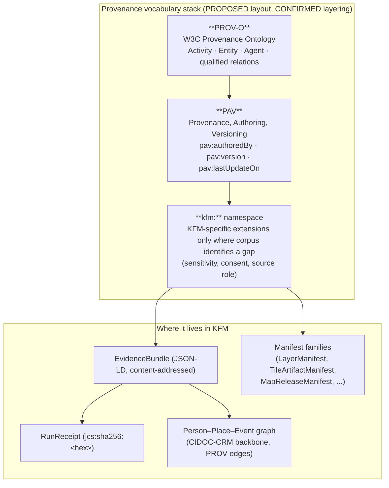
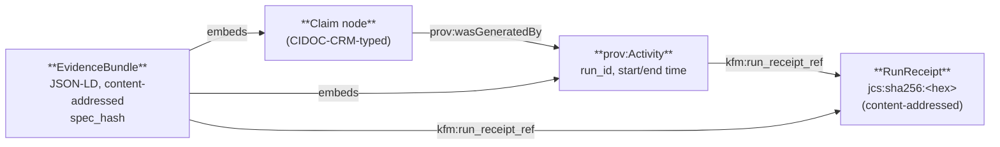
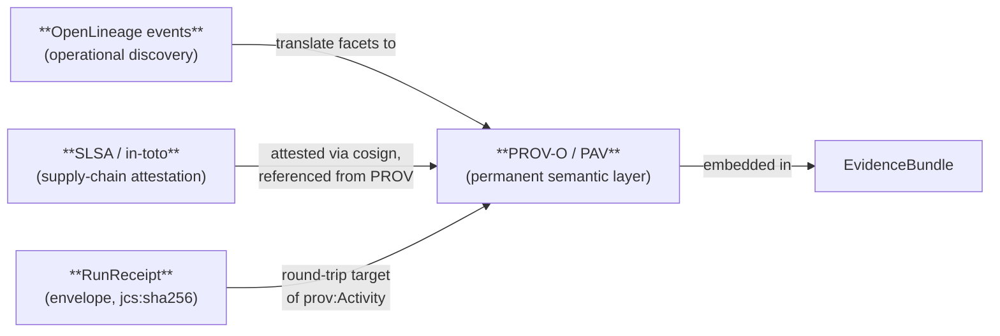

<!-- [KFM_META_BLOCK_V2]
doc_id: kfm://doc/standards-prov-v1
title: PROV — W3C Provenance Standard in KFM
type: standard
version: v1
status: draft
owners: TBD-standards-stewards
created: 2026-05-14
updated: 2026-05-14
policy_label: public
related:
  - docs/standards/README.md
  - docs/standards/STAC.md
  - docs/standards/DCAT.md
  - docs/standards/SIGNING.md
  - docs/doctrine/lifecycle-law.md
  - docs/doctrine/trust-membrane.md
  - docs/doctrine/directory-rules.md
  - contracts/evidence/evidence_bundle.md
  - contracts/runtime/run_receipt.md
tags: [kfm, standards, provenance, prov-o, pav]
notes:
  - Naming variant — corpus references docs/standards/PROVENANCE.md (uppercase); this file uses PROV.md per request. Reconcile via ADR if needed.
  - Implementation maturity claims kept bounded; repo not mounted in source session.
[/KFM_META_BLOCK_V2] -->

# PROV — W3C Provenance in KFM

> How KFM applies the W3C **PROV-O** ontology and the **PAV** (Provenance, Authoring, Versioning) extensions to attach inspectable, verifiable lineage to every claim, artifact, and release.


<!-- TODO: replace placeholders with live build/version/last-commit Shields.io endpoints once the docs CI is wired. -->

**Status:** draft &middot; **Owners:** TBD (standards stewards) &middot; **Last updated:** 2026-05-14

> [!NOTE]
> **Doctrine vs implementation.** The KFM corpus treats PROV-O + PAV adoption as **CONFIRMED doctrine** (C8-03 in *KFM Components Pass 10*). Concrete repo artifacts — JSON-LD contexts, validators, graph gates — are **PROPOSED** until verified in a mounted repo. Truth labels in this document follow that split.

---

## Quick jump

- [1. Purpose & scope](#1-purpose--scope)
- [2. Vocabulary stack](#2-vocabulary-stack)
- [3. KFM ↔ PROV mapping](#3-kfm--prov-mapping)
- [4. Required predicates (no-rename rule)](#4-required-predicates-no-rename-rule)
- [5. PROV in the EvidenceBundle](#5-prov-in-the-evidencebundle)
- [6. PROV in artifacts and release manifests](#6-prov-in-artifacts-and-release-manifests)
- [7. PROV-O vs CIDOC-CRM E13](#7-prov-o-vs-cidoc-crm-e13)
- [8. PROV vs OpenLineage vs SLSA](#8-prov-vs-openlineage-vs-slsa)
- [9. Bitemporal & identity rules](#9-bitemporal--identity-rules)
- [10. Validation gates](#10-validation-gates)
- [11. Anti-patterns](#11-anti-patterns)
- [12. Open questions](#12-open-questions)
- [13. References](#13-references)
- [Related docs](#related-docs)

---

## 1. Purpose & scope

### 1.1 What this doc is

This standard describes how KFM **uses** W3C PROV — specifically PROV-O (the OWL ontology) — and the PAV extensions to attach machine-readable provenance to every claim, artifact, manifest, and release decision that KFM publishes. It is the conformance reference for any KFM component that emits, consumes, or validates provenance.

### 1.2 Why PROV

> [!IMPORTANT]
> Without PROV-O, the KFM graph cannot answer the basic question **"why do you say that?"** &mdash; and without PAV, it cannot answer **"who curated this and when?"** Both answers are load-bearing for KFM's evidence-first truth posture. (CONFIRMED &mdash; C8-03.)

PROV-O gives KFM three things its evidence-first doctrine requires:

1. A **stable, widely-implemented vocabulary** with the right granularity (`prov:Activity`, `prov:Entity`, `prov:Agent`).
2. A **lossless mapping** between operational lineage (OpenLineage events) and a permanent semantic layer.
3. A **fixed predicate set** whose names must not be renamed by downstream consumers, ensuring round-trip semantic stability.

### 1.3 In scope / out of scope

| In scope | Out of scope |
|---|---|
| PROV-O classes and predicates used by KFM | Authoring scholarly attribution at the CRM level (see §7) |
| PAV extensions (authoring, versioning) | OpenLineage facet schemas (separate standard) |
| Embedding PROV in EvidenceBundles, STAC, DCAT, and manifest families | SLSA / in-toto attestation predicates (see `docs/standards/SIGNING.md`) |
| Round-trip from claim → activity → run receipt | Storage backends (Neo4j, RDF triplestore choice) |
| Validation gates and predicate-rename prohibitions | Tile/COG byte-format specifications |

### 1.4 Status summary

| Aspect | Status | Source basis |
|---|---|---|
| KFM uses PROV-O + PAV for graph-layer provenance | **CONFIRMED** | C8-03 (*Pass 10 Idea Index*, p. 62) |
| Every claim carries a `prov:wasGeneratedBy` edge | **CONFIRMED** doctrine | C8-03; ML-061-083 |
| Predicate set fixed; no renaming | **CONFIRMED** doctrine | ML-061-083 (SRC-061 pp. 89–90) |
| PROV fragments inside EvidenceBundle | **CONFIRMED** doctrine | C4-04, C8-04 |
| Concrete JSON-LD context shipped in repo | **PROPOSED / NEEDS VERIFICATION** | No mounted repo this session |
| Graph-layer policy gate fails closed on missing provenance | **PROPOSED** | C8-03 (Dependencies) |
| PROV-O vs CRM E13 demarcation | **OPEN QUESTION** | C8-03 (Tensions, Open Questions) |
| Round-trip enforcement from PROV-O Activity → run receipt | **OPEN QUESTION** | C8-03 (Open Questions, p. 62) |

---

## 2. Vocabulary stack

KFM's provenance vocabulary stack is intentionally layered. Each layer has a specific job and is not a substitute for the others.



> [!NOTE]
> **Diagram status:** the layering of PROV-O → PAV → `kfm:` is **CONFIRMED** doctrine; the specific routes from each layer to repo objects are **PROPOSED** until concrete JSON-LD contexts and validators are verified.

### 2.1 PROV-O

PROV-O is a W3C Recommendation defining an OWL ontology for the PROV Data Model. KFM uses its three core types (`prov:Activity`, `prov:Entity`, `prov:Agent`) and a fixed set of relating predicates listed in §4.

- **Namespace** (EXTERNAL): `http://www.w3.org/ns/prov#`
- **Canonical prefix**: `prov:`
- **Versioning posture**: PROV-O is a stable W3C Recommendation; KFM treats the predicate vocabulary as frozen.

### 2.2 PAV

PAV extends PROV-O with authoring and versioning predicates that PROV-O leaves implicit. KFM uses PAV to record curatorial authorship (who curated this) and version metadata (which version of this curation).

- **Namespace** (EXTERNAL): `http://purl.org/pav/`
- **Canonical prefix**: `pav:`
- **Used for**: `pav:authoredBy`, `pav:createdBy`, `pav:version`, `pav:lastUpdateOn`, and related authoring/versioning terms. (EXTERNAL — PAV vocabulary; KFM's required PAV subset is **PROPOSED** until pinned in a JSON-LD context.)

### 2.3 The `kfm:` namespace

KFM extends PROV-O and PAV **only** through a controlled `kfm:` namespace and **only** where the corpus identifies a clear gap (CONFIRMED — C8 chapter intro). Examples include sensitivity tagging, consent metadata, and KFM-specific source roles. The `kfm:` namespace is governed; new properties land via ADR.

> [!CAUTION]
> Do **not** add KFM-specific properties to the `prov:` or `pav:` namespaces. External vocabularies are pinned; KFM extensions live in `kfm:` only.

[Back to top](#quick-jump)

---

## 3. KFM ↔ PROV mapping

KFM's primary objects map to PROV-O classes as follows. The mapping is **CONFIRMED** doctrine; specific schema homes are **PROPOSED** per Directory Rules ADR-0001 (default schema home `schemas/contracts/v1/...`).

| KFM concept | PROV-O class | Notes |
|---|---|---|
| Dataset run, model materialization, tile build, redaction transform, publication action | `prov:Activity` | Every run produces a RunReceipt; the Activity carries an IRI that resolves back to that receipt. (CONFIRMED — C1-01, C8-03.) |
| EvidenceBundle, dataset version, artifact (PMTiles, COG, GeoParquet), claim node | `prov:Entity` | Entities are content-addressed where practical (`spec_hash` via JCS+SHA-256). (CONFIRMED — C1-02, C4-04.) |
| Human curator, build system, signing identity (cosign OIDC), automated pipeline | `prov:Agent` | Cosign attestation identity maps to `prov:wasAttributedTo` + `prov:qualifiedGeneration`. (CONFIRMED — ML-061-078.) |
| Source tool (e.g., `tippecanoe`, `pmtiles`) recorded in tile generation | `prov:SoftwareAgent` | Source tools become provenance materials, not hidden pipeline details. (CONFIRMED — ML-057-031.) |

### 3.1 The minimum claim contract

> [!IMPORTANT]
> **CONFIRMED rule (C8-03):** Every claim node in the KFM graph **MUST** carry at least one `prov:wasGeneratedBy` edge to a `prov:Activity` whose IRI resolves to a fetchable RunReceipt.

A "claim" here means any node the graph asserts (person identity, role timespan, place anchor, event participation, derived measurement, etc.). The policy gate that enforces this is **PROPOSED** until verified in a mounted repo.

[Back to top](#quick-jump)

---

## 4. Required predicates (no-rename rule)

> [!WARNING]
> **No-rename rule (CONFIRMED — ML-061-083, SRC-061 pp. 89–90):** The predicates below retain their PROV-O semantic meaning across all KFM artifacts, schemas, and manifests. Renaming, aliasing under a different URI, or substituting a domain-specific synonym is **prohibited**.

| Predicate | Direction | Required in | Purpose |
|---|---|---|---|
| `prov:used` | Activity → Entity | RunReceipt PROV fragment; tile/COG generation; ingest activities | Records inputs consumed by the activity. |
| `prov:wasGeneratedBy` | Entity → Activity | Every claim node; every released artifact entity | The load-bearing predicate; missing one fails the graph-layer policy gate. |
| `prov:wasDerivedFrom` | Entity → Entity | Derived datasets, projected entities, redacted variants | Records derivation lineage between entities. Audit checks reject derived-from chains lacking a concrete producing step (CONFIRMED — ML-061-087). |
| `prov:wasAssociatedWith` | Activity → Agent | Run records (associates the agent with the activity) | Ties an Activity to its responsible Agent. |
| `prov:wasAttributedTo` | Entity → Agent | Released artifacts with cosign attestations | Maps cosign attestation identity to the resulting artifact (CONFIRMED — ML-061-078). |
| `prov:qualifiedGeneration` | Entity → Generation (reified) | Released artifacts with cosign attestations | Carries the qualified detail of the generation event (time, attribution, attestation bundle digest). |

### 4.1 Bitemporal properties on activities and entities

Per ML-061-085 (CONFIRMED — SRC-061 pp. 90–106), KFM provenance entities and activities carry bitemporal context, distinct from purely transport timestamps:

- `validFrom` / `validTo` on entities — the time window in which the entity's asserted state is valid.
- Activity `prov:startedAtTime` / `prov:endedAtTime` — the wallclock window of the producing run.

These are used by lineage sanity checks (§10) to catch stale or missing-time cases.

[Back to top](#quick-jump)

---

## 5. PROV in the EvidenceBundle

### 5.1 Where PROV lives

An EvidenceBundle is the unit of publication for graph-layer assertions: a JSON-LD document that packages a graph fragment (persons, places, events, claims), the run receipts that justify each claim, and the authority crosswalks (CONFIRMED — C8-04, C4-04). PROV-O appears **inside** the bundle, not as a parallel artifact:



### 5.2 PROV fragment shape (illustrative)

> [!NOTE]
> The JSON-LD below is **illustrative**. The pinned JSON-LD context, the exact `kfm:` property names, and the receipt-IRI resolution rule are **PROPOSED / NEEDS VERIFICATION** until a published context document is checked. Use this for shape only.

```json
{
  "@context": [
    "https://www.w3.org/ns/prov.jsonld",
    "https://kfm.example/contexts/kfm-bundle-v1.jsonld"
  ],
  "@id": "kfm://entity-bundle/sha256-<hex>",
  "kfm:spec_hash": "jcs:sha256:<hex>",
  "@graph": [
    {
      "@id": "kfm:claim/abc-123",
      "@type": "kfm:Claim",
      "prov:wasGeneratedBy": { "@id": "kfm:activity/run-2026-05-14-001" }
    },
    {
      "@id": "kfm:activity/run-2026-05-14-001",
      "@type": "prov:Activity",
      "prov:startedAtTime": "2026-05-14T09:12:33Z",
      "prov:endedAtTime":   "2026-05-14T09:13:11Z",
      "prov:used":          [ { "@id": "kfm://source/usgs-nwis/abc" } ],
      "prov:wasAssociatedWith": { "@id": "kfm:agent/pipeline-x" },
      "kfm:run_receipt_ref": "kfm://receipts/jcs-sha256-<hex>"
    }
  ]
}
```

### 5.3 Round-trip rule

The bundle is **content-addressed** by `spec_hash` computed via JCS+SHA-256 (CONFIRMED — C1-02, C8-04). A consumer who fetches the bundle MUST be able to:

1. Walk every claim node.
2. Follow each `prov:wasGeneratedBy` to a `prov:Activity` inside or adjacent to the bundle.
3. Resolve `kfm:run_receipt_ref` (PROPOSED property name) to a fetchable, byte-stable RunReceipt.
4. Recompute `spec_hash` and confirm it matches.

> [!IMPORTANT]
> **OPEN QUESTION (C8-03, p. 62):** Whether the round-trip from `prov:Activity` to RunReceipt is enforced by **including the PROV-O IRI directly in the receipt**, or by an **inferred link** via `kfm:run_receipt_ref`. This is unresolved in the corpus and requires an ADR. Until then, both directions are PROPOSED.

[Back to top](#quick-jump)

---

## 6. PROV in artifacts and release manifests

PROV does not stop at the graph layer. The corpus consistently treats PROV as required metadata on **artifacts** (tiles, COGs, GeoParquet) and on **manifest families** (CONFIRMED — ML-061-078 through ML-061-087).

### 6.1 Tile and COG artifacts

| Requirement | Detail | Source |
|---|---|---|
| PROV fragment records tile-generation activity, including source tools | The activity records source Parquet and `software:tippecanoe` / `software:pmtiles` as `prov:SoftwareAgent` participants | ML-057-031 (CONFIRMED) |
| STAC, DCAT, and PROV should discover attestation bundles | Attestation refs are machine-discoverable from catalog records | ML-057-036 (CONFIRMED) |
| Tile diffs update STAC, DCAT, and PROV with content hashes | Treat tile diffs as cataloged release candidates with full sidecar updates | ML-057-024 (CONFIRMED) |
| Cosign attestation maps to PROV identity | `prov:wasAttributedTo` + `prov:qualifiedGeneration` link signing identity to the generation of the artifact | ML-061-078 (CONFIRMED) |

### 6.2 Manifest families

PROPOSED manifest families (CONFIRMED doctrine; PROPOSED schema homes per Directory Rules ADR-0001) carry PROV references rather than embedding full PROV graphs:

- `LayerManifest` — references the EvidenceBundle and the generating Activity.
- `TileArtifactManifest` — references the tile-generation Activity, the input dataset Entity, and the `software:` agents.
- `MapReleaseManifest` — references the release-decision Activity and the responsible Agent.

### 6.3 EvidenceRef → EvidenceBundle resolution

PROV does not replace the EvidenceRef → EvidenceBundle resolution rule (CONFIRMED — see `New Ideas 5-8-26` decision record). EvidenceRef carries a `spec_hash`; resolution succeeds only when the catalog index returns a bundle whose `spec_hash` matches. PROV fragments live inside the resolved bundle.

> [!TIP]
> **Safe embedding pattern in STAC** (illustrative, derived from corpus guidance): use namespaced properties and standard `rel` values that unknown clients ignore gracefully:
>
> ```json
> {
>   "links": [
>     { "rel": "derived_from", "href": "kfm://evidence/ev_001" },
>     { "rel": "via",          "href": "kfm://bundle/bundle_002" }
>   ],
>   "properties": { "kfm:evidence_bundle": "bundle_002" }
> }
> ```

[Back to top](#quick-jump)

---

## 7. PROV-O vs CIDOC-CRM E13

> [!IMPORTANT]
> **CONFIRMED tension, OPEN demarcation (C8-03):** PROV-O is "sometimes seen as overlapping with CRM's provenance classes." The KFM corpus prefers **PROV-O for graph-layer claim provenance** and **CRM E13 (Attribute Assignment) for scholarly attribution**, but the dividing line is **not fully settled** and an ADR is recommended.

A working heuristic for current authors, until an ADR pins it:

| Use PROV-O when… | Use CRM E13 when… |
|---|---|
| The provenance is **machine-emitted** by a pipeline run | The provenance is a **scholarly judgment** by a curator/historian |
| The artifact is a **derived dataset, tile, or COG** | The assertion is **about a CRM entity** (E5 Event, E21 Person, E53 Place) |
| The Activity has a discrete run identifier and receipt | The attribution carries evidence, methodology, and curatorial reasoning |
| Lineage must be machine-checkable and round-trippable to a RunReceipt | The claim should be visible to museum/library/archive partners using CRM tooling |

<details>
<summary><strong>Worked-example outline (PROPOSED &mdash; expand once examples are published)</strong></summary>

A worked-example collection (PROPOSED — *Expansion Direction* of C8-03) should ship under `examples/prov-vs-e13/` with at least:

- A pipeline-emitted PROV-O fragment for a USGS NWIS hydrology ingestion.
- A scholar-authored CRM E13 attribute assignment for an E21 Person's role timespan.
- A hybrid case where both appear on the same EvidenceBundle and do not contradict.

These examples are not yet authored in this session; treat the bullet list as a placeholder backlog.

</details>

[Back to top](#quick-jump)

---

## 8. PROV vs OpenLineage vs SLSA

KFM treats three lineage/provenance technologies as **complementary, not interchangeable**. Each has a distinct role.



| Technology | Role | Lifetime | KFM status |
|---|---|---|---|
| **OpenLineage** | Operational event stream for run discovery and observability | Ephemeral / lineage-tool retention | CONFIRMED doctrine; backend choice (Marquez vs DataHub) OPEN (C1-05) |
| **PROV-O / PAV** | Permanent semantic provenance layer, machine-checkable | Persistent — lives in EvidenceBundle | CONFIRMED doctrine (C8-03) |
| **SLSA / in-toto** | Supply-chain attestation tying artifact to build platform, materials, invocation | Persistent — alongside cosign signature | CONFIRMED doctrine (C1-04); SLSA level OPEN |

**Translation rule** (CONFIRMED — ML-061-081, SRC-061 pp. 88–91): OpenLineage events translate to stable PROV-O semantics for the permanent record. OpenLineage facets are operational; PROV-O carries the semantic layer that survives republication.

> [!NOTE]
> **Neo4j is persistence, not source truth** (CONFIRMED — ML-061-082). If a KFM deployment stores PROV-O in Neo4j, the graph projection is **not** the canonical truth source; it is rebuilt deterministically from the catalog and receipt layers on every promotion.

[Back to top](#quick-jump)

---

## 9. Bitemporal & identity rules

### 9.1 Bitemporal posture

Per ML-061-085 (CONFIRMED), KFM lineage carries **distinct** temporal facets:

- **Source time** — when the source asserts the fact occurred.
- **Observed time** — when the observation was recorded upstream.
- **Valid time** (`validFrom` / `validTo`) — the window in which the entity's asserted state is valid.
- **Retrieval time** — when KFM fetched the source.
- **Release time** — when KFM promoted the entity to PUBLISHED.
- **Activity start/end** — wallclock window of the producing run.

These are kept distinct where material. Collapsing them is an anti-pattern (§11).

### 9.2 URN canonical forms

Per ML-061-084 (CONFIRMED — SRC-061 pp. 90–106), canonical URN patterns are required for lineage identity across runs, plans, datasets, and artifact snapshots. The corpus references but does not pin the exact URN patterns; the PROPOSED conventions seen across the corpus are:

| Object | PROPOSED URN form |
|---|---|
| Run | `kfm://run/<run_id>` |
| Plan / dataset version | `kfm://dataset/<id>/<version>` |
| Artifact snapshot | `kfm://artifact/sha256-<hex>` |
| EvidenceBundle | `kfm://entity-bundle/sha256-<hex>` |
| EvidenceRef | `kfm://evidence/<ref_id>` |
| RunReceipt | `kfm://receipts/jcs-sha256-<hex>` |

> [!CAUTION]
> URN forms above are PROPOSED. Pin via ADR before downstream consumers stabilize on a pattern.

[Back to top](#quick-jump)

---

## 10. Validation gates

PROV validation runs at multiple layers in the trust membrane. All gates default to **fail-closed** posture (CONFIRMED — C5-02 default-deny promotion).

| Gate | Check | Failure mode | Source basis |
|---|---|---|---|
| **G-PROV-01 Generator presence** | Every claim node has ≥1 `prov:wasGeneratedBy` edge | DENY promotion | C8-03 (CONFIRMED doctrine); PROPOSED rule |
| **G-PROV-02 Round-trip resolves** | `prov:Activity` IRI resolves to a fetchable RunReceipt | DENY promotion or ABSTAIN at runtime | C8-03 *Suggested Future Work*; PROPOSED |
| **G-PROV-03 No dangling entities** | Every entity has a producing Activity; no orphans | DENY promotion | ML-061-086 (CONFIRMED) |
| **G-PROV-04 Derived-from chains complete** | Derived entity whose source lacks a generator fails audit | DENY promotion | ML-061-087 (CONFIRMED) |
| **G-PROV-05 Predicate-rename prohibition** | Required predicates retain canonical PROV URIs | DENY promotion / schema fail | ML-061-083 (CONFIRMED) |
| **G-PROV-06 Bitemporal sanity** | `validFrom` ≤ `validTo`; activity start ≤ end; no missing-time fixtures pass | DENY promotion | ML-061-085 (CONFIRMED) |
| **G-PROV-07 Spec-hash match** | EvidenceBundle's stored `spec_hash` matches recomputed JCS+SHA-256 | DENY (per C5-04) | C5-04 (CONFIRMED); C8-04 |

### 10.1 Test fixtures (PROPOSED)

The validation suite needs negative and positive fixtures for each gate. PROPOSED fixture set:

- `tests/fixtures/prov/valid/` — minimal valid claim with full round-trip.
- `tests/fixtures/prov/invalid/missing-generator.json` — claim with no `prov:wasGeneratedBy`.
- `tests/fixtures/prov/invalid/renamed-predicate.json` — uses `kfm:wasGeneratedBy` instead of `prov:wasGeneratedBy`.
- `tests/fixtures/prov/invalid/dangling-entity.json` — derived entity whose source has no Activity.
- `tests/fixtures/prov/invalid/inverted-validity.json` — `validFrom` > `validTo`.

> [!NOTE]
> Fixture homes follow Directory Rules: `tests/fixtures/` is canonical; do **not** create a parallel `fixtures/prov/` root without an ADR. (Directory Rules §13.)

[Back to top](#quick-jump)

---

## 11. Anti-patterns

> [!WARNING]
> Each anti-pattern below is **forbidden** by KFM doctrine (CONFIRMED across the corpus). A repo or PR that violates one fails policy review even if the rest of the package validates.

| Anti-pattern | Why it's forbidden |
|---|---|
| Renaming `prov:wasGeneratedBy`, `prov:used`, `prov:wasDerivedFrom`, `prov:wasAssociatedWith`, or `prov:wasAttributedTo` under a different namespace | Breaks the semantic stability the corpus relies on; downstream PROV-aware tooling silently mis-interprets the graph. (ML-061-083.) |
| Treating the Neo4j projection (or any graph DB snapshot) as canonical truth | Graph storage is a derived projection; canonical truth lives in catalog + receipts. (ML-061-082.) |
| Embedding opaque "provenance" blobs of non-PROV JSON inside STAC `properties` without namespacing under `kfm:` | Breaks naive STAC clients and bypasses the audit pathway. (Corpus STAC guidance.) |
| Publishing derived entities without a concrete `prov:Activity` for the producing step | Lineage audit checks fail closed. (ML-061-087.) |
| Collapsing source time, observed time, valid time, retrieval time, and release time into a single timestamp | Loses the bitemporal discrimination required for time-aware UIs and policy decisions. (ML-061-085.) |
| Treating a generated PROV fragment as a release receipt | Provenance is **about** a release; it is not itself the release decision. Release decisions live in `release/` per Directory Rules. |
| Adding KFM-specific properties to the `prov:` or `pav:` namespace | External namespaces are pinned; KFM extensions go under `kfm:` only. |
| Citing `docs/standards/PROV.md` as the canonical decision instead of the corresponding ADR | Docs explain; ADRs decide. (Directory Rules §13.) |

[Back to top](#quick-jump)

---

## 12. Open questions

These items are explicitly **unresolved** and tracked in the verification backlog (`docs/registers/VERIFICATION_BACKLOG.md`, per Directory Rules).

| ID | Question | Source basis | Disposition |
|---|---|---|---|
| OQ-PROV-01 | How is the round-trip from `prov:Activity` to RunReceipt enforced &mdash; receipt embeds the PROV-O IRI, or link is inferred? | C8-03 *Open Questions* | NEEDS ADR |
| OQ-PROV-02 | Where does the PROV-O vs CRM E13 line fall for hybrid graph-and-scholarly-attribution cases? | C8-03 *Tensions* / *Expansion* | NEEDS ADR; worked examples planned |
| OQ-PROV-03 | Which canonicalization &mdash; JCS (default per C8-05) or URDNA2015 &mdash; applies when a bundle is reasoned over RDF-semantically? | C8-05 (CONFIRMED choice; tension persists) | OPEN |
| OQ-PROV-04 | Are the OpenLineage → PROV-O facet translations specified at facet level or at event level? | ML-061-081 | NEEDS DESIGN |
| OQ-PROV-05 | What is the canonical URN form for `kfm://run/...`, `kfm://artifact/...`, and the receipt IRI used inside `prov:Activity`? | ML-061-084 | NEEDS ADR |
| OQ-PROV-06 | Is `kfm:run_receipt_ref` (PROPOSED above) the canonical property name linking Activity → RunReceipt? | This document | NEEDS VERIFICATION |
| OQ-PROV-07 | Does the policy gate "every claim has `prov:wasGeneratedBy`" exist in the current repo's policy bundle, and is CI parity verified? | C5-03 policy parity; C8-03 | NEEDS VERIFICATION (repo not mounted) |
| OQ-PROV-08 | File-naming reconciliation: corpus references `docs/standards/PROVENANCE.md`; this file is `PROV.md`. Pick one or alias. | C1-04 *Expansion Direction* | NEEDS ADR or doc-rename PR |

[Back to top](#quick-jump)

---

## 13. References

### 13.1 Internal references (KFM corpus, CONFIRMED)

| Source | Locator | Role |
|---|---|---|
| *KFM Components Pass 10 — Idea Index, Category Atlas, and Expansion Dossier* | C8-03, pp. 61–62; C1-01..C1-05, pp. 17–22 | Primary doctrine on PROV-O + PAV |
| *KFM Components Pass 10* &mdash; Master Idea Index | Appendix A, pp. 111–118 | C-series cross-reference table |
| *Master MapLibre Components-Functions-Features* | SRC-061 pp. 87–91; ideas ML-061-078 through ML-061-087; ML-057-024, ML-057-031, ML-057-036 | Manifest/artifact PROV requirements |
| *Master MapLibre Components-Functions-Features* | ML-063-033 (OpenLineage facets carry KFM receipt) | Lineage-to-PROV translation |
| *New Ideas 5-8-26* | EvidenceRef ↔ EvidenceBundle identity decision record | Resolution rules and `spec_hash` discipline |
| *KFM Domain and Capability Encyclopedia* | Appendix A glossary (EvidenceBundle, EvidenceRef, RunReceipt) | Term definitions |
| *Directory Rules* | §6.1 `docs/`, §6.3 `contracts/`, §6.4 `schemas/`, §13 anti-patterns | Path governance basis for this doc |

### 13.2 External standards (EXTERNAL — verify before pinning)

> [!NOTE]
> External URLs below are commonly cited in the corpus but should be re-verified against current W3C / community publication pages before pinning a specific version in a JSON-LD context. Versions and namespaces below reflect long-stable identifiers.

| Standard | Identifier | Notes |
|---|---|---|
| W3C PROV-O (the PROV Ontology) | `http://www.w3.org/ns/prov#` | W3C Recommendation; canonical predicate URIs (EXTERNAL — NEEDS VERIFICATION for current REC date in pinned context) |
| W3C PROV Primer / Overview | W3C Working Group Note (EXTERNAL) | Recommended reading for newcomers |
| PAV (Provenance, Authoring, Versioning) | `http://purl.org/pav/` | Community vocabulary; subset of properties used by KFM is PROPOSED |
| RFC 8785 — JSON Canonicalization Scheme (JCS) | RFC 8785 | Used for `spec_hash` of JSON-form bundles (CONFIRMED via C1-02) |
| W3C URDNA2015 | W3C-published canonicalization algorithm | Reserved for RDF-semantic canonicalization (C8-05) |
| OpenLineage | openlineage.io (EXTERNAL) | Operational lineage events; KFM custom facets must be namespaced |
| SLSA framework | slsa.dev (EXTERNAL) | Supply-chain attestation; level OPEN per C1-04 |
| in-toto attestation framework | in-toto.io (EXTERNAL) | Attestation predicates referenced from PROV |

[Back to top](#quick-jump)

---

## Related docs

- [`docs/standards/README.md`](./README.md) &mdash; the standards root
- [`docs/standards/STAC.md`](./STAC.md) &mdash; how KFM uses STAC; PROV embedding pattern referenced here
- [`docs/standards/DCAT.md`](./DCAT.md) &mdash; DCAT catalog metadata; access URLs carry PROV references
- [`docs/standards/SIGNING.md`](./SIGNING.md) &mdash; cosign / SLSA / in-toto attestation rules (referenced from §8)
- [`docs/doctrine/lifecycle-law.md`](../doctrine/lifecycle-law.md) &mdash; RAW → WORK/QUARANTINE → PROCESSED → CATALOG/TRIPLET → PUBLISHED
- [`docs/doctrine/trust-membrane.md`](../doctrine/trust-membrane.md) &mdash; governed-API rule; PROV validation as a gate
- [`docs/doctrine/directory-rules.md`](../doctrine/directory-rules.md) &mdash; path basis for this document
- [`contracts/evidence/evidence_bundle.md`](../../contracts/evidence/evidence_bundle.md) *(PROPOSED path per ADR-0001)* &mdash; bundle contract
- [`contracts/runtime/run_receipt.md`](../../contracts/runtime/run_receipt.md) *(PROPOSED path per ADR-0001)* &mdash; receipt contract

<!-- TODO: replace the *(PROPOSED path)* annotations once contract files are verified in the mounted repo. -->

---

*Last updated: 2026-05-14 &middot; Status: draft &middot; [Back to top](#prov--w3c-provenance-in-kfm)*
