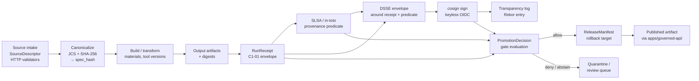

<!-- [KFM_META_BLOCK_V2]
doc_id: kfm://doc/standards/provenance
title: PROVENANCE — Supply-Chain / Build Provenance Standard
type: standard
version: v1
status: draft
owners: TODO — Standards steward + Release authority (placeholder; confirm via CODEOWNERS)
created: 2026-05-14
updated: 2026-05-14
policy_label: public
related:
  - docs/standards/README.md
  - docs/standards/PROV.md
  - docs/standards/SIGNING.md
  - docs/standards/CANONICALIZATION.md
  - docs/standards/STAC.md
  - docs/doctrine/directory-rules.md
  - docs/doctrine/lifecycle-law.md
  - docs/doctrine/trust-membrane.md
  - docs/architecture/contract-schema-policy-split.md
  - schemas/contracts/v1/receipts/run_receipt.schema.json
  - schemas/contracts/v1/release/release_manifest.schema.json
  - policy/promotion/promotion_gates.rego
  - tools/attest/README.md
  - docs/adr/ADR-S-04-slsa-target-level.md
tags: [kfm, standards, provenance, slsa, in-toto, dsse, cosign, sigstore, supply-chain]
notes:
  - "Folder placement docs/standards/ is CONFIRMED per Directory Rules §6.1; all child paths PROPOSED per §0."
  - "This document scopes the supply-chain / build provenance lane (SLSA, in-toto, DSSE, cosign). Semantic claim provenance (W3C PROV-O, PAV) lives in docs/standards/PROV.md."
  - "External-standard claims (SLSA, in-toto, DSSE, cosign, Sigstore, SPDX) are sourced from the KFM corpus's references to those standards, not from fresh web research in this session."
[/KFM_META_BLOCK_V2] -->

<a id="top"></a>

# PROVENANCE — Supply-Chain / Build Provenance Standard

> How KFM binds every promoted artifact to a verifiable chain of **builder identity, materials, build steps, signatures, and policy decisions** — so that publication is reconstructable from facts, not from hope.

[](#1-status--authority)
[](../doctrine/directory-rules.md)
[](#3-doctrinal-anchors)
[](#16-open-questions--needs-verification)
[](#10-promotion-gates)
[](#7-external-standards-in-scope)
[](#8-the-dsse-envelope)
[](#9-signing-posture)
[](#last-reviewed)
[](#)

**Status:** draft · **Authority level:** canonical (standard doc) · **Owners:** Standards steward + Release authority _(TODO)_ · **Last reviewed:** 2026-05-14

> [!IMPORTANT]
> Two provenance lanes exist in KFM and must not be conflated:
>
> - **Supply-chain provenance** *(this doc)* — who built what, from which materials, with what tools, and is it signed. Vocabulary: **SLSA**, **in-toto**, **DSSE**, **cosign / Sigstore**, **SPDX**.
> - **Semantic claim provenance** *(see `PROV.md`)* — who said what, when, and why, in the KFM graph. Vocabulary: **W3C PROV-O**, **PAV**, **CIDOC-CRM E13**.
>
> Both terminate in the same `RunReceipt` and resolve through the same `EvidenceBundle`, but they answer different questions and bind different fields.

---

## Contents

1. [Status & Authority](#1-status--authority)
2. [Purpose](#2-purpose)
3. [Doctrinal anchors](#3-doctrinal-anchors)
4. [What this is / is not](#4-what-this-is--is-not)
5. [The KFM provenance chain](#5-the-kfm-provenance-chain)
6. [Scope of supply-chain provenance](#6-scope-of-supply-chain-provenance)
7. [External standards in scope](#7-external-standards-in-scope)
8. [The DSSE envelope](#8-the-dsse-envelope)
9. [Signing posture](#9-signing-posture)
10. [Promotion gates](#10-promotion-gates)
11. [Storage & immutability](#11-storage--immutability)
12. [Verification posture (cite-or-abstain)](#12-verification-posture-cite-or-abstain)
13. [CI integration](#13-ci-integration)
14. [Anti-patterns & forbidden shapes](#14-anti-patterns--forbidden-shapes)
15. [Validators & fixtures](#15-validators--fixtures)
16. [Open questions & NEEDS VERIFICATION](#16-open-questions--needs-verification)
17. [Glossary](#17-glossary)
18. [Related docs](#18-related-docs)

---

## 1. Status & Authority

| Field | Value |
|---|---|
| **Document type** | Standard doc — external-standards conformance |
| **Authority** | CONFIRMED for doctrine; **PROPOSED** for every path, schema location, predicate field name, and validator name quoted below |
| **Folder placement** | `docs/standards/` — CONFIRMED per Directory Rules §6.1 (*"external standards KFM conforms to (STAC, DCAT, PROV, etc.)"*) |
| **Schema home convention** | `schemas/contracts/v1/<…>` per **ADR-0001** (schema home); receipts, release manifests, and predicate references resolve there |
| **Sibling boundary** | This doc covers **supply-chain provenance**. Semantic claim provenance lives in `docs/standards/PROV.md`. Signing posture lives in `docs/standards/SIGNING.md`. `spec_hash` canonicalization lives in `docs/standards/CANONICALIZATION.md`. |
| **Reviewers required for change** | Standards steward + Release authority; **ADR required** to change predicate field naming, target SLSA level, or default signing posture (Directory Rules §2.4 (5)) |
| **Lifecycle invariant** | RAW → WORK / QUARANTINE → PROCESSED → CATALOG / TRIPLET → PUBLISHED. Promotion is a **governed state transition, not a file move.** |
| **Truth posture** | Cite-or-abstain. Missing, mismatched, or unverified provenance → **ABSTAIN** (validator) / **DENY** (policy) at the promotion gate. |

> [!NOTE]
> Anything that looks like a path, route, schema filename, or workflow name in this document is **PROPOSED** until verified against mounted-repo evidence per Directory Rules §0.

[↑ Back to top](#top)

---

## 2. Purpose

This document defines **how KFM proves a published artifact is what it claims to be**: who built it, what inputs went into it, on what platform, at what commit, and that no tampering has occurred between build and publication.

It anchors three concrete obligations:

1. **Every artifact that crosses the trust membrane carries a `RunReceipt`** with deterministic identity (`spec_hash`), input digests, builder identity, output digests, rights posture, and at least one attestation. *(CONFIRMED doctrine per C1-01.)*
2. **The receipt is wrapped, signed, and made tamper-evident** via DSSE + cosign (keyless OIDC by default). *(CONFIRMED doctrine per C1-03.)*
3. **A SLSA / in-toto provenance predicate** ties the artifact subject to its materials, builder, and invocation, and is itself attested. *(CONFIRMED doctrine per C1-04.)*

A reviewer, auditor, or downstream consumer must be able to fetch one URL and reconstruct *the full chain* — source state, policy decision, builder identity, materials, output digests, signing identity, transparency-log entry, release intent, and rollback target.

[↑ Back to top](#top)

---

## 3. Doctrinal anchors

The supply-chain provenance lane is not a new invention. It operationalizes invariants already established in KFM doctrine:

| Doctrine | What it requires | Where it lives |
|---|---|---|
| **Cite-or-abstain** | A statement that needs evidence either cites support or abstains. Provenance is the operational citation layer for build artifacts. | Lifecycle Law; `docs/doctrine/truth-posture.md` _(PROPOSED neighbor)_ |
| **Trust membrane** | Public clients never read RAW / WORK / QUARANTINE; only released, governed artifacts cross the membrane. | `docs/doctrine/trust-membrane.md` _(PROPOSED neighbor)_ |
| **Promotion is a governed state transition** | Promotion is not a file move. A promotion event emits a `PromotionDecision` referencing the `RunReceipt` and its proofs. | `docs/doctrine/lifecycle-law.md` _(PROPOSED neighbor)_ |
| **Deterministic identity** | `spec_hash` is the cross-run identity fingerprint; any field that changes evidentiary meaning is in the hash; transport / runtime fields are not. | `docs/standards/CANONICALIZATION.md` _(PROPOSED)_ |
| **Separation of duties** | Signing identity, release authority, and reviewer are distinct roles. | `docs/governance/separation-of-duties.md` _(PROPOSED neighbor)_ |

> [!TIP]
> If a reader is trying to figure out whether a question belongs here or in `PROV.md`, the litmus is: **"Is the question about the build, or about the claim?"** Build questions live here. Claim questions live in `PROV.md`.

[↑ Back to top](#top)

---

## 4. What this is / is not

| This IS | This is NOT |
|---|---|
| A conformance profile for **SLSA**, **in-toto**, **DSSE**, **cosign / Sigstore**, and **SPDX** as KFM applies them | A general primer on supply-chain security |
| A binding between `RunReceipt` fields and SLSA / in-toto predicate fields | A schema definition (those live under `schemas/contracts/v1/…`) |
| The contract that promotion gates evaluate before any artifact crosses the trust membrane | A runtime — the runtime lives in `tools/attest/` and `runtime/` |
| The KFM-side mapping for OIDC issuers, key fallback, and transparency-log usage | A duplicate of `docs/standards/SIGNING.md` — signing details belong there |
| Authoritative on **which** provenance objects must exist and **what** they must contain | Authoritative on **how the receipt is canonicalized** — that lives in `CANONICALIZATION.md` |
| Distinct from semantic-claim provenance | A replacement for `PROV.md` — the two are complementary, not alternatives |

[↑ Back to top](#top)

---

## 5. The KFM provenance chain

A released artifact is the *tail* of a chain that begins at source intake. Every link in the chain emits a receipt; every receipt is signed; every signature is verifiable.



> [!IMPORTANT]
> The chain **fails closed** at every gate. A missing predicate, an unverifiable signature, a `spec_hash` mismatch, an unknown SPDX license, or an empty `evidence_refs[]` MUST produce an **ABSTAIN** (validator) or **DENY** (policy) outcome rather than a silent pass.

[↑ Back to top](#top)

---

## 6. Scope of supply-chain provenance

Supply-chain provenance in KFM covers four categories of artifact. Each one carries the same receipt envelope but populates fields slightly differently.

| Artifact class | What it is | Predicate type | Receipt obligations |
|---|---|---|---|
| **Data run artifact** | A dataset version emitted from a pipeline run (e.g. a processed table, a parquet, a Zarr cube). | SLSA Provenance v1 (or pinned alternative — **PROPOSED**) | Source role, `spec_hash`, materials with digests, tool versions, SPDX license, attestation. |
| **Tile / map artifact** | PMTiles, MVT bundles, COG, or other tile artifacts emitted for the map shell. | SLSA Provenance v1 + KFM tile manifest cross-reference | Adds `TileArtifactManifest` reference, root hash, integrity tree, range-verification posture. |
| **AI-authored merge** | Content where a model proposed a change that a human reviewer accepted. | SLSA + KFM `GENERATED_RECEIPT` extension *(C12-03; **PROPOSED** extension)* | Adds adapter identity, prompt hash, model version, `AIReceipt` reference. |
| **Release bundle** | The signed, immutable bundle that the governed API serves. | SLSA + DSSE-wrapped `ReleaseManifest` | References every constituent receipt; carries rollback target and correction lineage. |

> [!NOTE]
> The list above is **CONFIRMED** as a class taxonomy across the corpus. Specific predicate types and field naming are **PROPOSED** until **ADR-S-04** (SLSA target level) and the receipt-class home ADR are accepted.

[↑ Back to top](#top)

---

## 7. External standards in scope

KFM adopts the following external standards for the supply-chain lane. The conformance posture and version pin for each are tracked here; the runtime behaviour is implemented elsewhere.

| Standard | Conformance posture | Version pin | KFM use |
|---|---|---|---|
| **SLSA** (Supply-chain Levels for Software Artifacts) | **PROPOSED** target level — see [ADR-S-04](#16-open-questions--needs-verification) | Provenance v1 (**PROPOSED**) | Predicate format for build provenance; target level governs material/build-step rigor |
| **in-toto** (link statements, layouts) | CONFIRMED doctrine; predicate carrier for SLSA | in-toto 1.0 (**PROPOSED** pin) | Statement envelope shape; layout reserved for multi-step pipelines |
| **DSSE** (Dead Simple Signing Envelope) | CONFIRMED doctrine | DSSE 1.0 | Wraps the canonicalized receipt + predicate bytes before signing |
| **cosign / Sigstore** | CONFIRMED doctrine; **keyless OIDC by default**, KMS fallback documented in `SIGNING.md` | cosign ≥ 2.x (**PROPOSED** floor) | Produces the signature; binds it to a workflow identity rather than a long-lived key |
| **Rekor** (transparency log) | **PROPOSED** for keyless mode; mandatory when keyless is used | n/a | Provides externally observable signature evidence; Rekor index recorded in receipt |
| **SPDX** (license expression) | CONFIRMED doctrine | SPDX 2.3 expression syntax (**PROPOSED** pin) | Populates `rights_spdx` in the receipt; canonical license identity for promotion gates |
| **SBOM** (CycloneDX or SPDX SBOM) | **PROPOSED** for code artifacts; **NEEDS VERIFICATION** for data artifacts | TBD | When required, SBOM digest is referenced from the receipt's `attestations[]` |

> [!CAUTION]
> KFM does **not** treat any of these standards as sovereign truth. Their role is to provide **verifiable structure** around a chain whose authority comes from KFM doctrine — source role, sensitivity posture, evidence resolution, and review state — not from a green checkmark in a tool.

[↑ Back to top](#top)

---

## 8. The DSSE envelope

The receipt and the SLSA / in-toto predicate are wrapped together in a DSSE envelope before signing. This ensures the bytes signed are the bytes verified — not the developer-formatted JSON.

<details>
<summary><strong>Reference DSSE envelope shape</strong> (illustrative — exact field naming pending ADR)</summary>

```json
{
  "payloadType": "application/vnd.in-toto+json",
  "payload": "<base64url of canonicalized in-toto Statement bytes>",
  "signatures": [
    {
      "keyid": "<cosign signer identity or key ID>",
      "sig":   "<base64 signature over the DSSE pre-auth encoding>"
    }
  ]
}
```

The inner `payload`, once base64-decoded, is the in-toto Statement carrying:

```json
{
  "_type": "https://in-toto.io/Statement/v1",
  "subject": [
    {
      "name": "<artifact path or URI>",
      "digest": { "sha256": "<artifact sha256>" }
    }
  ],
  "predicateType": "https://slsa.dev/provenance/v1",
  "predicate": {
    "buildDefinition": { "...": "..." },
    "runDetails":     { "...": "..." }
  }
}
```

</details>

> [!IMPORTANT]
> The **payload bytes** are canonicalized (per `CANONICALIZATION.md`) **before** being base64-encoded. Hashing the developer-formatted JSON is forbidden, because trivial reformatting would rotate the hash and break every verifier.

[↑ Back to top](#top)

---

## 9. Signing posture

Detailed signing posture (issuer allowlists, key fallback, rotation, KMS shape) lives in `docs/standards/SIGNING.md`. This section names only the obligations the provenance standard imposes.

| Obligation | Required behavior |
|---|---|
| **Default mode** | Keyless OIDC via cosign. Identity is a workflow (e.g. `obs-pipeline@kfm` — illustrative), not a long-lived key. |
| **Transparency** | When keyless mode is used, the Rekor entry index MUST be captured in the receipt's `attestations[].rekor_index` (**PROPOSED** field naming). |
| **Fallback mode** | KMS-managed key signing is permitted in air-gapped or partner-integration contexts; the signer identity MUST be recorded and the fallback reason documented. |
| **Rotation** | Issuer allowlists, key IDs, and workflow identities follow the rotation cadence in `SIGNING.md`. |
| **Verification before promotion** | `cosign verify-attestation` (or equivalent) MUST succeed before a `PromotionDecision` returns `allow`. Failure → **DENY**. |

[↑ Back to top](#top)

---

## 10. Promotion gates

Promotion across the lifecycle membrane is governed by composable gates. The supply-chain provenance gates that this document binds:

| Gate | Inputs | Pass condition | Fail action |
|---|---|---|---|
| **`spec_hash_match`** | Receipt `spec_hash` vs. recomputed canonical hash of the spec | Equal | ABSTAIN → DENY |
| **`signature_verifies`** | DSSE envelope + cosign verifier + allowlisted identity | cosign returns success; identity on allowlist | DENY |
| **`predicate_present`** | In-toto Statement with non-empty `subject[]`, valid `predicateType`, non-empty `predicate` | Schema-valid and field-complete | DENY |
| **`materials_digested`** | SLSA `buildDefinition.resolvedDependencies` (or named equivalent) | Every material carries a digest | ABSTAIN |
| **`license_known`** | Receipt `rights_spdx` resolves to a known SPDX expression | Resolves; not on deny list | DENY (unknown rights → fail closed) |
| **`evidence_refs_resolve`** | Receipt `evidence_refs[]` → `EvidenceBundle` resolver | Each ref resolves to an admissible bundle | ABSTAIN |
| **`rollback_target_present`** | Release-class receipts only | Prior `ReleaseManifest` pointer exists and is reachable | DENY |
| **`transparency_recorded`** | Keyless mode only | Rekor index present and queryable | ABSTAIN |

> [!WARNING]
> A `RunReceipt` that passes schema validation is **not** a promotion authorization. Promotion requires all applicable gates above to evaluate `allow`. A green schema check with a missing signature is still a hard DENY.

[↑ Back to top](#top)

---

## 11. Storage & immutability

| Requirement | Detail |
|---|---|
| **Immutable store** | Receipts and DSSE envelopes are persisted to a versioned, append-only store (object store, OCI registry, or in-repo `data/receipts/` per ADR — **PROPOSED**). |
| **Content-addressed** | Storage key derives from `spec_hash` (or from the DSSE payload digest). Mutable paths and timestamps MUST NOT be load-bearing. |
| **Retention** | Retention is governed; tombstoned receipts are retained for audit per Lifecycle Law. Exact retention windows are **UNKNOWN** in this session. |
| **Public exposure** | Receipts are exposed via the governed API only. Direct exposure of raw receipt storage is forbidden. |
| **Correction linkage** | A `CorrectionNotice` MUST list every derived receipt invalidated by the correction; the receipt store MUST be queryable by descendant relationships. |

[↑ Back to top](#top)

---

## 12. Verification posture (cite-or-abstain)

A consumer (governed API, validator, downstream partner) verifying a published artifact MUST:

1. Resolve the artifact's `ReleaseManifest`.
2. From the manifest, resolve every constituent `RunReceipt`.
3. For each receipt: recompute `spec_hash`, verify DSSE signature, verify cosign identity against the allowlist, verify Rekor index (keyless mode), and resolve every `EvidenceRef` to an `EvidenceBundle`.
4. Run the §10 promotion gates as a *post-publication audit*; any failure surfaces a `CorrectionNotice` proposal and, where appropriate, a rollback drill.

> [!NOTE]
> Verification at consumption time is not a substitute for the promotion gate. Both run, on different schedules, with the same hard rule: **failure means abstain or deny, never silently pass.**

[↑ Back to top](#top)

---

## 13. CI integration

CI is the most common location where supply-chain provenance is produced and gated. The integration shape below is illustrative; exact workflow names are **PROPOSED**.

<details>
<summary><strong>Illustrative GitHub Actions workflow sketch</strong> (PROPOSED — names not verified)</summary>

```yaml
# .github/workflows/provenance.yml  (PROPOSED — names not verified)
name: provenance
on: [workflow_call]

permissions:
  id-token: write     # for cosign keyless OIDC
  contents: read

jobs:
  attest:
    runs-on: ubuntu-latest
    steps:
      - uses: actions/checkout@v4

      - name: Build artifact
        run: tools/build/run.sh

      - name: Compute canonical spec_hash
        run: tools/canonicalize/spec_hash.py --out spec_hash.txt

      - name: Emit RunReceipt
        run: tools/attest/make_run_receipt.py --out run_receipt.json

      - name: Emit SLSA in-toto Statement
        run: tools/attest/make_slsa_statement.py
              --subject ${{ env.ARTIFACT_PATH }}
              --receipt run_receipt.json
              --out statement.json

      - name: Wrap in DSSE
        run: tools/attest/dsse_wrap.sh statement.json envelope.json

      - name: Sign (keyless OIDC)
        run: cosign sign-blob --yes envelope.json
              --output-signature envelope.sig
              --output-certificate envelope.crt

      - name: Capture Rekor index
        run: tools/attest/capture_rekor_index.sh envelope.sig

      - name: Validate against promotion gates
        run: tools/validators/attest/validate_promotion_gates.py
              --receipt run_receipt.json
              --envelope envelope.json
              --signature envelope.sig
              --strict

      - name: Upload provenance bundle
        if: ${{ success() }}
        run: tools/release/upload_provenance.sh
              run_receipt.json statement.json envelope.json envelope.sig
```

</details>

[↑ Back to top](#top)

---

## 14. Anti-patterns & forbidden shapes

These are forbidden by doctrine. Any reviewer encountering one of them MUST request changes and SHOULD open a `DRIFT_REGISTER.md` entry.

| Anti-pattern | What goes wrong | Counter-rule |
|---|---|---|
| Hashing developer-formatted JSON | `spec_hash` rotates on trivial reformat; verifier breaks | Always canonicalize before hashing (`CANONICALIZATION.md`) |
| Signing the artifact without a predicate | Signature proves bytes, not provenance; downstream cannot verify materials, builder, or invocation | DSSE-wrap an in-toto Statement carrying a SLSA predicate; sign the envelope |
| Long-lived signing key in CI secrets | Key compromise irrevocable; identity not auditable | Keyless OIDC by default; KMS fallback documented in `SIGNING.md` |
| Promotion-time verification only | Consumer trust depends on operator; offline audit impossible | Verification is also a consumer-side obligation; verifier ships with the bundle |
| Receipt without `evidence_refs[]` | Build is provenanced, but the *claim it supports* is not citable | Cite-or-abstain doctrine applies to the claim layer too; missing refs → ABSTAIN |
| Mutable storage path as receipt identity | Identity drifts on rename/move; verifier breaks | Content-addressed storage by `spec_hash`; path is a hint, not authority |
| Treating a green CI badge as release authority | Conflates build success with release approval | `PromotionDecision` is the release authority; CI is a gate input |
| AI-authored change without `GENERATED_RECEIPT` | Adapter identity, prompt, and model version are not auditable | Apply the `GENERATED_RECEIPT` extension; route through the governed AI runtime |
| Signing identity = release authority | Separation of duties violated | Signer, reviewer, and release authority are distinct roles |
| Publishing without rollback target | Public surface cannot be reverted; release not auditable | Release-class receipts MUST carry a rollback target; gate fails closed if absent |

[↑ Back to top](#top)

---

## 15. Validators & fixtures

Where validators and fixtures live (all paths **PROPOSED** per Directory Rules §0):

| Validator / fixture | Proposed home | What it proves |
|---|---|---|
| `validate_run_receipt.py` | `tools/validators/attest/` | Receipt schema-conforms; required fields present; `spec_hash` parseable |
| `validate_slsa_statement.py` | `tools/validators/attest/` | In-toto Statement schema-conforms; subject digests present; predicate type allowlisted |
| `verify_dsse.py` | `tools/validators/attest/` | DSSE envelope verifies against signature; payload bytes match expected canonicalization |
| `validate_promotion_gates.py` | `tools/validators/attest/` | Runs the §10 gate matrix; returns finite ANSWER / ABSTAIN / DENY / ERROR |
| `good_receipt.json` | `tests/fixtures/attest/good/` | Positive fixture — full chain, all gates pass |
| `bad_unsigned_receipt.json` | `tests/fixtures/attest/bad/` | Negative fixture — missing signature → DENY |
| `bad_spec_hash_mismatch.json` | `tests/fixtures/attest/bad/` | Negative fixture — receipt hash ≠ recomputed → DENY |
| `bad_unknown_license.json` | `tests/fixtures/attest/bad/` | Negative fixture — `rights_spdx` not on allowlist → DENY |
| `bad_no_evidence_refs.json` | `tests/fixtures/attest/bad/` | Negative fixture — empty `evidence_refs[]` → ABSTAIN |
| `bad_missing_rollback.json` | `tests/fixtures/attest/bad/` | Negative fixture (release class) — no rollback target → DENY |

> [!NOTE]
> Per Directory Rules §13, validators MUST live under `tools/validators/` (not only inside test files). Negative fixtures MUST exercise DENY / ABSTAIN paths; a validator without negative coverage is treated as **unverified**.

[↑ Back to top](#top)

---

## 16. Open questions & NEEDS VERIFICATION

Each item below is intended for triage; several rise to ADR class per Directory Rules §2.4.

| ID | Question | Class |
|---|---|---|
| **ADR-S-04** | What SLSA target level does KFM commit to for data runs (1, 2, or 3)? *(CONFIRMED open — see corpus.)* | ADR-class |
| **ADR-S-05** | Which OIDC issuers appear on the cosign verifier's allowlist? (GitHub Actions OIDC, in-house, both?) | ADR-class — coordinate with `SIGNING.md` |
| **ADR-S-06** | Pin the SLSA predicate version (Provenance v1 vs. v0.2) and the in-toto Statement version. | ADR-class |
| **ADR-S-07** | Receipt home: `schemas/contracts/v1/receipts/` vs. `schemas/contracts/v1/<domain>/receipts/`. Directory Rules §2.4 (5). | ADR-class |
| **ADR-S-08** | Is SBOM emission required for data artifacts, code artifacts, or both? | ADR-class |
| **ADR-S-09** | Tombstone / retention window for receipts and revoked-consent artifacts. | ADR-class |
| **NEEDS VERIFICATION** | Whether `tools/attest/`, `tools/validators/attest/`, `schemas/contracts/v1/receipts/`, and `policy/promotion/` exist in the mounted repo and at what maturity. | Repo inspection |
| **NEEDS VERIFICATION** | Whether `data/receipts/` (per Directory Rules §15 trust-content placement) is the canonical immutable store, or whether an OCI registry / external object store is used. | Repo inspection |
| **NEEDS VERIFICATION** | Canonical receipt field names — corpus shows mild drift (`fetch_time` vs `fetched_at`, `http_validators` vs `source_validators`). One canonical schema needed. | Repo inspection + ADR |
| **OPEN** | Should the SLSA predicate include `kfm_run_id` (OpenLineage parity) explicitly, or rely on `RunReceipt.run_id` cross-reference alone? | OpenLineage coupling |
| **OPEN** | How does a `CorrectionNotice` propagate to the transparency log and to downstream consumers' verifier caches? | Process |
| **OPEN** | Cross-builder portability — can a receipt produced by builder A be re-verified by an external partner using only public materials? | Conformance |

[↑ Back to top](#top)

---

## 17. Glossary

| Term | Definition |
|---|---|
| **`RunReceipt`** | Build/run receipt for pipeline or tile artifact generation: inputs, config / spec hash, artifact digests, `source_head`, tool versions, attestations. *(CONFIRMED object family.)* |
| **`EvidenceBundle`** | Admissible evidence object resolved from `EvidenceRef`; outranks maps, tiles, and generated text. |
| **`EvidenceRef`** | Pointer from a claim, feature, answer, layer, or proof item to evidence that must resolve before consequential release. |
| **`spec_hash`** | Deterministic identity fingerprint computed by canonicalizing the spec (JCS or equivalent) and applying SHA-256. Recorded as `jcs:sha256:<hex>`. |
| **`PromotionDecision`** | Promotion gate result with gate IDs, inputs, proofs, release target, rollback target, reviewer, timestamp. |
| **`ReleaseManifest`** | Release-class object: lists constituent receipts, asset digests, rollback target, signing identity, and release intent. |
| **`RollbackCard`** | Pointer to previous release manifest / root hash / tile checksum set with rollback drill and correction lineage. |
| **`CorrectionNotice`** | Public correction lineage object linked to claims, releases, and invalidated derivatives. |
| **SLSA Provenance Predicate** | An in-toto predicate of type `slsa.dev/provenance/v1` (or pinned alternative) carrying `buildDefinition` and `runDetails` for the build. |
| **in-toto Statement** | The outer envelope of type `in-toto.io/Statement/v1` carrying `subject[]`, `predicateType`, and `predicate`. |
| **DSSE envelope** | The pre-auth-encoding wrapper that binds the signed bytes; `payloadType` + base64 `payload` + `signatures[]`. |
| **cosign** | Sigstore signing tool; keyless OIDC mode binds identity to a workflow rather than a long-lived key. |
| **Rekor** | Sigstore transparency log; records inclusion proofs for keyless signatures. |
| **SPDX expression** | Canonical license-identity string in `rights_spdx` (e.g. `CC0-1.0`, `CC-BY-4.0`, `MIT`). |
| **Finite outcome** | KFM-mandated decision shape: `ANSWER`, `ABSTAIN`, `DENY`, `ERROR`. Used by every gate and governed API surface. |

[↑ Back to top](#top)

---

## 18. Related docs

- [`docs/doctrine/directory-rules.md`](../doctrine/directory-rules.md) — §6.1 `docs/standards/` home; §13 trust-content placement; §15 README contract.
- [`docs/doctrine/lifecycle-law.md`](../doctrine/lifecycle-law.md) _(PROPOSED)_ — the `RAW → … → PUBLISHED` invariant.
- [`docs/doctrine/trust-membrane.md`](../doctrine/trust-membrane.md) _(PROPOSED)_ — why public clients never read RAW / WORK / QUARANTINE.
- [`docs/standards/README.md`](./README.md) _(PROPOSED)_ — index of external standards KFM conforms to.
- [`docs/standards/PROV.md`](./PROV.md) _(PROPOSED)_ — W3C PROV-O / PAV semantic claim provenance (the *sibling* lane).
- [`docs/standards/SIGNING.md`](./SIGNING.md) _(PROPOSED)_ — cosign keyless vs KMS; OIDC issuer allowlist.
- [`docs/standards/CANONICALIZATION.md`](./CANONICALIZATION.md) _(PROPOSED)_ — JCS vs URDNA2015; `spec_hash` discipline.
- [`docs/standards/STAC.md`](./STAC.md) _(PROPOSED)_ — STAC profile and the `derived_from` / `EvidenceRef` embedding pattern.
- [`docs/standards/OPENLINEAGE.md`](./OPENLINEAGE.md) _(PROPOSED)_ — OpenLineage event shape and PROV-O parity.
- [`docs/adr/ADR-0001-schema-home.md`](../adr/ADR-0001-schema-home.md) _(referenced)_ — schema home convention.
- [`docs/adr/ADR-S-04-slsa-target-level.md`](../adr/ADR-S-04-slsa-target-level.md) _(PROPOSED)_ — pin SLSA target level.
- [`tools/attest/README.md`](../../tools/attest/README.md) _(PROPOSED)_ — runtime for receipt emission, DSSE wrap, signing, and verification.
- [`docs/runbooks/source-refresh.md`](../runbooks/source-refresh.md) _(PROPOSED)_ — operational lane that produces receipts on a schedule.
- [`docs/registers/VERIFICATION_BACKLOG.md`](../registers/VERIFICATION_BACKLOG.md) _(PROPOSED)_ — where §16 open items live until resolved.

---

<a id="last-reviewed"></a>

**Last reviewed:** 2026-05-14
**Authority:** standard doc · doctrine CONFIRMED · paths PROPOSED · implementation maturity UNKNOWN
**Scope reminder:** supply-chain / build provenance only. Semantic claim provenance lives in `PROV.md`.

[↑ Back to top](#top)
