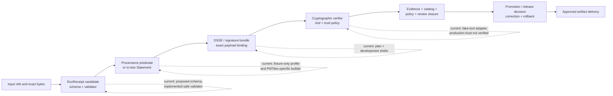

<!-- [KFM_META_BLOCK_V2]
doc_id: kfm://doc/standards/provenance
title: PROVENANCE — KFM Supply-Chain Evidence and Verification Boundary
type: standard; standards-guidance; supply-chain-provenance-boundary
version: v2.0-draft
status: "draft; repository-grounded; upstream-currentness-refreshed; partial-fixture-implementation; no-universal-profile; no-production-signing; no-release; no-publication"
owners:
  - "@bartytime4life — verified GitHub review route through CODEOWNERS"
  - "NEEDS VERIFICATION — accountable supply-chain provenance, security/signing, runtime, evidence, policy, release, operations, and independent-review stewards"
created: 2026-05-14
updated: 2026-08-18
policy_label: "repository-facing; standards-guidance; provenance; supply-chain; attestation; verification; release-gated"
owning_root: docs/
current_path: docs/standards/PROVENANCE.md
responsibility: >
  Explain the upstream SLSA, in-toto, DSSE, and Sigstore/Cosign boundaries;
  disclose KFM's current RunReceipt, provenance-predicate, verification-plan,
  fixture-execution, and carrier-specific attestation surfaces; and identify the
  evidence required before KFM may claim a universal provenance profile,
  production cryptographic verification, promotion readiness, release, or
  publication.
truth_posture: >
  CONFIRMED current path, standards-lane placement, default CODEOWNERS route,
  current proposed RunReceipt schema plus no-network validator, fixture-only
  non-container provenance predicate, inactive Cosign verification plan,
  fixture-first promotion-verification executor, PMTiles-specific
  predicate-shaped receipt builder, development signature shell, and
  shape-only COSE verification / PROPOSED universal KFM SLSA profile, canonical
  receipt-to-attestation mapping, production signer and verifier profile,
  accepted trust roots, release integration, correction, and rollback /
  UNKNOWN production signing keys, real Sigstore bundle inventory, deployed
  consumers, released provenance bundles, and public publication.
evidence_snapshot:
  repository: bartytime4life/Kansas-Frontier-Matrix
  base_ref: main
  base_commit: 3ddf171cd7c4a5b4dbbeec3127e9721411c2c8eb
  target_prior_blob: cddd69eeb49ccc65481137e2d65dcafe1abe2ebf
  standards_readme_blob: a8cbe5d183448d5f0de37f8a4eacd6fcaca0d71b
  codeowners_blob: dd2a84aa514d8ecd9208bc347f90f9a2ed37dd61
  runtime_run_receipt_contract_blob: 5592aa5e22bbdd0c668189f79b50c18f7d1b2479
  runtime_run_receipt_schema_blob: c930ff0fd4da34d8b4ff202d9fd576110258974c
  runtime_run_receipt_validator_blob: d57bc57234a16dc11908e1509b293124e185d388
  non_container_predicate_contract_blob: a2dae7eb0f29ad530bd86fcf61ab4ab5c18648be
  cosign_plan_contract_blob: 64d28208141be9304c015c13499dd9ece33667bd
  cosign_plan_validator_blob: 8346cec7355b6e2fa7f56f47074df45d230c369f
  promotion_execution_contract_blob: 9e4a93821f9152be335b142116610b5b3cb78124
  pmtiles_runreceipt_builder_blob: 7409ee75ac6aa41f973d2ba0b71fa1c8abbe964f
  development_pmtiles_signer_blob: e519a96ed57ba26085604ac45a145c869f30958c
  cose_shape_verifier_blob: 566c4393241a7eb519c0d8c7d88bb32128347d62
external_currentness_review:
  access_date: 2026-08-18
  slsa: "SLSA specification 1.2; Approved; Build Provenance predicate type remains https://slsa.dev/provenance/v1"
  in_toto: "in-toto Statement v1 binds immutable subjects by digest to one predicate type and predicate"
  dsse: "DSSE authenticates exact payload bytes plus payload type through pre-authentication encoding and intentionally avoids canonicalization"
  sigstore_cosign: "Security checkpoint includes GHSA-w6c6-c85g-mmv6 / CVE-2026-39395; patched floors 2.6.3 and 3.0.6; claim validation must remain enabled"
related:
  - ./README.md
  - ./PROV.md
  - ./PROV-O.md
  - ./SIGNING.md
  - ./CANONICALIZATION.md
  - ./RUN_RECEIPT.md
  - ../doctrine/directory-rules.md
  - ../adr/ADR-0029-adopt-directory-governance-standard-v2.md
  - ../../contracts/runtime/run_receipt.md
  - ../../schemas/contracts/v1/runtime/run_receipt.schema.json
  - ../../tools/validators/validate_run_receipt.py
  - ../../contracts/evidence/non_container_provenance_predicate_profile.md
  - ../../contracts/release/cosign_attestation_verification_plan.md
  - ../../contracts/release/promotion_verification_execution.md
  - ../../tools/attest/README.md
  - ../../tools/attest/build_runreceipt.py
  - ../../tools/attest/sign_pmtiles.py
  - ../../tools/attest/verify_cose.py
  - ../../policy/supply_chain/README.md
  - ../../.github/CODEOWNERS
tags: [kfm, standards, provenance, slsa, in-toto, dsse, sigstore, cosign, run-receipt, attestation, verification, release]
notes:
  - "Same-path documentation modernization only; no contract, schema, policy, validator, fixture, workflow, receipt, key, trust root, release object, runtime, deployment, or public product changes."
  - "The prior page overstated universal signed-receipt behavior, production Cosign/DSSE execution, canonical receipt authority, and release-gate maturity."
  - "This edition separates deterministic object identity, attestation statement shape, signature envelope, cryptographic verification, evidence/policy/review, and governed release."
  - "Legacy title and numbered-section anchors are retained for inbound-link compatibility."
[/KFM_META_BLOCK_V2] -->

<a id="top"></a>
<a id="provenance--supply-chain--build-provenance-standard"></a>

# PROVENANCE — KFM Supply-Chain Evidence and Verification Boundary

> **Operating rule.** Provenance can bind exact bytes, declared materials, a builder, an invocation, and a verifier result. It cannot by itself establish source truth, rights, sensitivity clearance, policy approval, accountable review, lifecycle promotion, release, or publication.


> [!IMPORTANT]
> **Human-readable guidance only.** This page explains external standards and the current KFM repository boundary. Contracts own object meaning, schemas own machine-valid shape, validators and tests prove only their declared checks, policy and governed review decide admissibility, and release records decide release. This page owns none of those decisions.

> [!CAUTION]
> **Current implementation is partial and heterogeneous.** KFM has a proposed runtime `RunReceipt` schema with a real no-network validator, a fixture-only non-container provenance-predicate candidate, a proposed inactive Cosign verification plan, and a fixture-first promotion-verification executor. It does not have one accepted, production-wide SLSA/DSSE/Cosign profile or a verified universal signed-receipt chain.

> [!WARNING]
> **Production cryptographic trust is not established by the inspected repository state.** The PMTiles signer emits an explicit development placeholder; the COSE verifier fails closed unless development-only shape checking is requested; the Cosign-plan workflow does not install or execute Cosign; and the promotion executor uses deterministic fake tools in fixtures.

> [!NOTE]
> **DSSE and canonicalization are separate concerns.** DSSE authenticates the exact payload bytes and payload type and intentionally avoids a canonicalization requirement. KFM may canonicalize a JSON object for deterministic identity, but a verifier must still verify the exact bytes actually enclosed and signed.

| Field | Current bounded result |
|---|---|
| **Evidence snapshot** | `main@3ddf171cd7c4a5b4dbbeec3127e9721411c2c8eb` |
| **Directory result** | `PLACE` at existing `docs/standards/PROVENANCE.md`; accepted Directory Rules assign human-readable standards guidance to `docs/standards/` |
| **Review route** | `@bartytime4life` through repository-default CODEOWNERS; specialist and independent stewardship remain **NEEDS VERIFICATION** |
| **External checkpoint** | SLSA `1.2` Approved; in-toto Statement `v1`; DSSE protocol; Sigstore/Cosign security baseline rechecked on 2026-08-18 |
| **KFM adoption** | No accepted universal SLSA level, predicate profile, DSSE payload profile, signer policy, or production-verifier profile was verified |
| **Current executable proof** | Proposed receipt shape and safe parsing; structural predicate fixtures; verification-plan fixtures; fake-tool promotion-verification adapter; carrier-specific development helpers |
| **Production cryptography** | **NOT VERIFIED** |
| **Release/public effect** | None |

**Quick navigation:** [Status](#1-status--authority) · [Purpose](#2-purpose) · [Doctrine](#3-doctrinal-anchors) · [Boundary](#4-what-this-is--is-not) · [Chain](#5-the-kfm-provenance-chain) · [Scope](#6-scope-of-supply-chain-provenance) · [Standards](#7-external-standards-in-scope) · [DSSE](#8-the-dsse-envelope) · [Signing](#9-signing-posture) · [Gates](#10-promotion-gates) · [Storage](#11-storage--immutability) · [Verification](#12-verification-posture-cite-or-abstain) · [CI](#13-ci-integration) · [Anti-patterns](#14-anti-patterns--forbidden-shapes) · [Validators](#15-validators--fixtures) · [Backlog](#16-open-questions--needs-verification) · [Glossary](#17-glossary) · [References](#18-related-docs)

---

<a id="1-status--authority"></a>

## 1. Status & Authority

### 1.1 Authority by question

| Question | Owning authority | Role of this page |
|---|---|---|
| What SLSA, in-toto, DSSE, Sigstore, or Cosign specifies | The authoritative upstream specification, implementation documentation, and security advisories | Record a dated external checkpoint; do not redefine upstream behavior |
| What a KFM receipt, predicate candidate, verification plan, or execution result means | The applicable contract under `contracts/` | Cite meaning; do not replace it |
| What fields are machine-valid | The applicable schema under `schemas/contracts/v1/` | Cite shape; do not create a competing schema |
| What a validator actually checks | Current validator code, fixtures, tests, workflow, and exact run evidence | State the checked boundary and its non-effects |
| Which signer, issuer, key, bundle, or builder is trusted | Accepted security/signing policy, trust-root configuration, and accountable review | No authority |
| Whether evidence, rights, sensitivity, or policy close | Their owning evidence, source, policy, and review surfaces | No authority |
| Whether an artifact may be promoted or released | Governed promotion and release objects plus authorized review | Explain prerequisites; never approve |
| Whether a public client may consume an artifact | Released public-safe references and governed delivery configuration | No authority |

### 1.2 State separation

Do not collapse these independent states:

| State | Example |
|---|---|
| **Documented** | A standards page describes SLSA or DSSE |
| **Declared** | A candidate object names a predicate type, builder, subject, or signer plan |
| **Schema-valid** | JSON satisfies one proposed schema |
| **Structurally checked** | A validator confirms closed shape and internal bindings |
| **Cryptographically verified** | A trusted verifier validates the exact signed bytes, subject, predicate, identity, and trust chain |
| **Evidence-supported** | EvidenceRefs resolve and the referenced evidence is admissible for the claim |
| **Policy-allowed** | The applicable policy result allows the intended consequence |
| **Reviewed** | Accountable and independent review is complete where required |
| **Released** | A governed release transition binds immutable artifacts and rollback/correction support |
| **Published** | A public-safe artifact is exposed through approved delivery |

A later state may depend on an earlier state, but no state automatically creates the next one.

### 1.3 Truth labels

- **CONFIRMED** — verified from the pinned repository tree, an exact current implementation surface, or a dated authoritative upstream source.
- **PROPOSED** — a candidate KFM profile, rule, mapping, path role, or transition not accepted as current authority.
- **NEEDS VERIFICATION** — a bounded check or accountable decision remains before reliance.
- **UNKNOWN** — the inspected evidence cannot support a stronger statement.
- **HOLD** — the next trust-bearing transition lacks required evidence or authority.

[Back to top](#top)

---

<a id="2-purpose"></a>

## 2. Purpose

This document explains how supply-chain provenance can connect an artifact to its inputs, builder, invocation, exact bytes, and verification evidence without collapsing that technical chain into KFM truth or publication authority.

It covers:

- SLSA Build Provenance and the in-toto Statement boundary;
- DSSE envelope semantics and their separation from deterministic identity;
- Sigstore/Cosign verification planning and current security requirements;
- KFM's current receipt, predicate, plan, executor, fixture, and carrier-specific implementation surfaces;
- fail-closed promotion-readiness expectations;
- identity, storage, correction, withdrawal, and rollback implications; and
- the evidence needed to graduate from synthetic structure to production verification.

It does not:

- define semantic claim provenance; see [`PROV.md`](./PROV.md) and [`PROV-O.md`](./PROV-O.md);
- establish one canonical RunReceipt family or reconcile all current receipt schemas;
- adopt a SLSA level, one predicate mapping, one signing mode, or one trust root;
- install or execute production Cosign, Conftest, Rekor, Fulcio, or another external verifier;
- authenticate a builder, signer, reviewer, source, or evidence provider;
- activate a source or transform data;
- evaluate rights, sensitivity, policy, or review;
- promote lifecycle state;
- approve a release, deployment, or publication; or
- place signing keys, credentials, certificates, or trust-root secrets in the repository.

### 2.1 Two provenance lanes

| Lane | Question answered | Primary vocabulary and surfaces |
|---|---|---|
| **Supply-chain provenance** — this page | “How were these artifact bytes produced, identified, attested, and verified?” | SLSA, in-toto, DSSE, Sigstore/Cosign, KFM receipts and verification results |
| **Semantic claim provenance** | “Which activity, source, agent, and curation history support this claim?” | PROV-O, PROV-DM, PAV, catalog/triplet projections, EvidenceBundles |

The lanes may reference one another, but neither replaces the other. A build attestation does not prove a claim is true, and a PROV-O graph does not prove an artifact signature is valid.

[Back to top](#top)

---

<a id="3-doctrinal-anchors"></a>

## 3. Doctrinal anchors

The following KFM boundaries remain load-bearing even when an external attestation format is used.

| Boundary | Required separation |
|---|---|
| **Evidence outranks generated language** | A signed build record can support artifact identity; it cannot replace an EvidenceBundle for consequential claims. |
| **Promotion is governed** | A receipt, signature, validator pass, workflow, commit, or merge is an input to review, not the promotion event itself. |
| **Object families remain distinct** | Receipts, predicates, envelopes, signatures, verification results, policy decisions, reviews, proofs, manifests, corrections, and rollback records are not aliases. |
| **Deterministic identity is scoped** | A profile must say which semantic object or exact bytes are hashed, which fields are excluded, and which canonicalization version applies. |
| **Public paths are released paths** | Public clients do not browse RAW, WORK, QUARANTINE, or unreleased PROCESSED stores because an attestation exists. |
| **Sensitive material fails closed** | Signatures do not override rights, consent, sovereignty, geoprivacy, personal-data, infrastructure, or harmful-precision controls. |
| **Watchers and CI are non-publishers** | Automation may emit candidate evidence or readiness results; it does not release or publish. |
| **Correction remains visible** | Supersession, withdrawal, invalidated derivatives, trust-root retirement, and rollback remain traceable. |

### 3.1 Provenance layers

| Layer | Subject | Typical identity | What it can establish |
|---|---|---|---|
| Run receipt | One execution or stage | `run_id` plus profile-defined `spec_hash` | Declared inputs, outputs, code, sources, validations, and run outcome |
| Attestation statement | One or more immutable artifact subjects | Subject digest plus predicate type | Which predicate applies to which bytes |
| Predicate | Build-specific metadata | Versioned predicate type and build type | Declared build definition, dependencies, builder, and run details |
| Signature envelope | Exact payload bytes and payload type | Envelope/bundle digest | That a signer covered those exact bytes under the selected scheme |
| Verification result | One verifier execution | Tool, trust configuration, input digests, and result identity | What the verifier checked and its finite result |
| Policy/review result | Intended consequence | Policy/review object identity | Whether the verified packet is admissible for the next decision |
| Release object | Governed release transition | Release ID plus immutable artifact digests | Which approved artifacts are released and how to correct or roll back |

No layer should absorb the authority of another.

[Back to top](#top)

---

<a id="4-what-this-is--is-not"></a>

## 4. What this is / is not

| This page is | This page is not |
|---|---|
| A repository-grounded boundary for supply-chain provenance guidance | A SLSA certification or conformance claim |
| A dated summary of relevant upstream formats and security checkpoints | The SLSA, in-toto, DSSE, Sigstore, or Cosign specification |
| A map of current KFM candidate and fixture implementation | A claim that the candidates are active production controls |
| Guidance on how receipt, predicate, envelope, signature, verification, review, and release should remain separate | A replacement for contracts, schemas, policy, source admission, evidence, or release authority |
| A graduation checklist for real cryptographic verification | Permission to install a signer, activate OIDC, create keys, contact transparency services, or publish artifacts |
| The supply-chain sibling of semantic PROV guidance | A replacement for PROV-O, catalog lineage, or EvidenceBundle semantics |

> [!IMPORTANT]
> Normative words in an upstream-summary row report the cited upstream standard. KFM-specific normative words are binding only when an accepted decision, contract, schema, active policy, or other legitimate authority makes them binding. Unattributed `MUST` language in a draft standards page is not policy.

[Back to top](#top)

---

<a id="5-the-kfm-provenance-chain"></a>

## 5. The KFM provenance chain

The target chain has several independently reviewable transitions. Current KFM implementation reaches different maturity levels at different points.


```mermaid
flowchart LR
  I["Input refs and exact bytes"]
  R["RunReceipt candidate<br/>schema + validator"]
  P["Provenance predicate<br/>or in-toto Statement"]
  E["DSSE / signature bundle<br/>exact payload binding"]
  V["Cryptographic verifier<br/>tool + trust policy"]
  C["Evidence + catalog +<br/>policy + review closure"]
  D["Promotion / release decision<br/>correction + rollback"]
  O["Approved artifact delivery"]

  I --> R --> P --> E --> V --> C --> D --> O

  R -. "current: proposed schema,<br/>implemented safe validator" .-> R
  P -. "current: fixture-only profile<br/>and PMTiles-specific builder" .-> P
  E -. "current: plan + development shells" .-> E
  V -. "current: fake-tool adapter;<br/>production trust not verified" .-> V
```

### 5.1 Current maturity ladder

| Level | Capability | Current posture |
|---:|---|---|
| 0 | Human standards boundary | **CONFIRMED — this document** |
| 1 | Proposed receipt semantics, schema, fixtures, and no-network validation | **PARTIAL / mixed families** |
| 2 | Structural provenance-predicate candidate for synthetic non-container artifacts | **CONFIRMED fixture-only / PROPOSED_INACTIVE** |
| 3 | Carrier-specific predicate-shaped receipt and signature-bundle helpers | **CONFIRMED development-only** |
| 4 | Cosign verification-plan schema, fixtures, validator, and workflow | **CONFIRMED / PROPOSED_INACTIVE / no Cosign execution** |
| 5 | Bounded promotion-verification adapter with exact-byte bindings and fake tools | **CONFIRMED fixture-tested; `PASS` means `APPROVE_READY` only** |
| 6 | Real, pinned, integrity-checked signer and verifier with approved trust roots | **NOT VERIFIED / HOLD** |
| 7 | Accepted policy, accountable review, release, correction, withdrawal, and rollback integration | **NOT VERIFIED / HOLD** |
| 8 | Released and observed public or partner consumption | **UNKNOWN / no publication evidence** |

[Back to top](#top)

---

<a id="6-scope-of-supply-chain-provenance"></a>

## 6. Scope of supply-chain provenance

A future accepted profile may cover several artifact classes, but current support is not uniform.

| Artifact class | Current repository surface | Current proof boundary |
|---|---|---|
| Runtime or pipeline stage | [`RunReceipt` contract](../../contracts/runtime/run_receipt.md), proposed schema, fixtures, and [`validate_run_receipt.py`](../../tools/validators/validate_run_receipt.py) | Closed shape, bounded parsing, and Smart Sync semantics; no source fetch, evidence resolution, signature, policy, or release |
| Synthetic non-container artifact | [`NonContainerProvenancePredicateCandidate`](../../contracts/evidence/non_container_provenance_predicate_profile.md) and companions | Deterministic structural bindings with signature, transparency, and policy states fixed to `NOT_RUN` |
| PMTiles artifact | [`build_runreceipt.py`](../../tools/attest/build_runreceipt.py), development PMSIG shell, and shape verifier | PMTiles-specific subject/predicate-shaped JSON and signature-bundle shape; no universal statement, production signature, or trust registry |
| Attestation verification plan | [`CosignAttestationVerificationPlan`](../../contracts/release/cosign_attestation_verification_plan.md) and companions | Internally consistent patched-version, subject, predicate, bundle, trust-mode, and no-network plan; no cryptographic result |
| Promotion-verification packet | [`PromotionVerificationExecution`](../../contracts/release/promotion_verification_execution.md) and companions | Exact local bindings and deterministic fake-tool execution; readiness for accountable review only |
| Generated authoring receipt | Objects under `data/receipts/generated/` | Process and byte-binding evidence for named repository changes; not technical conformance, approval, release, or publication |
| Production release bundle | No complete production provenance bundle and consumer path verified in this review | **UNKNOWN / HOLD** |

### 6.1 Identity subjects

Keep these identity domains distinct:

| Identity | Subject |
|---|---|
| `run_id` | One execution event |
| `spec_hash` | Profile-defined canonical semantic input to one object family |
| Artifact digest | Exact artifact bytes |
| Statement subject digest | Exact bytes to which one predicate applies |
| Predicate type | Predicate semantics and major compatibility line |
| Builder ID | Build platform or trust base represented by the predicate |
| Signer identity | Certificate, key, workflow, or other signer subject |
| Verification result ID | One tool execution over exact inputs and trust configuration |
| Evidence or catalog reference | Claim support or discovery/provenance projection |
| Release ID | Governed release transition |
| Correction or withdrawal ID | Post-release change and affected lineage |

A matching value in two fields is not permission to collapse their semantics.

[Back to top](#top)

---

<a id="7-external-standards-in-scope"></a>

## 7. External standards in scope

The table below records the upstream checkpoint reviewed on 2026-08-18. It does not adopt a KFM profile.

| Standard or tool | Upstream checkpoint | Relevant external rule | Current KFM posture |
|---|---|---|---|
| [SLSA 1.2](https://slsa.dev/spec/v1.2/) | Version `1.2`, status **Approved** | SLSA defines security tracks and levels and recommends attestation formats, including provenance | No accepted KFM SLSA level or complete conformance assessment verified |
| [SLSA Build Provenance](https://slsa.dev/spec/v1.2/build-provenance) | Predicate URI remains `https://slsa.dev/provenance/v1` across compatible minor revisions | Uses an in-toto Statement with subjects, `buildDefinition`, and `runDetails`; consumers should accept only intended signer-builder pairs | PMTiles helper and fixture profiles are partial; universal mapping and signer-builder policy remain unresolved |
| [in-toto Statement v1](https://github.com/in-toto/attestation/blob/main/spec/v1/statement.md) | `_type` is `https://in-toto.io/Statement/v1` | Binds immutable subjects by digest to one `predicateType` and predicate object | No single accepted KFM statement producer/consumer profile verified |
| [DSSE](https://github.com/secure-systems-lab/dsse) | Protocol and recommended envelope | Authenticates arbitrary payload bytes and payload type through pre-authentication encoding; intentionally avoids canonicalization | No universal KFM DSSE generator, verifier, payload-type registry, or migration profile verified |
| [Sigstore/Cosign](https://github.com/sigstore/cosign) | Supports keyless, KMS, generated-key, and bring-your-own-PKI modes | Verification must bind exact subject, predicate, signer/trust mode, and bundle material | KFM has a proposed plan and fixture executor; production installation and trust roots remain held |
| [Cosign advisory GHSA-w6c6-c85g-mmv6](https://github.com/sigstore/cosign/security/advisories/GHSA-w6c6-c85g-mmv6) | Published 2026-04-06; patched in `2.6.3` and `3.0.6` | `verify-blob-attestation` must not disable claim validation; malformed or mismatched predicate payloads must fail | Current KFM plan records these floors and requires claim checking; recheck is mandatory before real execution |
| SPDX identifiers and SBOM formats | Supporting ecosystem standards | Can identify licenses or software components when a profile requires them | No universal KFM SBOM or SPDX-provenance graduation rule verified here |

### 7.1 Upstream-currentness triggers

Recheck official sources when any of the following changes:

- SLSA specification or predicate parsing rules;
- in-toto Statement or ResourceDescriptor semantics;
- DSSE protocol or envelope guidance;
- Cosign verification CLI, bundle format, advisory state, or trust-mode behavior;
- Sigstore Fulcio, Rekor, timestamp, or offline-bundle expectations;
- a pinned builder, signer, verifier, policy engine, or package artifact;
- the accepted KFM receipt, provenance, signing, or release profile; or
- a production consumer or release class.

[Back to top](#top)

---

<a id="8-the-dsse-envelope"></a>

## 8. The DSSE envelope

DSSE is an authentication envelope, not a JSON canonicalization algorithm, key-management system, trust policy, or release decision.

### 8.1 Upstream envelope shape

```json
{
  "payloadType": "application/vnd.in-toto+json",
  "payload": "<base64 of the exact payload bytes>",
  "signatures": [
    {
      "keyid": "<optional key identifier>",
      "sig": "<base64 signature over DSSE pre-authentication encoding>"
    }
  ]
}
```

A typical in-toto payload has this separate shape:

```json
{
  "_type": "https://in-toto.io/Statement/v1",
  "subject": [
    {
      "name": "artifact.bin",
      "digest": {
        "sha256": "<64 lowercase hexadecimal characters>"
      }
    }
  ],
  "predicateType": "https://slsa.dev/provenance/v1",
  "predicate": {
    "buildDefinition": {},
    "runDetails": {}
  }
}
```

Both blocks are illustrative. They are not KFM fixtures, schemas, trust roots, or release records.

### 8.2 Exact bytes versus logical identity

| Concern | Required question |
|---|---|
| Logical identity | Which canonical semantic object is hashed, under which algorithm and version? |
| Statement identity | Which subject digest and predicate type identify the attested claim? |
| Envelope identity | Which exact payload bytes and payload type were signed? |
| Signature identity | Which signature bytes, certificate/key, and bundle material apply? |
| Verification identity | Which verifier binary, version, digest, trust inputs, options, and result were used? |

Canonicalizing a JSON object before constructing an attestation may help deterministic production, but DSSE verification must authenticate the exact enclosed bytes. Re-parsing and reserializing the payload before verification risks changing the signed message.

### 8.3 Current KFM gap

The inspected tree does not establish one universal DSSE payload type, canonical Statement builder, signer, verifier, key/issuer registry, or migration path. Carrier-specific PMSIG/COSE development helpers and the Cosign plan are adjacent candidates, not proof of a repository-wide DSSE implementation.

[Back to top](#top)

---

<a id="9-signing-posture"></a>

## 9. Signing posture

### 9.1 Current repository state

| Surface | Current state | What it does not establish |
|---|---|---|
| [`CosignAttestationVerificationPlan`](../../contracts/release/cosign_attestation_verification_plan.md) | `PROPOSED_INACTIVE`, fixture-only, no-network | No installed Cosign, signature verification, certificate/key authentication, transparency proof, evidence, policy, review, or release |
| Plan validator and workflow | Enforce patched-version floors, exact subject/predicate/bundle bindings, claim checking, trust-mode exclusivity, offline material, and non-authority flags | No cryptographic execution |
| [`PromotionVerificationExecution`](../../contracts/release/promotion_verification_execution.md) | Implemented fixture-first adapter over exact local inputs and supplied binaries | Fake tools do not prove production cryptography or trusted package provenance |
| [`sign_pmtiles.py`](../../tools/attest/sign_pmtiles.py) | Emits `DEVELOPMENT_PLACEHOLDER_NOT_A_VALID_COSE_SIGNATURE` | No signature or publication fitness |
| [`verify_cose.py`](../../tools/attest/verify_cose.py) | Fails closed when cryptographic verification is requested; explicit `--shape-only` is development-only | Shape validity is not cryptographic validity |
| Signing keys, KMS, OIDC allowlist, trust roots, certificate identities, public-key registry | Not verified by this review | **UNKNOWN / HOLD** |

### 9.2 Dated Cosign security floor

The current verification-plan profile records a response to GHSA-w6c6-c85g-mmv6 / CVE-2026-39395:

- Cosign `2.x` must be at least `2.6.3`;
- Cosign `3.x` must be at least `3.0.6`;
- unsupported major tracks fail closed;
- claim validation remains enabled;
- subject, predicate, and bundle bindings must agree; and
- console success text is not authority.

This is a dated security checkpoint, not a permanent version policy. A production execution change must recheck then-current advisories, release integrity, CLI semantics, transitive dependencies, and retirement conditions.

### 9.3 Production graduation requirements

Before a real signing or verification profile can be represented as operational, verify:

1. accepted object, statement, envelope, bundle, result, and trust-policy contracts;
2. exact signer and verifier versions plus immutable binary or package digests;
3. keyless, keyed, KMS, or offline trust mode and its explicit threat model;
4. signer-builder pairing and certificate/key allowlists;
5. exact subject and predicate binding with claim checking enabled;
6. real positive and hostile bundle fixtures;
7. offline verification material and transparency/timestamp expectations;
8. secret isolation and least privilege;
9. deterministic, bounded, non-shell execution where practical;
10. finite outcomes and non-authority fields;
11. policy, evidence, review, release, correction, and rollback integration; and
12. incident, compromise, expiry, revocation, and trust-root retirement procedures.

No private key, token, passphrase, production certificate, or secret-bearing endpoint belongs in this repository document or fixture corpus.

[Back to top](#top)

---

<a id="10-promotion-gates"></a>

## 10. Promotion gates

A supply-chain verification pass is evidence for a promotion or release review. It is not the decision.

### 10.1 Gate sequence

| Gate | Required input | Current maturity | Failure posture |
|---|---|---|---|
| Receipt shape and identity | Exact receipt object, schema/profile, `run_id`, `spec_hash`, inputs, outputs, code, source, validation refs | Proposed runtime profile plus implemented validator; family drift remains | `ERROR` or `HOLD` |
| Artifact byte binding | Exact regular file or immutable object plus recomputed digest | Implemented in selected fixture/carrier paths only | `DENY` on mismatch |
| Statement and predicate | In-toto Statement, subject digest, predicate type, build definition, run details | Structural candidates only; no universal profile | `HOLD` or `DENY` |
| Signature and trust | Exact envelope/bundle, verifier, signer identity, trust mode, claim checks, transparency/timestamp material | Plan and fake-tool execution only | `DENY` or `ERROR` |
| Evidence/catalog closure | EvidenceBundle, source, STAC/DCAT/PROV or applicable catalog projections, correction lineage | Fixture-local closure in selected execution packet | `ABSTAIN` or `DENY` |
| Rights/sensitivity/policy | Audience, use, precision, rights, obligations, and policy result | Outside provenance validators | `ABSTAIN` or `DENY` |
| Accountable review | Authenticated reviewer and separation-of-duties evidence where required | Not established by fixture execution | `HOLD` |
| Release/correction/rollback | Immutable release identity, prior state, correction and rollback targets | No production provenance release verified | `HOLD` |

### 10.2 Current finite outcomes

The current fixture-first promotion executor emits `PASS`, `ABSTAIN`, `DENY`, or `ERROR`. A `PASS` sets readiness to `APPROVE_READY` and keeps promotion, release, deployment, publication, and lifecycle-write authority false.

That distinction is deliberate:

- `PASS` — the bounded current checks found no configured failure;
- `ABSTAIN` — required support is unresolved without a proven contradiction;
- `DENY` — a configured trust, digest, policy, binding, or safety condition failed;
- `ERROR` — the check could not execute or interpret its input safely; and
- `APPROVE_READY` — the packet may proceed to accountable review, not approval.

> [!WARNING]
> Never rewrite `PASS` or `APPROVE_READY` as `APPROVE`, `PROMOTED`, `RELEASED`, `DEPLOYED`, `PUBLISHED`, or `PUBLIC_SAFE`.

[Back to top](#top)

---

<a id="11-storage--immutability"></a>

## 11. Storage & immutability

### 11.1 Responsibility placement

| Material | Owning responsibility |
|---|---|
| Human-readable provenance guidance | `docs/standards/` |
| Receipt, predicate, plan, result, policy-decision, and release meaning | The appropriate contract family under `contracts/` |
| Machine-valid shape | `schemas/contracts/v1/` under the accepted object family |
| Validators and adapters | `tools/validators/` or another accepted executable home by primary responsibility |
| Reusable fixtures | `fixtures/` |
| Executable tests | `tests/` |
| Read-only CI orchestration | `.github/workflows/` |
| Receipt instances | Established `data/receipts/` lanes, subject to family and migration authority |
| Proof and verification-result instances | Established proof/evidence lanes, not receipt or release aliases |
| Release, correction, withdrawal, rollback | `release/` and established supporting object families |
| Keys and credentials | Approved external secret/key-management systems; never tracked here |

### 11.2 Current receipt-family drift

The repository contains a proposed runtime RunReceipt schema, source and domain-specific receipt schemas, release-bound receipt profiles, PMTiles-specific receipt output, and generated authoring receipts. Their coexistence is current implementation evidence, not proof of one settled canonical field set.

Until authority and compatibility close:

- do not claim one universal receipt schema;
- do not rewrite historical receipts to a new shape in place;
- do not create another parallel family from this page;
- preserve exact schema/profile identity with every instance;
- treat cross-family conversion as a versioned migration with loss analysis; and
- keep byte identity, logical identity, execution identity, and release identity distinct.

### 11.3 Immutability and correction

A mature provenance record should be append-only or versioned replacement once relied upon. Correction should create new identity and explicit links rather than silently mutating signed or released bytes.

At minimum, preserve:

- original subject and attestation bytes where rights permit;
- verifier and trust-policy identity;
- supersession or withdrawal reason;
- affected release and derivative references;
- cache/index invalidation state;
- replacement identity; and
- rollback or safe-hold target.

Repository placement or a generated receipt does not prove that an external object store, OCI registry, transparency log, or public verifier cache is immutable or corrected.

[Back to top](#top)

---

<a id="12-verification-posture-cite-or-abstain"></a>

## 12. Verification posture (cite-or-abstain)

### 12.1 Target verification sequence

A production verifier should, within its accepted profile:

1. resolve exact artifact, statement, envelope/bundle, policy, evidence, and release references without implicit discovery;
2. enforce bounded regular-file, size, encoding, parser, and decompression limits;
3. recompute all required byte digests;
4. validate the in-toto Statement and accepted predicate profile;
5. verify the exact DSSE or other accepted signature envelope and claim binding;
6. authenticate the signer and signer-builder pairing under the selected trust policy;
7. verify transparency, timestamp, revocation, and offline material where required;
8. resolve receipt, source, evidence, catalog, policy, review, correction, and rollback bindings;
9. emit a deterministic finite result with non-authority fields; and
10. preserve enough input and result identity for independent replay.

The current repository has bounded pieces of this sequence. It does not establish the complete production chain.

### 12.2 What common results do not prove

| Observation | Does not prove |
|---|---|
| JSON Schema pass | Artifact bytes exist, predicate semantics are correct, signature is valid, or release is allowed |
| Predicate fixture pass | Real artifact access, signer identity, transparency, or SLSA conformance |
| Signature-shaped object | Cryptographic validity |
| Cryptographic signature pass | Source truth, rights, sensitivity, evidence sufficiency, or reviewer authority |
| Transparency inclusion | Artifact correctness or KFM admissibility |
| `RunReceipt.outcome = SUCCESS` | Promotion or release approval |
| Promotion executor `PASS` | Production cryptography, approval, release, deployment, or publication |
| Green workflow | Required-check configuration, independent review, or public state |

### 12.3 Reverification and correction

Reverify when:

- an artifact, statement, envelope, bundle, trust root, verifier, policy, or evidence object changes;
- a tool advisory or compromise affects the selected version;
- a certificate, key, issuer, timestamp, or transparency service is retired or revoked;
- source, rights, sensitivity, or evidence state changes;
- a release is corrected, withdrawn, superseded, or rolled back; or
- a consumer discovers interpretation drift.

A failed post-release verification may require abstention, denial, quarantine, correction, withdrawal, cache invalidation, or rollback. It must not be hidden by regenerating a green receipt over changed bytes.

[Back to top](#top)

---

<a id="13-ci-integration"></a>

## 13. CI integration

Current CI proves bounded repository behavior, not production provenance.

| Workflow | Current execution | Explicit boundary |
|---|---|---|
| [`non-container-provenance-predicate-profile.yml`](../../.github/workflows/non-container-provenance-predicate-profile.yml) | Validates schema, deterministic identity, exact synthetic fixture polarity, and generated authoring receipt | No artifact access, signing, transparency, policy, evidence admission, review, release, or publication |
| [`cosign-attestation-verification-plan.yml`](../../.github/workflows/cosign-attestation-verification-plan.yml) | Validates plan shape, patched-version floor, subject/predicate/bundle binding, trust mode, no-network posture, fixtures, and receipt | Does not install or execute Cosign |
| [`promotion-verification-execution.yml`](../../.github/workflows/promotion-verification-execution.yml) | Executes bounded adapter with digest-bound fake Cosign and Conftest tools and fixture-local references | Fake tools prove adapter wiring only; no production cryptography or public effect |
| General documentation and validator workflows | Parse, lint, link, schema, test, or aggregate repository checks according to each workflow | A green check is limited to its declared assertions |

The inspected focused workflows use read-only repository permissions, checkout without persisted credentials, pinned action commit SHAs, bounded timeouts, and no-network environment declarations. A future production verifier may require carefully scoped identity or network capability, but that change needs a separate security review and must not expose secrets to untrusted pull-request code.

### 13.1 Production workflow requirements

A production workflow should not graduate until it:

- installs tools from immutable, integrity-checked sources;
- keeps signer credentials or identity issuance outside user-controlled build steps;
- uses least privilege and explicit events;
- prevents untrusted code from receiving secrets or write tokens;
- binds exact commands and options, including claim validation;
- records tool, binary, policy, input, and output digests;
- emits review evidence without automatically promoting or publishing;
- handles network and transparency failures with finite results;
- preserves correction and rollback; and
- is proven against exact-head positive and negative cases.

No workflow should be weakened, renamed, or bypassed merely to display a green status.

[Back to top](#top)

---

<a id="14-anti-patterns--forbidden-shapes"></a>

## 14. Anti-patterns & forbidden shapes

Block or revise changes that:

- call a receipt, attestation, signature, transparency entry, workflow, or badge proof that a claim is true;
- claim every KFM run emits a signed receipt when only selected candidate and carrier-specific paths exist;
- describe the current runtime RunReceipt schema as the settled universal receipt authority;
- use proposal-era `jcs:sha256:<hex>` grammar where the owning current executable schema requires `sha256:<64-lowercase-hex>`;
- treat DSSE as a JSON canonicalization algorithm or reserialize a payload before signature verification;
- omit `_type`, subject digest, predicate type, or accepted predicate parsing rules from an in-toto profile;
- disable Cosign claim validation or accept a known-vulnerable verifier version;
- trust console text instead of exit status plus exact structured bindings;
- treat a Cosign verification plan as a verification result;
- treat fake fixture tools as production Cosign, Conftest, Fulcio, Rekor, or cryptography;
- treat `sign_pmtiles.py` output as a valid signature;
- treat `verify_cose.py --shape-only` as cryptographic verification;
- bind release decisions to mutable tags, paths, workflow names, or unverified builder strings;
- place signing keys, tokens, private endpoints, or secret-bearing certificates in tracked files or fixtures;
- permit signer identity to act as release authority without accountable review;
- create parallel receipt, predicate, proof, policy, or release homes from standards prose;
- silently rewrite signed, historical, or released records in place; or
- allow successful CI to promote, release, deploy, or publish by implication.

[Back to top](#top)

---

<a id="15-validators--fixtures"></a>

## 15. Validators & fixtures

### 15.1 Current inventory

| Surface | Status | Finite behavior | Proof limit |
|---|---|---|---|
| [`validate_run_receipt.py`](../../tools/validators/validate_run_receipt.py) | Implemented no-network validator over proposed runtime schema | CLI success/failure plus structured findings; receipt field `outcome` is `SUCCESS`, `PARTIAL`, or `FAIL` | No source fetch, evidence resolution, signature, policy, promotion, or release |
| `validate_non_container_provenance_predicate_profile.py` | Implemented structural fixture validator | Valid/invalid fixture polarity; verification states remain `NOT_RUN` | No artifact bytes, signature, transparency, OPA, trust, or SLSA conformance |
| [`validate_cosign_attestation_verification_plan.py`](../../tools/validators/release/validate_cosign_attestation_verification_plan.py) | Implemented plan validator | Admissible plan or stable findings; expected future runtime outcomes `VERIFIED`, `DENIED`, `ERROR` | Does not execute Cosign |
| [`execute_promotion_verification.py`](../../tools/validators/promotion_gate/execute_promotion_verification.py) | Implemented fixture-first executor | `PASS`, `ABSTAIN`, `DENY`, `ERROR`; `PASS` maps to `APPROVE_READY` | Fake-tool and fixture-local proof only |
| [`build_runreceipt.py`](../../tools/attest/build_runreceipt.py) | PMTiles-specific builder | Emits subject and SLSA-style predicate fields | Not a universal in-toto Statement, DSSE envelope, signature, or release object |
| [`sign_pmtiles.py`](../../tools/attest/sign_pmtiles.py) | Development shell | Emits explicit placeholder signature text | No cryptographic proof |
| [`verify_cose.py`](../../tools/attest/verify_cose.py) | Shape validator with fail-closed crypto-unwired state | Shape-only allow when explicitly requested; otherwise deny | No approved COSE library or key registry |

### 15.2 Vocabulary discipline

Do not combine unrelated result vocabularies:

- `RunReceipt.outcome`: `SUCCESS | PARTIAL | FAIL` — execution completion state;
- non-container candidate `verification` fields: `NOT_RUN` — explicit absence of trust checks;
- future Cosign runtime result: `VERIFIED | DENIED | ERROR` — cryptographic-verification result vocabulary proposed by the plan;
- promotion execution: `PASS | ABSTAIN | DENY | ERROR` — bounded composite check result;
- promotion readiness: `APPROVE_READY` — eligible for accountable review only; and
- release or publication state — owned by separate governed objects.

### 15.3 Minimum production fixture families

A future production profile should add deterministic exact-byte cases for:

- valid signed statements for every accepted trust mode;
- malformed, duplicate-key, non-finite, oversized, recursive, or hostile payloads;
- subject digest mismatch;
- predicate-type mismatch and malformed predicate body;
- missing or incomplete DSSE pre-authentication binding;
- untrusted signer, issuer, builder, key, certificate, or trust root;
- expired, revoked, retired, or compromised identity material;
- absent or contradictory transparency and timestamp evidence;
- disabled claim validation;
- vulnerable or substituted verifier binary;
- evidence, catalog, policy, review, release, correction, or rollback gaps;
- changed bytes behind a mutable name; and
- deterministic replay across independent implementations.

Synthetic fixtures prove validator behavior, not real source authority, real key custody, production package provenance, or public-release fitness.

[Back to top](#top)

---

<a id="16-open-questions--needs-verification"></a>

## 16. Open questions & NEEDS VERIFICATION

### P0 — authority and production trust

- Decide whether KFM adopts a universal supply-chain provenance profile, use-case-specific profiles, or both.
- Select the accepted SLSA track and level claims, if any, and define the evidence required to make them.
- Reconcile RunReceipt authority, schema families, identity grammar, aliases, persisted instances, and migration compatibility.
- Assign accountable provenance, security/signing, runtime, evidence, policy, release, operations, and independent-review roles.
- Define accepted signer-builder pairs, trust modes, issuer/key allowlists, trust-root distribution, revocation, and retirement.
- Install and verify real signer/verifier artifacts in a separate security-reviewed slice.
- Produce exact real positive and hostile attestation bundles and independently replay them.

### P1 — mapping and closure

- Define the canonical in-toto Statement and SLSA Build Provenance mapping for each accepted artifact class.
- Decide how a RunReceipt relates to an attestation predicate without becoming the predicate or duplicating execution memory.
- Define KFM extension fields, namespaces, monotonic parsing rules, and unknown-field behavior.
- Decide which artifact classes use DSSE, COSE, Sigstore bundle formats, OCI attestations, or another accepted carrier.
- Define artifact bytes, logical-object, statement, envelope, bundle, verifier-result, evidence, and release identity domains.
- Bind EvidenceBundle, source, STAC/DCAT/PROV, policy, review, correction, and rollback without creating a monolithic provenance object.
- Define SBOM and license-expression requirements by artifact class rather than by implication.

### P2 — operations and release

- Define online versus offline verification, transparency-log outage behavior, timestamp requirements, and cache policy.
- Establish parser, file, memory, output, timeout, process, and network budgets for untrusted attestations.
- Prove secret isolation and signer independence from user-controlled build steps.
- Define retention, public projection, redaction, restricted metadata, and privacy-safe logging.
- Exercise signer compromise, verifier vulnerability, trust-root rotation, certificate expiry, correction, withdrawal, derivative propagation, cache invalidation, and rollback.
- Inventory every production producer, verifier, policy consumer, release job, API, partner, and public client.
- Determine which hosted checks are required and prove exact-head branch/ruleset coupling.

Track actionable items in [`docs/registers/VERIFICATION_BACKLOG.md`](../registers/VERIFICATION_BACKLOG.md) and authority conflicts in the applicable ADR or drift register. This page does not resolve them by itself.

[Back to top](#top)

---

<a id="17-glossary"></a>

## 17. Glossary

| Term | Bounded meaning |
|---|---|
| **Supply-chain provenance** | Verifiable information about where, when, how, and by which builder an artifact was produced. |
| **Semantic claim provenance** | Lineage connecting claims, sources, activities, agents, curation, and evidence; usually represented through PROV-O/PAV and KFM graph/catalog objects. |
| **RunReceipt** | A KFM execution-memory object recording a run or stage, inputs, outputs, code/spec identity, sources, validation refs, and run outcome under a named profile. |
| **in-toto Statement** | Attestation layer binding one or more immutable subject digests to a predicate type and predicate. |
| **SLSA Build Provenance** | SLSA predicate describing build definition and run details under predicate URI `https://slsa.dev/provenance/v1`. |
| **DSSE** | Envelope protocol that authenticates exact payload bytes and payload type using pre-authentication encoding; it is not a canonicalizer or PKI. |
| **Sigstore bundle** | Structured material used to carry signature, certificate, transparency, and related verification evidence according to the selected Sigstore format. |
| **Cosign verification plan** | KFM candidate object describing how a future exact verification should run; not the verification result. |
| **Verification result** | A separately identified record of one verifier execution over exact inputs, tool identity, and trust configuration. |
| **Builder** | The build platform or trust base represented in provenance; distinct from the signer. |
| **Signer** | Identity or key that signs the statement/envelope; not automatically the builder, reviewer, or release authority. |
| **Subject** | Immutable artifact identified by digest to which an attestation applies. |
| **Predicate type** | URI selecting the predicate semantics and major compatibility line. |
| **`spec_hash`** | Profile-defined deterministic identity over a named semantic input; it is not automatically an artifact digest or signature. |
| **`APPROVE_READY`** | Current fixture-execution readiness state meaning eligible for accountable review, with all promotion/release/publication authority false. |
| **Correction** | Governed post-release record that preserves the original state, identifies affected artifacts/claims, and links replacement or withdrawal action. |

[Back to top](#top)

---

<a id="18-related-docs"></a>

## 18. Related docs

### 18.1 KFM repository evidence

- [`docs/standards/README.md`](./README.md) — standards-guidance lane and authority boundary.
- [`docs/standards/PROV.md`](./PROV.md) and [`PROV-O.md`](./PROV-O.md) — semantic claim-provenance siblings; their own currentness and adoption require separate review.
- [`docs/standards/SIGNING.md`](./SIGNING.md) — signing guidance sibling; proposal-era operational claims should be reconciled before reliance.
- [`docs/standards/CANONICALIZATION.md`](./CANONICALIZATION.md) — deterministic identity guidance; object-family grammar must follow current executable authority.
- [`docs/standards/RUN_RECEIPT.md`](./RUN_RECEIPT.md) — receipt guidance sibling; current repository schema families and implementation drift require separate reconciliation.
- [`contracts/runtime/run_receipt.md`](../../contracts/runtime/run_receipt.md), [schema](../../schemas/contracts/v1/runtime/run_receipt.schema.json), and [validator](../../tools/validators/validate_run_receipt.py) — current proposed runtime receipt surface and no-network validator.
- [`NonContainerProvenancePredicateCandidate`](../../contracts/evidence/non_container_provenance_predicate_profile.md) — proposed fixture-only structural predicate profile.
- [`CosignAttestationVerificationPlan`](../../contracts/release/cosign_attestation_verification_plan.md) — proposed inactive verification-plan contract.
- [`PromotionVerificationExecution`](../../contracts/release/promotion_verification_execution.md) — fixture-first composite executor and `APPROVE_READY` boundary.
- [`tools/attest/`](../../tools/attest/README.md) — carrier-specific and development attestation helpers; the README itself needs inventory reconciliation.
- [`policy/supply_chain/`](../../policy/supply_chain/README.md) — proposed static dependency-origin guard; not attestation or release policy.
- [`ADR-0029`](../adr/ADR-0029-adopt-directory-governance-standard-v2.md) and [Directory Rules](../doctrine/directory-rules.md) — accepted placement authority.
- [CODEOWNERS](../../.github/CODEOWNERS) — GitHub review routing only.

### 18.2 Authoritative external references

- [SLSA specification 1.2](https://slsa.dev/spec/v1.2/)
- [SLSA Build Provenance 1.2](https://slsa.dev/spec/v1.2/build-provenance)
- [in-toto Statement v1 specification](https://github.com/in-toto/attestation/blob/main/spec/v1/statement.md)
- [DSSE specification repository](https://github.com/secure-systems-lab/dsse)
- [Sigstore Cosign](https://github.com/sigstore/cosign)
- [Cosign GHSA-w6c6-c85g-mmv6 / CVE-2026-39395](https://github.com/sigstore/cosign/security/advisories/GHSA-w6c6-c85g-mmv6)

[Back to top](#top)

---

## Appendix A — v1 preservation and correction ledger

| Prior material | v2 disposition |
|---|---|
| Document ID, path, created date, supply-chain provenance scope, lifecycle separation, and cite-or-abstain posture | **KEEP** |
| Original H1 and numbered-section anchors | **KEEP through compatibility anchors and stable headings** |
| Placeholder steward names | **REPAIR** to verified CODEOWNERS route plus explicit specialist `NEEDS VERIFICATION` |
| “Canonical standard” authority and universal adoption language | **NARROW** to human-readable guidance with no accepted universal KFM profile verified |
| Claim that every artifact emits a receipt, every receipt is signed, and every signature is verifiable | **REPAIR** to mixed candidate, fixture, and development maturity |
| Claim that all repository paths and implementation are unknown | **REPAIR** with current contracts, schemas, validators, fixtures, workflows, and exact non-effects |
| One universal receipt shape and `jcs:sha256:<hex>` grammar | **SURFACE CONFLICT**; current runtime schema uses `sha256:<64-lowercase-hex>` and multiple receipt families remain |
| SLSA “Provenance v1” without current specification context | **REPAIR** to SLSA 1.2 Approved while preserving predicate URI `https://slsa.dev/provenance/v1` |
| DSSE requires canonicalized payload bytes | **CORRECT**; DSSE intentionally avoids canonicalization and signs exact payload bytes plus payload type |
| Keyless Cosign as established KFM default | **NARROW** to one proposed plan supporting explicit keyless or keyed trust modes; production trust remains held |
| Rekor query, OIDC allowlist, and production signature verification as implemented gate behavior | **NARROW** to proposed plan requirements and fake-tool fixture execution |
| Illustrative unpinned GitHub Actions workflow and imaginary commands | **REMOVE WITH EVIDENCE**; replace with current pinned, read-only focused workflows and their actual boundaries |
| Separation of build provenance from semantic claim provenance | **KEEP AND CLARIFY** |
| Fail-closed digest, subject, predicate, signer, evidence, policy, review, release, correction, and rollback expectations | **KEEP, SPLIT BY AUTHORITY, AND GROUND** |
| Badges implying doctrine, signing, or policy maturity | **REPAIR** to repository-grounded mixed-maturity state |

No contract, schema, policy, fixture, validator, workflow, key, trust root, receipt instance, release, deployment, or publication state changes with this ledger.

---

<a id="last-reviewed"></a>

<sub>
<b>Last evidence review:</b> 2026-08-18 &nbsp;·&nbsp;
<b>Review route:</b> @bartytime4life; specialist and independent stewardship need verification &nbsp;·&nbsp;
<b>External checkpoint:</b> SLSA 1.2 / in-toto Statement v1 / DSSE / Cosign security advisory &nbsp;·&nbsp;
<b>Production cryptography:</b> not verified &nbsp;·&nbsp;
<b>Release/publication effect:</b> none
</sub>
