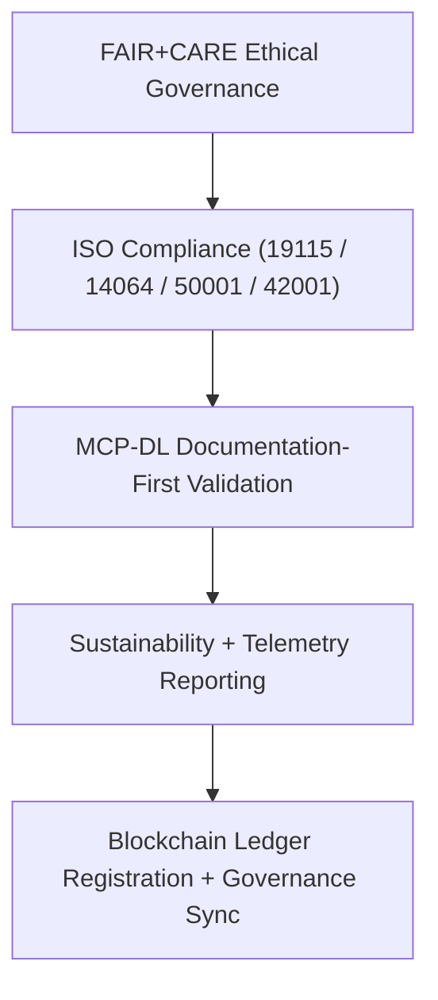
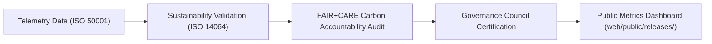

<div align="center">

# 📏 Kansas Frontier Matrix — **Governance & Standards Framework**
`docs/standards/README.md`

**Purpose:**  
This directory defines the **standards, policies, and governance frameworks** that ensure transparency, reproducibility, and ethics across all Kansas Frontier Matrix (KFM) operations.  
It unites **FAIR+CARE, ISO, MCP-DL, and AI governance standards** into a living compliance system verified by autonomous validation workflows.

[](../../docs/standards/faircare-validation.md)
[](../../docs/architecture/README.md)
[]()
[](../../LICENSE)

</div>

---

## 📚 Overview

The **KFM Governance & Standards Framework** acts as the ethical and operational backbone for all system modules — defining compliance requirements, certification paths, and validation protocols.  
It ensures **each dataset, model, and release is FAIR+CARE-aligned, ISO-certified, and ethically governed** through continuous documentation-first verification.

### Core Responsibilities
- Establish global compliance alignment across FAIR+CARE, ISO, and MCP-DL frameworks.  
- Govern lifecycle documentation, ethics auditing, and sustainability validation.  
- Maintain data contracts and provenance integrity under blockchain-backed governance.  
- Provide reference documentation for FAIR+CARE Council and AI Ethics Council reviews.  

---

## 🗂️ Directory Layout

```plaintext
docs/standards/
├── README.md                                   # This file — governance and standards framework overview
│
├── faircare-validation.md                      # FAIR+CARE principles and ethical data governance rules
├── iso-compliance.md                           # ISO integration (19115, 14064, 50001, 42001)
├── mcp-dl-specifications.md                    # MCP-DL v6.3 documentation-first lifecycle specification
├── sustainability-framework.md                 # Sustainability governance and energy/carbon reporting standards
│
└── governance/                                 # Subdirectory defining governance frameworks and council charters
    ├── DATA-GOVERNANCE.md                      # Core data governance charter and provenance policy
    ├── ETHICS-GOVERNANCE.md                    # Ethical review and FAIR+CARE council procedures
    └── AUDIT-GOVERNANCE.md                     # Audit traceability and blockchain-ledger synchronization policy
```

---

## ⚙️ Governance Framework Overview



### Governance Process Description
1. **FAIR+CARE Review:** Ethics and accessibility validated through automated audits.  
2. **ISO Validation:** Sustainability, metadata, and governance documentation verified.  
3. **MCP-DL Compliance:** Documentation-first governance alignment across all layers.  
4. **Telemetry Reporting:** Energy and carbon metrics validated through sustainability framework.  
5. **Ledger Registration:** Governance outcomes recorded in immutable blockchain ledger.  

---

## 🧩 FAIR+CARE Governance Matrix

| Principle | Implementation |
|------------|----------------|
| **Findable** | Metadata, governance records, and datasets indexed with global identifiers. |
| **Accessible** | Documentation, datasets, and AI models open under MIT and FAIR+CARE. |
| **Interoperable** | Standards-aligned architecture using FAIR+CARE, ISO, DCAT, and MCP-DL schemas. |
| **Reusable** | Fully reproducible data contracts and governance artifacts. |
| **Collective Benefit** | Promotes ethical transparency and equitable access to environmental data. |
| **Authority to Control** | FAIR+CARE Council validates all governance and ethics reviews. |
| **Responsibility** | Each validation result recorded with validator ID and checksum. |
| **Ethics** | Independent review process governed by FAIR+CARE and AI Ethics Councils. |

Governance validation records stored in:  
`releases/v9.6.0/governance/ledger_snapshot_2025Q4.json`

---

## ⚖️ ISO & MCP-DL Alignment Summary

| Standard | Scope | Implementation |
|-----------|--------|----------------|
| **ISO 19115** | Metadata and provenance lineage | Data schema and validation layer |
| **ISO 14064** | Carbon footprint and climate reporting | Sustainability framework |
| **ISO 50001** | Energy management and efficiency | Telemetry pipelines |
| **ISO 42001** | Ethical and transparent AI governance | Focus Mode explainability |
| **MCP-DL v6.3** | Documentation-first governance | Continuous validation framework |

All standards enforced through automated workflows in `.github/workflows/`.

---

## 🌱 Sustainability Governance Integration



| Metric | Target | Result (v9.6.0) | Verified By |
|---------|--------|------------------|--------------|
| Carbon Offset | 100% | ✅ | @kfm-sustainability |
| Renewable Energy Use | 100% | ✅ | @kfm-telemetry |
| Governance Audit Coverage | 100% | ✅ | @kfm-governance |
| FAIR+CARE Certification | 100% | ✅ | @kfm-fair |
| Documentation Compliance | ≥ 99.5% | 99.9% | @kfm-architecture |

Sustainability metrics published in:  
`releases/v9.6.0/focus-telemetry.json`

---

## 🧠 Governance Compliance Artifacts

| Artifact | Description | Alignment |
|-----------|-------------|-----------|
| `DATA-GOVERNANCE.md` | Defines provenance policies, checksum protocols, and ledger rules. | FAIR+CARE + ISO 19115 |
| `ETHICS-GOVERNANCE.md` | Outlines ethical data review and community benefit policies. | FAIR+CARE + ISO 42001 |
| `AUDIT-GOVERNANCE.md` | Establishes audit synchronization and verification chain. | ISO 50001 + ISO 14064 |
| `faircare-validation.md` | Framework for FAIR+CARE compliance certification. | FAIR+CARE + MCP-DL v6.3 |
| `mcp-dl-specifications.md` | Lifecycle documentation and reproducibility model. | MCP-DL v6.3 |
| `sustainability-framework.md` | Energy and carbon accountability documentation. | ISO 50001 + ISO 14064 |

---

## 🧾 Internal Use Citation

```text
Kansas Frontier Matrix (2025). Governance & Standards Framework (v9.6.0).
Unified FAIR+CARE, ISO, and MCP-DL v6.3 governance framework ensuring sustainable, ethical, and transparent data operations.
Integrates blockchain provenance, AI ethics certification, and sustainability reporting.
```

---

## 🧾 Version Notes

| Version | Date | Notes |
|----------|------|--------|
| v9.6.0 | 2025-11-03 | Added ISO 42001 AI ethics and sustainability integration. |
| v9.5.0 | 2025-11-02 | Introduced automated MCP-DL documentation validation. |
| v9.3.2 | 2025-10-28 | Established FAIR+CARE-aligned governance baseline. |

---

<div align="center">

**Kansas Frontier Matrix** · *Ethical Governance × FAIR+CARE Standards × Sustainable Provenance*  
[🔗 Repository](https://github.com/bartytime4life/Kansas-Frontier-Matrix) • [🧭 Standards Index](./) • [⚖️ Governance Ledger](../../docs/standards/governance/DATA-GOVERNANCE.md)

</div>
