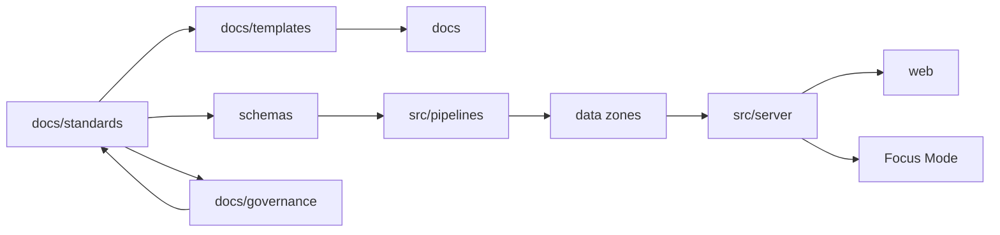

<!-- [KFM_META_BLOCK_V2]
doc_id: kfm://doc/5bb62de2-4e6f-4723-9cc2-2fee8419b5b3
title: docs/standards README
type: standard
version: v1
status: draft
owners: Standards WG (TBD)
created: 2026-02-24
updated: 2026-02-24
policy_label: public
related:
  - ../MASTER_GUIDE_v13.md
  - ../governance/REVIEW_GATES.md
  - ./KFM_REPO_STRUCTURE_STANDARD.md
tags: [kfm, standards]
notes:
  - Entry point for governed standards and profiles.
  - Update owners/links when repo governance roles are finalized.
[/KFM_META_BLOCK_V2] -->

# docs/standards
Governed standards, profiles, and protocols that constrain **how KFM artifacts are authored, validated, and promoted**.


<!-- TODO: Replace badges with repo-specific CI/status badges once paths are known -->

**Owners:** Standards WG (TBD)  
**Applies to:** docs, templates, schemas, dataset specs, run receipts, story nodes, governed APIs

---

## Quick navigation
- [Purpose](#purpose)
- [How this fits in the repo](#how-this-fits-in-the-repo)
- [Standards registry](#standards-registry)
- [Directory layout](#directory-layout)
- [How to use these standards](#how-to-use-these-standards)
- [Adding or updating a standard](#adding-or-updating-a-standard)
- [Governance and review](#governance-and-review)
- [Appendix](#appendix)

---

> [!WARNING]
> Standards are **normative**. Changes here can break pipelines, schemas/contracts, and governed outputs.
> Follow the repo’s review gates before merging changes.

---

## Purpose
This directory exists to:
- Define **canonical formats** (e.g., metadata profiles) used across KFM.
- Reduce “repo drift” by giving every subsystem a single, governed source of truth.
- Provide **profiles** (STAC/DCAT/PROV) and other protocols that downstream systems can validate against.
- Keep claims, provenance, and policy controls **machine-checkable**.

---

## How this fits in the repo
Standards are one layer of the trust membrane:



**Rule of thumb:**  
- Use **standards** when defining “what is allowed/required” across the system.  
- Use **templates** when providing “how to author” repeatable documents that must comply with standards.

---

## Standards registry
> [!NOTE]
> This table is intended to mirror the **v13 documentation map**. If any link is missing in your branch, update the registry (or update the repo to match the standard layout).

| Standard | What it governs | Primary consumers | Status |
|---|---|---|---|
| [`KFM_MARKDOWN_WORK_PROTOCOL.md`](./KFM_MARKDOWN_WORK_PROTOCOL.md) | Markdown authoring conventions for governed docs | docs authors, reviewers, tooling | TBD |
| [`KFM_REPO_STRUCTURE_STANDARD.md`](./KFM_REPO_STRUCTURE_STANDARD.md) | Canonical repo layout + where artifacts belong | all contributors, CI, tooling | TBD |
| [`KFM_STAC_PROFILE.md`](./KFM_STAC_PROFILE.md) | KFM metadata profile for STAC (structure + required fields) | data catalog, ingestion pipelines | TBD |
| [`KFM_DCAT_PROFILE.md`](./KFM_DCAT_PROFILE.md) | KFM metadata profile for DCAT | publishing layer, catalogs, policy boundary | TBD |
| [`KFM_PROV_PROFILE.md`](./KFM_PROV_PROFILE.md) | KFM provenance profile for PROV (lineage + transform tracing) | pipelines, audit, Focus Mode citations | TBD |

---

## Directory layout
```text
docs/standards/
├── README.md
├── KFM_MARKDOWN_WORK_PROTOCOL.md
├── KFM_REPO_STRUCTURE_STANDARD.md
├── KFM_STAC_PROFILE.md
├── KFM_DCAT_PROFILE.md
└── KFM_PROV_PROFILE.md
```

### Acceptable inputs
This directory is the canonical home for:
- **Profiles** (STAC/DCAT/PROV) and validation rules
- **Authoring protocols** (markdown/document conventions)
- **Repo structure standards**
- **Ontology / controlled vocabulary protocols** (when applicable)

### Exclusions
Do **not** put these here:
- One-off design documents or proposals (use `docs/architecture/` or ADRs)
- Story content (use `docs/reports/story_nodes/`)
- Source code (use `src/`)
- Schemas themselves (use `schemas/`), unless a standard explicitly *is* the schema

---

## How to use these standards
1. **Start from the governing standard**
   - Example: writing a dataset spec or profile? Start with the relevant profile in this directory.
2. **Use templates for authoring**
   - If there’s a template in `docs/templates/`, author via the template and ensure compliance here.
3. **Validate early**
   - Add/extend checks so CI can fail closed when a standard is violated (preferred over manual policing).
4. **Prefer additive change**
   - Add a new version or an extension before breaking existing contracts.

---

## Adding or updating a standard
### Minimum checklist
- [ ] Document includes a MetaBlock v2 header (see appendix) with correct `policy_label`
- [ ] Standard clearly states its **scope** and **non-goals**
- [ ] Standard includes **examples** (good + bad) where practical
- [ ] Change includes **migration guidance** if it breaks consumers
- [ ] CI/tooling hooks are updated (or a TODO is filed with an owner)

### Suggested PR structure
- **What changed:** short summary  
- **Why:** rationale + tradeoffs  
- **Blast radius:** what systems need to be retested  
- **Verification:** commands or steps to confirm compliance  
- **Governance:** policy implications, sensitivity/sovereignty impact (if any)

---

## Governance and review
Standards should be reviewed with extra rigor because they:
- influence validation/promotion gates,
- affect how policy is enforced,
- may change what becomes publishable.

**When in doubt:** default-deny (tighten constraints), then explicitly loosen with rationale.

---

## Appendix
### MetaBlock v2 reminder
KFM docs use **MetaBlock v2** for structured metadata (instead of YAML frontmatter). Copy/paste and fill:

```text
<!-- [KFM_META_BLOCK_V2]
doc_id: kfm://doc/<uuid>
title: <Title>
type: standard
version: v1
status: draft|review|published
owners: <team or names>
created: YYYY-MM-DD
updated: YYYY-MM-DD
policy_label: public|restricted|...
related:
  - <paths or kfm:// ids>
tags: [kfm]
notes:
  - <short notes>
[/KFM_META_BLOCK_V2] -->
```

---

<p align="right"><a href="#docsstandards">Back to top</a></p>
