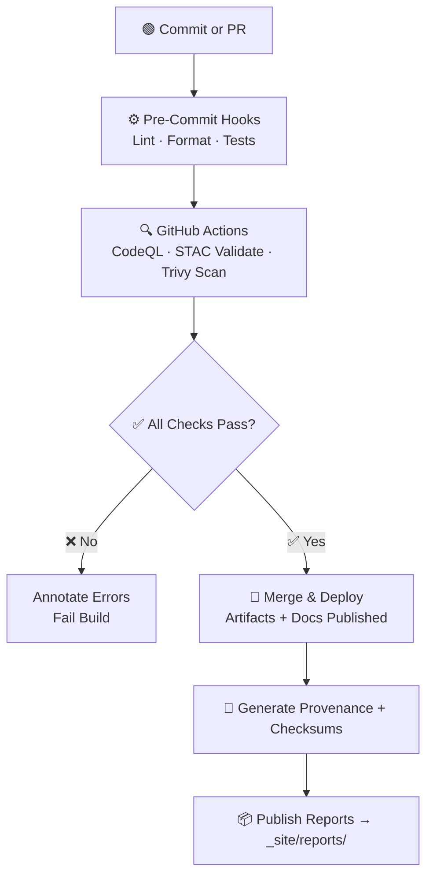

<div align="center">

# 📐 Kansas Frontier Matrix — **Standards & Governance**
`docs/standards/README.md`

**Mission:** Define, enforce, and version **project-wide technical, scientific, and documentation standards** for  
the **Kansas Frontier Matrix (KFM)** — ensuring **clarity**, **reproducibility**, **interoperability**, and **long-term integrity**  
across every dataset, model, pipeline, and interface under the **Master Coder Protocol (MCP)**.

</div>
[](../../.github/workflows/site.yml)
[](../../.github/workflows/stac-validate.yml)
[](../../.github/workflows/codeql.yml)
[](../../.github/workflows/trivy.yml)
[](../../.github/workflows/pre-commit.yml)
[](../../docs/)
[](https://www.go-fair.org/fair-principles/)
[](../../LICENSE)

---

title: "📐 Kansas Frontier Matrix — Standards & Governance"
document_type: "README"
version: "v2.6.4"
last_updated: "2025-10-17"
created: "2024-11-02"
owners: ["@kfm-architecture", "@kfm-data", "@kfm-security"]
maturity: "Production"
status: "Stable"
tags: ["standards","governance","mcp","fair","stac","security","ontology","documentation"]
license: "CC-BY 4.0"
semantic_alignment:
  - FAIR Principles
  - STAC 1.0.x
  - DCAT 3.0
  - CIDOC CRM
  - OWL-Time
  - W3C PROV-O
provenance:
  workflow_pin_policy: "actions pinned by tag or SHA"
  artifact_retention_days: 90

---


---

## 🎯 Purpose

The `/docs/standards/` directory defines the **technical, semantic, and operational standards** that guarantee  
the Kansas Frontier Matrix ecosystem remains **auditable**, **reproducible**, and **semantically interoperable**  
under the **FAIR Data Principles** and **MCP-DL v6.2** governance framework.

**These standards ensure that:**

- Every dataset adheres to a consistent schema and provenance model.  
- Every workflow is deterministic, logged, and validated in CI/CD.  
- Every contributor follows unified code, metadata, and documentation practices.  
- Every artifact — dataset, model, or document — is **traceable from source to publication**.

---

## 📚 Directory Layout

```bash
docs/standards/
├── README.md            # Index (this file)
├── coding.md            # Code style & language standards
├── data-formats.md      # Data model, encoding, and file-format standards
├── metadata.md          # Metadata models (STAC, DCAT, schema.org)
├── ontologies.md        # Semantic layer: CIDOC CRM, OWL-Time, PeriodO
├── testing.md           # Unit, integration, and validation test standards
├── security.md          # Security, compliance, and license scanning
└── documentation.md     # README, ADR, and MCP documentation conventions
```

---

## 🧱 Core Standard Categories

### 🧮 Coding Standards

- **Python:** PEP 8 compliant · formatted with **Black** · linted with **Ruff** · tested with **pytest**  
- **JavaScript / TypeScript:** ES6+ · **Prettier** + **ESLint** · React 18+ modular components  
- **CSS:** **BEM** naming · design tokens (`:root` variables)  
- **Documentation in Code:**  
  - Python → docstrings (Google / reST)  
  - JS → JSDoc format  
  - YAML → inline comments for pipeline configuration  

📄 Reference → [`coding.md`](coding.md)

---

### 🌍 Data & File Formats

| Type | Format | Specification | Notes |
| :-- | :-- | :-- | :-- |
| **Vector** | GeoJSON | RFC 7946 | UTF-8 · WGS-84 (EPSG:4326) |
| **Raster** | COG (GeoTIFF) | GDAL ≥ 3.8 | Internal overviews · tiled · compressed |
| **Tabular** | CSV + schema.json | RFC 4180 / CSVW | Units and datatypes declared |
| **Metadata** | JSON / YAML | JSON Schema Draft-07 | Auto-validated in CI |
| **Checksums** | .sha256 | NIST SHA-256 | File integrity verification |
| **Archive** | .zip / .tar.gz | Reproducible build | Versioned release packages |

📘 Reference → [`data-formats.md`](data-formats.md)

---

### 🗂️ Metadata & Ontologies

- **STAC 1.0.0** — Spatiotemporal catalogs for geospatial layers  
- **DCAT 3.0** — Dataset-level metadata for discoverability  
- **Schema.org** — Semantic web indexing  
- **CIDOC CRM** — Cultural-heritage ontology (events, actors, artifacts)  
- **OWL-Time** — Temporal reasoning and interval logic  
- **PeriodO** — Historical period alignment  

📗 Reference → [`metadata.md`](metadata.md), [`ontologies.md`](ontologies.md)

---

### 🧪 Testing & CI/CD Standards

All pipelines and code must pass **validation gates** before merge or release.

| Stage | Validation | Workflow |
| :-- | :-- | :-- |
| **Code Quality** | Lint + Security | `pre-commit.yml`, CodeQL |
| **Data Validation** | Schema + STAC | `stac-validate.yml` |
| **Security Scans** | Vulnerabilities | Trivy · Dependabot |
| **Checksums** | File Integrity | `checksums.yml` |
| **Docs** | Completeness & Links | `docs-validator.yml` |

📕 Reference → [`testing.md`](testing.md)

---

### 🔒 Security & Compliance

- Dependencies scanned with **Trivy** & **CodeQL**  
- Containers include **SBOMs (Software Bill of Materials)**  
- Licenses validated for open-source compliance  
- Secrets managed with **least privilege**  
- Workflows optionally signed via **Sigstore / SLSA**  

📙 Reference → [`security.md`](security.md)

---

### 🧭 Documentation & Governance Rules

Each directory **must include** a `README.md` defining purpose, usage, dependencies, and version metadata.  

**Additional rules**

- Templates → MCP-DL (`experiment`, `model_card`, `sop`, `provenance`)  
- Design Decisions → record ADRs in `/docs/adr/`  
- Glossary → maintain `/docs/glossary.md`  
- Licensing → Code = MIT · Data = CC-BY 4.0 · Docs = CC-BY 4.0  

📒 Reference → [`documentation.md`](documentation.md)

---

### 🧩 Governance & Quality Gates

All merges to `main` must pass:  

✅ STAC Validation ✅ Checksum Verification ✅ Lint + Tests ✅ Security Scans ✅ Docs Validation  

> **Governance Review:** Major releases approved by the **Data Governance Committee** for full MCP & FAIR compliance.

---

## 🧠 Usage Guidelines

1. **Before coding** → review `coding.md`  
2. **Before adding data** → check `data-formats.md`, `metadata.md`  
3. **Before merging** → run schema + checksum + STAC checks  
4. **Before publishing** → update provenance & experiment records  
5. **For contributors** → follow `documentation.md` for style & structure  

---

## 🧬 FAIR & MCP Alignment

| Framework | Alignment | Description |
| :-- | :-- | :-- |
| **FAIR Principles** | ✅ | Findable · Accessible · Interoperable · Reusable |
| **STAC 1.0** | ✅ | Geospatial asset catalog compliance |
| **DCAT 3.0** | ✅ | Dataset-level metadata exchange |
| **CIDOC CRM** | ✅ | Cultural heritage ontology |
| **MCP-DL v6.2** | ✅ | Documentation-First · Reproducible · Auditable |

---

## 📊 CI/CD Workflow Summary



---

## 🧾 Version & Provenance Metadata

| Field | Value |
| :-- | :-- |
| **Version** | v2.6.4 |
| **Last Updated** | 2025-10-17 |
| **Maturity** | Production |
| **Owners** | @kfm-architecture · @kfm-data · @kfm-security |
| **Provenance Policy** | Pinned workflows · 90-day retention |
| **License** | CC-BY 4.0 |
| **Compliance** | FAIR · STAC · MCP-DL v6.2 |

---

<div align="center">

> 📜 **“Standards are the architecture of reproducibility.”**  
> Each commit, dataset, and model must conform to these standards — ensuring KFM remains  
> **transparent, verifiable, and interoperable for decades to come.**

**Kansas Frontier Matrix** — *Every Line Tested. Every Dataset Traceable.*  
📍 [`docs/standards/README.md`](.) · Master repository for KFM-wide standards & governance  

</div>
