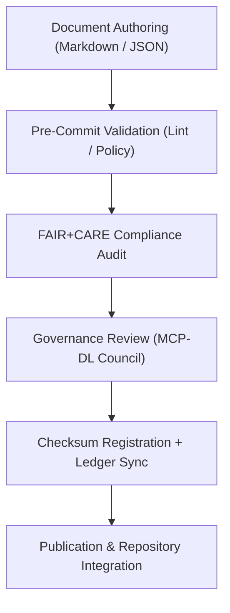

<div align="center">

# 📏 **Kansas Frontier Matrix — Documentation & Governance Standards (v2.1.1 · Tier-Ω+∞ Certified)**  
`docs/standards/README.md`

**Mission:** Define, maintain, and govern the **documentation, validation, and compliance standards**  
for the **Kansas Frontier Matrix (KFM)** — ensuring reproducibility, accessibility, and ethical alignment  
under the FAIR+CARE and Master Coder Protocol (MCP-DL v6.4.3).

[](../../docs/)
[](../../docs/standards/faircare-validation.md)
[](../../data/reports/audit/data_provenance_ledger.json)
[](../../LICENSE)

</div>

---

## 📚 Overview

The **Documentation & Governance Standards** define how all text, metadata, and architecture records in KFM  
are created, reviewed, and validated. These standards ensure that every file — from markdown to metadata JSON —  
remains transparent, FAIR+CARE aligned, and machine-verifiable.

All standards adhere to **MCP-DL reproducibility** and are enforced via CI/CD workflows and the governance ledger.

---

## 🗂️ Directory Layout

```bash
docs/standards/
├── README.md                             # This file — standards and governance overview
├── markdown_rules.md                     # Formatting and syntax standards for documentation
├── markdown_guide.md                     # Writing and accessibility guidelines
├── metadata-standards.md                 # JSON / STAC / DCAT schema conventions
├── naming-conventions.md                 # File and dataset naming guidelines
├── validation-protocols.md               # Documentation and CI/CD validation pipelines
└── governance/                           # Governance and ethics documentation
    ├── ROOT-GOVERNANCE.md
    ├── FAIRCARE-GOVERNANCE.md
    └── SECURITY-GOVERNANCE.md
```

---

## ⚙️ Documentation Governance Model


<!-- END OF MERMAID -->

---

## 🧱 Core Standards Overview

| Standard | Description | Maintained By | Validation Workflow |
|:--|:--|:--|:--|
| **Markdown Rules** | Consistent structure, metadata, and frontmatter. | @kfm-docs | `docs-validate.yml` |
| **Metadata Standards** | JSON-LD / STAC / DCAT schema validation. | @kfm-data | `stac-validate.yml` |
| **Naming Conventions** | File and dataset naming policies. | @kfm-architecture | `policy-check.yml` |
| **Validation Protocols** | CI/CD enforcement for FAIR+CARE alignment. | @kfm-governance | `governance-ledger.yml` |
| **Accessibility (WCAG)** | Ensures readable and inclusive documentation. | @kfm-accessibility | `docs-validate.yml` |

---

## 🧩 FAIR + CARE in Documentation

| Principle | Implementation | Validation |
|:--|:--|:--|
| **Findable** | All docs indexed in manifest and governance ledger. | `releases/v*/manifest.zip` |
| **Accessible** | Markdown follows accessibility best practices (WCAG 2.1). | CI Accessibility Audit |
| **Interoperable** | Uses open schemas and standardized metadata. | JSON Schema Validation |
| **Reusable** | Version-controlled documentation with license metadata. | Policy Check Workflow |
| **Collective Benefit (CARE)** | Promotes transparency and equitable governance. | FAIR+CARE Audit Reports |

---

## 🔍 Documentation Validation Workflows

| Workflow | Function | Output |
|:--|:--|:--|
| `docs-validate.yml` | Validates markdown syntax, links, and frontmatter. | `reports/validation/docs_validation.json` |
| `policy-check.yml` | Ensures license and compliance metadata completeness. | `reports/audit/policy_check.json` |
| `faircare-validate.yml` | Runs FAIR+CARE alignment and ethics review. | `reports/fair/data_care_assessment.json` |
| `governance-ledger.yml` | Logs documentation checksums and provenance data. | `data/reports/audit/data_provenance_ledger.json` |

---

## 🧠 Documentation Quality Index (DQI)

| Metric | Description | Target | Monitored By |
|:--|:--|:--:|:--|
| **frontmatter_coverage** | % of docs with valid metadata. | 100% | `docs-validate.yml` |
| **link_integrity** | % of working internal/external links. | 100% | `policy-check.yml` |
| **diagram_parse_rate** | % of valid Mermaid diagrams. | 100% | `docs-validate.yml` |
| **a11y_compliance_score** | WCAG 2.1 AA accessibility score. | ≥ 95 | @kfm-accessibility |
| **faircare_score** | FAIR+CARE governance compliance score. | ≥ 95 | @kfm-governance |

---

## 🧾 Governance & Provenance Integration

| Artifact | Purpose | Repository Path |
|:--|:--|:--|
| **Governance Ledger** | Registers documentation checksums and authorship. | `data/reports/audit/data_provenance_ledger.json` |
| **FAIR+CARE Audit Reports** | Documents ethical compliance for all docs. | `data/reports/fair/data_care_assessment.json` |
| **Manifest.zip** | Versioned registry of all documentation and data assets. | `releases/v*/manifest.zip` |
| **Security Governance** | Enforces documentation access control and privacy. | `docs/standards/governance/SECURITY-GOVERNANCE.md` |

---

## 🧾 Version History

| Version | Date | Author | Summary |
|:--|:--|:--|:--|
| **v2.1.1** | 2025-11-16 | @kfm-docs | Standardized standards directory; added FAIR+CARE mapping and documentation quality metrics. |
| v2.0.0 | 2025-10-25 | @kfm-governance | Added accessibility integration and CI validation tables. |
| v1.0.0 | 2025-10-04 | @kfm-architecture | Initial documentation standards and governance definitions. |

---

<div align="center">

**Kansas Frontier Matrix © 2025**  
*“Standards Preserve Integrity — Documentation Preserves Provenance.”*  
📍 `docs/standards/README.md` — Central documentation standards and governance reference for the Kansas Frontier Matrix.

</div>
