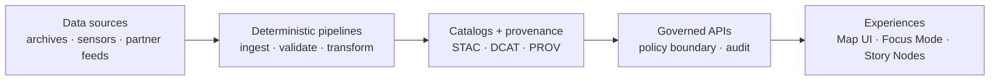

# KFM Standards (docs/standards/)


This folder is the **canonical home for KFM’s governed standards and profiles**: metadata profiles (STAC/DCAT/PROV), deterministic identity rules, publish-format policies, and doc protocols that keep the system **auditable, interoperable, and safe to share**.

> [!IMPORTANT]
> **Changes here are production changes.** These standards shape what can be ingested, validated, promoted, served through governed APIs, and shown in **Focus Mode / Story Nodes**. Expect strict review + CI gates.

---

## Contents

- [What lives here](#what-lives-here)
- [How standards fit into the KFM “Truth Path”](#how-standards-fit-into-the-kfm-truth-path)
- [Non-negotiable invariants](#non-negotiable-invariants)
- [Standards inventory](#standards-inventory)
- [Data formats policy](#data-formats-policy)
- [Change control](#change-control)
- [Validation expectations](#validation-expectations)
- [Glossary](#glossary)
- [See also](#see-also)

---

## What lives here

**docs/standards/** exists to keep KFM machine-checkable and governance-aligned. It is where we define:

- **Metadata profiles** (KFM-flavored constraints on open standards)
- **Deterministic identity** and canonicalization rules
- **Publishable formats** for processed data products
- **Documentation protocols** (so docs are lintable + render reliably)
- **Interoperability guardrails** (so partners can consume KFM outputs safely)

### Directory layout

```text
docs/standards/
├── README.md
├── KFM_DCAT_PROFILE.md
├── KFM_STAC_PROFILE.md
├── KFM_PROV_PROFILE.md
├── KFM_MARKDOWN_WORK_PROTOCOL.md
└── kfm-mdp-enforcement.md
```

> [!NOTE]
> If your repo has additional standards files (e.g., ontology rules, ID registries, schema conventions), list them in the [Standards inventory](#standards-inventory) table below so this README stays a reliable index.

---

## How standards fit into the KFM “Truth Path”

Standards are the **governed contracts** that sit between pipelines and everything downstream.



When the standards are correct **and enforced**, KFM can reliably answer: **“How do we know?”** for any map layer, statistic, or narrative claim.

---

## Non-negotiable invariants

These are the “guardrails” that standards must preserve:

1) **Evidence-first outputs**  
   Anything shipped to UI/narratives must be traceable to approved sources and transformations.

2) **Trust membrane**  
   Frontends/clients **never** access storage directly. All access goes through governed APIs + policy checks.

3) **Fail-closed promotion**  
   If required metadata/provenance/policy checks are missing, promotion is blocked (default-deny posture).

4) **Deterministic identity + reproducibility**  
   The same inputs + config must yield the same IDs and artifacts. Canonicalization rules exist to make “same JSON” truly the same.

5) **FAIR + CARE and sensitivity handling**  
   Licensing, authority-to-control, culturally restricted knowledge, and sensitive locations are treated as system rules; outputs may require redaction/generalization and governance review.

---

## Standards inventory

| Standard / Rule | File | What it governs | Primary consumers |
|---|---|---|---|
| KFM DCAT Profile | [`KFM_DCAT_PROFILE.md`](./KFM_DCAT_PROFILE.md) | Dataset/distribution catalog metadata interoperability | Catalog emitters, portals, discovery UX |
| KFM STAC Profile | [`KFM_STAC_PROFILE.md`](./KFM_STAC_PROFILE.md) | Spatiotemporal asset metadata + discovery | Pipelines emitting assets, map/timeline UX |
| KFM PROV Profile | [`KFM_PROV_PROFILE.md`](./KFM_PROV_PROFILE.md) | Lineage/run records and “how do we know?” links | Pipelines, evidence resolver, audit UX |
| Markdown work protocol | [`KFM_MARKDOWN_WORK_PROTOCOL.md`](./KFM_MARKDOWN_WORK_PROTOCOL.md) | How we write governed docs (templates, headings, link discipline) | All contributors, docs tooling |
| Markdown enforcement pack | [`kfm-mdp-enforcement.md`](./kfm-mdp-enforcement.md) | CI/pre-commit rules to prevent doc drift and rendering failures | CI, maintainers |

> [!TIP]
> Keep this table short and **link-first**. Deep details belong in the standard documents themselves; this README is the hub.

---

## Data formats policy

KFM favors a small set of formats to keep outputs interoperable, fast, and validation-friendly.

| Lifecycle stage | Intended use | Preferred formats | Notes |
|---|---|---|---|
| Raw (`data/raw/`) | Immutable source snapshots | Original source formats | Preserve as-acquired for audit/reprocessing |
| Work (`data/work/`) | Reproducible intermediates / debugging | GeoJSON (vectors), Parquet (tables) | Not for publication; keep regenerable |
| Processed (`data/processed/`) | Canonical publishable artifacts | GeoParquet (vectors/tables), COG (rasters) | Must be schema-validated + cataloged |

> [!IMPORTANT]
> “Processed” outputs are **not publishable** unless they have valid STAC/DCAT/PROV artifacts and pass governance gates.

---

## Change control

### When you must update standards

Update (or add) a standard when you introduce:
- a new data domain with different metadata needs,
- a new pipeline artifact type (e.g., raster → vector conversion),
- a change in provenance granularity (e.g., per-tile → per-run),
- a new policy requirement (licensing, sensitivity, community authority),
- a breaking change to an API contract that depends on catalogs/provenance.

### Required elements of a standards change PR

Use this checklist as a **minimum**:

- [ ] Clear scope: what behavior changes and what stays invariant
- [ ] Versioning: bump profile version if the change is breaking
- [ ] Compatibility notes: who/what needs migration and why
- [ ] Validation updates: schemas/tests/gates updated alongside docs
- [ ] Example artifacts: at least one “good” example and one “rejected” example
- [ ] Governance notes: FAIR/CARE + sensitivity implications are stated

> [!WARNING]
> If a standards change can affect sensitive/culturally restricted content handling, treat it as **governance-critical** and require explicit reviewer sign-off.

---

## Validation expectations

Standards are only real when they are enforced.

Typical enforcement points include:

- **Catalog QA**: schema checks for STAC/DCAT, link integrity, required license/provider fields
- **Policy-as-code**: default-deny checks (e.g., sensitivity gates) enforced in CI and at runtime
- **Doc protocol enforcement**: linting rules so docs remain machine-ingestible and render-safe

> [!NOTE]
> The exact commands and CI wiring live in the validation tools and workflow configs. This README is intentionally command-light to avoid drift.

---

## Glossary

- **STAC**: Spatiotemporal Asset Catalog metadata standard for geospatial assets and discovery.
- **DCAT**: W3C Data Catalog Vocabulary for interoperable dataset/distribution metadata.
- **PROV**: W3C provenance model for lineage: entities, activities, agents, and how outputs were derived.
- **Evidence artifact**: A derived data product registered in catalogs (STAC/DCAT) with lineage (PROV) before it can be used in UI/narratives.
- **Trust membrane**: A hard boundary: external clients and UIs interact only via governed APIs; no direct storage access.
- **Fail-closed**: Missing required metadata/provenance/policy inputs → block promotion (default-deny).

---

## See also

- [`docs/templates/`](../templates/) — governed doc templates (Universal Doc, Story Node, API contract extensions)
- [`docs/governance/`](../governance/) — FAIR/CARE, sovereignty, review gates
- KFM architecture and repository guide(s) in `docs/` (Master Guide / blueprints)

---
