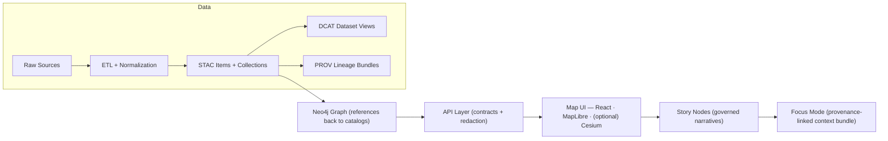

# 🧱 Standards Hub (docs/standards)

This folder is the **single source of truth** for KFM’s “how we do things” rules that must remain:
- ✅ **Machine-checkable** (schemas, profiles, contracts, policies)
- ✅ **Human-readable** (protocols, conventions, definition-of-done checklists)
- ✅ **Governed** (changes reviewed, versioned, and enforced through CI)

KFM treats key specs as **contract artifacts** (schemas/specs) and treats derived outputs as **evidence artifacts** that must be cataloged and provenance-linked before they can be used downstream.  [oai_citation:2‡MARKDOWN_GUIDE_v13.md.gdoc](file-service://file-UYVruFXfueR8veHMUKeugU)

---

## 🧭 Table of contents

- [📌 What belongs in this folder](#-what-belongs-in-this-folder)
- [🚦 Non-negotiables](#-non-negotiables)
- [🗺️ Canonical pipeline and “boundary artifacts”](#️-canonical-pipeline-and-boundary-artifacts)
- [🌐 STAC + DCAT + PROV alignment](#-stac--dcat--prov-alignment)
- [🧬 Versioning rules](#-versioning-rules)
- [🧪 Validation and enforcement](#-validation-and-enforcement)
- [📝 Markdown protocol and document metadata](#-markdown-protocol-and-document-metadata)
- [🛠️ Adding or changing a standard](#️-adding-or-changing-a-standard)
- [✅ Definition of done](#-definition-of-done)
- [📚 Source docs](#-source-docs)

---

## 📌 What belongs in this folder

Standards live here when they meet at least one of these criteria:

- 📦 **Metadata profiles** (e.g., STAC/DCAT/PROV fields + constraints)
- 🧬 **Ontology / graph conventions** (labels, IDs, migration rules, constraints)
- 🔌 **API contracts** (OpenAPI / GraphQL schema rules and versioning)
- 🧾 **Documentation protocols** (front-matter requirements, required sections, citation rules)
- 🛡️ **Governance-adjacent rules** that are validated by CI (naming, classification tags, link requirements)

> If it can break downstream systems or governance when inconsistent, it belongs here as a **standard** (not tribal knowledge).  [oai_citation:3‡MARKDOWN_GUIDE_v13.md.gdoc](file-service://file-UYVruFXfueR8veHMUKeugU)

---

## 🚦 Non-negotiables

These invariants are **hard rules**. If you need to violate one, you don’t “work around it”—you propose a governed change with versioning + migration + approvals.

### 🔒 KFM invariants (must not regress)

- **Pipeline ordering is absolute:** `ETL → Catalogs (STAC/DCAT/PROV) → Graph → API → UI → Story Nodes → Focus Mode` (no stage can consume outputs that skipped prior checks).  [oai_citation:4‡MARKDOWN_GUIDE_v13.md.gdoc](file-service://file-UYVruFXfueR8veHMUKeugU)
- **API boundary rule:** the UI must **never** query Neo4j directly; all access must go through the governed API layer.  [oai_citation:5‡MARKDOWN_GUIDE_v13.md.gdoc](file-service://file-UYVruFXfueR8veHMUKeugU)
- **Provenance first:** all published data must be registered with provenance before graph/UI use (STAC/DCAT + PROV is a prerequisite).  [oai_citation:6‡MARKDOWN_GUIDE_v13.md.gdoc](file-service://file-UYVruFXfueR8veHMUKeugU)
- **Deterministic, idempotent ETL:** config-driven, repeatable outputs, fully logged, re-runnable without side effects.  [oai_citation:7‡MARKDOWN_GUIDE_v13.md.gdoc](file-service://file-UYVruFXfueR8veHMUKeugU)
- **Evidence-first narrative:** no unsourced narrative; every claim cites evidence; AI text must be identified + provenance/confidence-linked.  [oai_citation:8‡MARKDOWN_GUIDE_v13.md.gdoc](file-service://file-UYVruFXfueR8veHMUKeugU)
- **Sovereignty + classification propagation:** no output artifact can be less restricted than its inputs; sensitive locations may require UI safeguards (e.g., blurring/generalization).  [oai_citation:9‡MARKDOWN_GUIDE_v13.md.gdoc](file-service://file-UYVruFXfueR8veHMUKeugU)
- **Validation gates:** CI enforces these invariants; missing provenance, broken links, or sensitive leaks fail the build.  [oai_citation:10‡MARKDOWN_GUIDE_v13.md.gdoc](file-service://file-UYVruFXfueR8veHMUKeugU)

KFM’s blueprint also states a canonical flow like `Raw → Processed → Catalog/Prov → Database → API → UI`, and treats shortcuts as flawed unless proven otherwise.  [oai_citation:11‡Kansas Frontier Matrix (KFM) – Comprehensive Technical Blueprint.pdf](sediment://file_000000006dbc71f89a5094ce310a452d)

---

## 🗺️ Canonical pipeline and “boundary artifacts”

**Boundary artifacts** are the “handoff contracts” between stages. Data is not considered “published” until these exist.  [oai_citation:12‡MARKDOWN_GUIDE_v13.md.gdoc](file-service://file-UYVruFXfueR8veHMUKeugU)

### 🧩 High-level flow (reference)



(Every stage consumes the outputs of the previous stage to maintain traceability.)  [oai_citation:13‡MARKDOWN_GUIDE_v13.md.gdoc](file-service://file-UYVruFXfueR8veHMUKeugU)

### 🗂️ Required staging layout

All raw data goes into `data/raw/<domain>/`, intermediates into `data/work/<domain>/`, and final outputs into `data/processed/<domain>/`.  [oai_citation:14‡MARKDOWN_GUIDE_v13.md.gdoc](file-service://file-UYVruFXfueR8veHMUKeugU)

### 🤖 Evidence artifacts are “first-class datasets”

AI/analysis outputs must be stored in `data/processed/...`, cataloged (STAC/DCAT), and traced in PROV, and must only be exposed through governed APIs (no UI hardcoding).  [oai_citation:15‡MARKDOWN_GUIDE_v13.md.gdoc](file-service://file-UYVruFXfueR8veHMUKeugU)

---

## 🌐 STAC + DCAT + PROV alignment

### ✅ Required records (per dataset / evidence artifact)

Every new dataset or evidence artifact must have:
- **STAC Collection + Items** (asset description + spatial/temporal metadata)
- **DCAT Dataset entry** (catalog discovery: title, description, license, keywords, distributions)
- **PROV activity bundle** (lineage: sources, steps, agents, timestamps, configs/parameters)

These extend base standards via project-specific profile docs (including provenance refs + uncertainty indicators), and CI validates conformance.  [oai_citation:16‡MARKDOWN_GUIDE_v13.md.gdoc](file-service://file-UYVruFXfueR8veHMUKeugU)

### 🔗 Cross-layer linkage expectations

To keep catalogs/graph/narratives in sync, these cross-references must exist:
- **STAC Items → Data assets**: Items point to actual assets in stable storage and include attribution/license.  [oai_citation:17‡MARKDOWN_GUIDE_v13.md.gdoc](file-service://file-UYVruFXfueR8veHMUKeugU)
- **DCAT → STAC/distributions**: DCAT distributions link to STAC entries and/or direct downloads.  [oai_citation:18‡MARKDOWN_GUIDE_v13.md.gdoc](file-service://file-UYVruFXfueR8veHMUKeugU)
- **PROV end-to-end**: raw → work → processed with run/config identifiers (run ID or commit hash).  [oai_citation:19‡MARKDOWN_GUIDE_v13.md.gdoc](file-service://file-UYVruFXfueR8veHMUKeugU)
- **Graph references catalogs**: graph stores references (STAC IDs/DOIs), not bulky payloads.  [oai_citation:20‡MARKDOWN_GUIDE_v13.md.gdoc](file-service://file-UYVruFXfueR8veHMUKeugU)

---

## 🧬 Versioning rules

KFM versions both datasets and the overall system to ensure controlled evolution:

- 📦 **Dataset versioning:** new versions link to predecessors via DCAT/PROV (e.g., `prov:wasRevisionOf`), ideally with persistent identifiers (DOI/ARK).  [oai_citation:21‡MARKDOWN_GUIDE_v13.md.gdoc](file-service://file-UYVruFXfueR8veHMUKeugU)
- 🧠 **Graph/ontology versioning:** keep backward compatibility unless a migration is explicitly performed and documented.  [oai_citation:22‡MARKDOWN_GUIDE_v13.md.gdoc](file-service://file-UYVruFXfueR8veHMUKeugU)
- 🔌 **API versioning:** breaking changes require a new versioned endpoint or negotiation strategy; the OpenAPI/GraphQL contract is the contract.  [oai_citation:23‡MARKDOWN_GUIDE_v13.md.gdoc](file-service://file-UYVruFXfueR8veHMUKeugU)
- 🏷️ **Release versioning:** repository releases follow semantic versioning; major versions indicate structural changes; the Master Guide is updated with a changelog entry.  [oai_citation:24‡MARKDOWN_GUIDE_v13.md.gdoc](file-service://file-UYVruFXfueR8veHMUKeugU)

---

## 🧪 Validation and enforcement

KFM’s definition of “governed” is implemented as **CI gates** and **policy-as-code**.

### ✅ Minimum CI gates (examples)

CI checks include:
- 🧾 **Markdown protocol + front-matter validation** (missing front-matter/required sections fails build)  [oai_citation:25‡MARKDOWN_GUIDE_v13.md.gdoc](file-service://file-UYVruFXfueR8veHMUKeugU)
- 🔗 **Link/reference validation** (no broken internal links / unresolved citations)  [oai_citation:26‡MARKDOWN_GUIDE_v13.md.gdoc](file-service://file-UYVruFXfueR8veHMUKeugU)
- 📐 **Schema validation** for STAC/DCAT/PROV + Story Node structures  [oai_citation:27‡MARKDOWN_GUIDE_v13.md.gdoc](file-service://file-UYVruFXfueR8veHMUKeugU)
- 🕸️ **Graph integrity tests** (constraints, ontology regressions)  [oai_citation:28‡MARKDOWN_GUIDE_v13.md.gdoc](file-service://file-UYVruFXfueR8veHMUKeugU)
- 🧪 **API contract tests** + schema linting; breaking changes are blocked without proper versioning/tests  [oai_citation:29‡MARKDOWN_GUIDE_v13.md.gdoc](file-service://file-UYVruFXfueR8veHMUKeugU)
- 🛡️ **Security/governance scans**: secret scanning, PII/sensitive data scan, sensitive location checks, classification consistency checks  [oai_citation:30‡MARKDOWN_GUIDE_v13.md.gdoc](file-service://file-UYVruFXfueR8veHMUKeugU)

### 🛡️ Policy-as-code (OPA/Rego) + CI enforcement

The KFM blueprint describes governance rules stored in `policy/` as versioned “policy as code” (OPA/Rego), with CI running Conftest against changes to block non-compliant contributions (e.g., missing metadata/license/PROV).  [oai_citation:31‡Kansas Frontier Matrix (KFM) – Comprehensive Technical Blueprint.pdf](sediment://file_000000006dbc71f89a5094ce310a452d)

It also describes Conftest usage as a PR gate that can fail CI when policies are violated.  [oai_citation:32‡Kansas Frontier Matrix (KFM) – Comprehensive Technical Blueprint.pdf](sediment://file_000000006dbc71f89a5094ce310a452d) [oai_citation:33‡Kansas Frontier Matrix (KFM) – Comprehensive Technical Blueprint.pdf](sediment://file_000000006dbc71f89a5094ce310a452d)

> 🧠 Design intent: the UI is not allowed to bypass governance; access is mediated by the backend API, and runtime policy enforcement can deny or sanitize sensitive outputs.  [oai_citation:34‡Kansas Frontier Matrix (KFM) – Comprehensive Technical Blueprint.pdf](sediment://file_000000006dbc71f89a5094ce310a452d) [oai_citation:35‡Kansas Frontier Matrix (KFM) – Comprehensive Technical Blueprint.pdf](sediment://file_000000006dbc71f89a5094ce310a452d)

---

## 📝 Markdown protocol and document metadata

### 🧾 Front-matter is not optional

KFM validates docs for correct YAML front-matter and required sections; broken front-matter or missing required sections fails the build.  [oai_citation:36‡MARKDOWN_GUIDE_v13.md.gdoc](file-service://file-UYVruFXfueR8veHMUKeugU)

A KFM-inspired pattern includes structured metadata (status, governance refs, FAIR/CARE tags, etc.).  [oai_citation:37‡Comprehensive Markdown Guide_ Syntax, Extensions, and Best Practices.docx](file-service://file-J6rFRcp4ExCCeCdTevQjxz)

### 🪶 CARE labels & sensitive handling

When content requires special handling, front-matter can include fields like `care_label` to trigger extra review (e.g., “Restricted · Tribal Sensitive”), and CI can enforce approvals based on that label.  [oai_citation:38‡Comprehensive Markdown Guide_ Syntax, Extensions, and Best Practices.docx](file-service://file-J6rFRcp4ExCCeCdTevQjxz)

---

## 🛠️ Adding or changing a standard

### 🧩 Standard types (common patterns)

- 📘 **Protocol** (human + machine governance): naming rules, required sections, review triggers
- 📦 **Profile** (data contracts): required fields + JSON Schema for validation
- 🔌 **Contract** (API/graph): OpenAPI/GraphQL/ontology constraints + migration rules
- 🛡️ **Policy** (enforcement): OPA/Rego rules + Conftest tests + runtime enforcement hooks

### 🧑‍💻 Contribution expectations (code + docs)

Master protocol guidance for quality includes:
- consistent coding style + linting/formatting in CI (e.g., black/flake8 for Python; eslint/prettier for JS)  [oai_citation:39‡Scientific Method _ Research _ Master Coder Protocol Documentation.pdf](file-service://file-HTpax4QbDgguDwxwwyiS32) [oai_citation:40‡Kansas Frontier Matrix (KFM) – Comprehensive Technical Blueprint.pdf](sediment://file_000000006dbc71f89a5094ce310a452d)
- PR-based peer review + checklists (style compliance, tests, clarity, reproducibility)  [oai_citation:41‡Scientific Method _ Research _ Master Coder Protocol Documentation.pdf](file-service://file-HTpax4QbDgguDwxwwyiS32)
- automated tests + CI must be green before merge  [oai_citation:42‡Scientific Method _ Research _ Master Coder Protocol Documentation.pdf](file-service://file-HTpax4QbDgguDwxwwyiS32)
- “living documentation” updated alongside code changes  [oai_citation:43‡Scientific Method _ Research _ Master Coder Protocol Documentation.pdf](file-service://file-HTpax4QbDgguDwxwwyiS32)

### 🧭 Recommended workflow

1. 📝 Draft the standard as a Markdown doc (with front-matter + required sections).
2. 📐 If it’s machine-validated:
   - add/update JSON Schema(s)
   - add examples/fixtures
3. 🧪 Update CI gates (lint/schema/link checks) as needed.
4. 🛡️ Update policies (`policy/`) if a rule should be enforced.
5. ✅ Add tests (schema tests, graph fixtures, API contract tests, etc.).
6. 📣 Document breaking changes + migration steps and apply versioning rules.  [oai_citation:44‡MARKDOWN_GUIDE_v13.md.gdoc](file-service://file-UYVruFXfueR8veHMUKeugU)

---

## ✅ Definition of done

A standards document (or change to a standard) is “done” when:

- ✅ Front-matter complete + valid
- ✅ All claims link to datasets, schemas, or source references (as applicable)
- ✅ Validation steps listed and repeatable
- ✅ Governance, FAIR/CARE, and sovereignty considerations explicitly stated  [oai_citation:45‡MARKDOWN_GUIDE_v13.md.gdoc](file-service://file-UYVruFXfueR8veHMUKeugU)

<details>
  <summary><strong>📋 Quick checklist (copy/paste into PR)</strong></summary>

- [ ] Standard doc created/updated (with YAML front-matter)
- [ ] Schema/profiles updated (if applicable)
- [ ] Examples/fixtures added or refreshed
- [ ] CI gates updated (lint/link/schema checks)
- [ ] Policy updates added (OPA/Rego + Conftest tests) if enforceable
- [ ] Version bump + changelog notes (dataset / graph / API / release as appropriate)
- [ ] Migration notes included for breaking changes
- [ ] Governance + sovereignty review triggers considered

</details>

---

## 🗂️ Suggested folder layout

> This README is the index. Standards should stay discoverable and consistent.

```text
📁 docs/
  📁 standards/
    📄 README.md                      👈 you are here
    📄 KFM_STAC_PROFILE.md             (profile)
    📄 KFM_DCAT_PROFILE.md             (profile)
    📄 KFM_PROV_PROFILE.md             (profile)
    📄 KFM_MARKDOWN_WORK_PROTOCOL.md   (protocol)
    📁 schemas/                        (JSON Schema / SDL / etc.)
    📁 examples/                       (valid + invalid examples)
```

(Referenced profile filenames are part of KFM’s published standards list.)  [oai_citation:46‡MARKDOWN_GUIDE_v13.md.gdoc](file-service://file-UYVruFXfueR8veHMUKeugU) [oai_citation:47‡MARKDOWN_GUIDE_v13.md.gdoc](file-service://file-UYVruFXfueR8veHMUKeugU)

---

## 📚 Source docs

Primary project sources used to build this standards index:

- 📘 **KFM Master Guide v13 (Draft)** — `MARKDOWN_GUIDE_v13.md.gdoc`  [oai_citation:48‡MARKDOWN_GUIDE_v13.md.gdoc](file-service://file-UYVruFXfueR8veHMUKeugU)  [oai_citation:49‡MARKDOWN_GUIDE_v13.md.gdoc](file-service://file-UYVruFXfueR8veHMUKeugU)
- 🧭 **KFM Technical Blueprint** — `Kansas Frontier Matrix (KFM) – Comprehensive Technical Blueprint.pdf`  [oai_citation:50‡Kansas Frontier Matrix (KFM) – Comprehensive Technical Blueprint.pdf](sediment://file_000000006dbc71f89a5094ce310a452d)  [oai_citation:51‡Kansas Frontier Matrix (KFM) – Comprehensive Technical Blueprint.pdf](sediment://file_000000006dbc71f89a5094ce310a452d)
- 🧪 **Scientific Method / Research / Master Coder Protocol** — `Scientific Method _ Research _ Master Coder Protocol Documentation.pdf`  [oai_citation:52‡Scientific Method _ Research _ Master Coder Protocol Documentation.pdf](file-service://file-HTpax4QbDgguDwxwwyiS32)  [oai_citation:53‡Scientific Method _ Research _ Master Coder Protocol Documentation.pdf](file-service://file-HTpax4QbDgguDwxwwyiS32)
- 📝 **Markdown practices + KFM-inspired front-matter** — `Comprehensive Markdown Guide_ Syntax, Extensions, and Best Practices.docx`  [oai_citation:54‡Comprehensive Markdown Guide_ Syntax, Extensions, and Best Practices.docx](file-service://file-J6rFRcp4ExCCeCdTevQjxz)  [oai_citation:55‡Comprehensive Markdown Guide_ Syntax, Extensions, and Best Practices.docx](file-service://file-J6rFRcp4ExCCeCdTevQjxz)
