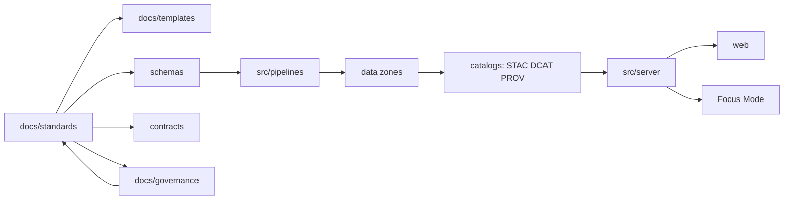
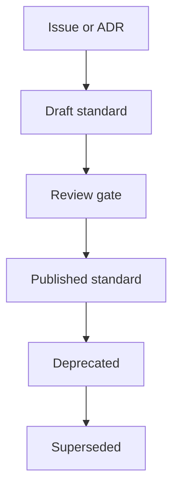

<!-- [KFM_META_BLOCK_V2]
doc_id: kfm://doc/5bb62de2-4e6f-4723-9cc2-2fee8419b5b3
title: docs/standards README
type: standard
version: v1
status: draft
owners: Standards WG (TBD)
created: 2026-02-24
updated: 2026-02-28
policy_label: public
related:
  - ../MASTER_GUIDE_v13.md
  - ../governance/REVIEW_GATES.md
  - ./KFM_REPO_STRUCTURE_STANDARD.md
tags: [kfm, standards]
notes:
  - Entry point for governed standards and profiles.
  - Upgrade pass: clarify normative language, lifecycle, and change control.
  - Update owners/links when repo governance roles are finalized.
[/KFM_META_BLOCK_V2] -->

# docs/standards
Governed standards, profiles, and protocols that constrain **how KFM artifacts are authored, validated, and promoted**.


<!-- TODO: Replace badges with repo-specific CI/status badges once paths are known -->

**Owners:** Standards WG (TBD)  
**Applies to:** docs, templates, schemas, dataset specs, run receipts, story nodes, governed APIs

---

## Quick navigation
- [Purpose](#purpose)
- [Normative language and status model](#normative-language-and-status-model)
- [How this fits in the repo](#how-this-fits-in-the-repo)
- [Standards registry](#standards-registry)
- [Directory layout](#directory-layout)
- [How to use these standards](#how-to-use-these-standards)
- [Change control](#change-control)
- [Adding or updating a standard](#adding-or-updating-a-standard)
- [Governance and review](#governance-and-review)
- [Appendix](#appendix)

---

> [!WARNING]
> Standards are **normative**. Changes here can break pipelines, schemas/contracts, and governed outputs.  
> Follow the repo’s review gates before merging changes.

---

## Purpose
This directory exists to:
- Define **canonical formats** (e.g., metadata profiles) used across KFM.
- Reduce “repo drift” by giving every subsystem a single, governed source of truth.
- Provide **profiles** (STAC/DCAT/PROV) and other protocols that downstream systems can validate against.
- Keep claims, provenance, and policy controls **machine-checkable**.

> [!NOTE]
> If a document in this directory conflicts with a template, ADR, or “how-to”, **the standard wins** (or the conflict must be resolved before promotion).

---

## Normative language and status model

### Normative keywords
Standards use the following keywords consistently:
- **MUST** / **MUST NOT**: required for compliance; CI SHOULD enforce where feasible.
- **SHOULD** / **SHOULD NOT**: strongly recommended; deviations require rationale.
- **MAY**: optional behavior.

> [!TIP]
> If a requirement cannot be validated automatically yet, keep it **MUST**, but add:
> 1) a `TODO(ci)` describing the intended check, and  
> 2) a “manual verification” step in the standard.

### Document status meanings
| Status | Meaning | Expectations |
|---|---|---|
| `draft` | Proposed, still changing | Not relied on for promotion unless explicitly required by gates |
| `review` | Under formal review | Changes are high-scrutiny; reviewers focus on blast radius |
| `published` | Stable, normative | Changes require versioning/deprecation (no silent breaking edits) |
| `deprecated` | Still supported, discouraged | Replacement path exists; timeline communicated |
| `superseded` | Replaced by a newer standard | Link to successor and migration guidance |

---

## How this fits in the repo
Standards are one layer of the trust membrane: they define what’s allowed/required, and everything downstream implements + validates it.



**Rule of thumb:**
- Use **standards** when defining **what is allowed/required** across the system.
- Use **templates** when providing **how to author** repeatable artifacts that must comply with standards.
- Use **schemas/contracts** when requirements must be **machine-validated** (and consumed by code).

---

## Standards registry
> [!NOTE]
> This table is intended to mirror the **v13 documentation map**. If any link is missing in your branch, update the registry (or update the repo to match the standard layout).

| Standard | What it governs | Primary consumers | Status | CI enforcement |
|---|---|---|---|---|
| [`KFM_MARKDOWN_WORK_PROTOCOL.md`](./KFM_MARKDOWN_WORK_PROTOCOL.md) | Markdown authoring conventions for governed docs | doc authors, reviewers, tooling | TBD | TBD |
| [`KFM_REPO_STRUCTURE_STANDARD.md`](./KFM_REPO_STRUCTURE_STANDARD.md) | Canonical repo layout + invariants (what must exist, where) | all contributors, CI, tooling | TBD | TBD |
| [`KFM_STAC_PROFILE.md`](./KFM_STAC_PROFILE.md) | KFM metadata profile for STAC (structure + required fields) | data catalog, ingestion pipelines | TBD | TBD |
| [`KFM_DCAT_PROFILE.md`](./KFM_DCAT_PROFILE.md) | KFM metadata profile for DCAT | publishing layer, catalogs, policy boundary | TBD | TBD |
| [`KFM_PROV_PROFILE.md`](./KFM_PROV_PROFILE.md) | KFM provenance profile for PROV (lineage + transform tracing) | pipelines, audit, Focus Mode citations | TBD | TBD |

---

## Directory layout
```text
docs/standards/                                         # Non-negotiable standards (CI-enforced where configured)
├─ README.md                                            # Index + how standards are reviewed/updated (high bar)
│
│  # Root entrypoints (keep these stable for discoverability + existing links)
├─ KFM_MARKDOWN_WORK_PROTOCOL.md                        # Markdown authoring protocol (formatting, lint, doc hygiene)
├─ KFM_REPO_STRUCTURE_STANDARD.md                       # Canonical repo layout + invariants (what must exist, where)
├─ KFM_STAC_PROFILE.md                                  # STAC profile constraints (required fields, links, assets rules)
├─ KFM_DCAT_PROFILE.md                                  # DCAT profile constraints (dataset/distribution, licensing, vocab)
├─ KFM_PROV_PROFILE.md                                  # PROV profile constraints (lineage prerequisites, run linkage, IDs)
│
│  # Machine-readable registry (lets CI validate links/status/owners; README can mirror it)
├─ registry/
│  ├─ README.md                                         # What the registry is + how it’s updated
│  ├─ standards.registry.yaml                            # Canonical inventory: id/title/path/status/owners/consumers
│  └─ deprecations.yaml                                  # What’s deprecated, why, and replacement pointers
│
│  # Authoring standards beyond “Markdown protocol”
├─ authoring/
│  ├─ README.md                                         # Scope + exclusions for authoring standards
│  ├─ KFM_META_BLOCK_V2_STANDARD.md                     # MetaBlock v2 field rules + required keys + examples
│  ├─ KFM_NORMATIVE_LANGUAGE_STANDARD.md                # MUST/SHOULD/MAY + CONFIRMED/PROPOSED/UNKNOWN tagging rules
│  ├─ KFM_CITATION_PROTOCOL.md                          # Evidence citation format + link hygiene + “cite-or-abstain”
│  ├─ KFM_DIAGRAM_MERMAID_STANDARD.md                   # Mermaid style constraints (naming, layout, allowed constructs)
│  └─ examples/
│     ├─ good/                                          # Example docs that conform (golden fixtures)
│     └─ bad/                                           # Example docs that violate (used by linters/tests)
│
│  # Repo mechanics standards (layout is entrypoint; this holds “how we change the repo safely”)
├─ repo/
│  ├─ README.md                                         # Scope + exclusions for repo standards
│  ├─ KFM_BRANCHING_RELEASE_STANDARD.md                 # Branching, release tagging, doc promotion cadence
│  ├─ KFM_VERSIONING_DEPRECATION_STANDARD.md            # Breaking change policy, deprecation windows, migration guidance
│  └─ examples/
│     └─ repo_trees/                                    # Sample trees used by validation tooling/docs
│
│  # Catalog + triplet standards (STAC/DCAT/PROV are entrypoints; this is the “system glue”)
├─ catalog/
│  ├─ README.md                                         # How catalog standards relate to schemas/ and tooling
│  ├─ triplet/
│  │  ├─ KFM_TRIPLET_LINKING_STANDARD.md                # DCAT↔STAC↔PROV cross-linking invariants + IDs + receipts linkage
│  │  └─ examples/
│  │     ├─ minimal_triplet/                            # Minimal passing set (good for tests)
│  │     └─ complex_triplet/                            # Multi-collection / multi-distribution examples
│  ├─ stac/
│  │  ├─ README.md                                      # STAC addenda: mapping notes, local conventions
│  │  ├─ CONFORMANCE.md                                 # What checks exist, what “fail closed” means, where they run
│  │  └─ examples/
│  ├─ dcat/
│  │  ├─ README.md                                      # DCAT addenda: mapping notes, local conventions
│  │  ├─ CONFORMANCE.md
│  │  └─ examples/
│  └─ prov/
│     ├─ README.md                                      # PROV addenda: run receipts, lineage, transform tracing rules
│     ├─ CONFORMANCE.md
│     └─ examples/
│
│  # Policy-facing standards that must remain stable across APIs/UI/Focus Mode
├─ policy/
│  ├─ README.md                                         # Scope: policy labels + obligations interface (not Rego itself)
│  ├─ KFM_POLICY_LABEL_STANDARD.md                      # policy_label taxonomy + propagation rules
│  ├─ KFM_REDACTION_OBLIGATIONS_STANDARD.md             # obligation types + UI/API enforcement requirements
│  └─ examples/
│     ├─ public/                                        # public-safe examples
│     └─ restricted/                                    # redaction obligation examples (no sensitive specifics)
│
│  # Evidence standards (ties provenance + citations + “show your work” UX)
├─ evidence/
│  ├─ README.md                                         # Scope: EvidenceRef/EvidenceBundle rules
│  ├─ KFM_EVIDENCE_REF_STANDARD.md                      # EvidenceRef shape, required fields, resolvable targets
│  ├─ KFM_EVIDENCE_BUNDLE_STANDARD.md                   # Bundle assembly, redaction rules, citation binding
│  ├─ KFM_RUN_RECEIPT_STANDARD.md                       # Run receipts minimum fields + linkage to triplet/catalog
│  └─ examples/
│
│  # Governed API contract conventions (how contracts express policy + evidence)
├─ api/
│  ├─ README.md                                         # How to author API-facing standards (links to contracts/)
│  ├─ KFM_API_CONTRACT_EXTENSION.md                     # Common fields: policy/evidence/timestamps/error envelope
│  ├─ KFM_ERROR_MODEL_STANDARD.md                       # Error codes, “safe details”, trace IDs, user-facing messages
│  ├─ KFM_PAGINATION_FILTERING_STANDARD.md              # Paging + filtering semantics (time-aware + map queries)
│  └─ examples/
│
│  # UI-facing standards (normative UX constraints; not design proposals)
├─ ui/
│  ├─ README.md                                         # Scope: evidence-first UX requirements + exclusions
│  ├─ KFM_STORY_NODE_STANDARD.md                        # Story node schema rules (where it lives + how it’s validated)
│  ├─ KFM_EVIDENCE_FIRST_UX_STANDARD.md                 # UI requirements for traceability + “why” panes
│  └─ accessibility/
│     └─ KFM_A11Y_MINIMUM_STANDARD.md                   # Minimum a11y constraints for governed UI
│
└─ _archive/                                            # Deprecated/old versions (never referenced by CI)
   ├─ README.md                                         # How/when to archive; linking rules
   └─ 2026-02-xx/                                       # Date- or version-bucketed snapshots
```

### Acceptable inputs
This directory is the canonical home for:
- **Profiles** (STAC/DCAT/PROV) and validation rules
- **Authoring protocols** (markdown/document conventions)
- **Repo structure standards**
- **Ontology / controlled vocabulary protocols** (when applicable)
- **Change-control rules** for standards themselves (versioning/deprecation)

### Exclusions
Do **not** put these here:
- One-off design documents or proposals (use `docs/architecture/` or ADRs)
- Story content (use `docs/reports/story_nodes/`)
- Source code (use `src/`)
- Schemas themselves (use `schemas/`), unless a standard explicitly *is* the schema

---

## How to use these standards
1. **Start from the governing standard**
   - Example: writing a dataset spec or profile? Start with the relevant profile in this directory.
2. **Use templates for authoring**
   - If there’s a template in `docs/templates/`, author via the template and ensure compliance here.
3. **Validate early**
   - Add/extend checks so CI can fail closed when a standard is violated (preferred over manual policing).
4. **Prefer additive change**
   - Add a new version or an extension before breaking existing contracts.
5. **When you must deviate**
   - Capture rationale, scope, and expiration (when the deviation ends), and link it to governance.

---

## Change control
Standards changes are governed because they can alter what becomes publishable and how policy is enforced.

### Change types
- **Clarification-only:** wording/formatting that does not change requirements.
- **Additive:** new optional capability, new examples, new checks.
- **Breaking:** changes to requirements, schemas, contracts, or promotion behavior.

> [!WARNING]
> If you can’t confidently classify the change as “clarification-only” or “additive”, treat it as **breaking**.

### Lifecycle sketch


### Versioning rules
- **Published standards are stable:** avoid silent breaking edits.
- For breaking changes, prefer **new versions** or **successor documents**, and include migration guidance.
- Keep explicit **deprecation windows** when consumers exist (timeboxed when possible).

---

## Adding or updating a standard

### Minimum checklist
- [ ] Document includes a MetaBlock v2 header (see appendix) with correct `policy_label`
- [ ] Standard clearly states its **scope** and **non-goals**
- [ ] Standard includes **requirements** using MUST/SHOULD/MAY
- [ ] Standard includes **examples** (good + bad) where practical
- [ ] Change includes **migration guidance** if it breaks consumers
- [ ] CI/tooling hooks are updated (or a TODO is filed with an owner)
- [ ] Links updated: registry + any affected templates/schemas/contracts

### Suggested PR structure
- **What changed:** short summary
- **Why:** rationale + tradeoffs
- **Blast radius:** what systems need to be retested
- **Verification:** commands or steps to confirm compliance
- **Governance:** policy implications, sensitivity/sovereignty impact (if any)

---

## Governance and review
Standards should be reviewed with extra rigor because they:
- influence validation/promotion gates,
- affect how policy is enforced,
- may change what becomes publishable.

**When in doubt:** default-deny (tighten constraints), then explicitly loosen with rationale.

---

## Appendix

### MetaBlock v2 reminder
KFM docs use **MetaBlock v2** for structured metadata (instead of YAML frontmatter). Copy/paste and fill:

```text
<!-- [KFM_META_BLOCK_V2]
doc_id: kfm://doc/<uuid>
title: <Title>
type: standard
version: v1
status: draft|review|published
owners: <team or names>
created: YYYY-MM-DD
updated: YYYY-MM-DD
policy_label: public|restricted|...
related:
  - <paths or kfm:// ids>
tags: [kfm]
notes:
  - <short notes>
[/KFM_META_BLOCK_V2] -->
```

---

<p align="right"><a href="#docsstandards">Back to top</a></p>
