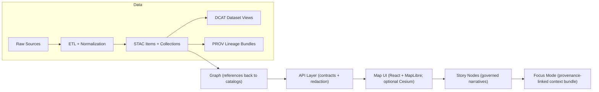

# 📏 KFM Standards (Governed) ✅

> **Standards = “what must be true”** (normative).  
> If something is *required* for KFM correctness, provenance, sovereignty, safety, or interoperability — it belongs in **`docs/standards/`**.

---

## 🧭 Quick Links

- 📘 **Master Guide (Canonical)**: [`docs/MASTER_GUIDE_v13.md`](../MASTER_GUIDE_v13.md)
- ⚖️ **Governance & Review Gates**: [`docs/governance/`](../governance/)
- 🧩 **Templates (Write docs the KFM way)**: [`docs/templates/`](../templates/)
- 🧪 **Schemas (Machine validation source)**: [`schemas/`](../../schemas/)
- 🗂️ **Data boundary artifacts**: [`data/stac/`](../../data/stac/) · [`data/catalog/dcat/`](../../data/catalog/dcat/) · [`data/prov/`](../../data/prov/)

---

## 🧠 What “Standards” Mean in KFM

KFM is built around **contract-first**, **evidence-first**, and a **deterministic pipeline**:

- **Contract-first**: schemas and API contracts are first-class artifacts; changes require versioning + compatibility checks.
- **Evidence-first**: every claim shown in UI/narratives must trace back to governed evidence.
- **Deterministic pipeline**: ETL is idempotent + config-driven + logged; same inputs ⇒ stable outputs.

These principles are enforced through **standards docs**, **schemas**, and **CI gates**.

---

## 🚦 Non‑Negotiables

### 1) Canonical pipeline ordering (no leapfrogging)
**ETL → STAC/DCAT/PROV catalogs → Graph → APIs → UI → Story Nodes → Focus Mode**

If a feature attempts to bypass a stage (ex: UI reading directly from “processed” files, or narratives not linked to evidence), it’s non-compliant.

### 2) “Published” data requires boundary artifacts
A dataset is not considered published until its boundary artifacts exist:

- **STAC** items/collections (spatial + temporal indexing)
- **DCAT** dataset entries (discovery + distribution)
- **PROV** bundles (lineage)

These artifacts are the “handoff contract” to downstream stages (graph/API/UI).

### 3) Focus Mode safety baseline
Focus Mode operationalizes: **“no new narrative without sources, no data without provenance.”**  
AI assistance (if used) must be **opt‑in**, **labeled**, and must not leak sensitive locations.

---

## 📚 Standards Index (This Folder)

> Keep this list tight and authoritative. If you add a new standard, add it here.

| 📄 Standard | Purpose | When to read |
|---|---|---|
| **[`KFM_MARKDOWN_WORK_PROTOCOL.md`](./KFM_MARKDOWN_WORK_PROTOCOL.md)** | Authoring rules for governed docs (front‑matter, claims, structure, linking) | Writing/editing docs or Story Nodes |
| **[`KFM_REPO_STRUCTURE_STANDARD.md`](./KFM_REPO_STRUCTURE_STANDARD.md)** | Canonical folder layout + “one home per subsystem” | Creating/moving folders, adding domains |
| **[`KFM_STAC_PROFILE.md`](./KFM_STAC_PROFILE.md)** | KFM-required STAC fields + extensions | Adding geospatial assets / STAC |
| **[`KFM_DCAT_PROFILE.md`](./KFM_DCAT_PROFILE.md)** | KFM-required DCAT dataset/distribution fields | Publishing datasets for discovery |
| **[`KFM_PROV_PROFILE.md`](./KFM_PROV_PROFILE.md)** | KFM-required provenance model + fields | Any transformation / derived output |

---

## 🗂️ What Belongs Here vs Elsewhere

✅ Put it in `docs/standards/` if it is:
- A **must-follow** rule for system integrity (pipeline ordering, provenance requirements, security gates).
- A **profile** or **spec** (STAC/DCAT/PROV/StoryNode/UI config).
- A **definition** of required validations (what CI must check, and why).

🚫 Don’t put it here if it is:
- **How-to guides / runbooks** → `docs/` or `docs/data/<domain>/`
- **Design proposals / rationale** → `docs/architecture/` (and ADRs)
- **Templates** → `docs/templates/`
- **Policies / ethics / sovereignty / review gates** → `docs/governance/`

---

## 🗺️ Canonical Flow (Reference Diagram)

---

## ✅ Definition of Done for Any Standard Doc

A standards PR is not “done” until:

- ✅ **Front-matter is complete and valid** (and follows the template rules)
- ✅ **Claims link to datasets/schemas/sources** (no “trust me” statements)
- ✅ **Validation steps are listed and repeatable**
- ✅ **Governance + FAIR/CARE + sovereignty considerations are explicit**
- ✅ **Schemas/tests updated** (if the standard changes machine-validated behavior)

> Tip: If you can’t point to the exact schema/test/validator enforcing the rule, the rule is not “real” yet.

---

## 🧪 Validation & CI Expectations

KFM CI should (at minimum) enforce:

- 🧾 **Front‑matter & Markdown protocol checks**
- 🔗 **Link/reference validation** (no broken internal links, no missing refs)
- 🧩 **Schema validation** for STAC/DCAT/PROV (+ Story Nodes and UI config if applicable)
- 🧠 **Graph integrity tests** (constraints, ontology expectations, fixture loads)

If standards require validation, CI must be updated accordingly.

---

## 🧱 Data + Pipeline Standards (Quick Checklist)

When adding a dataset or “evidence artifact”:

1. 📥 Place source files under `data/<domain>/raw/` *(read-only snapshots)*
2. 🧰 Use `data/<domain>/work/` for intermediate outputs
3. 📦 Write final outputs to `data/<domain>/processed/`
4. 🧾 Generate metadata:
   - `data/stac/collections/` + `data/stac/items/`
   - `data/catalog/dcat/`
   - `data/prov/`
5. 🧠 (Optional) Load derived entities into the graph **with explicit provenance**
6. 🔌 Expose through governed APIs (redaction/classification happens here)
7. 🗺️ UI and Story Nodes consume **only provenance-linked** content

---

## 🧷 Change Management (Standards Versioning)

Standards are contracts. Changing a contract is serious.

**Rules of thumb:**
- 🔁 **Backward-compatible** changes: additive fields, relaxed validation, clarifications → minor version bump
- 💥 **Breaking** changes: required field changes, renamed semantics, removed behavior → major version bump + migration plan
- 🧊 Deprecations: mark as deprecated, provide replacement path, and set a removal milestone

When in doubt: write an ADR in `docs/architecture/adr/` and link it from the standard.

---

## 🧾 Mini Glossary

- **Catalogs**: STAC (assets), DCAT (dataset discovery), PROV (lineage)
- **Contract artifact**: schema/spec that defines an interface (JSON Schema, OpenAPI, etc.)
- **Evidence artifact**: derived output treated as a dataset with STAC/DCAT + PROV
- **Story Node**: governed narrative document with citations to cataloged evidence
- **Focus Mode**: UI mode that only shows provenance-linked content (no unsourced narrative)

---

## 🤝 Contributing to Standards

1. 🔎 Identify the correct standard (or propose a new one)
2. 🧩 Update schemas/validators/tests **with** the doc change
3. 🧪 Ensure CI gates cover the new rule
4. 🧾 Add/update an ADR for non-trivial changes
5. ✅ Update this README index if you add a new standard

---

## 📌 Roadmap Hooks (Optional)

- Add missing profile placeholders if referenced by CI but not implemented
- Build/extend validators in `tools/` and wire into `.github/workflows/`
- Maintain a “Standards Changelog” section per file for auditability

---